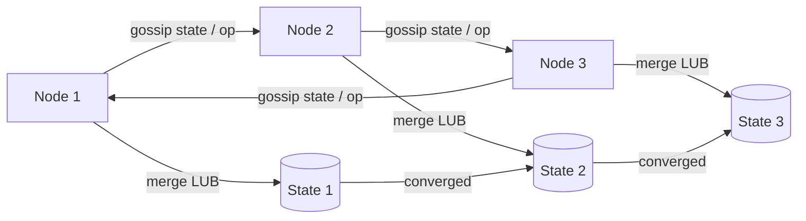

# CRDTs

## 1. One-Line Definition
A CRDT (Conflict-free Replicated Data Type) is a data structure whose replica copies always converge to the same value after any sequence of concurrent updates — because its operations commute, are associative, and are idempotent — so replicas can merge without leader arbitration or lock-based conflict resolution.

## 2. Why Do We Need It?
In multi-region, offline-capable, or replica-first systems, two replicas apply writes concurrently and the network cannot guarantee the order they arrive in. The classic answer is conflict resolution (last-writer-wins, explicit merges), which is fiddly and can lose data. CRDTs flip the problem: design the operation semantics so that *any* interleaving yields the same final state. This gives automatic conflict-free convergence — useful for collaborative docs, distributed counters, caches of votes, config maps, and multi-editor state where locks are unacceptable.

## 3. Simple Intuition
A whiteboard where everyone has a marker. Instead of asking "who wrote last", the rules make marking *additive*: everyone may add words, and additions never erase what another wrote (append-only sticky notes). When two people write at the same time, both notes are simply stuck on — both remain. Counters count up forever (votes); the group never argues about the total once all the tallies have arrived.

## 4. What Happens Without It?
Two servers increment the same counter redundantly and the losing update vanishes. A config map's last-writer-wins silently discards a team's whole key. Collaborative editing necromances deleted text. Call flow — every write funnels through a leader or a lock — becomes the availability ceiling and a partition magnet. Each replica's local state looks right, but a merge later exposes a divergent mess that a human must reconcile.

## 5. Core Idea
- **Three algebraic laws do the work:** *commutativity* (A+B = B+A), *associativity* (A+B+C in any grouping), *idempotency* (A+A = A). If every replica's "merge" is a binary operation with these laws, all replicas converge regardless of order, duplication, or concurrency.
- **State vs operation (CvRDT vs CmRDT):** state-based CRDTs (CvRDT) merge *entire states* (merge = least-upper-bound in a join-semilattice); operation-based (CmRDT) broadcast *operations* that commute. State-based tolerates message loss and duplication; operation-based is smaller but requires reliable, ordered delivery.
- **The merge is a join:** state after merge is the least value that is an upper bound of both — effectively "take both" (grow-only sets) or "add both deltas" (counters). Deletes are the hard part (they need tombstones/negative state).
- **Classic types:** GCounter (sum of per-replica adds — grows only), PNCounter (GCounter of positives plus GCounter of negatives for increments+decrements), GSet (grow-only set), 2P-Set (add/lookup with remove tombstones), LWW-Register, OR-Set, RGA/LWW-Element-Set for rich text.
- **Order independence is the whole point:** no total order, no last-writer-wins ambiguity, no locks — just a deterministic merge rule. The cost: operation/data semantics often preclude "set to a value" without history (why registers are the awkward LWW case).

## 6. Important Terminology

| Term | Simple Meaning |
|------|----------------|
| CvRDT / state-based | Merge full states; join-semilattice mathematics |
| CmRDT / operation-based | Broadcast commuting ops; needs reliable delivery |
| Lattice | Set with a partial order and a unique least-upper-bound |
| Merge / LUB | Combine two states into the smallest covering state |
| Tombstone | Retained marker so a delete can be merged later |
| GCounter | Grow-only counter (adds only, no decrement) |
| PNCounter | Allows increments AND decrements via two GCounter halves |
| LWW-Register | Set-value-with-timestamp; later timestamp wins |
| OR-Set | Observed-remove set — remove only removes seen elements |
| Idempotent | Applying the same op twice changes nothing |

## 7. Basic Architecture



## 8. Request or Data Flow
1. Each node applies its own local write to its CRDT (e.g., increment its own component of a counter; add to its delta set).
2. State-based: the node merges periodically with peers (gossip) or sends a state snapshot; operation-based: it broadcasts the op to all replicas reliably.
3. A receiving node merges by joining the two states (GCounter sums component-wise; sets union with versioned tombstones).
4. Because merge is deterministic and order-independent, every replica converges to the same value once mutual exchange completes — even if ops arrived differently.
5. Reads happen locally at any replica; the value is correct (empty-if-not-merged) or at least as recent as the last merge.

## 9. Practical Example
**Distributed analytics counter for "likes" aggregated across 12 event consumers:**
- Use a PNCounter: each consumer owns an entry in an array (index = worker id) and only touches its own cell. Like → +1 to its positive half; unlike → +1 to its negative half.
- Merging = cell-wise sum of the two arrays; commutative, associative, and idempotent by construction.
- Replicas converge to the same "net likes" value regardless of which consumer heard which event or how many times, because counters only ever add delta and merge is a sum.
- Contrast with an LWW "likes = someone's latest count" — that is last-writer-wins, and it silently drops racing updates.

## 10. Scaling
- **Merge cost grows with state size:** state-based merges exchange whole states; partition into per-node components and exchange only the diff (delta-CRDTs / version vectors bound the transfer).
- **Write scaling is unlimited:** every node writes locally with no coordination — the counters-only hot paths stay lock-free; the balance of correctness is your convergence and state size.
- **Tombstones are a retention tax:** every delete forever keeps a marker, so long-lived address books accrete state; periodic compaction requires simultaneous compaction of all replicas (stop-the-world) — the classic "remove is expensive" rule.
- **Cross-DC:** works naturally — replicas in different regions merge via periodic gossip or CDC-fed event streams; latency of convergence is the inter-region merge cadence.

## 11. Reliability and Failure Scenarios

| Failure | What Happens | Detection | Recovery | Trade-off |
|---------|--------------|-----------|----------|-----------|
| Node never merges | Its state falls behind | Version/clock lag | Merge on reconnect | eventual, not instant |
| Message lost / duplicated (op-based) | Ops missing or doubled | Idempotency check | Rely on commutative/idempotent op semantics | op-based needs ordered delivery |
| Tombstone growth | State balloons | Size metric | Full compaction with all replicas | freeze during compaction |
| Region partition | Deltas not exchanged | Gossip absence | Merge later via queue | convergence window grows |
| Crash during merge | Half-merged state? | Checksum atomicity | Merge ops atomic at the state store | need atomic local commit |

## 12. Consistency and Correctness
- **Strong eventual consistency (SEC):** replicas that have merged the same set of updates are identical — stronger than plain eventual consistency; no resolution rule, no arbitration.
- **No total order is ever consulted:** the merge never waits for ordering or for a leader, which is exactly why partition tolerance is free.
- **LWW registers are the weak point:** "later timestamp wins" reintroduces clock dependence and loses concurrent writes — prefer OR-Set semantics for actual data.
- **Deletes need tombstones or observed-remove logic;** a naive "remove all copies of X" breaks convergence (one replica's remove races another's add).
- **Idempotency is baked in:** applying the same op or merging the same state twice changes nothing — which is what makes gossip's duplicates harmless here.

## 13. Performance
- Local write: O(1)-ish (touch your own component); read: O(components) for counters, O(state) for sets.
- Merge: small for counters (cell-wise), large for sets with tombstones (full pass).
- No network on the write path — that is the scalability story: writes are always cheap, network is only the anti-entropy merge cadence.
- Operation-based variants cut merge size (op vs full state) but demand exactly-once/ordered delivery — usually a Kafka-style ordered stream.

## 14. Security
Merges must not accept unauthenticated writes: an attacker who can inject a GCounter increment or a set add can monotonically raise values or add arbitrary members. Authenticate replication streams and gossip digests, and validate payload schema before merging. Tombstones and state are self-tainting if a malicious op enters any branch — secure the entry points, team.

## 15. Trade-Offs

| Choice | Advantages | Disadvantages | When to Use |
|--------|------------|---------------|-------------|
| State-based (CvRDT) | Tolerates loss/duplication, simple merges | Bigger payloads, state growth | Gossip/Cassandra-style anti-entropy |
| Operation-based (CmRDT) | Tiny payloads, low merge cost | Needs reliable delivery/order | Kafka-fed counters, gas-meters |
| LWW-Register / most registers | Simple, human-intuitive result | Loses concurrent writes, clocks | Timestamps where overwrite is fine |
| OR-Set / observed-remove | Respects concurrency, supports deletes | Tombstone tax, complexity | Docs, configs, collaborative editors |
| 2P-Set / GSet | Trivially convergent | No re-adds / no deletes | Whitelists, add-only allowlists |

## 16. Common Mistakes
- Believing CRDTs make *any* data conflict-free — only operations with the three laws are safe; "last write wins" fields quietly break it.
- Using LWW with real wall-clock timestamps for edits — a clock skew decides a user's data forever.
- Naive deletes without tombstones — the remove/add race resurrects values.
- Snubbing merge atomicity: a log-structured state that merges non-atomically can glitch between two valid states.
- Ignoring state size growth from tombstones in long-lived systems.

## 17. HLD vs LLD Boundary
HLD: choose CRDT as the data type (counter vs set vs register), decide state-vs-op flavor, the merge/anti-entropy transport, retention policy (tombstone TTL), and the convergence SLA. LLD: the lattice definition, per-node component indexing, merge ordering, tombstone compaction protocol, and the transport encoding.

## 18. Interview Questions

### Beginner
- What is a CRDT, and what three algebraic properties make it conflict-free?
- What is the difference between state-based and operation-based CRDTs?
- Why does a GCounter never need locks even across replicas?

### Intermediate
- Design a liked-count feature (both likes and unlikes) with a PN-Counter — walk the merge.
- Why does a naive "remove element X" break convergence, and what does an OR-Set do instead?
- When is an LWW-Register dangerous? Give a concrete harm.

### Advanced
- Design a collaborative document state as a set of CRDTs; explain the ordering you still need and what you avoid.
- Your counter merges over a Kafka topic: pick state-based or operation-based and justify against your delivery semantics.
- How do tombstones bound scalability, and what is the compaction story across replicas?

## 19. Interview Memory Summary

> [!abstract]- Interview Memory Summary
> ### Remember
> - CRDT = commutative + associative + idempotent merges → all replicas converge.
> - State-based (CvRDT) merges whole states; operation-based (CmRDT) needs reliable ordered delivery.
> - Merge = least upper bound in a join-semilattice — "take both", never "pick a winner".
> - GCounter adds only; PNCounter = two counters for up/down; OR-Set removes only observed elements.
> - Deletes need tombstones — the remove/add race is the classic erosion of convergence.
> - No locks, no leader, no total order — partition tolerance is free.
> - LWW registers are the pitfall: clock-dependent, data-losing.
> - Write path stays cheap; the tax is state size and tombstone growth.
>
> ### 30-Second Explanation
>
> A CRDT makes replicas converge without coordination because its merge anywhere, anytime, in any order produces the same value: the operations commute, associate, and idempot. Merges are joins — take both — so counters sum per-node deltas and sets union with tombstones. That buys partition-tolerant, eventually-consistent correctness with lock-free writes; you pay in state size (tombstones) and in the ban on plain "set to value" semantics. Choose type (counter/set/register) by your conflicts, the transport by your ordering guarantees.
>
> ### Interview Traps
>
> - Saying CRDTs solve all consistency — only data with the right algebra is safe.
> - Using LWW with wall clocks and calling it conflict-free.
> - Forgetting tombstone growth and claiming "deletes are free".
> - Confusing idempotent-with-an-insert and idempotent-with-a-merge.
> - Claiming help for your op-based CRDT without exactly-once delivery.
>
> ### Key Trade-Off
>
> You trade strong, centralized consistency for automatic, lock-free convergence — gaining availability and simplicity (no arbitration, no conflict handling) at the cost of no true deletes, growing state, and no total order.

## 20. Related Concepts

### Prerequisites

- [[strong-vs-eventual-consistency|Strong vs Eventual Consistency]] — SEC is the goal CRDTs formalize.
- [[cap-theorem|CAP Theorem]] — the partition hand CRDTs play with.
- [[normalization-vs-denormalization|Normalization vs Denormalization]] — replicated state's shape.

### Commonly Used Together

- [[gossip-protocol|Gossip Protocol]] — the transport that reliably merges states.
- [[exactly-once-effect|Exactly-Once Effect]] — idempotent ops remove the need for dedupe.
- [[distributed-transactions|Distributed Transactions (2PC / Saga)]] — the alternative for stricter guarantees.
- [[consistent-hashing|Consistent Hashing]] — per-node components on a ring.

### Alternatives

- [[distributed-locks|Distributed Locks]] — exclusion instead of convergence.
- [[raft-and-paxos|Raft and Paxos]] — order instead of merge; stronger but slower.
- [[distributed-transactions|Distributed Transactions (2PC / Saga)]] — atomicity instead of eventual consistency.

### Advanced Concepts

- [[bft|Byzantine Fault Tolerance]] — malicious replica merging.
- [[exactly-once-effect|Exactly-Once Effect]] — CRDT idempotency vs true exactly-once.

Related planned topics (not authored yet): delta-CRDTs, RGA vs LWW-Element-Set for text editing, lattice taxonomy.

## 21. References
Shapiro, Preguiça, Baquero, Zawirski, "Conflict-free Replicated Data Types" (2011) — the definitive paper. Baquero et al. on delta-CRDTs. Kleppmann & Beresford, "A Conflict-Free Replicated JSON Datatype" (2017). Preguiça et al., "Automerge" background. Verify current state against academic reprints and library docs (Yjs, Automerge, Riak data types).

## 22. Active Recall

Test yourself before revealing each answer.

> [!question]- Why does a GCounter separate its state per replica instead of just one total?
> Because concurrent increments land on different replicas before merging. Each replica owns a cell and only increments its own; a merge sums cells. Since only the owning replica writes each cell, two replicas can never increment the same cell concurrently — the merge arithmetic needs no ordering or winner. That is the trick: structure state so concurrent writes are disjoint.

> [!question]- What happens if you remove element X from a GSet?
> There is no remove — grow-only. A plain "remove" on a merged-replica set is not an operation in the algebra, and any replica that hasn't seen the removal can resurrect X forever on the next merge. A 2P-Set solves it with a second remove-set the removal joins into; a GSet stays add-only by design for use cases like allowlists.

> [!question]- Design decision: counters over a Kafka topic — state-based or operation-based?
> Operation-based, because Kafka gives exactly-once/ordered per-partition delivery — exactly the reliability an op-based CRDT needs. Payloads are small (increment ops) instead of full state snapshots. Pure state-based would also work but would move whole states across the topic; pick op-based when the transport already guarantees repeat-of-execution semantics.

> [!question]- Where does an LWW-Register actually lose data, and what causes it?
> Two replicas write different values concurrently. Each merge keeps the one whose timestamp is higher. If replica clocks skew (or the slower writer's value is older), the "loser" is silently discarded even though a user typed it later. Wall-clock LWW is data loss by clock race. OR-Set or per-field CRDTs avoid the loss; LWW is only safe when overwrite is the intended semantics.

> [!question]- How do tombstones both enable and tax an OR-Set?
> To make remove convergent, a removal must be remembered (tombstone) so a late-arriving add of the same element does not re-add it on another replica. Result: the set's state grows monotonically with every removed element forever. Compaction requires every replica to agree it has seen the tombstone — a coordinated global disk free that costs availability planning.

> [!question]- Interview scenario: two editors offline merge a doc and lose a user's paragraph. What CRDT decision went wrong?
> Either the paragraph was modeled as an LWW override instead of append-only inserts, or removes were applied without tombstones, letting the other replica's add resurrect-then-drop it. Fix: model text as insert-only/OR-Set content with tombstones and per-character metadata, so concurrent edits merge as unions — the paragraph survives.

> [!question]- Does a CRDT need network ordering of updates to converge? Why or why not?
> No. Commutative, associative, idempotent ops merge correctly in any arrival order, and state-based merges tolerate loss and duplication outright. Network ordering only matters for operation-based variants, where the transport must be ordered/exactly-once, and even then it is a delivery requirement, not a convergence requirement.

> [!question]- Why are CRDTs considered strongly eventually consistent, not just eventually?
> Eventual consistency, informally, promises convergence eventually; SEC makes the statement precise: two replicas that have observed the same set of updates have *identical* state — no conflict resolution step, no ambiguous remainder. The algebraic merge guarantees the identical-state property, which is stronger than "converges in the common case".

## 23. When Should I Use This?

### Use it when

- Multiple replicas write the same data with no acve coordinator or lock.
- Updates are naturally commutative (counters, sets, appends, votes).
- Partition tolerance and offline/device operation are requirements.
- You accept eventual consistency with a deterministic merge rule.

### Avoid it when

- Updates are true overwrites ("set to value, later is right") — LWW registers sneak back in.
- A global total order is genuinely required (banking ledgers with strict serializability).
- State size/tombstone growth cannot be managed or purged.
- Your transport cannot deliver ops reliably/ordered for operation-based design.

### What problem does it solve?

Automatic conflict resolution at the data structure level: replicas converge without locks, leaders, or last-writer-wins ordering, even during partitions and offline operation.

### What problem does it NOT solve?

Strong consistency, real ignores of the "set to value" read-modify-write pattern, unbounded history, or security — authentication and schema validation are still gate-keeping.

## 24. Decision Connections

Decisions that go together with CRDTs:

- [[gossip-protocol|Gossip Protocol]] — the state-merging transport that pairs with state-based CRDTs.
- [[strong-vs-eventual-consistency|Strong vs Eventual Consistency]] — stating which consistency the merge provides.
- [[distributed-locks|Distributed Locks]] — the exclusion approach CRDTs let you avoid.
- [[raft-and-paxos|Raft and Paxos]] — ordered, linearizable alternative for when merge is not enough.
- [[distributed-transactions|Distributed Transactions (2PC / Saga)]] — atomicity alternative for stronger guarantees.
- [[exactly-once-effect|Exactly-Once Effect]] — CRDT idempotency vs dedupe-based exactly-once.
- [[consistent-hashing|Consistent Hashing]] — where per-node CRDT components live.
- [[cap-theorem|CAP Theorem]] — the availability/partition stance CRDTs embody.

Decision tree:

```
Are concurrent writes to shared state unavoidable, with no coordinator?
    |
    +-- Semantics fit algebra (adds, counts, appends)?
    |      → [[crdt|CRDTs]]: state-based for gossip, op-based for streams
    |
    +-- True overwrites are needed (set-to-value)
    |      |
    |      +-- Overwrite intended?      → LWW registers (clock-safe, only this purpose)
    |      +-- Data must be kept?       → OR-Set / per-field CRDTs
    |
    +-- Strict serializability required?
    |      → [[distributed-transactions|Distributed Transactions (2PC / Saga)]] / [[raft-and-paxos|Raft and Paxos]]
    |
    +-- Need lock-free exclusion, offline-first?
           → [[crdt|CRDTs]] over [[gossip-protocol|Gossip Protocol]]
```