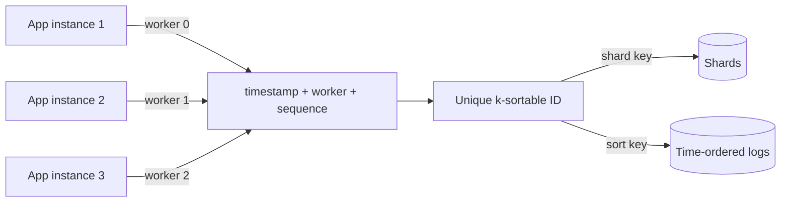

# Distributed ID Generation

## 1. One-Line Definition
Distributed ID generation is the practice of minting unique (and often time-ordered) identifiers across many machines without a single central counter, so keys never collide, databases can shard and sort on them, and systems stay coordination-free at scale.

## 2. Why Do We Need It?
A single auto-increment column works on one database but is a bottleneck and a single point of failure for writes, and it leaks volume ("you are the 4 billionth user"). In a sharded or multi-region system, "unique" must hold across many databases that cannot see each other's counters. IDs also double as sort keys, shard keys for routing, and idempotency keys — so the choice of ID scheme ripples into sharding, time-series ordering, and caches.

## 3. Simple Intuition
In a giant hospital, room numbers (auto-increment) would collide across floors. Instead every patient gets a wristband with a globally unique serial: a timestamp of admission, a floor code, and a random slip. It is readable, tells you roughly when the patient arrived, sorts patients by admission, and two floors can generate them without ever calling one another.

## 4. What Happens Without It?
Central sequence tables become the hottest row in the database and the first thing to melt under write spikes. IDs collide across shards, violating primary keys. Timestamp-only IDs collide when two nodes mint at the same millisecond. A UUID stored as a text primary key bloats the index and ruins insertion locality (random writes across a B-tree). And audit logs with un-sortable IDs cannot answer "what happened after X". The ID scheme quietly becomes an availability and correctness ceiling.

## 5. Core Idea
- **Entropy budget:** a globally unique ID needs enough bits. Rule-of-thumb: randomly-generated IDs must be long enough that collisions are effectively impossible at your write rate (128 bits UUIDv4, or ~64 bits for structured schemes with a machine component).
- **Time-ordered IDs (Snowflake style):** 64 bits split — timestamp + machine/worker bits + per-node sequence — gives k-sortable, roughly increasing IDs without coordination. Great for time-series, pagination, and shard placement by ordering.
- **Coordination-free by design:** machines seed uniqueness from their own identity (worker id) plus local counters and local clocks, so no central server sits in the write path — that is what lets ID generation scale horizontally.
- **IDs are data:** as shard key, sort key, and dedupe key they must distribute well (random/hashed) *or* preserve order (temporal) — you cannot have both from one ID; pick the primary use.
- **Trade-offs with clocks:** time-ordered schemes trust local clocks; clock jumps can produce non-monotonic IDs, so real implementations add sequence slots, clock-skew arbitration, and jitter protection.

## 6. Important Terminology

| Term | Simple Meaning |
|------|----------------|
| UUIDv4 | 122 random bits — unique, but unordered and large |
| UUIDv7 | Time-ordered UUID variant (RFC 9562) |
| Snowflake ID | 64-bit timestamp + worker + sequence |
| K-sortable | Roughly increasing; sort approx by time |
| Worker ID | Per-machine component preventing collisions |
| Sequence | Per-instant counter within one worker |
| Mono/derived IDs | Database-provided copy-on-write type 1 IDs (MongoDB) |
| ULID | 128-bit, time-prefixed lexicographically sortable |

## 7. Basic Architecture



## 8. Request or Data Flow
1. An app instance wants a new order ID; it does not call any central service.
2. It reads its local clock and its configured worker id, computes timestamp bits, increments its local sequence counter.
3. It emits a 64-bit Snowflake-style ID (or a UUIDv7 from a local generator).
4. Downstream: the router uses the ID as a shard key to place the row; a time-series store sorts on it to append to its current segment.
5. No counter table, no remote call, no coordination — the ID is final on generation.

## 9. Practical Example
**Order service doing 50k orders/s across 8 instances:**
- 64-bit Snowflake scheme: 41-bit milliseconds (69 years), 10-bit machine id, 12-bit sequence. Each instance can mint 4096 IDs per ms with no overlap; 8 instances = 32k IDs/ms.
- `order_id` doubles as the sort key (list "my recent orders" is a range scan) and a sharding input.
- Machine ids are assigned once at bootstrap from a tiny config/etcd (this is the only coordination, done once, etc.).
- Contrast: UUIDv4 would have 64 bits more space but would scatter every insert across shards and make time ranges unorderable.

## 10. Scaling
- **Write-cardinality:** Snowflake components cap at ~4k IDs/ms/node; more throughput comes from more workers or more time bits. UUIDv4 scales to essentially infinity with zero coordination.
- **Shard distribution:** hash-flavored IDs randomize placement; time-flavored IDs cluster recent data on the same shard (hot range!). Choose the ID shape for your sharding strategy, not the other way around.
- **Multi-region:** per-region worker prefixes keep IDs unique and locality-tagged; see [[sharding|Sharding]] for the placement side.
- **Ordering at scale:** time-prefixed IDs plus per-node sequences preserve near-total ordering; cross-node, IDs from node 3 can interleave with node 7 — acceptable "k-sortable", not global.
- **Redis-based counters** (single `INCR`) work but reintroduce a central hot node — only for low-rate, low-latency needs.

## 11. Reliability and Failure Scenarios

| Failure | What Happens | Detection | Recovery | Trade-off |
|---------|--------------|-----------|----------|-----------|
| Clock jumps backward | Non-monotonic IDs for a window | Sequence/time check | Skip-ahead: hold last timestamp, use sequence until leap | local logic becomes subtle |
| Two workers with same worker id | Duplicate IDs | Collision alerting | Assign ids from a coordination store at boot | boot-time coordination |
| NTP desync (fast clock) | IDs jump into the future | Time skew metric | Trust monotonic per-node seq, tolerate skew | order approximation |
| Sequence overflow at 4k/ms | Must wait next ms | Counter check | Block/backlog or enlarge sequence bits | latency vs cardinality |
| Central ID service dies | The one ID path stalls | Health check | Avoid a central service; generate locally | none is the point |

## 12. Consistency and Correctness
- **Uniqueness is the contract:** worker-id assignment must be collision-free; in multi-tenant Kubernetes-style fleets that usually means a coordination store at bootstrap (etcd) — one-time, not per-request.
- **Monotonicity is best effort:** time math assumes a sane clock; guarantee only within a single machine/sequence, on the fence sites owners accept.
- **IDs as keys:** uniqueness alone is not enough — an ID that scatters writes across shards can destroy insertion locality (random UUID in a B-tree). Match ID shape to the storage access pattern.
- **Dedupe caveat:** an ID being unique does not make your consumer idempotent; Idempotency needs a *dedupe* check — see [[exactly-once-effect|Exactly-Once Effect]].

## 13. Performance
- Local generation is nanoseconds — no network I/O, no contention: the fundamental advantage.
- Index impact dominates: string UUIDs as primary keys bloat B-trees and fragment writes; 8-byte Snowflake IDs are compact and append-friendly in time-ordered stores.
- Shard hot-ranges are the real tax of time-ordered IDs — "today's" IDs all route to one place unless hashed.

## 14. Security
IDs are not secrets: Snowflake IDs and UUIDv7 encode timestamps and machine identity, leaking when and where a record was created (enumeration/side-channel). Never use time-ordered IDs as auth tokens, session keys, or pre-auth identifiers. If IDs must be unguessable, use UUIDv4/random or add a separate capability token — see [[authentication-vs-authorization|Authentication vs Authorization]].

## 15. Trade-Offs

| Scheme | Advantages | Disadvantages | When to Use |
|--------|------------|---------------|-------------|
| UUIDv4 | Trivial, infinite, uncrackable-ish | Unordered, 36-char keys, index bloat | External/public identifiers, non-shard keys |
| Snowflake (64-bit) | Compact, time-sortable, no coordination | Clock dependence, ~4k/ms/node, leaks metadata | Internal row IDs driven by time |
| UUIDv7 | Sortable + standard + big space | Larger than 64-bit, still time-based | Sortable keys where 128 bits are fine |
| DB sequence / Redis INCR | Exact ordering, monotonic | Central hot spot, failover pain | Low-rate sequential business numbers |
| Range-served segments | Exact order, cached locally | Segment-server coordination | Highly ordered, high-volume needs |

## 16. Common Mistakes
- Using UUIDv4 as an insert-order primary key — every insert writes a random B-tree position.
- Time-ordered IDs as shard keys — "today" gets hot; pretty much everything lands on the newest shard.
- Ignoring clock-skew everywhere — NTP jumps silently break ordering guarantees.
- Hardcoding worker ids or letting two pods collide after a restart.
- Believing unique ID == idempotent processing; dedupe still needs its own store.

## 17. HLD vs LLD Boundary
HLD: choose ID family (UUIDv4 vs Snowflake vs UUIDv7 vs DB sequence), decide bits for timestamp/machine/sequence, define the worker-id assignment path, and state how IDs interact with sharding/ordering. LLD: the bit-masking implementation, clock-skew correction logic, sequence overflow handling, and the ID formatter in each service.

## 18. Interview Questions

### Beginner
- Why is a single auto-increment counter not a solution at scale?
- What are the three components of a Snowflake-style ID?
- Why is UUIDv4 bad as a primary key for time-ordered data?

### Intermediate
- Design an ID scheme for 100k writes/s across 20 servers and 2 regions.
- Your clock jumped backward. What happens to Snowflake IDs and how do you handle it?
- Why do time-ordered IDs make sharding hot, and what are the fixes?

### Advanced
- Compare UUIDv7, Snowflake, and ULID for a message time-series dataset with dedupe needs.
- Design a scheme that is both shard-distributed and time-ordered — or explain why that is contradictory.
- Your IDs must be globally unique across 10 regions with no coordination at write time. What changes?

## 19. Interview Memory Summary

> [!abstract]- Interview Memory Summary
> ### Remember
> - Unique is not enough: shape must fit sharding and ordering.
> - Time-prefixed (Snowflake/UUIDv7) = sortable + compact + coordination-free.
> - Random (UUIDv4) = trivial uniqueness, destructive to ordered indexes.
> - 64-bit Snowflake: timestamp + worker + sequence, ~4k IDs/ms.
> - Worker ids from a store at boot; sequences + clock math per node.
> - Clock skew is the enemy of ordering; IDs leak timestamp metadata.
> - Local generation = no network, nanosecond cost.
> - Unique ID does not imply idempotent processing.
>
> ### 30-Second Explanation
>
> Distributed IDs must be unique, cheap to generate, and shaped like your data access. A Snowflake-style ID packs a timestamp, a machine id, and a sequence into 64 bits, generated locally with no coordination — time-sortable and compact. Random UUIDv4 trades order for pure entropy. Choose by what the ID primarily serves: time-series wants order, sharded writes want hash spread, public-facing wants unguessability — and assign worker ids from a coordination store at boot.
>
> ### Interview Traps
>
> - Using a UUID as an ordered primary key and paying B-tree random-write tax.
> - Time-ordered shard keys and a white-hot newest shard.
> - Ignoring clock jumps in monotonicity arguments.
> - Hand-waving worker-id uniqueness — collisions are data corruption.
> - Claiming IDs alone give exactly-once delivery.
>
> ### Key Trade-Off
>
> You exchange coordination for order: time-flavored IDs are compact, sortable, and local, but trust clocks, leak metadata, and risk hot shards; random IDs are dead simple but unordered and index-hostile.

## 20. Related Concepts

### Prerequisites

- [[sharding|Sharding]] — ID shape decides placement.
- [[shard-key|Shard Key]] — the ID is often the shard key.
- [[database-keys|Keys (Primary/Composite/Foreign/Unique)]] — key semantics at one node.

### Commonly Used Together

- [[consistent-hashing|Consistent Hashing]] — hashing those IDs onto nodes.
- [[exactly-once-effect|Exactly-Once Effect]] — IDs as dedupe and idempotency keys.
- [[distributed-locks|Distributed Locks]] — fencing tokens are monotonic IDs.
- [[distributed-tracing|Distributed Tracing]] — trace IDs use the same scheme.

### Alternatives

- [[database-keys|Database Keys]] — central sequence when one node suffices.
- Redis `INCR` — single-node sequence with a memory-host latency.

### Advanced Concepts

- [[gossip-protocol|Gossip Protocol]] — hashing membership into IDs.
- [[raft-and-paxos|Raft and Paxos]] — coordination store for worker-id assignment.

Related planned topics (not authored yet): ID-compression/binary formats, snowflake-family catalog comparisons.

## 21. References
RFC 9562 (UUIDv6/v7/v8). Twitter/Instagram engineering blog posts on Snowflake and Sharded photo IDs. MongoDB ObjectId documentation for monotonic derived IDs. Kleppmann, *Designing Data-Intensive Applications* ch. 8 for ID-as-shard-key reasoning. Verify UUIDv7 parser/implementor notes and Snowflake bit-layout variants against current documentation.

## 22. Active Recall

Test yourself before revealing each answer.

> [!question]- Why does auto-increment not scale to sharded databases?
> Each shard has its own counter, so two shards can mint the same number — uniqueness is per-node. A shared global counter table serializes all inserts into one hot row, killing write throughput and adding a round trip. Distributed ID generation moves uniqueness into the client/local space instead of the storage path.

> [!question]- What breaks if two workers share the same worker id in a Snowflake scheme?
> Their sequences and timestamps can coincide, producing duplicate IDs — a primary-key violation and silent corruption. Worker ids must be globally unique, which is why reasonable systems assign them via a coordination store at boot time rather than hardcoding a default.

> [!question]- A clock jumps backward 500ms. What happens to time-ordered IDs?
> Two instances can generate IDs where a later request gets a numerically smaller ID, breaking global k-sortability; a single instance that remembers last-used timestamp can avoid duplicates locally by waiting or using a higher sequence. Handle it, or accept approximate ordering, or move to random-flavored IDs.

> [!question]- Design decision: you need IDs that sort by creation time but spread writes across shards. What do you do?
> Recognize they are in tension and pick a policy: (a) time-flavored ID as sort key, hash a separate high-cardinality column as shard key; (b) accept time-ordered IDs on one hot shard and use caching + range partitioning; or (c) repartition by a coarse time bucket. Most systems use a different short-key and keep the ID only for ordering.

> [!question]- How many IDs per second can one Snowflake-style node issue, and what is the bottleneck?
> The sequence field (commonly 12 bits, 4096 values) per millisecond limits: one node mints max 4096 IDs/ms = ~4M/s. The real arbiter is the timestamp resolution plus sequence bits, not the network. Shrink the sequence bits and you trade peak burst for more machine bits, and vice versa.

> [!question]- Interview scenario: a messaging app's message table has an index and inserts are suddenly slow. What do you suspect?
> Random UUID primary keys scatter inserts across the B-tree, splitting pages and evicting cache lines; effective index append disappears. Expected fix: switch the physical key to a time-ordered (Snowflake/UUIDv7) or DB-generated ordering key, keep the UUID only as a logical/external id.

> [!question]- Why are time-ordered IDs a side channel?
> They encode the creation time (and often machine) in the number itself: iterating IDs discloses business volume and internal topology. For anything user-facing or auth-ish, use random IDs or separate opaque tokens. Storage, pagination, and dedupe keys are fine; capability = not fine.

> [!question]- What does a coordination-free claim actually require at bootstrap?
> Uniqueness still has to come from somewhere once. Machine ids/config from a store, stable hostnames, or snowflake worker ranges — whichever you choose, call it out. The "coordination-free" promise is per-request (nanosecond local generation); the worker-identity assignment is a boot-time coordination event you must still design.

## 23. When Should I Use This?

### Use it when

- Schema keys must be unique across shards, replicas, or regions with no single counter.
- You need k-sortable IDs for time-series, pagination, or append-only logs.
- Thousands of nodes write concurrently and a central ID service is untenable.
- You already have x-sharding and want a compact, index-friendly key.

### Avoid it when

- A single database auto-increment suffices (few nodes, low rate, one region).
- The IDs must be strictly ordered and non-decreasing — Snowflake is k-sortable, not a strict global counter.
- The ID score is minutes apart from a needed business sequence (invoice numbers) — pick a real sequence.
- The ID must be a secret — generation schemes leak.

### What problem does it solve?

Uniqueness without a hot central counter, with shapes that support ordered indexing, time-sorted queries, and shard-appropriate placement.

### What problem does it NOT solve?

Exact global ordering (only k-sortability), business-meaningful sequential numbers, unguessability, idempotent processing, or clock-free monotonicity.

## 24. Decision Connections

Decisions that go together with distributed IDs:

- [[sharding|Sharding]] — the ID is usually the thing you route on; its shape chooses your hot-cold geography.
- [[shard-key|Shard Key]] — a good shard key is high-cardinality and write-distributed — design the ID accordingly.
- [[consistent-hashing|Consistent Hashing]] — hash-flavored IDs + consistent hashing keep placement stable.
- [[exactly-once-effect|Exactly-Once Effect]] — dedupe keys are generated IDs remembered by the consumer.
- [[distributed-locks|Distributed Locks]] — fencing tokens are practically monotonic IDs from the same machinery.
- [[distributed-tracing|Distributed Tracing]] — trace/correlation IDs use the same generator.
- [[database-keys|Database Keys]] — the one-node baseline your distributed scheme extends.
- [[raft-and-paxos|Raft and Paxos]] — linearizable worker-id assignment at bootstrap.

Decision tree:

```
Do you need unique keys across many writers?
    |
    +-- Still fits one database?        → auto-increment / [[database-keys|Database Keys]]
    |
    +-- Distributed writes needed
    |      |
    |      +-- Sort by time in queries → time-flavored: Snowflake / UUIDv7
    |      |      +-- Shard hot?       → hash a different column as the shard key
    |      |
    |      +-- Random/opaque surface   → UUIDv4
    |      |
    |      +-- Strict sequence needed  → range-served segments / DB sequence
    |
    +-- Ever exposed to users or auth paths?
           → never time-flavored; use random + capability tokens
```