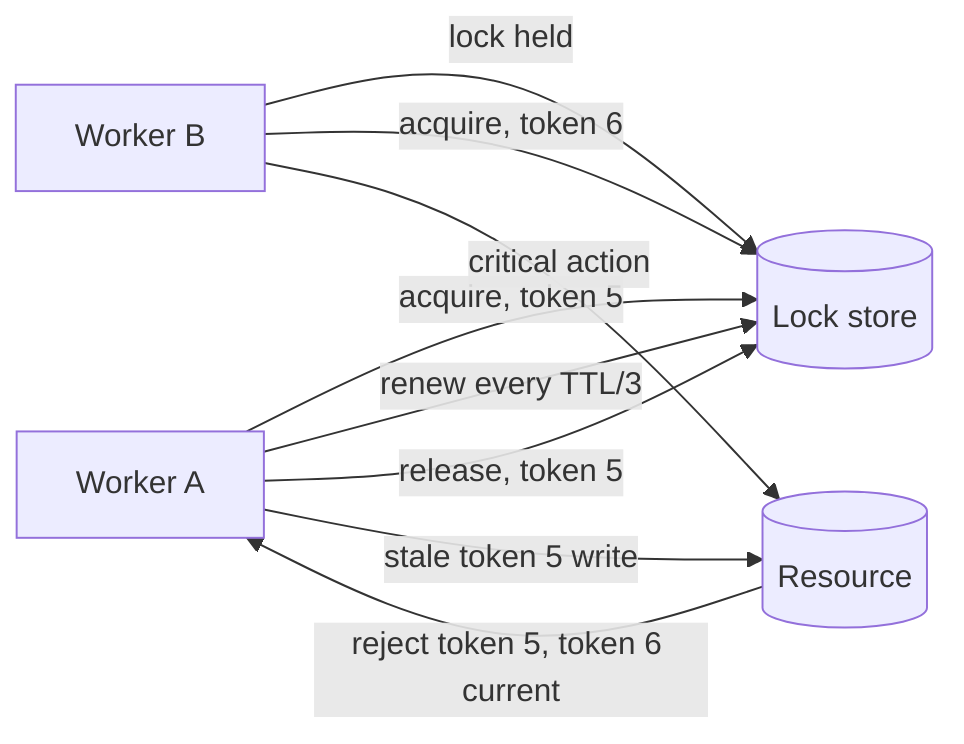

# Distributed Locks

## 1. One-Line Definition
A distributed lock is a cross-process mutual-exclusion primitive — a shared, atomic "the holder is X" record with a time-to-live (lease) and a monotonic fencing token — that lets many services agree that only one of them performs a critical action at a time.

## 2. Why Do We Need It?
A local mutex works on one machine; once several processes, replicas, or microservices share a resource, "only one of us may do this" must be decided in a way they all agree on. Cron jobs must not fire twice, a leader must not run concurrently with its successor, a counter must not be incremented by two workers, and a payout script must not replay. Distributed locks give you that exclusive-access contract without rearchitecting everything into a single database.

## 3. Simple Intuition
One key for a shared office kitchen, with a sign-out sheet beside the door. Only the current holder enters. The sign states the key automatically returns if someone holds it too long, so a holder who faints never blocks the door forever. Every use of the key carries a sequence number, so if two people somehow both claim it, the door attendant only honors the higher-numbered pass and refuses the older one.

## 4. What Happens Without It?
Coupon codes double-redeemed because two checkout services both believed they handled the order. Two scheduled jobs run at once and replay payments. A new leader starts before the old one has fully stopped, and both write to the same ledger. The failure mode is not slowness — it is silently duplicated or corrupt business effects. You often already have "roughly one" concurrency; the lock upgrades it to "exactly one at a time".

## 5. Core Idea
- **Locks are leases, not infinity:** a lock always carries a TTL. If the holder dies or the network swallows it, the lock eventually expires and someone else can take it — availability wins over deadlock. The TTL is also your safety upper bound.
- **Fencing token, not confidence:** the lock is never "I am the only holder"; it is "I am the holder, token 42". Every write to the protected resource carries the token, and the resource rejects tokens older than the one it has seen — this fences out a stale holder.
- **Renewal loop:** a holder must renew before expiry (roughly TTL/3) and abandon work when renewal fails; otherwise its lease silently passes to someone else while it keeps writing — the classic double-entry bug.
- **Correctness = TTL + fencing + renewal:** safe TTL (only as wide as the worst pause you tolerate), resource-side fencing, and disciplined renewal. Lose any one and you have a "mostly works" lock.
- **Where it lives:** in a store both parties trust. A consensus-backed store (etcd/ZooKeeper) gives linearizable locks with real leases; Redis gives speed but weaker safety (see the Redlock debate).

## 6. Important Terminology

| Term | Simple Meaning |
|------|----------------|
| Lock / Lease | Exclusive token with a time-to-live |
| TTL | How long the holder may hold without renewing |
| Renewal | Holder re-arms the TTL before it lapses |
| Fencing token | Monotonic number proving "I am the newest holder" |
| Critical section | Code only one process may run at a time |
| Compare-and-delete | Release only if the current token matches yours |
| Redlock | Redis-based distributed lock proposal |
| Split brain | Two processes both believing they hold the lock |

## 7. Basic Architecture



## 8. Request or Data Flow
1. Worker A calls "acquire lock on key K with TTL 30s"; the store returns success plus a monotonic fencing token.
2. Worker B tries the same key, is rejected, and waits / backs off / proceeds non-critically.
3. A runs its critical section; every write to the shared resource carries token 5, and the resource remembers the highest token it has seen.
4. A renews every 10s. If a renewal fails, A must treat itself as no longer the holder and stop.
5. A dies; the lock expires at TTL; B acquires token 6. The resource now rejects any token-5 write, so two overlapping A actions are impossible.

## 9. Practical Example
**One-off settlement job across three replicas:**
- An etcd lease key `leader:settlements` with TTL 15s; the winner renews every 5s.
- Every settlement record carries the lock's fencing token; the ledger ignores any record whose token is lower than the current holder's.
- A replica stuck in a 40s GC pause misses renewals; the lock passes to a new replica with a higher token, and the paused replica's late writes are rejected by fencing — no payment double-issued.
- With plain Redis `SET NX PX` and no fencing, the same scenario silently double-settles. That is the difference between a locking ceremony and a guarantee.

## 10. Scaling
- **The lock store is a coordination point:** throughput is capped by the store; keep the key space small and shard by service/domain into separate stores.
- **Reduce contention, not latency:** hold time is the real lever — shrink the critical section and keep the query path lock-free.
- **Lock-free alternatives scale better:** idempotency keys, DB constraints and CAS, per-user rather than global granularity. See [[distributed-id-generation|Distributed ID Generation]] for the sequence side.
- **Caching the lock holder locally** is unsafe; renewal/discovery must still talk to the store.

## 11. Reliability and Failure Scenarios

| Failure | What Happens | Detection | Recovery | Trade-off |
|---------|--------------|-----------|----------|-----------|
| Holder dies | Lock held until TTL | No renewal | Store expires; next acquirer | safety window = TTL |
| Holder pauses in GC | Misses renewal | Renewal timer | Lock passes away; fencing rejects late writes | TTL must exceed pause |
| Lock store node fails | Acquires may fail | Client error | Failover config of the store | locking availability |
| Network latency spikes | Renewals delayed | Renewal latency | Tune TTL vs risk | speed vs safety window |
| Resource restarts | Loses fencing watermark | Token mismatch | Persist last-seen token | fencing state per resource |

## 12. Consistency and Correctness
- **Linearizable acquire** (consensus store) guarantees two acquirers can never both get the lock.
- **Fencing is the hard guarantee:** exclusivity only tells you who holds the current token; the resource's token check is what actually prevents two writers.
- **TTL is a timeout, not a job budget:** long critical sections need renewal logic, not a larger TTL.
- **Release must be compare-and-delete:** otherwise a stale holder releases the new holder's lock.
- **Operate idempotently:** a critical section that can safely re-run turns a lock failure into a retry instead of an incident.

## 13. Performance
- Consensus store: single-digit-ms per acquire/renew, hundreds to low thousands of ops/s per shard.
- Redis single node: sub-ms to ~1ms, tens of thousands of ops/s — far cheaper for high-frequency coarse locks.
- Renewable leases keep latency flat; TTL is a tail-risk parameter, not a throughput multiplier.
- Fencing adds one conditional update per protected write.

## 14. Security
Authenticate and authorize access to the lock store — anyone who can acquire your lock keys can block or impersonate coordination. Use compare-and-delete with randomized token values to prevent accidental or malicious early release. The lock store holds no secrets, but it holds coordination power; never embed credentials in lock client code.

## 15. Trade-Offs

| Choice | Advantages | Disadvantages | When to Use |
|--------|------------|---------------|-------------|
| etcd / ZooKeeper lease | Linearizable, real leases, fencing tokens | ~ms latency, lower QPS | Correctness-critical coordination |
| Redis SET NX PX | Sub-ms, huge QPS | Weak safety, manual fencing | High-frequency coarse, non-critical locks |
| DB row lock | Already have the DB, transactional | Contention, slower, schema coupling | Rare low-contention locks |
| Redlock (multi-Redis) | Distributed without etcd | Clock dependence, complexity, debated | Controversial; avoid for correctness |

## 16. Common Mistakes
- Locking without a fencing token — a slow holder and new holder then both write.
- TTL shorter than the critical section, then wondering why runs overlap.
- Ignoring renewal failures — keeping work going past your own lease.
- Plain delete instead of compare-and-delete — a stale holder releases the new owner's lock.
- Using a lock for ordering — it grants exclusion, not a commit point.

## 17. HLD vs LLD Boundary
HLD: pick the store (etcd vs Redis vs DB), TTL policy, renewal strategy, fencing-token protocol, and the resource-side token contract. LLD: acquire/renew/release client code, the compare-and-delete implementation, embedding the token in each write, the lock-hold-time metric.

## 18. Interview Questions

### Beginner
- What does a lease add to a lock, and why is it necessary?
- Why can a single machine's mutex not coordinate distributed workers?
- What is the difference between a lock and a fencing token?

### Intermediate
- A holder pauses in a 60s garbage collection. What saves you, and what does not?
- Why is a plain delete unsafe for releasing a Redis lock, and what is the fix?
- How should renewal frequency relate to TTL, and what happens on a missed renewal?

### Advanced
- Explain the two-process discovery problem that Redlock is accused of, and how fencing solves it.
- Design a settlement job that must never double-issue but must not block forever on a crashed primary.
- Compare a database lock with an etcd-lease lock for an occasionally-locked payment path.

## 19. Interview Memory Summary

> [!abstract]- Interview Memory Summary
> ### Remember
> - A distributed lock is a lease: exclusive token with a TTL.
> - The fencing token is what actually prevents double-writes.
> - Renew before expiry; stop when renewal fails.
> - Release only if you own it (compare-and-delete).
> - TTL is a timeout, not a job budget; write idempotent sections.
> - etcd/ZK: linearizable, safe. Redis: fast, weaker. Redlock: debated.
> - Shrink the critical section; contention, not latency, is the real cost.
> - Locks give exclusion, not ordering or commit totals.
>
> ### 30-Second Explanation
>
> A distributed lock is a shared key with a lease: a worker acquires it for TTL seconds, renews regularly, and owns the critical section until it releases or the lease expires. Safety rests on a monotonic fencing token every protected write carries — the resource rejects stale tokens, so a paused-then-resumed old holder can never write after the new holder took over. Consensus-backed stores give this for correctness-critical coordination; Redis gives speed when correctness can be relaxed.
>
> ### Interview Traps
>
> - Forgetting the fencing token — that is what stops double-writes.
> - Using TTL as a job budget — overrunning jobs silently overlap.
> - Deleting a lock without checking the token.
> - Claiming short TTL removes the need for fencing.
> - Assuming a lock gives ordering guarantees.
>
> ### Key Trade-Off
>
> You trade store latency and coordination complexity for "exactly one process at a time"; without a fencing token the exclusivity is merely optimistic and double-writes remain possible.

## 20. Related Concepts

### Prerequisites

- [[consensus|Consensus]] — what makes a lock store linearizable.
- [[failover|Failover]] — safe primary handover is a lease decision.
- [[retry-and-timeout|Retry and Timeout]] — backoff when a lock is contended.

### Commonly Used Together

- [[distributed-scheduling|Distributed Scheduling]] — cron jobs claiming a leadership lease.
- [[distributed-id-generation|Distributed ID Generation]] — tokens and sequences for fencing.
- [[distributed-transactions|Distributed Transactions (2PC / Saga)]] — locking resource pages.
- [[caching|Caching]] — a cache, not a substitute for a safe lock.

### Alternatives

- [[rate-limiter|Rate Limiter]] — throttles concurrency instead of excluding it.
- Idempotent writes and retries — remove the need for exclusion entirely.

### Advanced Concepts

- [[raft-and-paxos|Raft and Paxos]] — the store under etcd leases.
- [[crdt|CRDTs]] — conflict-free merges that sidestep locks.

Related planned topics (not authored yet): the full Redlock debate, optimistic concurrency vs locks.

## 21. References
Kleppmann, "How to do distributed locking" (2016) — the fencing-token analysis and Redlock critique. antirez, "Is Redlock safe?" — the author's rebuttal series. etcd and ZooKeeper docs on leases and ephemeral nodes. Oki & Liskov, "Viewstamped Replication" for lease origins. Verify Redis SET NX PX / EVAL and etcd lease APIs against current documentation.

## 22. Active Recall

Test yourself before revealing each answer.

> [!question]- Why is a plain distributed lock without a fencing token unsafe even with perfect TTL expiry?
> TTL lets a lock holder be considered dead while it is merely slow; a second holder is then granted the lock and both run the critical section. The fencing token — a monotonic number the resource enforces — is the only mechanism that stops the old holder's writes from being honored. Exclusivity is what you request; fencing is what makes it true.

> [!question]- How should TTL, renewal interval, and the worst GC pause relate?
> TTL must comfortably exceed the worst pause you accept (a typical guard is TTL at least 3x the renewal interval, renewal interval at least the worst pause). If a pause exceeds TTL the lease legally expires and a second holder acquires — safety then depends entirely on fencing. A huge TTL just extends the window in which a dead holder blocks the resource.

> [!question]- Design decision: Redis lock or etcd lease for a leader election that runs once per minute?
> A once-a-minute decision in a stable cluster argues for etcd: linearizable acquire, real leases, native fencing tokens, and no debate about safety. Redis is defensible only if you separately implement fencing and accept a possible brief second leader. For correctness-critical single-writer guarantees, choose the consensus store.

> [!question]- A worker misses renewals during a 90-second deploy pause. What actually happens?
> Its lease expires, another worker acquires the lock with a higher token, and the paused worker resumes believing it is still holder. Its subsequent writes carry a stale token and the resource rejects them. Correct behavior requires the worker to check its token on resume, abort remaining work, and no longer touch the resource — renewed grace, not renewed ownership.

> [!question]- Interview scenario: a distributed job occasionally runs twice. Walk the diagnosis.
> 1. Is renew/master-out handled? Check TTL vs longest pause and whether the holder stopped on renewal failure. 2. Is release compare-and-delete? 3. Is there a fencing token enforced by the resource? 4. Is the critical section idempotent? The cheapest robust answer is usually idempotency plus a real lease; the deepest fix is fencing.

> [!question]- Why does an etcd/ZK lock survive a crash of the node holding your client connection?
> The lock's lease lives in the store and is renewed by a keepalive that dies with the connection. When the hold dies, the store stops extending the lease and the key eventually expires — no explicit delete needed. Transactional writes by a crashed holder are the one thing no lock can retract; that is again why fencing and idempotency matter.

> [!question]- How does fencing interact with a resource that only accepts a monotonic sequence?
> The resource stores the highest token it has processed. A write is allowed only if its token is strictly greater. Two holders writing tokens 5 and 6 can overlap in time, but the resource serializes them as 5-then-6 and ignores anything from an older holder — so the business effect is a single ordered execution even when the lock itself briefly misbehaved.

> [!question]- "We lock with Redis and it has never failed." How do you evaluate that claim?
> "Never failed" usually means no incident observed yet — the failure window is small but real (store failover, clock jumps, long GC). Evaluate by the worst acceptable consequence of a double-write: if it is a coupon or a badge, Redis is fine; if it is a payment or a primary election, you want a consensus-backed lease plus fencing regardless of past luck.

> [!question]- What is the difference between a lock and a lease for leader election specifically?
> A lock is an exclusive claim; a leader election needs the claim to expire (lease) so that a dead leader is provably replaced within a bounded time. The lease duration is the failure-detection window: shorter leases fail over faster but risk more false takeovers; longer leases are safer but keep the cluster leaderless longer after a crash.

## 23. When Should I Use This?

### Use it when

- Exactly one process may act (leader election, single-writer jobs) and a split equals corruption.
- Several replicas could concurrently reach a shared resource and you cannot deduplicate effects.
- You can bound the critical section duration and renew reliably.
- You have a coordination or cache store already and the contention rate is moderate.

### Avoid it when

- The operation is safely idempotent — dedupe and retry instead, it scales better.
- A wrong duplicate is cheap to detect and correct.
- The lock would live on a hot path and contention would exceed the store's throughput.
- You cannot consistently renew or enforce the fencing contract (then the lock is theater).

### What problem does it solve?

Exclusive access to a shared resource across unreliable processes: only one holder runs a critical action at a time, with a bounded recovery window after crashes and pauses.

### What problem does it NOT solve?

It does not prevent late writes from a paused holder (fencing does), does not guarantee order or a commit point, does not scale to million-lock contention, and does not give you correctness without an idempotent critical section behind it.

## 24. Decision Connections

Decisions that go together with distributed locks:

- [[consensus|Consensus]] — linearizable acquire is a consensus decision on "who owns this key".
- [[distributed-scheduling|Distributed Scheduling]] — the scheduler's "only one run winning" is a lock you renew.
- [[distributed-id-generation|Distributed ID Generation]] — fencing tokens are monotonic IDs.
- [[failover|Failover]] — electing a primary is acquiring a lease with a renewal loop.
- [[distributed-transactions|Distributed Transactions (2PC / Saga)]] — locks guard resource pages; sagas prefer optimistic compensation.
- [[raft-and-paxos|Raft and Paxos]] — the consensus engine behind production-grade lock stores.
- [[caching|Caching]] — distributed cache servers are common (weak) lock hosts.
- [[retry-and-timeout|Retry and Timeout]] — the backoff you apply when a lock is contended.

Decision tree:

```
Do multiple processes need an exclusive action?
    |
    +-- Effects are idempotent or duplicates are acceptable?
    |      → skip the lock; use retries + dedupe keys
    |
    +-- Exactly-one-holder is truly required
    |      |
    |      +-- Correctness-critical (payments, leaders)?
    |      |      → [[consensus|Consensus]] store: lease + fencing + compare-and-delete
    |      |
    |      +-- High-frequency, failure consequence mild?
    |      |      → Redis SET NX PX with manual fencing
    |      |
    |      +-- Rare, single-DB context?
    |             → DB row lock / advisory lock
    |
    +-- Paused holders must never double-write
           → add fencing token + resource-side rejection
```