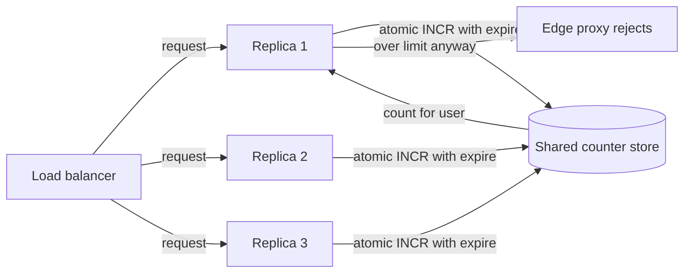

# Distributed Rate Limiter

## 1. One-Line Definition
A distributed rate limiter enforces cross-node request limits — a shared, atomic "how many requests has this client used in this window" state that every replica checks — so that a global quota holds even when traffic fans out across many instances, regions, or shards.

## 2. Why Do We Need It?
Single-node [[rate-limiter|rate-limiter]] logic (token bucket in memory, local counters) stops working the moment traffic spreads across replicas: ten instances each allowing 100 req/s means 1000 req/s slip through the "global" limit. Attackers and flood traffic just need to spread across nodes, and a DDoS scales the same way you do. The distributed version reintroduces the shared state the single-node version held locally, and the design question becomes: how much centralization can you afford for how much limit accuracy?

## 3. Simple Intuition
A nightclub door with a bouncer. One bouncer at one door easily enforces "max 100 inside"; put ten bouncers at ten doors and each lets in 100 thinking he is alone — now 1000 are inside. Either the bouncers all share a counter (each door calls "how many are in?" before admitting — slow but accurate) or each owns a small budget and the total is approximate (fast but fuzzy). The shared counter is the distributed limiter.

## 4. What Happens Without It?
Your API says "max 100 req/min per user" but a user runs 900 req/min against nine replicas — none of them knows the others' counts. A botnet of 1000 IPs hits a per-IP limit that only counts per-node buckets, melting the origin while each node reports being under quota. Rate-limit violations become the norm, the LB/queue saturates, costs explode, and the "protection" is decorative. Some failures are silent too: the local limit drops to zero because one flaky node brought the shared store down with it.

## 5. Core Idea
- **The shared window state is the product:** enforce `user_id → (window_start, count)` in a store every instance can read-and-atomic-update. Do it carefully — this is a striped counter problem (see [[distributed-id-generation|Distributed ID Generation]] for the "many machines agree on state" sibling).
- **Central vs local, with a continuum:** full central (every request hits Redis — exact, slow, hot key); full local (each instance gets a budget — fast, fuzzy, drift); or hybrid: a local burst allowance on top of a remote or periodic top-up.
- **Window algorithms port onto the store:** fixed window (key `client:{uid}:{minute}`, atomic INCR), sliding window (sorted set `ZRANGE`/ZADD, or two fixed windows rolled), token bucket (stored tokens + refill timestamp in the shared key). The algorithm choice is the same as single-node; what changes is *where* the state lives and the network trip it costs.
- **Atomicity is non-negotiable:** the check-and-increment must be atomic against concurrent requests from many replicas — a Redis `INCR`+expire or a Lua script, not read-then-write, else two replicas both count request #101.
- **A limiter that is down must not take the service down:** fail-open vs fail-closed is an explicit decision; a shared-store outage that blocks all traffic is worse than a brief quota breach.

## 6. Important Terminology

| Term | Simple Meaning |
|------|----------------|
| Global limit | True quota across all nodes |
| Per-node budget | Local share of the quota |
| Central store | Redis-tier shared counters |
| Check-and-increment | Atomic "am I under? then count" |
| Fixed window | Count per fixed minute/hour bucket |
| Sliding window | Accurate count over last T |
| Token bucket | Tokens refilled at rate r, burst b |
| Fail-open / fail-closed | No store = allow / deny |
| Hot key | One user floods one counter key |
| Synced quota / cluster limit | Redis's built-in distributed limiting |

## 7. Basic Architecture



## 8. Request or Data Flow
1. A request arrives at replica 2; the rate-limiter middleware extracts `user_id`.
2. It executes an atomic check-and-increment against the shared key `rl:{user}:{minute}` — `INCR`, set `EX` on first INCR, compare with limit.
3. If under the limit the request proceeds; if at/over it is rejected or queued.
4. For a sliding window, a small Lua script trims a sorted set and counts elements in `(now - T, now]` atomically.
5. A background top-up (token refill) or periodic budget re-sync keeps local variants fresh; fail-open/closed is decided at this hop.

## 9. Practical Example
**Auth API promising "100 req/min per IP" across an auto-scaling fleet:**
- Shared store: Redis cluster, key `rl:{ip}:{epoch_minute}` with `INCR` + `EXPIRE 60` — atomic against any number of replicas. Global accuracy: exact.
- Request cost: one explicit Redis round trip (~0.5-1ms) per request, plus edge cache for the common "under quota; count locally then flush" pattern when 10x headroom isn't affordable.
- Fail mode chosen: fail-open for user-facing traffic, fail-closed for the login endpoint's anti-brute-force layer (reject-all beats compromised-account).
- Hot key: one IP bursting to 900 req/s keeps one Redis key hot — the shard holds it; mitigation is per-shard hashing of the key (suffix the key) or a two-tier local + shared design.

## 10. Scaling
- **Central store throughput caps the fleet:** every request costs a store op; scale the checks (strip the counters per shard, use a Redis cluster), but the hot-key problem remains per user.
- **Distribute the enforcement, not the decision:** edge nodes run local fast-path limits (per-node burst) plus a slower global check — analytical: local first, remote second.
- **Partition the space:** shard limiter state by user hash so one user's counter is not everyone's problem; a cluster of Redis shards holds `hash(user) % N` keys.
- **Staleness vs scale:** local budgets resynced every second drift horizontally — the accuracy is "at least X per N seconds", not "exactly X per second".
- **When the store dies:** fail-open vs fail-closed is a small card that decides whether you sacrifice correctness or availability for the limit request.

## 11. Reliability and Failure Scenarios

| Failure | What Happens | Detection | Recovery | Trade-off |
|---------|--------------|-----------|----------|-----------|
| Store node down | Limit checks fail for that shard | Health check | Fail-open or -closed per policy, rehash to standby | brief quota breach or brief outage |
| Lua script failure | INCR broken for some keys | Error rate on limiter | Versioned scripts, atomic alternative | logic duplication |
| Hot key flood | One Redis key saturated | Slowlog / latency | Suffix keys, local fast-path, queue | accuracy loss |
| Clock skew | Sliding window shifts | NTP metrics | Expand window tolerance | precision loss |
| Store replication lag | Increment lost on failover | Duplicate counter artifacts | Use Redis Cluster quorum writes | durability vs cost |

## 12. Consistency and Correctness
- **Atomicity is the correctness floor:** check-and-increment must be atomic; a naive read-then-write lets two replicas both take the last allowed slot — that is the whole point of the central store.
- **Approximation is a feature, not a bug:** local-budget schemes guarantee "no more than R per T per node" and "approximately R over T globally"; the shared-store scheme gives exact global counts but costs a round trip. State your semantics in the SLO, not in a hope.
- **Ordering doesn't matter, counting does:** the limiter does not need to order requests, only to count them coherently — which is why last-write-wins-style recovery is acceptable where a counter is involved.
- **Fail-open/closed is a consistency choice for edge cases:** being "over limit when the store is down" is a moment of honesty about your availability-conservative priority.

## 13. Performance
- Central: one atomic op per request (0.5-1ms typical), per-shard throughput in tens of thousands per second — fine for mid-size, painful for 100k+ req/s fleets.
- Local: zero network, nanosecond; that is the whole reason hybrid designs exist.
- Token bucket vs window: bucket uses one stored value (cheap), sliding window a sorted set (expensive) — pick the model that matches your reject-quality needs.
- Scaling trick: strip counters per shard (hash suffix) so a flood only heats its own shard; queue rejections under emergency overload rather than piling store load on the hot path.

## 14. Security
Rate limiter keys are attacker-controlled (IP, user id) — an attacker who can make you key on attacker-owned values can force hot keys (stripe suffix on collisions). Bulletproof the store: authenticated connections, minimal privileges, TLS in transit, no secrets in counters. A rate limiter is exactly the thing a DDoS or credential-stuffer tries to melt; it must never fail INTO allow for auth-sensitive paths unless that is a conscious, documented fail-open choice.

## 15. Trade-Offs

| Choice | Advantages | Disadvantages | When to Use |
|--------|------------|---------------|-------------|
| Fully central (Redis INCR) | Exact global limit | Round trip per request, hot key | Strict quotas, moderate traffic |
| Local budget per node | Zero latency | Drift, per-node overage | High-throughput, fuzzy tolerances |
| Hybrid local + top-up | Fast, bounded drift | Complexity + eventual drift | Most production fleets |
| Edge/LB-level | Enforces near the entry | Loses user-level context | Anti-abuse at the perimeter |
| Sorted-set sliding window | Accurate over last T | Costlier ops | Tight QoS windows |

## 16. Common Mistakes
- Read-then-increment: two replicas both take request #100 — the exact bug the store is meant to fix.
- No key expiry — counters accumulate forever (billion-row Redis).
- A single shared key for all users (a hot key by design; stripe it).
- Reapplying single-node algorithm mentally and calling it distributed — window boundaries differ per replica.
- Locking the fail-open/closed choice in implicitly, and discovering at an outage that the store-path failing closed took down the API.

## 17. HLD vs LLD Boundary
HLD: shared store choice (Redis cluster), global vs local vs hybrid model, key scheme, fail-open/closed policy, per-service quotas, and SLO semantics. LLD: the Lua check-increment script, key TTL setting, slip-sliding-window counting ops, local-budget refresh loop, and per-route limiter wiring.

## 18. Interview Questions

### Beginner
- Why does a per-node token bucket stop working when you add replicas?
- What is the difference between a fixed window and a sliding window?
- What does fail-open vs fail-closed mean, and why does it matter?

### Intermediate
- Design a 100 req/min per-user global limit across 50 replicas — pick the store and the exact counter ops.
- What happens to a Redis INCR key when the window rolls? How do you keep the counter bounded?
- Why is atomicity up-check-and-increment special in the distributed case?

### Advanced
- A user bursts 900 req/s on one key. Design a limiter that survives the hot key.
- Design a hybrid per-instance-budget + shared-top-up limiter; bound the drift you accept.
- Compare fixed-window, sliding-window, and token-bucket semantics as distributed keys for an API SLA.

## 19. Interview Memory Summary

> [!abstract]- Interview Memory Summary
> ### Remember
> - Single-node limiters break across replicas: N nodes * 100 = 100N.
> - Distributed = shared atomic counter state, not local logic.
> - Check-and-increment must be atomic (INCR + expire, or Lua).
> - Fixed vs sliding vs token bucket: port the algorithm, move the state.
> - Exact global checks cost a round trip; local budgets drift.
> - Hot keys are attacker-pokeable; stripe with a hash suffix.
> - Fail-open/closed is a conscious SLO decision, never an accident.
> - Don't let limiter latency become the API's p99.
>
> ### 30-Second Explanation
>
> A distributed rate limiter enforces a global quota by moving the counter into shared state: every replica that serves a request runs an atomic check-and-increment against a key in a central store (e.g., Redis INCR with TTL, or a Lua sliding window). The central design is exact but adds latency and a hot key; local budgets are fast but drift; hybrids give a per-node burst plus periodic remote refresh. Whatever the scheme, atomicity, key expiry, and an explicit fail-open/closed choice are the three non-negotiables.
>
> ### Interview Traps
>
> - Reading then incrementing — the load-bearing atomicity bug.
> - Forgetting the counter row to expire.
> - One shared key for all users (design-your-own hot key).
> - Assuming the store survives the attack it limits.
> - Claiming exact global limits with purely local counters.
>
> ### Key Trade-Off
>
> You trade a round-trip per request (and a central dependency) for an exact global limit; per-node budgets buy back the latency by accepting drift and per-server overage — pick the accuracy you truly need.

## 20. Related Concepts

### Prerequisites

- [[rate-limiter|Rate Limiter]] — the single-node algorithms this file distributes; this file is the distributed sibling, not a replacement.
- [[caching|Caching]] — the shared store is often a cache-tier Redis.
- [[load-balancing|Load Balancing]] — the traffic spread that breaks naive limiters.

### Commonly Used Together

- [[distributed-id-generation|Distributed ID Generation]] — key-striping/hashing on counter keys.
- [[consensus|Consensus]] — coordination store as an alternative to Redis for strict linearizable quotas.
- [[retry-and-timeout|Retry and Timeout]] — how a rejected request should behave.
- [[circuit-breaker|Circuit Breaker]] — protection after repeated rejections.

### Alternatives

- [[caching|Caching]] alone for per-key freshness.
- Per-tenant sharding (see [[sharding|Sharding]]) to isolate abusive tenants instead of a global limiter.

### Advanced Concepts

- [[gossip-protocol|Gossip Protocol]] — epidemic counter refresh for fully decentralized limits.
- [[exactly-once-effect|Exactly-Once Effect]] — accountancy of counted requests.

Related planned topics (not authored yet): edge/LB-level rate limiting vs app-level, sliding-window approximations in Redis.

## 21. References
Redis documentation on INCR + EXPIRE, Lua scripting, and the `CLUSTER`/`LIMIT`-style patterns. Kong/Nginx rate-limit docs for edge design. CloudRate/Striped counters discussions (Hadoop RateLimiter for the local-budget concept). Verify Redis atomicity guarantees and key-expiry behavior against current Redis docs.

## 22. Active Recall

Test yourself before revealing each answer.

> [!question]- Why does read-then-increment break in a distributed limiter?
> Two replicas both read "current count 99", both see they are under 100, both increment and proceed — the 100th and 101st requests both admitted. The central store is only load-bearing if the check-and-increment is atomic; a single INCR-comparison op (with TTL-set) guarantees only the fast 100 pass.

> [!question]- How does a fixed-window limiter reset, and what is its edge case at the boundary?
> The key `rl:user:epoch_minute` expires with the minute; a new-minute INCR starts at zero. The edge case is the boundary spike: two requests at 11:59:59 and 12:00:01 are both "first" of their windows, so a client can double the effective rate by lining up at the seam. A sliding window fixes that at the cost of a costlier state structure.

> [!question]- Design decision: 200k req/s fleet, exact global per-user limit required. Which store shape?
> A Redis Cluster keyed on `hash(user) % shards` gives exactness with shard-local hot keys (only one user per shard max). Estimate per-key cost: one INCR per request, ~1ms round trip is 1k req/s per key — a 200x deficit to the intended number, so you'd add a local fast-path for the common under-quota case. There is no free exactness at that scale without a defensive budget split.

> [!question]- What does fail-open mean and when is it conversionally wrong?
> Fail-open means the limiter authorizes requests when its own store is unreachable — availability preserved, quota breached. It is categorically wrong for brute-force/login and financial endpoints where the check is defense, not logistics. Fail-open for read-heavy public API traffic is a defensible, documented choice only when over-limit requests are survivable.

> [!question]- A user's counter key is a hot key. What concrete steps fix it?
> 1. Stripe the key by an attacker-stable suffix: `rl:{user}:{minute}:{0..F}` and sum the stripes on read — spread across shards, at maximal throughput cost. 2. Add a per-replica local burst cap so the store only sees edge-anomalous traffic. 3. Cache "this user is over" decisions briefly (T<=100ms) so the hot path stops hammering the key.

> [!question]- How does a token bucket differ as a distributed key from a window counter?
> A token bucket is one key holding current tokens + last-refill timestamp; a request atomically computes refill = floor((now - last)/rate), caps at burst, and spends one if available — a single conditional decrement per request. A window counter keeps a series (sorted set) of per-request timestamps, trimmed and counted each time. Bucket is cheaper (one scalar vs a set) but never distinguishes "10 req/s this exact second" — its precision is the token math.

> [!question]- Interview scenario: during a promotion, the API's 60 req/min limit was silently not enforced. Diagnose.
> 1. Check replicas: was the limiter per-process token bucket (before the fleet expanded)? 2. Check the store: did one Redis node's failover reset/duplicate counters under replication lag? 3. Check the hot key path: is one user's stripe colliding with the whole invoice page? Expect fixes: move to shared INCR with atomic Lua, add key expiry, stripe hot keys, and expose reject-rate + drift metrics.

> [!question]- Why is "counter drift" inherent in a per-node budget approach, and how do you bound it?
> Each node spends its own budget between refreshes, so the fleet's real usage lags the quota by up to (nodes-1) * budget per refresh interval. Bound it by refresh cadence and budget size: refresh every 100ms with 0.2s of budget per node reads "N nodes * budget" of overuse transiently, shrinking with faster refresh. Exactly-one-delivery is not in the offer; "bounded over the interval" is.

## 23. When Should I Use This?

### Use it when

- A quota must hold across replicas, regions, or shards.
- Enforced limits are for abuse/financial/brute-force protection (exactness matters).
- You already have a cache-tier Redis or coordination store to host the counters.
- Traffic is moderate enough that one atomic op per request is affordable.

### Avoid it when

- Purely local limits suffice (single-node, or a per-instance SLO is the real contract).
- The request rate dwarfs the store's per-key throughput and hot keys are story-likely.
- A store outage must never degrade service and no fail-open policy exists.
- The quota is mere cosmetics — a per-edge token bucket is enough.

### What problem does it solve?

Global, cross-node rate enforcement: a shared, atomic counter is the difference between "N nodes under quota" and "users at the real limit".

### What problem does it NOT solve?

It is not a DDoS defense on its own (that is [[circuit-breaker|Circuit Breaker]]s/LB-level controls), it does not give ordering or exactly-once accounting, and local-budget variants do not give exact global counts — approximate until the refresh catches up.

## 24. Decision Connections

Decisions that go together with distributed rate limiting:

- [[rate-limiter|Rate Limiter]] — the single-node origin; the algorithms here are its shared-state port.
- [[caching|Caching]] — the Redis tier that hosts counter state.
- [[load-balancing|Load Balancing]] — the spread that distributes requests and creates the cross-node problem.
- [[distributed-id-generation|Distributed ID Generation]] — key-striping hashes on limiter keys.
- [[circuit-breaker|Circuit Breaker]] — the layer that reacts after repeated rejections.
- [[retry-and-timeout|Retry and Timeout]] — how clients should treat a 429.
- [[consensus|Consensus]] — an etcd-like store when quotas must be linearizable rather than approximate.
- [[sharding|Sharding]] — tenant-sharding per abusive users as an alternative isolation tool.

Decision tree:

```
Does the quota need to hold across many nodes?
    |
    +-- No — single node or per-instance SLO suffices → local token bucket
    |
    +-- Yes — the limit must be global
    |      |
    |      +-- Need exact global accuracy?  → central atomic counter store
    |      |      +-- Throughput high?      → hybrid: local burst + central top-up
    |      |      +-- Hot keys likely?      → stripe keys, per-shard buckets
    |      |
    |      +-- Fuzzy is acceptable?         → per-node budgets, refreshed
    |
    +-- Must survive store outages?
           → decide fail-open vs fail-closed per endpoint, explicitly
```