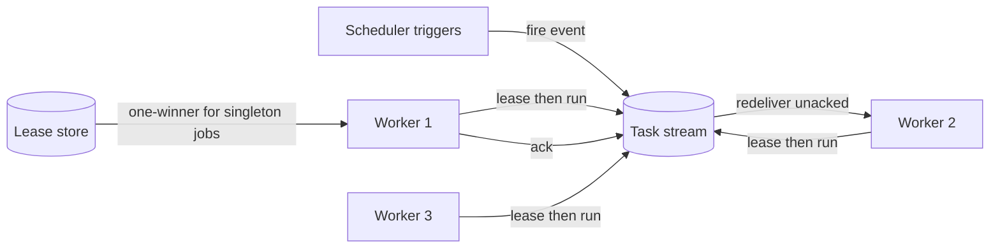

# Distributed Scheduling

## 1. One-Line Definition
Distributed scheduling is the practice of running cron-style and recurring jobs across a fleet of workers so that each job runs the right number of times — once, or once per interval — safely under failures, restarts, and heavy load, by pairing a time-based trigger with coordination (leader lease) or a distributed task queue.

## 2. Why Do We Need It?
A single-node cron is a single point of failure, one hot machine, and a hard ceiling — one node fires every daily job at midnight and melts under the stampede. A naive "run it on every replica" fires each job N times. You need several independent properties at once: a reliable trigger (every day at 09:00), exactly-one-winner execution, work distribution across the fleet, and safety when the executing node dies — no missed runs, no doubled runs.

## 3. Simple Intuition
One town crier with a big clock is a single point of failure — when he sleeps, the town misses announcements. Replace him with a community clock everyone can read. Whoever happens to be "the crier this round" rings the bell once (a lease turns absent criers into replaced criers). For other chores it is a tip jar: workers grab tasks from the jar, and if a worker dies mid-task the task returns to the jar for someone else — nobody needs to know every worker's name.

## 4. What Happens Without It?
Cron fires on every replica, so backup jobs run four times and nightly reports duplicate. Two workers both pick the same task, double-paying an invoice. The scheduler's leader dies, so no job fires at all that night. A job at 00:00 overloads one node and the afternoon run silently goes missing. Scheduling is where "eventually" meets "at exactly 9am": without coordination and dedup you get missed runs or doubled runs.

## 5. Core Idea
- **Decouple trigger from execution:** a scheduler/time-service emits "fire" events into a stream; workers subscribe and execute. The trigger becomes a producer, not a god — load, backpressure, and retries become data-flow problems, not cron problems.
- **One-winner via a leadership lease, not a vote:** for a globally-once job, the winner holds a lease key in a coordination store; when the lease expires, another worker takes over. "Run once" becomes "run once by the current lease holder" — that is what makes failover safe.
- **Queue-based distribution:** for fleet-wide recurring work (email 10M users), push task tokens into a distributed queue; consumers pick them at-least-once; idempotency keys dedupe the effects.
- **Time-based vs event-based schedules:** billing at midnight is wall-clock; "user signs up → send welcome email" is event-driven. The wall-clock ones need a scheduler; the event ones are usually just keyed queue consumers.
- **Idempotency is the safety net:** whichever runner executes, the effect must be repeatable — that converts "we double-fired" into "we re-ran, and nothing happened twice."

## 6. Important Terminology

| Term | Simple Meaning |
|------|----------------|
| Cron / schedule | Time-based trigger rule |
| Firing | Emitting a "run now" event |
| Leader lease | One-winner lock held by the executing worker |
| Missed fire | Trigger happened but nobody executed |
| Misfire policy | What happens for a missed or late run |
| Task stream | Queue holding run tokens |
| In-flight task | Task picked but not yet acked |
| Idempotency key | Dedup on the business effect |
| Watermark | Stream marker saying "data is ready" |
| Backpressure | Queue growing faster than consumers drain |

## 7. Basic Architecture



## 8. Request or Data Flow
1. The scheduler fires "job:nightly-report" at 00:00 and publishes a task token to the stream.
2. Workers contend for the singleton via a lease on `job:nightly-report` in the coordination store.
3. The winner acquires the lease, executes, and acks the token.
4. If the winner dies, the lease expires, another worker gets it, and the unacked token is redelivered — the effect stays non-duplicated because the job is idempotent.
5. Per-key work never needs the lease at all: each key's task is a queue message consumed once within its partition.

## 9. Practical Example
**Billing platform with daily reconciliation at 02:00 UTC:**
- A managed scheduler fires "reconcile" once per day; a lambda acquires a 10-minute leader lease (`recon:leader`) from etcd. A second contender sees "held" and backs off.
- Reconcile fans out per ledger key: 100k task tokens a day on a queue, twenty consumers at-least-once, each carrying the account id as an idempotency key.
- The leader dies at 02:10; the lease expires, a new leader runs, and the partially-processed records are already marked done (idempotency) so the run finishes the remainder. No double-charge, no missed day.

## 10. Scaling
- **Trigger scale:** a single scheduler node ticks a bounded job count; shard jobs by namespace across regional schedulers.
- **Execution scale:** the job list is tiny; the work is what grows. Shard tasks by key into partitions; scale consumers with partitions (see [[consumer-lag|Consumer Lag]]).
- **Misfire semantics:** per-job catch-up (run late) or skip-because-too-old — choose per job, not globally.
- **Clock basis:** wall-clock schedules run against UTC, not each worker's local clock.
- **Singleton concurrency cap:** lease throughput on the store (~hundreds/s on etcd) bounds concurrent singleton jobs — one lease per job, never one lease for everything.

## 11. Reliability and Failure Scenarios

| Failure | What Happens | Detection | Recovery | Trade-off |
|---------|--------------|-----------|----------|-----------|
| Scheduler dies | No triggers until replaced | Heartbeat / lease | Standby takes over; stream persists | brief trigger gap |
| Executor dies mid-job | Task not acked | Visibility timeout | Redelivery to another worker | double-execution risk (idempotency) |
| Lease expires while running | New holder starts alongside | Renewal timeout | New holder proceeds | overlap window |
| Queue lag grows | Work delayed | Consumer lag | Scale consumers / partitions | backpressure visible |
| Missed fire overnight | Job absent | Job ledger check | Catch-up or skip per policy | business-day correctness |

## 12. Consistency and Correctness
- **Exactly-one-run needs lease + fencing + idempotency, in that order:** the lease picks the winner, the fencing token stops a stale winner writing, and idempotency converts residual overlap into a no-op.
- **At-least-once queues** mean redelivered tasks must be effectively-once via idempotency keys — see [[exactly-once-effect|Exactly-Once Effect]].
- **Ordering within a job** is the queue's order; different jobs have no cross-job ordering contract.
- **A missed fire is only OK if the job tolerates it:** metrics cleanup tolerates; a ledger does not. Give every job an explicit "latest acceptable execution moment".
- **Data-readiness is not wall-clock:** a job that must run after all of Friday's data lands needs a watermark marker in the stream, not just a 02:00 trigger.

## 13. Performance
- Trigger latency: one store/queue write per fire, low milliseconds; heavy cost is downstream execution, not triggering.
- Lease throughput bounds concurrent singleton jobs (hundreds/s on etcd) — hence one lease per job.
- Per-key fan-out scales near-linearly with partitions; the singleton job is the bottleneck by design.
- Each redelivery costs a dedupe check — design the idempotency key as a primary-key lookup.

## 14. Security
Schedule and queue access must be authenticated — someone who can post to your task stream can run arbitrary work on your fleet; someone who can write the lease store can deny or duplicate runs. Sign job payloads, validate schedule inputs (cron-injection is real), and grant workers only the least-privilege roles their jobs need — see [[authentication-vs-authorization|Authentication vs Authorization]].

## 15. Trade-Offs

| Choice | Advantages | Disadvantages | When to Use |
|--------|------------|---------------|-------------|
| Single-node cron | Simple, exact time | SPOF, bad capacity | Dev, tiny job counts |
| Scheduler + stream | Decoupled, durable, retryable | More parts, approximate precision | Production at scale |
| Lease-based singleton | Exactly-one-winner, safe failover | Depends on store, overlap windows | Global once-jobs |
| Per-key queue partition | Scales with work, key dedupe | Keying needed | Fan-out workloads |
| Managed cron + LB | Zero infra | Platform coupling, coarse granularity | Standard cloud cron |

## 16. Common Mistakes
- Firing the same job on every replica believing "someone dedupes it."
- Leasing a job but not renewing it — the successor starts while you are mid-run.
- At-least-once queue with a non-idempotent executor — doubled effects.
- One global lease reused for all jobs — a single job blocks the fleet.
- Ignoring missed-fire semantics until a billing day is off by one.

## 17. HLD vs LLD Boundary
HLD: job definitions, trigger architecture (scheduler → stream vs managed cron), singleton lease policy, misfire semantics, idempotency-key design, concurrency model. LLD: cron-expression parsing, lease acquire/renew code, redelivery backoff, poisoned-task dead-letter handling, dedupe-key resolution in the executor.

## 18. Interview Questions

### Beginner
- Why is plain cron on every replica a bad idea?
- What does a leader lease buy you beyond running on N replicas?
- How does a queue turn one cron job into fleet-wide work?

### Intermediate
- Design a nightly billing job that never misses a day and never double-charges across ten workers.
- An executor dies mid-job. What happens at the queue layer, and why is idempotency load-bearing?
- What is a misfire policy and why must it be per-job?

### Advanced
- Design a scheduler handling 50k jobs with 2000 concurrent singleton runs and no missed midnight boundary.
- A job must run after all of Friday's data is hydrated — how do you express that reliably?
- How do you guarantee a once-per-hour task really runs once per hour when a worker is down for two hours?

## 19. Interview Memory Summary

> [!abstract]- Interview Memory Summary
> ### Remember
> - Decouple the trigger (scheduler) from the execution (stream + workers).
> - Singleton jobs: one-winner via a renewable lease, not a vote.
> - Queue work: at-least-once delivery + idempotency keys = effectively-once.
> - Lease + fencing + idempotency, in that order, make exactly-one-run real.
> - Misfire policy is per-job; "latest acceptable time" is a real requirement.
> - Fan out by key into partitions; consumers scale with them.
> - Wall-clock schedules need UTC basis and a readiness watermark.
> - The scheduler is a trigger producer, not an execution god.
>
> ### 30-Second Explanation
>
> Distributed scheduling separates a calendar trigger from a fleet execution layer. The scheduler publishes a fire event into a stream; workers compete for singleton jobs through a renewable leader lease (exactly one runs even as nodes die), and per-key work fans out as queue messages consumed at-least-once. Idempotency keys turn redeliveries into no-ops, and per-job misfire policies decide what a missed fire means. Scale comes from sharding the work by key, not from upgrading a single scheduler.
>
> ### Interview Traps
>
> - Letting every replica run cron and assuming dedup — nothing dedupes by default.
> - Lease with no renewal or fencing: two owners mid-run.
> - At-least-once queues with non-idempotent jobs.
> - One global lease for all jobs.
> - Skipping "latest acceptable time" — scheduling is a business decision.
>
> ### Key Trade-Off
>
> You trade a single-node cron for distributed resilience (durable triggers, lease election, redelivery, idempotency) at the cost of approximate firing precision, new moving parts, and the discipline that every job must tolerate a re-run.

## 20. Related Concepts

### Prerequisites

- [[distributed-locks|Distributed Locks]] — the lease that decides the one-winner.
- [[message-queue|Message Queue]] — the stream carrying fire events and tasks.
- [[consumer-lag|Consumer Lag]] — how fast the fleet drains scheduled work.
- [[retry-and-timeout|Retry and Timeout]] — backoff for redelivered tasks.

### Commonly Used Together

- [[consensus|Consensus]] — the store behind the lease guarantee.
- [[exactly-once-effect|Exactly-Once Effect]] — idempotency keys on the executor.
- [[outbox-pattern|Outbox Pattern]] — reliable job events committed with the business write.
- [[distributed-id-generation|Distributed ID Generation]] — run and dedupe IDs.

### Alternatives

- A managed cron service (fewer parts, platform coupling) instead of self-built scheduler + stream.

### Advanced Concepts

- [[raft-and-paxos|Raft and Paxos]] — if you build the scheduler registrar.
- [[crdt|CRDTs]] — convergent state for job counters where relevant.

Related planned topics (not authored yet): catch-up/misfire policies in depth, cron injection hardening.

## 21. References
Kubernetes documentation on CronJob and leader election patterns. Managed scheduler docs (AWS EventBridge, GCP Cloud Scheduler). HashiCorp Consul and etcd docs on leases. Fowler, *Patterns of Distributed Systems* — Leader Election and Lease patterns. Verify lease defaults and queue semantics against the platform you deploy on.

## 22. Active Recall

Test yourself before revealing each answer.

> [!question]- Why does "run once" require a lease rather than just a distributed counter?
> A counter says how many ran; a lease says who currently owns the right to run and expires when that owner dies. With only a counter, a crashed executor leaves a half-run job nobody is allowed to continue. The lease makes ownership recoverable (expire then re-acquire), turning "run once" into "run once by the current lease holder" — achievable and safe.

> [!question]- A worker dies thirty seconds into a ten-minute job. What happens next?
> The lease is not renewed, so at expiry the store grants it to another worker. The new worker acquires, is offered the same unacked task by the queue, and must handle records that are already partially processed. Idempotency keys make completed chunks no-ops; fencing tokens stop stale first-run writes from overwriting fresh data.

> [!question]- Singleton global job or per-key fan-out — how do you choose?
> If the work is global (one report from one snapshot) use a singleton lease. If it is per-entity (bill each of 10M accounts) push per-key tasks into a partitioned queue with one consumer per partition; each key is effectively-once via idempotency. Many designs use a singleton orchestrator that fans out per-key work.

> [!question]- What is the trap in firing a data-dependent job purely on wall-clock time?
> Time is not readiness: at 02:00 the Friday data may still be in flight. You need a watermark — a stream marker "Friday data complete" with a threshold timestamp — and the job triggers on the watermark, not the clock. Pure time triggers on volatile datasets are the classic missed-run bug.

> [!question]- Interview scenario: a daily report has duplicated for two weeks. Walk the diagnosis.
> Check three layers: (1) did two lease holders run concurrently (no renewal/fencing)? (2) was the queue redelivering to a non-idempotent executor? (3) did two regional schedulers both fire (no per-job namespace)? Fix with per-job lease + fencing, idempotency keys on the report write, and a recorded fire-per-job id.

> [!question]- Why is "at-least-once + idempotent consumer" stronger than claiming exactly-once delivery?
> Exactly-once delivery is a transport promise — one delivery per message — nearly impossible against crashes and duplicated sends. At-least-once delivery plus an idempotent consumer produces the effect "processed as if once" regardless of redeliveries; the guarantee is honored on the consumer side. See [[exactly-once-effect|Exactly-Once Effect]].

> [!question]- A job missed its 02:00 fire because of a three-hour outage. What decides the outcome?
> The misfire policy. Catch-up runs at 05:00 (late but complete) or skips (bad for payables). The answer is an explicit "latest acceptable moment" and an alert if the fire lands outside it — each job declares whether skipping is safe for the business, since a 02:00 fire is rarely actually urgent at 02:00.

> [!question]- Twenty workers see the same 00:00 fire. How does exactly one of them execute?
> All twenty attempt to acquire the lease; the store grants one and returns a fencing token. The rest back off and recheck whether the run happened — they become witnesses, not executors. It is the same machinery as leader election: the lease is the election, the token is the mandate, idempotency is the constitution.

## 23. When Should I Use This?

### Use it when

- Jobs must fire on a wall-clock schedule and must not miss days.
- Exactly-one-winner is required and executors can die mid-job.
- Work naturally fans out by a key (payment per account, email per user).
- The fleet must share execution load rather than one cron node.
- Job effects can be made idempotent or keyed.

### Avoid it when

- A single-node cron is truly sufficient (dev, few jobs, no failover need).
- You need exact firing precision where stream/redelivery latency is unacceptable.
- Work is not keyable and cannot tolerate at-least-once redelivery.
- Zero overlap between runs is non-negotiable and you cannot implement fencing + idempotency.

### What problem does it solve?

Reliable fleet-wide execution of time-based jobs: durable triggers, exactly-one-run (or effectively-once) semantics under failure, and scaling via partitioned execution instead of one machine's CPU.

### What problem does it NOT solve?

Precise instant firing (schedules are approximate), jobs whose effects fundamentally cannot be repeated, and anything that depends on data readiness that cannot be expressed as a watermark.

## 24. Decision Connections

Decisions that go together with distributed scheduling:

- [[distributed-locks|Distributed Locks]] — the renewable lease that picks the one-winner.
- [[consensus|Consensus]] — linearizable lease storage underneath.
- [[message-queue|Message Queue]] — the fire-event and task transport.
- [[outbox-pattern|Outbox Pattern]] — committing a scheduled event with the business transaction.
- [[exactly-once-effect|Exactly-Once Effect]] — idempotency keys that kill the double-run.
- [[consumer-lag|Consumer Lag]] — the health metric of the execution fleet.
- [[retry-and-timeout|Retry and Timeout]] — backoff on lease contention and queue redelivery.
- [[distributed-id-generation|Distributed ID Generation]] — run and dedupe identifiers.

Decision tree:

```
Do I need time-based jobs across many nodes?
    |
    +-- Small job count, one machine is fine?
    |      → single-node cron, keep it simple
    |
    +-- Fleet must execute, failures happen
    |      |
    |      +-- Global singleton job?   → leader lease + fencing + idempotent runner
    |      +-- Fan-out by key?         → partitioned queue, at-least-once + idempotency
    |      +-- Both?                   → singleton orchestrator that fans out
    |
    +-- Start depends on data, not time?
           → trigger on a watermark, not a wall clock
```