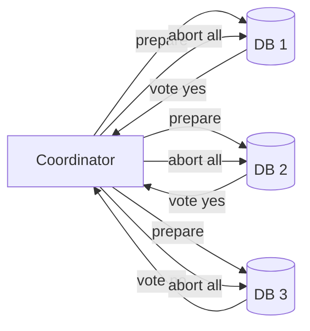

# Distributed Transactions (2PC / Saga)

## 1. One-Line Definition
Distributed transactions coordinate atomicity across multiple databases or services — 2PC (two-phase commit) syncs general commit with a coordinator and a prepare/vote phase, while Sagas split the operation into local steps with compensating actions — so a multi-node update is either all-happened or explicitly-recovered instead of half-happened.

## 2. Why Do We Need It?
A single-node [[transactions-and-acid|transactions-and-acid]] transaction stops at one database. Microservices and sharded systems regularly must update several stores at once (charge the card AND reserve inventory AND book the flight). If one succeeds and another fails, you have an invariant violation: money debited but seats not booked, inventory over-sold. You need a protocol that either makes the whole thing go through or leaves the system in a recoverable, consistent state.

## 3. Simple Intuition
2PC is a wedding ceremony: the officiant (coordinator) asks each guest (participant) in advance whether they will commit — everyone says "I do" (prepare). Only then does the officiant say "I now pronounce" (commit); a guest who said no cancels the whole ceremony. Sagas are more like a travel plan: you book the flight, then the hotel, then the car — and if the car booking fails, you cancel the hotel and refund the flight. No single ceremony; each leg compensates the previous one.

## 4. What Happens Without It?
Your checkout deducts inventory in one DB, then the payment service dies — the order row is "paid" and the inventory is stashed with no order. Databases drift into violated invariants that eventually surface as angry customers and reconciliation fires. Distributed side effects are the norm in modern systems; without a protocol, "atomic-ish" becomes "actual corruption, occasionally."

## 5. Core Idea
- **2PC: the voting + command ceremony.** Phase one (prepare): coordinator asks every participant to prepare (write intents, no commit) and vote. Phase two (commit/abort): if everyone votes yes, the coordinator commands commit; anyone says no or the coordinator times out, it commands abort. Participants that prepared must wait — commit or rollback is decided by the group.
- **3PC improves liveness** (added pre-commit round tolerates coordinator failure better) but still cannot survive a partition — the classic "the only safe end of a 2PC is blocking."
- **Saga: the compensating opposite of 2PC.** Each service transaction is locally ACID; a saga runs step 1, 2, 3... and on any failure runs the compensating action for every completed step (step0 compensation = refund, etc.). Atomicity is replaced by "eventually consistent, always recoverable."
- **Orchestrated vs choreographed saga:** a central orchestrator drives each step and its compensation (explicit, debuggable) vs services emitting events that trigger the next step (decoupled, hard to track). Pick orchestration unless you have a good reason.
- **The transactional outbox does saga-boundary messaging right:** a saga step writes its business row and an intent-to-publish row in one local transaction; a relay publishes it — no lost saga messages, no double sends (see [[outbox-pattern|Outbox Pattern]]).
- **Effort lies in idempotency:** 2PC retries the same prepare over and over; saga compensations may run twice; every participant must tolerate re-execution — this connects straight into [[exactly-once-effect|Exactly-Once Effect]].

## 6. Important Terminology

| Term | Simple Meaning |
|------|----------------|
| Local transaction | ACID commit on one store |
| Prepare | Step 1 of 2PC: vote, no commit yet |
| Commit point | Step 2: the coordinator's final order |
| Coordinator / trainer | The process running the 2PC or saga |
| Participant | A DB/service that takes part |
| Compensation | Saga's reverse-step to undo a done step |
| Orchestration | Central driver of saga steps |
| Choreography | Events from each service trigger the next |
| Saga log | Durable record of steps and compensations |
| XA | The classic 2PC standard for DBs |

## 7. Basic Architecture




## 8. Request or Data Flow
1. Coordinator asks each participant to prepare (write intents, no commit yet). Votes come back.
2. All yes → coordinator forces every participant to commit. Any no or timeout → coordinator forces everyone to abort.
3. Participating services commit/rollback independently then ack.
4. A saga instead runs each local transaction and records steps in a saga log; on failure it runs compensation actions in reverse order for completed steps, each also recorded.
5. The saga log + idempotent steps + outbox allow a crashed coordinator to resume mid-saga where it left off.

## 9. Practical Example
**Flight booking across 3 services:**
- 2PC: book flight (service A), reserve seat (B), charge card (C). If C's prepare fails, A and B roll back — the user sees "booking failed" with no ghost reservation.
- Saga: book flight, then reserve seat, then charge. If seat reservation fails, compensation cancels the flight and refunds the charge. The seat is no longer blocked; the flight refund is eventual (compensation message in the outbox).
- Which is right? In modern microservice practice the saga wins: 2PC holds locks/DB connections across distributed calls, and one slow participant blocks everything. 2PC survives in single-DB-span XA or in strict serializable stores.

## 10. Scaling
- **2PC scales poorly across services:** locks held during prepare span network waits; one slow or hung participant blocks the whole group (the classic "blocking 2PC"). It suits few, fast, within-DB participants.
- **Sagas scale naturally:** each step is an independent local transaction; parallel steps and per-service scaling are free. The coordinator is the only serial point (and is idempotent-resumable, not a lock).
- **Compensation loads add up:** every failed saga refunds and cancels; schemas must be able to absorb reverse traffic (hooks, negative reservations).
- **Fan-out:** a saga touching 30 services is a 30-step state machine — collapse steps into bulk aggregation or a single local DB around the goal.
- **Reliability machinery:** durable saga/outbox state, idempotent endpoints, dead-letter queues, retry with backoff ([[retry-and-timeout|Retry and Timeout]]).

## 11. Reliability and Failure Scenarios

| Failure | What Happens | Detection | Recovery | Trade-off |
|---------|--------------|-----------|----------|-----------|
| Coordinator dies in prepare | Participants wait indefinitely | Heartbeat/timeout | Coordinator log recover, resume vote | blocking |
| Participant dies after prepare | Can't finish commit | Prepare record + timeout | Recover from prepare log, finish | locks held during recovery |
| Saga step fails | Compensation begins | Local error | Reverse completed steps | eventual consistency window |
| Compensation fails | Saga stuck mid-reversal | Attempt retry | Retry with backoff, dead-letter | manual intervention |
| Message lost between steps | Next step never runs | Saga log/watermark | Outbox relay, redeliver | exactly-once-ish discipline |
| Network partition | 2PC blocks, saga compensates | Health checks | 2PC: wait; saga: compensate | availability vs consistency |

## 12. Consistency and Correctness
- 2PC gives (with a faultless, durable coordinator) strong atomicity — but liveness is not guaranteed under failure; that is its honesty: atomic yes, but "might block."
- Sagas give eventual consistency: readers may briefly see a partially-booked order; the invariant is "the saga either completes all steps or all compensations", enforced by the saga log.
- Both demand idempotency: 2PC repeats prepares, sagas repeat compensations and steps. Idempotency keys per operation (see [[exactly-once-effect|Exactly-Once Effect]]).
- Ordering: sagas preserve step order; compensation must be reverse of completion order — record completion order in the saga log.
- CAP: 2PC trades availability for atomicity; a saga trades atomicity for availability.

## 13. Performance
- 2PC: one or two extra round trips per participant per transaction, plus locks held across the ceremony — for a few participants it is tolerable, for 30 it is a tree fire.
- Saga: each step is its own local commit; overhead is the outbox write + messaging. Much cheaper than holding 30 distributed locks.
- The coordinator is a state machine with durable writes; latency is a few ms local, more cross-DC.
- The real cost of sagas is in the compensation wave after failures (each reverse step is a fresh transaction).

## 14. Security
Compensation endpoints and saga messages are business-effect pathways: authenticate and authorize them like any mutation; an attacker who can trigger a fake compensation can un-issue real refunds. Keep saga logs and outbox rows access-controlled (they reveal business volume and orchestration order). Never run coordinator/outbox with credentials on a shared dev keychain.

## 15. Trade-Offs

| Choice | Advantages | Disadvantages | When to Use |
|--------|------------|---------------|-------------|
| 2PC | Strong atomicity, familiar semantics | Blocking, locks tie resources, poor across services | XA across a few DBs, strict stores |
| 3PC | Survives coordinator crash eventually | Still fails on partitions, complexity | Theory, rarely used |
| Orchestrated saga | Explicit, debuggable state machine | Coordinator is a dependency | Most multi-service money flows |
| Choreographed saga | No coordinator, services decoupled | Implicit, event-order sensitive | Niche signal-driven flows |
| Outbox + idempotency | Reliable messages, no distributed locks | Needs DB pattern + dedupe | The default in modern platforms |

## 16. Common Mistakes
- Reaching for 2PC across unrelated microservices — it blocks and couples; sagas win there.
- No saga log: a coordinator crash loses its place and steps never compensate.
- Non-idempotent compensation — refunding a refund.
- Choreography for a small flow: it is a mess to debug; orchestration is clearer.
- Forgetting that in 2PC even the "abort" must be durable — half-aborted is as bad as half-committed.

## 17. HLD vs LLD Boundary
HLD: 2PC vs saga decision, orchestrator vs choreography, saga step list + compensations, outbox/queue selection, idempotency contract, and the resume-on-crash story. LLD: the XA driver calls, coordinator state machine, saga log schema, compensation function per step, idempotency-key check, and dead-letter handling.

## 18. Interview Questions

### Beginner
- What is the difference between a local transaction and a distributed transaction?
- Describe the two phases of 2PC.
- What is a compensating action, and when do you run it?

### Intermediate
- Why does 2PC block under a partition, and is that acceptable?
- Design a saga for "order → payment → inventory → shipping" — list steps and compensations.
- Why is idempotency essential to both 2PC and sagas?

### Advanced
- The coordinator crashes after prepare. Can the transaction commit? Why or why not, and how does a saga avoid that fate?
- Compare sagas with the outbox pattern for guaranteeing "order created" and "payment requested" happen together.
- When your saga hits a sharded DB, how do the step boundaries remain atomic, and what changes?

## 19. Interview Memory Summary

> [!abstract]- Interview Memory Summary
> ### Remember
> - 2PC = prepare (vote) + commit/abort (command); coordinator-driven.
> - 2PC guarantees atomicity but can block forever on a partition.
> - Saga = local steps + compensating actions, orchestrated or choreographed.
> - Sagas give eventual consistency — readers may see partial state.
> - Both need idempotent operations to recover safely.
> - The saga log / outbox is what lets a crashed coordinator resume.
> - 2PC suits few fast participants (XA in a DB); sagas suit services.
> - Compensation runs in reverse completion order, also recorded.
>
> ### 30-Second Explanation
>
> Two options exist for making multi-store updates all-or-recoverable. 2PC runs a prepare/vote ceremony then commands commit or abort to everyone with a durable coordinator — strong atomicity, but it blocks if anyone lags or partitions. Sagas run each local step as its own transaction and respond to failure by executing reverse compensations for the completed steps — atomicity replaced by recoverability, and eventually consistent state in between. Modern practice favors sagas plus an outbox for the messages, with 2PC reserved for a small set of databases with real XA.
>
> ### Interview Traps
>
> - Proposing 2PC across a service mesh without admitting the blocking/lock cost.
> - Sagas with no completion-order log.
> - Compensations that are not idempotent.
> - Claiming "the saga is atomic" — it is recoverable, not atomic.
> - Forgetting the abort itself must be durable in 2PC.
>
> ### Key Trade-Off
>
> 2PC buys strong atomicity at the price of blocking and lock-holding across distributed calls; sagas buy availability and decoupling at the price of eventual consistency and a compensation discipline you must operate with.

## 20. Related Concepts

### Prerequisites

- [[transactions-and-acid|Transactions and ACID]] — what each local step preserves.
- [[strong-vs-eventual-consistency|Strong vs Eventual Consistency]] — the consistency the saga settles for.
- [[cap-theorem|CAP Theorem]] — the availability-vs-atomicity tension.

### Commonly Used Together

- [[outbox-pattern|Outbox Pattern]] — reliable saga messages without 2PC.
- [[exactly-once-effect|Exactly-Once Effect]] — idempotency keys on steps and compensations.
- [[message-queue|Message Queue]] — saga step transport.
- [[distributed-locks|Distributed Locks]] — where a step needs exclusive access.

### Alternatives

- [[crdt|CRDTs]] — conflict-free convergence instead of transactions.
- Single-writer schemas / [[sharding|Sharding]] with co-location — make operations local again.

### Advanced Concepts

- [[consensus|Consensus]] + log-based coordinators — how serializable stores like Spanner implement distributed transactions.
- [[bft|Byzantine Fault Tolerance]] — when participants may lie.

Related planned topics (not authored yet): TCC (try-confirm-cancel), saga analytics patterns.

## 21. References
Hector Garcia-Molina & Kenneth Salem, "Sagas" (1987) — the original paper. Gray, "Notes on Database Operating Systems" for 2PC analysis. Chris Richardson on sagas and the saga pattern documentation. Kleppmann, *Designing Data-Intensive Applications* ch. 9 (atomic commit). Verify XA and saga support against your specific DB/message-broker docs.

## 22. Active Recall

Test yourself before revealing each answer.

> [!question]- What does 2PC guarantee that a saga does not?
> 2PC guarantees atomicity: after the coordinator's decision, either every participant committed or every participant aborted — readers never see a half-state. Sagas are recoverable rather than atomic: intermediate steps can be visible; the guarantee is that failures drive compensation, so the system converges to consistent (all steps or all compensations) over time.

> [!question]- A participant crashes between prepare and the coordinator's commit command. What happens?
> The participant holds a prepared-but-uncommitted lock; it cannot decide alone. On restart it must consult its own durable record and either complete the commit if the coordinator's command is reachable (or destine the log), or wait/block for coordinator guidance. This waiting is the notorious 2PC block — a saga would instead have already begun compensating previous steps.

> [!question]- Why is the orchestration style usually preferred over choreography for sagas?
> Orchestration keeps the state machine in one place: compensations are explicit, failure is traceable, and the saga log can be replayed. Choreography scatters the control flow into N services' event handlers, making "which step runs after which" implicit and ordering battles real. Orchestration wins except in the rare flows where a coordinator would couple tightly to every participant.

> [!question]- Design decision: three microservices involved in a payment. 2PC or saga?
> Saga, almost always: participants are independent services across processes and networks, and 2PC would hold locks in service A while service B's call times out, blocking A's writers. With a saga you book, reserve, and charge in separate local transactions, compensating failures — eventual consistency is eminently acceptable for money when refunds are themselves injections.

> [!question]- What is the outbox's exact role in a saga?
> A step must both mutate its DB and (maybe) send the next step's message. Writing the outbox row in the same local transaction makes the message reliable: the relay publishes it exactly as it appeared, so no step message is lost on a DB-succeed-publish-crash. That is what lets the saga advance deterministically — including compensations.

> [!question]- Interview scenario: a saga step fails and its compensation runs twice. Is the system corrupt?
> If the executor's compensation is idempotent, no: the refund was issued once, the second attempt finds the record already refunded (via an idempotency key) and no-ops. If not idempotent, you just refunded twice. This is precisely why "exactly-once effect" is a consumer-side property, not a transport promise — see [[exactly-once-effect|Exactly-Once Effect]].

> [!question]- How does a sharded database change the saga's step boundary?
> A saga step either stays within one local transaction (single shard) or itself becomes a mini-saga across shards. Co-locate related rows on one shard via a good [[shard-key|Shard Key]] so steps stay local; the moment a step spans shards it effectively inherits a distributed transaction again, and you are back to picking between 2PC and a nested saga.

> [!question]- When is 2PC genuinely the right call?
> When participants are few, fast, and on your side of a trustworthy network — classic XA across two physical databases, or inside a strict serializable distributed store with per-shard transactions. If a participant is external (partners, banks) it cannot XA anyway, so compensation (saga) is the only language they speak.

> [!question]- What makes the coordinator's state machine durable in both 2PC and saga recoveries?
> Every decision — prepare votes, commit/abort command, saga steps completed, compensations run — is appended to a durable log before it is applied to participants. On restart the coordinator reads the log, re-drives incomplete participants to the decided outcome, and continues. Without that log, the coordinator crash undoes both protocols' recoverability.

## 23. When Should I Use This?

### Use it when

- A business operation spans multiple stores/services and a partial success is unacceptable.
- You can make each step local-ACID and compensate on failure.
- Idempotency keys or consumer-side dedupe are implementable for every participant.
- The involved DBs can host an outbox or a saga log without exotic changes.

### Avoid it when

- A single DB write (or one local transaction) already covers the change — the distributed machinery is wasted complexity.
- Participants are too slow or volatile for 2PC's lock-hold window.
- The operation is genuinely non-compensable (deleting real history) and atomicity is required — then question the architecture or accept 2PC's blocking.
- You cannot afford the saga's intermediate visibility (a strict serializable requirement).

### What problem does it solve?

Multi-store atomicity (through 2PC) or multi-store recoverability (through sagas) — the invariant that a multi-part business change is never silently half-applied.

### What problem does it NOT solve?

Perfect liveness under partitions (2PC blocks; sagas eventually consistent), near-real-time visibility of a definitive final state, unit-tests for all the compensation paths you never exercise, and simplicity — both protocols are machinery you operate.

## 24. Decision Connections

Decisions that go together with distributed transactions:

- [[transactions-and-acid|Transactions and ACID]] — the local guarantee every 2PC participant and saga step must have.
- [[outbox-pattern|Outbox Pattern]] — the reliable-messaging foundation sagas stand on.
- [[exactly-once-effect|Exactly-Once Effect]] — idempotency that makes 2PC reuse and saga compensation safe.
- [[message-queue|Message Queue]] — the transport steps and compensations ride.
- [[strong-vs-eventual-consistency|Strong vs Eventual Consistency]] — saga's eventual state vs 2PC's strong window.
- [[cap-theorem|CAP Theorem]] — why the two protocols make opposite availability bets.
- [[distributed-locks|Distributed Locks]] — where a saga step needs exclusive access.
- [[shard-key|Shard Key]] — co-location that keeps steps single-shard.

Decision tree:

```
A business operation touches several stores/services.
    |
    +-- Can you make it a single local (co-located) write?
    |      → do that; avoid distributed machinery entirely
    |
    +-- Participants are external or non-cooperative?
    |      → saga with compensation (the only language they speak)
    |
    +-- All participants cooperative, few, and fast?
    |      |
    |      +-- Strict atomicity required?   → [[distributed-transactions|2PC]]
    |      +-- Recoverability acceptable?   → saga
    |
    +-- Default modern choice?
           → saga + orchestrator + outbox + idempotency
```