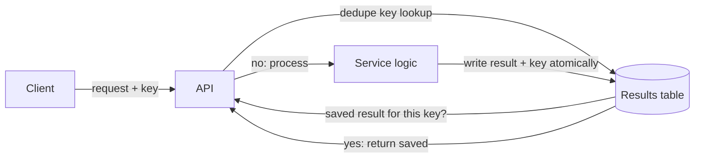
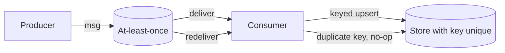

# Exactly-Once Effect

## 1. One-Line Definition
Exactly-once is not a delivery guarantee — protocols can only promise at-least-once — so distributed systems achieve the exactly-once *effect* by writing each delivered message's result exactly once, using idempotent operations, dedupe keys, and transactional side-effect boundaries.

## 2. Why Do We Need It?
At the network, a sending machine that crashes cannot prove whether the message was received, so retry means duplicates are always possible. The business, however, absolutely cannot stand duplicates: two identical charge kicks against a card, two identical reservations for one seat, two identical "account created" inserts. The answer is not to eliminate redelivery (impossible) but to make the *effect* of processing idempotent — reprocessing changes nothing. That property — not the transport — is what "exactly-once" means in practice.

## 3. Simple Intuition
The post office guarantees your letter arrives at least once — it may be lost and re-sent, and two copies could arrive on different days. But the bank's cashier's orders (the letter) are numbered: the paymaster checks "is this voucher already honored?" before paying. The postal system cannot be exactly-once; the voucher registry makes the human effect exactly-once. Dedupe keys are the voucher numbers, and the registry is the receiving system's store.

## 4. What Happens Without It?
A retry storm double-charges a thousand customers. Two consumers pick the same task and both increment the same bank balance. A DLQ replay runs every job twice and the nightly report contains duplicated rows. The fascinating part is that many duplicates are *invisible in-flight* — they crash, get re-injected by a broker, and only the ledger discovers them, weeks later, when a human reconciles.

## 5. Core Idea
- **At-least-once is the honest floor:** every real message system is at-least-once (or at-most-once, which loses messages). Exactly-once *delivery* is unattainable against crash/duplication/at-least-once retries — only the effect is controllable; see [[delivery-semantics|Delivery Semantics]].
- **Dedupe keys are the mechanism:** each logical operation carries a unique key (order id, run id, request UUID); the consumer persists the key-to-result mapping and refuses a duplicate key. Check-and-record must be atomic.
- **Idempotent consumers != duplicate-free:** "the operation is idempotent" and "the handler dedupes" are two different designs — idempotency makes reprocessing harmless, dedupe makes duplicates not happen twice.
- **The atomic boundary is the crux:** "check key → do work → record key" in three steps is racy: a crash between do-work and record-key re-runs work. Dedupe must be within (or immediately after) the transactional side effect — the [[outbox-pattern|Outbox Pattern]] and transactional outputs are how this stays atomic.
- **Where the effect lives:** at the consumer (DB upsert keyed by dedupe id), at the API (Idempotency-Key header re-serving the saved result), and at the saga step (same compensation id). Pick the layer the truth lives in.

## 6. Important Terminology

| Term | Simple Meaning |
|------|----------------|
| At-least-once | Delivery guarantee: >=1 delivery, dupes possible |
| At-most-once | Never deliver twice, may drop |
| Idempotent op | Re-applying, unchanged result |
| Dedupe key | Unique id the consumer keys on |
| Idempotency header | Client-supplied key for re-serving result |
| Effect boundary | The point where the outcome becomes durable |
| Check-and-record | Atomic "seen this key before? record it" |
| Outbox | Local tx row published to the broker reliably |
| DLQ | Dead-letter queue for failed processing |
| Transactional output | Write output row in the same tx as dedupe |

## 7. Basic Architecture





## 8. Request or Data Flow
1. Producer sends "process order 123" with dedupe key `order:123:attempt-5`.
2. Broker redelivers at-least-once (maybe twice after a retry or a consumer crash).
3. Consumer runs `INSERT ... ON CONFLICT (dedupe_key) DO NOTHING` (or a transaction that reads the key's row).
4. First write inserts and triggers the side effect; the duplicate hits the unique constraint and is skipped.
5. The truth is in the consumer's store, not the broker: exactly-once *effect* survives arbitrary redeliveries.

## 9. Practical Example
**Payment intents with 3 retries hitting $50 charges:**
- Client sends `POST /charge` with `Idempotency-Key: pay_1X3R`.
- Service checks the key in the payments DB; a prior successful run stored `pay_1X3R → status: captured`. The retry re-serves the saved 200 with "captured", no second bank call.
- A crash mid-charge on the first attempt: the key was recorded as `processing`; the retry sees `processing` and either finishes the outstanding ledger write or refunds-and-fails — never a second capture.
- Result: the card is charged exactly once no matter how many times the network replays the same request.

## 10. Scaling
- **Dedupe store is write-hot:** unique-key lookups are point queries — use a strongly consistent store, never an eventually consistent cache, or the same key can race to "not seen" on two reads.
- **Throughput:** keyed-upsert engines (RDBMS unique index, DynamoDB condition, Bigtable row key) handle the write rate; partition by dedupe key for the hot path.
- **TTL the dedupe keys:** dedupe rows must eventually expire — keep the window >= the slowest redelivery (order days, not minutes).
- **Multi-region:** the dedupe decision must be single-view-of-truth where concurrent replays could race — pin a key to one region/shard, or use a global single-writer per key.

## 11. Reliability and Failure Scenarios

| Failure | What Happens | Detection | Recovery | Trade-off |
|---------|--------------|-----------|----------|-----------|
| Consumer crashes mid-handler | Key recorded, work half-done | `processing` status row | Retry against the row, complete or fail | status row is the contract |
| Broker redelivers late | Duplicate key arrives post-TTL | New insert attempts | None (window mists) | TTL window = idempotency horizon |
| Dedupe store down | Cannot check keys | Client error | Fail the request, no side effect | availability vs effect safety |
| Same key, two consumers | Race to write | Unique constraint | Retry | atomic upsert is mandatory |
| DLQ replay | Old messages re-run | Replay tool logs | Keyed upsert skips resolved keys | must not purge history too early |

## 12. Consistency and Correctness
- **Exactly-once effect requires a linearizable dedupe decision**: check-and-record in one atomic operation; an "eventually consistent" check can both read "not seen".
- **Crash semantics are encoded in state:** `processing` vs `done` vs `failed` rows make a crash recoverable — the retry must be able to distinguish "never started" from "partially done".
- **Ordering is a bonus, not a requirement:** dedupe works without total order; Kafka partition ordering is what keeps per-key dedupe stores linear while retaining order.
- **The outbox is the enabler that prevents the flipside bug:** if publishing happens outside the dedupe transaction, either the message is lost or the result is deduped incorrectly — the [[outbox-pattern|Outbox Pattern]] binds them.
- **The effect is settled at the point of record:** once the consumer's store holds the result, redeliveries are no-ops. Clients should treat a repeated response of the same key as identical, by contract.

## 13. Performance
- Dedupe cost is one point read/upsert per message (unique-key lookup), which is cheap at a store's normal point-query throughput.
- Writing the result + dedupe key in one transaction is the same cost as the business write itself.
- Avoiding a dedupe table entirely by embedding the key into the target row (e.g., `(order_id) PRIMARY KEY` on the charge row) is often the cheapest design — the uniqueness constraint is the dedupe.
- TTL cleanup scans are the hidden cost; index the expiry or use tiered deletion.

## 14. Security
Dedupe keys and idempotency headers must not be blind trust: a key collision across *different* users could merge results (an attacker picks a key you used). Namespace keys per requester or include the account id in the key. Never store the key without constraining it to the owner. Validate and cap the key (a bogus 10MB header is memory pressure). This is a correctness leak disguised as a security one — treat it in the auth layer (see [[authentication-vs-authorization|Authentication vs Authorization]]).

## 15. Trade-Offs

| Choice | Advantages | Disadvantages | When to Use |
|--------|------------|---------------|-------------|
| Idempotency header + result cache | Simple, standard for APIs | Key lifecycle, extra store read | Client-driven retries |
| Keyed upsert on the target row | Dedupe = unique constraint, no table | Schema coupling, key discipline | Single-store business domains |
| Outbox + keyed consumer | Reliable + effect-once end to end | Two components, transactional pattern | Cross-service event flows |
| Dedupe table (TTL rows) | Flexible, per-message result | Extra I/O, expiry scans | High-volume generic consumers |
| At-most-once + tolerate loss | No dups ever | Data loss | Log/metrics, throwaway work |

## 16. Common Mistakes
- Thinking "exactly once" means the broker does it — it does not; the consumer must.
- Check-and-record without atomicity — race window lets a duplicate in.
- Idempotency with a non-keyed store (no unique index) — dedupe is only as strong as its constraint.
- TTL window shorter than the slowest legit redelivery, then "new" processing of an old key.
- Dedupe keys identical across unrelated users, leaking or merging results.

## 17. HLD vs LLD Boundary
HLD: choose the effect boundary (consumer upsert, API header, outbox), dedupe-store semantics (strong consistency required), key schema and namespace, dedupe TTL, and cross-region key pinning. LLD: the upsert SQL / conditional write, the Idempotency-Key parsing and cache read, status-row transitions, and key-collision handling in the handler code.

## 18. Interview Questions

### Beginner
- Why is exactly-once *delivery* impossible at the network level?
- What is the difference between at-least-once delivery and an idempotent consumer?
- Where does the dedupe key live in a typical payment handler?

### Intermediate
- Design the "check key, do work, record key" flow so a crash at any point stays safe.
- Why does a dedupe store need strong consistency rather than "eventually consistent"?
- Your broker redelivered the same message after a month. What happens?

### Advanced
- Combine outbox + dedupe keys + at-least-once into one end-to-end order flow; where could a double still happen?
- Design per-user key namespacing so idempotency headers cannot collide between accounts.
- Multi-region: how do you keep the exactly-once effect when the same key is replayed in two regions?

## 19. Interview Memory Summary

> [!abstract]- Interview Memory Summary
> ### Remember
> - Exactly-once delivery is impossible; at-least-once is the honest floor.
> - Exactly-once *effect* = idempotent consumers + dedupe keys.
> - Dedupe decision must be atomic and strongly consistent.
> - 'processing' vs 'done' states make crashes recoverable.
> - The [[outbox-pattern|Outbox Pattern]] binds side effects to the dedupe transaction.
> - TTL the keys longer than the slowest redelivery.
> - Namespace dedupe keys per owner.
> - Idempotency header = resaved result; unique index = free dedupe.
>
> ### 30-Second Explanation
>
> No protocol can guarantee a message is delivered exactly once — networks lose and duplicate messages, so honest systems promise at-least-once. Exactly-once is achieved at the consumer: every operation carries a unique dedupe key, and the consumer records the key-to-result mapping atomically with the side effect. First delivery writes and effects; redeliveries hit the key, no-op, and get the stored result. The dedupe decision must be strongly consistent and inside the transactional boundary — that is the outbox's role — and keys must be namespaced per owner and outlive the slowest retry.
>
> ### Interview Traps
>
> - Claiming Kafka "does exactly once" without mentioning the consumer-side dedupe/transactional work.
> - A dedupe check that reads first, writes later.
> - Using a lazily-consistent cache as the dedupe truth.
> - Too-short TTL on dedupe keys.
> - Unamespaced keys colliding across users.
>
> ### Key Trade-Off
>
> You trade a durable, strongly-consistent dedupe layer (extra store, keys, transaction discipline) for certainty that business effects happen once — the only way "exactly once" can be real.

## 20. Related Concepts

### Prerequisites

- [[delivery-semantics|Delivery Semantics]] — at-least-once is the floor this effect builds on.
- [[outbox-pattern|Outbox Pattern]] — the transactional side-effect binder.
- [[retry-and-timeout|Retry and Timeout]] — why duplicates happen and how retry discipline shapes them.

### Commonly Used Together

- [[distributed-transactions|Distributed Transactions (2PC / Saga)]] — saga steps keyed the same way.
- [[distributed-scheduling|Distributed Scheduling]] — cron fires keyed by run-id.
- [[distributed-id-generation|Distributed ID Generation]] — who mints the dedupe keys.
- [[message-queue|Message Queue]] — at-least-once transport that replays into the dedupe.

### Alternatives

- [[crdt|CRDTs]] — idempotent-by-construction merging instead of dedupe.
- [[distributed-locks|Distributed Locks]] — exclusion instead of dedupe for shared-writer problems.

### Advanced Concepts

- [[distributed-transactions|Distributed Transactions (2PC / Saga)]] — atomicity as the alternative mechanism.

Related planned topics (not authored yet): Kafka exactly-once semantics internals, dedupe-TTL tuning, idempotency keys at Gateway scale.

## 21. References
Kleppmann, *Designing Data-Intensive Applications* ch. 11 (processing streams with dedup). Kafka documentation on exactly-once semantics. AWS developer guide on Idempotency-Key header behavior. Fowler, *Patterns of Distributed Systems*, 'Idempotent Receiver' pattern. Verify against the current version of the message broker and payment API docs you target.

## 22. Active Recall

Test yourself before revealing each answer.

> [!question]- Why is exactly-once delivery literally impossible over a network?
> To know a message was received, the sender needs an acknowledgment; if the ack is lost, the sender retries, and either the duplicate arrives or the first copy was lost. There is no way for a crashed sender to distinguish "my message was delivered and the ack was lost" from "the message was lost before delivery". Duplicate-or-lost is unavoidable; the only choice is which of the two you pick (at-least-once vs at-most-once).

> [!question]- A consumer receives the same message twice within 5 seconds. What exactly must be true for the effect to be once?
> The dedupe decision "have I seen the key?" must be atomic with the record itself — a conditional insert with a unique key, or a transaction that checks and writes in one step. If a plain read-then-write, the two deliveries can both read "not seen" and both apply. The key can be re-checked at no cost; the danger is the check itself racing.

> [!question]- How does the 'processing' status make a crash recoverable instead of fatal?
> The dedupe row records more than "exists": started-with-status 'processing'. A crash between starting the work and writing the result is detected by the subsequent delivery seeing 'processing' and completing the outstanding ledger write (or failing it cleanly). Without a status column, a crash at that moment is indistinguishable from "not started" — and reprocessing may double-apply partial effects.

> [!question]- Design decision: broker at-least-once is a given. Where do you choose to put the effect boundary?
> At the layer that owns the durable result — usually the consumer's store with the business row keyed by the dedupe id. For external APIs, the Idempotency-Key header with a saved-response cache is the boundary. The point is the decision sits where a crash leaves a record, i.e., inside the transaction that writes the business effect, never in a best-effort cache read.

> [!question]- Your DLQ replay runs a 3-month-old batch again. Why is it not a double?
> If the dedupe keys still exist and the effect row is marked done, the re-executed handlers hit the unique keys, skip, and return the stored results. This is why the retention window must exceed any plausible legacy replay. Choose carefully: replaying after the TTL purge genuinely re-executes — the purge is the one place "effect-once" can silently become "effect-twice".

> [!question]- Interview scenario: a payment double-charged after retries. Walk the failure chain.
> 1. Producer retried at-least-once: two identical requests. 2. Consumer did an idempotency-key lookup against an eventually-consistent cache, which served "not seen" twice. 3. The charge guard executed, no unique constraint, no transaction around check-and-write. 4. Both persisted. Fix: strong-consistency dedupe store, keyed upsert with unique index, status rows, and a TTL longer than the max retry horizon.

> [!question]- Why is a unique index on the business row often the cheapest dedupe mechanism?
> The dedupe truth becomes the schema itself: `(order_id) PRIMARY KEY` on the payment row makes a re-insert by the same order id impossible without a separate dedupe table and atomic decision. First delivery inserts, redelivery hits the constraint, handler returns the existing row. It moves the exactly-once guarantee into the database's native consistency rather than application code.

> [!question]- Two clients use the same idempotency key for different real operations. What breaks and who is at fault?
> The dedupe layer cannot distinguish "same user retrying" from "different users, key collision". If keys are unnamespaced, the second operation silently returns the first result — a correctness leak across accounts. The remedy is namespacing: `user_id:op:key`. Treat idempotency keys as a security-sensitive input bounded by identity, never as free-form text.

> [!question]- How do sagas and exactly-once connect?
> A saga step is itself a dedupe operation: each step run carries a step-id, and the step's local transaction keys on it. Compensations too (same compensation id, retried safely). The saga log plus idempotent steps is what makes a saga resumable after a coordinator crash without double-applying — the exact-once effect at every step boundary. See [[distributed-transactions|Distributed Transactions (2PC / Saga)]].

> [!question]- Kafka markets "exactly once". What does it actually give you?
> Kafka's exactly-once (transactional producer + idempotent consumer) guarantees the *delivery* pipeline: a message is added to the topic exactly once as the transaction commits. The consumer still must do dedupe/upserts for the effect — a database without a unique key can still be double-written if two consumers read the same committed record. The transport is exactly-once; the effect still lives at your consumer.

## 23. When Should I Use This?

### Use it when

- At-least-once delivery is your only transport option and duplicates are unacceptable.
- Business effects must survive retries, replays, and crashes exactly once.
- You control a strongly-consistent store that can host the dedupe decision.
- The operations are naturally keyable (order id, run id, request uuid).

### Avoid it when

- The work is truly idempotent-by-nature (increment ops are not — counters merge instead, see [[crdt|CRDTs]]).
- Data loss is acceptable and you prefer at-most-once (logs, metrics).
- Your store cannot provide atomic conditional writes — an unreliable dedupe is worse than explicit at-least-once plus acceptance of occasional manual cleanup.
- The dedupe TTL would conflict with actual replays (legacy replay schedules).

### What problem does it solve?

Making business effects occur exactly once despite an at-least-once, duplicate-prone world — the consumer-side contract that turns unavoidable redeliveries into harmless no-ops.

### What problem does it NOT solve?

Guaranteed unique delivery from the transport (nobody can), avoiding duplicate *reads* of bookkeeping that was never recorded, ordering (that is a separate stream property), and deduplication across independently duplicated keyspace.

## 24. Decision Connections

Decisions that go together with the exactly-once effect:

- [[delivery-semantics|Delivery Semantics]] — the at-least-once reality this effect overlays.
- [[outbox-pattern|Outbox Pattern]] — making the message and the dedupe row atomic.
- [[retry-and-timeout|Retry and Timeout]] — the retry loops that create the duplicates.
- [[distributed-transactions|Distributed Transactions (2PC / Saga)]] — step-level idempotency in sagas.
- [[distributed-id-generation|Distributed ID Generation]] — who mints dedupe keys.
- [[message-queue|Message Queue]] — the at-least-once transport that redelivers.
- [[distributed-scheduling|Distributed Scheduling]] — run-ids make scheduled executions dedupe-safe.
- [[crdt|CRDTs]] — the algebraically-idempotent alternative to explicit dedupe.

Decision tree:

```
Does a repeated business effect violate your contract?
    |
    +-- No — idempotent-ish or loss-tolerant
    |      → accept at-least-once, skip the machinery
    |
    +-- Yes — effect must happen exactly once
    |      |
    |      +-- Effects land in one store?      → keyed upsert on the business row
    |      +-- Effects span services / emit msgs? → outbox + keyed consumer
    |      +-- External callers retry?         → Idempotency-Key header + saved result
    |
    +-- Can you trust your dedupe store atomically?
    |      +-- Yes → proceed
    |      +-- No  → fix consistency first; a flaky dedupe is a lie
    |
    +-- Keys usable across users?
           → namespace by owner, enforce in auth layer
```