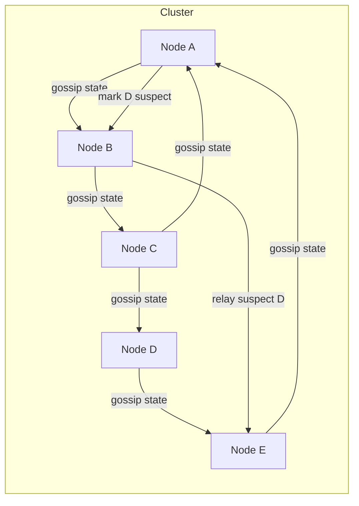

# Gossip Protocol

## 1. One-Line Definition
A gossip protocol spreads information through a cluster the way a rumor spreads through a crowd — each node randomly tells a few neighbors, which repeat it — giving epidemic-style propagation, decentralized membership detection, and eventual convergence without a central coordinator.

## 2. Why Do We Need It?
In a decentralized cluster, how does every node learn who is alive, who has failed, and what state changed? A central registry is a single point of failure and a network hotspot. Gossip turns that problem into information propagation: each node periodically exchanges state with random peers, and within O(log N) rounds of exchange everyone that can be reached learns it. It is how Cassandra, Riak, Consul, and HashiCorp's Serf keep membership lists consistent and how super-peers push configuration — all with no master.

## 3. Simple Intuition
News spreads fastest by everyone telling two friends instead of everyone calling headquarters. The rumor tolerates people moving away: even if several listeners are unreachable, the rest still carry it, and within a few "rounds" everyone who is connected has heard it. If someone stops telling their friends, the listeners eventually notice the silence and mark them gone. No central person needs to know everyone — each node only talks to a few.

## 4. What Happens Without It?
One coordinator holds the membership list; it melds under a surge, partitions the cluster, or becomes the target of every "is my peer up?" query. Nodes never learn about a dead peer until clients hit it — timeouts everywhere, failed requests on a dead-but-registered node, and split-brain with no shared view. Configuration changes and metadata blobs must be pulled from a single point, so the "no central service" design silently reintroduces a central dependency.

## 5. Core Idea
- **Peer sampling:** every node selects a random subset of peers each round (or a small fixed set from a random view) and exchanges membership/state summaries.
- **Push, pull, or both:** push sends your state to peers; pull asks peers for theirs; push-pull (send yours, receive theirs) converges fastest — about as many rounds as there are nodes, and half as many with pull.
- **Anti-entropy, not ordering:** gossip eventually delivers all messages but does *not* guarantee a total order — each node applies updates as they arrive, converging if updates are idempotent or mergeable (see [[crdt|CRDTs]]).
- **Failure detection via indirection:** a node is suspected when enough others observed silence; suspicion flows with the gossip, so even nodes that never met the failed one learn it. SWIM protocol formalizes this: direct heartbeats + random probes + an incident report relayed cluster-wide.
- **Convergence vs guarantees:** O(log N) rounds of messaging with high probability reaches everyone; there is a small probability some node stays uninformed — gossip is probabilistic, cheap, and eventually consistent.

## 6. Important Terminology

| Term | Simple Meaning |
|------|----------------|
| Epidemic / Rumormongering | Rumor-style propagation to random peers |
| Push / Pull / Push-pull | Send-only / receive-only / both exchange |
| Round | One exchange per node (a "tick") |
| Membership | The set of live nodes in the cluster |
| Failure suspect | Node marked likely dead after reported silence |
| SWIM | Formal scalable detection: probe + reverse ping + relay |
| View | The bounded random subset a node tracks |
| Anti-entropy | Continuous reconciliation toward agreement |
| Hash ring / seat count | Ring of node ids for placement (Cassandra) |

## 7. Basic Architecture



## 8. Request or Data Flow
1. Node A ticks each round: it picks 1-3 random peers (B here) and sends a compact digest of its state (membership + versions).
2. Node B replies with a digest the keyed differences ("I am missing entries 10-12").
3. A sends exactly the missing entries; both converge.
4. Separately, A probes C for liveness; C does not answer its reverse ping, so A marks C suspect and includes that in the next gossip.
5. The suspicion spreads: within a few rounds every reachable node has "C suspect", and consistent suspicion thresholds move it to failed.

## 9. Practical Example
**Cassandra cluster of 30 nodes:**
- Each node gossips its own view (status version counters) with random peers every second; state columns like "alive/suspect" propagate.
- A seed list boots new nodes, then membership detaches from seeds once the ring is formed.
- When one rack loses power, neighbors mark its nodes suspect; the failure detector's suspicion is relayed, the coordinator routes around it, and `UNREACHABLE` nodes stop receiving token-owner reads.
- The protocol needs no leader: with 30 nodes, a page of gossip per second per node keeps a shared membership view with eventual convergence, costing far less than a central heartbeat registry.

## 10. Scaling
- **Bandwidth is O(N) per round** if every node talks to every peer; random peer sampling keeps it flat — a constant out-degree, so a 1000-node cluster gossips like a 10-node one.
- **Convergence is O(log N) rounds:** the rumor reaches everyone within a handful of rounds with high probability; the constant scales with network speed, not cluster size.
- **Move to ring-optimized membership:** hash of node identities (Cassandra-style) makes each gossip more informative — see [[consistent-hashing|Consistent Hashing]] for the ring that placement builds on.
- **Compress digests:** version vectors or bloom summaries of "what I have" shrink the per-peer payload; send diffs, not whole state.
- **Suspect quarantine:** do not split the network in two; nodes partition into disjoint clusters only if friends-of-friends disconnection persists — gossip must carry suspicion across the whole graph.

## 11. Reliability and Failure Scenarios

| Failure | What Happens | Detection | Recovery | Trade-off |
|---------|--------------|-----------|----------|-----------|
| Node dies | Peers fail probes/trust silence | Suspicion relayed | Suspect → failed; rejoin updates ring | false positives on partition |
| Network partition | Two disconnected groups | Loss of probes across the cut | Split membership; both halves suspect each other | split-brain risk without fencing |
| Slow node | Probes time out → suspicion | Suspect + wrong removal risk | Re-judge on later answers | temporary exclusion |
| Message loss | Some peers miss state | Convergence slows | Retry next rounds | eventual, not immediate |
| Clock skew | Timeouts misaligned | Detect via probe timestamps | Tolerate skew, larger timeouts | detection latency up |

## 12. Consistency and Correctness
- **Eventual, not immediate:** updates converge eventually; reads may transiently see older views — pair with [[strong-vs-eventual-consistency|Strong vs Eventual Consistency]] to decide the acceptable window.
- **No total order:** gossip delivers out of order and duplicate; operations must be idempotent (version numbers) or mergeable — CRDT-style state is the natural companion.
- **Version vectors / generation counters** let receivers reconcile "your v5 or my v6" deterministically.
- **Suspect vs dead is a decision, not a fact:** consensus not needed, but two partitions that both think they own a range can cause double-writer incidents — gossip alone needs fencing support when it decides ownership.

## 13. Performance
- Per-node bandwidth: a constant amount per round (say a few KB of digest) regardless of cluster size — the property that makes gossip scale to thousands of nodes.
- Converges in ~O(log 5N) rounds; failure detection within a few seconds (SWIM with 1s probes + suspicion relay).
- Cost of correctness: eventual consistency means stale views; low-latency reads on a moving membership need buzzsaw (a local fence) rather than gossip accuracy.

## 14. Security
Gossip channels must be authenticated — otherwise anyone who can impersonate a peer can inject fake membership/suspicion ("poisoning") or drive a node out of the cluster. Use signed messages and mutual TLS between members; rate-limit peer sampling; and never send secret metadata through gossip summaries (they get broadcast verbatim to random nodes).

## 15. Trade-Offs

| Choice | Advantages | Disadvantages | When to Use |
|--------|------------|---------------|-------------|
| Gossip (push-pull) | Decentralized, failure-tolerant, scalable | Eventually consistent, no order | Membership, failure detection, state reconciliation |
| Central registry (etcd/ZK) | Linearizable, copy-accurate | Hot point, SPOF risk | Small control-plane metadata |
| Leader + heartbeat | Ordered view, quick | Leader is the single point | Clusters with a natural single authority |
| SWIM + gossip | Fast detection, bounded bandwidth | More moving parts | Cassandra, Consul-style systems |

## 16. Common Mistakes
- Using gossip for ordering-sensitive data — it has no total order and no "first wins" without versioning.
- Gossiping the entire state every round instead of diffs/version vectors — bandwidth explodes.
- Marking a node dead too eagerly (single failed probe) — that is a false-positive exile; SWIM needs indirect probing.
- Ignoring the split-brain case: two partitions both suspect each other and both act on ownership without fencing.
- Writing gossip code yourself instead of using a battle-tested library for all but the simplest needs.

## 17. HLD vs LLD Boundary
HLD: choose gossip vs central membership, decide rounds/peer count, timeout thresholds, and the interplay with ownership/fencing. LLD: the digest format, version-vector encoding, probe/indirect-probe logic, the suspicion state machine, and the ring-hash of node ids.

## 18. Interview Questions

### Beginner
- Why would you choose gossip over a central registry for membership?
- What do push, pull, and push-pull mean, and which converges fastest?
- What does "eventually consistent" mean in gossip terms?

### Intermediate
- Explain how failure detection works in the SWIM-style model, with the reverse ping.
- How does gossip stay bandwidth-constant as a cluster grows from 10 to 1000 nodes?
- Why is gossip unsuitable for ordering-sensitive data without extra machinery?

### Advanced
- Design membership and failure detection for a 1000-node Cassandra-style cluster using gossip plus SWIM.
- What happens to gossip correctness when two partitions split a cluster? How do you protect ownership?
- Combine gossip with CRDTs to replicate a config map with no leader — walk the merge semantics.

## 19. Interview Memory Summary

> [!abstract]- Interview Memory Summary
> ### Remember
> - Gossip = random peer exchange each round; rumor spreads in O(log N) rounds.
> - Push-pull converges fastest; diffs + version vectors keep bandwidth constant.
> - No total order, duplicates, no strong consistency — eventual, idempotent-merging updates.
> - SWIM = probe + indirect probe + relay: failure detection at scale, seconds not minutes.
> - Suspicion (not death) is the relayed unit.
> - Bandwidth is constant per node regardless of cluster size — the scaling superpower.
> - Two partitioned halves both suspect each other: fencing needed for ownership.
> - Auth + signed messages, or gossip is a spoofing backdoor.
>
> ### 30-Second Explanation
>
> Gossip makes each node regularly trade compact state with random peers, so membership, suspicion, and configuration spread like a rumor — reachable within O(log N) rounds and constant bandwidth per node, with no central coordinator. SWIM-style probing detects failures quickly, and suspicion is relayed cluster-wide. The price is eventual, unordered, duplicate-prone delivery, so updates must be idempotent/mergeable and ownership decisions still need fencing support.
>
> ### Interview Traps
>
> - Claiming gossip gives any ordering or strong-consistency guarantee.
> - Designing membership gossip that sends full state every round (bandwidth death).
> - Marking a node dead from one missed probe.
> - Expecting gossip to protect you from a split brain — it detects divergence, it does not prevent it.
> - Rolling your own when Cassandra/Consul/Serf implement it well.
>
> ### Key Trade-Off
>
> You trade strong, centralized truth for a decentralized protocol that is scalable, failure-tolerant, and eventual — gaining constant-bandwidth membership at the cost of ordering, exactness, and a safe-by-default split-brain story.

## 20. Related Concepts

### Prerequisites

- [[strong-vs-eventual-consistency|Strong vs Eventual Consistency]] — the consistency contract gossip actually meets.
- [[cap-theorem|CAP Theorem]] — the availability-first stance gossip embodies.
- [[consistent-hashing|Consistent Hashing]] — ring placement that membership gossip maintains.

### Commonly Used Together

- [[crdt|CRDTs]] — mergeable state so gossip converges without conflict.
- [[raft-and-paxos|Raft and Paxos]] — the opposite end: centralized, linearizable agreement.
- [[kafka-cluster|Kafka Cluster]] — broker metadata historically central, KRaft ring-lite later.
- [[load-balancing|Load Balancing]] — health state that gossip feeds instead of central LB probes.

### Alternatives

- [[raft-and-paxos|Raft and Paxos]] for membership that must be linearizable.
- [[database-replication|Database Replication]] — leader/leaderless replication shares gossip DNA.

### Advanced Concepts

- [[bft|Byzantine Fault Tolerance]] — gossip among malicious nodes is BFT gossip.
- [[distributed-locks|Distributed Locks]] — fencing is what makes gossip-based ownership safe.

Related planned topics (not authored yet): SWIM protocol internals, plumtree/routing gossip, scuttlebutt reconciliation.

## 21. References
Demers et al., "Epidemic Algorithms for Replicated Database Maintenance" (1987) — lay origin. van Renesse et al., "SWIM: Scalable Weakly-consistent Infection-style Process Group Membership Protocol" (2002). Birch, Mann, et al. on scuttlebutt anti-entropy. Cassandra documentation on gossip and failure detection. Serf/Consul documentation on gossip-based membership. Verify timeout and round defaults against current versions of those docs.

## 22. Active Recall

Test yourself before revealing each answer.

> [!question]- Why is per-node bandwidth constant as a gossip cluster grows?
> Each node talks to a small random subset (constant out-degree), not to everyone. A 1000-node cluster still sends one digest to a handful of peers per round, so traffic per node does not scale with N — it only trades convergence rounds (O(log N)) for total reachability.

> [!question]- Why does push-pull converge in about half the rounds of push alone?
> Push only sends; it depends on the receiver forwarding. Push-pull (send yours, receive someone else's) lets a node absorb remote state directly, so information travels in both directions each round — the rumor front is larger. Half the rounds for the same reachability is the classic result.

> [!question]- A node is slow, not dead. What does a SWIM-style detector do before marking it failed?
> It does not kill it on one miss. The prober sends a direct probe; on no answer it asks random peers to indirectly probe the target (reverse ping). Only if the indirect probes also fail does the suspicion spread, and only after suspicion thresholds (multiple independent observers over time) does the node become failed.

> [!question]- Design decision: gossip or etcd for a 900-member cluster's membership?
> Gossip: the registry would become a hot point at 900 members with every heartbeat round-tripping through it; SWIM-style gossip detects failures in seconds with constant bandwidth. Use etcd for the small control-plane truths (who the current leader is, config that must be linearizable), not for per-node health.

> [!question]- What is the split-brain failure mode of gossip when a cluster partitions?
> Each half stops hearing the other's probes and marks the far side missing. If both halves act on ownership (e.g., both serve the same range), writes diverge. Gossip only detects and reports; you need fencing or majority-ownership arbitration on top to prevent two writers — gossip is the thermometer, not the treatment.

> [!question]- How do version vectors make gossip convergence deterministic?
> Each node stores, per-node, the highest version it has seen. When exchanging, a node knows exactly which entries are missing (lower version numbers) and can fetch precise diffs. Reconciliation descends from "mine is v5" to "yours is v8" deterministically — no ambiguous merges, provided updates are monotonic versions, not overwrites.

> [!question]- Interview scenario: gossip cluster shows persistent membership flapping. Diagnose.
> 1. Probe timeouts too tight for the network RTT. 2. False suspicion from a slow GC node. 3. No quarantine — historically dead nodes rejoin and flap. 4. Clock skew distorting timeouts. Fix: tune probe/indirect-probe timing, add suspicion thresholds, quarantine removed nodes, and monitor for flapping as a first-class metric.

> [!question]- Why does gossip need idempotent or mergeable updates?
> Gossip has no order and duplicates messages: a node may receive the same update twice and different updates in any sequence. If "apply" means assignment, last-write-wins is arbitrary; if it means increment or set-union, order does not matter. That is why CRDT-style data and version-vector closures ride on top of gossip rather than raw state.

> [!question]- How does one node learning about a dead node B hand that knowledge to every other node?
> It does not tell everyone — it relays "B suspect" as part of its normal digest to its few random peers; they attach it to their digests; and the suspicion travels across the gossip graph like a rumor. Reachability for the fact is O(log N) rounds with high probability, which is exactly how membership converges without a registry.

## 23. When Should I Use This?

### Use it when

- Membership and failure detection must be decentralized and failure-tolerant in a many-node cluster.
- Configuration/state updates are idempotent or mergeable and eventual consistency is acceptable.
- Unbounded peer-count growth would melt a central registry or load balancer.
- You use a system that already embeds it (Cassandra, Consul, Serf) and must reason about its guarantees.

### Avoid it when

- You need linearizable membership or exact ordering of updates.
- A single leader/heartbeat model already gives better detection latency than you need.
- The state you replicate cannot tolerate both eventual consistency and duplicates.
- You must not be able to re-add a dead node after a quiet period without a strict fence.

### What problem does it solve?

Distributed, scalable membership and state propagation with no single point of failure: who is alive, who failed, and what changed — reaching everyone in O(log N) rounds at constant per-node bandwidth.

### What problem does it NOT solve?

Total ordering, strong consistency, quick-enough convergence for every data type, exact detection (it guesses via suspicion), split-brain prevention, or security against spoofed peers without signed channels.

## 24. Decision Connections

Decisions that go together with gossip protocol:

- [[consistent-hashing|Consistent Hashing]] — the ring that gossip membership maintains and repairs.
- [[crdt|CRDTs]] — mergeable update payloads that make gossip's eventual/duplicate behavior harmless.
- [[strong-vs-eventual-consistency|Strong vs Eventual Consistency]] — stating the window between gossip arrival and convergence.
- [[raft-and-paxos|Raft and Paxos]] — the centralized, ordered alternative when gossip's eventuality is not acceptable.
- [[distributed-locks|Distributed Locks]] — fencing that keeps gossip-based ownership from becoming split-brain writes.
- [[load-balancing|Load Balancing]] — health state gossip feeds instead of central probes.
- [[distributed-scheduling|Distributed Scheduling]] — which nodes own schedule slots is gossip-detectable.
- [[cap-theorem|CAP Theorem]] — gossip is the availability-first choice; partitions degrade freshness, not availability.

Decision tree:

```
Do many nodes need shared membership/failure state, decentralizable?
    |
    +-- Strong linearizable truth required? → [[raft-and-paxos|Raft and Paxos]] / etcd
    |
    +-- Eventual views are acceptable
    |      |
    |      +-- Updates idempotent/mergeable?  → gossip + [[crdt|CRDTs]]
    |      +-- Updates are overwrites?        → version vectors, last-write-wins carefully
    |
    +-- Updates must reach everyone, no coordinator
    |      → gossip: random peers, push-pull, SWIM detection
    |
    +-- Ownership decisions must not double-write
           → add fencing / majority check on top of gossip
```