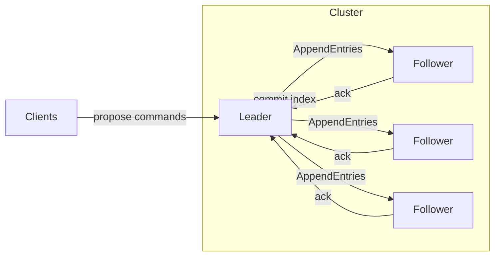

# Raft and Paxos

## 1. One-Line Definition
Raft and Paxos are the two practical consensus algorithms that implement the [[consensus|Consensus]] problem — Paxos is the mathematically clean classic, Raft is its teachable, leader-centric cousin — and both make a set of machines agree on one ordered value even as nodes fail and networks partition.

## 2. Why Do We Need It?
Consensus says nodes must agree on a single value; the question is *how*. Naive majority voting has holes — two majorities can disagree if votes race, leaders can be overthrown and keep writing, and replicas can have divergent logs. Algorithms fill those holes with a deterministic protocol. Paxos proved the minimal rules; Raft packaged them so an engineer can implement and reason about them. Pick one because this is the deepest correctness-sensitive component you will ever buy or build, and a hand-rolled version is almost always subtly wrong.

## 3. Simple Intuition
Paxos is a parliamentary vote: even if members argue in the lobby first (prepare), the final floor vote (accept) is the only one that counts, and old members cannot reopen a decided issue. Raft is a dictatorship with term limits and one rule book: one boss at a time, the boss sends numbered orders, a majority must confirm each order in writing, and when the boss disappears everyone times out and votes for a new one; losers of the last election keep quiet.

## 4. What Happens Without It?
Two proposers race and each gets its own majority at different times → the cluster commits conflicting values. A partitioned leader reconnects and still writes, overwriting decisions made in its absence. Replicas disagree on log order, so their databases drift forever. You end up with the classic failure: acknowledged writes disappear, clients time out and retry into a different truth, and nobody can prove the cluster did anything wrong — because it is genuinely ambiguous.

## 5. Core Idea
- **Paxos's core trick (prepare/accept):** a proposer first asks all acceptors for their promise not to accept anything with a lower round number (`prepare`, round n); if a majority promises, it proposes value `n`; acceptors accept only the highest round they have seen. Because any two majorities intersect, the value a majority locked in `n` is the only value any later round can choose.
- **Raft's simplification (leader + terms):** one leader per term drives everything; followers vote in elections; an entry is committed when the leader learns a majority durably appended it. Raft adds structure Paxos omits — well-defined leader election, log matching, tombstones for configuration — which makes it implementable.
- **Raft's three subsystems:** leader election (terms + randomized timeouts), log replication (append entries, majority commit), safety (election restriction: only a candidate with all committed entries can win).
- **Log matching:** a replica's log is a prefix of the leader's history; disagreement is repaired by truncation to the last common entry and re-copy.
- **Both are single-decree or multi-decree:** Paxos runs one instance per log entry; Raft naturally replicates a stream. Spanner uses Paxos *groups*; etcd, Kafka metadata, and MongoDB use Raft.

## 6. Important Terminology

| Term | Simple Meaning |
|------|----------------|
| Acceptor/Proposer (Paxos) | Voter / value-advocate roles |
| Prepare / Accept | Round 1 tie-breaker / round 2 decision |
| Leader / Follower / Candidate (Raft) | Proposer / voter / election entrant |
| Term | Numbered leadership epoch; only higher terms act |
| Majority | floor(N/2)+1 required to commit |
| Committed entry | Durable on a majority, final |
| Log index | Position of one entry in the replicated log |
| Election timeout | Random backoff that triggers candidacy |
| Prevote / Pre-vote | Check for majority before starting real term |
| Lease | Time-bounded leadership for reads |

## 7. Basic Architecture



## 8. Request or Data Flow
1. A client sends a command to the leader.
2. Leader appends it as a new log entry and sends AppendEntries to every follower.
3. Followers durably write the entry and reply.
4. Leader counts acks; on majority it advances the commit index and applies the command to its state machine, then replies to the client.
5. Followers learn the new commit index on the next AppendEntries heartbeat and apply the same command, keeping deterministic state machines identical.

## 9. Practical Example
**etcd serving a Kubernetes control plane:**
- 3 or 5 etcd members run Raft; the people who "apply to become leader of the apiserver authority" are log entries.
- A config key `current-master=victor` is committed only after 2 of 3 members fsync it; Kubernetes then trusts etcd's read of that key.
- Victor's etcd lease expires in ~8s if it dies; the majority (with a higher term) elects a new leader and writes the new master key — every service with the watch triggers failover consistently.
- A partitioned member that missed two entries rejoins through log catch-up, never by guessing.

## 10. Scaling
- **Leaders bottleneck the log:** all writes serialize through one node; scale reads with per-node snapshots + read leases, scale writes by batching and pipelining.
- **More replicas do not speed it up:** 5 members wait on 3 durable acks. Grow nodes only for fault tolerance; split the keyspace into separate Raft/Paxos *groups* for more write capacity (the Spanner model).
- **Snapshots bound log growth:** install snapshot when the log becomes huge; leaders prune entries older than the snapshot.
- **Read scalability:** leader lease reads (no round trip within lease window) plus local reads that tolerate staleness — see [[strong-vs-eventual-consistency|Strong vs Eventual Consistency]].

## 11. Reliability and Failure Scenarios

| Failure | What Happens | Detection | Recovery | Trade-off |
|---------|--------------|-----------|----------|-----------|
| Leader dies | No commits until election | Election timeout | Followers elect new leader, higher term | seconds of stall, randomized timeouts |
| Candidate denies majority | Election loops, no progress | Repeated term bumps | Prevote + randomized timeouts break ties | slower convergence |
| Network hiccup drops acks | Entry lags, not yet committed | Missed AppendEntries | Re-send on heartbeat; later commit | extra bandwidth |
| Follower disk full | Cannot append or ack | Local error | Replace member, catch up via snapshot | node out of quorum until replaced |
| Slow disk on leader | fsync stalls all commits | Commit latency SLO | Demote leader, newer-disk leader wins | availability depends on worst member |

## 12. Consistency and Correctness
- **Linearizable writes:** a committed entry is total-ordered; once a client sees it, all later reads see it.
- **Commit is durable:** an entry reported committed is stored on a majority and cannot be lost to later node failures.
- **Log matching prevents divergence:** if two logs share an entry at index i, every earlier entry matches — the prefix property is what makes truncation and catch-up safe.
- **Election restriction (Raft):** a candidate needing quorum cannot win if it is missing a committed entry, so a new leader can never invent different history for committed terms.
- **Term > rejection:** any message from an old term is rejected, which is what makes stale leaders harmless.

## 13. Performance
- Latency: one majority round trip + durable writes; ~1-5ms on a fast rack, more across regions. Never the hot database path.
- Throughput scales with leader batching/pipelining; snapshot + compact entries extend the log's life.
- Read paths: lease reads and snapshot reads cheaply; consistent reads pay one round trip.
- Tuning knobs: election timeout (100-800ms in Raft defaults), batch size, fsync policy (the durability-vs-latency knob).

## 14. Security
Same stance as consensus: crash-fault model — Raft and Paxos assume honest but failing nodes. Add mutual TLS between members, restrict who may call vote/append, and authenticate client write access. Disk tampering and lying nodes are out of scope (see [[bft|Byzantine Fault Tolerance]]). Watch untrusted client data: the state machine (e.g., etcd storage) is the actual attack surface.

## 15. Trade-Offs

| Choice | Advantages | Disadvantages | When to Use |
|--------|------------|---------------|-------------|
| Paxos | Minimal, proven, flexible quorums (Fast Paxos) | Notoriously hard to understand/implement | Research, Google Spanner-style systems |
| Raft | Understandable, implementable, complete (election+membership) | Leader bottleneck, term complexity | Everything else: etcd, MongoDB, Kafka KRaft |
| Multi-Raft groups | Scales write capacity | Cross-group ops, more state | Large-scale metadata (Spanner, CockroachDB) |
| ZK's ZAB | Similar guarantees, battle-tested in ZK | ZK API is legacy-ish ergonomics | Legacy ZK deployments |

## 16. Common Mistakes
- Reusing the same term counter across restarts, letting an old leader resurrect with equal authority.
- Fsync policy too lax — "we ack after acking" loses committed writes on power loss.
- Forgetting the election restriction; then a new leader can overwrite committed entries.
- Election loops without prevote in a flaky partition — endless term inflation with no progress.
- Running even node counts or a "tie-breaker" third VM on the same physical host (defeats the whole fault model).

## 17. HLD vs LLD Boundary
HLD: choose consensus engine (etcd vs ZooKeeper vs embedded Raft), decide group size, lease duration, election timeout budget, and what gets committed vs cached. LLD: AppendEntries format, term bookkeeping, ballot counters, snapshot encoding, and the fsync flag on each DB write inside the member.

## 18. Interview Questions

### Beginner
- What three subsystems does Raft decompose consensus into?
- Why does Raft have only one leader per term?
- What does "committed" mean in Raft?

### Intermediate
- Explain how the election timeout prevents simultaneous candidacy storms.
- Why must a new leader hold all committed entries (the election restriction)?
- Paxos prepare/accept: why must the proposer collect a majority promise before proposing?

### Advanced
- Walk through Raft log repair: leader and follower disagree past index k. What exactly happens?
- Compare Paxos single-decree vs Raft: what does Raft add on top and why?
- Design metadata service sharded across several Raft groups: how do you keep cross-group operations safe?

## 19. Interview Memory Summary

> [!abstract]- Interview Memory Summary
> ### Remember
> - Paxos = prepare (round n promise) then accept (value locked); intersecting majorities make it safe.
> - Raft = one leader per term, replicated log, majority commit, randomized timeouts.
> - Three subsystems: leader election, log replication, safety (election restriction + term rule).
> - Log matching: equal index + equal term → identical prefix; repair by truncate + re-copy.
> - Commit = durable on a majority; committed entries are never rewritten.
> - Term > everything: stale leaders and old ballots are rejected.
> - Leader bottleneck: batch, pipeline, snapshot, split into Raft groups to scale.
> - Modeling is honest-crash; not BFT.
>
> ### 30-Second Explanation
>
> Consensus is the problem; Raft and Paxos are the solutions. Paxos runs two rounds — prepare locks a round and possible values, accept finalizes one — and intersecting majorities guarantee two rounds cannot finalize different values. Raft makes this practical: a leader per term proposes log entries, a majority fsync wall is the commit wall, and a higher term outvotes everything else. Implement or buy it, keep it on the control plane, and treat it as the highest-correctness-standards component in the system.
>
> ### Interview Traps
>
> - Claiming "leader commits alone" — a majority must durably ack first.
> - Thinking more replicas speed it up — they only add fault tolerance.
> - Forgetting a new leader must have all committed entries; otherwise it rewrites history.
> - Mixing crash-fault guarantees with security claims — that is BFT's job.
> - Treating prepend proximity (raft) and prepare (paxos) as free wins — fsync dominates.
>
> ### Key Trade-Off
>
> You gain unassailable agreement on one total order (perfect for the control plane); you pay a majority fsync round trip per decision, a leader bottleneck, and deep implementation complexity.

## 20. Related Concepts

### Prerequisites

- [[consensus|Consensus]]
- [[cap-theorem|CAP Theorem]]
- [[strong-vs-eventual-consistency|Strong vs Eventual Consistency]]

### Commonly Used Together

- [[database-replication|Database Replication]] — consensus replication under the hood of leader-based systems.
- [[distributed-locks|Distributed Locks]] — leases and locks stored in a Raft-backed store.
- [[kafka-replication|Kafka Replication]] — KRaft moves broker metadata onto Raft.
- [[failover|Failover]] — safe primary handover needs a Raft/Paxos decision.

### Alternatives

- [[consensus|Consensus]] theory without a concrete algorithm — same problem, no procedure.
- ZAB (ZooKeeper) — same family, different packaging.

### Advanced Concepts

- [[bft|Byzantine Fault Tolerance]]
- [[gossip-protocol|Gossip Protocol]] (unguaranteed convergence alternative for membership)

Related planned topics (not authored yet): three-phase commit vs consensus caveats, snapshot isolation in Raft groups, KRaft internals.

## 21. References
Ongaro & Ousterhout, "In Search of an Understandable Consensus Algorithm (Raft)" (2014) — the definitive paper and its extended site. Lamport, "Paxos Made Simple" (2001) and "The Part-Time Parliament" (1998). Kleppmann, *Designing Data-Intensive Applications*, ch. 9. van Renesse & Altinbuken, "Paxos Made Moderately Complex" (2015). Verify KRaft and etcd internals against current project documentation.

## 22. Active Recall

Test yourself before revealing each answer.

> [!question]- Why does Raft exist if Paxos was already proven correct?
> Paxos is minimal and correct but famously unforgiving to implement — it leaves leader election, membership changes, and log management as unmatched loose ends. Raft rearranged the same guarantees around a strong leader, a well-defined log, and randomized election timeouts so a normal engineering team can implement it safely. Both solve the same consensus problem.

> [!question]- What is the election restriction and why does it matter?
> A candidate can only win an election if its log contains every committed entry (checked by comparing last-log term and index). If a candidate missing committed entries could win, it would overwrite decisions a majority already made — a safety violation. The restriction is what makes "new leader cannot rewrite committed history" true.

> [!question]- Design decision: Raft or Paxos for a new internal metadata store?
> Prefer Raft unless you have a concrete reason to need Paxos' flexibility (non-majority quorums, cross-region latency research). Raft ships in production as etcd, has an approachable spec, and its documentation, test frameworks, and operational playbooks are far richer. Roll your own neither — embed a maintained implementation for anything customer-facing.

> [!question]- What happens if a partitioned follower rejoins with a shorter log than the leader's?
> The leader finds the first common index via AppendEntries (term+index comparison), truncates the follower's divergent tail, and re-sends entries from that point to the end. Because matching logs are always prefixes, truncation can never discard a committed entry — the follower just re-applies the prefix plus everything after.

> [!question]- How do randomized election timeouts keep the cluster progressing?
> Followers time out on a random backoff (typically 150-300ms in Raft). Rarely will two candidates expire and campaign in the same round, so one election usually picks a single winner instead of splitting votes forever. The randomness is a liveness mechanism, not a convenience.

> [!question]- A write is acknowledged but the leader crashes before followers catch up. Is the write committed?
> Not necessarily. "Acknowledged" means the leader replied; "committed" means a majority durably stored it. If the leader replied before the majority fsynced, the entry can be lost when a new leader takes over — this is exactly why clients must treat uncommitted acks as uncertain and why fsync policy is the durability knob you tune.

> [!question]- Interview scenario: your etcd cluster commits config writes slowly during a burst. Walk the diagnosis.
> Check three levers: leader batching/pipelining (are entries batched per round?), fsync policy (is a follower on slow disk outside the majority?), and node count (do you have 5 members with a 500ms commit target that only a 3-node group would hit?). The fix is usually batching plus snapshot frequency, not adding members.

> [!question]- How does Raft handle member changes without risking double quorums?
> With joint consensus or a two-phase change: old config and new config overlap in a transition period, and commands require a quorum in *both* configs until the switch completes. This prevents a window where two disjoint majorities (one per config) could live simultaneously. Non-transactional "just change membership" is a classic bug.

> [!question]- Why do Raft reads need a lease or a round trip if writes are linearizable?
> Without a lease, a leader who has been partitioned away but not yet replaced could serve reads as if it were current, violating read linearizability. Reads need either a leader lease (local, safe until it expires) or a majority round trip (ReadIndex/commit-index check) to prove authority.

> [!question]- What makes "single node decides, everyone else is a replica" different from Raft?
> Single-node decision has no consensus step at all — one node is the source of truth and a replica is a copy. Raft makes the *group* the source of truth: failure of any one member cannot change the group's decision. That is the entire point and the entire cost difference.

## 23. When Should I Use This?

### Use it when

- You need linearizable, durable agreement: coordination, leases, config, leader election.
- Failover must never produce two writers, and acknowledged state must survive partitions.
- The decision rate is control-plane scale (thousands of ops/s), not data-path scale.
- You will use a maintained implementation (etcd, Consul via Raft, built-in Raft in MongoDB/Kafka).

### Avoid it when

- Your workloads are high-throughput data writes — consensus is the wrong tool; use a partitioned DB with wet writes.
- You can tolerate losing the minority, manual failover, and eventual staleness — a normal primary-replica setup is cheaper.
- A wrong decision is cheap and idempotent — skip the ceremony entirely.
- The team cannot run a 3-5 node coordination cluster reliably; a flaky etcd is worse than none.

### What problem does it solve?

Durable, linearizable agreement on a single total order among honest but failure-prone machines — the backbone for coordination, locks, and safe failover.

### What problem does it NOT solve?

Throughput at data scale, Byzantine/malicious nodes, availability of the partitioned side, or application logic bugs on top of a correct consensus layer — a correct log is no shield for a broken state machine.

## 24. Decision Connections

Decisions that go together with Raft and Paxos:

- [[consensus|Consensus]] — Raft and Paxos are the concrete answer to that abstract problem.
- [[failover|Failover]] — the "who is primary now" decision you commit through the log.
- [[distributed-locks|Distributed Locks]] — Raft-backed stores give locks durable leases with fencing.
- [[cap-theorem|CAP Theorem]] — this is the CP machinery; availability gives way to safety.
- [[database-replication|Database Replication]] — leader-based systems increasingly embed Raft (MongoDB, CockroachDB, etcd) for safe failover.
- [[kafka-replication|Kafka Replication]] — KRaft administers broker metadata via Raft.
- [[bft|Byzantine Fault Tolerance]] — the same problem with a worse failure model; cost goes up steeply.
- [[distributed-transactions|Distributed Transactions (2PC / Saga)]] — consensus + total order often underlie transaction coordinators.

Decision tree:

```
Do you need durable, linearizable multi-node agreement?
    |
    +-- Yes — use a real algorithm, not a hand-rolled vote
    |      |
    |      +-- Need to understand/implement it yourself?   → [[raft-and-paxos|Raft and Paxos]] config
    |      +-- Just need a dependable store?               → etcd / Consul (Raft under the hood)
    |      +-- Cross-region, unusual quorums?              → Paxos-style (multi-Paxos groups)
    |                                                       |
    |                                                       +-- Control-plane decisions?  → group of 3-5
    |                                                       +-- High decision rate?      → shard the groups
    |
    +-- No — single leader with manual failover is enough
    |      → [[database-replication|Database Replication]]
    |
    +-- Nodes may be malicious
           → [[bft|Byzantine Fault Tolerance]]
```