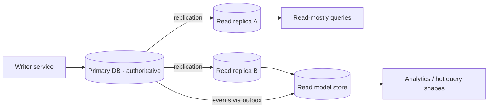

# Data Access Patterns

## 1. One-Line Definition
Data access patterns are the repeatable arrangements for *how* data is read and written across a system — one authoritative write path, read replicas, read models/CQRS-style query surfaces, database-per-service ownership, and caching/view layers — each deciding who may write what, and how readers get data without crossing architectural boundaries.

## 2. Why Do We Need It?
A system's bottleneck is usually data, and data's correctness depends on *who owns it*. Naive data access — everyone reads everyone's tables, every read hits the primary DB, every service writes shared schema — couples services, destroys scalability (reads and writes competing on one node), and makes splitting impossible later. Data access patterns formalize the answers to _who writes, who reads, how reads scale, and how data crosses service/ownership boundaries_ so that writes stay authoritative, reads stay cheap, and the schema stays decoupled.

## 3. Simple Intuition
A library: one registrars' desk (the authoritative write path) updates the catalog; the browse floor uses photocopied duplicates (read replicas) so browsers never fight the desk; each department keeps its own ledgers (database-per-module) instead of everyone writing into one shared notebook; and the "popular books" shelf (read model) is pre-built so hot queries don't scan the archive. Readers never grab the sole ledger.

## 4. What Happens Without It?
Every service and feature reads and writes one shared DB directly: schema changes collide, one hot query saturates the only node (read-write contention), caching is impossible (no defined invariant for what data can be stale), and a service "temporarily" reading another's table becomes a hard dependency — so the deployment, scaling, and split plans all collapse the moment traffic grows.

## 5. Core Idea
- **One authoritative write path (single writer per record):** every piece of data has exactly one owner that mutates it. Others may only read. This gives you a stable place for validation, events, and consistency (see [[outbox-pattern|Outbox Pattern]]).
- **Read replicas — reads scale without stealing single-node write authority:** the owner writes to primary; replicas serve [[database-replication|Database Replication]] copies; read-mostly queries move off the writer; the cost is [[replication-lag|Replication Lag]] (eventual consistency — see [[strong-vs-eventual-consistency|Strong vs Eventual Consistency]]).
- **Read models / CQRS-style query surfaces:** a *read model* is a pre-shaped, possibly denormalized structure built for one query shape (generated via events or the outbox). Queries hit the model, not the owner's tables — the read/write split without full event sourcing (see [[normalization-vs-denormalization|Normalization vs Denormalization]]).
- **Database-per-service (application):** a service "owns" tables/schema; other services get data through an API, an event/read model, or a replica — never direct writes. This is the [[microservices|Microservices]] data rule and the [[modular-monolith|Modular Monolith]] variant (module-owned data).
- **Caching and materialized views as read acceleration:** [[caching|Caching]] (cache-aside) for hot reads, indexes for scans ([[database-indexing|Database Indexing]]), materialized indexes for analytics. These are all "shaped reads" that assume a bounded staleness.
- **The scaling ladder (ordered):** index → cache → read replica → read model → shard. Each rung trades staleness/complexity for capacity; pick the minimum rung that meets the read's staleness budget (see [[partitioning-vs-sharding|Partitioning vs Sharding]]).

## 6. Important Terminology

| Term | Simple Meaning |
|------|----------------|
| Write path / single writer | The one owner allowed to mutate a record |
| Read replica | Replicated copy serving reads |
| Replication lag | How stale the copy is (see concept file) |
| Read model | Pre-shaped/denormalized data for one query shape |
| CQRS | Separating write (commands) from read (queries) surfaces |
| Database-per-service | Service owns its schema; API-only access |
| Materialized view / index | Precomputed read acceleration |
| Staleness budget | How old data may get before a query is "wrong" |
| Connection pool | Bounded set of live DB connections (see concept file) |

## 7. Basic Architecture



## 8. Request or Data Flow
**Write path:** the owning service validates the request, mutates the row in the primary inside a transaction, and emits an event through the outbox (its facts never bypass the owner).
**Read path:** a query hits a read replica or a read model — both derived, both tolerant of a taleness budget. If the query must be *fresh-by-the-millisecond*, it routes to the owner's API/primary. The split is decided per query shape, not per service.
**Cross-boundary reads:** a service that needs another's data queries its API/read model, never its tables.

## 9. Practical Example
**Social feed (assumptions):** 10M users, 100k posts/min, reads:writes ≈ 100:1.
- Posts: `PostService` sole writer; users read feeds through a **read model** built by an events pipeline (denormalized: `(user_id, friend_ids, post_id)` rows keyed for the feed query).
- Reads: feed reads never hit the primary — they hit read replicas + the read-model store; a brief [[replication-lag|Replication Lag]] is fine because "your post is visible everywhere in <1s" is a comfortable guarantee.
- Writes: one write path and one outbox → analytics, search, and feed all subscribe with their own read models.
- Result: primary handles 100k writes/min; the 10M reads/min scale on replicas/models/caches instead of the primary.

## 10. Scaling
- **The scaling ladder in practice:** index first (cheap), then [[caching|Caching]] (fast, bounded staleness), then **read replicas** (offload reads from the primary — see [[database-replication|Database Replication]]), then **read models** (precompute the hot query shape), and only then **sharding** (write/storage ceiling — see [[sharding|Sharding]]).
- **What breaks:** the write path is the hard ceiling — one primary's write QPS and one node's storage; replicas *cannot* scale writes. Read-model/build pipelines become second-order bottlenecks (keep them idempotent and lag-monitored via [[consumer-lag|Consumer Lag]]).
- **Multi-instance writers break single-writer:** a fleet of replicas needs each write routed to one owner (ownership by key/tenant — see [[shard-key|Shard Key]]), else see [[strong-vs-eventual-consistency|Strong vs Eventual Consistency]] for who wins conflicts.

## 11. Reliability and Failure Scenarios

| Failure | What Happens | Detection | Recovery | Trade-off |
|---------|--------------|-----------|----------|-----------|
| Primary down | Writes stall | Primary health | [[failover|Failover]] of replica to primary | windows during cutover |
| Replica lags badly | Stale reads | Lag metric | Accept staleness or route reads to primary | staleness vs load |
| Read model build fails | Queries go stale | Model lag | Rebuild from event log (outbox) | replay cost |
| Cache thrashes | Read stampede onto replica | Hit-ratio drop | Warm/prevent stampede | cache consistency |
| Writer + reader share a table | Ownership ambiguity | Schema coupling | Move to read model/replica | migration work |

## 12. Consistency and Correctness
- **Single-writer is the correctness anchor:** one owner per record means no conflicting concurrent writers; the owner's transaction + outbox gives atomic state-and-event (see [[transactions-and-acid|Transactions and ACID]], [[outbox-pattern|Outbox Pattern]]).
- **Every read path declares a staleness budget:** replica (seconds), cache (TTL), read model (event-lag), primary (fresh). Pick per query shape; document it next to the query.
- **Read models are derived data — rebuildable:** treat them as disposable projections of the event log; never as their own source of truth. Losing one means rebuilding, not data loss.
- **Cross-service facts must not be read-modelled from tables someone else owns:** the owner's events are the only legal derivation source (your events, not another service's internals).

## 13. Performance
- **The bulk of the win is read/write separation:** reads scale on cheap replicas/models/caches; writes stay coherent on one authority. For read-heavy systems this multiplies read throughput 10–100x before any sharding.
- **Costs:** replication lag machinery + extra storage for each copy/model; read-model pipelines consume event-stream processing capacity (see [[consumer-lag|Consumer Lag]]); cache/read-model staleness requires careful TTL/eviction (see [[caching|Caching]]).
- **The write path's latency is a hard floor** (fsync + replication ack, see [[latency-vs-throughput|Latency vs Throughput]]) — reduce write amplification via proper indexing and fewer indexes per write.

## 14. Security
- Single-writer ownership doubles as an authorization boundary: writes go through one owning service's authN/Z (see [[authentication-vs-authorization|Authentication vs Authorization]]), so a rogue feature can't write another service's data by backend access.
- Read replicas/models multiply data copies — access control must travel with each copy (schema/role restrictions, encryption at rest per [[encryption-and-keys|Encryption and Keys]]).
- Never expose read models with PII derivation to wider permissions than the owner would allow; a "cheap read" must not be a cheaper data leak.
- Audit reads/writes at the owner; replicate that trail rather than re-deriving it from copies.

## 15. Trade-Offs

| Choice | Advantages | Disadvantages | When to Use |
|--------|------------|---------------|-------------|
| Direct reads on owner DB | Fresh, simple | Write/read contention, no scale | Tiny writes, low read load |
| Read replicas | Cheap read scale | Lag, secondary data copies | Read-heavy, tolerable staleness |
| Read models (CQRS-style) | Hot queries never touch owner | Pipeline cost, eventual | High-frequency query shapes |
| Database-per-service | Clean ownership, decentralized | Cross-service queries hard | Any multi-deployable system |
| Shared DB (module-owned schemas) | Simple joins, ACID retained | Ownership boundaries can blur | Modular monolith era |

## 16. Common Mistakes
- **Everyone reads/writes one shared schema** — the "temporary" coupling that blocks every later split.
- **Reading replica-lag-sensitive data from replicas** (immediate post-write read returns stale) — route "read-after-write" reads to primary/owner (see [[replication-lag|Replication Lag]]).
- **Making the read model effectively a second source of truth** (writes to it directly) — it must be derived only.
- **Building a read model for every query** (over-engineering the pipeline) — index/cache/replica first for most.
- **Sizing the write path with no shard story** — when writes hit the ceiling, replicas/models/caches cannot help.

## 17. HLD vs LLD Boundary
HLD: who owns each record/table, what the legal read paths are per query shape (primary/replica/model/cache), staleness budgets, the read-model build pipeline, when to shard. LLD: the exact query surfaces, repository/cache/model-store code, event-derivation jobs, connection pool and TTL config.

## 18. Interview Questions

### Beginner
- Why must each record have exactly one writer?
- How do read replicas scale reads without scaling writes?

### Intermediate
- A read is stale after a user's own write. What's wrong and how do you fix it?
- When would you build a read model instead of adding more read replicas?

### Advanced
- Design the data access layer for a feed where reads are 100x writes and freshness matters "within a second."
- Two services both need the other's data. Design the legal read/write paths without shared tables.

## 19. Interview Memory Summary

> [!abstract]- Interview Memory Summary

### Remember

- Single writer per record; everyone else reads.
- Reads scale on a ladder: index → cache → replica → read model → shard.
- Replicas and models are derived, lag-tolerant copies; only the owner's write is authoritative.
- Database-per-service/module: own your tables, share through API or events.
- Every read path declares a staleness budget.
- Read-after-write needs the owner (or read-your-writes routing).
- Read models are projections of the event stream — rebuildable, never sources.

### 30-Second Explanation

Data access patterns fix who writes and how reads scale: every record has a single owning writer, and reads climb a ladder — indexes, caching, read replicas, then CQRS-style read models, and only finally sharding for the write/storage ceiling. Replicas and models are derived, lag-tolerant copies (each with a declared staleness budget); services own their schema and share data only through APIs or events. Correctness anchors on the single-writer + outbox; scale lands on the read side.

### Interview Traps

- Letting readers touch the owner's primary for freshness — unless it's genuinely read-after-write-critical.
- Claiming replicas help writes — they help reads only.
- Treating a read model as source of truth (it's a projection).
- Sharing tables between services "for now."
- Ignoring replication lag in stale-read surprises.

### Key Trade-Off

You get scalable, decoupled, authoritative reads and writes — at the cost of staleness (replicas/models/caches lag), extra copies to store and secure, and a read-model build pipeline you must operate and monitor.

## 20. Related Concepts

### Prerequisites

- [[database-fundamentals|Database Fundamentals]]
- [[database-replication|Database Replication]] — the read-replica mechanism this depends on.
- [[transactions-and-acid|Transactions and ACID]] — the write authority this preserves.
- [[database-keys|Database Keys]] — keys/ownership boundaries.

### Commonly Used Together

- [[replication-lag|Replication Lag]] — the staleness contract of every replica read.
- [[strong-vs-eventual-consistency|Strong vs Eventual Consistency]] — what derived reads can promise.
- [[caching|Caching]] — the first rung of the read ladder.
- [[database-indexing|Database Indexing]] — the zero-staleness read rung.
- [[database-connection-pooling|Database Connection Pooling]] — bounding the read/write connections.
- [[sharding|Sharding]] — the write/storage-limit rung after reads are handled.
- [[normalization-vs-denormalization|Normalization vs Denormalization]] — the read-model trade encoded.

### Alternatives

- [[sql-vs-nosql|SQL vs NoSQL]] — choosing a store with different native read models.
- [[partitioning-vs-sharding|Partitioning vs Sharding]] — in-node vs across-node data placement.

### Advanced Concepts

- [[outbox-pattern|Outbox Pattern]] — the event source read models are built from.
- [[consumer-lag|Consumer Lag]] — the health metric of the read-model pipeline.
- [[event-driven-architecture|Event-Driven Architecture]] — the derivation backbone for read models.
- [[tenancy-and-cells|Multi-Tenancy and Cell-Based Architecture]] — data isolation doubles as ownership separation.
- [[saga-and-strangler|Saga and Strangler Fig]] — data migration with dual worlds during strangling.

Related planned topics (not authored yet): event sourcing and CQRS, data migration (dual reads/writes, CDC), materialized view deep-dive.

## 21. References
Kleppmann DDIA ch. 4–6 (encoding, replication, partitioning, derived data); Couchbase/Fowler CQRS write-ups; MS data-access patterns; AWS read-replica and DDB read-models docs. Verify current replication-lag numbers with your DB vendor.

## 22. Active Recall

Test yourself before revealing each answer.

> [!question]- Why must every record have exactly one writer, and who is it?
> One owner per record prevents conflicting concurrent writers and gives a single stable place for validation, transactions, events, and audit. The owner is the service/module that "owns" the record's domain (its tables); everyone else may only read (through API, replica, or read model). Multiple writers to one table is the definition of a data-ownership antipattern.

> [!question]- How do read replicas scale reads but not writes?
> Replication copies committed data from primary to replica nodes; readers hit replicas so N query streams leave the primary untouched. But replicas are copies of the same data — there is still exactly one primary accepting writes, so write QPS and total storage stay capped at the primary's node (that's what sharding solves).

> [!question]- A user updates their profile then immediately re-reads it and sees the old value. Diagnose.
> The read hit a replica while the write was still replicating — read-after-write staleness. Fix by routing a user's own writes (or recent-writes) to the primary/owner consistently, using read-your-writes or monotonic-read routing (see [[replication-lag|Replication Lag]]), and keep everyone else on lag-tolerant replicas.

> [!question]- When do you build a read model instead of just adding more replicas?
> When the *query shape* is the problem: replicas still serve the same tables, so a hot/fan-out/join-heavy query still scans or joins per request. A read model precomputes that shape (denormalized, keyed for the query) and serves it at O(1) lookups. Build one when a query's cost or frequency justifies precomputation — not for every read.

> [!question]- What is a read model's source of truth, and what happens if it dies?
> The authoritative write path (the owner's state, expressed as events — typically via the [[outbox-pattern|Outbox Pattern]]). A read model is a disposable projection: if it dies or corrupts, you rebuild it by replaying the event/state stream through the derivation pipeline, not by rescuing the model. It is never its own source of truth.

> [!question]- Two services each need the other's data constantly. Design the legal read/write paths.
> Each keeps ownership of its tables as single-writer. The consumer gets a projection: read models/replicas built from the owner's *events* (via outbox), or a read-only view the owner exposes through its API. Neither may write the other's tables, and neither should reach into the other's schema — the events are the legal derivation boundary (if that's impossible, it's a sign the capabilities should join one service).

> [!question]- Interview scenario: feed reads at 100x writes, freshness "within a second." Design the data access layer.
> Writes: single PostService writer, outbox emits events. Reads: feed read model built by the event pipeline, keyed by user id; replicas for cold queries; cache for the hottest feeds; a brief replication-lag budget is acceptable since "visible within a second" sets the staleness SLO. The primary sees only writes; the shard story is deferred because reads dominate and writes stay modest.

> [!question]- What checkpoints tell you it's time to move up the read-scaling ladder?
> Index gets you a bounded query cost first; then move to cache when the *owner/replica* DB is still saturated by hot reads; replicas when read QPS and diversity outgrow the cache; read models when the query *shape* (fan-out/join) is the cost; and sharding when *writes* or storage — the one thing no read rung cures — hit the ceiling.

## 23. When Should I Use This?

### Use it when

- Reads dominate writes (most read-heavy services) and single-node reads are the bottleneck.
- Any multi-deployable architecture needs to stop services touching each other's tables.
- A query shape is hot, fan-out, or join-heavy and precomputation pays.
- You need a clean scaling path from index → cache → replica → model → shard.

### Avoid it when

- Reads are tiny and the owner DB easily serves them (replicas/models = wasted copies).
- Freshness must be absolute for a query — keep it on the owner path (or accept the staleness it requires).
- The org can't operate a read-model build pipeline honestly (then keep reads simple on replicas/indexes).

### What problem does it solve?

Contention and coupling at the data layer: reads competing with writes on one node, services reading each other's tables, and no defined path to scale reads or split ownership. It establishes single-writer authority and a read-scaling ladder so writes stay correct and reads grow cheaply.

### What problem does it NOT solve?

It doesn't scale writes (that's sharding), doesn't provide freshness for staleness-intolerant reads, doesn't fix a bad shard key or missing indexes at the top of the ladder, and doesn't make derived data self-consistent (lag, rebuild, and pipeline monitoring are real ongoing costs).

## 24. Decision Connections

Decisions that go together with data access patterns:

- [[database-replication|Database Replication]] — the replica rung of the read ladder.
- [[replication-lag|Replication Lag]] — the staleness contract of every derived read.
- [[strong-vs-eventual-consistency|Strong vs Eventual Consistency]] — what read-your-writes and monotonic reads demand.
- [[caching|Caching]] — the fast/cheap rung before replicas/models.
- [[database-indexing|Database Indexing]] — the zero-staleness first rung.
- [[sharding|Sharding]] — the inevitable write/storage rung when reads are handled.
- [[outbox-pattern|Outbox Pattern]] — legal derivation source for read models.
- [[consumer-lag|Consumer Lag]] — the read-model pipeline's health signal.
- [[normalization-vs-denormalization|Normalization vs Denormalization]] — the read-model denormalization trade.
- [[saga-and-strangler|Saga and Strangler Fig]] — dual-write/backfill discipline during migrations.
- [[database-connection-pooling|Database Connection Pooling]] — bounding access to every data source.

Decision tree:

```
Reads on the primary DB are the bottleneck?
    |
    +-- Query too slow on its own?
    |      → [[database-indexing|Database Indexing]] first, then [[caching|Caching]]
    |
    +-- Read QPS still saturates the writer node?
    |      → read replicas ([[database-replication|Database Replication]])
    |         |
    |         +-- Staleness intolerable for a query? → owner path (read-after-write routing)
    |         +-- Hot query shape (fan-out/join)?    → read model built from [[outbox-pattern|Outbox Pattern]] events
    |
    +-- Reads now fine but WRITES/storage hit the ceiling?
    |      → [[sharding|Sharding]] (no read rung cures this)
    |
    +-- Services reading each other's tables?
           → ownership split: single-writer + API/event/read-model boundary
```