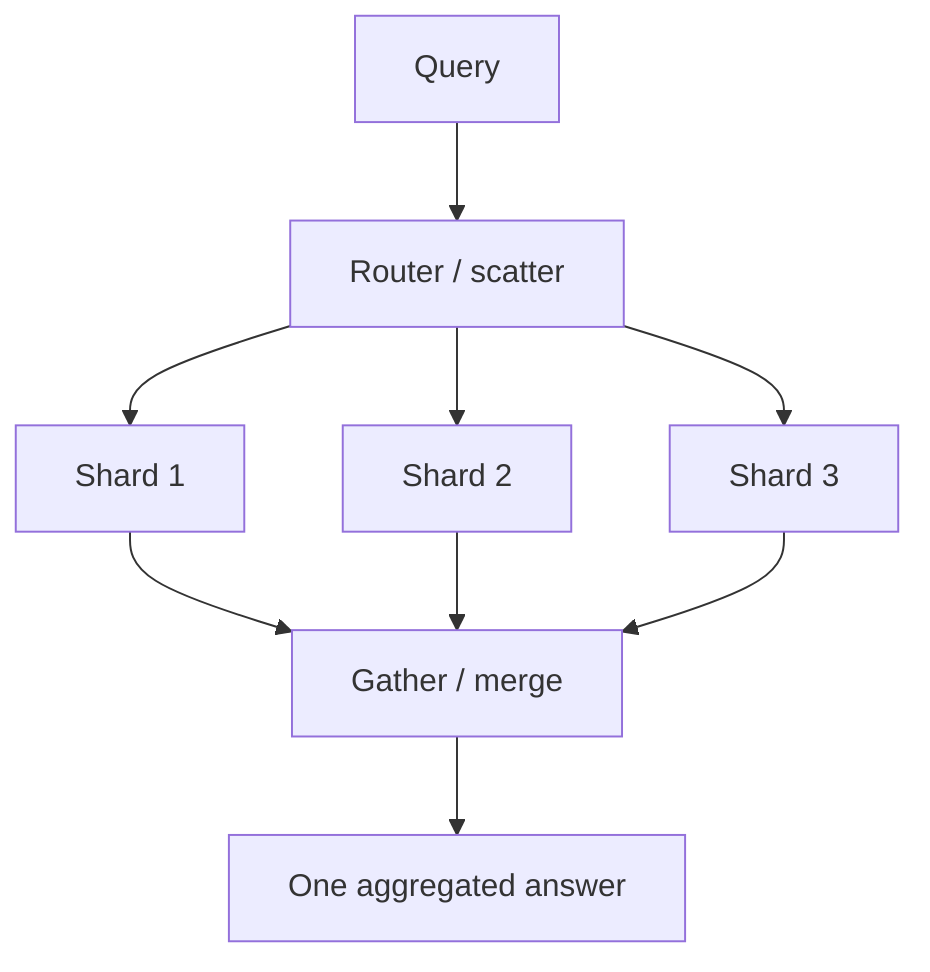
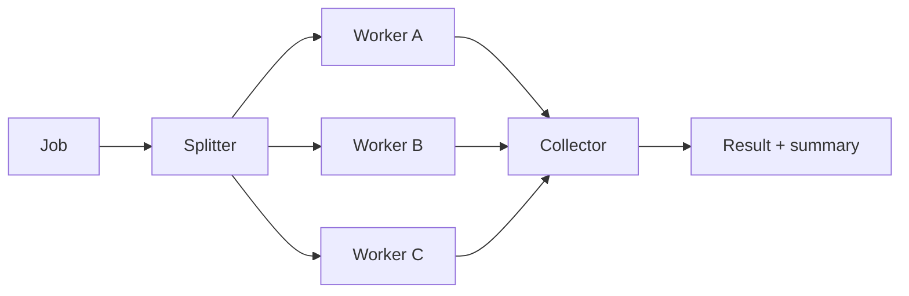

# Fan-Out / Fan-In / Scatter-Gather

## 1. One-Line Definition
Fan-out sends one unit of work or query to many workers/consumers in parallel, fan-in collects and aggregates the results at a single point, and scatter-gather is the request/response flavor of the two — split a request into sub-requests, parallelize them, then merge partial results into one answer.

## 2. Why Do We Need It?
Two workloads that are impossible to do efficiently serially: **parallel processing** — one big job (rendering a video, scanning a doc, rebuilding a search index) is slower than the sum of its parts done in parallel across many workers; and **parallel reading** — a query that spans many shards, data stores, or services must ask all of them and combine (you can't avoid touching every partition). Without fan-out/fan-in, both jobs stay serial (slow) or single-bottleneck (coupled to one node); with it, throughput scales with workers and latency drops to the *slowest parallel sub-task*.

## 3. Simple Intuition
A marching-band choreographer: she copies the sheet music (fan-out) and hands a page to each section; every section rehearses independently; at the dress rehearsal she waves them all together (the join/aggregation barrier), waits only for the slowest section, then blends the sound into one performance. If one trumpet section can't finish, she either waits (full result) or performs the show without it (partial result) — never letting one section stop the whole show.

## 4. What Happens Without It?
A big batch job runs on one worker: a 4-hour video transcode costs 4 hours wall-clock no matter how many cores sit idle elsewhere. A global query against 32 shards runs on one node that asks the others via a single synchronous chain, or — worse — the whole dataset gets loaded to one place and scanned per request. Latency is dominated by total work, not parallel span; throughput hits one worker's ceiling.

## 5. Core Idea
- **Scatter-gather (the request/response pattern):**
  1. *Scatter:* a query is decomposed into shard/service-local sub-queries and issued **in parallel** against all shards / replicas / services.
  2. *Gather:* a collector buffer waits for each sub-result, applies a merge function (union, join, min/max, top-k), and returns one aggregated response.
  3. The response latency = worst sub-task, not the sum (and usually some tail factor), at the cost of **query amplification**: QPS_out = QPS_in × fan-out count.
- **Fan-out / fan-in (the work-distribution pattern):** a producer splits a job into tasks (by key/range), distributes them to workers (queue/partitioned topic/workerpool), each worker processes independently, and results are collected (the "reduce" side) — think MapReduce, parallel transcoding, bulk enrichment. Often asynchronous (a job id + poll/callback), unlike scatter-gather which is a live request window.
- **The join barrier:** fan-in must wait for *all* (or a decided threshold) of parallel results — the classic partial-failure decision: wait for all, wait for a quorum/majority, or time-box and return partials with a "partial" marker.
- **Where the patterns live in a system:** over shards (see [[sharding|Sharding]] and [[shard-key|Shard Key]]), over nodes/replicas, over message partitions (see [[kafka-architecture|Kafka Architecture]]), or over a set of internal services in the gateway (see [[reverse-proxy|Reverse Proxy]], api-gateway planned).
- **The keys to doing it right:** parallelism ≠ concurrency (bounded in-flight sub-requests per caller — see load shedding), deterministic merge operators, per-sub-task timeouts, and idempotent collection (a retried sub-task must not double-merge).

## 6. Important Terminology

| Term | Simple Meaning |
|------|----------------|
| Fan-out | Splitting one unit across many workers/recipients |
| Fan-in | Collecting many partial results at one point |
| Scatter-gather | The sync request/response version of both |
| Query amplification | in-QPS × fan-out count = out-QPS |
| Gather/merge | Combining partial results into one answer |
| Join barrier | Waiting for all (or enough) parallel results |
| Partial result | Returning what arrived after a time-box |
| Super-step / state barrier | Sync point for a wave of parallel work |
| Worker pool | Bounded set of concurrent workers |
| Partition parallel | Splitting a job by key/range across partitions |

## 7. Basic Architecture





## 8. Request or Data Flow
**Scatter-gather (live query):**
1. A request arrives at the router, which has the shard/service map (see [[sharding|Sharding]]).
2. It issues one bounded sub-query per shard in parallel (with per-request timeout).
3. The gatherer stores partials; the merge combines them (union, top-k, aggregation).
4. If a shard times out, gatherer either waits the join barrier, returns a partial (flagged), or fails the query — a conscious policy.
**Fan-out/fan-in (async job):**
5. A job is keyed/ranged into tasks enqueued on partitions/queue.
6. Workers consume in parallel (at-most bounded by their concurrency); results write to a collector store with a job id.
7. The requester polls/callbacks once all task results are present.

## 9. Practical Example
**Global analytics dashboard over 32 shards (assumptions):** 5,000 dashboard queries/min across 32 shards.
- Scatter: each query fans out to 32 shard-local aggregations in parallel; each returns `count`/`sum`/`top-10` for its slice. Merge: totals sum across 32 partials. With per-shard P99 of 50ms (parallel), dashboard latency ≈ 60–70ms, not 32×50ms = 1.6s serial.
- Query amplification: 5,000 × 32 = 160k shard-queries/min — the dashboard must not be a hot path, or pre-aggregate (a read model, see [[data-patterns|Data Access Patterns]]).
- Same idea in batch: image thumbnailing fan-out 10k images over 40 workers on a queue → 3-minute job instead of 2 hours.

## 10. Scaling
- **Fan-out/fan-in scales near-linearly with workers** until the queue/splitter/collector becomes the bottleneck; partition parallelism (see [[kafka-architecture|Kafka Architecture]]) means worker throughput ≈ partition count.
- **Scatter-gather scales reads only up to the router's capacity:** the router is now a hot point (cache the shard map, see [[consistent-hashing|Consistent Hashing]]), and shard-local capacity is the floor; a hot shard still caps the gather (see hot-shard handling in [[sharding|Sharding]]).
- **Watch amplification × retries:** a mass failure makes every retry multiply by fan-out — bound in-flight with per-caller semaphores; prefer fail-fast over auto-retry at the gather (see [[resilience-patterns|Resilience Patterns (Catalog)]]).
- **Work imbalance:** skew on a key/range means a few workers do the bulk — split keys finely (see [[shard-key|Shard Key]]) or use work-stealing.

## 11. Reliability and Failure Scenarios

| Failure | What Happens | Detection | Recovery | Trade-off |
|---------|--------------|-----------|----------|-----------|
| A shard times out mid-gather | Missing partials | Per-shard timeout metric | Partial result (flagged) or retry the shard | completeness vs latency |
| Worker dies mid-task | Task lost | Job status scan | Re-enqueue (idempotent workers) | duplicate processing |
| Gather machine dies | Partial results lost | Collector health | Re-run job (checkpoint) | state in collector |
| Two workers take same task | Double count/merge | Dedup keys | Idempotent merge by task id | exactly-once cost |
| Hot shard lags | Gather waits on it | Shard latency skew | Replica/hot-key split, partials | more complexity |

## 12. Consistency and Correctness
- **Merge determinism is the correctness core:** the merge function must give the same answer for a given set of partials regardless of arrival order — use commutative/associative operators (sum, count, max, set-union) or sort keyed results.
- **Idempotency on the collector:** retried sub-tasks can duplicate a partial; key partials by (task_id) and merge each key once (see [[delivery-semantics|Delivery Semantics]]).
- **Partial vs complete answers are a contract:** if the gatherer returns partials after the time-box, callers must know — mark results "partial/complete", distinguish "no data" from "lost data", and never silently blend.
- **Cross-shard join/filter semantics** can be wrong (a filter applied per-shard before merge behaves differently than after global merge) — document the merge algebra explicitly.

## 13. Performance
- **Latency:** parallel = → worst-case sub-latency, improved ~series/parallel factor. Real-world gather adds re-merge time and tail effects (P99 of the max across 32 ≈ worse than a single 50ms — budget tail, see [[latency-vs-throughput|Latency vs Throughput]]).
- **Throughput amplification is the price:** query amplification + task fan-out both multiply calls; pre-aggregated read models ([[data-patterns|Data Access Patterns]]) or streaming pre-aggregation kill the scatter-gather for hot queries.
- **Overhead:** serialization, per-task scheduling, and connection pool limits (see [[database-connection-pooling|Database Connection Pooling]]) — bound in-flight per collector, don't fire 10k unbounded requests.

## 14. Security
- The router/gather holds the shard map and merges data from *all* partitions — enforce authZ **at the router** for the entire dataset and **restrict per-shard credentials** (a compromised shard must not expose others — see [[encryption-and-keys|Encryption and Keys]]).
- Scatter-gather aggregates cross tenant boundaries easily: per-tenant results must be filtered before merge, never filtered at a "free" aggregate (see [[tenancy-and-cells|Multi-Tenancy and Cell-Based Architecture]]).
- Amplification can be weaponized as DDoS: rate-limit fan-out queries and cap fan-out width per tenant (see [[rate-limiter|Rate Limiter]]).

## 15. Trade-Offs

| Choice | Advantages | Disadvantages | When to Use |
|--------|------------|---------------|-------------|
| Serial single-node | Simple, cheap | Slow at scale | Tiny datasets |
| Scatter-gather | Latency = max, not sum | Amplification, merge complexity | Global/wide queries, rare |
| Pre-aggregated read model | O(1) reads, no scatter | Pipeline cost, staleness | Hot dashboards/aggregates |
| Partition fan-out (async) | Linear scale | Job-state plumbing | Batch/workloads at scale |

## 16. Common Mistakes
- **Firing sub-requests unboundedly** (no semaphore) in the gather — thread/memory death at 32×QPS.
- **Non-deterministic merge** (race-dependent answers) — silent inconsistent dashboards.
- **One slow shard stalls everyone** with no time-box/partial policy.
- **Scatter-gather on the hot path** — a per-request 32-shard fan-out that a read model (see [[data-patterns|Data Access Patterns]]) would serve in milliseconds.
- **Retry loops at gather time** multiplying amplification on an already-degraded system.
- **Ignoring tail latency:** the "max of 32" is worse than any single shard's P99 — someone expecting 50ms from 50ms-P99 shards gets a nasty surprise.

## 17. HLD vs LLD Boundary
HLD: which queries/jobs use fan-out and width, scatter vs async choice, merge algebra and partial-result policy, bounds (in-flight, timeouts), pre-aggregation strategy. LLD: the gather/merge code, worker task definition, queue/partition wiring, collector schema and idempotency keys, concurrency libraries.

## 18. Interview Questions

### Beginner
- What's the difference between scatter-gather and plain fan-out/fan-in?
- Why is scatter-gather latency "max of the parts" instead of "sum of the parts"?

### Intermediate
- A dashboard queries 32 shards per request. Design it to stay fast at 5k req/min.
- One shard is twice as slow as the others. What's the impact and your options?

### Advanced
- Design a parallel transcoding pipeline where 10k videos must finish within a budget and jobs can fail mid-way.
- How do you make the gather merge deterministic under retries and out-of-order arrivals?

## 19. Interview Memory Summary

> [!abstract]- Interview Memory Summary

### Remember

- Scatter = parallelize sub-queries; gather = merge partials at one point.
- Fan-in is the async work version: split job → workers → collector.
- Latency ≈ worst sub-task, throughput ≈ worker count, cost = query amplification.
- Merge must be deterministic (commutative/associative or sort-keyed).
- Partials are a contract: flag them; never silently blend "no data" and "lost data".
- Bound in-flight; don't amplify failures with gather-time retries.
- Hot queries → pre-aggregated read models beat scatter-gather.
- Idempotent collector for retried/replayed sub-tasks.

### 30-Second Explanation

Scatter-gather parallelizes one query into sub-queries across shards/services with a router + merge, giving worst-case (not sum) latency — paid for with query amplification — while fan-out/fan-in is its asynchronous job-processing cousin: tasks fanned to workers, results collected at a join barrier. Correctness rides on deterministic merges, partial-result contracts, and an idempotent collector; hot queries should be pre-aggregated (read models) instead of scattered every time.

### Interview Traps

- Claiming parallel always = speed: you multiplied QPS and inherited tail (max-of-32) latency.
- Race-dependent merge answers.
- Ignoring partial-vs-complete result semantics.
- Scatter-gather on the hot path when [[data-patterns|Data Access Patterns]] (a read model) would serve it.
- Zero bounds on in-flight sub-requests.

### Key Trade-Off

You trade serial time for parallel span — worst-any (better than sum) latency and linear worker throughput — at the explicit cost of query amplification, merge complexity, tail sensitivity, and partial-result ambiguity, all of which pre-aggregation can avoid for hot queries.

## 20. Related Concepts

### Prerequisites

- [[sharding|Sharding]] — why data spans partitions and queries must scatter.
- [[latency-vs-throughput|Latency vs Throughput]] — the parallel-amplification math.
- [[shard-key|Shard Key]] — where to split correlated work/lookups.

### Commonly Used Together

- [[message-queue|Message Queue]] — the task distribution backbone (work fan-out).
- [[publish-subscribe|Publish/Subscribe]] — event fan-out to many independent consumers.
- [[kafka-architecture|Kafka Architecture]] — partitions enabling parallel consumption.
- [[data-patterns|Data Access Patterns]] — pre-aggregated read models as the anti-scatter option.
- [[consistent-hashing|Consistent Hashing]] — the router's shard mapping repartition-safe.
- [[resilience-patterns|Resilience Patterns (Catalog)]] — bounds, timeouts, partial policies at the gather.

### Alternatives

- [[data-patterns|Data Access Patterns]] — read models/pre-aggregates instead of per-request scatter.
- [[caching|Caching]] — caching the merged result when it's hot or slow to recompute.

### Advanced Concepts

- [[tenancy-and-cells|Multi-Tenancy and Cell-Based Architecture]] — scatter across cells rather than a shared pool.
- [[consumer-lag|Consumer Lag]] — measuring how far behind the fan-in pipeline is.
- [[distributed-tracing|Distributed Tracing]] — seeing every branch of a scatter in one trace.

Related planned topics (not authored yet): MapReduce/Lambda/Kappa, data warehouse pipelines, batch vs stream processing.

## 21. References
Kleppmann DDIA ch. 12 (batch processing, MapReduce-style fan-out/fan-in); Microsoft scale-out patterns (fan-out/fan-in, competing consumers); AWS SQS fan-out / Lambda fan-out guides. Verify current guidance on managed queues and worker pools.

## 22. Active Recall

Test yourself before revealing each answer.

> [!question]- What's the difference between scatter-gather and fan-out/fan-in?
> Scatter-gather is the synchronous request/response form: one live query splits into parallel sub-queries, partials are merged, and one answer returns within the request window. Fan-out/fan-in is the asynchronous work-distribution form: a job splits into tasks, workers process independently, and results land in a collector with a job id, polled or callbacked later. Same parallel idea, different time boundary and success contract.

> [!question]- Why is scatter-gather latency "max of the parts" rather than "sum of the parts"?
> Because all sub-queries run concurrently — the router issues them together and the gather waits for them in parallel. The wall-clock is therefore bounded by the *slowest* sub-task (plus merge + tail), not by each one serially. Bail that connection: "max" sounds like a pure win, but it's worse than any single P99 because 32 parallel 50ms-P99 requests compound to a worse tail.

> [!question]- A dashboard queries 32 shards per request and needs to stay fast at 5k req/min. Design it.
> 1. Check the read ladder first: is this query hot enough to pre-aggregate? If yes, build a read model/streaming-aggregate so reads are O(1) with no scatter (see [[data-patterns|Data Access Patterns]]). 2. If genuine scatter: cache the shard map, bound in-flight sub-requests per caller, per-shard timeout + partial policy, deterministic merge, and cap total fan-out width at the router. 3. Watch amplification: 5k × 32 = 160k shard queries/min — only acceptable off the hot path.

> [!question]- One shard is consistently 2x slower. What changes?
> The gather now waits on it every time (tail = that shard's latency), and unless the policy allows partials, everyone inherits its slowness. Options: fix the hot shard (hot-key split, replica for reads — see [[sharding|Sharding]]), or rebalance. For an aggregate dashboard, exclude-and-flag a partial while the slow shard catches up. Never ship a permanent design where one slow shard silently controls global latency.

> [!question]- How do you make the gather merge deterministic under retries and out-of-order arrival?
> Require merge operators to be commutative and associative (sum, count, max, set-union) or force order via sorted keyed results, and dedup partials by task_id so a replayed sub-task merges once. The answer for "0 then add" must be identical to "add then existing" — if the merge depends on arrival order or duplicate counts, retries break it.

> [!question]- Design a parallel transcode pipeline for 10k videos within a budget, tolerating failures.
> Split by video into tasks (or chunks for big files), enqueue on partitions, bounded workers consume (concurrency = pool size), results + per-task status to a collector keyed by job id; re-enqueue failed tasks with a retry cap; dead-letter tasks needing manual review. The join barrier: success = all tasks complete within budget, else alert. Collector idempotency prevents a replayed task double-reporting; batch sizing trades wall-clock vs infra cost.

> [!question]- Interview scenario: an "aggregate across all tenants" report must not let one tenant's data leak into another's totals.
> Enforce authZ at the router (who may see what scope), and — decisively — apply per-tenant filters *before* any merge, never at a free aggregate; restrict per-shard credentials so a shard can't serve data beyond its slice; rate-limit and cap fan-out width per tenant so the feature can't be used as an amplification attack. Tenant boundaries must survive scatter, not await the gather.

> [!question]- When do you reject scatter-gather outright?
> When the query is hot and the answer can be pre-computed (a read model serves it in ms vs 32-shard scatter in tens of ms), when query amplification would blow shard budgets, when a live request can't tolerate per-shard downtime, or when the merge would be non-deterministic under concurrency. Scatter is for genuinely wide, variable scans across shards — a rare query, not the default read.

## 23. When Should I Use This?

### Use it when

- A query legitimately spans all shards/nodes/partitions (global scans, admin dashboards).
- A big job is embarrassingly parallel and one worker is the bottleneck.
- Batch workloads can tolerate an async collector (job id, no live wait).
- You can pre-build the read model instead — then prefer that, not scatter.

### Avoid it when

- The hot read can be a pre-aggregated read model or cached (see [[data-patterns|Data Access Patterns]], [[caching|Caching]]).
- The merge is order-dependent or duplicates break correctness.
- Fan-out width × QPS would saturate the fleet (amplification) — shrink via pre-aggregation.
- A live synchronous result is impossible because workers/shards are flaky and partials are unacceptable.

### What problem does it solve?

Serial ceilings: a job whose wall-clock is total work on one worker, and a wide query whose latency is the sum of per-partition calls. Fan-out/fan-in and scatter-gather parallelize both — latency drops to the worst sub-task, throughput climbs with workers/partitions.

### What problem does it NOT solve?

It doesn't fix a hot shard/key (that's partitioning work), doesn't make merge correct by itself (determinism and dedup are the real work), doesn't protect a busy system from amplification (you still need bounds + pre-aggregation), and doesn't provide consistency guarantees across partitions without extra machinery.

## 24. Decision Connections

Decisions that go together with fan-out and aggregation:

- [[sharding|Sharding]] / [[shard-key|Shard Key]] — the partition map a scatter depends on.
- [[data-patterns|Data Access Patterns]] — pre-aggregated read models as the anti-scatter choice.
- [[message-queue|Message Queue]] — the async distribution backbone for fan out tasks.
- [[kafka-architecture|Kafka Architecture]] — partitions set the upper bound on parallel consumption.
- [[consumer-lag|Consumer Lag]] — health of the fan-in pipeline.
- [[resilience-patterns|Resilience Patterns (Catalog)]] — timeouts/partials/bounds at the gather and workers.
- [[consistent-hashing|Consistent Hashing]] — repartition-safe shard routing for the router.
- [[caching|Caching]] — caching merged answers for hot queries.
- [[distributed-tracing|Distributed Tracing]] — tracing every branch of the scatter.

Decision tree:

```
A wide query or big parallel job?
    |
    +-- Hot read, answer is pre-computable?
    |      → read model / pre-aggregate ([[data-patterns|Data Access Patterns]]) — no scatter
    |
    +-- Live request spanning many partitions?
    |      → scatter-gather
    |         |
    |         +-- Merge deterministic?         → commutative/associative or sort-keyed (yes required)
    |         +-- Shard may time out?          → partial-result contract + per-shard timeout
    |         +-- Too hot / amplification high?→ pre-aggregate instead
    |
    +-- Big job split across workers?
           → fan-out/fan-in
              |
              +-- Async ok?                    → job id + collector + poll/callback
              +-- Worker failures?             → re-enqueue idempotent tasks + dead-letter
              +-- Skew on a key/range?         → fine-grained keys / work-stealing
```