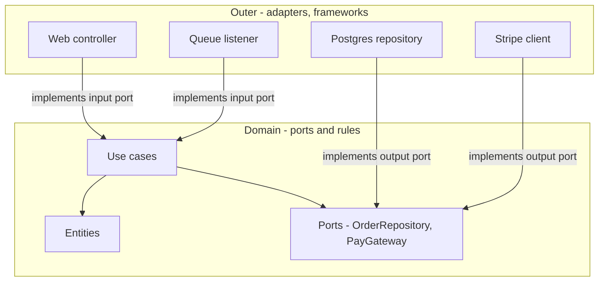

# Hexagonal and Clean Architecture

## 1. One-Line Definition
Hexagonal (ports and adapters) and Clean architecture are design styles that put the *domain* — the business rules — at the center and point all dependencies inward at it, so the domain has no idea whether it is being used over HTTP, a queue, a CLI, or in a test, and which framework/storage is behind it can be swapped freely.

## 2. Why Do We Need It?
In classic layered architecture, dependencies point *downward* from presentation to domain to persistence — which sounds neat, but the domain ends up importing and depending on frameworks: your business rules know about SQL, the web framework, and the message format. Frameworks change faster than business rules do, so every framework upgrade or storage swap touches business code. Hexagonal/Clean flips this: the domain is the *center of the universe*, everything else is a pluggable detail that adapts to it. Business rules become the most stable, most testable, most portable code in the system.

## 3. Simple Intuition
The heart of a house vs its plugs and pipes. The heart wants one thing: electric sockets and water inlets (the *ports*). Whether the power comes from a generator, the grid, or solar, and whether water comes from a well or the city — that's the *adapter's* business, and swapping it never requires re-plumbing the heart. The house is defined by its sockets, not by which power plant feeds it.

## 4. What Happens Without It?
Business logic is welded to infrastructure: your order logic calls Spring/Express/DB classes directly, so unit tests need a database, the HTTP layer owns the pricing rules, and moving from Postgres to DynamoDB — or from REST to gRPC — rewrites business code. Frameworks that were supposed to save time become the walls of your cell; the direction of depend is backwards, and the thing that changes fastest (infra/framework churn) taints the thing that changes slowest (your rules).

## 5. Core Idea
- **The domain is the center:** entities, value objects, and business rules with zero imports of frameworks, drivers, or transport types.
- **Ports — the shape the domain needs from the outside:** an *input port* (use case/application service interface: `PlaceOrder`) and an *output port* (what the domain needs from the world: `OrderRepository`, `PaymentGateway`). Ports are plain interfaces *owned by the domain side*.
- **Adapters — the outside world shaped to fit the ports:** a web controller, a Kafka consumer, a CLI, a repository over Postgres, an HTTP client to a payment provider. Each adapter implements a port.
- **Dependency inversion — the one rule that does everything:** all code depends on abstractions (ports/interfaces) that point *inward*; high-level policy never depends on low-level detail. The DB adapter depends on the repository interface, not the other way round.
- **Clean architecture formalizes this into nesting circles:** entities (innermost) → use cases → interface adapters → frameworks/drivers (outermost). The "dependency rule": source code dependencies point only inward. Everything inbound is driven *from* the outside *through* the ports; everything outbound is implemented by an adapter.

```
Domain (entities, use cases) --ports--> Adapters (controllers, repos)
              ^                               |
              |          depends on ports only
              +-------------------------------+
```

- **Why it works with the rest of the stack:** a hexagonal module is the natural seam for a [[modular-monolith|Modular Monolith]] module, and the in-process/port boundary is exactly what you replace with a network call when the module becomes a [[microservices|Microservices]] service.
- **What it does NOT do:** it does not choose your architecture (monolith vs microservices vs event-driven); it structures a single module/deployable so its core survives tech churn.

## 6. Important Terminology

| Term | Simple Meaning |
|------|----------------|
| Domain | Business rules + entities, framework-free |
| Port | An interface the domain defines for the outside world |
| Adapter | An implementation of a port (controller, repo, client) |
| Dependency inversion | Depends on abstractions, not concretions |
| Dependency rule | Source dependencies point inward only |
| Inbound / driving adapter | What starts an action (HTTP, CLI, queue listener) |
| Outbound / driven adapter | What the domain asks the world for (DB, provider API) |
| Use case | One atomic application workflow the domain exposes |
| Anti-corruption layer | An adapter that translates foreign models to the domain's language |

## 7. Basic Architecture



## 8. Request or Data Flow
1. A request arrives at an inbound adapter (e.g., `POST /orders` controller) — the adapter only parses/destructures and hands a use-case object the domain-side inputs.
2. The use case (`PlaceOrder`) runs business rules purely (validate, price, apply discounts) — no SQL, no HTTP.
3. When it needs the outside world it calls an *output port*: `OrderRepository.save(order)`, `PaymentGateway.charge(...)`.
4. The adapter behind the port (Postgres repository, Stripe client) does the dirty work and returns domain-shaped results — the use case never sees a `PGResult` or a Stripe DTO.
5. The controller formats the response. Swap the DB or the payment provider — the use case and entities don't change by a line.

## 9. Practical Example
**Fintech order service (assumptions):** pricing rules are the competitive secret; infra churns yearly.
- Domain: `Order` aggregate with `applyPricing()` — pure Go, zero imports.
- Input ports: `PlaceOrder`, `CancelOrder` — triggered from a REST adapter and a Kafka listener performing the same logic.
- Output ports: `OrderRepository`, `LedgerClient`, `FraudScanner`.
- Adapters today: Postgres repo, HTTP ledger client, ML fraud HTTP client.
- Result: a change from REST→gRPC or Postgres→TiKV touches one adapter and zero domain tests — and domain tests run in milliseconds with in-memory fake adapters.

## 10. Scaling
- **Scaling is orthogonal — this pattern doesn't scale systems, it isolates change.** The domain stays one place, so the *logic that must be identical everywhere* doesn't fork when you scale out replicas or split services.
- **The adapter boundary is the service seam:** when a module must scale alone (becomes a [[microservices|Microservices]] service), the HTTP adapter at an output port becomes a real HTTP/gRPC client and the input port a controller/service boundary — no domain rewrite.
- **What to watch when scaling wide:** adapters must be stateless (DB pools per adapter), or replica scaling stalls — the domain being framework-free doesn't make adapters immune to pool/connection ceilings (see [[database-connection-pooling|Database Connection Pooling]]).

## 11. Reliability and Failure Scenarios

| Failure | What Happens | Detection | Recovery | Trade-off |
|---------|--------------|-----------|----------|-----------|
| DB adapter fails | Use case gets typed failure from port | Retry/breaker on adapter | Adapter retry + fallback | domain doesn't know |
| Payment provider slow | Output-port call stalls use case | Timeout inside adapter | Timeout/breaker/failover | needs adapter config |
| Bug in domain | Business rules wrong globally | Domain tests catch first | Fix the single home | — |
| Adapter config drift | One environment misbehaves | Env metrics | Config as code | — |

The pattern's reliability superpower: failures surface as **typed results crossing ports**, so the domain decides policy (retry, compensating step, degrade) while adapters handle the mechanics (see [[resilience-patterns|Resilience Patterns (Catalog)]]).

## 12. Consistency and Correctness
- **Correctness lives and dies in the domain — and the domain is testable in isolation:** every business rule can be exercised with fake adapters in-memory, thousands of tests, in milliseconds, with no flaky infra. This is the pattern's biggest correctness win.
- **Transaction boundaries start in the use case** (it knows the full operation span) and are implemented by an output-port adapter — the use case declares `saveAndEmit(order)` and the adapter wraps the pair in a transaction/outbox (see [[outbox-pattern|Outbox Pattern]]).
- **Foreign-model drift is contained:** an anti-corruption adapter at each output port translates between the domain's language and the world's (a legacy service's `OrderBO`, an external provider's DTO) — so inconsistent external schemas can't pollute the domain.

## 13. Performance
- **Near-zero direct overhead:** ports are just interfaces; in-process calls cost nanoseconds. The pattern buys structure, not speed.
- **Real costs:** double translation (domain ↔ world DTOs) adds CPU and memory; adapter indirection can hide hot paths, so profile at the port level (see [[bottleneck-identification|Bottleneck Identification]]).
- **The performance payoff is indirect:** because adapters implement policy-lean ports, you can accelerate *specific* ports (put a [[caching|Caching]] adapter in front of an expensive read port, batch behind a write port) without touching use cases.

## 14. Security
- **The domain can enforce security invariants without trusting the transport:** authZ checks (can this user cancel this order?) run as business rules in the use case, not as framework middleware that other entry points might bypass (see [[authentication-vs-authorization|Authentication vs Authorization]]).
- **Validation happens twice by design:** adapters validate/parse at the edge (reject garbage, see [[web-vulnerabilities|Web Vulnerabilities]]), the domain re-validates invariants (defense in depth on purpose).
- Output adapters hold the sensitive credentials (DB, providers — see [[encryption-and-keys|Encryption and Keys]]), keeping secrets out of domain code and swap-able per environment.

## 15. Trade-Offs

| Choice | Advantages | Disadvantages | When to Use |
|--------|------------|---------------|-------------|
| Layered | Intuitive, few files | Domain depends on infra | Small apps, framework-first |
| Hexagonal/Clean | Domain portable/testable, churn-isolated | More indirection, upfront design | Long-lived systems, hard rules |
| Full Clean nesting | Maximum strictness | Over-engineering risk | Very large rule-heavy domains |

The honest costs: ceremony — each feature touches entity, use case, ports, and two adapters; you must resist over-engineering ("every line of glue gets its own interface"); and the framework's convenience is reduced because you deliberately keep it at the edge.

## 16. Common Mistakes
- **Domain code that imports the framework anyway** ("just one static call") — the entire premise collapses; enforce with architecture tests.
- **Ports shaped like the adapter, not the domain:** if `OrderRepository` has `savePgResult(PGRow)` the port leaks infra; ports must speak domain types.
- **Use cases that are empty shells** (entity methods called from the controller directly) — the use case is where workflow policy lives.
- **An adapter per use case** multiplying boilerplate instead of one adapter per external thing.
- **"Hexagonal as the whole architecture":** applying it to every screen/CRUD of a tiny app — it's for rule-heavy cores, not ten CRUD endpoints.

## 17. HLD vs LLD Boundary
HLD: where the domain boundary sits, which ports exist, which adapters are in/out of scope, how modules map to service seams, transaction/consistency policy across ports. LLD: the interface definitions, entity/use-case decomposition, adapter implementations, DI wiring, architecture-test rules inside the module.

## 18. Interview Questions

### Beginner
- What does "dependencies point inward" mean and why is it better than layered's "downward"?
- What is the difference between a port and an adapter?

### Intermediate
- The business needs a REST API, a Kafka consumer, and a CLI to all run `PlaceOrder`. How does the design make that cheap?
- Why are domain tests "millisecond and stable" in hexagonal design, and why does that matter?

### Advanced
- Your module grows into a microservice. Which parts of a hexagonal design survive the split untouched, and which change?
- Where does the anti-corruption layer belong when you integrate a legacy system, and what does it protect?

## 19. Interview Memory Summary

> [!abstract]- Interview Memory Summary

### Remember

- Domain at the center, framework-free.
- Ports = interfaces the domain needs (input: use cases; output: repository/gateway).
- Adapters = controllers, queue listeners, DB repos, provider clients.
- Dependency inversion: everyone depends on ports; source deps point inward.
- Payoff: business rules testable in isolation, storage/transport swappable, churn isolated.
- It structures a module — it doesn't choose monolith vs microservices.
- The port boundary is the future service seam.

### 30-Second Explanation

Hexagonal/Clean architecture inverts dependency: the domain (pure business rules) sits at the center and defines ports — interfaces for what it needs from the world — while every controller, queue listener, database, and external client is an adapter plugged into a port. All source dependencies point inward, so frameworks and storage are swappable details, domain business rules are stable, and domain tests run in-memory in milliseconds. Remember: it structures one module, and that port boundary is exactly the seam where a future microservice split happens.

### Interview Traps

- Saying "hexagonal" while showing domain code importing the web framework — the dependency rule is the whole idea.
- Confusing ports with adapters (ports are the domain-owned interfaces, adapters are the implementations).
- Claiming it "does scaling" — it isolates change; scaling is a separate, orthogonal decision.
- Acting like it replaces the monolith/microservices decision.
- Anti-corruption into "just one more layer for everything" — it should translate foreign boundaries, not wrap everything.

### Key Trade-Off

You make the domain stable, portable, and milliseconds-testable with infrastructure fully swap-able — at the price of indirection, extra files per feature, and a discipline (architecture tests) to keep the dependency rule from silently rotting.

## 20. Related Concepts

### Prerequisites

- [[layered-architecture|Layered / N-Tier Architecture]] — the pattern it inverts (downward vs inward).
- [[functional-vs-non-functional-requirements|Functional vs Non-Functional Requirements]] — the domain's stable contract derives from them.
- [[system-design-fundamentals|System Design Fundamentals]]

### Commonly Used Together

- [[modular-monolith|Modular Monolith]] — hexagonal modules are the ideal monolith-internal structure.
- [[microservices|Microservices]] — the input/output port boundaries become service boundaries at a split.
- [[outbox-pattern|Outbox Pattern]] — a write port's adapter implements atomic state+event emission.
- [[resilience-patterns|Resilience Patterns (Catalog)]] — adapters are where timeouts/retries/breakers attach.

### Alternatives

- [[layered-architecture|Layered / N-Tier Architecture]] — if the domain core is small and frameworks won't churn.
- [[monolith|Monolith]] — the architecture family this simplifies inside.

### Advanced Concepts

- [[saga-and-strangler|Saga and Strangler Fig]] — port boundaries make strangling and post-split consistency easier.
- [[tenancy-and-cells|Multi-Tenancy and Cell-Based Architecture]] — a per-tenant domain core with adapters keeps isolation policy in one place.

Related planned topics (not authored yet): anti-corruption layer, domain-driven design.

## 21. References
Alistair Cockburn, "Hexagonal Architecture / Ports and Adapters"; Robert C. Martin, "The Clean Architecture"; Fowler on dependency inversion and anti-corruption layer. Verify current framework-guide examples.

## 22. Active Recall

Test yourself before revealing each answer.

> [!question]- What is the core difference between layered and hexagonal/clean dependency direction?
> Layered lets the domain depend on the persistence/infra layer (dependencies point downward). Hexagonal/Clean reverse it: the domain defines ports, all adapters depend on ports, and source dependencies point inward at the domain — so domain code never imports SQL or the web framework.

> [!question]- What exactly is a port vs an adapter?
> A port is an interface *owned by the domain* describing what it needs from the outside — an input port is a use-case interface (PlaceOrder), an output port is what the domain needs done (OrderRepository.save, PaymentGateway.charge). An adapter is any concrete implementation of a port: a web controller, a Kafka listener, a Postgres repository, a Stripe client.

> [!question]- Why are domain tests so fast and stable in this design?
> Because the domain only depends on ports, the tests can substitute in-memory fake adapters — no database, no HTTP, no framework. Business rules run in pure code against fakes in milliseconds with zero flakiness, so thousands of rules can be tested on every commit at trivial cost.

> [!question]- A billing module must be callable from REST, a queue listener, and a CLI, all executing the same rules. How does this design make that cheap?
> All three are inbound adapters that implement the same input port — each adapter parses its own transport's input and calls the same use case. Pricing and invariants live once in the domain; adding a fourth transport (gRPC) is one new adapter, not a new pricing path.

> [!question]- Where do retries, timeouts, and circuit breakers belong in a hexagonal system?
> Inside output adapters (the mechanics) — but the domain decides *policy* through typed port results. The adapter retries with [[retry-and-timeout|Retry and Timeout]], wraps a provider call in a [[circuit-breaker|Circuit Breaker]], and reports a typed failure; the use case decides whether to retry, compensate, or degrade. Policy stays testable; mechanics stay swappable.

> [!question]- Your hexagonal module becomes a microservice. What survives and what changes?
> Domain, use cases, ports, and the port contracts survive untouched — that's the point. What changes: an input port's adapter may move behind an API/gateway, and an output port's adapter that was in-process (direct repo) becomes an HTTP/gRPC client. The seam is already drawn by the ports, so extraction is a boundary swap, not a rewrite.

> [!question]- Where does an anti-corruption layer belong when integrating a legacy order system?
> At the output port boundary: an adapter that talks to the legacy system's APIs/DB and translates its foreign models (LegacyOrderBO, weird status codes) into the domain's Order/status types. It protects the domain from the legacy model's crust so business rules and the rest of the system never see it.

> [!question]- Interview scenario: the team keeps putting "one more adapter" around everything to look hexagonal. How do you push back?
> Ports exist to protect the domain's stability and testability — only boundaries the domain actually depends on earn a port. CRUD-proxy adapters that just forward bytes or wrap a framework add indirection without separating a rule. Enforce: a port needs a real, changing implementation strategy (storage swap, transport variety, foreign boundary) or it's ceremony, not architecture. Use architecture tests to keep the dependency rule honest.

## 23. When Should I Use This?

### Use it when

- Business rules are complex, stable, and the thing that changes least — and must keep being correct.
- Storage / transport / vendor churn is expected (DB swaps, REST→gRPC, provider changes).
- Domain logic must be shared across multiple entry points (REST, queues, CLI, tests).
- You want business rules proven by fast, in-memory tests on every commit.
- You're building the seam for a future modular-monolith→microservice split.

### Avoid it when

- The app is CRUD-thin: rules are trivial, and the framework + DB are effectively the product.
- A small team needs maximum early speed and framework leverage.
- The org cannot enforce the dependency rule (unchecked, it becomes ceremony).
- Everything really is "one technology, one deployment, no churn" (rare, honesty required).

### What problem does it solve?

The framework/infra dependency trap: business rules welded to SQL and HTTP, so tests need databases, changed transports and storage rewrite business code, and the fastest-changing layer taints the slowest-changing one. It inverts dependencies so the domain is the stable center, everything else plugs into it through ports.

### What problem does it NOT solve?

It isn't a system architecture — it does not decide monolith vs microservices vs event-driven, does not scale anything, does not add reliability or performance (those are orthogonal decisions attached to adapters), and does not prevent over-engineering if applied to trivial code.

## 24. Decision Connections

Decisions that go together with hexagonal and clean architecture:

- [[layered-architecture|Layered / N-Tier Architecture]] — the baseline this inverts (downward vs inward dependency).
- [[modular-monolith|Modular Monolith]] — hexagonal modules fit perfectly inside the single deployable.
- [[microservices|Microservices]] — the ports are the pre-drawn boundaries for extraction.
- [[outbox-pattern|Outbox Pattern]] — an output port adapter implements atomic state + event emission.
- [[resilience-patterns|Resilience Patterns (Catalog)]] — where timeouts/retries/breakers attach per adapter.
- [[saga-and-strangler|Saga and Strangler Fig]] — port seams make strangling and cross-boundary consistency tractable.
- [[database-connection-pooling|Database Connection Pooling]] — the adapter that owns a DB connection pool must stay stateless for scaling.
- [[transactions-and-acid|Transactions and ACID]] — use cases span transaction boundaries via port adapters.

Decision tree:

```
Complex, rule-heavy core?
    |
    +-- Rules are thin / CRUD-centric?
    |      → [[layered-architecture|Layered / N-Tier Architecture]], framework-first
    |
    +-- Business rules must outlive infra churn?
    |      → [[hexagonal-clean-architecture|Hexagonal and Clean Architecture]]
    |         |
    |         +-- Multiple entry points (REST, queue, CLI)?
    |         |      → inbound adapters share one use case
    |         +-- Storage/transport swaps expected?  → output ports + adapters
    |         +-- Future microservice split likely?  → ports as the extraction seams
    |         +-- Legacy integration?                → anti-corruption adapter at the port
    |
    +-- Rules shared in-process across modules?
           → [[modular-monolith|Modular Monolith]] with hexagonal modules
```