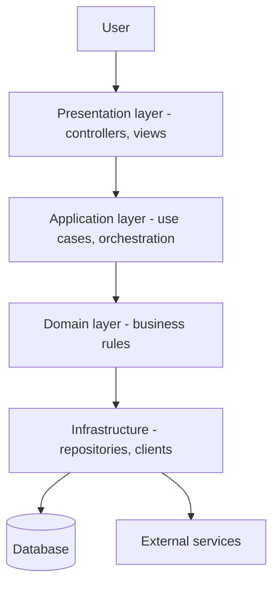

# Layered / N-Tier Architecture

## 1. One-Line Definition
Layered architecture organizes software into horizontal layers — presentation, application, domain/business logic, and persistence — where each layer has one job and only depends on the layer directly beneath it (dependencies point downward, not sideways or up).

## 2. Why Do We Need It?
Untangled code becomes a ball of mud: presentation logic, business rules, and SQL interleaved in the same methods, so any change can break anything and no one can reason about the system. Layers impose a discipline: each concern lives in exactly one place, components are swapped (a MySQL API for a Postgres one, a REST view for a CLI) without touching the rest, and teams can work on separate strata in parallel. It is the default starting architecture for almost every non-trivial application because it is intuitive, testable, and cheap to start with.

## 3. Simple Intuition
A restaurant kitchen with roles: the expediter (presentation) takes the order and plates the result; the line cooks (application) coordinate the dish; prep and the pantry (domain) know the actual recipes; the walk-in fridge and shelves (persistence) store ingredients. Orders only flow one way — the expediter never drops directly into the fridge, and prep never serves customers. Each role can be replaced, trained, or scaled independently because no one reaches past the layer below them.

## 4. What Happens Without It?
Change becomes expensive and dangerous: a UI tweak touches SQL, a schema change ripples into scraped views, business rules hide inside controllers, and two features step on each other's code. Testing is impossible in isolation, onboarding to "where do I change this" is a detective hunt, and the probability of regressions grows with every commit. This is the "god class" / tangled-code failure mode that motivates separation of concerns.

## 5. Core Idea
- **The classic four (in a web app):** presentation (UI/HTTP), application (workflow/use-case orchestration), domain (business rules/entities), infrastructure/persistence (DB, external APIs, files).
- **Dependency direction is everything:** each layer may only reference the layer directly beneath it. Going up is allowed at runtime (data flows in) but not at code level (a domain entity must not import a controller).
- **Strict vs relaxed layering:** *strict* — every layer talks only to the next one down; *relaxed* — a layer may reach to any lower layer. Strict is cleaner; relaxed is pragmatic and more common in real codebases.
- **N-layer vs N-tier:** *layers* are logical (in one codebase/process); *tiers* are physical (separate machines/processes: web server tier, app tier, DB tier). An n-layer app can be deployed on one tier; an n-tier app means network calls between tiers.
- **Tier placement follows load and trust:** presentation tier at the edge, stateless (see [[stateless-vs-stateful-services|Stateless vs Stateful Services]]); persistence tier deepest, most locked down.
- **Common addition — the service/repository split:** services orchestrate, repositories isolate the DB. The point is not the exact layer names — it is that each concern has a home and a direction of dependence.
- **The main weakness:** *leaky abstractions* — a lower layer's concern (SQL, an ORM, a network call) reaches up and infects higher layers, silently breaking the whole point.

## 6. Important Terminology

| Term | Simple Meaning |
|------|----------------|
| Layer | Logical grouping of one concern (code-level) |
| Tier | Physical/process boundary (machine-level) |
| Presentation layer | UI / HTTP entry point |
| Application layer | Use-case orchestration, doesn't hold business truth |
| Domain layer | Business rules and entities |
| Persistence layer | DB / storage access |
| Dependency direction | The rule: code may only call downward |
| Leaky abstraction | A lower layer's detail escaping upward |
| Layered vs N-tier | Logical strata vs physically separated processes |

## 7. Basic Architecture



## 8. Request or Data Flow
1. Request arrives at the presentation tier (a controller validates it, no business logic here).
2. The controller calls the application layer, which runs the use case end-to-end (start transaction, fetch, validate, mutate, commit).
3. Business rules live in the domain layer — entities/domain services decide what the mutation *means*.
4. Persistence is reached only through repositories in infrastructure — ad-hoc SQL is confined there.
5. The result bubbles back up; presentation formats it. Code never jumped layers.

## 9. Practical Example
**E-commerce checkout web app (assumptions):** one codebase, ~10 auth/orders/payments features.
- Presentation: HTTP controllers + templating.
- Application: `PlaceOrderUseCase` — orchestrates cart read, stock check, order create, payment call.
- Domain: `Order`, `Cart`, `Payment` entities owning invariants (cannot ship before paid).
- Persistence: repositories over Postgres.
- Adding a **new storage**: only repositories change. Adding a **new frontend**: only presentation changes. This isolation is the entire payoff, and where it becomes visible.

## 10. Scaling
- **Horizontal scaling happens at the tier level, not the layer level:** the presentation tier is stateless → runs behind a [[load-balancing|Load Balancer]] at N copies; the application tier scales if business logic is the bottleneck; the database tier scales last (see [[sharding|Sharding]]).
- **What breaks:** stateful mid-layers (sessions in app tier) block scaling — go [[stateless-vs-stateful-services|Stateless vs Stateful Services]] and push state to a cache/DB. Inter-tier calls become network round-trips — each hop adds latency.
- **The order of scaling** usually follows the tiers: LB + app replicas → [[caching|Caching]] → read replicas → sharding. Staying layered doesn't change this; it just keeps each tier independently scalable.

## 11. Reliability and Failure Scenarios

| Failure | What Happens | Detection | Recovery | Trade-off |
|---------|--------------|-----------|----------|-----------|
| DB tier down | All requests fail at persistence | DB health, error rate | Read replicas / failover | extra infra |
| App tier exhausted | Threads saturate | Latency, 5xx | Scale out (stateless) | session moved out |
| Slow external service called from app layer | Requests pile up | Timeout/error metrics | [[retry-and-timeout|Retry and Timeout]], [[circuit-breaker|Circuit Breaker]] | added complexity |
| Bug in domain layer | Wrong business result across features | Test coverage gap | Fix at the single home of the rule | — |

Because concerns are isolated, a persistence outage degrades cleanly at that boundary (fallback, cache), while an app-layer bug doesn't corrupt data persisted underneath.

## 12. Consistency and Correctness
- Inside **one process**, layered calls can share one [[transactions-and-acid|Transactions and ACID]] context (single DB) — the easiest place to get correctness.
- The moment tiers become **separate processes**, calls cross the network: you now need distributed-systems thinking (retries, idempotency) even though the code still *looks* like flat method calls.
- Business invariants must live in the domain layer (bottom of the call stack) so every entry point — UI, API, batch job, CLI — gets the same rules.

## 13. Performance
- Each **logical layer hop** is cheap in-process; each **tier hop** is a network round-trip (see [[latency-vs-throughput|Latency vs Throughput]]). N-tier therefore amortizes poorly if every request makes 5 machine-to-machine calls.
- Oversized DTOs and eager/lazy data access (the classic N+1: a repository call per row) are the standard layering performance mistakes — solve at the persistence layer with batching/indexing (see [[database-indexing|Database Indexing]]).
- Adding layers to satisfy a diagram (a "service" per controller) adds no value and costs a hop of mental overhead per call.

## 14. Security
- Layers create natural **trust boundaries**: authenticate/authorize at the presentation edge (see [[authentication-vs-authorization|Authentication vs Authorization]]), validate input there, and *never* trust a lower layer — validate again at the boundary where the invariant matters.
- Persistence tier is the deepest: DB credentials, least-privilege roles, TLS in transit, encryption at rest (see [[encryption-and-keys|Encryption and Keys]]).
- The presentation tier is exposed to the internet and is where [[web-vulnerabilities|Web Vulnerabilities]] are first handled (injection, XSS, CSRF) — layers prevent a DOM virus from reaching the DB layer directly, but only if the boundaries actually enforce what crosses them.

## 15. Trade-Offs

| Choice | Advantages | Disadvantages | When to Use |
|--------|------------|---------------|-------------|
| Strict layering | Clean dependencies, easy tests | Boilerplate pass-throughs | Large teams, long-lived systems |
| Relaxed layering | Less ceremony | Accidental coupling creeps in | Small apps, fast iteration |
| Single tier (n-layer) | No network overhead, local ACID | Limited scale, all-or-nothing deploy | Most applications early on |
| N-tier (split processes) | Independent scaling, security zones | Network cost, distributed complexity | High traffic, exploded teams |
| Framework "clean n-tier" scaffolding | Fast to start | Scaffolding fights you | Prototypes |

The honest cost of layering: indirection. Every request passes through several thin layers that mostly delegate, which is exactly how you control large systems — and exactly why a 2-file script should not be "layered."

## 16. Common Mistakes
- **Leaky abstractions:** SQL strings, ORM classes, or HTTP knowledge bubbling up into controllers and domain objects — the layering becomes decoration.
- **Business logic in the presentation/application layer** (validation, pricing, permission checks in controllers) — duplicated everywhere and impossible to test.
- **Strangling the domain:** anemic domain with all rules in services means nobody `can` make the "domain layer" answerable.
- **Tiering for its own sake:** splitting into web/app/DB tiers at 50 users, paying network cost and distributed-complexity for no load — premature.
- **Dependency cycles** that need special exceptions ("this one entity can reach the repository") — the boundary quietly stops meaning anything.

## 17. HLD vs LLD Boundary
HLD: which layers/tiers exist, dependency rules between them, where each tier is deployed, what crosses each boundary, scaling tiers. LLD: the exact classes, interfaces, ORM/repository code, DI wiring, transaction boundaries inside a layer.

## 18. Interview Questions

### Beginner
- What is the difference between a layer and a tier?
- Why does code in a layered system depend only downward?

### Intermediate
- A change to the payment screen keeps breaking order reports. What architectural smell is at work, and what's the fix?
- Walk one request through presentation, application, domain, persistence. Where do transaction boundaries belong?

### Advanced
- Your "layered" system is actually leapfrogging layers everywhere. How do you restore the boundaries without a rewrite?
- When does n-tier deployment force you to treat in-process method calls as network calls, and what changes?

## 19. Interview Memory Summary

> [!abstract]- Interview Memory Summary

### Remember

- Layers are logical; tiers are physical/process boundaries.
- Each layer has one job; code depends only downward.
- Presentation → application → domain → persistence is the canonical stack.
- The payoff: swap-ability, testability, isolated concern ownership.
- Leaky abstractions and business logic in controllers are the two smells that torch it.
- Scaling happens at tiers, statelessly.

### 30-Second Explanation

Layered architecture partitions software into presentation, application, domain, and persistence where each level has one concern and only calls the layer beneath it. Changes stay local, concerns stay swappable, and scaling happens at tiers. Watch out: leaky abstractions and business logic drifting into controllers are what silently destroy the structure.

### Interview Traps

- Confusing layers (logical) with tiers (physical) — the most common slip.
- Claiming strict layering while admitting a controller queries the DB directly.
- Answering "scale a layered app" with "add layers" — scaling is at tiers: LB, stateless replicas, cache, DB.
- Forgetting the domain layer owns business invariants; putting them in services or controllers is a red flag in the answer.

### Key Trade-Off

You buy isolated, swappable, testable concerns (and easy team parallelization) at the cost of indirection and pass-through — and the whole thing collapses if dependencies leak upward or business logic climbs into the wrong layer.

## 20. Related Concepts

### Prerequisites

- [[system-design-fundamentals|System Design Fundamentals]]
- [[functional-vs-non-functional-requirements|Functional vs Non-Functional Requirements]]

### Commonly Used Together

- [[stateless-vs-stateful-services|Stateless vs Stateful Services]] — the app tier stays stateless so it scales horizontally.
- [[horizontal-vs-vertical-scaling|Horizontal vs Vertical Scaling]] — scaling happens at the tier level.
- [[load-balancing|Load Balancing]] — the front of the presentation tier.
- [[caching|Caching]] — the standard shortcut past the DB tier.

### Alternatives

- [[monolith|Monolith]] — layered apps usually ship as one deployable to start.
- [[hexagonal-clean-architecture|Hexagonal and Clean Architecture]] — inverses the dependency direction for domain protection.
- [[microservices|Microservices]] — the ultimate (physical) split, where each service is itself a small layered app.

### Advanced Concepts

- [[microservices|Microservices]] — what n-tier becomes at global scale.

Related planned topics (not authored yet): API gateway, BFF.

## 21. References
Fowler, "Presentation Domain Data Layering" / P of EAA; Microsoft Azure Architecture Center layered-architecture guidance; verify with current framework guides.

## 22. Active Recall

Test yourself before revealing each answer.

> [!question]- What is the difference between a layer and a tier?
> A layer is a logical grouping of one concern inside the code (presentation, domain, persistence) and can all run in one process. A tier is a physical/process boundary — separate machines or processes — so an n-layer app can run on one tier, and an n-tier app means network calls between tiers.

> [!question]- Why must code in a layered system depend only downward?
> So each concern can change or be swapped without cascading: only the layer directly above a changed layer notices. Upward or sideways dependencies create cycles where a domain change can force controller and persistence changes together — the exact coupling layering exists to prevent.

> [!question]- Where should transaction boundaries live in a layered request flow?
> At the application (use-case) layer. It starts and commits the transaction because it is the only layer that sees the full span of the operation. Controllers and presentation must not begin transactions, and domain/repository layers should not assume one exists externally.

> [!question]- A change to the payment screen keeps breaking order reports. What smell is this?
> Business rules and shared state are leaking across layers — e.g., pricing/schema knowledge duplicated in both the controller and the report query. The fix is to give the rule exactly one home (the domain layer and its repositories) and have both screen and report call the same code, enforcing dependency direction.

> [!question]- When does n-tier deployment force you to treat method calls as network calls?
> The moment a layer moves onto another machine, the "call" can time out, retry, duplicate, or return stale data — it needs timeouts, idempotency, and retries even though it reads like a method call. That is when retry + idempotency and circuit-breaker discipline attach to your app tier.

> [!question]- Interview scenario: how do you scale a purely layered web app that is melting at checkout?
> 1. Stateless presentation + app tiers behind a load balancer (scale replicas).
> 2. Cache hot reads (catalog, prices, session) at the app tier.
> 3. Move DB scaling: read replicas, then indexes, then sharding if writes are the ceiling.
> 4. Keep the rest layered so only the bottleneck tier changes. Scaling is a tier decision, not a layer decision.

> [!question]- Why is a "layer for every controller" a mistake?
> It adds a pass-through hop with no distinct concern: the layer has no job, so no ownership, no swappability, and no testability — just indirection cost. Layers earn their keep only when they hold a real concern with a real reason to change independently.

> [!question]- Is a layered app automatically good architecture?
> No. Layering is organizational hygiene, not an end state. Over-layering hides simple code behind ceremony, while leaky layers pretend to isolate what they don't. Good architecture matches the number of layers and tiers to the system's size, team, and scaling needs.

## 23. When Should I Use This?

### Use it when

- The codebase is non-trivial and needs a shareable mental model of where things live.
- You want isolated, swappable, testable concerns (UI, rules, storage).
- Teams need to parallelize across well-drawn boundaries.
- You're following a framework whose idiom *is* layered (most web frameworks).

### Avoid it when

- The program is a script or small tool — layering is pure ceremony.
- Strictness would slow iteration more than structure would help.
- The real complexity is cross-cutting data flow (then event-driven or hexagonal thinking fits better).

### What problem does it solve?

Untangled responsibility: presentation, business rules, and storage each get one clear home with a one-way dependency between them, so changes stay local, components are swappable, and each stratum is testable in isolation.

### What problem does it NOT solve?

It doesn't make a monolith scale by itself (that needs tiers/statelessness/caching), doesn't enforce the rules by itself (a leaky team can bypass anything), doesn't protect the domain from driven infrastructure (see hexagonal), and doesn't decompose ownership across many teams (that's microservices).

## 24. Decision Connections

Decisions that go together with layered architecture:

- [[stateless-vs-stateful-services|Stateless vs Stateful Services]] — the app tier must shed state to scale as replicas.
- [[horizontal-vs-vertical-scaling|Horizontal vs Vertical Scaling]] — the layer diagram decides which tier to scale; statelessness decides whether it can.
- [[load-balancing|Load Balancing]] — sits in front of the (stateless) presentation/app tier.
- [[caching|Caching]] — inserted between layers cheaply because the boundaries are clean.
- [[monolith|Monolith]] — a layered app normally starts shipped as a monolith.
- [[hexagonal-clean-architecture|Hexagonal and Clean Architecture]] — the domain-protective inverse: dependencies point inward at the domain instead of downward.
- [[microservices|Microservices]] — push the layers onto machines and give each slice its own data, and layered becomes distributed.
- [[transactions-and-acid|Transactions and ACID]] — the single-DB, single-process side of layered that makes correctness easy while it lasts.

Decision tree:

```
New codebase, more than a script?
    |
    +-- Tiny / prototyping?
    |      → keep it flat; add structure when it fights back
    |
    +-- Non-trivial app with UI + rules + storage?
    |      → [[layered-architecture|Layered / N-Tier Architecture]]
    |         |
    |         +-- One machine, one deployable?   → single tier (n-layer)
    |         +-- Load/security demands machines? → n-tier
    |         +-- Domain must never leak?         → [[hexagonal-clean-architecture|Hexagonal and Clean Architecture]]
    |
    +-- Multiple teams own separate flows?
           → [[microservices|Microservices]] (each service is layered internally)
```