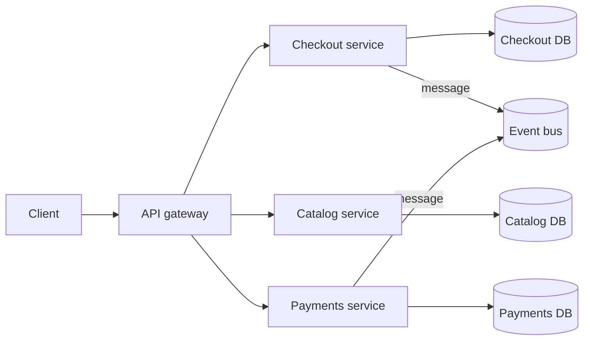

# Microservices

## 1. One-Line Definition
Microservices architecture decomposes a system into small, independently deployable, and independently scalable services — each owning its own data and exposing a well-defined API — that communicate over the network instead of within one process.

## 2. Why Do We Need It?
When an organization gets large enough that hundreds of developers ship one artifact, and when different subsystems have wildly different scale, latency, and failure profiles, the monolith's shared codebase, shared database, and single blast radius become the bottleneck. Microservices let each service deploy on its own cadence, scale on its own curve, fail without taking everything down, and be owned by one small team end-to-end. They also allow practicing technology diversity where it genuinely pays (a streaming service in Go, a report service in Python).

## 3. Simple Intuition
A city of specialized shops instead of one mega-factory. Each shop (service) owns its stock (database), sets its own hours (deploy cadence), can close for repairs without the city stopping (failure isolation), and expands its own storefront when busy (independent scaling). Shoppers (other services) travel between shops through the streets (the network). The cost: the street grid, traffic, and inter-shop logistics become a system you must manage that the mega-factory never had.

## 4. What Happens Without It?
You stay a monolith while your organization grows: one codebase no one can hold in their head, one deploy that queues behind everyone, one database where every schema change ripples, and one hot feature burning down the whole process. Every problem becomes "blocked by the monolith." Alternatively you go microservices without design discipline and get a "distributed big ball of mud" — which is strictly worse than either option.

## 5. Core Idea
- **Service = business capability, owned by one team:** a service is a coherent capability (checkout, payments, inventory), owned end-to-end by one team; the team is the meaningful unit, the service is its artifact.
- **Independent deployability is the definition of the model:** each service ships on its own release train — this is what makes it microservices rather than SOA-lite with shared deploy.
- **Database-per-service (the hard rule):** a service owns its data exclusively; no other service reads its tables directly, only its API. This is what opens the door to polyglot persistence and is also the source of the hardest problems (cross-service joins and transactions).
- **Communication on the network:**
  - *Synchronous:* HTTP/REST, gRPC (see [[http-and-https|HTTP and HTTPS]]) — simple, but couples availability and latency.
  - *Asynchronous:* [[message-queue|Message Queue]] / [[pub-sub-pattern|Publisher-Subscriber Pattern]] — decouples in time and load; needs [[delivery-semantics|Delivery Semantics]] and idempotency.
- **Distributed systems you now own:** service discovery, load balancing between services, retries, timeouts, circuit breakers, [[distributed-tracing|Distributed Tracing]], API contracts and versioning.
- **Cross-service data integrity:** the classic fall from ACID: what was one transaction becomes a [[saga-and-strangler|Saga and Strangler Fig]] (compensations), a state machine, or an [[outbox-pattern|Outbox Pattern]] event flow.
- **The entry point:** a client-facing [[reverse-proxy|Reverse Proxy]] / API gateway (api-gateway planned) that routes, auths, and fan-outs to services — internal service-to-service traffic does not need the gateway.

## 6. Important Terminology

| Term | Simple Meaning |
|------|----------------|
| Service | A business capability, its own deployable |
| Database-per-service | Data owned by one service, API-only access |
| Deployable unit | What ships independently; microservices ship many |
| Service discovery | How a caller finds a service's address |
| API contract | The versioned interface between services |
| Blast radius | The set of things that fail together |
| Saga | Coordinating a flow across services with compensations |
| Anti-corruption layer | A translator that protects your domain from other services' models |
| Strangler fig | Incremental migration pattern; see the saga-and-strangler file |
| Conway's law | System structure mirrors communication of the org |

## 7. Basic Architecture



## 8. Request or Data Flow
1. Client hits the API gateway (reverse proxy with routing/auth) → gateway calls `CheckoutService`.
2. Checkout needs catalog data: a sync call to `CatalogService` (or a cached read model) — it can never query Catalog's DB.
3. Charging the card: Checkout calls `PaymentsService`; if the flow must span services and stay consistent, it becomes a saga or an event sequence (see [[saga-and-strangler|Saga and Strangler Fig]]).
4. Each service writes only its own DB; events flow through the bus; one request now spans N machines and needs trace IDs and timeouts at every hop.

## 9. Practical Example
**E-commerce at 300 engineers (assumptions):** catalog, cart, checkout, payments, inventory, search, recommendation, logistics.
- Each service is 2–8 devs; each ships 20–50 times a day on its own pipeline.
- Checkout has a P99 SLA of 150ms and bursts 20x on Prime day → it scales alone with 40 replicas; catalog scales on reads; payments scales on compliance-locked cadence.
- Cross-service flows (checkout → payments → logistics) run as sagas with idempotency keys; events like `order.placed` fan out to search and recommendation via the bus.
- Cost paid: N services to monitor, version contracts, and debug — hence heavy [[observability|Observability]] and contract-first work.

## 10. Scaling
- **Per-service scaling is the headline feature:** one hot service autoscales independently (see [[horizontal-vs-vertical-scaling|Horizontal vs Vertical Scaling]]); replicas of `Checkout` grow without touching `Payments`.
- **What breaks in scaling:** a DB-per-service means one service's hot writes scale only to one node (unless you [[sharding|Sharding]] it), and each services scales only as far as its own weakest dependency — a synchronous chain back to an unscaled service throttles everyone (fix with [[caching|Caching]], async, or load shedding).
- **Per-service scaling amplifies data:** fewer shared structures, more duplicated/denormalized data across services (read models) — storage grows.
- **Operational scale:** N services × M replicas × K environments = huge infra; containers + orchestration (kubernetes planned) and service mesh are the standard infrastructure answers.

## 11. Reliability and Failure Scenarios

| Failure | What Happens | Detection | Recovery | Trade-off |
|---------|--------------|-----------|----------|-----------|
| One service dies | Only its callers are impacted | Error rate / health check | Restart via orchestrator | failover works per service |
| Dependent service slow | Callers queue + time out | [[golden-signals|Golden Signals]] | [[retry-and-timeout|Retry and Timeout]], [[circuit-breaker|Circuit Breaker]], fallback | added pattern tax |
| Cascading failure | One failed service saturates all callers (retry storms) | Saturation metrics | Circuit open + backpressure | failure-isolation discipline |
| Node/machine loss | A service's replicas drop | Orchestrator | Reschedule replicas | per-service failover |
| Data split-brain across services | Two services disagree on the same fact | Reconciliation jobs | Events/outbox make one source of truth | eventual consistency |

Microservices don't reduce failures; they *contain* and *localize* them — but turn every request into a chain of failure points that only systematic resilience (timeouts, breakers, retries, fallbacks, idempotency) keeps reliable (see [[resilience-patterns|Resilience Patterns (Catalog)]]).

## 12. Consistency and Correctness
- **The monolith's ACID is gone:** a flow across services cannot be one transaction (see [[transactions-and-acid|Transactions and ACID]]). Accept eventual consistency (see [[strong-vs-eventual-consistency|Strong vs Eventual Consistency]]) and coordinate with sagas or event flows.
- **Outbox + idempotency are the correctness toolkit:** [[outbox-pattern|Outbox Pattern]] to publish events atomically with local state; idempotency keys on every write so retries are cheap.
- **API contracts and versioning** become the unit of correctness between teams (contract-first, planned in 04); breaking changes need versioning discipline.
- **Split-brain hazard:** two services holding copies of the same fact can diverge; decide one owner, propagate by events, and reconcile.

## 13. Performance
- **Every remote call adds ~0.1–1ms+ plus serialization:** a chatty 10-call chain wrecks latency, so you design *chunky* APIs and co-locate what must be fast.
- **Fan-out amplification:** gateway calling 5 services costs 5 round-trips — batch and parallelize; consider read models so reads don't fan out at all.
- **Per-service latency budget:** allocate a P99 budget per hop (e.g., 150ms total → 30ms per service in a chain of 4, plus headroom); trace it with [[distributed-tracing|Distributed Tracing]].
- Network, de/serialization, and per-service pools are the new permanent costs — inherently worse than the in-process monolith, justified by the scaling/org wins.

## 14. Security
- Each service is a separate attack surface: authenticate per service (mTLS/[[authentication-vs-authorization|Authentication vs Authorization]]), not "trust inside the process" like a monolith.
- The API gateway is the edge: authN, rate limiting, TLS termination — internal service traffic is not publicly routable.
- Database-per-service means less shared-secret blast radius, but also N databases to keep encrypted and locked down (see [[encryption-and-keys|Encryption and Keys]]).
- Contracts and event payloads cross trust boundaries: validate and redact (schema registry planned), never log PII from events.

## 15. Trade-Offs

| Choice | Advantages | Disadvantages | When to Use |
|--------|------------|---------------|-------------|
| Monolith | Simplicity, ACID, in-process speed | One blast radius, org-scale coupling | Early/small systems |
| Modular monolith | Boundaries + simplicity + ACID | Deploy coupling remains | Growing team, pre-split |
| Microservices | Independent deploy/scale/failure, team ownership | Distributed complexity, ops, cost, eventual consistency | Multiple teams, real scale needs |
| SOA (planned) | Reuse via shared services | Shared governance, heavier | Large enterprises |

## 16. Common Mistakes
- **"Distributed monolith":** services that deploy separately but share a database or call each other in nested chains — worst of both worlds.
- **Premature splitting:** 5 services for 20 users; you pay the distributed tax for scale you don't have.
- **Chatty synchronous chains** (deep call graphs) instead of chunky APIs/events — latency and availability crater.
- **Dropping transactions entirely:** no outbox, no idempotency, no saga → silent data drift between services.
- **Ignoring contracts/versioning:** one team's API change breaks another's deploy — treat the interface as the product boundary.
- **No observability foundation:** split the code before you can trace and alert across services.

## 17. HLD vs LLD Boundary
HLD: which capabilities become services, data ownership per service, sync vs async communication, saga/event contracts, gateway topology, scaling/failure budgets per service, migration sequencing. LLD: service code, API schemas, repositories, idempotency keys, message payloads, deployment manifests inside one service.

## 18. Interview Questions

### Beginner
- What makes something a microservice rather than just a module?
- Why does database-per-service exist, and what does it cost?

### Intermediate
- Design checkout-to-payments as microservices: how do you keep the flow consistent without a transaction?
- Client on the edge, 4 services inside: how does a request flow, and where do latency budgets go?

### Advanced
- Your services share one database because "it was faster." Where does this break at 200 engineers?
- How do you decompose a monolith into services without downtime (walk the migration)? See also saga-and-strangler.

## 19. Interview Memory Summary

> [!abstract]- Interview Memory Summary

### Remember

- Small, business-capability services owned by one team.
- Independently deployable and independently scalable — that's the definition.
- Database-per-service: own your data, expose APIs only.
- Sync calls for simple; events/messages for decoupling; sagas for cross-service integrity.
- Distributed systems tax: discovery, retries, breakers, tracing, contracts.
- ACID dies at the network boundary; eventual consistency + outbox + idempotency fill the gap.
- Start monolithic/modular; split only when scale or org demands it.

### 30-Second Explanation

Microservices decompose a system into independently deployable services, each owning its data and exposing an API, communicating over the network. This buys independent scaling, deployment, failure isolation, and team ownership — but replaces a monolith's transactions and in-process speed with distributed-systems machinery: timeouts, retries, circuit breakers, tracing, contracts, and saga/event consistency. Split when the monolith's coupling or org scale hurts more than this tax does.

### Interview Traps

- Describing microservices but allowing a shared database — you described a distributed monolith.
- Claiming "more microservices = more reliable" — containment is the win, not fewer failures.
- Forgetting to budget latency per hop and per service.
- Ignoring idempotency/outbox when claiming exactly-once behavior.
- Jumping straight from monolith to microservices without modular seams.

### Key Trade-Off

You trade a monolith's simplicity, ACID, and latency for independent deploy/scale/failure and team ownership — paying a permanent distributed-systems tax (discovery, resilience patterns, tracing, eventual consistency) that only pays off once the monolith's coupling or org scale truly hurts.

## 20. Related Concepts

### Prerequisites

- [[monolith|Monolith]] and [[modular-monolith|Modular Monolith]] — the baseline; microservices are an escalation, not a start.
- [[scalability|Scalability]] and [[horizontal-vs-vertical-scaling|Horizontal vs Vertical Scaling]]
- [[http-and-https|HTTP and HTTPS]] — the sync transport between services.

### Commonly Used Together

- [[message-queue|Message Queue]], [[pub-sub-pattern|Publisher-Subscriber Pattern]] — async decoupling between services.
- [[saga-and-strangler|Saga and Strangler Fig]] — cross-service consistency and migration.
- [[outbox-pattern|Outbox Pattern]] — atomic event emission from a service's DB.
- [[resilience-patterns|Resilience Patterns (Catalog)]] — retries, breakers, backoff, load shedding.
- [[distributed-tracing|Distributed Tracing]] — the debugging layer a distributed system can't live without.
- [[reverse-proxy|Reverse Proxy]] — the gateway function at the edge (api-gateway planned).

### Alternatives

- [[layered-architecture|Layered / N-Tier Architecture]] — for systems too small to split.
- [[modular-monolith|Modular Monolith]] — the same boundaries without the network/ops cost.
- [[data-patterns|Data Access Patterns]] — read replicas/models when cross-service data sharing is tempting.

### Advanced Concepts

- [[cap-theorem|CAP Theorem]] and [[strong-vs-eventual-consistency|Strong vs Eventual Consistency]] — the constraints behind the eventual-consistency deal.
- [[tenancy-and-cells|Multi-Tenancy and Cell-Based Architecture]] — isolating tenants/blast radius beyond service boundaries.
- [[sharding|Sharding]] — when a single service's data outgrows one node.

Related planned topics (not authored yet): API gateway, service discovery, BFF, service mesh, serverless.

## 21. References
Fowler & Lewis, "Microservices" (define-architecturally); Newman, "Building Microservices"; Kleppmann DDIA ch. 4 (encoding/contracts); Azure/Google microservices architecture references. Verify current gateway and service-mesh options.

## 22. Active Recall

Test yourself before revealing each answer.

> [!question]- What is the defining property of a microservice?
> Independent deployability scaled to actual org need — a service can be changed, tested, and shipped on its own release train, and owned end-to-end by one team. A "microservice" you cannot deploy alone is just a module.

> [!question]- Why database-per-service, and what does it cost?
> It forces a clean API boundary and independent evolution — no schema coupling, no hidden cross-service joins, freedom to choose storage per service. The cost: cross-service queries become impossible, joins become app-side, and transactions become sagas/event flows (eventual consistency).

> [!question]- Client hits the gateway, and checkout needs catalog and payment data synchronously. Walk the latency budget.
> Gateway → checkout (say 30ms) → catalog (30ms) and → payments (30ms) in parallel, plus network and serialization per hop, must fit inside a client budget like 150ms P99. Each service gets a sub-budget; tracing attributes every millisecond; a slow hop gets cached, batch-called, or made async rather than just tolerated.

> [!question]- Design checkout → payments as services. How do you keep the flow consistent without a transaction?
> You don't keep ACID — you accept eventual consistency and coordinate: a saga (compensations if payment fails: refund, release inventory) or an event flow where Checkout commits locally, emits `order.placed` via the outbox, Payments consumes idempotently, and compensation events undo partial success. Idempotency keys + outbox make retries safe.

> [!question]- A hot service calls a slow service synchronously, and now calls, queues, and memory pile up across callers. Diagnose.
> Coupled synchronous fan-in with no guards: callers spend timeout budgets and threads on a dependency that can't keep up, turning one slow service into cascading latencies. Fixes: circuit breaker + bounded retries at callers, caching values that can be stale, async/events to decouple, and load shedding/backpressure at the slow service.

> [!question]- Should a small start-up with 5 developers use microservices?
> Usually no — start monolithic or modular. The distributed tax (N build pipelines, discovery, tracing, retries, contracts, saga complexity) is a big fixed cost, and a 5-person team can hold a monolith in its head. Split when one deploy cadence, one blast radius, or one scaling curve genuinely hurts.

> [!question]- Interview scenario: decompose a checkout monolith into two services without downtime. What's the order of operations?
> Build seams inside the monolith first (module boundaries), then extract via the strangler pattern: route new traffic to the new service through a facade, dual-write or migrate data per feature, verify, cut over, then delete old paths. Keep contracts and idempotency intact across the split — code extraction is the easy part; data migration and cross-service consistency are the surgery.

> [!question]- What is a "distributed monolith" and why is it the worst option?
> Services deployed separately but still tightly coupled — shared database, deep synchronous call chains, or one service reaching into another's tables/state. You pay all microservices costs (network, ops, tracing) yet lose the isolation, independent scaling, and independent deployability that motivated the split. It's the most common and most expensive mistake.

## 23. When Should I Use This?

### Use it when

- Multiple teams need truly independent deploy cadence and ownership.
- Subsystems have sharply different scaling curves, latency profiles, or failure requirements.
- One hot feature's load must not burn down the whole system.
- You can operate N deployables (infra, observability, on-call) responsibly.

### Avoid it when

- The org is one small team and a modulith's seams would suffice.
- You can't yet operate discovery, tracing, and per-service resilience patterns.
- The service count is the goal with no scale/org justification.
- Data is deeply interconnected and ACID across flows is a hard requirement.

### What problem does it solve?

The monolith's coupling ceilings — one deploy cadence for hundreds of engineers, one database for conflicting schemas, one blast radius for all features, one scaling curve for every subsystem — by decomposing into independently deployable, scoped services with clear ownership and network-delimited failure boundaries.

### What problem does it NOT solve?

It doesn't remove failures (it contains them), doesn't give ACID (it trades it for eventual consistency + sagas), doesn't reduce ops (it multiplies that burden), and doesn't fix bad boundaries — a poorly cut service mesh is worse than a monolith. It also doesn't solve the single-node DB ceiling inside one service; that still needs sharding.

## 24. Decision Connections

Decisions that go together with microservices:

- [[monolith|Monolith]] / [[modular-monolith|Modular Monolith]] — the correct starting points; microservices are the escalation with pre-built seams.
- [[saga-and-strangler|Saga and Strangler Fig]] — how cross-service consistency and the migration itself work.
- [[outbox-pattern|Outbox Pattern]] — the atomic-event emission that keeps distributed flows correct.
- [[message-queue|Message Queue]] and [[pub-sub-pattern|Publisher-Subscriber Pattern]] — async decoupling when sync chains are too fragile.
- [[resilience-patterns|Resilience Patterns (Catalog)]] — timeouts, retries, circuit breakers, load shedding at every hop.
- [[distributed-tracing|Distributed Tracing]] — the mandatory observability layer.
- [[reverse-proxy|Reverse Proxy]] — edge routing/auth (api-gateway planned in 04).
- [[strong-vs-eventual-consistency|Strong vs Eventual Consistency]] and [[cap-theorem|CAP Theorem]] — the consistency model that replaces transactions.
- [[tenancy-and-cells|Multi-Tenancy and Cell-Based Architecture]] — the next level of isolation beyond service boundaries.
- [[sharding|Sharding]] — scaling a single service's data when one node is the ceiling.

Decision tree:

```
App is outgrowing a single deployable?
    |
    +-- Single small team, can share one artifact?
    |      → stay [[monolith|Monolith]] / go [[modular-monolith|Modular Monolith]]
    |
    +-- Need independent deploy/scale/failure, org is ready?
    |      → [[microservices|Microservices]]
    |         |
    |         +-- Service data shared?              → no: [[data-patterns|Data Access Patterns]] + owned DBs
    |         +-- Cross-service flow consistency?   → [[saga-and-strangler|Saga and Strangler Fig]] + [[outbox-pattern|Outbox Pattern]]
    |         +-- Sync call fragile?                → async via [[pub-sub-pattern|Publisher-Subscriber Pattern]]
    |         +-- Every call bounded?               → [[resilience-patterns|Resilience Patterns (Catalog)]]
    |         +-- Subsystems with different blast radius? → [[tenancy-and-cells|Multi-Tenancy and Cell-Based Architecture]]
    |
    +-- Migrating an existing monolith?
           → [[saga-and-strangler|Saga and Strangler Fig]] (strangle first, split later)
```