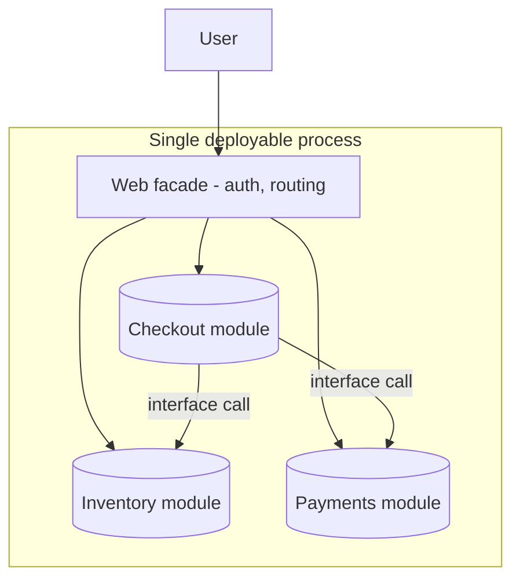

# Modular Monolith

## 1. One-Line Definition
A modular monolith is a single deployable application whose code is divided into strict, independently owned modules — each with its own data ownership and public interface — so you get the monolith's simplicity (one process, one artifact, ACID) with the discipline required to split into microservices later.

## 2. Why Do We Need It?
Plain monoliths decay into "big balls of mud" because nothing enforces where a feature's code may live. Full microservices fix that by machines, but you pay for it every day (network, distributed transactions, ops). A modular monolith is the middle: the *enforcement* of microservices — module boundaries, private data, explicit interfaces — without the *cost* of distribution. It is simultaneously the healthy state for a growing monolith and the best proving ground before a real split.

## 3. Simple Intuition
An apartment building instead of a single open-plan loft. One building (one deployable), but each unit (module) has its own walls, its own locked door (public interface), and its own belongings (data) — you can't walk into your neighbor's closet. Renovate one unit without disturbing the others. Later, if one unit needs to become its own house (a microservice), the walls and door are already there and you mostly just add a network between them.

## 4. What Happens Without It?
Without module discipline you get a monolith where every part reaches into every other: a checkout bug traces into ten packages, schema changes ripple across features, and teams keep colliding in the same files. You then have two bad choices: live with the mud, or skip straight to microservices — where the distributed-systems tax ([[distributed-tracing|Distributed Tracing]], retries, sagas, service discovery) lands on code that was never even boundary-shaped in the first place.

## 5. Core Idea
- **Modules are the unit of ownership, not packages:** one team or feature owns a module, its code, its schema objects, and its outward contract. The module is the unit that could one day become a service.
- **Module boundaries are enforced, not aspirational:** in-process calls still go through a module's public interface; there is no "I'll just call the other module's internal class." Unique package namespaces, no shared internal state, linter/architectural-fit checks, and explicit registration (DI/`build.gradle` modules, Java modules, etc.) harden the rule.
- **Each module owns its data:** strong rule — a module writes only its own tables/schema/collections. Another module reads it through an API, query, or read model, never directly into its tables. This single rule later becomes "database-per-service" almost for free.
- **Module-level autonomy inside one process:** every module can be tested, and ideally versioned and iterated, in relative isolation — but it deploys together (one artifact). You trade per-module deployment for in-process speed.
- **The seam test:** if you can write an integration test that substitutes a module's in-process calls with remote calls without changing the caller, the module is service-ready.
- **Module-to-module calls stay in-process for now:** synchronous method calls through interfaces. Later they may become HTTP/gRPC/messages; the interface is what keeps that swap local.

## 6. Important Terminology

| Term | Simple Meaning |
|------|----------------|
| Module | A feature-sized unit of code with an owner |
| Public interface | The only things other modules may call |
| Module-owned data | Tables/schema only one module may write |
| Seam / boundary | The interface that isolates a module |
| Service-ready module | A module that could ship as a service |
| Architectural fit tests | Linters/tests enforcing boundary rules |
| Shared kernel / common code | The small allowed shared core, or its absence |

## 7. Basic Architecture



## 8. Request or Data Flow
1. Request enters through the shared facade (auth, routing, cross-cutting concerns).
2. The facade calls the owning module's public interface — e.g., `CheckoutModule.placeOrder(...)`.
3. Checkout calls `InventoryModule` and `PaymentsModule` in-process through their public interfaces; each reads/writes only its own tables for the transaction.
4. Because it is one process and one DB, the whole request is still an ACID transaction (see [[transactions-and-acid|Transactions and ACID]]).
5. Later, replacing `PaymentsModule.charge(...)` with a remote call is a swap at the interface — the same seam a split needs.

## 9. Practical Example
**E-commerce at 50 devs / 6 squads (assumptions):** one deployable, but each squad owns a module.
- Modules: `auth`, `catalog`, `cart`, `checkout`, `payments`, `inventory`, `search`, `admin`.
- Each owns its schema area (e.g., `checkout_orders`, `catalog_items`); `checkout` reads catalog via a read model, writes only its own tables.
- One squad can rewrite `search`'s internals and release it together with everyone else — deployment is still all-at-once, but the *code* collision surface has collapsed.
- When `payments` needs independent compliance release cycles, it is extracted first and becomes a real [[microservices|Microservices]] service — the seam already exists.

## 10. Scaling
- **Same scaling story as a monolith:** stateless replicas, one DB for writes, caching and read replicas for reads (see [[horizontal-vs-vertical-scaling|Horizontal vs Vertical Scaling]]).
- **Adding modules neither helps nor hurts runtime scale** — that's the point; scaling is a deployable-level concern until you split.
- **Module extraction = partial scaling:** the hottest, most independent module can be split out as its own deployable (now it scales alone, and its DB slice with it via [[sharding|Sharding]] or a dedicated instance) while the rest of the monolith grows more slowly.
- **Operational catch:** you can't deploy one module — so a single team's hotfix forces a full-artifact release. If teams *need* independent release cadence, that module wants to be a service.

## 11. Reliability and Failure Scenarios

| Failure | What Happens | Detection | Recovery | Trade-off |
|---------|--------------|-----------|----------|-----------|
| Bad module change | Whole artifact affected | Error rate / trace | Roll back one artifact | release coupling |
| Module memory/CPU bug | Process-wide impact | Resource metrics | Scale replicas / fix | no isolation yet |
| In-process call cycles | Deadlock/dependency soup | Architectural tests | Re-route boundary | discipline needed |
| Shared DB schema drift | Module reads break | Schema tests | Feature-versioned migrations | schema ownership |

Reliability signature: still one blast radius (all modules share the process), but the *risk boundary* is now defined — architectural tests can prove no module reaches outside its boundary, which is what makes a future split safe.

## 12. Consistency and Correctness
- **ACID stays intact:** modules run in one process against one DB, so cross-module flows (checkout → inventory → payments) remain a single transaction. This is a *major* reason to prefer a modular monolith over premature microservices.
- Module data ownership gives you a clean unit of correctness: each module is accountable for its own tables, so schema changes are scoped.
- The moment a module is extracted into a real service, that ACID scope breaks and you inherit the distributed-transaction problem (see [[saga-and-strangler|Saga and Strangler Fig]]). The pre-extraction interface should already be written so the module's contract survives the split.

## 13. Performance
- **All module-to-module traffic is in-process:** no serialization, no network hop, no timeout/retry per call. Compare that to microservices where every cross-service call costs ~0.1–1ms plus de/serialization and failure modes.
- Cost of modularity: module boundaries add a little indirection (interface calls, DI) and you pay for the common shared DB contention (analyze via [[bottleneck-identification|Bottleneck Identification]]).
- Read patterns across modules (catalog read by checkout) should use read models/indexes rather than reaching into other modules' tables — which is also what keeps [[database-indexing|Database Indexing]] sane.

## 14. Security
- Auth lives in the shared facade once (see [[authentication-vs-authorization|Authentication vs Authorization]]), and modules trust in-process calls — the same "inside the process" model as a monolith, with the same caveat: one compromised module exposes the process's data.
- Module-owned data gives security a boundary *before* a split: role-based access can be scoped per module's tables, which is the future tenant/per-service isolation baseline.
- When a module becomes a service, "inside the process" trust ends: that service needs its own authN/authZ and network security — do not carry the monolith assumption over (see [[encryption-and-keys|Encryption and Keys]]).

## 15. Trade-Offs

| Choice | Advantages | Disadvantages | When to Use |
|--------|------------|---------------|-------------|
| Plain monolith | Simplest | No boundary enforcement | Small teams/early stage |
| Modular monolith | Boundaries + simplicity + ACID | Discipline required, deploy coupling remains | Growing teams pre-split |
| Microservices | Independent deploy/scale/failure | Distributed complexity & ops cost | Real independent-scale needs |

## 16. Common Mistakes
- **Boundaries on paper only:** modules that quietly import each other's internals — enforce with architectural-fit tests, or it's just a monolith with packages.
- **Sharing the same tables:** two modules writing one schema is how the "database-per-module" rule dies and how a future split strangles.
- **A sprawling shared kernel:** everything ends up in the shared common code, and the boundaries stop dividing anything.
- **Splitting to microservices without the modular step:** you inherit distributed-systems problems with no ready seams — double cost.
- **Keeping the monolith's "one big everything" facade:** modules need private visibility; a single global service locator lets everyone reach everything.

## 17. HLD vs LLD Boundary
HLD: module map and ownership, allowed dependencies between modules, module-owned data boundaries, which modules are service-ready, extraction sequencing. LLD: the interface definitions, DI wiring, package/module declarations, architectural-fit test rules, per-module schema migrations.

## 18. Interview Questions

### Beginner
- What's the difference between a modular monolith and a regular monolith?
- Why might a team choose a modular monolith over going straight to microservices?

### Intermediate
- What rule guarantees a module could later become a microservice?
- How do modules share data without sharing tables?

### Advanced
- A checkout module and inventory module both write the same table. What's broken, and at what point does it become critical?
- Walk the extraction of "payments" from a modular monolith: what changes in code, data, and transaction scope?

## 19. Interview Memory Summary

> [!abstract]- Interview Memory Summary

### Remember

- One deployable, strict module boundaries, module-owned data.
- In-process ACID and speed preserved (no distributed tax yet).
- The seam test: swap in-process call for remote call = service-ready.
- Enforce boundaries with architecture tests, not good intentions.
- Deploy coupling is the one thing you keep by choosing it over microservices.
- It is the recommended step before a real microservices split.

### 30-Second Explanation

A modular monolith is a single deployable whose modules are strict, data-owning units with public interfaces, so features stay decoupled and service-ready while you keep in-process speed and single-DB ACID. Boundaries must be enforced by architecture tests; the one chosen cost is that all modules still ship together — until you extract the ready seams into real services.

### Interview Traps

- Answering "modular monolith" but describing a package-organized monolith (boundaries unenforced = not modular).
- Letting modules share database tables (that's the future split killer).
- Claiming you can deploy a single module — you can't, and that's the trade-off to name, not hide.
- Skipping the modular step and jumping monolith → microservices with no seams.

### Key Trade-Off

You keep the monolith's simplicity, speed, and ACID and add enforceable ownership boundaries — at the price of still deploying everything together and needing the discipline (and architecture tests) to make the boundaries real.

## 20. Related Concepts

### Prerequisites

- [[monolith|Monolith]] — the baseline this improves on.
- [[layered-architecture|Layered / N-Tier Architecture]] — layers organize a single module's internals.
- [[system-design-fundamentals|System Design Fundamentals]]

### Commonly Used Together

- [[transactions-and-acid|Transactions and ACID]] — the cross-module ACID that the single process preserves.
- [[database-keys|Database Keys]] — schema ownership (module-owned tables) is the data rule.
- [[data-patterns|Data Access Patterns]] — read models and read replicas let other modules read without touching tables.

### Alternatives

- [[monolith|Monolith]] — if discipline isn't yet needed, don't add the ceremony.
- [[microservices|Microservices]] — when independent deploy/scale/failure actually matter.

### Advanced Concepts

- [[hexagonal-clean-architecture|Hexagonal and Clean Architecture]] — the interface-inversion pattern for making modules truly seam-based.
- [[saga-and-strangler|Saga and Strangler Fig]] — what happens when a module becomes a service and ACID breaks.

Related planned topics (not authored yet): service-oriented architecture, maintainability.

## 21. References
Simon Brown, "Modular Monoliths" (modularmonolith.com); Fowler, "MonolithFirst"; Fowler/layered-seams discussion on strangler- and seam-based decomposition. Verify with current modulararity references.

## 22. Active Recall

Test yourself before revealing each answer.

> [!question]- What's the difference between a modular monolith and a regular monolith?
> A regular monolith only promises one deployable — coupling can be anywhere. A modular monolith adds enforced module boundaries: each module owns its code and its data and exposes only a public interface, so dependencies are constrained by architecture (checked by tests), not by habit.

> [!question]- What single rule makes a module a plausible future microservice?
> The module owns its data and all external access goes through its public interface — also called the seam. If you can swap the in-process call for a remote call (HTTP/gRPC/message) without changing callers, the module is service-ready; the internal refactor cost is already paid.

> [!question]- How do modules share data without sharing tables?
> Through interfaces and read models, not direct table access. The producing module owns and writes its tables; the consuming module calls the interface or queries a denormalized read model / read replica. If two modules write the same table, the ownership boundary that a future split depends on is already broken.

> [!question]- Why does a modular monolith preserve ACID cross-module transactions?
> Because it's still one process and one database — checkout and inventory and payments run in a single transaction context. The moment a module becomes a real service with its own DB, that atomicity ends and you need a saga, which is exactly why splitting the right seams later is painful by comparison.

> [!question]- What is the one thing a modular monolith definitively does NOT give you?
> Independent deployment. All modules release together because they share one artifact and one pipeline. Teams that need their own release cadence, failure isolation, or scaling must extract those modules to real services — the modular design is what makes that extraction cheap.

> [!question]- How do you enforce module boundaries so they don't rot?
> Architectural-fit or dependency tests: rules that assert module A never references module B's internals, that only facade classes are public, and that table ownership is respected; run them in CI like any test. This changes "modular" from aspiration to a checked property.

> [!question]- Interview scenario: your checkout and inventory modules both update one shared orders table. What's the immediate risk and the future risk?
> Immediate: changes to either module's schema and behavior collide, so both stream wrong reads/writes and tests cross-contaminate. Future: this shared writing means the two modules cannot be split into services without a data migration — the very entanglement modular boundaries exist to prevent. Fix by assigning the table an owner and giving the other module a read model.

> [!question]- What's the strongest argument for picking a modular monolith over microservices for a growing but single-team product?
> Money and time: you get near-microservice code discipline (ownership, seams, data rules) while paying monolith economics — in-process speed, one ACID DB, one pipeline, no distributed tracing/retry/service-discovery tax — and you keep the honest option of extracting ready modules later when scale actually demands it.

## 23. When Should I Use This?

### Use it when

- The team is growing and the monolith's coupling is starting to bite.
- Features form natural, data-owning modules (auth, catalog, checkout).
- You want microservices-era boundaries without the distributed-systems tax yet.
- You plan to split later and want the seams built before you need them.

### Avoid it when

- The app is tiny and ceremony would slow it down.
- Teams genuinely need independent deployment cycles today (extract those to services directly).
- The org can't commit to enforcing boundaries (un-enforced "modules" are just packages).

### What problem does it solve?

The monolith's central decay — unbounded coupling that makes every change cross feature boundaries — by making modules the enforced unit of ownership, so features stay decoupled and service-ready while the system retains one-process simplicity, speed, and single-DB ACID.

### What problem does it NOT solve?

Independent deployment (all modules ship together), independent scaling and failure isolation (one process), and the shared-DB write ceiling (that needs sharding or extraction). It also doesn't prevent mud by itself — unenforced boundaries are the whole failure mode.

## 24. Decision Connections

Decisions that go together with the modular monolith:

- [[monolith|Monolith]] — the baseline it improves without leaving the single-deployable world.
- [[microservices|Microservices]] — the end-state; modular boundaries are the pre-built seams.
- [[layered-architecture|Layered / N-Tier Architecture]] — modules layer internally (presentation/application/domain/persistence).
- [[hexagonal-clean-architecture|Hexagonal and Clean Architecture]] — ports/adapters make module interfaces structurally explicit.
- [[transactions-and-acid|Transactions and ACID]] — the cross-module atomicity preserved in-process.
- [[data-patterns|Data Access Patterns]] — read models and replica reads for module-to-module data sharing.
- [[saga-and-strangler|Saga and Strangler Fig]] — the extraction of service-ready modules into real services.
- [[sharding|Sharding]] — scaling a module's data slice when it becomes its own deployable.

Decision tree:

```
Monolith growing, boundaries blurring?
    |
    +-- Small team, everything in a few heads?
    |      → stay [[monolith|Monolith]], revisit later
    |
    +-- Features are forming natural owners?
    |      → [[modular-monolith|Modular Monolith]]
    |         |
    |         +-- Enforce with architecture tests?   → yes (boundaries are checked or they rot)
    |         +-- Modules share tables?              → no: module-owned data + read models
    |         +-- One module needs own deploy cycle? → extract it [[microservices|Microservices]]
    |
    +-- Independent deploy/scale needed today?
           → [[microservices|Microservices]] directly (with seams from here anyway)
```