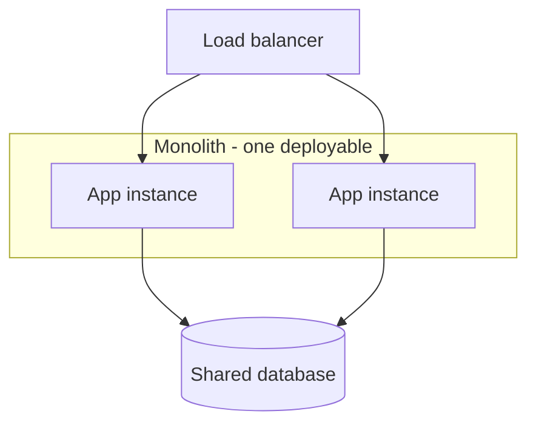

# Monolith

## 1. One-Line Definition
A monolith is an application built and deployed as one single unit — one codebase, one process, one deployable artifact — with all features (UI, business logic, data access) sharing it, even if the code inside is organized into modules or layers.

## 2. Why Do We Need It?
Almost every system should *start* as a monolith. One deployable means one way to build, test, deploy, and reason about the whole system; a single process means calls are in-process (fast), and a single database usually means real ACID transactions across features. For the first years of a product, the monolith is the cheapest structure to be productive in — the entire industry's default for a reason. "Monolith" is not a failure mode; it is the baseline that microservices must beat.

## 3. Simple Intuition
A single large kitchen doing everything: one roof, one sink, one stove, one menu, one shift chart. As long as the crew is small and one person can hold the whole menu in their head, running one kitchen is simpler and faster than maintaining ten. The kitchen becomes a problem only when the menu grows, the crew splits into teams that can't agree, and one stove becomes the bottleneck for everyone.

## 4. What Happens Without It?
Straight to microservices from day one: you pay distributed-system taxes (network calls between services, distributed transactions, service discovery, deployment coordination) *while the app is still small enough to be one process.* Velocity doesn't come early, debugging spans five repos, and the "simple" system is suddenly slow to change. The alternative to a monolith is not "good architecture" — it's a set of new operational problems you haven't earned yet.

## 5. Core Idea
- **One deployable ≠ one mess:** a disciplined monolith is internally structured — modules, packages, [[layered-architecture|Layered / N-Tier Architecture]] boundaries, [[hexagonal-clean-architecture|Hexagonal and Clean Architecture]]-style interfaces. The failure mode "big ball of mud" comes from unchecked coupling, not from being single-process.
- **The economics come from the sharing:**
  - *In-process calls* — no serialization, no network, no timeout/retry on every feature-to-feature interaction.
  - *One database* — a checkout step that touches orders, inventory, and payments can be one [[transactions-and-acid|Transactions and ACID]] transaction.
  - *One pipeline* — build, test, deploy, rollback, observe: a single artifact, a single log stream (with one trace being enough).
- **What a monolith does NOT give you:** independent scaling, independent deployment, fault isolation, or team-scale ownership. When any of those is *required*, you decompose — but decompose first into a [[modular-monolith|Modular Monolith]] and only then to [[microservices|Microservices]].
- **The DB is the monolith's weak spot:** even with modular code, a single shared database eventually couples every feature's schema together — this is usually the real reason a monolith "feels" stuck.

## 6. Important Terminology

| Term | Simple Meaning |
|------|----------------|
| Monolith | One process / one deployable containing all features |
| Big ball of mud | Unstructured monolith with tangled dependencies |
| Modular monolith | Monolith with enforced module boundaries |
| In-process call | Direct method call — no network involved |
| Shared database | One schema coupling all features |
| Deployable unit | The artifact you ship (monolith ships one) |
| Blast radius | A bug/change affecting everything at once |

## 7. Basic Architecture



## 8. Request or Data Flow
1. A request lands on any replica via the load balancer.
2. Inside one process, the controller calls the user module, then the order module, then the payment module — plain method calls with no serialization.
3. All reads/writes go to one database; the request can be wrapped in a single transaction if needed.
4. One log line per logical operation (no cross-service tracing needed yet). Deploy = ship one artifact to all replicas.

## 9. Practical Example
**E-commerce in year 1 (assumptions):** ~100 DAU growing to ~20k, one team of 8, one Postgres.
- Auth, catalog, cart, checkout, payments, admin all live in one process behind one LB and two replicas.
- Checkout legitimately uses one transaction across cart + inventory + orders.
- A deploy is a single `docker build` + rollout; a bug needs one log stream and one trace.
- When growth demands it, checkout is extracted *first* (highest isolation value) as the monolith starts splitting (see [[saga-and-strangler|Saga and Strangler Fig]]).

## 10. Scaling
- **Horizontal scaling is possible and normal:** stateless replicas behind a [[load-balancing|Load Balancer]] (see [[horizontal-vs-vertical-scaling|Horizontal vs Vertical Scaling]] and [[stateless-vs-stateful-services|Stateless vs Stateful Services]]). Many "we outgrew the monolith" stories are really "we never made the monolith stateless" stories.
- **What actually breaks:** the *shared database* — writes and storage hit one node; reads scale via replicas/[[caching|Caching]], writes via [[sharding|Sharding]]. The app process itself bottlenecks only at CPU/thread/memory, fixable with replicas.
- **Deployment velocity breaks at org scale:** hundreds of developers all deploying the same artifact — releases queue, conflicts pile up, and *that* (not performance) is usually why companies decompose.
- **Observability:** one process is actually easier to scale-operate; when it splits, you inherit [[distributed-tracing|Distributed Tracing]] and cross-service debugging costs.

## 11. Reliability and Failure Scenarios

| Failure | What Happens | Detection | Recovery | Trade-off |
|---------|--------------|-----------|----------|-----------|
| One bad deploy | All features go down together | Error rate / golden signals | Rollback one artifact | ship risk concentrated |
| Memory/CPU bomb in one path | Whole process degrades | Latency, resources | Restart / scale replicas | blast radius = whole app |
| DB down | Everything fails (single point) | DB health | Failover to replica | shared fate |
| Slow third-party call | Blocks threads in-process | Latency, saturation | Async / breaker | coordination cost |

The monolith's reliability signature: **no isolation** — one feature's failure can degrade all (every request shares the process), but **simple recovery** — roll one artifact, restart, one codebase to fix.

## 12. Consistency and Correctness
- The monolith's superpower: **ACID is available for free.** Cross-feature flows (orders + inventory + payments) can be one transaction; there is no distributed-transaction problem because there is no distribution (see [[transactions-and-acid|Transactions and ACID]]).
- In-process calls are synchronous and ordered; there is no replication lag between features (see [[replication-lag|Replication Lag]]), no eventual consistency to reason about.
- This is the *strongest* correctness position most businesses ever get — and the main thing you lose when you split.

## 13. Performance
- **In-process calls are sub-microsecond:** no serialization, no network, no timeout. This is a huge, often-understated advantage over microservices (every remote call is ~0.1–1ms+ plus de/serialization).
- **Larger process = more to pay for each allocation/GC/CPU cache:** the whole codebase's hot paths compete in one process.
- One DB means fewer cross-service read amplification problems, but the shared schema can become a contention point (analyze via [[bottleneck-identification|Bottleneck Identification]]).

## 14. Security
- One trust boundary: auth at the edge, then everything inside the process is "inside". Simpler to reason about than N services with N secrets, but a single remote-code-execution bug anywhere in the process exposes everything — no compartmentation.
- The shared DB should use least-privilege roles even in a monolith (defense in depth per [[encryption-and-keys|Encryption and Keys]]).
- When you split, secrets and scopes multiply — the monolith's "everything internal" assumption is not portable to microservices.

## 15. Trade-Offs

| Choice | Advantages | Disadvantages | When to Use |
|--------|------------|---------------|-------------|
| Monolith | Simple deploys, ACID, in-process speed, one codebase | One blast radius, org-scale bottlenecks, shared DB coupling | Start of any product, small/medium teams |
| Modular monolith | Same + enforced boundaries | Requires discipline; doesn't fix deploy coupling | Growing team, before microservices |
| Microservices | Independent deploy/scale/failure | Distributed complexity, cost, ops burden | Real independent-scale or team needs |

## 16. Common Mistakes
- **Microservices from day one** "because we'll need it" — you pay distributed taxes before they pay you back.
- **Calling the monolith "architecture":** a big ball of mud is not layered architecture; structure it (modular) before blaming "the monolith".
- **Hiding state in process memory** and then claiming the monolith can't scale horizontally — keep it [[stateless-vs-stateful-services|Stateless vs Stateful Services]].
- **Sharing one DB even after splitting modules** — modular code with entangled schema is still coupled where it matters.
- **Splitting before isolating the real bottleneck:** if the pain is the shared DB, sharding fix that, not microservices.

## 17. HLD vs LLD Boundary
HLD: monolith vs modular vs microservices decision, module boundaries inside the monolith, DB ownership, when to start extracting. LLD: class/package structure, interfaces between modules, repository code, in-process dependency injection wiring.

## 18. Interview Questions

### Beginner
- What are the concrete advantages of a monolith over microservices?
- Why is "start with a monolith" good advice for most products?

### Intermediate
- The checkout flow touches carts, inventory, and payments. How does a monolith handle that versus microservices?
- Distinguish a monolith from a big ball of mud. What's the difference in structure?

### Advanced
- Your monolith is "slow to ship" because 40 developers deploy one artifact. Is microservices the only answer?
- When you extract a service from a monolith, what makes the *database* the hard part rather than the code?

## 19. Interview Memory Summary

> [!abstract]- Interview Memory Summary

### Remember

- One codebase, one process, one deployable, one pipeline.
- In-process calls: fast, no timeouts; one DB: real ACID.
- It scales horizontally as stateless replicas.
- The monolith's enemies: shared unsharded DB, unmodular code, org-scale deploy coupling.
- Microservices are a *compensation*, not a starting point.
- The migration path: monolith → modular monolith → extracted services.

### 30-Second Explanation

A monolith is one deployable holding all features — cheap to build, test, deploy, and debug, with in-process speed and single-DB ACID, scaling horizontally as stateless replicas. It fails at organizational scale (deploy coupling) and shared-schema rigidity; when that happens, modularize first, then extract services, and remember the database — not the code — is the hard part.

### Interview Traps

- Treating monolith as an insult — the industry default and right choice for years.
- Forgetting it DOES scale horizontally with stateless replicas.
- Claiming ACID/transactions are a microservice feature — they're a monolith feature.
- Telling the "Deploy = one command" story but ignoring the shared-DB coupling that's the real reason monoliths get stuck.

### Key Trade-Off

You get a simple, fast, transactionally strong, easy-to-operate system — at the price of a single blast radius, org-scale deploy coupling, and a shared schema that eventually wants sharding/ownership splits.

## 20. Related Concepts

### Prerequisites

- [[system-design-fundamentals|System Design Fundamentals]]
- [[functional-vs-non-functional-requirements|Functional vs Non-Functional Requirements]]

### Commonly Used Together

- [[layered-architecture|Layered / N-Tier Architecture]] — how the inside of a healthy monolith is organized.
- [[stateless-vs-stateful-services|Stateless vs Stateful Services]] — the condition for scaling replicas.
- [[horizontal-vs-vertical-scaling|Horizontal vs Vertical Scaling]] — how a monolith scale-outs.
- [[transactions-and-acid|Transactions and ACID]] — the correctness superpower of single-process single-DB.

### Alternatives

- [[modular-monolith|Modular Monolith]] — the disciplined upgrade before splitting.
- [[microservices|Microservices]] — the distributed escalation when monolith limits bite.

### Advanced Concepts

- [[saga-and-strangler|Saga and Strangler Fig]] — how you get from monolith to services safely.
- [[sharding|Sharding]] — the DB-side scaling a monolith eventually needs regardless of app structure.

Related planned topics (not authored yet): service-oriented architecture, maintainability, extensibility.

## 21. References
Fowler, "MonolithFirst"; Simon Brown / David Parnas on modularity; Kleppmann DDIA ch. 1 for the single-node baseline. Verify team-size guidance against current references.

## 22. Active Recall

Test yourself before revealing each answer.

> [!question]- What exactly makes something a monolith?
> One deployable unit: one codebase, one process, one artifact shipped by one pipeline. All features share it even if the code inside is cleanly layered or modular. Microservices split that one deployable into many independently shipped processes.

> [!question]- How does a monolith scale, and what blocks it?
> As stateless replicas behind a load balancer — any instance can serve any request. It's blocked by state held in process memory (session, in-memory caches), by a shared DB reaching single-node write/storage limits, and by CPU/thread saturation of the process itself.

> [!question]- A checkout must touch cart, inventory, and payments atomically. How does the monolith handle it?
> One process, one database: the whole flow is one ACID transaction with in-process calls — no network, no distributed transaction, no saga. This is the strongest correctness position most systems ever get and it is exactly what you lose when you split into services.

> [!question]- Monolith vs big ball of mud: what's the real difference?
> Structure. A well-kept monolith has enforced boundaries — layers, modules, interfaces, single homes for concerns. A big ball of mud is tangled code where every module reaches into every other. The fix is modularization, not necessarily a microservices rewrite.

> [!question]- 40 developers deploy one artifact and releases queue. Is microservices the only answer?
> No. First increase deploy frequency via CI/CD and feature flags; modularize so teams change parallel areas. Microservices genuinely help when teams need independent machines, deployment cadence, or failure isolation — not merely to stop stepping on each other in one repo. Modular monolith covers many "team contention" cases more cheaply.

> [!question]- Interview scenario: you're extracting checkout as the first microservice from a working monolith. What's the hard part?
> The database. Checkout's tables are entangled with orders, carts, and payments in one schema — extracting the code is easy; giving checkout its own database ownership without breaking cross-feature transactions is the real surgery (the [[data-patterns|Data Access Patterns]] and shared-schema questions are where it gets hard).

> [!question]- When is a monolith genuinely the wrong choice from day one?
> When independent teams must deploy separate workloads on independent cycles, when a sub-system has extreme or spiky resource needs the whole process would inherit, or when the org is already large enough that a single codebase is impossible to reason about. Even then, most teams start monolithic and split early features out.

> [!question]- What is the monolith's single biggest long-term cost?
> The shared database's coupling: every feature's schema evolution, migration, and load interacts with everyone else's, and writes cap at one node. This coupling is the real "I can't scale" story behind most monolith-to-microservices migrations.

## 23. When Should I Use This?

### Use it when

- Building anything new that isn't a trivial script — start here.
- The team is small enough that one codebase is sharedable and one pipeline is a blessing.
- Feature-to-feature flows need transactional integrity.
- You want the cheapest possible build/test/debug/operate loop.

### Avoid it when

- Several teams must ship on genuinely independent cycles (deploy coupling is killing velocity).
- One feature has extreme, spiky resource isolation needs.
- The org is large enough that a single codebase can't be held in any one mind.
- You have real, demonstrated independent-scaling requirements (not hypotheticals).

### What problem does it solve?

It's the baseline architecture that minimizes early cost: one artifact to build, test, deploy and roll back; in-process calls without network taxes; one database so cross-feature transactions actually work — the fastest structure for discovering what a product even needs.

### What problem does it NOT solve?

Organizational velocity at scale (deploy coupling of many teams), independent failure isolation (one process = one blast radius), independent scaling of hot sub-systems against the whole, and shared-database write/storage ceilings — those are the problems decomposition to [[modular-monolith|Modular Monolith]] then [[microservices|Microservices]] exists to address.

## 24. Decision Connections

Decisions that go together with the monolith:

- [[layered-architecture|Layered / N-Tier Architecture]] — the internal structure that keeps a monolith healthy.
- [[transactions-and-acid|Transactions and ACID]] — the single-process, single-DB correctness that makes the monolith attractive.
- [[stateless-vs-stateful-services|Stateless vs Stateful Services]] — the prerequisite for scaling monolith replicas.
- [[horizontal-vs-vertical-scaling|Horizontal vs Vertical Scaling]] — how the monolith first grows vertically, then horizontally.
- [[caching|Caching]] — inside one process (local) or in front of one DB, before any split.
- [[sharding|Sharding]] — the DB-side answer when the monolith's shared database is the bottleneck.
- [[modular-monolith|Modular Monolith]] — the disciplined internal structure that delays the microservices tax.
- [[microservices|Microservices]] — the distributed end-state when monolith limits are truly hit.
- [[saga-and-strangler|Saga and Strangler Fig]] — the migration technique when you start cutting services out.

Decision tree:

```
New system, build it as?
    |
    +-- Tiny, throwaway, or prototype?
    |      → flat script, no ceremony
    |
    +-- Real product, single team?
    |      → [[monolith|Monolith]]
    |         |
    |         +-- Team grows, boundaries blur?  → [[modular-monolith|Modular Monolith]] first
    |         +-- Can't scale replicas?         → make it [[stateless-vs-stateful-services|Stateless vs Stateful Services]]
    |         +-- DB is the ceiling?            → [[sharding|Sharding]]
    |
    +-- Many teams need independent deploy/scale?
           → [[microservices|Microservices]] via [[saga-and-strangler|Saga and Strangler Fig]]
```