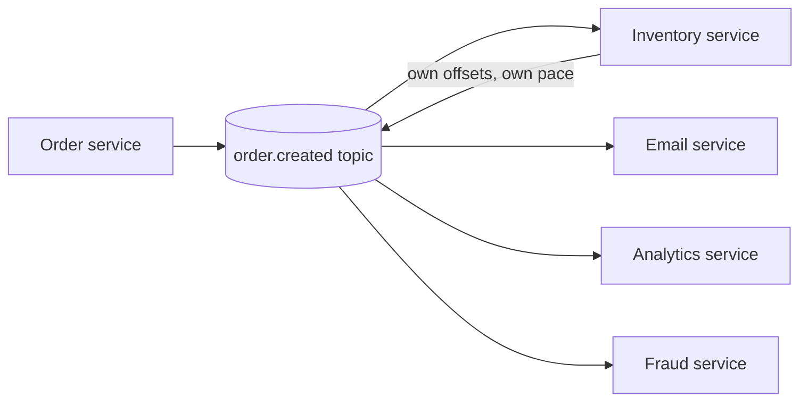

# Publisher-Subscriber Pattern

## 1. One-Line Definition
The publisher-subscriber (pub/sub) pattern decouples systems by having *publishers* emit events to a *topic* (the shared channel) and *subscribers* register to receive copies — so neither side knows or cares about the other, and the topic (not the code) is the contract between them.

## 2. Why Do We Need It?
As an *architectural* pattern, pub/sub solves the "one event, many interested parties" problem at system scale: order created matters to inventory, email, analytics, search, fraud, loyalty. The synchronous alternative — the order service calling each one — re-couples everything in time, load, and code: every consumer must be up and fast when the call happens, and adding a consumer means changing the producer. Pub/sub inverts the dependency: producers publish once and are done; subscribers subscribe independently, consume at their own pace, scale on their own curve, and join without the producer changing a line.

## 3. Simple Intuition
A radio station: the station (publisher) broadcasts once to the airwaves (topic). Every tuned radio (subscriber) receives the program independently. Listeners don't tell the station their address; the station neither tracks nor waits for any listener, and a listener who tunes in late simply listens from then on (or replays if the station records the broadcast — a durable topic).

## 4. What Happens Without It?
Without a pub/sub backbone, "everyone cares about this" is hand-coded fan-out in the producer: N synchronous calls, each a failure point; the slowest consumer sets the producer's latency; a consumer that's down blocks the whole call; adding consumer N+1 means a producer redeploy; and each caller's error handling re-implements the same fragile list. The producer becomes the hub of a spiderweb whose strands all lead back to it.

## 5. Core Idea
This file is the **architecture-pattern view** of pub/sub. For the messaging mechanics (topics, offsets, consumer groups, delivery modes) see [[publish-subscribe|Publish/Subscribe]]; here we focus on how and where you *place* the pattern in a system.

- **Topology — the topic is the center of the star:** publishers and subscribers connect only to topics; they never hold each other's references. Topics carry a named event type (`order.created`); every subscriber of that topic receives every (matching) event.
- **The contract is the event, not the service:** the schema/shape of the event is the interface between teams. Version it, register it, and treat its evolution as an API change (schema registry — planned in 11) — not as an internal detail.
- **Producer and consumer are decoupled in three axes:**
  - *Time:* producer doesn't wait for consumer; consumer may consume later (durable subscription).
  - *Load:* producer doesn't do the consumers' work; consumers scale independently.
  - *Lifecycle:* a consumer can be added, removed, or rewritten without touching the producer.
- **Delivery is at-least-once, ordering is per-key/partition:** retries duplicate; consumers must be idempotent; order is guaranteed only per partition key (see [[delivery-semantics|Delivery Semantics]] and [[kafka-ordering|Kafka Ordering]]). Design event *contracts* that tolerate this.
- **Durability is a subscription-level decision:** durable subscriptions keep offsets and replay after downtime; non-durable (rare in production systems) miss while offline.
- **Where the pattern fits in the style zoo:** pub/sub is the *transport layer* of [[event-driven-architecture|Event-Driven Architecture]] (which adds event *facts* in the past tense, choreography/orchestration, and correctness tooling like the [[outbox-pattern|Outbox Pattern]]). It is also the mechanism underneath [[fanout-and-aggregation|Fan-Out / Fan-In / Scatter-Gather]] when the fan-out is event-driven. It is *not* a job/point-to-point queue (see [[message-queue|Message Queue]] for the difference).

## 6. Important Terminology

| Term | Simple Meaning |
|------|----------------|
| Publisher | Emits events; knows only the topic |
| Topic / channel | The named broadcast tube (the contract) |
| Subscriber | Receives a copy of every event on the topic |
| Durable subscription | Retains position; replay after downtime |
| Consumer group | Subscriber instances sharing a topic's load |
| Event contract | The versioned schema of the event on the topic |
| Fan-out | One event → many independent subscribers |
| At-least-once | Delivery may duplicate; idempotency required |
| Per-key ordering | Order guaranteed within a partition/key only |
| Schema registry | The service that validates/versiones event shapes (planned) |

## 7. Basic Architecture



## 8. Request or Data Flow
1. A user action completes in the order service; it writes its database and emits `order.created` — atomically via the outbox pattern so the event is never lost or phantomed.
2. The topic retains and fans the event out (durable, at-least-once).
3. Each subscriber consumes independently: inventory decrements stock, email sends, analytics records, fraud scores — each on its own offset.
4. A service added later simply subscribes to the same topic; the producer never changes.
5. The slowest subscriber lags without throttling the others — lag is their own dashboard (see [[consumer-lag|Consumer Lag]]).

## 9. Practical Example
**E-commerce checkout (assumptions):** 5k orders/sec peak; 8 downstream teams need the data.
- Topic contracts: `order.placed` (with buyer, totals, items), `payment.authorized`, `payment.failed`, `shipment.delivered`.
- Subscribers: fraud checker on `order.placed`; email on `payment.authorized` + `shipment.delivered`; loyalty on `payment.authorized`; search/recommendation/analytics on a slimmed `order.placed`.
- A ninth team joins by writing one subscription — zero producer changes, zero shared deploy.
- If search lags for an hour, checkout is unaffected; search autoscales its own group.

## 10. Scaling
- **Subscribers scale independently, per group:** each subscription's consumer group splits the topic's partitions across its own members; parallelism is bounded by partition count (see [[kafka-producers-consumers|Kafka Producers and Consumers]]).
- **Topics scale by partitioning** — each partition is an independent ordered sequence; pick partition keys by what needs ordering (order id, tenant) — see [[kafka-ordering|Kafka Ordering]].
- **Fan-out amplification is the tax:** payload size × subscriber count; keep events small/carried-state-light or oversized fan-out pins the bus and storage (see [[kafka-retention|Kafka Retention]]).
- **Backpressure is a subscription-local signal:** lag grows per group; you scale that group or accept lag — the bus never pushes back to producers (see [[consumer-lag|Consumer Lag]]).

## 11. Reliability and Failure Scenarios

| Failure | What Happens | Detection | Recovery | Trade-off |
|---------|--------------|-----------|----------|-----------|
| Subscriber down for an hour | Its events queue (durable) | Lag metric | Catch up from offset on restart | retention window |
| Producer crashes mid-write | Event possibly lost | App alerts | Outbox relay re-publishes | at-least-once |
| Broker down | No delivery fleet-wide | Broker health | Replica failover, redelivery | replication cost |
| Poison event | One subscriber stuck | Lag + DLQ | Dead-letter + alert the sender | manual fix |
| Duplicate event | Idempotent consumers absorb | Replay bumps | Dedup by event id on consumption | exactly-once cost |
| Topic retention expires | Old events unrecoverable | — | Extend/warm storage | storage cost |

## 12. Consistency and Correctness
- **At-least-once ⇒ idempotent consumers** — publish dedup + consume dedup (by event id / business key) is the correctness non-negotiable (see [[delivery-semantics|Delivery Semantics]]).
- **Ordering is per-partition/per-key only** — no global order exists; events that must arrive in order share a key (and thus a partition).
- **Source atomicity:** state write + emit must be one transaction — the [[outbox-pattern|Outbox Pattern]] is the standard answer.
- **Event contracts are backward-compatible by rule:** additive-only changes; consumers tolerate unknown fields; breaking changes arrive as a new topic version.

## 13. Performance
- **Publish cost:** one append + replica ack to the broker (~low ms); the producer is done.
- **Consume cost:** per-subscription reads of its partitions; total system cost = payload × (subscribers + retention) — amplification is the main lever.
- **Batch/poll** consumers to amortize (see [[kafka-architecture|Kafka Architecture]]); avoid one grossly hot partition (a single busy key) capping that partition's parallelism.

## 14. Security
- **Topic ACLs:** separate write permission (publishers) from read permission (subscribers) — per-team least privilege (see [[authentication-vs-authorization|Authentication vs Authorization]]).
- **Contracts across trust boundaries:** validate at the edge, schema-register, and redact — don't let one team's payload poison another's consumer (see [[web-vulnerabilities|Web Vulnerabilities]]).
- **Retention is a compliance decision:** PII in event streams is permanent unless you scope retention/encryption deliberately (see [[encryption-and-keys|Encryption and Keys]]); a "cheap fan-out" is not an excuse to log every sensitive field.

## 15. Trade-Offs

| Choice | Advantages | Disadvantages | When to Use |
|--------|------------|---------------|-------------|
| Direct sync calls | Simple, truly ordered | Coupled; fan-out at caller | Small scale, one consumer |
| Point-to-point queue | Work-per-message | No multi-consumer | Jobs, commands |
| Pub/sub | Independent fan-out | Per-key order, eventual, retention cost | Multi-consumer events |
| Durable subscriptions | Catch-up after downtime | Retention/storage cost | Production consumers |
| Non-durable | Cheap | Misses while offline | Telemetry, test envs |

## 16. Common Mistakes
- **Treating the topic as a dump-and-forget:** no versioned event contract means one team's change breaks every subscriber.
- **One consumer group across unrelated workloads** — they split partitions and starve each other.
- **Assuming global ordering or exactly-once** from a "reliable topic."
- **Fat payloads to everyone** — amplification death; slim the event and let heavy consumers fetch the detail.
- **Synchronous expectations on a fire-and-forget channel** — pub/sub never returns a result.
- **No schema registry / no validation** — malformed events become poison events for every subscriber.

## 17. HLD vs LLD Boundary
HLD: topic topology (which events, which subscribers), event contracts/versioning, durability/retention policy, delivery semantics, per-subscription scaling and SLOs, gateway security at the bus. LLD: publisher/subscriber code, serializer + schema wiring, idempotency/dedup keys, ack/retry/DLQ handling inside one service.

## 18. Interview Questions

### Beginner
- What is the difference between a queue (point-to-point) and a topic (pub/sub)?
- Why is a slow subscriber not allowed to slow the producer?

### Intermediate
- The order service must reach 8 subscribers. Walk the design of the topic(s), event contract, and durability assumptions.
- How does Kafka's consumer group make a topic behave like pub/sub *and* like a work queue?

### Advanced
- Design an event backbone where three teams need the same facts but with different ordering and retention requirements — where do you put more partitions vs more topics?
- A schema change breaks six subscribers. How does the contract-first design have prevented it, and how do you recover?

## 19. Interview Memory Summary

> [!abstract]- Interview Memory Summary

### Remember

- The topic is the center of the star and the contract between teams.
- Publishers never know subscribers; subscribers join with zero producer changes.
- Decoupled in time, load, and lifecycle.
- Delivery is at-least-once: idempotent consumers, dedup by event id.
- Ordering is per-partition/per-key only; never global.
- Source atomicity via the [[outbox-pattern|Outbox Pattern]].
- Versioned event contracts + schema registry; fat payloads = amplification tax.
- It's the transport of [[event-driven-architecture|Event-Driven Architecture]].

### 30-Second Explanation

Pub/sub centers a system on topics: publishers emit events to a topic, subscribers register and receive copies, decoupled in time, load, and lifecycle — the event contract, not the services, is the interface. Correctness rides on at-least-once + idempotent consumers, per-key ordering, the outbox for atomic publication, and versioned contracts. It is the transport layer of event-driven architecture and the sibling of (not replacement for) the point-to-point queue.

### Interview Traps

- Confusing topics (everyone gets a copy) with queues (one worker gets each message).
- Claiming global ordering or exactly-once from a topic.
- Treating event schema as internal — it's an API.
- Building a "pub/sub" that is still a list of synchronous HTTP calls in the producer.
- Forgetting idempotency and the outbox when claiming reliability.

### Key Trade-Off

You buy genuinely independent fan-out and per-subscriber autonomy — at the cost of at-least-once/fire-and-forget semantics, per-partition-only ordering, retention/storage costs, and the contract management (versioning, schema) that now sits between every pair of teams.

## 20. Related Concepts

### Prerequisites

- [[message-queue|Message Queue]] — pub/sub is a delivery mode over the same broker primitive.
- [[publish-subscribe|Publish/Subscribe]] — the messaging-mechanics companion to this file.
- [[http-and-https|HTTP and HTTPS]] — the synchronous alternative this pattern replaces.

### Commonly Used Together

- [[event-driven-architecture|Event-Driven Architecture]] — pub/sub is its transport layer.
- [[delivery-semantics|Delivery Semantics]] — the at-least-once contract every subscription assumes.
- [[consumer-lag|Consumer Lag]] — the per-subscription health/scaling metric.
- [[outbox-pattern|Outbox Pattern]] — atomic publish from the producer's state change.
- [[kafka-architecture|Kafka Architecture]] — the concrete backbone at scale (partitions + groups).
- [[kafka-ordering|Kafka Ordering]] — the partition-key discipline behind per-key ordering.

### Alternatives

- [[message-queue|Message Queue]] — point-to-point when exactly one handler per message is the contract.
- [[http-and-https|HTTP and HTTPS]] — synchronous direct calls when you need a result and one consumer.

### Advanced Concepts

- [[fanout-and-aggregation|Fan-Out / Fan-In / Scatter-Gather]] — where event fan-out turns into request/response aggregation.
- [[data-patterns|Data Access Patterns]] — pub/sub as the derivation source for read models.
- [[resilience-patterns|Resilience Patterns (Catalog)]] — poison/DLQ handling and delivery resilience around the subscription.

Related planned topics (not authored yet): producer/consumer deep-dive, delivery-and-retry (ack/DLQ), schema registry, idempotent consumer.

## 21. References
Kleppmann DDIA ch. 11 (stream processing, topics/partitions); broker docs (Kafka, RabbitMQ exchanges, GCP Pub/Sub); Fowler on event-driven; Azure event-driven architecture guide. Verify current broker feature sets and retention defaults before interviews.

## 22. Active Recall

Test yourself before revealing each answer.

> [!question]- Queue vs topic: what's the essential difference in delivery?
> A queue delivers each message to exactly one consumer in a group (work sharing — "whoever's free"). A topic delivers every message to every subscriber (broadcast — each subscriber gets a copy). Kafka models both: a topic is pub/sub, and consumer groups make the same topic act point-to-point *within* each group.

> [!question]- Why can a slow subscriber never slow the producer in pub/sub?
> Because each subscriber tracks its own position (durable offset) independent of everyone else's, and the producer only waits for the broker's ack — not for any consumer's progress. The slow subscriber lags on its own consumer-lag dashboard and scales its own group; nobody else's latency or throughput depends on it.

> [!question]- How does a consumer group turn a topic into both pub/sub and a work-sharing queue?
> A consumer group partitions the topic: members split the partitions among themselves, so the group divides the load (work sharing), while other groups still each receive their own full copy of the stream (pub/sub). Parallelism is bounded by partition count — more members than partitions adds no throughput.

> [!question]- The order service must reach 8 subscribers. Walk topic, contract, and durability.
> One topic `order.placed` with a versioned event contract (buyer, totals, items). The producer publishes atomically with its DB via the outbox; delivery is at-least-once so the contract says consumers must be idempotent. Each subscriber uses its own consumer group/durable offsets so downtime is catch-up, lag is per-subscriber, and a 9th team subscribes without touching the producer.

> [!question]- Why is "the topic has global ordering" a false promise?
> Order within a topic is only guaranteed per partition, because each partition is an ordered append read by one consumer; across partitions there is no total order. Events that must stay ordered share a key so they land in one partition; anything claiming global order across the whole topic is over-promising the broker's contract.

> [!question]- A schema change broke six subscribers. How should the contract-first design have prevented it, and how do you recover mid-disaster?
> The event contract is versioned and validated by a schema registry; changes are additive-only and backward-compatible, breaking changes come as a new topic version with coordinated consumer migration. Mid-disaster recovery: pin consumers to the last good contract version, quarantine the breaking events (DLQ), roll the producer back or publish both versions, then migrate subscribers in lock-step before cutting over.

> [!question]- Interview scenario: three teams need the same facts but with different ordering and retention needs. More partitions or more topics?
> Decouple by *purpose*, not by volume: one canonical topic per *fact* (order.placed) with per-key ordering, then dedicated subscription-shaped topics (or filtered projections) per downstream need with their own retention. Partitions give parallelism and per-key order — add them where throughput/ordering demands; extra topics are where contract, retention, and access-control boundaries differ. Combining both is normal and expected.

> [!question]- When should you NOT use pub/sub?
> When a request needs a synchronous result (pub/sub is fire-and-forget by definition), when exactly one handler must process each message (use a point-to-point queue), when strict global ordering is unavoidable, when fan-out costs (payload × subscribers × retention) exceed the value, or when a single direct call is still fast and simple.

## 23. When Should I Use This?

### Use it when

- One event matters to many independent consumers (inventory + email + analytics + fraud).
- Consumers must scale and ship on different cadences.
- New teams should attach to existing facts without producer changes.
- Durable catch-up after downtime is a requirement.
- You're building on [[event-driven-architecture|Event-Driven Architecture]] and need the transport.

### Avoid it when

- Exactly one handler must process each message (use a [[message-queue|Message Queue]] point-to-point).
- A synchronous result is required — pub/sub never returns one.
- Store global ordering is a hard constraint.
- Payloads are huge and fan-out count high (amplification tax dominates); slim events instead.
- Direct calls still fit the scale — pub/sub is infrastructure with a contract to manage.

### What problem does it solve?

The hand-coded fan-out trap: N consumers requiring N synchronous calls from the producer — coupled in time, load, and lifecycle, with adding consumers meaning producer changes and the slowest consumer setting producer latency. Pub/sub pushes the fan-out into a topic; producers publish once; consumers self-register and self-scale.

### What problem does it NOT solve?

No global ordering (per-partition only), no synchronous result, no exactly-once (at-least-once + idempotency), no protection against amplification, and no contract management-for-free — the event schema, versioning, and registry are now a real responsibility between every pair of teams.

## 24. Decision Connections

Decisions that go together with the pub/sub pattern:

- [[publish-subscribe|Publish/Subscribe]] — the messaging-mechanics twin: offsets, groups, durability.
- [[event-driven-architecture|Event-Driven Architecture]] — pub/sub as its transport; events as past-tense facts.
- [[message-queue|Message Queue]] — queue vs topic choice per event contract.
- [[delivery-semantics|Delivery Semantics]] — the contract under which events duplicate/drop.
- [[outbox-pattern|Outbox Pattern]] — atomic publication from the producer's state write.
- [[consumer-lag|Consumer Lag]] — the per-subscription scaling/health signal.
- [[kafka-architecture|Kafka Architecture]] — the partitioned backbone that realizes topics at scale.
- [[kafka-ordering|Kafka Ordering]] — how partition keys define the only ordering you can promise.
- [[fanout-and-aggregation|Fan-Out / Fan-In / Scatter-Gather]] — when a fan-out needs to come *back* to a result.

Decision tree:

```
One event, many interested services?
    |
    +-- Exactly one handler must process it?
    |      → point-to-point [[message-queue|Message Queue]]
    |
    +-- Every subscriber needs a copy, async?
    |      → Publisher-Subscriber Pattern
    |         |
    |         +-- Event schema?               → versioned contract + schema registry (planned)
    |         +-- Atomic publish with state?  → [[outbox-pattern|Outbox Pattern]]
    |         +-- Dup/drop tolerance?         → [[delivery-semantics|Delivery Semantics]] + idempotent consumers
    |         +-- Order must hold?            → partition by key ([[kafka-ordering|Kafka Ordering]])
    |         +-- Consumer health?            → [[consumer-lag|Consumer Lag]]
    |
    +-- Synchronous result needed?
           → direct call ([[http-and-https|HTTP and HTTPS]]) or scatter-gather
```