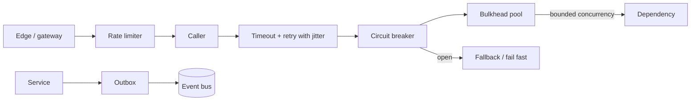

# Resilience Patterns (Catalog)

## 1. One-Line Definition
Resilience patterns are the repeatable techniques a system uses to keep serving when its dependencies are slow, failing, or overloaded — retry with backoff, timeouts, circuit breakers, rate limiting, bulkheads, load shedding, and reliable messaging — each protecting a specific failure mode, together forming the distributed-system safety kit.

## 2. Why Do We Need It?
In a distributed system, every call can hang for its full timeout, fail, or be silently slow, and a single overloaded dependency can cascade into an outage that takes out *all* of its callers. Availability is only as good as the weakest dependency (see [[availability|Availability]] and [[reliability|Reliability]]). Resilience patterns are small, proven counter-measures that bound the damage: fail fast instead of hanging, back off instead of hammering, isolate instead of sharing fate, and never let a lookup or a message become a stuck thread. They are cheap to add and catastrophic to omit.

## 3. Simple Intuition
A support hotline with rules for chaos: instead of letting every frustrated caller redirect to a dead IVR line forever, you limit how long anyone waits (timeout), let the caller try again politely with backoff (retry), hang up fast once the line proves broken (circuit breaker), cap how many people can call the same broken extension (rate limit), give each VIP product line its own operators (bulkhead), and when the whole switchboard is overwhelmed, refuse new calls and keep the critical lines on a best-effort basis (load shedding).

## 4. What Happens Without It?
One slow downstream service becomes an *everywhere* outage: every caller waits full timeouts, retries multiply traffic, thread pools fill, queues back up, memory climbs, and each caller's failure re-triggers more retries — a cascade that persists even after the dependency recovers. Event pipelines silently drop or duplicate message processing. A single spike floods the system because nothing said "no" at the edge. The classic single-point-of-failure cascading-down-stream failure mode.

## 5. Core Idea
This file is a **catalog** — each pattern has its own concept file. Learn them in the following mental layers, and combine them in the order below.

- **Prevent the call from being wasted (per-call protection):**
  - *[[retry-and-timeout|Retry and Timeout]]* — bound how long you wait and how hard you retry, with exponential backoff and jitter; retries are for *blips*.
  - Selected wrong retry strategy → retry storms (see the failure-mode table).
- **Stop trying a broken dependency (aggregate/historical protection):**
  - *[[circuit-breaker|Circuit Breaker]]* — after a threshold of failures/slow calls, fail fast without attempting; probe occasionally in half-open to detect recovery. Retries are for blips; breakers are for outages.
  - *[[rate-limiter|Rate Limiter]]* — enforce maximum request rates (yours, a dependency's, a client's) at the edge to protect from floods and honor degradation.
- **Confine the blast radius (structural isolation):**
  - *Bulkhead* (planned: `bulkhead`) — split thread pools/connection pools/queues per dependency or tenant so one saturated dependency doesn't starve the rest; think compartments in a ship.
  - *Load shedding / fail-fast / fallback* (planned: `load-shedding`) — when the system itself is over capacity, drop non-critical work, fail fast on rejections, serve degraded/cached fallbacks, and signal backpressure.
- **Make data-path failures invisible (correctness-as-resilience):**
  - *[[outbox-pattern|Outbox Pattern]]* — atomic dual-write so a state change and its event never disagree (a "resilient messaging" primitive), and
  - *idempotency* (planned: `idempotent-retry`) — so retries and redeliveries are safe.
- **Backstop everything (failure detection and recovery):**
  - *Health checks / heartbeats* (planned: `heartbeat-health-checks`) — let the scheduler/LB eject dead nodes.
  - *[[failover|Failover]]* and *[[standby-models|Standby Models]]* — move traffic to healthy nodes/regions when a node fails wholesale.
  - *[[disaster-recovery|Disaster Recovery]]* / *RPO-RTO* — the worst-case, site-level backstop.
  - chaos engineering (planned) to prove the kit actually works before production forces the exam.

**The composition rule:** timeout < retry (bounded) < circuit breaker < bulkhead + load shedding + fallback. Each pattern answers one question; layer them in exactly that order as you move up the dependency stack. A retry underneath a circuit breaker that is open is the classic contradiction to point out in interviews.

## 6. Important Terminology

| Term | Simple Meaning |
|------|----------------|
| Timeout | Max time you wait for one call |
| Retry / backoff / jitter | Re-attempt with growing delay + randomness |
| Circuit breaker | Fail-fast switch after failure threshold |
| Rate limiter | Caps requests per window |
| Bulkhead | Per-dependency capacity isolation (planned) |
| Load shedding | Dropping work when over capacity (planned) |
| Fallback | Serving a stale/cached/simpler answer |
| Backpressure | Signaling "I'm full" to upstream |
| Outbox | Atomic state + event publication |
| Idempotency | Safe duplication: same effect on reruns |
| Failover | Moving traffic to a healthy node/region |

## 7. Basic Architecture



## 8. Request or Data Flow
1. A request enters; the edge rate limiter either admits it or rejects with a clean response (fail fast).
2. The caller enforces a timeout and a bounded retry policy with backoff + jitter — retrying transient blips only.
3. The circuit breaker observes the aggregated failure/slow-call rate; once tripped, calls fail fast with a fallback.
4. Bulkhead isolates that dependency's pool, so its saturation cannot consume the caller's other capacities.
5. If the whole service is over capacity, load shedding drops non-critical work and signals backpressure.
6. Meanwhile, state changes flow out through the outbox so events survive, and health checks/failover eject dead nodes.

## 9. Practical Example
**Orders service depending on payments (assumptions):** P99 40ms, SLA 99.95%.
- Timeout 200ms; retry once with 50ms + jitter; breaker trips at 50% failures over a 10-request window, cooldown 30s, half-open allows 3 probes.
- During a payments incident, the breaker opens in ~10 seconds: callers fail fast with a "payment pending" fallback instead of having thousands of threads blocked in 200ms timeouts.
- A 100x flash-sale spike is met at the gateway by rate limiting + load shedding; the bulkhead on payments-call threads means catalog reads keep their SLO untouched.
- Result: payments outage costs a *feature*, not a platform — the difference between 5% of orders failing and 100% of traffic falling over.

## 10. Scaling
- **Patterns themselves must scale:** a breaker/rate-limiter state that is per-process needs sharding for a fleet (distributed rate limiter planned in 18); choose hard-limits at the edge (scales statelessly behind a [[load-balancing|Load Balancer]]) vs soft per-instance limits inside.
- **More replicas = more concurrent retries:** a fleet-wide retry storm multiplies by replica count — global jitter, per-token budgets, and (planned) idempotency keys are what keep N replicas from multiplying failure.
- **Scale-out interacts with bulkheads:** pools are per-instance; more replicas add total isolation capacity, which is exactly why bulkhead + autoscaling compose.
- **Messaging resilience at scale*:* the outbox/consumer-lag view: durable queues normalize spikes (see [[message-queue|Message Queue]], [[consumer-lag|Consumer Lag]]).

## 11. Reliability and Failure Scenarios

| Pattern | Protects against | Failure mode if omitted | Also watch |
|---------|------------------|--------------------------|------------|
| [[retry-and-timeout|Retry and Timeout]] | Transient blips | Hang forever on slow/lost calls | Too much retry = storm |
| [[circuit-breaker|Circuit Breaker]] | Persistently broken deps | Failed calls consume all caller resources | Trips must not mask keying decisions |
| [[rate-limiter|Rate Limiter]] | Floods, abusive clients | Exhaustion under spike | Don't rate-limit your own health checks |
| Bulkhead (planned) | One dep saturating the rest | Shared pool exhausted by one tenant/dep | Right-sized partitions |
| Load shedding (planned) | Over-capacity meltdown | Cascade when overloaded | Which work is "safe to drop" |
| [[outbox-pattern|Outbox Pattern]] | Lost/phantom events | Silent DB-bus divergence | Outbox table growth |
| [[failover|Failover]] | Node death | Single-node outages | Split-brain risk |
| [[disaster-recovery|Disaster Recovery]] | Site loss | RPO/RTO violated | Rehearsals |

The discipline: every pattern also has a *false-positive* cost. Breakers trip on healthy systems (tune thresholds + minimum calls); rate limiters reject legit spike traffic (accept it or scale); failover can split brain (see [[standby-models|Standby Models]]). Resilience engineering is tuning the trade-off.

## 12. Consistency and Correctness
- Resilience and correctness join at **idempotency**: retries, redeliveries, and failover all replay operations, so every write must tolerate duplication (see [[delivery-semantics|Delivery Semantics]]). The outbox is the source-side guarantee; idempotent consumers/sinks close the sink-side.
- **Breakers and caches change what the caller sees:** an open breaker serving a fallback means the caller gets degraded/possibly stale data — stale-vs-blocked is a *correctness contract decision* the caller and dependency must agree on.
- Load shedding must drop *idempotent/retryable* work preferentially so lost requests are cheap to replay; never shed a request whose side effect can't be reconstructed.

## 13. Performance
- **Latency cost:** a timeout bounds the tail (instead of unbounded waits) — the pattern's whole purpose. A 200ms timeout replaced thousands of 30s blocked threads with 200ms P99 failures.
- **Throughput cost:** retries multiply load (2x), breakers reduce it (0 calls while open); rate limiting caps it. The net is far better than unpatterned collapse, but always budget burst headroom.
- **Operational overhead is near zero** in libraries (resilience4j, Polly, circuitbreaker/instrumentation), the real cost is tuning and monitoring — each pattern needs a metric (trip rate, retry rate, shed rate, reject rate) on the [[golden-signals|Golden Signals]] dashboard.

## 14. Security
- Rate limiting is a security control too: mitigation for abusive clients and DDoS-like floods at the edge (see [[rate-limiter|Rate Limiter]] and [[web-vulnerabilities|Web Vulnerabilities]]).
- Fallbacks must not leak: serving a cached/default answer to the wrong caller leaks other tenants' data — scope fallbacks and log who got what.
- Retries and circuit-breaker state carry no secrets on their own, but their logs/metrics can leak PII if payloads are sampled — keep telemetry payload-free (see [[encryption-and-keys|Encryption and Keys]] and [[observability|Observability]]).

## 15. Trade-Offs

| Pattern | Gain | Cost | Risk when mis-tuned |
|---------|------|------|---------------------|
| Timeout | Bounded tail latency | Timeout too short cuts slow-but-fine calls | False failures |
| Retry+backoff+jitter | Survives blips | Extra load; ordering effects | Retry storms |
| Circuit breaker | Fail-fast containment | Trips on genuine spikes unless tuned | False opens |
| Rate limiter | Edge protection | Legit traffic rejected | Lost revenue at peak |
| Bulkhead (planned) | Isolation of blast radius | Underutilized pools | Over-splitting |
| Load shedding (planned) | Survives overload | Drops user-visible work | Shedding the wrong work |
| Outbox | Never lost/phantom events | Write amplification | Growing table |

## 16. Common Mistakes
- **Retry on top of open breaker** (or unbounded retries) — this is how one incident becomes a storm.
- **A global timeout** for every dependency, ignoring that some are slow legitimately (per-dependency budgets).
- **No jitter** — synchronized retries make thundering herds.
- **Breaking open on a healthy-but-spiking system** because the threshold window is too small (respect minimum call counts).
- **Shedding singletons that are actually critical** (refusing auth requests) — classify work before guarding it.
- **Monitoring only the happy path** — if trip rate/retry rate/shed rate aren't on a dashboard, the patterns are decorative.
- **Confusing patterns with guarantees:** "we have retries, so we're reliable" — the guaranteed piece is *bounded failure*, not zero failure.

## 17. HLD vs LLD Boundary
HLD: which pattern protects which dependency/edge, per-dependency budgets (timeout, retry count, breaker thresholds, shed classes), combination order, and which metrics gate an SLO. LLD: the library configuration, circuit/retry policy code, asyncio/thread-pool sizing, idempotency-key plumbing inside a service.

## 18. Interview Questions

### Beginner
- What's the difference between retry and circuit breaker?
- Why add jitter to exponential backoff?

### Intermediate
- Order the patterns a caller applies before hitting a flaky dependency, and justify the order.
- How does the outbox relate to resilience rather than just messaging?

### Advanced
- Design the resilience kit for a payment service where retries must not double-charge and a provider outage must not saturate the fleet.
- Walk a cascade: dependency degrades, no patterns exist, and 40 callers retry. Where and how do timeouts, breakers, and load shedding stop it?

## 19. Interview Memory Summary

> [!abstract]- Interview Memory Summary

### Remember

- Patterns protect *specific* failure modes; layer them in order.
- Timeout → bounded retry (backoff + jitter) → circuit breaker → bulkhead + load shedding + fallback.
- Retries are for blips; breakers are for outages; rate limiters protect the edge.
- Outbox + idempotency make retries and redelivery correctness-safe.
- Failover/DR are the node- and site-level backstop.
- Every pattern has a false-positive cost — tuning is the engineering.
- Measure: trip rate, retry rate, reject rate, shed rate.

### 30-Second Explanation

Resilience patterns are small, layered counter-measures: timeouts bound each call, bounded retries with backoff and jitter handle blips, circuit breakers fast-fail persistently broken dependencies, rate limiters guard the edge, bulkheads isolate capacity, load shedding survives overload, with outbox + idempotency keeping retries correctness-safe and failover/DR as the node/site backstop. Layer them (timeout, retry, breaker, bulkhead, shed, fallback), tune each, and measure each on the dashboard — a retry under an open breaker is the canonical counter-example.

### Interview Traps

- Retrying under an open circuit (storm) or retrying non-idempotent writes blindly.
- Claiming patterns eliminate failure — they *bound* it.
- Forgetting jitter (synchronized backoff = herd).
- Applying one global timeout to all dependencies.
- Ignoring the measurement half: no trip/shed/reject metrics = decorative.

### Key Trade-Off

Resilience patterns convert catastrophic cascades into bounded, degradable failures — at the cost of added latency/tuning complexity and a real false-positive risk (breakers, timeouts, and limiters can reject healthy load if misconfigured).

## 20. Related Concepts

### Prerequisites

- [[reliability|Reliability]] and [[availability|Availability]] — what these patterns exist to protect.
- [[latency-vs-throughput|Latency vs Throughput]] — timeouts/retries trade both.

### Commonly Used Together

- [[retry-and-timeout|Retry and Timeout]] — the per-call base layer.
- [[circuit-breaker|Circuit Breaker]] — the outage-layer above retries.
- [[rate-limiter|Rate Limiter]] — the edge and client-protection layer.
- [[outbox-pattern|Outbox Pattern]] — reliable publishing (data-path resilience).
- [[failover|Failover]] and [[standby-models|Standby Models]] — node/region-level responses.
- [[disaster-recovery|Disaster Recovery]] and [[rpo-rto|RPO and RTO]] — the worst-case backstop.
- [[message-queue|Message Queue]] — durable buffering as a resilience primitive.

### Alternatives

- [[horizontal-vs-vertical-scaling|Horizontal vs Vertical Scaling]] — over-provisioning is an alternative to shedding (costlier).
- [[caching|Caching]] — a fallback answer source when dependencies are down.

### Advanced Concepts

- [[distributed-tracing|Distributed Tracing]] — observing retries/breaker state across hops.
- [[cap-theorem|CAP Theorem]] — why availability-focused patterns trade consistency.
- [[strong-vs-eventual-consistency|Strong vs Eventual Consistency]] — the model retried/redelivered data operates in.
- [[tenancy-and-cells|Multi-Tenancy and Cell-Based Architecture]] — structural isolation at the largest scale.

Related planned topics (not authored yet): bulkhead, load shedding / fail-fast, backpressure/admission control, hedged requests, idempotent retry, heartbeat/health checks, chaos engineering.

## 21. References
Release It! (Nygard) — stability patterns; Google SRE Book ch. on overload and throttling; Microsoft Azure Architecture Center (circuit breaker, bulkhead, throttling); resilience4j/Polly docs. Verify current tuning parameters against library docs.

## 22. Active Recall

Test yourself before revealing each answer.

> [!question]- What's the difference between a retry and a circuit breaker?
> A retry re-attempts *individual* calls, assuming a transient blip; exponential-backoff-with-jitter makes the retries polite. A circuit breaker watches the *aggregate* failure/slow rate over a window and stops attempting entirely (fail-fast) once a dependency looks persistently broken, probing occasionally in half-open to detect recovery. Retries are for blips; breakers are for outages.

> [!question]- Why add jitter to exponential backoff?
> Without jitter, all failing clients retry on the same synchronized schedule — a thundering herd that multiplies load exactly when the dependency is weakest. Randomizing the backoff spreads retries across the window and is a cheap, decisive step against retry storms.

> [!question]- In what order do the layers of the resilience kit apply, and why?
> Timeout → bounded retry → circuit breaker → bulkhead → load shedding/fallback. Each layer answers one question and sits above the last: bound one call, then retry blips, then stop trying broken deps, then isolate capacity per dependency, then shed work when the whole system is over capacity. Applying a retry *under* an open breaker, or a breaker *over* nothing, breaks the composition.

> [!question]- Why is the outbox a resilience pattern and not just a messaging trick?
> Because source-side atomicity is what makes retries and redeliveries *correct*: the outbox writes state + event in one transaction so a crash/retry can't emit a phantom event or lose a real one. Resilience patterns replay things; the outbox (plus idempotent consumers) guarantees replays don't corrupt state — the correctness half of resilience.

> [!question]- A dependency degrades and you have 40 callers, no patterns. Walk the cascade and where each pattern stops it.
> All 40 callers wait the full timeout with threads blocked; retries multiply load 2x–5x; queues and memory climb; the dependency's recovery is invisible behind caller thrash. Timeouts bound each wait, bounded retries + jitter stop amplification, the circuit breaker opens at the threshold so callers fail fast and stop contacting it, bulkheads keep other dependencies working, and load shedding drops non-critical work so the fleet survives while the dependency uncovers.

> [!question]- Retrying a payment: how do you stay safe from double-charging while still being resilient?
> Never blind-retry a non-idempotent call — give every request a business idempotency key, and let the dependency dedup (the provider's API contract). Combine with bounded retries and a circuit breaker on the payment provider; any ambiguous outcome (timeout without a response) is retried by key, not by recharging. Reconciliation compares ledger vs provider and cleans up residual drift.

> [!question]- Interview scenario: you must meet a 99.95% SLA with a flaky third-party dependency. What's your design?
> Per-dependency budget: timeout (say 200ms), one retry with backoff + jitter, circuit breaker opening at 50% errors over a 10-request minimum window with 30s cooldown and limited half-open probes; bulkhead on the dependency's pool; fallback to cached/pending state; outbox + idempotency on any side effects; the whole stack measured with trip/retry/latency metrics wired into SLO alerts. Dependencies get bounded failures; the SLA stands on the rest of the stack.

> [!question]- What's the most common way teams "implement resilience" and still fail?
> Decorating calls with retries and a breaker but (a) retrying under an open breaker or non-idempotently, (b) using one global timeout across different dependencies, (c) forgetting jitter, (d) not measuring trip/shed/reject rates so the patterns silently mis-tune, and (e) skipping the overload layer (rate limiting, load shedding) so the *system itself* melts even though every individual call is "guarded."

## 23. When Should I Use This?

### Use it when

You have any network dependency, any shared edge, any distributed flow — i.e., virtually always:

- Calls with timeouts and bounded retries on every remote dependency, always with jitter.
- Circuit breakers once a dependency's failure is worth aggregate tracking (any real workload).
- Rate limiting at any public/reachable edge.
- Bulkheads once one dependency's saturation could starve others.
- Load shedding once the system can be offered more than it can serve.
- Outbox + idempotency for every state change that publishes an event or gets replayed.
- Health checks + failover + DR planning at node, fleet, and region scale.

### Avoid it when

Circuits/limiters tuned badly can reject healthy load, so it's "avoid mis-tuning," not "avoid the pattern": tiny or health-check-only traffic shouldn't trip breakers, health checks shouldn't be rate limited, and timeout budgets need per-dependency calibration rather than a global default.

### What problem does it solve?

Single-point cascade failure: a slow or dead dependency, or an overloaded system edge, turning into an everywhere-outage of hungs, retry storms, queue backups, and interleaved meltdown. These patterns bound each failure so features degrade instead of platforms collapsing.

### What problem does it NOT solve?

It doesn't fix availability math (still needs replication/failover for durability), doesn't make distributed writes consistent (sagas/consensus still required), doesn't eliminate the false-positive risk, and doesn't replace capacity planning — a perfectly patterned system can still shed everything if it is chronically under-provisioned.

## 24. Decision Connections

Decisions that go together with the resilience kit:

- [[retry-and-timeout|Retry and Timeout]] — every dependency's base guard.
- [[circuit-breaker|Circuit Breaker]] — above retries, for outage localization.
- [[rate-limiter|Rate Limiter]] — the edge and per-client guard.
- [[outbox-pattern|Outbox Pattern]] — the reliability of every state change that emits events.
- [[delivery-semantics|Delivery Semantics]] — the end-to-end re-delivery contract retries live under.
- [[failover|Failover]] / [[standby-models|Standby Models]] — node- and region-level continuation after local patterns are exhausted.
- [[disaster-recovery|Disaster Recovery]] / [[rpo-rto|RPO and RTO]] — the worst-case backstop the whole stack serves.
- [[caching|Caching]] — the fallback content source for degraded mode.
- [[distributed-tracing|Distributed Tracing]] — observing where time/retries go across hops.
- [[tenancy-and-cells|Multi-Tenancy and Cell-Based Architecture]] — structural isolation that makes local patterns scale.

Decision tree:

```
Build-resilience checklist per dependency:
    |
    +-- Can the call hang?                          → timeout
    +-- Transient blips possible?                   → retry: backoff + jitter, bounded
    +-- Persistently failing dependency?            → [[circuit-breaker|Circuit Breaker]] + fallback
    +-- One dep can saturate shared capacity?       → bulkhead (planned)
    +-- Over-load risk (spikes, floods)?            → [[rate-limiter|Rate Limiter]] edge + load shedding (planned)
    +-- State change with events / replays?         → [[outbox-pattern|Outbox Pattern]] + idempotency keys
    +-- Node dies anyway?                           → [[failover|Failover]] / [[standby-models|Standby Models]]
    +-- Worst case (site loss)?                     → [[disaster-recovery|Disaster Recovery]] with [[rpo-rto|RPO and RTO]]
    +-- Are the layers measured?                    → trip/retry/shed metrics on [[golden-signals|Golden Signals]]
```