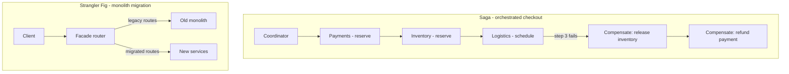

# Saga and Strangler Fig

## 1. One-Line Definition
The **Saga** pattern coordinates a multi-service business flow by a sequence of local transactions with compensating undo steps when one fails (since no global transaction exists), and the **Strangler Fig** pattern migrates an old monolith to new services incrementally by progressively redirecting traffic through a facade until the old system is empty and can be deleted.

## 2. Why Do We Need It?
Two independent problems, one file because they usually occur in the same lifecycle: **(a)** in a [[monolith|Monolith]], checkout touching orders, inventory, and payments is one [[transactions-and-acid|Transactions and ACID]] transaction — but in [[microservices|Microservices]] there is no global transaction across services, so a failure after three services committed leaves the system half-done; the saga defines how to coordinate and undo. **(b)** Rewriting a production monolith all-at-once ("big bang") has an enormous risk profile. The Strangler Fig defines how to migrate *gradually* — replacing one route at a time under a facade until nothing of the old system remains.

## 3. Simple Intuition
- **Saga:** an organized hiking convoy splitting into groups — each group walks its own leg and radios home; if a later leg is impassable, the earlier groups are radioed to *walk back* (compensate) even though there was no single "whole hike transaction."
- **Strangler Fig:** the tropical vine that grows in a tree's branches, slowly overshadowing branch by branch until the host dies and only the vine remains. You don't chop the tree down; you replace it one branch at a time.

## 4. What Happens Without It?
- **Without sagas:** a distributed flow fails halfway (reserved inventory but payment failed) and stays inconsistent — double-reserved stock, charged-but-uncancelled orders, silent state drift across services.
- **Without strangler:** you attempt a big-bang rewrite, which takes 18 months, merges never, and either lands broken or is abandoned — the rewrite trap. Or you stay stuck in an aging monolith because any change feels too risky.

## 5. Core Idea
**Saga.**
- **A saga is a chain of local transactions, each with a transaction ID/context, plus a compensating transaction** that undoes the prior ones on failure.
- **Two coordination styles:**
  - *Choreographed saga:* each service reacts to an event, does its local step, and emits the next event; failure propagates as a compensation event. Decoupled, but the flow is implicit and needs tracing (see [[event-driven-architecture|Event-Driven Architecture]]).
  - *Orchestrated saga:* a central coordinator service drives each step (calls Payments, then Inventory, then Logistics) and knows the compensation sequence explicitly. Easier to reason about; one more service and a central point of failure.
- **Compensation must exist for every step that can commit:** `payment` is compensated by `refund`, `inventory.reserve` by `inventory.release`, `shipment` by `cancel`. Steps that can't be undone (email sent) are handled by accepting "at-least-once" semantics or manual review.
- **No rollback, only forward repair:** the saga never rewinds committed history — it applies compensatory steps (still eventual consistency; see [[strong-vs-eventual-consistency|Strong vs Eventual Consistency]]).
- **It is not a transaction:** it's a checklist with undo — the term "saga" comes from the 1987 García-Molina/Salem paper.

**Strangler Fig.**
- **A facade (the old entry point) is retained and grows a router:** each request is routed either to legacy (old implementation) or to a new service, per route/feature. The facade is the single place traffic control happens (often via an API gateway / [[reverse-proxy|Reverse Proxy]]).
- **Incremental replacement by route/feature:** pick the coarsest, safest slices (typically a read endpoint or a low-traffic feature first), build the new service for that slice, route a fraction of traffic to it, validate with feature parity and [[observability|Observability]], then cut it over 100% and delete the legacy path.
- **Data sits across both worlds during migration:** dual-write or backfill so the new service converges; reads come from whichever is authoritative, verified by comparison jobs.
- **End state:** the facade routes everything to new services, the legacy code is dormant, then removed — mirroring the monolith's guarded incremental retirement. (Not to be confused with the retry/anti-corruption flavors.)

## 6. Important Terminology

| Term | Simple Meaning |
|------|----------------|
| Saga | Multi-step distributed flow with compensations |
| Compensating transaction | Undo step for a committed local step |
| Choreographed saga | Events drive steps; no central coordinator |
| Orchestrated saga | A coordinator drives and undoes steps |
| Saga execution log | Durable record of steps for crash recovery |
| Strangler facade | Routing layer that decides legacy vs new |
| Feature parity | New implementation matches old behavior for a slice |
| Dual-write/backfill | Keeping old and new in sync during migration |
| Anti-corruption layer | Translating legacy data/model for the new side |

## 7. Basic Architecture



## 8. Request or Data Flow
**Saga (orchestrated, checkout):**
1. Coordinator starts a saga with a generated SagaId, logs `started`.
2. Step 1: call PaymentService.charge → log `committed`.
3. Step 2: call InventoryService.reserve → log `committed`.
4. Step 3: call LogisticsService.schedule → fails.
5. Coordinator runs compensations in reverse order: release inventory, refund payment, logging each, marking the saga `aborted`. Crash anytime → the log tells the coordinator which compensations remain.

**Strangler (migration):**
1. Facade receives `GET /orders/123`.
2. Route table says this endpoint is migrated → forward to OrderService; log percent-completion metric.
3. Comparison job verifies both implementations returned the same payload.
4. On parity, switch 100% to the new service and mark the legacy route dead; eventually remove legacy code.

## 9. Practical Example
**E-commerce at scale (assumptions):** 2,000 orders/sec at peak, services split.
- **Saga for checkout flow already described** — with throughput in mind: choreography is preferred for independence, but this team chose orchestration for observability and added a saga execution log in a DB to survive coordinator crashes.
- **Strangler:** search was low-risk, high-signal — migrated first. The facade started at 5% to new search, ramped to 100% when lag/P99 and result quality matched; after cutover, five legacy search endpoints were deleted. Checkout (financially dangerous) got migrated last, after months of parity checks.
- Result: continuous delivery of the migration — every release shrank the old system; nothing big-bang.

## 10. Scaling
- **Sagas and scale collide at two points:** the coordinator (bottleneck for orchestration — scale it statelessly and keep the execution log durable), and load on the compensating path (a mass failure triggers N refunds at once — capacity for reverses, not just forwards). In choreography, there is no coordinator, but the implicit flow needs aggressive [[distributed-tracing|Distributed Tracing]].
- **Strangler scales as a deploy pipeline problem:** the facade must route with low overhead (it's on the hot path; cache the route table), and backfill/dual-write bandwidth must be provisioned long before it's needed.

## 11. Reliability and Failure Scenarios

| Failure | What Happens | Detection | Recovery | Trade-off |
|---------|--------------|-----------|----------|-----------|
| Saga step hangs | Flow stalls mid-state | Timeout / saga log | Retry with idempotency; compensate on repeated failure | per-step timeout budget |
| Coordinator crashes | Orphaned in-flight saga | Saga log scan | Resume/compensate from log on restart | durable log needed |
| Duplicate saga trigger | Double charge/order | Idempotency check | Dedup by SagaId/business key | idempotency keys |
| Compensation itself fails | Undo stuck | Saga log alerting | Retry compensation; manual review | compensation must be retryable |
| Facade routes to dead legacy | Wrong/missing data | Parity + error checks | Route table versioning; remove route | route table Ops |
| Migration dual-write drift | Old vs new diverge | Comparison jobs | Repair batch; pause ramp | backfill capacity |

## 12. Consistency and Correctness
- **Sagas guarantee eventual consistency, not atomicity:** an observer can see intermediate committed steps (partial state) — the design must be able to *read through* a mid-saga state or mask it.
- **Idempotency is compulsory:** saga steps and compensations can each run more than once (crash/retry). Idempotency keys (SagaId + step) make rerun harmless.
- **The execution log is the source of truth** for "what has this saga done" — treat it as a mini-outbox/audit table (see [[outbox-pattern|Outbox Pattern]]).
- **In strangling, correctness = parity at the slice:** an old and new implementation of a route must agree (structure + meaning); divergence blocks cutover. Data must converge (dual-write or one-way sync) before the old system is read-only.

## 13. Performance
- **Saga adds end-to-end latency by construction:** sequential remote steps (pay 50ms, reserve 30ms, schedule 40ms) sum to ~120ms+; parallelize independent steps, or delegate to choreography and events so each consumer paces itself.
- **Fan-out on compensations:** N failed orders = N refund calls at once — cost is asymmetric with normal traffic; capacity for reverses must exist (many teams size for success only).
- **Strangler facade is one extra hop** (~sub-ms with a cached route table) and dual-write writes to both targets — a migration-specific permanent surcharge during the migration that disappears at cutover.

## 14. Security
- **Saga payloads/context cross many services:** the saga ID and context must carry through with integrity (tamper-resistant), and each step is an authenticated call (see [[authentication-vs-authorization|Authentication vs Authorization]]); compensations must be authorized as carefully as the original steps (a refund endpoint is an attack surface).
- **The saga execution log and migration comparison stores hold PII/orders:** encrypt at rest, restrict access, never log full payloads (see [[encryption-and-keys|Encryption and Keys]]).
- **Strangler facade is now the new trust boundary:** old hidden services that trusted "inside the monolith" must be exposed behind authN at the facade; legacy endpoints should be de-routed, not internet-reachable.

## 15. Trade-Offs

| Choice | Advantages | Disadvantages | When to Use |
|--------|------------|---------------|-------------|
| Choreographed saga | Decoupled, independent pace | Implicit flow, needs tracing | Many teams, EDA-native |
| Orchestrated saga | Explicit, auditable | Coordinator bottleneck/coupling | Few steps, need observability |
| 2PC | Synchronous atomicity | Fragile, locks, availability loss | Almost never — saga wins |
| Big-bang rewrite | One conceptual change | 18-month risk, high failure | Never, when strangling is possible |
| Strangler migration | Continuously shippable, reversible | Long dual-run, parity discipline | Live legacy systems |

## 16. Common Mistakes
- **Missing compensations** for a step whose business effect can't be "unmade" (an email sent, a shipment already departed) — you must design those steps to be effectively idempotent or accept manual handling.
- **Ordering compensations wrong:** compensate in reverse commit order; undoing step 1's effect while step 2 still matters can corrupt the flow.
- **Assuming compensation can't fail:** it retries and may itself need manual intervention — log it, alert it, monitor it.
- **Big-bang migration:** strangling as a monolith-vs-gray-release (whole system swap) rather than route-by-route.
- **No parity checks:** flipping to a new implementation that returns subtly wrong data is silent breakage; verify before cutover.
- **Forgetting the facade's route table is a hot path** that must be fast, cached, and versioned like any released code.

## 17. HLD vs LLD Boundary
HLD: saga step list + compensation list, coordination style, log storage & idempotency policy, timeout budgets; strangler facade topology, slice sequencing, ramp percentages, parity/backfill strategy. LLD: coordinator code, compensation implementations, event schemas, facade router rules/cache, comparison-job details.

## 18. Interview Questions

### Beginner
- Why can't a multi-service flow just be one transaction?
- What is a compensating transaction? Give a checkout example.

### Intermediate
- Choreographed vs orchestrated saga: compare and choose one for a 5-step flow.
- Walk how the Strangler Fig replaces one endpoint of a live monolith without downtime.

### Advanced
- Design a saga whose coordinator crashes mid-way. How do you recover correctly?
- Design the migration of a payment flow: when is a slice safe to cut over, and what does parity mean for it?

## 19. Interview Memory Summary

> [!abstract]- Interview Memory Summary

### Remember

- No global transaction across services → saga: local steps + compensations.
- Every committing step needs a compensating undo (refund, release, cancel).
- Two styles: orchestrated (explicit coordinator) vs choreographed (events).
- Saga = eventual consistency + idempotency + a durable execution log.
- Strangler Fig = facade + incremental route migration + parity checks.
- Big-bang rewrites are the trap the strangler avoids.
- Cutover = per-slice, after parity + comparison jobs, with dual-write/backfill.

### 30-Second Explanation

A saga coordinates a distributed business flow with per-step local transactions and compensating undos (refund/release/cancel) — orchestrated or choreographed, always with idempotency and a durable execution log, accepting eventual consistency. The Strangler Fig migrates a live monolith by putting a routing facade in front, replacing routes one at a time with new services, verifying parity, cutover incrementally, and finally deleting the legacy — avoiding the big-bang rewrite trap entirely.

### Interview Traps

- Claiming a saga gives atomicity — it gives coordinated eventual consistency, with observable intermediate states.
- Omitting compensations ("we just stop") or forgetting compensation can fail and needs its own retries/monitoring.
- Presenting the Strangler Fig as a one-shot big rewrite with a facade.
- Cutting over a slice without parity/comparison checks.
- Ignoring idempotency — every step may run twice after crashes.

### Key Trade-Off

You replace the impossible global transaction with coordinated compensations and a durable log (eventual consistency, extra work per step), and you replace risky big-bang rewrites with long, disciplined incremental migrations that keep the system shipping the whole time.

## 20. Related Concepts

### Prerequisites

- [[microservices|Microservices]] — why the global transaction no longer exists.
- [[transactions-and-acid|Transactions and ACID]] — what the monolith had and the saga replaces.
- [[monolith|Monolith]] — the subject of strangling.

### Commonly Used Together

- [[event-driven-architecture|Event-Driven Architecture]] — choreographed sagas are event flows with compensations.
- [[outbox-pattern|Outbox Pattern]] — atomic event emission that makes saga steps reliable.
- [[delivery-semantics|Delivery Semantics]] — at-least-once + idempotency for safe step reruns.
- [[message-queue|Message Queue]] — the transport for choreographed steps.
- [[distributed-tracing|Distributed Tracing]] — the visibility that implicit sagas and migrations depend on.
- [[reverse-proxy|Reverse Proxy]] / api-gateway — the facade pattern's natural home.

### Alternatives

- [[transactions-and-acid|Transactions and ACID]] — if the flow genuinely stays in one DB, keep ACID (no saga).
- [[data-patterns|Data Access Patterns]] — read models/etl-style backfill during migration.

### Advanced Concepts

- [[strong-vs-eventual-consistency|Strong vs Eventual Consistency]] — the consistency model a saga operates in.
- [[cap-theorem|CAP Theorem]] — why the distributed flow can't be atomic and available under partitions.
- [[resilience-patterns|Resilience Patterns (Catalog)]] — timeouts/breakers make saga steps fail cleanly rather than hang.

Related planned topics (not authored yet): distributed transaction (2PC/3PC) deep-dive, data migration, event sourcing and CQRS.

## 21. References
García-Molina & Salem, "Sagas" (1987), original paper; Fowler, "Saga" and "StranglerFigApplication" articles; Newman, "Building Microservices" (migration chapters). Verify against current Azure Saga / distributed-data guidance.

## 22. Active Recall

Test yourself before revealing each answer.

> [!question]- Why can't a multi-service flow simply be one big transaction?
> A transaction requires all participants to coordinate under one consistency scope — a global coordinator with locks and recovery, i.e., 2PC. Across services with separate databases that becomes fragile: locks held across the network, availability lost on partition (CAP), and one slow participant stalls everything. So distributed flows coordinate steps locally and accept eventual consistency instead.

> [!question]- Give a concrete compensation example for checkout.
> If the flow commits payment → inventory reserve → logistics schedule, and logistics fails, compensations run in reverse: inventory.release (releases reserved stock) and payment.refund. Each is itself a committed operation with its own idempotency, and the saga is marked aborted only after all compensations complete.

> [!question]- Choreographed vs orchestrated saga for a 5-step flow: compare and choose.
> Orchestrated: one coordinator calls each step and compiles the undo list — traceable, auditable, easy to reason about, but a bottleneck and a point of coupling. Choreographed: each service reacts to an event and emits the next — fully decoupled but the flow lives implicitly in many handlers and needs tracing to debug. Choose orchestration for few services + hard failure visibility; choreography for many teams wanting independence.

> [!question]- The coordinator crashes after committing step 2 of 4. How do you recover?
> From the saga execution log: a durable record of every step's state (started/committed/compensated). On restart the coordinator reads in-flight sagas, resumes, or runs the remaining compensations in reverse order. Because a crash can duplicate a step, every step and compensation carries an idempotency key (SagaId + step) so reruns are harmless.

> [!question]- Why must every saga step be idempotent even if you never lose messages?
> Crash/retry windows: the coordinator can die after a step commits but before logging it, so it re-runs the step; a retried payment must not charge twice. Idempotency (dedup by business key) is the only way repeated executions converge to one effect. Same for compensations — a refund retried must be one refund.

> [!question]- Walk the strangler migration of one endpoint without downtime.
> 1. Keep the facade routing it to legacy. 2. Build the new service, backfill/dual-write its data, run comparison jobs. 3. Route 5% of traffic to the new service, compare results and errors; ramp to 100%. 4. On parity + stability, flip fully, then delete the legacy endpoint and its code. Downtime never happens because the legacy path stays alive until the new one is proven.

> [!question]- When is a slice NOT safe to cut over in a strangler migration?
> When parity can't be established (maximally: payment/settlement flows whose side effects differ irreconcilably, or where legacy behavior is itself wrong but customers depend on it), when data backfill can't converge (dual-write drift), or when the new service can't hit the same reliability/security bars. Such slices stay on legacy while smaller slices migrate — the strangler is allowed to be long.

> [!question]- Interview scenario: design the saga for checkout considering failure blast radius and audit.
> Choose orchestrated for auditability: coordinator + saga log (durable, encrypted) + explicit compensation list (refund, release, cancel shipment) + idempotency keys per step + per-step timeouts and circuit breakers on slow providers. Order compensations reverse of commits; monitor "saga aborted" as an SLO incl. compensation success; keep the log queryable for finance. Add load tests for the *failure* path — a provider outage refunds thousands, not hundreds.

## 23. When Should I Use This?

### Use it when

- A business flow spans services and consistency across the whole flow matters.
- A partial failure must be cleaned up (funds, stock, bookings).
- You want the flow auditable and resumable after crashes.
- (Strangler) You have a live monolith bearing production traffic that must be replaced without stopping it.
- (Strangler) The legacy is being overgrown by new features anyway.

### Avoid it when

- The flow stays in one database — [[transactions-and-acid|Transactions and ACID]] is simpler and stronger.
- Steps are read-only or one-way with no meaningful undo (a saga adds machinery with nothing to repair).
- (Strangler) The legacy is so tangled that per-route slices can't be extracted — then modularize it first.

### What problem does it solve?

- **Saga:** cross-service consistency without a global transaction — coordinating multi-service flows so failures are undone reliably, recoverably, and auditably.
- **Strangler:** the impossible big-bang rewrite — replacing a production monolith incrementally, continuously shippable and reversible, by growing a routing facade and cutting over proven slices.

### What problem does it NOT solve?

Sagas don't give atomic visibility (intermediate states are observable), don't cover step effects that can't be unmade, and still need idempotency + a durable log. The strangler doesn't reduce the total migration work, doesn't remove the data-migration risk, and doesn't turn an unstructured monolith into a clean service map by itself.

## 24. Decision Connections

Decisions that go together with saga and strangler fig:

- [[microservices|Microservices]] — the reason the global transaction disappears, and the target shape strangling builds.
- [[monolith|Monolith]] / [[modular-monolith|Modular Monolith]] — the source system strangling dismantles.
- [[event-driven-architecture|Event-Driven Architecture]] — choreographed sagas are event sequences with compensations.
- [[outbox-pattern|Outbox Pattern]] — makes each saga step's event emission atomic with its local commit.
- [[delivery-semantics|Delivery Semantics]] — the at-least-once/idempotency contract every step assumes.
- [[distributed-tracing|Distributed Tracing]] — visibility across implicit flows and the migration's dual worlds.
- [[resilience-patterns|Resilience Patterns (Catalog)]] — timeouts and breakers make saga steps and facade routes fail fast.
- [[reverse-proxy|Reverse Proxy]] — the facade/route layer the strangler is built on (api-gateway planned).
- [[strong-vs-eventual-consistency|Strong vs Eventual Consistency]] — the consistency model sagas deliberately accept.

Decision tree:

```
Business flow spans services?
    |
    +-- Stays in one DB?                    → keep [[transactions-and-acid|Transactions and ACID]]
    |   |
    +-- Must coordinate across services?
    |      → Saga
    |         |
    |         +-- Audit/failure visibility matters? → orchestrated (coordinator + log)
    |         +-- Full decoupling matters?          → choreographed (events + [[distributed-tracing|Distributed Tracing]])
    |         +-- Steps/compensations retried?      → idempotency keys + [[delivery-semantics|Delivery Semantics]]
    |         +-- Event must be atomic with state?  → [[outbox-pattern|Outbox Pattern]]
    |
    Live monolith to replace?
    |      → Strangler Fig
    |         |
    |         +-- Slice by low-risk routes first    → search > reporting > checkout
    |         +-- Data spans old and new?           → dual-write + comparison jobs
    |         +-- Route control?                    → facade / [[reverse-proxy|Reverse Proxy]] at the edge
    |
    +-- Whole system, one big rewrite?
           → trap: prefer [[saga-and-strangler|Strangler Fig]] instead
```