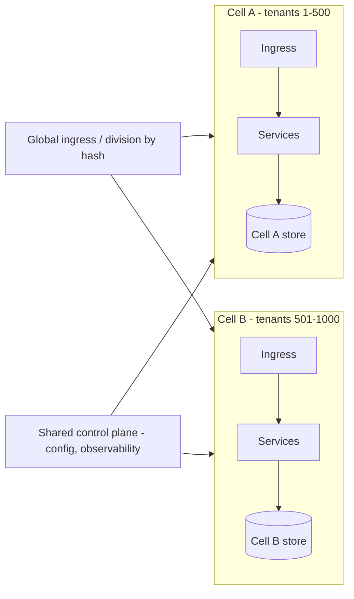

# Multi-Tenancy and Cell-Based Architecture

## 1. One-Line Definition
Multi-tenancy is the design of sharing a SaaS system's resources among many customers (tenants) at chosen isolation levels — silo/pooled/bridge — while cell-based architecture is the larger-scale pattern of dividing the whole platform into isolated, self-contained "cells" (each serving a subset of tenants/traffic) so failures, deprecations, and canary changes stay inside one cell's blast radius instead of threatening the fleet.

## 2. Why Do We Need It?
Two tensions drive these patterns. **Economics vs isolation:** a SaaS product serves thousands of tenants; giving each its own siloed stack is the safest but most expensive, sharing everything is cheapest but risks cross-tenant contamination — multi-tenancy models choose the honest price point per requirement. **Fleet-level blast radius:** by the time a system serves global traffic, a single shared control/data plane means *any* bug, dependency, or deploy touches every tenant at once; cell-based architecture deliberately cuts the fleet into independent cells so a bad deploy or a hot tenant damages one cell, not the world.

## 3. Simple Intuition
- **Multi-tenancy:** an apartment building (pooled) vs a row of houses (silo). An apartment building: everyone shares plumbing, walls, and elevators — cheapest to build, but if the neighbor floods, you may get wet; houses: separate foundations, pipes, and doors — expensive but a flood in one house is confined to it. The *bridge* model is like a house where only the bedrooms are rented separately.
- **Cell-based:** a cruise ship split into watertight compartments: one compartment can flood without sinking the ship. Each compartment (cell) has its own engine and crew (its own instance of the whole stack) — the ship keeps sailing even when a compartment loses power.

## 4. What Happens Without It?
- **No tenancy model:** one mis-scoped query returns another customer's rows, or one noisy tenant (a giant exporter / a streaming tenant) saturates the shared queue/DB and every other tenant's latency blows through their SLO. You either over-spend (siloed everything) or get rent-caught (one tenant problem becomes everyone's).
- **No cells:** a broad deploy or a buggy dependency either takes the entire platform down or must be rolled out to everyone at once with no safe minority to learn from. A hot tenant's load shared across all pools degrades everyone; experiment rollouts happen to "everyone or nothing."

## 5. Core Idea
**Multi-tenancy models (the isolation dial):**
- *Silo (aka isolated/tenant-per-instance):* one compute + DB stack per tenant. Strongest isolation and compliance story; most expensive — you literally rent an instance per tenant.
- *Pooled (aka shared):* all tenants share compute and DB instances; every query/row/queue is tagged with `tenant_id`, and filtering is *enforced*, not assumed. Cheapest; the isolation problem is pushed into application and data-layer discipline.
- *Bridge (aka hybrid/silo-with-pool):* the common-and-expensive tiers are pooled (join/aggregation), while the expensive-to-share data stays siloed. A pragmatic compromise.

**Cell-based architecture (blast-radius containment):**
- A **cell** is a self-contained unit of the entire application stack — its own ingress, services (or the whole microservice set), its own datastores, and its own control-plane access — that serves a *slice* of traffic/tenants and cannot reach into other cells.
- **The rules that make it cell-based:** (1) no cross-cell dependencies (a cell never reads/writes another cell's store or calls another cell's services); (2) cells share nothing except foundational global infrastructure (DNS, observability control plane, maybe config distribution) — and even that must be designed for partial failure; (3) affinity from the moment a request arrives — a tenant/traffic-key is hashed to a cell and stays there.
- **Why it's powerful:** blast radius = one cell. You can deploy *canary* cells, give a hot/large tenant its own cell, run an entire cell at a new version and only one cell faces any risk; a dependency outage in one cell doesn't propagate.
- **Relationship to multi-tenancy:** cells *partition by tenant-group*; within a cell you still choose silo/pooled/bridge per tenant tier. Cell-ing is the second axis: partition the fleet; tenancy is how you share *inside* each partition.
- **Relationship to sharding:** a cell is like a shard of the *whole system* (not just the database) — the [[sharding|Sharding]] mindset applied to infrastructure rather than rows; the tenant-to-cell hashing is a [[shard-key|Shard Key]]-like decision with a [[consistent-hashing|Consistent Hashing]] flavor.

## 6. Important Terminology

| Term | Simple Meaning |
|------|----------------|
| Tenant | One customer whose data/work must be isolated |
| Silo model | Per-tenant compute + storage (strongest isolation) |
| Pooled model | Shared compute + storage, tenant_id filtering |
| Bridge model | Hybrid: pooled where safe, siloed where risky |
| Tenant_id | The partition key on every table/queue/query |
| Cell | Self-contained stack slice of the whole platform |
| Blast radius | The set of things that fail together |
| Cell affinity | Pinning a tenant/traffic to one cell for its life |
| Canary cell | A single cell run at the new version |
| Control plane | The shared global machinery (observability, config, DNS) |

## 7. Basic Architecture



## 8. Request or Data Flow
1. A request arrives at global ingress; the tenant id (or traffic key) is hashed → affinity maps the tenant to a cell.
2. The request is forwarded to that cell's ingress; it never touches another cell.
3. Inside the cell, tenancy applies: pooled-with-`tenant_id` tables or a per-tenant DB, depending on the tenant's tier.
4. All reads/writes stay inside the cell (its own store, its own services); no cross-cell call is legal.
5. A cell running a bad version affects only its tenants; global observability shows the cell's health along with the rest.

## 9. Practical Example
**Global SaaS payments platform (assumptions):** 50k merchants, 99.995% SLA, regions worldwide.
- **Cells:** merchants partitioned by hash into ~64 cells, each with its own ingress, services, and DB. A bad billing deploy goes to one canary cell first; only those merchants see it.
- **Tenancy inside a cell:** pooled store with `merchant_id` for standard merchants; the **bridge** upgrade for large/high-volume merchants — a dedicated (siloed) database inside their cell so cross-merchant noise is impossible; compliance-heavy merchants (PCI) get a silo that meets audit requirements.
- **The hotspot case:** one analytics-heavy merchant (huge exports) is moved — with zero code changes to its behavior — into its own cell; the other 63 cells remain untouched. Blast radius was the design goal and it worked.

## 10. Scaling
- **Cells scale the *platform*, not one service:** adding capacity = adding cells (each a small copy of the whole stack), not just adding replicas; the per-cell stack also keeps its own replicas as load grows.
- **Tenant-to-cell sizing is quantized:** a cell has a capacity envelope; oversize tenants need either a dedicated cell, a bridge/silo upgrade, or a cell split (the hard resharding-style event — see [[sharding|Sharding]] for the migration mechanics, and [[consistent-hashing|Consistent Hashing]] for minimizing moves).
- **The control plane is the real scaling governor:** global config/DNS/observability must fan out and re-converge for N cells and survive their failures — a naive global config push is a fleet-wide single point of failure.
- **Pooled tenant volume still needs the normal ladder** inside a cell — index → cache → replica → model → shard (see [[data-patterns|Data Access Patterns]]).

## 11. Reliability and Failure Scenarios

| Failure | What Happens | Detection | Recovery | Trade-off |
|---------|--------------|-----------|----------|-----------|
| One cell's DB down | Those tenants degraded | Cell health map | Cell failover (active-passive cell) | per-cell standby cost |
| Bad deploy | Only the cell (or canary) affected | Canary/cell error rates | Roll back that cell | release isolation but N pipelines |
| Hot tenant in a pooled pool | Its neighbors degrade | Latency per tenant | Move tenant to silo/cell | ops + cost |
| Control-plane push failure | Config skew across cells | Config-drift metric | Canary config per cell | versioned config |
| Cross-cell data leak (bug) | Tenant contamination | Isolation tests | Quarantine cell, restore from snapshot | extra tooling |

## 12. Consistency and Correctness
- **Isolation correctness is the whole point:** every query/queue must carry and *enforce* `tenant_id` (pooled) — a single un-scoped query is a data leak; test isolation continuously (adversarial randomness, tenant fuzzing).
- **Cells trade global consistency for partial-failure isolation:** a transaction never spans cells — because nothing is allowed to cross them. What you give up: any "global" query must fan out across cells (see [[fanout-and-aggregation|Fan-Out / Fan-In / Scatter-Gather]]) or be pre-aggregated in an analytics plane (see [[data-patterns|Data Access Patterns]]).
- **Tenant identity and affinity must be immutable in-flight:** if `tenant_id` routing is mis-hashed mid-request, reads split between cells — hash once at the edge, pin for the session (see [[consistent-hashing|Consistent Hashing]]).

## 13. Performance
- **Multi-tenancy pooled is efficient** (one fat pool of resources shared by many tenants) — the "why pooled exists" economics; **silo is expensive** (N idle instances) — the reason you pool small tenants and silo only when required.
- **Cells cap per-tenant impact on performance:** the noisy-neighbor problem is bounded to a cell instead of the fleet — a dedicated cell for a hot tenant actually *improves* everyone else's latency.
- **Costs:** per-cell stacks duplicate foundations (ingress, config, observability agents); global queries get slow (fan-out) or stale (analytics plane).

## 14. Security
- **Tenancy isolation is a security boundary, not a style choice:** pooled models need row/field-level enforcers, parameterized tenant filters, and mandatory tests proving cross-tenant access fails (see [[web-vulnerabilities|Web Vulnerabilities]] for injection/SSRF angles).
- **Cells give powerful security segmentation:** a compromise in one cell is confined (its keys/roles don't unlock others — see [[encryption-and-keys|Encryption and Keys]]); per-cell secrets and least-privilege machinery make cells their own trust domains (see [[authentication-vs-authorization|Authentication vs Authorization]]).
- **Control-plane access is privileged fleet-wide:** lock it down hardest of all — it's the one surface that could reach every cell.

## 15. Trade-Offs

| Choice | Advantages | Disadvantages | When to Use |
|--------|------------|---------------|-------------|
| Pooled tenancy | Cheapest, densest | Isolation discipline burden | Most standard tenants |
| Silo tenancy | Strong isolation/compliance | Cost scales per tenant | Enterprise/compliance tenants |
| Bridge | Balanced cost/isolation | Two models to operate | Mixed market |
| Monolithic plane (no cells) | Simple ops | Fleet-wide blast radius | Pre-scale, single region |
| Cell-based | Blast radius = one cell, canary deploys | Infrastructure duplication, hard global queries | Global scale, strict SLAs |

## 16. Common Mistakes
- **Trusting tenant_id filtering instead of enforcing it** — one forgotten WHERE clause leaks a tenant's data (test it adversarially).
- **Sharing one pool with wildly heterogeneous tenants** — a single heavy tenant's analytics saturates everyone; tier the tenancy model or give the heavy tenant a cell.
- **Cross-cell calls** ("just this one join...") — they silently rebuild the distributed monolith with cell-shaped complexity (see [[microservices|Microservices]]).
- **A global control plane that is a fleet-wide SPOF** — one config push knocks out all cells; make it partial-failure-tolerant and canary-able.
- **Resharding/tenant-move as an afterthought** — moving tenants across cells is the hardest operation; design affinity/hashing so moves are rare and mechanical (see [[consistent-hashing|Consistent Hashing]]).

## 17. HLD vs LLD Boundary
HLD: tenancy model per tenant tier, tenant_id enforcement policy, cell count/sizing, affinity hashing, canary/deploy sequencing, control-plane architecture. LLD: tenant-filter query builders and tests, connection/routing code in the pooled store, cell deploy pipelines, config fan-out implementation, isolation unit tests.

## 18. Interview Questions

### Beginner
- What's the difference between silo, pooled, and bridge multi-tenancy?
- Why doesn't "just add tenant_id" make a shared system tenant-safe?

### Intermediate
- A large export-heavy tenant degrades everyone in the pooled pool. Walk the diagnosis and the options.
- What makes a stack a "cell," and what is forbidden between cells?

### Advanced
- Design the tenancy and cell layout for a commerce platform with 500M users, 100k merchants, and PCI obligations — including how a merchant gets a "premium isolation" tier.
- How do you move a tenant from one cell to another with no downtime and no cross-cell reads during the move?

## 19. Interview Memory Summary

> [!abstract]- Interview Memory Summary

### Remember

- Multi-tenancy = the isolation dial: silo (per-tenant stack), pooled (shared + tenant_id), bridge (mix).
- Enforcement, not assumption: tenant_id filters must be provably scoped, or it's a leak.
- Cells = self-contained slices of the whole platform: own ingress/services/stores, no cross-cell access.
- Blast radius = one cell; canary a cell, isolate a hot tenant in a cell.
- Tenant → cell by hash/affinity; moves are the hard operation.
- Control plane must be partial-failure-tolerant (it's the one global surface).
- Cells partition the fleet; tenancy decides sharing *inside* each cell.

### 30-Second Explanation

Multi-tenancy chooses how much to share per customer: silo (own stack, strongest/expensive), pooled (shared stack with enforced tenant_id, cheapest), bridge (mix tiers). Cell-based architecture partitions the whole platform into self-contained cells — each with its own ingress, services, and stores, no cross-cell coupling — so the blast radius of a bad deploy or a hot tenant is one cell, canary rollouts are safe, and excessive tenants get isolated by moving them to their own cell. The global control plane stays shared but must be partial-failure-tolerant; any "global" query must fan out or use an analytics plane.

### Interview Traps

- Saying "we're multi-tenant" while writing un-scoped aggregate queries (enforcement is the requirement).
- Claiming a cell is just another shard — a cell is the *whole stack* slice, not a DB partition.
- Allowing "just one" cross-cell call — that's the distributed monolith reborn.
- Treating the control plane as safe because it's "internal" — it's the fleet-wide single point of failure.
- Designing tenant moves after launch — affinity/hashing must be moveable from day one.

### Key Trade-Off

You choose where isolation money goes: pooled tenancy + cells give you the cheapest shared economics with fleet-wide blast-radius containment — at the cost of enforcement discipline, per-cell infrastructure duplication, and deliberate design so nothing legal crosses a cell boundary.

## 20. Related Concepts

### Prerequisites

- [[scalability|Scalability]] and [[availability|Availability]] — what cell partitioning protects.
- [[system-design-fundamentals|System Design Fundamentals]]
- [[database-fundamentals|Database Fundamentals]]

### Commonly Used Together

- [[sharding|Sharding]] and [[shard-key|Shard Key]] — the row-level cousin of tenant/cell partitioning.
- [[consistent-hashing|Consistent Hashing]] — minimizing moves when tenants/cells change.
- [[data-patterns|Data Access Patterns]] — tenant_id discipline and read models inside a cell.
- [[database-replication|Database Replication]] — per-cell replicas + failover.
- [[failover|Failover]] and [[standby-models|Standby Models]] — cell-level continuation.
- [[encryption-and-keys|Encryption and Keys]] — per-cell secrets/keys.
- [[authentication-vs-authorization|Authentication vs Authorization]] — per-cell trust domains.
- [[fanout-and-aggregation|Fan-Out / Fan-In / Scatter-Gather]] — when "global" queries reach across cells anyway.

### Alternatives

- [[microservices|Microservices]] — service decomposition is orthogonal; cells partition *those* services' fleet.
- [[horizontal-vs-vertical-scaling|Horizontal vs Vertical Scaling]] — cells are a horizontal, stack-aware scaling unit.

### Advanced Concepts

- [[reliability|Reliability]] — failure isolation as the motivating contract.
- [[distributed-tracing|Distributed Tracing]] — tracing within a cell; cell-scoped dashboards.
- [[strong-vs-eventual-consistency|Strong vs Eventual Consistency]] — the model global queries give up.

Related planned topics (not authored yet): tenant-isolation and audit trails (security), cell-based architecture deep dive (advanced), data-migration mechanics.

## 21. References
Microsoft Azure Architecture Center — multi-tenant SaaS guidance (silo/pooled/bridge) and cell-based architecture; AWS well-architected multi-tenancy whitepaper; cell-architecture talks from large-scale platforms. Verify current guidance against managed-service docs.

## 22. Active Recall

Test yourself before revealing each answer.

> [!question]- Silo vs pooled vs bridge: what decides the choice per tenant?
> Risk and economics. Silo gives one tenant its own stack (strongest isolation/compliance, highest cost — idle capacity). Pooled shares everything with enforced tenant_id (cheapest and densest, but isolation becomes application discipline). Bridge mixes: pooled for cheap/low-risk tiers, silo for the expensive or high-risk data of specific tenants. Compliance, SLA, and noise profile are what push a tenant up the dial.

> [!question]- Why doesn't "just add tenant_id" make a shared system tenant-safe?
> Because presence of the column is not enforcement: an aggregate without the filter, a cached result keyed without tenant, a queue consumer that mishandles tenant boundaries, or a "temporary" admin query can all cross tenants. Safe pooling needs mandatory scoping (query builders that refuse tenant-less queries), row/field-level access checks, and adversarial tests proving cross-tenant access fails.

> [!question]- What exactly makes a stack a "cell," and what is forbidden between cells?
> A cell is a self-contained instance of the entire platform: its own ingress, services, datastores, and control-plane access (a slice, not a shard). Forbidden: any cross-cell dependency — a cell must never read/write another cell's store or call another cell's services, and shared global infrastructure (DNS, observability, config) must be failure-tolerant. No one request may ever span two cells.

> [!question]- A large export-heavy tenant degrades everyone in the pooled pool. Diagnose and fix.
> Noisy-neighbor: one tenant's bulk scans/export saturate the shared compute and the pooled DB's I/O, so every other tenant's p99 climbs. Options: (a) tier the tenancy — move the heavy tenant to a bridge/silo (a dedicated DB in the pool, or its own stack); (b) give it its own cell entirely so no one shares its I/O; (c) rate-limit and queue exports so the noise is bounded. The cheapest honest fix is usually (a), with (b) as the escalation.

> [!question]- How do you move a tenant from one cell to another with no downtime and no cross-cell reads?
> Like a careful shard migration: (1) enable dual-write — writes go to both old and new cells from the cutover moment, keyed by tenant; (2) backfill the new cell from the old data; (3) flip reads for that tenant to the new cell once they're in sync (consistent snapshot or delta catch-up); (4) verify reconciliation/parity, then stop writing to the old cell and retire its slice. Always keep affinity routing hashed so a request can never randomize between cells mid-flight.

> [!question]- How do cells relate to multi-tenancy, sharding, and microservices?
> Three orthogonal axes: microservices decompose *services*; cells partition *the deployment* into isolated whole-stack slices; sharding partitions *data rows* across nodes; tenancy decides how tenants share resources *inside* a slice. Concretely: within a cell you may have microservices; each service's data may be sharded; and per-tenant tiering (silo/pooled/bridge) applies inside the cell. Cells give blast-radius containment; tenancy gives per-customer economics.

> [!question]- Interview scenario: commerce platform, 500M users, 100k merchants, PCI obligations. Lay out tenancy and cells.
> 1. Partition merchants into cells by hash (~64 cells), each self-contained; user/consumer traffic follows the merchant (or its own affinity), never spanning cells. 2. Default tenancy: pooled with enforced merchant_id scoping for consumers and standard merchants. 3. Premium tier: bridge — dedicated DB inside the merchant's cell. 4. PCI/enforcement: silo stored + processed in isolated, audited environments, keys per cell. 5. Canary: deploy to one cell first; move problem merchants to dedicated cells; control plane failure-tolerant; global aggregates via an analytics plane (fan-out or pre-aggregation).

> [!question]- What's the biggest operational trap after you've built cells?
> The control plane. Cells are worthless if a single global config push, DNS zoning error, or observability outage can hit every cell at once — that recreates the fleet-wide blast radius you partitioned away. The second trap is drift: cells diverge in config/version (community of snowflakes), so config must be versioned, canarried per cell, and diffed continuously. Discipline equals the isolation you actually get.

## 23. When Should I Use This?

### Use it when

- You run a multi-tenant SaaS and must balance cost against per-customer isolation/compliance needs (tier the dial).
- The fleet is large enough that a bad deploy or a hot tenant must not touch everyone.
- Strict SLAs and experiment/canary rollouts need a controlled minority to fail in.
- Isolation (security, noise, compliance) is a first-class product requirement.

### Avoid it when

- A single region/small fleet is still fine — cell infra duplication isn't worth it yet.
- The org can't enforce tenant scoping (cells won't fix un-disciplined pooled queries).
- The product is one megatenant (no tenancy question) or has trivial isolation needs.
- Rearchitecting costs more than the blast radius it would save (honestly size it).

### What problem does it solve?

Two at once: per-tenant isolation economics (how much sharing each customer's risk profile allows) and fleet-level blast radius (a bug, deploy, or noisy tenant affecting every tenant at once). Tenancy models price isolation; cells make failure and rollout local.

### What problem does it NOT solve?

It doesn't enforce isolation by itself (tenant scoping is hard discipline), doesn't make cross-cell global queries cheap (they get fan-out or an analytics plane), doesn't remove the need for per-cell replicas/failover, and doesn't prevent control-plane failures from being fleet-wide unless the control plane itself is made partial-failure-tolerant.

## 24. Decision Connections

Decisions that go together with tenancy and cells:

- [[sharding|Sharding]] / [[shard-key|Shard Key]] — the row/data-level partitioning of the same isolation instinct.
- [[consistent-hashing|Consistent Hashing]] — cheap tenant-to-cell assignment and moves.
- [[data-patterns|Data Access Patterns]] — tenant_id discipline and read models inside a cell.
- [[database-replication|Database Replication]] and [[failover|Failover]] — per-cell resilience stacks.
- [[standby-models|Standby Models]] — cell-level active-passive continuation.
- [[encryption-and-keys|Encryption and Keys]] — per-cell secrets, keys, and least privilege.
- [[authentication-vs-authorization|Authentication vs Authorization]] — per-cell trust domains.
- [[fanout-and-aggregation|Fan-Out / Fan-In / Scatter-Gather]] — when global queries still reach across cells.
- [[microservices|Microservices]] — cells partition the microservice fleet's deployment.
- [[availability|Availability]] — the SLA motivation behind blast-radius containment.

Decision tree:

```
Multi-tenant SaaS, how to isolate?
    |
    +-- Small fleet / single region?
    |      → pooled tenants now; revisit when blast radius actually hurts
    |
    +-- Cost vs isolation per customer?
    |      → Multi-Tenancy dial
    |         |
    |         +-- Cheap + low risk?      → pooled (enforce tenant_id everywhere)
    |         +-- High risk / loud?      → bridge (silo the expensive data) or silo
    |
    +-- Fleet-level blast radius is real?
    |      → Cell-Based Architecture
    |         |
    |         +-- Hot/large tenant?      → own cell
    |         +-- Safer rollouts?        → canary cell / deploy per cell
    |         +-- Moves across cells?    → [[consistent-hashing|Consistent Hashing]] + dual-write migration
    |         +-- Global queries?        → analytics plane / [[fanout-and-aggregation|Fan-Out ... Scatter-Gather]]
    |
    +-- Isolation MUST be provable (compliance)?
           → silo + adversarial isolation tests + audited control plane
```