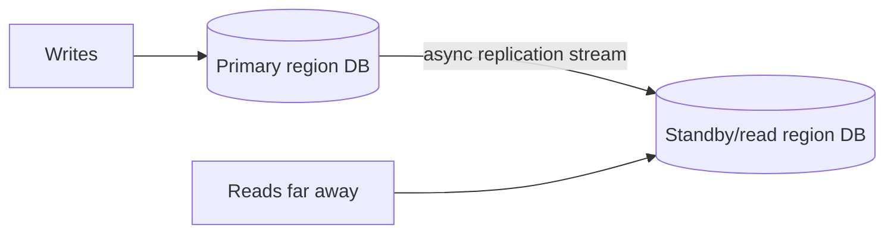
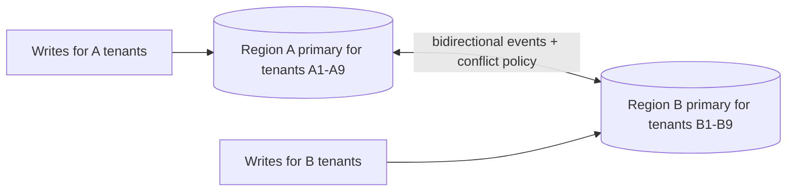

# Cross-Region Replication

## 1. One-Line Definition
Cross-region replication continuously copies a dataset between regions — so a region's crash loses at most the replication gap, far regions can serve local reads, and (multi-master) every region can accept writes — at the cost of latency, ordering, and conflict complexity.

## 2. Why Do We Need It?
Multi-region promises are all data-first: [[regional-failover|Regional Failover]] needs a live copy elsewhere, [[multi-region-models|Active-Active regions]] need every region able to serve and write, and users far from the primary deserve local reads. Each needs a *pipeline that moves the data itself* across the WAN fast enough that the promise holds. Cross-region replication is that pipeline. Its performance (lag) and correctness (ordering, conflicts) define the RPO achievable and whether the DR/active story is real.

## 3. Simple Intuition
Paper ledgers in two cities. Single-master: every transaction is written first in New York; a junior clerk in London receives each day's pages by courier and copies them into the London book (lag = journey time; loss = pages in flight when New York burns). Multi-master: both cities take walk-ins directly; each city regularly ships its pages both ways, but the two books can disagree on pages touching the same customer. The boring-sounding "copying pages" is actually the whole system — rate, route, ordering, and reconciliation decide everything.

## 4. What Happens Without It?
No pipeline ⇒ the standby is worthless: failover serves a stale year-old backup, active-active isn't active (the second region can't answer meaningfully), and far users' reads must cross the continent. Every multi-region promise silently degrades to single-region behavior with extra cost. Worse, an *uncoordinated* replication ("we just rsync periodically") produces missing tail writes, duplicated applies, and no ordering story when you need it most.

## 5. Core Idea
- **The lag–cost spectrum is the whole subject.** Sync: a write waits for replication ack before returning — consistent but every write pays cross-region RTT (~100+ ms on a WAN). Async: primary returns immediately, replication runs in the background — fast writes, but lag and loss windows (see [[replication-lag|Replication Lag]]). Semi-sync/quorum: a bounded middle.
- **Single-master direction:** primary region owns writes → replicated to regional read replicas (or a standby DB). Simple, no conflicts; produces active-passive.
- **Multi-master / active-active:** each region owns a primary (or shards by region) and mutually replicates. Writes can conflict → conflict policy is *mandatory*: last-writer-wins, version vectors, or application-defined ownership/merging (see [[global-consistency|Global Consistency]]).
- **Mechanisms:** native DB replication plumbing, CDC (change-data-capture → ship events → apply), or event-stream fan-out ([[outbox-pattern|Outbox Pattern]] style: write to a log, consumers replay). Each trades coupling, latency, schema compatibility, and exactly-once-ness.
- **Lag is monitored, not assumed:** the replication lag metric ([[replication-lag|Replication Lag]], [[sli-slo-sla|SLI / SLO / SLA]], [[observability|Observability]]) is a first-class SLO; the failover design's RPO is that number.

## 6. Important Terminology

| Term | Simple Meaning |
|------|----------------|
| WAN RTT | Round-trip time between regions (often 100-250 ms) |
| Sync replication | Write waits for the remote ack before committing |
| Async replication | Write acks locally; copy ships later |
| Semi-sync | Usually one remote ack, then respond |
| Multi-master | More than one region accepts writes to the dataset |
| CDC | Capture DB changes as events and ship/apply them |
| Replication lag | Age gap between live data and the copy |
| LWW | Last-writer-wins, a common conflict resolution |
| Version vectors | Metadata to detect concurrent conflicting writes |
| Global DB | Managed multi-master/multi-region product (e.g., Spanner-class, Aurora Global, DynamoDB Global Tables) |

## 7. Basic Architecture

Single-master (async) — the active-passive backbone:



Multi-master (sharded per region) — the active-active backbone:



The single-master picture is one arrow; the multi-master picture is a ring — and everything hard (ordering, conflicts, exactly-once) lives in the ring.

## 8. Request or Data Flow
1. Sync single-master: write commits on primary → waits for remote replica ack → responds; readers go local; RPO≈0, write latency ≈ WAN RTT.
2. Async single-master: write commits locally → responds immediately → replication process ships deltas → remote replica applies asynchronously; lag measured; RPO = lag.
3. Multi-master (region-partitioned): write lands on its owning region's primary → local ack → row-replicate (or event + apply) to partner regions → partner readers see it after lag; the *same key written in both regions* triggers the conflict policy.

## 9. Practical Example
A chat app with users split 50/50 between Oregon and Ireland:
- Async single-master would give Oregon users instant local reads but every user's *write* still hit Oregon, hurting Ireland (also, DR dependency).
- They choose **region-partitioned multi-master**: users `u0001-u0500000` owned by Oregon, `u0500001-u1000000` by Ireland. Each user's chat lives and writes in its own region; a user on the other side just does a local read of a replicated copy. Async lag ~1-2 s across the Atlantic — acceptable for chat.
- The leftover problem is small: two regions that must exchange a cross-region message (send to a user in the other region) — that event is replicated asynchronously with at-least-once + idempotent apply (see [[message-queue|Message Queue]], [[delivery-semantics|Delivery Semantics]]).

## 10. Scaling
- **Replication rate:** sync caps at ~1/WAN-RTT writes/sec/thread for strongly-synced workloads; async pipelines batch far better (records, not round trips). Batch + compression again cuts WAN bandwidth (see [[capacity-estimation|Capacity Estimation]]).
- **The hot key problem:** a globally-hot key (celebrity, viral item) that lives in one region starves readers elsewhere until replicated — mitigate by region-sharding the key, or accept hot-key round trips (see [[sharding|Sharding]]).
- **Conflict merge grows with write overlap:** if 1% of users roam (write from both regions), add per-region conflict resolution; if 50% roam, the model reverses — put those users back in a single region.
- **Topology:** full mesh = O(n²) pipelines; hub-and-spoke (all regions replicate to a central coordinating region) is simpler but makes "spokes" depend on the hub. Pick by locality vs operational cost.

## 11. Reliability and Failure Scenarios

| Failure | What Happens | Detection | Recovery | Trade-off |
|---------|--------------|-----------|----------|-----------|
| WAN link down | Lag grows; sync writes block/fail | Replication lag/health alert | Async queue drains on recovery; fail SAFE (don't promote blindly) | availability vs consistency |
| Primary region dies | Standby has lag-gap of writes | Region health | Promote at watermark; replay outbox/CDC | RPO = gap |
| Duplicate apply (at-least-once) | Same event applied twice | Idempotency key checks | De-dup on apply (dedupe keys) | replay safety |
| Order violation across regions | Later event applied before earlier | Ordering checkpoints | Single-log ordering per key (event stream per key) | cross-region throughput |
| Replication backlog bursts | Lag balloons to minutes | lag SLO alarm | Throttle writes briefly, raise pipeline parallelism | temporary write throttling |

## 12. Consistency and Correctness
- Single-master gives a clean story: one order, replicas lag only. Ordering is the primary's log order.
- Multi-master is where it gets genuinely hard:
  - **Concurrent conflicting writes** (same key edited in both regions) need version vectors to be *detected*; then the policy applies: LWW (simple, lossy, requires sane clocks), per-key ownership (only one region can write a key → replication is just "share reads"), or explicit merge/CRDT semantics.
  - **Cross-region ordering** (an event in A that must happen after an event in B) either serializes through one owner or accepts reordering; keep ordering scope per-key/per-entity and route writes for one entity to its owner.
- Exactly-once is a myth over a WAN: ship at-least-once + idempotent apply (dedupe by event ID) — precisely the [[outbox-pattern|Outbox Pattern]] and [[delivery-semantics|Delivery Semantics]] machinery you already know.

## 13. Performance
- Sync adds the WAN RTT to *every write*'s tail — on a 200 ms link that is a 20-50x latency tax per write. Therefore sync is reserved for tiny, critical data paths, and async is the working default.
- Async's cost is hidden: lag (RPO exposure), WAN bandwidth (often pay per GB), and burst node. Compress, batch, and prefer event deltas over full-row copies.
- Reads: cross-region replication's reward is *local reads everywhere* — the user-facing latency win (the [[geo-dns-anycast|Geo-DNS and Anycast]] steering only lands if the data is already local).

## 14. Security
- The replication pipe is a bulk exfil channel: encrypt in transit, authenticate both ends, rotate replication credentials, and log/log-audit replication streams.
- Multi-master means *every region holds the full (or shard-of) dataset* — a breach in any region leaks what that region holds; least-privilege per region and per-topic.
- Residency: replication is where [[data-residency|Data Residency and Sovereignty]] is most often violated — the pipeline is a copy; configure pools, not "replicate everywhere".

## 15. Trade-Offs

| Choice | Advantages | Disadvantages | When to Use |
|--------|------------|---------------|-------------|
| Sync replication | RPO≈0, strong | Every write pays WAN RTT | Small critical datasets (config, tokens) |
| Async replication | Fast writes, simple | Lag/loss window, need monitoring | Default for most data |
| Single-master | Simple ordering, no conflicts | Far users' writes hop, standby is write-stale | Correctness-first, active-passive |
| Multi-master/regional | Local writes everywhere | Conflicts, ordering, merge machinery | Active-active, region-ownable writes |
| CDC/event streams | Decouples, replayable | Adds event infra, schema drift handling | Global DB agg, analytics replication |
| Managed global DB | The plumbing is someone else's | Lock-in, still your topologies | Fastest adoption |

Limitation: no protocol removes the physics — anything sync is capped by WAN speed, anything async has a lag/loss window, and multi-master needs a conflict answer *you* own.

## 16. Common Mistakes
- Silent async everywhere, then promising "zero loss" in the DR story — RPO comes out of nowhere when it's needed.
- No dedupe/idempotency on the apply side: replays (retry, failover, at-least-once) double-apply.
- Ignoring hot keys in multi-master: the single hot key makes "replication is fast" a lie for the whole region.
- Replicating *everything* to *everyone* and hitting residency walls; pools are a topology decision you make, not a default.
- Watching lag as a graph but never as an SLO with an alarm threshold and a written burn-down plan.

## 17. HLD vs LLD Boundary
HLD: topology (single vs multi-master, mesh vs hub), sync vs async choice per dataset, conflict policy, RPO/SLO targets, replication pools under residency. LLD: the streaming/CDC connectors, dedupe key schema, apply-side idempotency, thread/parallelism tuning, lag metric recipe.

## 18. Interview Questions

### Beginner
- What is the difference between sync and async replication, in latency and in safety?
- Why does single-master replication avoid conflicts entirely?

### Intermediate
- Design async cross-region replication for a chat app: what happens to ordering, and where does data get lost?
- You need RPO≈0. What's the honest latency cost, and for which subset of data would you pay it?

### Advanced
- Your multi-master system has the same key edited in two regions within 10 ms. Walk the detection and resolution.
- Design region-partitioned replication where a roaming user's writes legitimately cross regions — where do you put their authority, and what breaks?

## 19. Interview Memory Summary

> [!abstract]- Interview Memory Summary

### Remember

- Cross-region replication moves data between regions; the split is sync (write waits, pays WAN RTT) vs async (fast, but RPO = lag).
- Single-master = one order, no conflicts; multi-master = conflicts and ordering are problems you must engineer.
- Multi-master is only sane when writes are region-ownable (shard-per-region) or conflict-tolerated (LWW/vectors/merge).
- Mechanisms: native replication, CDC streams, or event/outbox pipelines — all need at-least-once + idempotent apply, never exactly-once fairy tales.
- The relevant metric is **lag**, watched as an SLO with an alarm, because lag is your failover RPO.
- Replication is a copy: it must respect [[data-residency|data residency]] pools and secure transport.
- Sync caps write throughput at the WAN RTT; batch async when you can.

### 30-Second Explanation

Cross-region replication continuously copies data between regions: sync pays the cross-region RTT per write for near-zero RPO, async returns fast and loses the lag window; single-master keeps ordering clean while multi-master lets every region write, which forces a conflict policy (per-key ownership is the practical favorite) and an idempotent, at-least-once apply path. Monitor lag as your RPO; remember replication is a copy and must obey residency and security rules.

### Interview Traps

- Promising RPO≈0 on async — reconcile the number with lag.
- Skipping apply-side idempotency and then replaying after a failure.
- Claiming multi-master "just works" without naming a conflict policy.
- Ignoring hot keys: one hot key can outrun your whole pipeline.

### Key Trade-Off

Your RPO, write latency, and complexity are all controlled by the same dial — sync buys safety at WAN cost, async buys speed with a loss window, and multi-master buys "write anywhere" with conflict machinery — so the dial sits where the business budget says it does.

## 20. Related Concepts

### Prerequisites

- [[database-replication|Database Replication]]
- [[replication-lag|Replication Lag]]
- [[strong-vs-eventual-consistency|Strong vs Eventual Consistency]]

### Commonly Used Together

- [[multi-region-models|Active-Active vs Active-Passive Regions]] — this pipeline is what makes either model real.
- [[regional-failover|Regional Failover]] — failover's RPO is this pipeline's lag, plus replay.
- [[global-consistency|Global Consistency]] — the consistency ceiling for multi-master graphs.

### Alternatives

- [[database-replication|Database Replication]] (same-machine/within-region taxonomy; cross-region is this concept on a WAN).
- [[sharding|Sharding]] (avoid cross-region sharing entirely: region-partition, don't replicate).

### Advanced Concepts

- [[global-consistency|Global Consistency]] — consensus over WAN and Spanner-class behavior.
- [[outbox-pattern|Outbox Pattern]] + [[delivery-semantics|Delivery Semantics]] — the apply-side machinery.

Related planned topics (not authored yet): conflict resolution/version vectors, clocks and ordering, data migration/CDC.

## 21. References
Replication taxonomy (sync/async/semi-sync, leaders) is in Kleppmann p. 161+ (DDIA, replication chapters); the WAN-replication discussions in Spanner papers and managed "Global DB" docs inform the sync-vs-async reality. Verify concrete RPO/lag numbers with your chosen store.

## 22. Active Recall

Test yourself before revealing each answer.

> [!question]- Why is sync replication usually rejected for cross-region writes?
> Because every write must wait for the remote region's ack before responding: on a ~200 ms WAN link that's a **20-50x write-latency tax and a 1/RTT throughput cap**. It buys near-RPO≈0 but is only worth it for tiny critical data (config, tokens). Async is the working default with a documented loss window.

> [!question]- What does "region-partitioned multi-master" mean and why is it the practical favorite?
> Each region is the **sole write-owner of a shard/tenant set**, and rows replicate outward for local reads. Same-region writes are serial and conflict-free (like single-master per partition); conflicts only exist for keys that genuinely cross regions (rare in a good partition). It gives active-active reads and local writes without the global-conflict tax.

> [!question]- How do you handle the "same key written in both regions" case honestly?
> 1) **Detect** concurrency with version vectors (clock-based LWW can't see concurrency), 2) **resolve** by policy: per-key ownership (route writes home — no conflict at all), LWW (accept data loss on tie), or explicit merge/business rules. The one thing you cannot do is pretend it won't happen in active-active.

> [!question]- What is exactly-once-over-the-WAN in practice, and what does it require?
> Over a WAN, exactly-once is engineered as **at-least-once delivery + idempotent apply**: ship the event/row with a stable ID, dedupe on apply by that ID, and make re-applies harmless. Replay after failover or retry then cannot double-commit. This is the [[outbox-pattern|Outbox Pattern]] and [[delivery-semantics|Delivery Semantics]] story applied to cross-region data.

> [!question]- A region dies at 12:00:00; async lag was 1.4 s at the moment of death. What is and is not recoverable?
> Everything acknowledged before 11:59:58.6 should be recoverable if it was replicated or is in a replayable outbox/WAL; writes acknowledged in the un-replicated **tail (lag window)** may be lost — that's the RPO you designed. Whether you actually recover them depends on the replay path (outbox/CDC) and its idempotency.

> [!question]- Why is one hot key able to destroy your replication story?
> In multi-master, a globally-hot key has one owner and is replicated outward; every far reader of that key waits on the single pipeline holding it, so the whole region's "local reads" for that key are actually remote — and the pipeline capacity for it is one key's worth, not the fleet's. Mitigate: shard the hot key across sub-keys/copies, or route its readers to the owner.

> [!question]- What's the difference between replicating "the database" and replicating "events/outbox" and when do you choose which?
> Database replicating ships physical/logical rows — simple, preserves DB semantics, but couples schema and locks to the pipeline. Event/outbox replication publishes application-level changes (see [[outbox-pattern|Outbox Pattern]]) — decoupled, replayable, transformed, easy to cross technologies (DB → search/warehouse) — but you own the schema-versioning and ordering. Choose row-replication for DR standby equality; choose event replication for feeding other stores and decoupled features.

## 23. When Should I Use This?

### Use it when

- You maintain any [[multi-region-models|Active-Active or Active-Passive Regions]] whose value depends on a live copy elsewhere.
- Far users need local reads / local writes under the physical WAN.
- Your [[regional-failover|Regional Failover]] needs a real, lag-bounded tail to promote.
- Analytics/search/warehouses should see changes without leaking personal PII cross-pool (event replication + masking).

### Avoid it when

- A single region meets your needs — replication is cost + complexity you don't need.
- Your data residency forbids the copy (replicating is *storing in multiple places*) — see [[data-residency|Data Residency and Sovereignty]].
- You need strict global ordering and strong consistency across the whole dataset — async multi-master can't deliver, sync makes it slow (see [[global-consistency|Global Consistency]]).
- The team can't run the monitoring (lag → SLO → alarms) — unmonitored lag is a boat that sinks silently.

### What problem does it solve?

It puts a live, current-enough copy of the data where the users (or the [[regional-failover|failover]]) need it, bounding loss to the replication gap and enabling active-active and local reads that a single-region design can never offer.

### What problem does it NOT solve?

It does not remove the WAN physics (sync pays RTT, async has a gap), does not resolve conflicts you didn't define a policy for, cannot enforce global ordering across all regions without a shared log/consensus, and does not make a copy legal: residency and security apply to the pipeline itself.

## 24. Decision Connections

Decisions that go together with cross-region replication:

- [[database-replication|Database Replication]] — the within-region taxonomy extends here; cross-region is this over a WAN.
- [[replication-lag|Replication Lag]] — the metric you turn into the RPO and an SLO.
- [[multi-region-models|Active-Active vs Active-Passive Regions]] — the model defines the topology (one-way vs ring).
- [[regional-failover|Regional Failover]] — the promotion sequence hangs off the lag and replay story.
- [[global-consistency|Global Consistency]] — how much consistency you kept vs bought back (Spanner-style sync, per-key ownership).
- [[strong-vs-eventual-consistency|Strong vs Eventual Consistency]] — async replication is the classic production path to eventual consistency.
- [[sharding|Sharding]] / [[sharding-strategies|Sharding Strategies]] — region-partitioning is how multi-master stays conflict-light.
- [[outbox-pattern|Outbox Pattern]] + [[delivery-semantics|Delivery Semantics]] — idempotent, replayable, at-least-once apply.

Decision tree:

```
Data must be available/readable in more than one region
    |
    +-- One region is the write owner?
    |      → single-master replication (async default)
    |         +-- Near-zero loss required? → sync only for critical subsets
    |         +-- Reads far away?          → local read replicas
    |
    +-- Multiple regions must write locally?
    |      → multi-master
    |         |
    |         +-- Writes region-ownable (tenant/user per region)?
    |         |      → region-partitioned; conflicts almost free
    |         +-- Global shared hot keys?
    |         |      → per-key ownership + [[global-consistency|Global Consistency]] trade-offs
    |         +-- Must not merge/conflict?
    |                → force single-owner routing or accept it's not multi-master
    |
    +-- DR/failover is the game?
           → async lag-bounded tail + [[outbox-pattern|Outbox Pattern]] replay + [[regional-failover|Regional Failover]]
           → remember residency pools ([[data-residency|Data Residency and Sovereignty]])
```