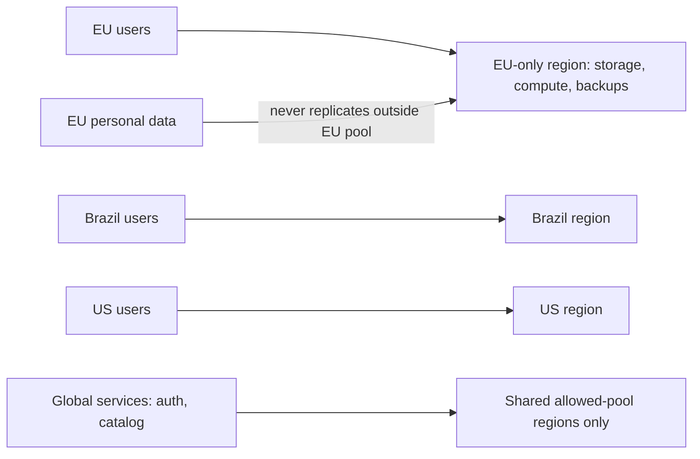

# Data Residency and Sovereignty

## 1. One-Line Definition
Data residency and sovereignty are legal/contractual constraints that (a) pin where data may *at rest* live and be backed up (residency) and (b) assert that a nation's law governs, and may compel access to, the data stored under its jurisdiction (sovereignty) — shaping every region and replication decision in a global system.

## 2. Why Do We Need It?
A global system is subject to many overlapping laws at once, and they can outright conflict. GDPR limits where EU personal data is processed, explicit consent controls transfers; other regimes require data to remain inside the country or reserve the right to compel disclosure of anything physically stored there. If your "one big database in region X" happens to hold data from twenty jurisdictions, some of that data is being processed or stored illegally — a fineable, brand-hurting, and sometimes criminal failure. Residency turns a *technical* decision (where do I run?) into a *legally binding* one, and it usually comes with hard architecture knock-ons: you may not be able to replicate, route, or even encrypt-control data the way you'd like.

## 3. Simple Intuition
A country requires that all patient medical images be stored inside its borders, under its own hospital systems. You don't get to "keep a copy in another country" just because it's convenient — the copy itself becomes a violation, and the foreign government now also has a lever on your data. So you run a local hospital wing: compute local, storage local, backups local, and global features either don't see that data or see only what's legally allowed to leave.

## 4. What Happens Without It?
A US startup with a database in eu-west and no residency design may: replicate EU user data to the US (illegal transfer), back it up in a non-EU region (violation), have US-support engineers view PII (illegal access), and route EU requests through non-EU nodes for latency or caching (processing outside the borders). Result: regulatory fines, forced deletion orders, or suspension from a market — and once wrong, the cost of retrofitting residency into live architecture is far worse than designing it in.

## 5. Core Idea
- **Residency is where data can *at rest*, be processed, and be backed up.** "Where" means the physical and cloud-jurisdiction location of primary storage, replicas, snapshots, caches, logs, and the compute that touches the data.
- **Sovereignty is who can compel access.** If the data physically sits in jurisdiction J, J's law can subpoena it. Choosing a region is also choosing which legal systems can reach your stored data. Some workloads add *stored-data encryption with keys held outside the host country* so even a compelled disclosure returns ciphertext.
- **Transfer vs processing:** some laws regulate *moving* data out (GDPR Chapter V, SCCs), others regulate *sensitive processing* in-country. Both beat hard on architecture: replication, logging pipelines, and even customer support tooling count as "processing".
- **Enforcement by geography:** the common patterns are *regional partitions* (each market's data lives and is processed in its own region/set of regions), *allowed-region pools* (data may live in a compliant set, e.g., EU-only), and *local-key/hold-your-own-key* encryption so the region's operator can't read the data either.
- **It is not the same as backup/RPO:** residency adds constraints on *where* the copy is, independent of how much data you can lose.

## 6. Important Terminology

| Term | Simple Meaning |
|------|----------------|
| Data residency | Legal/contractual rule on where data may permanently live |
| Data sovereignty | A state's legal power over data physically in its territory |
| Jurisdiction | The country/legal system whose law governs the data |
| Personal data / PII | Data identifying a person; heavily regulated |
| Cross-border transfer | Moving data to another jurisdiction (needs legal basis) |
| Regional partition | Assigning each market's data to compliant regions |
| Hold-your-own-key | Customer controls the encryption key; provider can't read |
| Public cloud region | A data center in a specific country/region under its law |
| Sensitive data | Special-category data (health, finance, location, identity) |

## 7. Basic Architecture



Data is partitioned by jurisdiction; everything touching a jurisdiction's data — including backups, caches, logs, and support access — stays inside that jurisdiction's allowed pool.

## 8. Request or Data Flow
1. User in the EU signs up. A residency classifier tags the tenant/user as an EU subject and assigns a compliant home pool (EU-only).
2. Reads/writes for that user route only to EU-pool regions (via [[locality-based-routing|Locality-Based Routing]] and profile/pool metadata in the request path).
3. Backups, snapshots, and disaster-recovery copies of that data are configured to EU-pool regions only (this constrains [[regional-failover|Regional Failover]] destinations: your failover target list is now "allowed pools", not "any region").
4. Analytics and support pipelines that would ship the data elsewhere either get anonymized copies or are dropped for that jurisdiction.
5. A denial: an EU user in Tokyo on vacation still hits the EU pool for their personal data — locality may win for latency only where law allows.

## 9. Practical Example
A multinational bank serves EU and US retail users from one product.
- EU: all current-account data must be processed in the EU pool; backups in eu-west-1 only; US support agents get masked views; log shipping to the US is stripped of PII fields; DR standby is *also* in the EU pool.
- US: allowed pool is US-only; the reverse constraints apply to EU replication.
- Because DR cannot cross the border, [[regional-failover|Regional Failover]] for EU data must move between two EU regions, not to the US — even if the US region is healthier. This is the architectural cost: compliance shrinks the failover candidate set and sometimes forces three regions (two EU + one US) instead of a cheaper two.

## 10. Scaling
- **Residency doesn't reduce data;** it *fragments* it. You now run one such system per market pool, so total cost is roughly `(after: 3 pools) vs (before: 1 slab)`, plus per-pool replication.
- **Shared services complicate it:** one auth/catalog database that serves all markets is now the residency hot potato — either partition it (per-market PK) or prove every market's data can stay compliantly pooled. Usually the pragmatic answer is a **global-tenant-proxy** (each market's rows live in their pool) rather than one merged store.
- **Latency is the tax:** the data you promised to keep in Brazil is in Brazil, even when only a US node is underutilized. Capacity planning must redo the "nearest node" math per pool.
- **Auto-scaling and jobs:** sweepers, rebalancers, and ML jobs that "scan the whole DB" now must run per-pool or be restricted — a global job may be the first place residency is accidentally violated.

## 11. Reliability and Failure Scenarios

| Failure | What Happens | Detection | Recovery | Trade-off |
|---------|--------------|-----------|----------|-----------|
| The only residential region for a market fails | Cannot legally fail over elsewhere | Region health against allowed-pool list | Failover within pool or declared active-passive inside pool | two regions minimum per pool |
| Compliance change (new law) | Current architecture now illegal | Legal/GRC review pipeline | Re-classify data, migrate pool | multi-week migration program |
| Offshore backup accidentally created | Residency violation in the copy | Backup-location audit | Delete/relocate copy, attest | continuous audit cost |
| Key-holder (customer) loses keys | Undecryptable production data | Key metrics | Operational contingency (escrow) | provider can't "help" extract data |
| Support sees raw PII | Access violation | Access audit on support | Masking + least privilege | support is slower/limited |

## 12. Consistency and Correctness
- Residency constraints reassign "where writes commit", which interacts with consistency: a user's data physically can't replicate to a forbidden region, so the geo-DNS/steering must *never* send the owner's read to a non-allowed region (correctness in the legal sense, independent of click ordering).
- **Consent/classification is a consistency problem:** the tenant/user's jurisdiction tag must be identical everywhere (the request that "thought" the user was EU vs US routes differently). Keep the classification in the identity/store and version it; re-classification (EU → US, or rule change) is a data-migration event that must be ordered and auditable.
- Idempotency still applies: a replay of a write must land in the *same* allowed pool as the original, or you've created a duplicate in a wrong jurisdiction.
- Deletion obligations (right-to-erasure) make copies*the* enemy: every replica/snapshot/log the residency rules bless must also be *erasable* — TTL'd, with purge certification, not just "overwritten eventually".

## 13. Performance
- Latency: pooling data into a market's region can *increase* latency for users elsewhere (an EU user's data is always EU-side, even on a US trip). This is the price of compliance; [[locality-based-routing|Locality-Based Routing]] is bounded by the law.
- Throughput: global scale-up is slower — you can't "merge into the biggest region"; you scale per-pool, and cross-pool reads (reporting on multiple markets) are partitioned/aggregated rather than single-query.
- Overhead: per-pool replication, key management, masking transforms in every pipeline, and audit tooling add real money and compute; build the cost into estimates ([[capacity-estimation|Capacity Estimation]]).

## 14. Security
- The *driver* of residency is legal/contractual, but encryption is the practical enabler: **at-rest encryption with keys (or [[encryption-and-keys|Encryption and Keys]] control) held in the allowed jurisdiction**, TLS in transit everywhere, and masked views for support/offshore tooling.
- Sovereignty means your host country can be *compelled* — so even the cloud provider's admin reading your blob matters; hold-your-own-key or customer-managed KMS moves the read-capability out of the provider's hands.
- Encryption does not make residency "fine to copy": ciphertext of EU data at rest in the US is still a *copy of EU data* for GDPR — encryption reduces the risk of disclosure, not the residency violation. Never ship "encrypted copies" as a workaround.

## 15. Trade-Offs

| Choice | Advantages | Disadvantages | When to Use |
|--------|------------|---------------|-------------|
| Regional partition (per-market pools) | Clean compliance, simple reasoning | Cost × pools, fragmented global features | Multi-jurisdiction products |
| Allowed-region pool (e.g., EU-only) | Fewer pools, simpler | Still excludes some markets/regions | "EU + US" SaaS |
| Global store + strict masking/labels | One system, shared features | High audit + feature-gating complexity | When data is mostly non-sensitive |
| Provider-managed keys | Simple ops | Provider can read data on demand | Low-sensitivity data |
| Hold-your-own-key | Sovereignty even from provider | Key-lifecycle risk, slower recovery | Regulated/financial data |

Honest limitation: full compliance is only satisfied at the *intersection* of where you store, process, back up, and let staff access — one out-of-policy analytics copy invalidates the whole posture; this is why residency is an operational discipline, not a checkbox.

## 16. Common Mistakes
- Treating residency as an architecture footnote: "we'll encrypt and it's fine" — encryption is not transfer-approval or storage-approval.
- Building global replication *then* discovering forbidden copies: design the replication graph inside the allowed pools from day one.
- Routing EU users through a US edge/CDN with personal data in payloads — edge caching is *processing*; strip PII before it touches non-allowed cache nodes (see [[edge-computing|Edge Computing]]).
- Global analytics pipelines that pull all markets into one warehouse — the single most common accidental violation.
- Ignoring *support access*: Least-privilege and masking for humans is residency enforcement, same as storage.

## 17. HLD vs LLD Boundary
HLD: jurisdiction → allowed-pool mapping, region topology per market, DR/backup pool constraints, classification and re-classification policy, feature-masking policy for cross-pool features. LLD: the storage-engine flags that pin replicas to pools, backup config per region, masking transforms, access-audit hooks, key-rotation automation.

## 18. Interview Questions

### Beginner
- What is the difference between data residency and data sovereignty?
- Why does encrypting a dataset not make it "safe to store wherever"?

### Intermediate
- A SaaS wants EU + US users from one codebase. Design the storage split and say what breaks for features that span both.
- Your DR plan says "fail over to the nearest region". Why does that plan fail the compliance review, and how do you fix it?

### Advanced
- Design a re-classification migration: a rule change makes a whole cohort's data leave the EU pool. What are the ordered, idempotent, auditable steps?
- How do you keep global analytics while respecting per-pool residency — where does the line get crossed and what's the alternative?

## 19. Interview Memory Summary

> [!abstract]- Interview Memory Summary

### Remember

- Residency = where data may live/process/back up; sovereignty = which law can compel access to it.
- Choosing a cloud region is choosing a legal system that can touch the data.
- Copies count: replicas, snapshots, logs, edge caches, and warehouses are all "storage" for compliance.
- Region choice is also failover choice: DR targets must be inside the allowed pools.
- The usual builds: regional partitions, allowed-pool regions, hold-your-own-key, masked support access.
- Encryption protects confidentiality, not the residency violation — a US copy of EU data is still a violation.
- Latency suffers for out-of-pool users; capacity plans per pool.
- Global/reporting pipelines are where the accidental violations happen.

### 30-Second Explanation

Data residency pins where data may rest/process/backup; sovereignty says the jurisdiction holding the data may compel access, so region choice is a legal commitment. The architecture responds with per-market regional partitions (or allowed pools), DR/backups inside those pools, masked cross-pool processing, and keys held by the data owner — knowing encryption cannot legalize a copy, only protect it.

### Interview Traps

- Offering encryption as the residency solution.
- Proposing "failover to any nearest region" without consulting the allowed-pool list.
- Shipping PII through edge/CDN caches or global analytics lanes unexamined.
- Forgetting support/ops staff count as data processors.

### Key Trade-Off

You buy legal compliance and sovereignty posture, and you pay in fragmented pools, per-market capacity and DR builds, and latency for users outside their data's home region — compliance shrinks your architectural options before any performance decision.

## 20. Related Concepts

### Prerequisites

- [[multi-region-models|Active-Active vs Active-Passive Regions]]
- [[encryption-and-keys|Encryption and Keys]]
- [[authentication-vs-authorization|Authentication vs Authorization]]

### Commonly Used Together

- [[cross-region-replication|Cross-Region Replication]] — the replication graph must stay inside allowed pools.
- [[regional-failover|Regional Failover]] — failover targets are constrained by residency.
- [[locality-based-routing|Locality-Based Routing]] — routing users to pools, bounded by the law.
- [[geo-dns-anycast|Geo-DNS and Anycast]] — steering that must know the jurisdiction rules.

### Alternatives

- Allowed-pool pooling vs strict per-market partitioning (fewer pools, cheaper, less flexible).
- Global-store-with-masking (when data is mostly low-sensitivity and audit is strong)

### Advanced Concepts

- [[global-consistency|Global Consistency]] — how far you can replicate, given which jurisdictions are in the graph.
- [[edge-computing|Edge Computing]] — edge nodes are extra "places data could land"; residency limits what they may touch.

Related planned topics (not authored yet): tenant isolation/audit trails, data masking/privacy, cloud infrastructure (regions/AZs).

## 21. References
Foundations: GDPR (Regulation (EU) 2016/679) for EU data- processing/transfer rules and definitions of PII; consulting legal counsel is mandatory, this concept is the architecture-side framing. Cloud residency docs (AWS/Azure/GCP region and data-residency pages) are the technical authority for "what is stored where" claims.

## 22. Active Recall

Test yourself before revealing each answer.

> [!question]- Data residency vs data sovereignty — concrete difference?
> **Residency**: regulations/contracts decide where data may physically rest, process, and be backed up (e.g., "EU personal data stays in the EU"). **Sovereignty**: the state that physically holds the data can compel access to it (subpoena/court order), so *where you store it* determines *which law can seize it*. Storing in the US makes the data answerable to US law, even for a French user.

> [!question]- Why doesn't encryption solve a residency violation?
> A "fully encrypted" EU dataset stored in the US is still a **copy of EU personal data outside the EU** — GDPR regulates the storage/processing location itself, not just readability. Encryption reduces disclosure risk (if anyone can read the data at all) but does not approve the transfer or the copy; the violation stands on location alone.

> [!question]- How does residency change your DR/failover plan concretely?
> The failover candidate list is no longer "any healthy region" — it is **only the allowed pools for that jurisdiction**. EU data must fail over between EU-pool regions; a US standby for EU data is a violation even though it's technically the healthiest target. Net effect: you need ≥2 regions *inside each pool*, and residency dictates the DR topology.

> [!question]- What are the usual architectural patterns for mixed-jurisdiction products?
> **Regional partition** (each market's data lives and processes in compliant regions, from storage to backups to support), **allowed-region pool** (e.g., EU-only pool shared across EU markets), **hold-your-own-key** (customer-managed KMS so the provider can't read even under compulsion), and **masking + least-privilege** for any cross-pool human or pipeline access.

> [!question]- A rule change forces a cohort of EU users to be classified as US-residents. Walk what has to happen in the data plane.
> **Re-classification is a data migration**, not a config flip: 1) freeze the classification source (versioned, identical everywhere), 2) migrate each affected dataset from EU pool to US pool with **ordered, idempotent copies**, 3) flip routing to the new pool via the routing metadata, 4) erase EU-pool copies (right-to-erasure applies) with certification, 5) update failover/backup pools and support access, 6) audit that no EU copy remains. Any partial copy left behind is a continuing violation.

> [!question]- Where do residency violations most commonly creep in silently?
> In the **derived copies humans forget are "storage"**: log pipelines, CDN/[[edge-computing|Edge Computing]] caches, global analytics warehouses, customer-support queries, and DR backups. Each is a *processing location*; a PII-bearing log routed through a US k8s cluster or an analytics batch pulling all markets into one warehouse violates residency exactly as if the DB itself moved.

> [!question]- How do you keep one global product with per-pool residency without building three apps?
> Keep the **global layer non-sensitive and pool-relevant**: tenant/provider identifiers, catalog, feature config live in shared/allowed pools; per-jurisdiction personal data is **partitioned by key** into its pool (see [[sharding-strategies|Sharding Strategies]] per-market slices). A "global query" becomes a **per-pool fan-out** — an [[event-driven-architecture|event-driven]] aggregation, not a single cross-pool SELECT. This is the cost: global features pay in partitioning and assembly, not in code forks.

## 23. When Should I Use This?

### Use it when

- You store or process personal/sensitive data for users under a jurisdiction whose rules you must obey.
- You operate in two+ legal regimes (GDPR, LGPD, PIPL, etc.) with different storage/transfer expectations.
- Contract clauses (a bank, a government customer) dictate where their data may live.
- You ever replicate, cache, back up, or log data — and want to know which of those copies are now illegal.

### Avoid it when

- Not needed as a distinct concept: single-jurisdiction, single-region data with no transfer — residency is just "your home region", though sovereignty still matters.
- The compliance burden (audit, masking, per-pool architecture) outweighs a simple "stay in your market" rule you can already satisfy trivially.

### What problem does it solve?

It prevents legal/contractual violations arising from *where* data physically lives, is processed, is backed up, and can be reached by law — turning "random global sprawl" into a demonstrable, auditable, build-able placement policy.

### What problem does it NOT solve?

It does not author law or approve transfers (that's legal counsel) and does not replace security: residency is placement discipline and sovereignty softboundaries; a glaring auth bug or a leaked key is still a breach regardless of which region the data sat in.

## 24. Decision Connections

Decisions that go together with data residency:

- [[multi-region-models|Active-Active vs Active-Passive Regions]] — the model's replication footprint is subordinated to the allowed-pool list.
- [[cross-region-replication|Cross-Region Replication]] — the replication graph must never leave the pools; lag is computed inside them.
- [[regional-failover|Regional Failover]] — failover candidates are the allowed pools, which can force a third region.
- [[locality-based-routing|Locality-Based Routing]] — routing users to their pool; the law is a harder constraint than latency.
- [[geo-dns-anycast|Geo-DNS and Anycast]] — steering must know the jurisdiction rules, not just geography.
- [[edge-computing|Edge Computing]] — edges are extra "places data could land"; PII must be stripped before it touches them.
- [[encryption-and-keys|Encryption and Keys]] — at-rest key control is the sovereignty tool (hold-your-own-key).

Decision tree:

```
Which jurisdictions' data do you hold?
    |
    +-- Single jurisdiction, no transfers?
    |      → residency is mostly "home region"; check sovereignty anyway
    |
    +-- Multiple jurisdictions with transfer rules
    |      |
    |      +-- Sensitive data must stay in-market?
    |      |      → [[data-residency|Data Residency and Sovereignty]] regional partition
    |      |         +-- backups/DR → pools only, ≥2 regions per pool
    |      |         +-- analytics  → masked/per-pool fan-out, never global merge
    |      |         +-- keys      → [[encryption-and-keys|Encryption and Keys]] hold-your-own-key
    |      +-- Low-sensitivity, strict access audit possible?
    |             → shared pool + masking + least privilege
    |
    +-- Every replication/failover/cache decision
           → check against allowed pools FIRST (see [[cross-region-replication|Cross-Region Replication]], [[regional-failover|Regional Failover]])
```