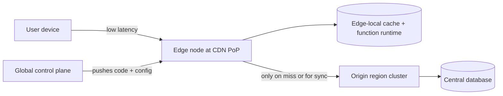

# Edge Computing

## 1. One-Line Definition
Edge computing runs computation and data near the end user — at CDN points of presence, ISP exchanges, or on-device — instead of in one distant central region, trading reduced latency and bandwidth for distributed state and management complexity.

## 2. Why Do We Need It?
The laws of physics set a floor on central-region latency: a round trip between the US East Coast and Europe is ~120+ ms, and no software fixes that. Some workloads (live video, real-time gaming, IoT sensors, AR) cannot tolerate a multi-hundred-ms round trip to a far-away data center, and some produce so much data that shipping it all home is wasteful or impossible. Edge computing moves the compute close to the user so the distance that actually matters collapses, and pushes heavy compute off the user's device.

## 3. Simple Intuition
A fast-food chain's head office (the central data center) decides the menu, but every branch has its own kitchen (the edge) so lunch is served in minutes instead of waiting for a meal flown in from headquarters. The kitchen handles the time-sensitive, repetitive work locally; the head office still runs branding, analytics, and menu changes. The branch even keeps working for a short time if head office goes dark.

## 4. What Happens Without It?
Interactive users feel worst-case cross-region latency; video/IoT streams burn huge backbone bandwidth hauling traffic to a distant center and back; devices either stall waiting for a far server or run the work locally and lose global coordination. Latency, bandwidth cost, and availability (waiting on a far-away server for everything) all degrade together.

## 5. Core Idea
- **Edge is a spectrum, not one thing:** client device → ISP/on-prem node → CDN/cell-site PoP → regional small data center → central region. The closer to the user, the lower the latency but the more constrained and numerous the nodes.
- **CDNs are the mature form of edge:** [[cdn|CDN and Edge Caching]] already run at thousands of PoPs; edge compute extends those PoPs from "serve cached objects" to "run functions", which is where the term *compute-at-the-edge* comes from.
- **Execute near the data / near the user:** the two motivations are (a) latency — respond to the user locally, and (b) egress — filter/reduce data before it crosses expensive links.
- **Edge functions are applicable for stateless transforms:** image/video processing, request shaping, authentication light checks, geo-specific content, sensor aggregation. Stateful global coordination does not belong at the edge.
- **The edge must stay in sync:** code and configuration are pushed from the control plane to thousands of nodes; nodes must be pull-based and decentralized so a control-plane outage doesn't take the edge down.

## 6. Important Terminology

| Term | Simple Meaning |
|------|----------------|
| Edge node | A small computer near users (PoP, cell tower, branch, ISP) |
| Edge compute | Serverless/function code executed on edge nodes |
| CDN PoP | Point of presence: a caching + compute node close to users |
| Origin | The central/regional server that holds the canonical data |
| Egress cost | Charge/tax for traffic leaving a cloud/backbone |
| Compute-at-edge | Running code (not just caching content) at edge sites |
| On-prem/on-device | Edge on customer hardware or in the app itself |
| Control plane | The central system deploying config/code to edge nodes |
| Edge-local state | Data kept only at an edge node, not replicated centrally |

## 7. Basic Architecture



The user talks to a nearby node; only cache misses, writes, and coordination go to the origin — and then they travel a short, batched path, not the user's full interactive path.

## 8. Request or Data Flow
1. A user request hits the edge node (chosen by [[geo-dns-anycast|Geo-DNS and Anycast]] or anycast).
2. The edge function/edge cache serves it locally when possible: image resizing, device-geo content, auth hints, request shaping — all without leaving the PoP.
3. On a cache miss or stateful write, only the *needed* call goes to the origin region.
4. The origin updates its DB and later propagates state changes back to edges (cache invalidation, config, model updates) in the background.
5. The control plane continuously deploys new code/config to every edge node so behavior stays consistent-ish despite decentralization.

## 9. Practical Example
A live-video/photo app with IoT cameras:
- Camera uploads must land quickly: without edge, a camera in Mumbai sends to a US region (~200+ ms each way, costly, fragile). With an edge ingest node, the camera writes to a nearby PoP in ~30 ms, the PoP validates/shapes/transcodes it, and forwards a reduced, batched copy to the central region for storage and analytics — cutting upload latency and egress bandwidth together.
- A CDN-primed video viewer gets start playback from the same PoP in tens of ms instead of waiting for a far-away origin.
- Latency numbers: Mumbai→US ~200-250 ms RTT vs Mumbai→local PoP ~20-40 ms — an order of magnitude before any server touches it.

## 10. Scaling
- **Scaling is horizontal at the edge by default:** a thousand small nodes is normal; you scale by adding PoPs/sites, not by growing a central fleet.
- **What breaks at scale:** the *control plane* (deploying code/config to thousands of nodes), state divergence across nodes (each has its own cache/state), and observability (traces across a million distributed nodes). Central services must not be on the user's hot path.
- **Stateless is the keyword:** edge nodes that only reshape/read are trivially scalable; edge nodes that hold mutable state must either treat it as cache (reconstructible) or own writes within a small geographic domain (edge-local cells).

## 11. Reliability and Failure Scenarios

| Failure | What Happens | Detection | Recovery | Trade-off |
|---------|--------------|-----------|----------|-----------|
| Edge node dies | Local users rerouted to next-nearest node | Node health | Route via DNS/anycast to sibling; origin still fine | users may take longer paths temporarily |
| Control plane down | No new deploys; running code keeps serving | Control-plane health | Built-in rollback/last-known-good | edge must run decentralized (pull) not wait on pushes |
| Edge ↔ origin link degrades | Misses become slow | Origin health + link latency | Prefetch/warm edge, batch sync | freshness of edge copies |
| Origin region down | Misses fail; cached/edge-local work continues | Cache-hit serving + origin health | Serve stale-from-cache + queue writes | serving possibly stale data |

## 12. Consistency and Correctness
- Edge nodes hold **caches and local copies**, never the master copy: origin remains the system of record, which keeps consistency solvable (invalidate/refresh from the center).
- What is consistent matters per workload: edge-cached content is "eventually stale by design" (TTL), edge transforms are stateless (read input, emit output), edge writes must be idempotent and queued for the origin if the center is unreachable.
- Never build cross-edge read-modify-write or global serialization at the edge — that reintroduces the very round trips you removed.
- Push updates from control plane are orderable (config versioning); merges across edges are not — keep the merge logic central.

## 13. Performance
- Latency win is typically **10-100x for the user-facing hop** (from the device to the origin, a cross-continent RTT collapses to a local-node RTT).
- Throughput: edges absorb and shape traffic locally, so origin QPS and backbone bandwidth drop; egress bills shrink.
- Costs: cache invalidation bandwidth, control-plane deploy fan-out, and duplicated storage per edge must be paid back by the savings — often worth it for media but silly for small, write-heavy admin data.

## 14. Security
- Edge nodes are _more_ exposed than central regions: thousands of small, hardware-finite servers in less-controlled locations. Assume compromise on one node is possible, so edge secrets must be minimal, short-lived, and edge code must not have blanket access to the central DB.
- Do network-level DPI/WAF/DDoS scrubbing at edges to protect the origin — edges are natural scrubbing points.
- TLS termination at edge is convenient but means plaintext beyond the edge: for regulated data, prefer pass-through/private connectivity to the region and keep decryption inside the trusted center.

## 15. Trade-Offs

| Choice | Advantages | Disadvantages | When to Use |
|--------|------------|---------------|-------------|
| Edge compute vs central region | Low latency, cheap egress, resilience to far-away outages | Distributed state, control-plane complexity, harder ops/audit | Latency/bandwidth-sensitive ingestion and content |
| Edge-local cache vs origin reads | Fast hits, less backbone | Stale data, invalidation work | Read-heavy, mutable-at-low-rate content |
| Full edge state vs stateless edge funcs | Rich features on the edge | Consistency pain, sync cost | Edge-local authority patterns (cells) |
| On-device edge | Zero network latency, offline | Cannot enforce updates, device diversity | Mobile apps, IoT |

Limitations stay honest: global consistency cannot be bought at the edge; every edge node that mutates state alone is a partition that must be merged; and operational surface area (storage, keys, config on a million nodes) is far bigger than a couple regions.

## 16. Common Mistakes
- Putting *stateful global* coordination at the edge — same request to the same user must touch the same store, but the "same store" is now spread thin and far.
- Treating edge nodes as just "small servers": they die and change identity constantly; anything pinned to a specific node will break.
- Assuming edge caches are fresh: serving stale config/code for long after a deploy because invalidation wasn't designed in.
- Building edge functions that invoke the origin for every request anyway (no benefit beyond CDN).
- Ignoring security: edge nodes are attacker-accessible; storing origin credentials in thousands of places multiplies your blast radius.

## 17. HLD vs LLD Boundary
HLD: decide what runs at the edge vs origin (the "edge/origin split"), what is cacheable, the sync and invalidation protocol, deploy/rollback mechanics, and per-market placement. LLD: the function SDK, edge pod config, invalidation hooks, per-node metrics and log shipping.

## 18. Interview Questions

### Beginner
- What is the difference between edge caching and edge compute?
- Why does "the user is far from the server" defeat most software-only optimizations?

### Intermediate
- Pick a workflow (e.g., IoT photo upload) and show where the edge sits between device and region — what runs where?
- The origin region is down. What still works at the edge, and what has to wait?

### Advanced
- How do you keep code and config up to date on a million edge nodes when the control plane is flaky, and why can't you serve a new config from the origin's hot path?
- Design an edge write path that doesn't lose writes during an origin outage but also doesn't break global uniqueness.

## 19. Interview Memory Summary

> [!abstract]- Interview Memory Summary

### Remember

- Edge = compute/data near the user: on-device → PoP → small region → central region; closer = lower latency, harder ops.
- The two motivations: **latency** (user-facing hop) and **egress/bandwidth** (don't ship everything home).
- Edge nodes are caches and stateless transforms by default; the **origin stays the system of record**.
- The control plane is the coordination problem: deploy + sync to thousands of nodes, and don't let it sit on the hot path.
- Edge scales by adding sites; consistency is solved by invalidation and idempotent queued writes, not global merges.
- Security: edges are exposed and multiplied — minimal secrets, short-lived, no blanket DB access.
- [[cdn|CDN and Edge Caching]] is the mature, content-only predecessor; edge compute adds programmable behavior.

### 30-Second Explanation

Edge computing runs time-sensitive compute and caching on nodes close to the user (CDN PoPs, cell sites, on-device), collapsing cross-continent RTT to a local hop and shrinking backbone egress. Cache misses, writes, and coordination go to the central origin in batched form; the origin remains the source of truth and a control plane pushes code/config to every node. Use it when latency or egress dominates; avoid it for stateful global coordination that must stay strongly consistent.

### Interview Traps

- Claiming edge gives strong global consistency — it gives local freshness at best.
- Treating "edge" as one magic tier instead of a spectrum with different latency/ops budgets.
- Designing edge functions that still bounce every request to the origin.
- Forgetting that thousands of small exposed nodes multiply your security footprint.

### Key Trade-Off

You trade central simplicity for per-user latency and egress cost — and you buy them with distributed state, control-plane complexity, and a vastly larger operational surface.

## 20. Related Concepts

### Prerequisites

- [[cdn|CDN and Edge Caching]]
- [[caching|Caching]]
- [[latency-vs-throughput|Latency and Throughput]]

### Commonly Used Together

- [[geo-dns-anycast|Geo-DNS and Anycast]] (routes users to the nearest edge/PoP)
- [[locality-based-routing|Locality-Based Routing]] (making requests stick to the nearby region)
- [[multi-region-models|Active-Active vs Active-Passive Regions]] (edge sits in front of regional clusters)

### Alternatives

- [[cdn|CDN and Edge Caching]] (content-only, no code execution)
- Centralized processing in one region (when latency/egress don't justify the edge)

### Advanced Concepts

- [[cross-region-replication|Cross-Region Replication]] (how dirty edge writes get back to the center)
- [[global-consistency|Global Consistency]] (the limits edge state hits)

Related planned topics (not authored yet): serverless/FaaS, cloud infrastructure (regions/AZs).

## 21. References
CDN-with-compute behavior is described in current CDN/cloud-edge service docs ("CloudFront/Lambda@Edge"-class offerings); the edge-vs-cloud trade-off reasoning appears in standard system-design literature on global services. Verify pricing/egress numbers against current cloud pricing docs before citing them.

## 22. Active Recall

Test yourself before revealing each answer.

> [!question]- What are the two independent reasons to move work to the edge?
> **Latency**: the user's request should not travel a cross-continent RTT to a far region — a local hop is 100x closer. **Egress/bandwidth**: stream/upload data should be shaped or filtered near the user so the backbone carries less and the paid-for link (and storage) is smaller.

> [!question]- Where does "the source of truth" live in an edge architecture, and why?
> In the **central origin region**. Edge nodes hold caches and local copies; the origin owns the canonical dataset and the merges/invalidation. This keeps consistency solvable — edge-local mutable masters would force global merge logic into a distributed mess.

> [!question]- An origin region is unreachable. What keeps working at the edge?
> Everything that only **reads caches or does stateless transforms**: serving cached content, image resizing, auth hints, request shaping. Writes must be **queued and idempotent** locally and flushed to the origin when it returns — but any operation needing the master store waits.

> [!question]- Why is the control plane the hard scalability problem in edge computing?
> You have thousands of nodes, flaky links, and nodes that die/rotate identity. Pushing code/config fast-to-all with rollback, versioning, and pull-based convergence is a distributed deployment problem on its own — and it must not sit on the user's request path or every edge request becomes a central round trip again.

> [!question]- When should you NOT use edge compute?
> When traffic is small, write-heavy, and needs strong global consistency (every write must touch one authoritative store — the edge adds nothing but stale copies), when the team can't run the sync/invalidation/deploy machinery, and when a [[cdn|CDN and Edge Caching]] already covers the static latency problem without any code.

> [!question]- How do you keep an edge-deployed secret from becoming a fleet-wide breach?
> Give edge nodes **minimal, short-lived, scoped credentials** (a per-node identity that can only do its narrow job), never the origin's master keys, and rotate on a sub-minute cadence. Assume one edge node is always compromised; design so that a single node's loss is contained.

> [!question]- Your edge node serves a stale cache of a config that changed centrally. What's the failure chain and the fix?
> Invalidation didn't reach the edge (link, TTL, or no invalidation design) or a deploy was pushed to some nodes only. Fix: version every cacheable unit, make nodes pull-and-validate on an interval with a version header, and serve last-known-good rather than silently stale on sync failure.

## 23. When Should I Use This?

### Use it when

- The user-facing latency of a distant central region dominates the experience (video, gaming, IoT, ML at the edge).
- Ingest or egress bandwidth/cost from the backbone is a top-three cost.
- A workload decomposes into "local stateless/cacheable transform + rare center sync".
- You already run a [[cdn|CDN and Edge Caching]] and want programmable behavior at those PoPs.

### Avoid it when

- Traffic is mostly small, mutable, and requires strong cross-region consistency.
- The team lacks deployment/sync/observability maturity for thousands of nodes.
- A CDN already solves the problem with content caching alone — edge compute buys nothing extra to pay for its complexity.
- Global coordination (leader election, serialization, strict ordering) is on the hot path.

### What problem does it solve?

It moves work and data close to the requester, so latency drops from cross-continent RTT to a local hop, backbone egress shrinks, and users remain served even when a far region fails — saving the two things a central cluster cannot: distance and round-trip time.

### What problem does it NOT solve?

Strong global consistency (edge copies are stale by design), global uniqueness/serialization (cannot be ordered at the edge), disaster recovery for the central system itself, and operational simplicity — it trades central ease for distributed-surface pain.

## 24. Decision Connections

Decisions that go together with edge computing:

- [[cdn|CDN and Edge Caching]] — the proven edge for static content; edge compute extends those PoPs with code.
- [[caching|Caching]] — every edge node is a cache first; the invalidation/versioning rules carry over.
- [[geo-dns-anycast|Geo-DNS and Anycast]] — how users actually find the right edge node instead of the central region.
- [[locality-based-routing|Locality-Based Routing]] — pinning session-heavy traffic to the region near the user.
- [[cross-region-replication|Cross-Region Replication]] — the pipeline that returns edge writes/events to the origin and fans changes back out.
- [[latency-vs-throughput|Latency and Throughput]] — the metric that justifies the whole architecture.
- [[multi-region-models|Active-Active vs Active-Passive Regions]] — the regional footprint the edge sits in front of.

Decision tree:

```
User-facing latency or egress too high from one region
    |
    +-- Problem is static content?
    |      → [[cdn|CDN and Edge Caching]]
    |
    +-- Dynamic, per-request transformation needed at the PoP?
    |      → [[edge-computing|Edge Computing]]
    |         |
    |         +-- Requests are stateless reads/transforms? → edge serving + [[caching|Caching]]
    |         +-- Writes must never wait for a far origin?  → edge ingest + queue
    |         +-- Strong global ordering required?          → NOT edge; keep central
    |
    +-- Every request must stay near one consistent region?
           → [[locality-based-routing|Locality-Based Routing]] + [[geo-dns-anycast|Geo-DNS and Anycast]]
```