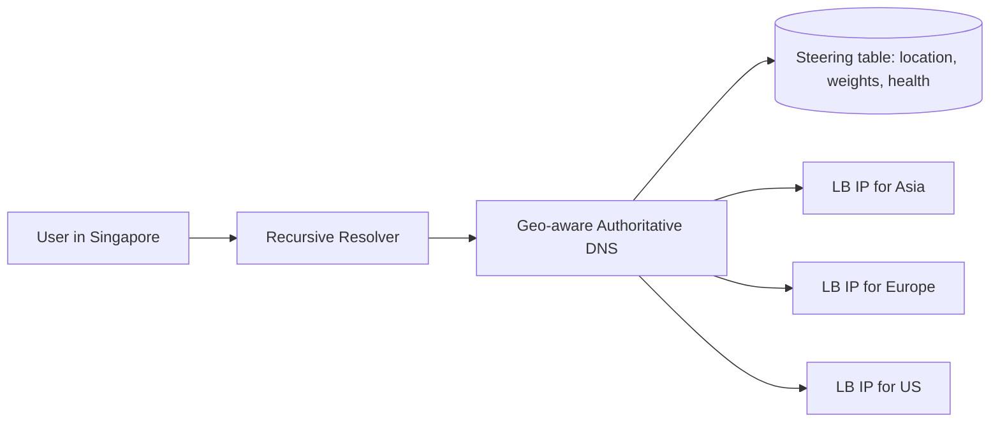
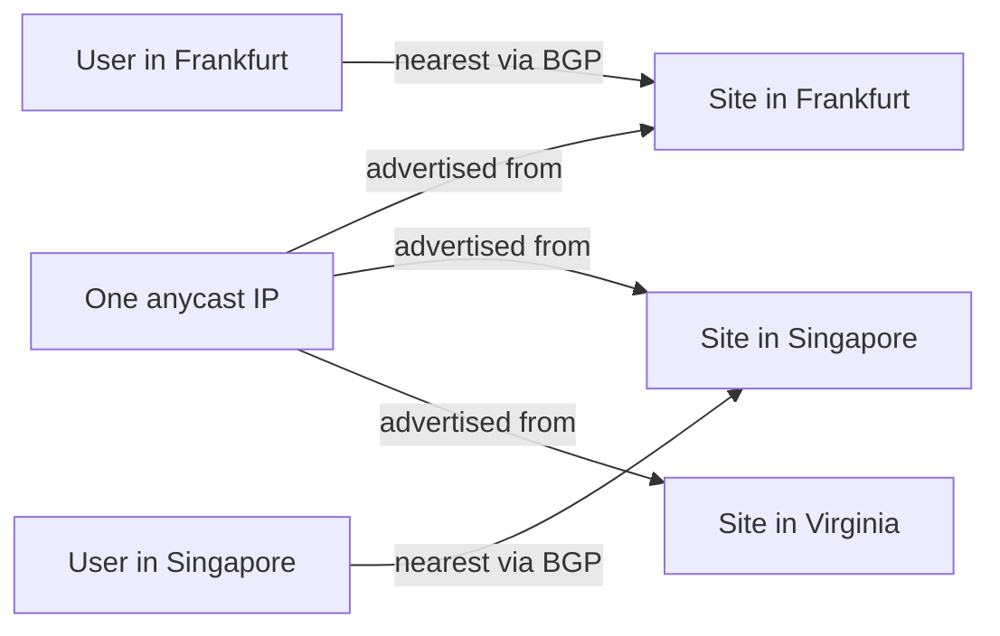

# Geo-DNS and Anycast

## 1. One-Line Definition
Geo-DNS returns DNS answers that point each user at the nearest or healthiest region's load-balancer IP; anycast announces one single IP from many sites and lets the internet's routers themselves forward each user to the closest live site.

## 2. Why Do We Need It?
A global service on one region is slow for distant users (cross-continent RTT of hundreds of milliseconds) and fragile (that one region failing takes the whole product down). You can't fix either with a static DNS record. You need a layer that (a) picks a region per user, (b) skips regions that are unhealthy, and (c) changes fast enough when regions come and go. Geo-DNS and anycast are that layer.

## 3. Simple Intuition
A company has a single 1-800 number but offices in every city. When you call, the carrier (not the company) rings whichever office is geographically nearest — and if that office is closed at 3 a.m., the call rolls to the next city that is open. Anycast is the "same number" trick at the IP level; Geo-DNS is a smarter phone book that looks you up, checks which offices are open, and hands you that office's direct line.

## 4. What Happens Without It?
Without steering, every DNS name resolves to one fixed IP. Users in Asia, Europe, and the US all connect to a single region: the farthest users eat worst-case latency forever, a regional outage becomes a global outage, and you cannot route around a data-center failure or redirect traffic during a DDoS attack. You are effectively single-region no matter how many regions you rent.

## 5. Core Idea
- **Geo-DNS:** the authoritative nameserver is the traffic director. It keeps a *steering table* — regions, their LB IPs, weights, and live health — and looks up the requester's location to answer with the best region's IP.
- **Learning the location:** resolvers can pass the client's subnet via EDNS Client Subnet (ECS); otherwise geo tables fall back to the resolver's own location (coarse and sometimes wrong).
- **Health awareness:** health checks pushed into DNS mean a dead region is removed from answers; this is failover at the DNS layer, but only as fast as health-interval + TTL.
- **TTL is the steering latency:** the resolver/OS/browser cache a DNS answer for its TTL, so old IPs keep receiving traffic until the cache expires — the single most important number for DNS failover speed.
- **Anycast:** instead of DNS pointing to different IPs, the *same* IP is announced (via BGP) from many sites. Routers pick the shortest path, so users naturally land on the nearest site. No cache, no TTL — but you must run the service on every site that advertises the IP, and BGP convergence is slow (tens of seconds to minutes).

## 6. Important Terminology

| Term | Simple Meaning |
|------|----------------|
| Geo-DNS | DNS that chooses an answer based on the requester's location |
| Steering table | Region/LB IP/weight/health data used to pick an answer |
| EDNS Client Subnet | DNS extension the resolver uses to pass the client's subnet |
| TTL | How long a DNS answer may be cached; bounds steering/ failover speed |
| Health check | Probe that marks a region up/down in the steering table |
| Anycast | One IP advertised from many sites; BGP routes users to the nearest |
| Unicast | Each site has its own IP; steering is done by DNS answers |
| BGP | The inter-domain routing protocol anycast relies on for shortest path |
| Latency-based routing | Answers chosen from measured/mapped user-to-region latency |

## 7. Basic Architecture



Anycast alternative: the same IP at every site, routing decision made by BGP:



Geo-DNS is smarter (per-user, health-aware, weighted) but slower to change. Anycast is simpler and self-routing but everything must run everywhere and cuts take minutes.

## 8. Request or Data Flow
1. User asks their recursive resolver for `api.example.com`.
2. Recursive resolver (ideally carrying the client's subnet via EDNS) asks your geo-DNS.
3. Geo-DNS looks up the client's region in the steering table, skips regions flagged unhealthy, and returns the chosen region's LB IP with a short TTL.
4. The client connects to that LB and keeps using it; subsequent requests hit the resolver's cache.
5. If that region dies, the health check flags it, and the geo-DNS answers the *next* lookup with a healthy region — traffic moves as soon as both the check tripped and old TTLs expired.

## 9. Practical Example
A chat app serves users in Singapore and Frankfurt from two regions.
- Singapore user gets a steer-to-Singapore IP: ~40 ms RTT. Without geo-DNS they would hit Frankfurt: ~180 ms RTT — a 4-5x latency tax on every message.
- Frankfurt region goes down at 14:00. Health check trips in 30 s; DNS TTL is 60 s. Frankfurt users see at most ~90 s of errors before their next resolution returns the Singapore IP. That ~90 s is the DNS failover time and is exactly why the TTL is set so low for the primary domain (shorter TTL for failover-critical names; a longer TTL for names that never change).

## 10. Scaling
- **Geo-DNS scales like DNS:** many authoritative nameservers answering in parallel, stateless, trivially horizontal. The steering table is small and cached.
- **Watch TTL growth:** every client/resolver caching your answers multiplies the effective propagation time — a fat TTL (minutes) helps DNS load but punishes failover. Compromise: low TTL (30-60 s) on routing names, normal TTL elsewhere.
- **Anycast scales by adding sites:** more sites = closer users and more DDoS absorption, but every site must genuinely serve the traffic (no "half-runs").
- **Not a load balancer:** DNS spreads users by *geography, not capacity*. A popular region fills up while a nearby one idles — add weighted/ latency-aware answers and let the [[load-balancing|Load Balancing]] layer handle per-region capacity.

## 11. Reliability and Failure Scenarios

| Failure | What Happens | Detection | Recovery | Trade-off |
|---------|--------------|-----------|----------|-----------|
| Region goes down | Users still stuck to that LB IP until health + TTL | Health probe fails | Remove from steering table → next lookup goes elsewhere | failover is 30-120 s, not instant |
| Resolver ignores TTL | Stale IP served for a long time | Compare measured vs expected | Lower TTL further; retrain clients; force IP re-resolution on boot | resolvers may still misbehave |
| Geo-DNS servers die | Lookups fail / old cached answers | DNS health monitoring | Run multiple anycast/geo nameservers in different regions | DNS redundancy is mandatory |
| EDNS breakage | Wrong location guessed → wrong region | A/B latency tests | Fall back to resolver-location geo | coarse accuracy |

## 12. Consistency and Correctness
- DNS is eventually consistent and unordered: different users (and even retries from one user) can legitimately see different region IPs for the same name. That is fine because DNS answers don't mutate state — they only influence *where* a request lands.
- The real consistency risk is *staleness*: an answer cached for its TTL is "correct" for that window, so steering changes (a failover, a new region) take effect differently for every client. You must design the application to tolerate a mixed population pointing at both old and new regions during the transition.
- Don't use DNS answers as a transactional routing decision (e.g., assume every retry of a request lands in the same region). Idempotency lives at the application layer, not DNS.

## 13. Performance
- Geo-DNS gives the headline win: nearest-region steering routinely cuts user RTT by 60-80% (e.g., 240 ms → 50 ms). This is usually the biggest single latency improvement a global system can make.
- Cost: DNS lookups are cached at the OS/resolver, so after the first resolution the added latency is ~0 on the hot path. The real cost is *stale pop* — during failover a fraction of users keep hitting the down region for up to the TTL.
- Anycast adds zero DNS cost after first resolution (the same IP always answers) but pays in BGP convergence time and in "nearest is not always best" — BGP picks shortest network path, which may not be the lowest-latency or healthiest service site.

## 14. Security
- DNS is unauthenticated by default: spoofed resolver traffic or cache poisoning can redirect users to attacker-controlled IPs. Real mitigation is DNSSEC (sign authoritative answers); TLS/HTTPS on the app then makes a wrong IP merely a dead end, not a credential theft.
- Anycast is a native DDoS absorber: a flood is spread across every site advertising the IP; scrubbers and rate limiting still needed.
- Ensure TLS certificates are valid on every region's LB (and on anycast IPs) — users are routed around, so any region must serve the official cert.
- The steering table itself is config: lock it down and audit it — it is the switchboard for all world traffic.

## 15. Trade-Offs

| Choice | Advantages | Disadvantages | When to Use |
|--------|------------|---------------|-------------|
| Anycast | No TTL/caches, self-routing, DDoS absorption | Must run service on every site; coarse routing; slow BGP cutovers | Static IPs, DNS-heavy services (root nameservers, CDN), anti-DDoS |
| Geo-DNS by resolver location | Simple, no client change | Coarse/wrong for shared resolvers | Early global design |
| Geo-DNS with EDNS | Client-accurate geo | Some resolvers don't support ECS | Most global apps |
| Low TTL (30-60 s) | Fast failover | More DNS load, more variance | Routing/failover-critical names |
| High TTL (300+ s) | Cheap, stable answers | Slow steering changes | Names that never move |

## 16. Common Mistakes
- Claiming "DNS failover is instant" — it is bounded by health-interval + TTL + resolver behavior, often one full minute or more.
- Using geo-DNS as a load balancer: geography spreads users unevenly and cannot shed load from a saturated region.
- Setting one global TTL for both static and routing names.
- Ignoring that the client's *resolver* location is used when EDNS is missing — users behind a faraway recursive resolver get misrouted.
- Anycast "set and forget": a corner site that stops serving traffic still advertises the IP for minutes, silently degrading every user routed to it.

## 17. HLD vs LLD Boundary
HLD: choose geo-DNS vs anycast (or both: anycast DNS, geo-DNS app), define steering table contents, set TTLs, define health-check cadence and failover thresholds, decide what "nearest" means per market. LLD: the actual nameserver zone/records, the EDNS client-subnet handling rules, the health-check probe implementation, and BGP advertisement config on each site.

## 18. Interview Questions

### Beginner
- What problem does geo-DNS solve that plain DNS cannot?
- Why does a low TTL speed up DNS-based failover?

### Intermediate
- Your on-call gets an alert that a region is down. Walk the timeline from incident to users being rerouted — what numbers control it?
- Why would users behind one shared resolver (a large ISP) all be routed to the wrong region?

### Advanced
- Design a global DNS layer that routes to the nearest *healthy and under-capacity* region, and explain what "nearest" is measured by.
- Compare geo-DNS failover vs anycast cutover during a regional outage — when is each slower, and why?

## 19. Interview Memory Summary

> [!abstract]- Interview Memory Summary

### Remember

- Geo-DNS returns per-user, health-aware answers; the steering layer is the nameserver + steering table + health checks.
- The client's location comes from EDNS Client Subnet, else the resolver's location.
- **Failover time ≈ health-check interval + TTL + resolver caching** — the numbers the interviewer is probing for.
- Anycast = one IP advertised everywhere; routers (BGP) pick nearest; no TTL but slow convergence, run-everywhere requirement.
- TTL is the steering latency currency: low TTL for routing names, high for static ones.
- Geo-DNS spreads users by geography, not capacity — pair with [[load-balancing|Load Balancing]].
- DNS is unauthenticated: DNSSEC for answer integrity; TLS makes wrong-IP land in a dead end, not a hijack.

### 30-Second Explanation

Geo-DNS is an authoritative nameserver that answers with the LB IP of the nearest, healthiest region, using EDNS client subnet for location and health checks to exclude dead regions; TTL bounds how fast the change propagates. Anycast is a single IP advertised from many sites that BGP routes to the nearest live one. Use geo-DNS when you need per-user, health- and capacity-aware steering; use anycast for static IPs and DDoS absorption.

### Interview Traps

- Saying failover is "immediate" — DNS failover is 30-120 s by design.
- Treating geo-DNS as an LB — it distributes by geography, not load.
- Forgetting resolver-location fallback when EDNS is unavailable.
- Ignoring DNS security (no DNSSEC, plain answers that can be poisoned).

### Key Trade-Off

You gain nearest-region latency and regional resiliency, and you pay with stale cached answers during transitions (TTL) and with steering logic that updates slower than your health checks.

## 20. Related Concepts

### Prerequisites

- [[dns|DNS and DNS Resolution]]
- [[http-and-https|HTTP and HTTPS]]

### Commonly Used Together

- [[multi-region-models|Active-Active vs Active-Passive Regions]]
- [[regional-failover|Regional Failover]]
- [[locality-based-routing|Locality-Based Routing]]
- [[load-balancing|Load Balancing]]
- [[cdn|CDN and Edge Caching]]

### Alternatives

- [[cdn|CDN and Edge Caching]] (brings content to the edge; offloads global traffic)
- [[locality-based-routing|Locality-Based Routing]] (application-level steering when DNS is too coarse)

### Advanced Concepts

- Anycast/BGP mechanics for DNS servers (planned: `global-load-balancing.md`)

Related planned topics (not authored yet): global load balancing, cloud infrastructure (regions/AZs).

## 21. References
Speak to DNS fundamentals in RFC 1034/1035; EDNS Client Subnet in RFC 7871; BGP in RFC 4271 (BGP-4). Cross-CDN and cloud latency/geo-routing behavior against current managed-DNS ("Route 53"-class) and anycast-service docs before an interview.

## 22. Active Recall

Test yourself before revealing each answer.

> [!question]- What is the difference between geo-DNS routing and anycast routing?
> Geo-DNS: the authoritative nameserver answers with a **different IP per region** (unicast LBs) based on the client's location and region health. Anycast: **one IP** is announced from many sites via BGP, and the internet's routers forward each user to the nearest live site. DNS steering is smart and TTL-paced; anycast is self-routing but needs the service running everywhere.

> [!question]- What formula bounds DNS failover time, and what do the terms mean?
> Roughly **health-check interval + TTL**. The health check must detect the region is dead (interval), the steering table is updated, and then every client must wait out its cached TTL before it re-asks for the new IP. Misbehaving resolvers that ignore TTL extend it further.

> [!question]- How does a DNS server know where the requester is, and why might that be wrong?
> Ideally the client's own IP is passed through **EDNS Client Subnet** by the recursive resolver. Without it, only the **resolver's location** is known — users behind a faraway ISP resolver (or anycast DNS) get coarsely guessed regions, sometimes the wrong continent.

> [!question]- When would you choose anycast over geo-DNS?
> When clients should always talk to one IP (no TTL/caching at all), when you want built-in DDoS absorption by distributing floods, or for the DNS resolvers themselves. Not for per-user health/weight-aware/capacity-aware steering — that needs geo-DNS.

> [!question]- A region fails; an old-country user is still getting error pages 5 minutes later. Why, and what do you change?
> Either the health check didn't trip (region wasn't marked down), or the user's resolver/OS/ISP is caching the old answer past the TTL, or the TTL itself is long. Fixes: shorten the health interval and/or TTL, force app re-resolution on retry, and stop trusting DNS for this user's penalty-free redirect — cache the alternative proactively.

> [!question]- Why shouldn't geo-DNS be your capacity load balancer?
> Geo-DNS distributes by **geography**, not by available capacity. A saturated region keeps getting its own users while a neighboring idle region starves, and a world event can spike one region far past its peers. Per-region [[load-balancing|Load Balancing]] + autoscaling handles capacity; within-region steering needs weight/latency-aware DNS entries on top.

> [!question]- How do you keep DNS steering secure, and why does plane TLS still matter?
> Use **DNSSEC** to authenticate authoritative answers and prevent poisoning of the steering layer. Even if an answer is spoofed, end-to-end TLS means the attacker's IP becomes a dead connection rather than a credential-stealing intermediary — defense in depth.

## 23. When Should I Use This?

### Use it when

- Users are spread across continents and cross-region RTT dominates their latency.
- You run multiple [[multi-region-models|Active-Active or Active-Passive Regions]] and must point traffic at them intelligently.
- You need to route around a dead region without changing client code.
- DDoS protection / absorptive capacity is a hard requirement (anycast).

### Avoid it when

- A single region already serves your users well (steering adds DNS complexity for nothing).
- Your "global" footprint is one region plus CDN caching — [[cdn|CDN and Edge Caching]] already solves static latency.
- DNS-level control is unacceptable: some clients must never see a mid-flight region switch (use [[locality-based-routing|Locality-Based Routing]] + session affinity instead).

### What problem does it solve?

It *routes users to the region*: cutting cross-continental latency, absorbing regional failures at the DNS layer, and giving you a global switchboard you can change without redeploying client apps.

### What problem does it NOT solve?

Capacity balancing within a region, session continuity across a steered switch (a user's request can land on a different region than the previous one), data-residency guarantees (DNS only knows "where the user is", not "where the data may legally live"), or instantaneous failover — it is always bounded by TTL.

## 24. Decision Connections

Decisions that go together with geo-DNS and anycast:

- [[dns|DNS and DNS Resolution]] — this is DNS applied to location steering; caching rules carry over directly.
- [[regional-failover|Regional Failover]] — geo-DNS is the traffic-side half of a failover; the RTO budget dictates the TTL and health-interval numbers.
- [[multi-region-models|Active-Active vs Active-Passive Regions]] — the model decides whether steering points at a live region or at a standby.
- [[locality-based-routing|Locality-Based Routing]] — stricter per-user locality (stickiness, reads) that DNS alone cannot guarantee.
- [[load-balancing|Load Balancing]] — region selection is upstream; within-region distribution is LB.
- [[cdn|CDN and Edge Caching]] — static content can be pulled to the edge, shrinking the set of requests that need cross-region routing at all.
- [[edge-computing|Edge Computing]] — with compute at the edge, DNS/anycast steering needs to reach edge sites, not just big regions.

Decision tree:

```
Global users, multiple regions
    |
    +-- Static content dominates?
    |      → [[cdn|CDN and Edge Caching]] first, geo steering for the rest
    |
    +-- Live app traffic must pick a region
    |      |
    |      +-- Per-user/health/capacity steering?   → [[geo-dns-anycast|Geo-DNS and Anycast]] geo-DNS with EDNS
    |      +-- Static global IP, DDoS absorption, no TTL? → anycast
    |      +-- Every request must stay in one region? → [[locality-based-routing|Locality-Based Routing]]
    |
    +-- Does steering must survive a region death?
           → pair low TTL + health checks with [[regional-failover|Regional Failover]]
           → don't forget [[multi-region-models|Active-Active vs Active-Passive Regions]]
```