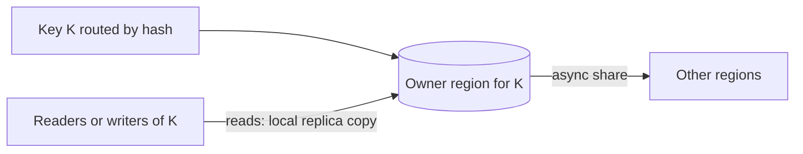
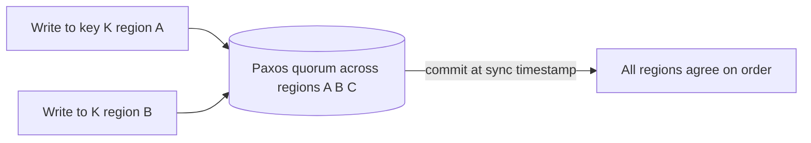

# Global Consistency

## 1. One-Line Definition
Global consistency is the effort to make reads and writes across regions behave like one coherent dataset — serializable, ordered, conflict-free — when the unavoidable cost of strong consistency (the WAN round trip per operation) is precisely what multi-region architecture was meant to avoid.

## 2. Why Do We Need It?
The moment you have two regions, you have the possibility of one user's data being read in region A, written in region B, and both clashing. Many products can tolerate eventual convergence (see [[strong-vs-eventual-consistency|Strong vs Eventual Consistency]]) — but checkout balances, inventory counts, identity conflicts, and "who answered first" cannot. Global consistency asks: can we promise *serializable / ordered / conflict-free* behavior across regions, and what does that cost? The answer shapes whether you build active-active at all, and where the write authority really lives.

## 3. Simple Intuition
A duel of two notaries in two cities, each with a ledger. If they never talk, they will record "001 claims the land" and "001 also claims the land to someone else" and both are "right" at once. There are exactly three honest options: (1) talk every time — every claim waits for the other city's confirm, slow but never contradictory; (2) one city owns the land ledger — the other city's claims must travel home, fast locally only for local claims; (3) both record claims locally and a judge reconciles later — eventually one claim wins and one claimant is disappointed. There is no fourth option where every city is fast *and* never contradicts.

## 4. What Happens Without It?
Active-active with no consistency story gives you: a user's cart updated in two regions silently drops the older edit (LWW loss); two staff issuing the same serial number; a "sold out" shelf still purchasable because inventory decrements replicated out of order; and a failover that re-applies old writes over new data. None of these look like a crash — they look like bugs, duplicated charges, and lost money — and they are fundamentally harder to find than a downtime.

## 5. Core Idea
- **The physics of the trade:** strong serializable consistency needs a defined order for conflicting operations; ordering an operation against a second region requires talking to it before returning, i.e., **paying the WAN RTT on every conflicting write**. The entire discipline is choosing *which operations are worth that wait*.
- **Write authority is the real dial:** "global consistency on a conflict" is shorthand for "someone decides which region wins." Single-writer-per-key (route each key's writes to *one* owning region) gives serializability per key without global waits — the cheapest global consistency there is.
- **Cross-region consensus (Spanner-style):** to be strictly linearizable/dynamically serializable everywhere, a quorum across regions (sync replication + Paxos/Raft over WAN) must pick a total order — using synchronized clocks (TrueTime-style) to assign commit timestamps. The cost: every commit feels the quorum latency and clock-sync machinery.
- **Timestamps ≠ truth:** wall clocks skew across regions; LWW with untrusted clocks misorders; logical clocks (Lamport/hybrid) order causality, not wall-time.
- **The escape hatches when you can't pay:** per-user session consistency (ensure the writer sees its own writes), per-region authority, overwrite-without-merge for idempotent values, and (when true) CRDTs that merge in any order.

## 6. Important Terminology

| Term | Simple Meaning |
|------|----------------|
| Global serializability | Operations worldwide behave in one defined order |
| Linearizability | Every read sees the latest acknowledged write |
| WAN RTT | Inter-region round trip (100-250 ms) — the consistency tax |
| Quorum | Enough replicas (across regions) to guarantee order |
| Write authority / owner | The region that can write a key — the practical approach |
| Spanner / TrueTime | Google Spanner's globally synchronous replication with clock agreement |
| Hybrid logical clock | Physical + logical component to order causally with skew-tolerance |
| Version vector | Concurrent-edit detection across replicas |
| CRDT | Conflict-free replicated data type — merges in any order |
| LWW | Last-writer-wins: cheap but orders by (possibly lying) clocks |

## 7. Basic Architecture

Ownership-based consistency — the sane default:



Consensus-based consistency — Spanner-style:



Ownership reads are local and writes are ordered per-key; consensus pays quorum RTT but gives strict ordering without a single owner's authority.

## 8. Request or Data Flow
1. Ownership: write to key K → routed (by partition key hash, see [[consistent-hashing|Consistent Hashing]]) to its owner region → serializable there → respond → replicate outward lazily. Reads anywhere else see the replicated copy (possibly lagging) or, for must-be-fresh reads, route to the owner.
2. Consensus: write to K from any region → propose → the inter-region quorum orders it with others → commit → respond after the quorum agrees; reads can also be served quorum-safe.
3. Session story: a user who just wrote K must read K's own effect — either read from the owner or per-session affinity (pinner) to the region that writes.

## 9. Practical Example
A global rides/shop inventory:
- **Inventory counter (conflict-prone, hot):** count ownership per SKU, all decrements route to the owner region → serializable, global RPO tiny; owner is chosen by SKU hash; remote decrements add one WAN hop but are rare.
- **Profile "last seen" (idempotent-ish, LWW fine):** the value converges quickly; [[geo-dns-anycast|Geo-DNS and Anycast]] + async replication from any region is fine — cost zero.
- **Balance ledger (must not double-compare-commit):** if a user can transact from two regions in one session, route those writes to one owner; to offer the full Spanner-style experience you'd pay quorum latency (~150-300 ms per commit across continents).

## 10. Scaling
- **Ownership scales linearly per key/partition** — each key's writes are serial in one region; total throughput = sum over owned keys.
- **Consensus scales slowly:** cross-region quorum commits are bounded by quorum RTT, so throughput has a hard per-conflict ceiling. Real systems widen the impact by batching and sharding *conflict domains* (a batch of disjoint keys commits once).
- **The scaling lie to avoid:** "global consistency at local speed" — physically impossible for conflicting writes shy of single-owner routing or accepting mergeable CRDTs; the raw material is WAN speed.

## 11. Reliability and Failure Scenarios

| Failure | What Happens | Detection | Recovery | Trade-off |
|---------|--------------|-----------|----------|-----------|
| Owner region for a key dies | Writes to that key stall | Owner health | Followers elect/project new owner; reads go stale meanwhile | brief owner-lost window |
| Quorum partition | No order can be decided | Quorum liveness | Hold (fail-safe), no commit | availability sacrificed for consistency |
| Clock skew in LWW | Wrong "winner" ordered | Clock-drift metrics | Prefer version vectors/ownership | complexity |
| Long replication gap | Read-after-write misses | lag SLO | Session pin / owner-read | small latency tax |
| Old writes replay after failover | History rewritten | version/isolation checks | Idempotent watermark replay | replay safety |

## 12. Consistency and Correctness
- **The correctness question global systems must answer:** can reads observe writes from another region, in which order, at what lag, and can conflicting writes be created? Every product has a "unit of consistency" — for chat it's a conversation; for finance a ledger row; for inventory a SKU — and the design surrounds that unit's boundaries (this is the "co-location/scoping" lesson from [[sharding|Sharding]] applied globally).
- **Ordering instruments:** ownership (authority), distributed consensus with synchronized clocks (TrueTime), hybrid logical clocks for causal order, and version vectors for *detection* (not resolution).
- **Idempotency is non-negotiable:** at-least-once replays must not double-apply; use event IDs and apply-side dedupe (see [[outbox-pattern|Outbox Pattern]], [[delivery-semantics|Delivery Semantics]]).

## 13. Performance
- Strong cross-region consistency costs the WAN on the write path: single-owner costs one hop for remote writers (~150-250 ms); quorum costs a full quorum interaction (~200-300 ms per commit); ownership-with-local-reads is the only "cheap" reading option, at the price of replicas' lag.
- Reads: consistency-tight reads (read-your-writes, fences) must go to the owner or a synced quorum — local replicas only serve the relaxed path.
- Throughput: batch and shard conflict domains to amortize the fixed quorum/owner costs; never put the whole fleet's writes through one "global order".

## 14. Security
- Data can flow to *every* region to stay consistent (many replicas, quorum copies): treat replicas as full data assets with encryption in transit and at rest, network isolation, and per-region least privilege (see [[cross-region-replication|Cross-Region Replication]]).
- Cross-region consensus means a compromised quorum member can sabotage ordering — the quorum's identity/keys must be separately held and rotated.
- Residency again interacts: a quorum requires data copies in several jurisdictions; forbidden pools can literally make Spanner-style consistency illegal for that data (see [[data-residency|Data Residency and Sovereignty]]).

## 15. Trade-Offs

| Choice | Advantages | Disadvantages | When to Use |
|--------|------------|---------------|-------------|
| Single-owner (authority) routing | Strong per-key, cheap, scaleable | Remote writes pay a WAN hop; owner is a hotspot | Most real needs: counters, ledgers, sessions |
| Cross-region quorum / Spanner-style | True serializability anywhere | High commit latency, clock machinery, infra | Payments, exchange/trading, "must be strictly consistent" |
| LWW + async | Simplest, fast | Loses writes (clock-dependent), no ordering | Idempotent/latest-wins fields |
| Version-vector + merge (CRDT) | No blocking, no loss | Merge rules; semantic complexity | Collaborative counters/sets/chat history |
| Session pinning / RAU | Cheap, best-effort | Only preserves *your* own writes | Products willing to accept weak global rules |

Honest ceiling: there is no free global consistency; every "we're consistent" claim reduces to one of ownership, quorum latency, or acceptance of a merge/loss policy — say which one in interviews.

## 16. Common Mistakes
- Treating LWW as "conflict resolution": a wall-clock tie or skew silently deletes a legitimate write.
- Assuming active-active + eventual = "consistent enough" for money/inventory/counters.
- Building one global order for everything ("one big serial chain") — throughput collapses; order only what conflicts.
- Reading from local replicas without checking consistency requirements (read-your-writes breakage after a write in another region).
- Ignoring the unit/scope: designing "globally consistent" when the real system need is "consistent within a user/conversation/ledger".

## 17. HLD vs LLD Boundary
HLD: choose the consistency model per data class (unit-of-consistency scoping), pick ownership vs quorum, define clock strategy, and the read/write routing rules. LLD: the routing hashes, the Paxos/Raft wiring, the version-vector encoding, dedupe keys, replicate-apply code paths.

## 18. Interview Questions

### Beginner
- Why can't you get strong global consistency and fast global writes at the same time?
- What does "unit of consistency" mean and why does scoping it matter?

### Intermediate
- Design per-key ownership for an inventory system where orders come from any region — walk a conflicting pair of writes.
- When would you choose LWW, and what are you giving up when you do?

### Advanced
- Explain how Spanner-style (TrueTime + Paxos over WAN) achieves linearizability, and its cost in latency and clock-sync assumptions.
- A read-your-writes bug: user writes in region B, then reads in region A and sees nothing. Design the fix without making every read expensive.

## 19. Interview Memory Summary

> [!abstract]- Interview Memory Summary

### Remember

- Global consistency = making multi-region writes behave like one ordered dataset; the tax is WAN latency to order conflicts.
- The dial is **write authority**: single-owner per key = strong per-key without global waits; quorum/Spanner = strict everywhere, pays RTT; LWW/CRDT = merge/loss.
- The unit of consistency (user, ledger, conversation, SKU) shrinks the problem — co-locate everything that must be ordered together.
- Clocks lie: LWW misorders with skew; version vectors detect concurrency; TrueTime/hybrid clocks order causally.
- Read-your-writes needs session pinning or owner routing.
- Strong consistency sacrifices availability under partition (see [[cap-theorem|CAP Theorem]]).
- Idempotent apply is mandatory on any replay (outbox/dedupe) — exactly-once is a fairy tale over a WAN.
- Replication to every region is a data sprawl + residency issue, not only a consistency one.

### 30-Second Explanation

Global consistency is deciding whether writes across regions agree *now* or *eventually*. Per-key ownership routes each conflicting key to one region (strong and cheap, WAN hop only for remote writers); cross-region multi-Paxos with synchronized clocks buys strict serializability everywhere at quorum-latency cost; LWW/CRDT accept merge/loss for the rest. Scope consistency to the real unit (a user, a ledger row), detect conflicts with version vectors, pin reads when you must see your own writes, and treat every replay as idempotent.

### Interview Traps

- Claiming global strong consistency is free or "local-latency".
- Using LWW without naming the lossy trade-off.
- Building one global serial chain and ignoring that it caps throughput.
- Ignoring unit-of-consistency scoping — the highest-leverage move in the design.

### Key Trade-Off

You trade WAN latency (or merge/loss acceptance) for coherence — and the whole art is choosing, per data class, whether to pay it with ownership, quorum, or eventual merge.

## 20. Related Concepts

### Prerequisites

- [[cap-theorem|CAP Theorem]]
- [[strong-vs-eventual-consistency|Strong vs Eventual Consistency]]
- [[database-replication|Database Replication]]

### Commonly Used Together

- [[cross-region-replication|Cross-Region Replication]] — the shipping mechanism underneath the model.
- [[multi-region-models|Active-Active vs Active-Passive Regions]] — the model's consistency ceiling is this concept.
- [[regional-failover|Regional Failover]] — a failover is a consistency event (late replays, new authority).

### Alternatives

- [[strong-vs-eventual-consistency|Strong vs Eventual Consistency]] (deciding where on the spectrum this segment sits remotely from within-region)
- Single-region (when strict consistency is mandatory and cheap within one region only)

### Advanced Concepts

- [[consistent-hashing|Consistent Hashing]] — key-to-owner routing mechanics.
- [[global-coordination|Global Coordination]] — clocks, ordering, IDs, and cross-region consensus machinery.

Related planned topics (not authored yet): conflict resolution/version vectors, clocks and ordering, multi-region consensus, PACELC, quorum.

## 21. References
Spanner's TrueTime + multi-Paxos is described in the paper "Spanner: Google's Globally-Distributed Database"; the Dynamo paper covers LWW and conflict detection on the weak-consistency side; the hybrid-logical-clock paper covers order with skew-tolerant clocks. Validate any consistency claim against your own latency measurement.

## 22. Active Recall

Test yourself before revealing each answer.

> [!question]- What exactly is "the unit of consistency" and why does it decide the architecture?
> The smallest set of data that must be ordered together (a user's session, a ledger row, a conversation, an SKU). Because ordering costs WAN round trips, you co-locate and serialize only *within* that unit — everything else stays concurrent and fast. A chat that must be consistent per-conversation, not per-global-line, is a completely different (cheaper) system than "fully serialized".

> [!question]- Single-owner routing: how do you get "globally consistent" without paying global latency on every write?
> Route every write of a key to **one owning region** (by hash/partition). Writes to that key are serial there, so reads of it (from the owner or a pinned local replica) are coherent. Local writes stay local; only writes from the *other* side of the planet pay a WAN hop. The cost is an owner hotspot for hot keys (shard the key) and lag on the replicated read path.

> [!question]- What does TrueTime + Paxos over a WAN actually buy you, and what do you pay?
> It buys **linearizability everywhere**: a quorum across regions jointly orders commits, and the confidence interval of synchronized clocks yields a total, monotonic order. You pay commit latency ≈ quorum RTT (200-300 ms+ cross-continent), clock-sync infrastructure, and you lose availability if the quorum can't form — exactly the [[cap-theorem|CAP]] this ordering requires.

> [!question]- Why is LWW not "conflict resolution" in serious design?
> LWW resolves by **wall-clock comparison, not by correctness**: skew or a tie silently picks a winner that may be the wrong edit — a lost write with no record. It belongs on idempotent/latest-wins fields (a "last seen" tag), never on money, inventory counts, or anything whose loss is a claim event. Version vectors *detect* concurrency; they don't resolve it.

> [!question]- A real bug: user writes in region B, immediately reads in region A, sees nothing. What's the failure and the two fixes?
> Region A served its **lagging replica**; the write hadn't replicated yet — read-your-writes broken. Fixes: (1) **session pinning** — a user's reads for N seconds route to the region that just accepted their write; (2) for durability-critical reads, take the owner/quorum read. The general rule: local-replica reads are relaxed-by-lag reads; fresh reads must be owner/pinned.

> [!question]- How do you get a deterministic order when wall clocks are unreliable across regions?
> **Logical/hybrid clocks** order causality: Lamport/hybrid-logical give "happens-before", version vectors detect concurrent edits, and TrueTime gives real-time bounds. All are clocks: none by themselves resolve a genuinely-concurrent conflict — that still needs an authority (ownership/quorum) or a merge/loss policy. Never infer wall-time order from bursts of clock readings as truth.

> [!question]- When is "global consistency" actually over-engineering for a product?
> When the real requirement is localized: per-user lineage, per-conversation, per-tenant. If writes for one user can be pinned to one region and reads pinned to that region briefly, you get a fully consistent experience (even if "globally" the replicas lag). Global strictness helps only if two regions can *legitimately* write the same item and the business cannot accept loss or delay — that's the rare case.

## 23. When Should I Use This?

### Use it when

- Conflict-prone data (counts, balances, identity) can be written from more than one region.
- An order/sequence must be unambiguous across regions (serial numbers, claims, exchanges).
- Read-your-writes matters and you're willing to pin/rout reads.
- Active-active is on the table and someone must answer "what about consistency?"

### Avoid it when

- The system is single-region (consistency is cheap within one region; [[transactions-and-acid|Transactions and ACID]] covers you).
- Data is per-user and users stay in one region — ownership already gives you global consistency without the machinery.
- Writes are idempotent/latest-wins (LWW is fine) and you don't mind the merge/loss acceptance.
- A strictly-consistency-for-everything mandate — no quorum pays; scope it.

### What problem does it solve?

It lets multi-region systems behave like *one coherent dataset* where conflicting writes are ordered, detected, or deliberately merged — preventing the silent divergences (lost edits, double counts, broken RAU) that otherwise come free with active-active.

### What problem does it NOT solve?

It cannot make WAN writes fast and strictly ordered-simultaneously (physics), cannot craft between "consistency within the unit" and "consistency of everything", cannot recover a genuinely concurrent conflict the business didn't define a policy for, and does not make a copy legal (residency) or the replay idempotent by itself.

## 24. Decision Connections

Decisions that go together with global consistency:

- [[cap-theorem|CAP Theorem]] — the availability/consistency axis the model is negotiating with the WAN.
- [[strong-vs-eventual-consistency|Strong vs Eventual Consistency]] — the specter of "which kind of weak" you can accept.
- [[cross-region-replication|Cross-Region Replication]] — the pipeline carrying writes whose ordering you're protecting.
- [[multi-region-models|Active-Active vs Active-Passive Regions]] — the model either allows or forbids the conflicts this concept manages.
- [[regional-failover|Regional Failover]] — failover replays are consistency events (late writers, new authority — fence it).
- [[sharding|Sharding]] / [[consistent-hashing|Consistent Hashing]] — ownership routing is "global consistency via shard-per-owner".
- [[global-coordination|Global Coordination]] — clocks, IDs, and cross-region consensus as the machinery.

Decision tree:

```
Can two regions legitimately write the same data?
    |
    +-- No: data is per-user and users stay in one region
    |      → ownership/per-region pinning; +[[regional-failover|Regional Failover]] fencing is enough
    |
    +-- Yes, but the item is mergeable or latest-wins
    |      → CRDT/version-vector merge or LWW (accept loss) 
    |
    +-- Yes, must be strictly ordered and no losses
    |      |
    |      +-- Can one region own each conflicting key?
    |      |      → single-owner routing (+WAN hop for remote writers) ← cheapest strong option
    |      +-- Must be serializable globally, no single owner?
    |             → cross-region quorum (Spanner-style PAXOS + TrueTime); pay latency
    |
    +-- Reads must be fresh everywhere?
           → owner/pinned reads, never lagging replicas, in every branch
```