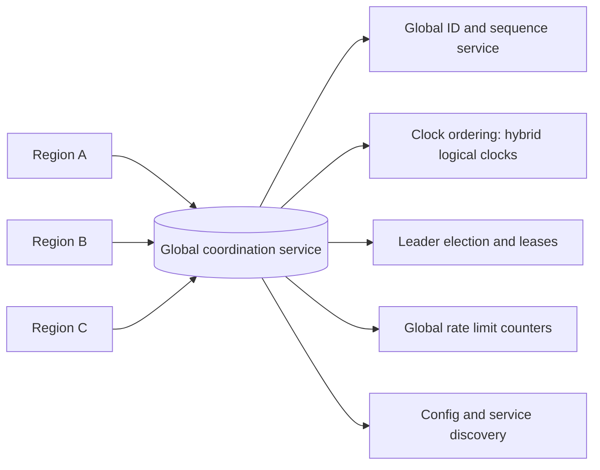

# Global Coordination

## 1. One-Line Definition
Global coordination is the machinery that keeps a multi-region system acting as one system: globally unique IDs, ordered and comparable clocks, leader election, distributed locking and rate limits, and cross-region transactions — every piece of "there should be only one" that a single data center gets for free but a WAN must be paid for.

## 2. Why Do We Need It?
Multi-region systems run into "single instance" problems everywhere the moment data lives in two+ places: two regions mint the same order ID; two regions both think they are the leader for a partition; two regions each allow a rate limit that one region should enforce globally; and a coordinator pattern (leader elected *somewhere*) must work with 200 ms of space between its members. Left unsolved, these produce invisible duplicates, split-brain elections, and coordination delay — the classic tax of [[cap-theorem|CAP]]-style distributed work. This concept is the toolbox for answering "which one of you is in charge, and how do the rest agree?"

## 3. Simple Intuition
Two small banks in two cities merge. Suddenly both branches can issue "account #123" (collision), both cashiers can approve the same transfer (double-spend), and both night shifts think they are the ones allowed to close the safe (split brain). The merger only works if there is a town-wide agreement: a shared registry for numbers, a shared "only the Frankfurt team closes the safe tonight" note, and a rule that any transfer affecting two cities waits for the other city's confirmation. Global coordination is the merger agreement, not the safe.

## 4. What Happens Without It?
Duplicate IDs corrupt foreign-key joins and cache keys; two leaders for one partition diverge data permanently; a rate limiter that was supposed to cap at 100 req/s allows 200 because each region counted its own 100; a transaction that touched regions A and B commits in A and rolls back in B. Each is a distinct, findable-after-the-fact bug that destroys trust or money — and they are all symptoms of "no one decided, globally."

## 5. Core Idea
- **Give each event a globally unique, sortable ID.** Hand the problem to the ID, not the state: embed region + timestamp + sequence (Snowflake-style) so two regions can never collide and ordering-by-ID is usually meaningful. Cheap, no coordination at write time (distributed ID generation — planned).
- **Coordinate clocks so "earlier" means something.** Wall clocks skew; use hybrid logical clocks or TrueTime-style intervals so distributed events get an order that respects causality (see [[global-consistency|Global Consistency]]).
- **Elect leaders with a consensus protocol, not a shout.** Raft/Paxos over the WAN elects exactly one leader for a scope (a partition, a region-role, a coordination domain). Leader election is local machinery for a *partition/tenant*, but when the scope is global the quorum must span regions and pay the RTT (see [consensus (planned)]).
- **Distributed locks have two honest degrees of freedom:** a lock that spans regions either uses an agreement round trip (correct, slow) or is scoped to one region (fast, and "cross-region locking" is delegated to that region). There is no free global lock; see [distributed locks (planned)].
- **Global rate limiting/numbering must be a counter that cannot drift:** either one (efficient, hot) or a ring of N counters with assignments (scalable, leases/borrowing) — just never two independent counters that each believe they are the whole budget.
- **Cross-region transactions** are either *sagas* (event-driven, tolerant — the common answer, see [[outbox-pattern|Outbox Pattern]] and [[event-driven-architecture|Event-Driven Architecture]]) or *distributed atomic commit* (2PC over a WAN — correctness at the price of blocking and availability; see [distributed transactions (planned)]).
- **Global config/service discovery** is the boring-but-critical layer: one source of truth for "which regions exist, what versions/toggles, who is the current leader", pushed with versioning and pulled with last-known-good fallback.

## 6. Important Terminology

| Term | Simple Meaning |
|------|----------------|
| Global ID | Unique, order-friendly ID across regions |
| Snowflake-style ID | timestamp + region + sequence packed into a big int |
| Hybrid logical clock | Physical time + logical counter for causal ordering |
| Leader election | Choosing one node/region as authority for a scope |
| Quorum | ≥ majority of a consensus group agreeing |
| Distributed lock | Mutual exclusion spanning (potentially) regions |
| Global rate limit | One budget enforced across all regions |
| Saga | Long-running transaction as a chain of compensating steps |
| 2PC | Two-phase commit: all-or-nothing across participants |
| Last-known-good | Serving the last valid config when the source is unavailable |

## 7. Basic Architecture



The coordination service is the "single honest ledger of authority" — ideally deployed in a quorum across ≥3 regions so it survives a region long enough to keep the rest agreeing.

## 8. Request or Data Flow
1. A request enters any region; it needs a unique ID → the region asks the global ID service (or derives one locally from region+time+sequence when that is safe).
2. If the operation needs global authority (elect a leader, take a lock, charge a global budget), the region talks to coordination — a quorum across regions orders and commits the decision, paying the cross-region RTT once per coordination event.
3. The decision (ID assigned, leader elected, lock held, budget decremented) is versioned and disseminated; every region localizes it (cached leases) so normal traffic never hits the global service.
4. Config/leader changes propagate as versioned, last-known-good documents; a region that is partitioned keeps serving with the last good config rather than inventing new authority.

## 9. Practical Example
A global promotions system:
- Order IDs: `region-bit + hybrid-clock-time + counter` → globally unique and sortable with zero coordination at mint time (Snowflake-style).
- Rate limiting: the campaign lets 1,000 redemptions/minute worldwide. A central counter with a distributed lease — each region borrows a chunk of the budget (e.g., region A borrows 800, region B 200, leases refresh) so redeem calls stay local while the total still obeys the global cap.
- Leader: exactly one region owns "close the campaign at midnight" (a lease with fencing to prevent a stale holder). If the leader region dies, the quorum re-elects; a stale, fenced leader can never double-close.
- Cross-region settlement: a redemption touches two regions — a saga: mint redemption event → persist locally → emit to the [[outbox-pattern|outbox]] → counter region applies idempotently → compensating rollback if it fails. No 2PC over the WAN.

## 10. Scaling
- **The coordination service is the scalability ceiling.** Every globally-coordinated op costs a quorum RTT; the whole design is about moving the *coordination from the hot path* — do it once per session/lease/budget-chunk, not per request.
- **Scale by scoping the coordination:** per-tenant or per-partition coordination domains, so the global service only arbitrates rare events (elections, flips) while hot operations run in local scopes.
- **Global IDs scale fine** (derived locally), global counters scale by ranging leases, global locks scale by reducing lock scope to one region (the entity lives there anyway).
- **Coverage honesty:** a "global" lock over data that genuinely lives in one region is a *regional* lock in disguise — put the lock where the data is and stop pretending.

## 11. Reliability and Failure Scenarios

| Failure | What Happens | Detection | Recovery | Trade-off |
|---------|--------------|-----------|----------|-----------|
| Coordination service down | No new IDs/elections/locks | Quorum liveness | Last-known-good + local leases; new-request blending | availability vs consistency |
| Leader region dies | Scope without authority | Lease expiry + quorum | Re-elect, fence the old holder | brief un-leader window |
| Stale lock holder (lease expired but acting) | Two actors think they hold it | Fencing token check | Require fencing token on every use | fence tokens on every op |
| Clock skew in ordering | Events misordered by wall time | Clock-drift metrics | Hybrid logical clock ordering | complexity |
| Budget lease lost during global rate limiting | Burst over the cap | Metering counter | Drain borrowed budget after lease end | small overshoot window |

## 12. Consistency and Correctness
- The three correctness pillars here are the same as everywhere in this folder: **one authority, ordered events, fenced writes.**
  - Authority: exactly-one-leader per scope via quorum + lease; a lease holder proves it with a fencing token ("I am generation N") so a stale holder's write is rejected at the data layer.
  - Ordering: hybrid logical clocks order causally even with skew; per-key ordering comes from the single authority for that key.
  - Fencing on mutation: every mutation from an elected/locked actor carries the generation; storage rejects any lower generation — this is what makes distributed locks safe against pause/GC eliminating them (the "unlock after death" trap, see [distributed locks (planned)]).
- Idempotency is the backstop for every event channel: [[outbox-pattern|Outbox Pattern]] + [[delivery-semantics|Delivery Semantics]] mean a replayed coordination event (lease renew, ID counter, budget charge) must be harmless.

## 13. Performance
- Coordination is measured in RTTs, not milliseconds: a quorum across 2-3 regions costs ~150-300 ms per decision. The design win is making coordination *rare* (leasing, borrowing, versioned push-down).
- Global ID minting is O(1) and local; this is why ID design is the cheapest coordination win you get.
- Global counters with budget-lease achieve near-local throughput with a bounded overshoot when leases are in flight.
- Locks/leader elections are the slowest: their RTT is paid at acquisition and renewal. The fewer the elections, the better — a lease of minutes amortizes the cost.

## 14. Security
- The coordination service is the crown jewel: whoever controls it can grant leaders, forge IDs, and drain budgets. Authenticate every member, encrypt the quorum channel, separate coordination credentials from application credentials (see [[authentication-vs-authorization|Authentication vs Authorization]]).
- Distributed locks carry a real risk: a compromised holder with a valid fence token can perform authorized writes until its lease ends — another reason lease lengths are short and keys are per-scope (least privilege).
- Global config pushes must be signed here, not just fetched (a poisoned config misbehaves the whole fleet).

## 15. Trade-Offs

| Choice | Advantages | Disadvantages | When to Use |
|--------|------------|---------------|-------------|
| Locally-derived global IDs | Zero coordination, fast | Reordering risk if timestamps skew | Default for most systems |
| Central global ID/sequence | Clean order | Hot single point, coordination RTT | Small, order-critical sets |
| Leader election by quorum | Correct, single authority | RTT + un-leader windows | Partitions, global roles |
| Regional/ownership scoping | Fast, local | Global entities still need a home | Per-tenant/partition designs |
| Budget-lease rate limiting | Near-local throughput | Overshoot window at lease boundaries | High-throughput capping |
| Saga instead of 2PC | No blocked transactions | Compensations must be written | Cross-region business flows |
| 2PC over WAN | Atomic, all-or-nothing | Blocks on outages, slow, rare | Narrow critical paths only |

Honest limitation: no toolkit removes the WAN — global authority, global order, and global budgets are paid for in RTT and complexity; the art is choosing which operations are worth global and leaving the rest local.

## 16. Common Mistakes
- Minting IDs from `random` or `time+seq` without a region component — two regions eventually collide.
- Global leader election *without fencing*: the stale leader keeps writing after losing — the worst data-integrity failure.
- A distributed lock implemented conceptually as "set a flag" with no lease/fencing — it guards nothing reliably.
- A "global" rate limit that is actually per-region plus a comment saying "should add globally".
- Running 2PC across regions as a default — blocking transactions couple availability to every participant; sagas scale where 2PC can't.

## 17. HLD vs LLD Boundary
HLD: decide which operations need global authority (IDs, locks, leaders, budgets, config), choose the scoping per domain, set lease lengths and budgets, pick saga vs 2PC, define config push/fallback semantics. LLD: the ID encoding, the clock implementation, the lease/fencing generation tokens, the budget-lease counter logic, the saga step/compensation wiring.

## 18. Interview Questions

### Beginner
- Why do two regions generating IDs independently eventually collide — and what's the standard fix?
- What is a lease in leader election and why must it exist?

### Intermediate
- Design a global rate limit for a redemption campaign. How do you keep calls local and still enforce the world-wide cap?
- A coordinator dies mid-election. Walk the recovery and say how a stale leader is prevented from writing.

### Advanced
- Design a cross-region payment settle with two regions holding the two halves of a transfer — why saga over 2PC, and what's the compensation flow?
- Your distributed lock's holder is paused by GC, the lease expires, a new holder takes over, then the old one wakes. How do you make the system safe?

## 19. Interview Memory Summary

> [!abstract]- Interview Memory Summary

### Remember

- Global coordination = IDs, clocks, elections, locks, budgets, config — the "there can be only one" machinery over a WAN.
- The tax is measured in quorum RTTs; the art is making coordination **rare** (leases, borrowing, versioned config) instead of per-request.
- Global IDs are the cheap win: region + hybrid clock + sequence, minted locally, O(1).
- Leader election must be a **lease + fencing**: generation tokens rejected at the data layer defeat the stale-leader bug.
- Global rate limits scale by budget-leases: borrow a chunk, refresh, reconcile.
- Cross-region transactions default to sagas (compensations) — 2PC over a WAN blocks and only fits narrow critical paths.
- Global config is signed, versioned, last-known-good; a partitioned region serves the last good copy, never invents authority.
- Everything rides on the [[outbox-pattern|Outbox Pattern]] + [[delivery-semantics|Delivery Semantics]] idempotency for replays.

### 30-Second Explanation

Global coordination keeps multi-region systems coherent: Snowflake-style IDs give uniqueness with no coordination; hybrid logical clocks give trustworthy ordering; leader election uses quorum + leases + fencing for single-authority; budget leases make global rate limiting local-fast; and cross-region transactions default to sagas with idempotent replays. The binding constraint is the WAN RTT on every global decision — so you scope authority, lease aggressively, and upgrade the coordination layer's frequency from per-request to per-session.

### Interview Traps

- Proposing leader election without fencing.
- Treating the distributed lock as a shared flag (no lease, no generation).
- Building "global" rate limiting as per-region counters.
- Defaulting to 2PC over a WAN instead of sagas.
- Minting IDs without a region/unique component and calling it safe.

### Key Trade-Off

You pay WAN RTT and complexity for the "one of everything" guarantees (one ID, one leader, one budget, one truth) — and the whole design is about paying that price rarely, not constantly.

## 20. Related Concepts

### Prerequisites

- [[cap-theorem|CAP Theorem]]
- [[global-consistency|Global Consistency]]
- [[message-queue|Message Queue]] / [[event-driven-architecture|Event-Driven Architecture]]

### Commonly Used Together

- [[outbox-pattern|Outbox Pattern]] — local publish + reliable replay; the backbone of sagas and idempotency.
- [[delivery-semantics|Delivery Semantics]] — at-least-once recurrence makes every coordination event idempotent.
- [[cross-region-replication|Cross-Region Replication]] — the data moves the coordination is protecting.
- [[multi-region-models|Active-Active vs Active-Passive Regions]] — the model that decides which coordination (elections/flips) is even needed.
- [[sharding|Sharding]] / [[consistent-hashing|Consistent Hashing]] — scoping coordination per partition is how it stays fast.

### Alternatives

- Ownership/routing instead of global locks (put the lock where the entity lives — see [[global-consistency|Global Consistency]])
- A single-region core for authority (when the coordination domain should just live in one region)

### Advanced Concepts

- [[observability|Observability]] / [[distributed-tracing|Distributed Tracing]] — coordinating trace IDs is itself coordination work.

Related planned topics (not authored yet): consensus/Raft-Paxos, distributed locks, distributed ID generation, distributed transactions (2PC/Saga), clocks and ordering, multi-region consensus, distributed rate limiters/caches, split brain, cloud infrastructure (regions/AZs).

## 21. References
Snowflake-style ID design, Dyanmo's vector/clock reasoning, and Spanner's TrueTime ordering are well-documented primary sources (Twitter Snowflake blog; Google Spanner paper; Dynamo paper). Raft is specified in the Raft paper (Ongaro and Ousterhout). Base the saga pattern on standard distributed-transactions work (outbox/rent patterns in Kleppmann's more recent thesis-era writing and the SAGA paper). Verify current coordination-service docs for managed offerings.

## 22. Active Recall

Test yourself before revealing each answer.

> [!question]- Why do plain `timestamp + sequence` IDs collide between two regions, and how does Snowflake-style fix it?
> Two regions minting on the same clock-tick from independent sequences collide. Snowflake-style **embeds a region/worker bit and a strictly-increasing sequence** into one 64-bit int, so partitions are disjoint — no collision ever, no coordination at mint time. The practical caveat: wall-clock skew can make IDs slightly out of chronological order, so don't rely on them for strict time ordering — use hybrid logical clocks when that matters.

> [!question]- What is a lease exactly, and why must leader election have one?
> A lease is an authority window with an **expiration** (e.g., "this region is leader until 12:00:07 UTC"). It matters because networks pause: the leader may be alive-but-lost or dead-but-still-thinking. With a lease, authority *fails safe* on expiry — followers can re-elect a new incumbent after it lapses — and a stale holder is neutralized by fencing (generation tokens), not by hoping it stops.

> [!question]- Why is a "set a key in Redis" distributed lock dangerous, and what makes a lock real?
> "Set a key" has no lease, no fencing, and no monotonic generation: the holder can GC-pause past the key's TTL, a second holder takes the "lock", the first wakes and writes — two writers. A real lock needs **expiry (lease), fencing/generation tokens checked at the data layer, and monotonic clock safety**. If your data store doesn't reject stale tokens, you don't have a lock; you have a suggestion.

> [!question]- How do you do a global rate limit while keeping every call local?
> **Budget leases**: the global counter is capped (e.g., 1,000/min). Each region borrows a chunk under lease (region A takes 700, B 200, C 100), refreshes, and serves its local calls until it exhausts the chunk or the lease ends; reconciliation prevents drift. The small overshoot (in-flight borrowed budgets at lease boundaries) is bounded and quantifiable — which is why you state it in the design.

> [!question]- Cross-region transfer touches both regions; why saga over 2PC, and what's the compensation?
> 2PC over a WAN **blocks every transaction on every participant simultaneously** — one dead region freezes them all; sagas accept eventual atomicity: run local steps, emit events from the [[outbox-pattern|Outbox Pattern]], and if a later step fails, execute a **compensation flow** (reverse the debit/credit) with idempotent replays. Trade: you lose "instant all-or-nothing" and gain availability and the absence of WAN-blocking.

> [!question]- A partition splits the coordination quorum. What must happen to authority during the split?
> Only the side with a **quorum** (majority of the coordination group) can hold authority — elections commit only where majority exists. The minority side must **fail safe**: serve last-known-good config, pause authority-needing operations, and never create competing leaders. Elections only re-run at the majority side; fencing guarantees the losing side's stale leader can't write. This is the CAP trade, exercised in the coordination service itself.

> [!question]- What's the difference between coordination "per request" and "per lease", and why does it decide scalability?
> Per-request = every op crosses the quorum (each ~150-300 ms RTT — the ceiling is low). Per-lease = authority is granted once (leader for 60 s, budget chunk for 30 s, session pin for 10 min) and **renewed rarely**, so the WAN cost amortizes over hundreds of operations. Everything in production coordination is about converting the former into the latter.

> [!question]- Where do you draw the line between a "global" lock and a "regional" lock?
> Wherever the data lives. If the entity is owned by one region, the lock should live **in that region**, and "cross-region locking" is just routing the op to the owner (see [[global-consistency|Global Consistency]] ownership). A true global lock only makes sense for resources genuinely shared across regions — and those are rare; default to ownership, pay coordination only for true globals.

## 23. When Should I Use This?

### Use it when

- Two+ regions can mint, elect, lock, count, or decide — and "wrong" is a real cost (duplicates, double spends, split brain).
- You operate [[multi-region-models|Active-Active or Active-Passive Regions]] and need single authorities for partitions/roles.
- Cross-region business flows need either atomicity or a documented compensation path.
- You need one coherent version of the truth for config, features, and leadership.

### Avoid it when

- The system is single-region: a database's native constraints already give you IDs, locks, and order locally (see [[transactions-and-acid|Transactions and ACID]]).
- Entities are per-user and users stay in one region — ownership/routing already gives single-authority without global coordination.
- The "global" need is small and rare: pin the scarce thing to one region and be done, rather than standing up cross-region coordination.

### What problem does it solve?

It supplies the "there should be only one" guarantees across regions — one unique ID, one leader, one budget, one authority — so multi-region behavior does not silently diverge, and it does so with a cost model (RTT per coordination event) the architect can scope and budget.

### What problem does it NOT solve?

It cannot make the WAN free, cannot guarantee availability under a minority partition (failure-safe means *serving degraded*), cannot rescue a rollback lost because you skipped compensations, and — as with everything else — it cannot override [[data-residency|Data Residency and Sovereignty]] (a quorum that must reside in forbidden jurisdictions is itself a compliance violation).

## 24. Decision Connections

Decisions that go together with global coordination:

- [[global-consistency|Global Consistency]] — the ordering/authority guarantees that coordination machinery delivers.
- [[cap-theorem|CAP Theorem]] — elections, locks, and quorums are where the availability/consistency dial is turned.
- [[outbox-pattern|Outbox Pattern]] + [[delivery-semantics|Delivery Semantics]] — the idempotent, replayable plumbing under every saga.
- [[cross-region-replication|Cross-Region Replication]] — the data stream the coordination service arbitrates.
- [[multi-region-models|Active-Active vs Active-Passive Regions]] — the model decides how much coordination (elections, flips) actually happens.
- [[sharding|Sharding]] / [[consistent-hashing|Consistent Hashing]] — scoping coordination per partition keeps it fast and rare.
- [[observability|Observability]] / [[distributed-tracing|Distributed Tracing]] — trace/correlation ID generation is itself global coordination done locally.

Decision tree:

```
Does the operation need "there should be only one"?
    |
    +-- Uniqueness only (IDs) → mint locally: region + hybrid clock + sequence (Snowflake-style)
    |
    +-- One authority needed (leader, lock, budget)
    |      |
    |      +-- Can scope to one region / one owner?
    |      |      → local authority + routing (fast; see [[global-consistency|Global Consistency]])
    |      +-- Truly global?
    |             → quorum election + lease + fencing
    |             → budget leases for rate limits
    |             → partition safety: minority fails safe, never invents authority
    |
    +-- Multi-region transaction?
    |      |
    |      +-- Need all-or-nothing, tiny critical set? → 2PC, block-aware
    |      +-- Eventual with compensation OK?          → saga via [[outbox-pattern|Outbox Pattern]]
    |
    +-- Cross-region failure event?
           → re-elect via quorum, fence stale holders, replay idempotently
```