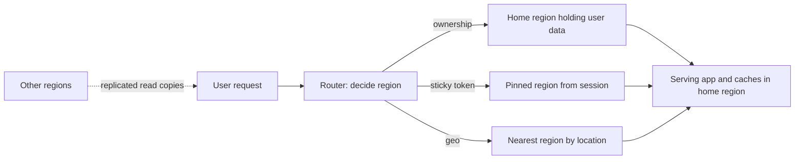

# Locality-Based Routing

## 1. One-Line Definition
Locality-based routing steers each user's request to the region nearest to them — and then *keeps* that user's related requests (session, cart, reads, writes) pinned to that region — so the user's hot-path latency is a local hop instead of a cross-continent round trip, and their data stays coherent in one place.

## 2. Why Do We Need It?
[[geo-dns-anycast|Geo-DNS and Anycast]] can pick a *region per lookup*; [[multi-region-models|Active-Active Regions]] can put *the data* near users; but the real product need is a *user who stays coherent* — whose session, cart, and latest write live where the routing put them. Geo-DNS alone answers "which region is nearest now", while locality answers "this user's traffic belongs to this region, consistently". Without it, every connection gets its own fresh DNS answer, sessions silently jump regions between requests, and a sudden steering change makes a "local" user's next request land in a far region — breaking read-your-writes and inflating latency.

## 3. Simple Intuition
Your bank has branches everywhere. Geo-DNS is the sign on the door — "this branch exists near you". Locality is the rule that *you*, your account, your session, your money are handled by one branch that actually holds your ledger, while other branches can look you up from a distance when needed. Routing someone to "the nearest branch that doesn't know them" is a far worse experience than "their branch, wherever it is".

## 4. What Happens Without It?
Requests bounce between regions: session state lost mid-checkout, a write lands in region A and the next read follows into region B (where nothing is), auth tokens re-issued per region, and every "fast, local" request occasionally pays a cross-continent detour when routing swings. The failure is not catastrophic — it is pervasive and intermittent: latency spikes, mysteriously logged-out users, carts that forget themselves.

## 5. Core Idea
- **Routing is a decision about the requester *and* the data.** "Nearest region" is only half the answer: the chosen region must also *own or have* what the request needs (session, user record, writable copy). So locality pulls the data layer into routing, not just DNS.
- **Degrees of locality:**
  1. *Resolve-by-location* — region chosen per request from IP/EDNS (coarse, stateless).
  2. *Session affinity* — region chosen once per session and remembered (sticky token/cookie/LB stickiness).
  3. *Data-pinned (ownership)* — the user's authoritative data lives in one region; routing asks "where is this user's home", not "what is nearest".
  4. *Compliance-pinned* — locality is overridden by [[data-residency|Data Residency and Sovereignty]] rules ("always the EU pool" even when the user is in Tokyo).
- **The built-in conflict is with load balancing:** fairness wants requests spread everywhere; locality wants this user kept here. Reconcile at different granularities — spread *users and fresh sessions*, stay sticky *per user*.
- **When it breaks:** steering flips during [[regional-failover|Regional Failover]], sessions die, and the cost shows up as read-your-writes failures, auth churn, and re-sync. Buffer with [[cross-region-replication|Cross-Region Replication]] and sticky-override rules.

## 6. Important Terminology

| Term | Simple Meaning |
|------|----------------|
| Locality routing | Choosing the region by the user's location/proximity |
| Sticky / affinity routing | Keeping one user's or session's requests on one region |
| Session pinning | Consistently routing one session's requests together |
| Read-your-writes | A just-acknowledged write must be visible on the next read |
| Home region / ownership | The region holding a user's authoritative data |
| Compliance pinning | Law forces routing to a specific pool regardless of location |
| Re-home | Moving a user's authority/data to a new region |
| Cross-region hop | The WAN detour locality tries to avoid |

## 7. Basic Architecture



Three inputs (geo, sticky pin, ownership) are reconciled in order of priority: ownership wins for authoritative data, then compliance, then the pin, with geo as the fallback for brand-new sessions.

## 8. Request or Data Flow
1. First request for a user: geo-DNS resolves the nearest region; a session start establishes a sticky token that names the region.
2. Subsequent requests carry the token; the router honors locality: same region unless the session is dead or the region is unhealthy.
3. The authoritative data (user row) lives in that region's store (ownership — see [[global-consistency|Global Consistency]]); other regions serve *replicated* copies for relaxed reads, and fresh reads route to the owner.
4. On a region failure, locality is overridden: [[regional-failover|Regional Failover]] steers to a healthy region; the session survives only if the new region can rebuild it (stateless tokens or replicated session state).
5. Compliance overrides everything: a pinned-jurisdiction user is never routed to a forbidden region, even when it is nearest.

## 9. Practical Example
A global e-commerce app:
- A user in Sydney shops at noon: routed to ap-southeast by geo, session pinned there; cart and profile live in that region (ownership); reads run ~15-30 ms locally.
- The same user flies to London: their session stays pinned to Sydney until the natural end (their data is there); new London sessions that don't exist yet get London routing.
- The painful midpoint: a marketplace where a London buyer and a Sydney seller interact — the interaction between two users in different regions is *one* deliberate, bounded cross-region WAN operation, not two local ones.

## 10. Scaling
- **Locality scales well** because it partitions the world's load into region-sized pools: per-region [[load-balancing|Load Balancing]], autoscaling, and capacity planning work independently.
- **What breaks at scale:** roaming users (pins go stale), hot home regions (users that live in one region concentrate there — by design), and cross-region interactions that can't be made local. The pin/routing state must scale independently of the serving tier.
- **The composite with sharding:** per-region ownership is [[sharding-strategies|Sharding Strategies]] at region granularity — each region owns a shard of users. The "user → region" map is a distributed directory backed by [[consistent-hashing|Consistent Hashing]], so a failover re-routes only the affected keys.

## 11. Reliability and Failure Scenarios

| Failure | What Happens | Detection | Recovery | Trade-off |
|---------|--------------|-----------|----------|-----------|
| Home region dies | User's data unavailable or replica-stale | Region health | Override pin, serve replicas, promote new authority | brief inconsistency |
| Pin/routing lookup fails | Cannot pin; regionless routing | Lookup health | Fall back to geo | locality lost, sessions restart |
| Steering flip mid-session | Session continuity broken | Session error rates | Idempotent retry + re-pin | small UX holes |
| Roaming user far from pin | Pays a WAN hop per request | Cross-region latency metric | Re-home if the user moved for real | data-migration cost |
| Replica lag for pinned read | Read-your-writes miss | Replication-lag SLO | Owner read for fresh data | small latency tax |

## 12. Consistency and Correctness
- Locality is *how you buy cheap consistency*: pin a user to the region that owns their data, and that user's world is effectively single-region — read-your-writes, sessions, and per-user ordering come nearly free from a local single master.
- The failure mode is **pin-data split**: pin says region A but the authority for a key moved to B (after failover or re-home). Rules: a pin must be overridden only by explicit invalidation events, and any re-pin must flush/replay pending writes idempotently via [[cross-region-replication|Cross-Region Replication]] from the old owner.
- Compliance-pinning is a correctness constraint: routing must be *unable* to send a pinned-jurisdiction user to a forbidden region, even under failover.

## 13. Performance
- Win: hot requests stop crossing the planet — typically 3-8x latency reduction (240 ms cross-continent to 30-60 ms local) for the user's own read path.
- Tax: the pin/routing lookup is an extra hop unless cheap (sticky cookie, hashed routing, local cache); stale pins cost occasional long detours; cross-region interactions stay WAN-speed.
- Pin-duration economics: short pins (minutes) rebalance load but churn sessions; long pins are cheap and coherent but concentrate users in hot home regions.

## 14. Security
- The session token carrying the pin is an identity artifact: sign it, bind it to the user, rotate on cross-region travel, and never let a forged pin route a user into a region under an attacker's control.
- Geo-derived routing leaks location: user-IP/region logs are PII — gate them through [[data-residency|Data Residency]] rules and mask them in analytics (see [[encryption-and-keys|Encryption and Keys]]).
- Pinned traffic concentrating in one region localizes a user's exposure: prefer least-privilege isolation per region over trusting a "safe" wall.

## 15. Trade-Offs

| Choice | Advantages | Disadvantages | When to Use |
|--------|------------|---------------|-------------|
| Location-only routing | Simple, stateless | Sessions/reads hop; weak consistency | Best-effort, mostly-read |
| Session pinning | Cheap coherence | Hot sticky regions; token renewals | Standard for apps |
| Data ownership + pin | Strong consistency, local ops | Re-home migrations, roaming cost | Most serious products |
| Compliance override | Legal | Ignores proximity | Regulated regions |

Honest limitation: perfect locality and perfect load balance are opposite claims — you cannot both glue a user to one region and spread each request to the idlest node. Products pick a pin duration and accept the rebalancing frictions.

## 16. Common Mistakes
- Relying on [[geo-dns-anycast|Geo-DNS and Anycast]] alone and expecting session coherence — the DNS answer changes on any resolver rotation or steering change.
- Letting pins fight a failover: stale sticky state keeps users hammering a dead region with no override path.
- Serving a user's latest write from a lagging far replica because "reads should be local" — read-your-writes breaks (see [[global-consistency|Global Consistency]]).
- Building the user → region map as a global database lookup on the hot path instead of a hashed/cached local directory.
- Ignoring that an interaction between two users in different regions is one cross-region operation, not two local ones.

## 17. HLD vs LLD Boundary
HLD: choose the locality model (location-only vs session-pin vs ownership), pin lifetime and re-home policy, failover/pin-override rules, compliance pins, and how the routing map is distributed. LLD: the token/cookie pin format, the user→region directory query, the re-home migration trigger, and the cached-key resolution logic.

## 18. Interview Questions

### Beginner
- What is the difference between geo-DNS "nearest region" and locality-based routing?
- Why does "read from the nearest replica" break read-your-writes for a user who just wrote from another region?

### Intermediate
- Design locality routing for a global chat app: pin principle, re-home policy, and what happens on region death.
- A user roams from Sydney to London mid-session. Should their session move? What decides, and what does the move cost?

### Advanced
- Keep read-your-writes and local reads for one user while two regions exist. Walk the pin + ownership + replication interplay including the failover override.
- A compliance change pins all EU users to the EU pool. Describe re-pinning an existing user whose session was US-pinned, and what must happen to their in-flight writes.

## 19. Interview Memory Summary

> [!abstract]- Interview Memory Summary

### Remember

- Locality = choosing the region by proximity *and* keeping a user's traffic glued to it — a stateful commitment, not a per-lookup choice.
- The dials: location-only → session-pin → data-ownership. Deeper locality means cheaper consistency and higher stickiness.
- Ownership is the key: a user pinned near their own data gets single-region behavior — read-your-writes and sessions nearly free.
- Pins must be overridden during [[regional-failover|Regional Failover]]; stale sticky state is a real outage vector.
- Compliance pins beat proximity — law is a harder constraint than latency.
- Roaming and cross-user interactions are the two structural WAN costs you cannot localize.
- Fresh reads after a write must go to the owner or a pinned-synced replica, never a lagging far copy.

### 30-Second Explanation

Locality-based routing steers a user to the nearest region and pins their session, cart, and reads there — serving them from the region that owns their data, which buys single-region consistency and hot-path latency almost for free. It ranges from location-only to session-pin to full data-ownership. Failover and compliance override the pin; roaming and cross-user interaction are the WAN costs that stay.

### Interview Traps

- Confusing geo-DNS (per-lookup resolve) with locality (session coherence).
- Designing "local reads" that break read-your-writes.
- Forgetting the pin-override on failover.
- Ignoring that two pinned users in different regions still interact over the WAN once.

### Key Trade-Off

You trade flexible, load-spread-everywhere routing for coherent, local, low-latency user experience — and the price is sticky sessions, pinned data homes, and the migration costs when either must move.

## 20. Related Concepts

### Prerequisites

- [[geo-dns-anycast|Geo-DNS and Anycast]]
- [[load-balancing|Load Balancing]]
- [[stateless-vs-stateful-services|Stateless vs Stateful Services]]

### Commonly Used Together

- [[cross-region-replication|Cross-Region Replication]] — the pipeline making pinned-replica reads acceptable.
- [[global-consistency|Global Consistency]] — the ownership/pin interplay lives here.
- [[data-residency|Data Residency and Sovereignty]] — the compliance pin that overrides proximity.
- [[regional-failover|Regional Failover]] — the pin-override event for locality.

### Alternatives

- [[geo-dns-anycast|Geo-DNS and Anycast]] alone (stateless location steering, no session coherence)
- Single-region with WAN detours (when stickiness is worth less than simplicity)

### Advanced Concepts

- [[multi-region-models|Active-Active vs Active-Passive Regions]] — the region topology locality is wrapped in.
- [[global-coordination|Global Coordination]] — user → region directories and re-home machinery.

Related planned topics (not authored yet): global load balancing, sticky sessions, cloud infrastructure (regions/AZs).

## 21. References
Region affinity and session stickiness mechanics appear in cloud global-traffic/LB docs (Global Accelerator- and Traffic Manager-class offerings); the consistency implications match the "session guarantees" (read-your-writes/monotonic) literature from the distributed-storage papers (e.g., the Dynamo paper and Terry et al. session guarantees). Verify pin and re-home behavior against the actual platform docs.

## 22. Active Recall

Test yourself before revealing each answer.

> [!question]- Geo-DNS "nearest region" vs locality-based routing — what is actually different?
> Geo-DNS decides **per lookup** which region answers — a stateless map from IP/EDNS to region. Locality is a **stateful commitment**: the user's session, cart, and reads stay pinned to a region, so later requests return to that region rather than wherever DNS points now. Without locality, sessions hop regions between requests and read-your-writes breaks.

> [!question]- Why does "read the nearest replica" fail after a user writes from another region?
> The replica is **lagging** — the write hasn't replicated there yet. The user's read from that regional copy misses their just-acknowledged value, violating read-your-writes. Fix: serve *fresh* reads from the owner region (or a pinned/synced replica) and let lagged copies serve only the relaxed-read path.

> [!question]- What does "data ownership + pin" give you that plain session pinning doesn't?
> **Single-region coherence**: the user's authoritative data lives in one region (their owner), so writes and fresh reads stay local and serial there — sessions, carts, and read-your-writes mostly fall out for free. Session pinning alone keeps requests together but doesn't guarantee their *data* is local; reads can still hit a far store or a lagging replica.

> [!question]- A user roams from Sydney to London mid-session. Should they move, and what does the move cost?
> It is the **re-home policy's** call. Keep the pin (cost: a WAN hop per request, but data stays warm) or re-home (cost: **data migration + pin invalidation + write flush/replay**), worth it only if the user genuinely lives in London now. Cheap middle ground: serve relaxed reads from the local replica and write-through to the owner.

> [!question]- A failover forces a pinned user off their home region. What is the specific correctness risk?
> **Pin-data split**: routing still thinks "region A for this user" while A is dark, so requests retry into a dead region until the pin is overridden, and the user's authority must move to a healthy region. The risk is either pin thrashing (re-pinned against a slow region) or a read-your-writes miss until [[cross-region-replication|Cross-Region Replication]] catches up.

> [!question]- Locality and load balancing: compatible or opposed?
> Compatible at different granularities: LB spreads **load**; locality fixes **which user belongs to which region**. You reconcile by making LB decisions *within* a region and locality decisions *between* regions — a user is dispatched once to a region, and then the region's own LB balances their requests locally.

> [!question]- Design the compliance pin-override: an EU user lands while the EU pool is far from them.
> Classification first (jurisdiction tag on the identity, shared globally). Every region router consults that tag before geo: EU-pinned users are routed **only into the EU pool**; geo/nearest is only consulted within the pool. On failover, the pool's own two regions are the candidates — a US region is never in the failover list. The pin carries the pool id, not a geography, so a strict pool check is where the guarantee is enforced (see [[data-residency|Data Residency and Sovereignty]]).

## 23. When Should I Use This?

### Use it when

- Users are globally distributed and per-request WAN detours are hurting their experience.
- You need sessions, carts, or read-your-writes to behave like a single region (which is most products).
- You run [[multi-region-models|Multi-Region Systems]] and want hot paths local while keeping data ownership clean.
- Compliance demands hard routing constraints ([[data-residency|Data Residency and Sovereignty]]).

### Avoid it when

- A single region already serves the user base natively (its own locality is already "one".
- Sessions/read-your-writes are genuinely optional for the product (mostly-idempotent, mostly-read workloads).
- You can't run the pin/routing infrastructure, the [[regional-failover|failover override]] logic, or the re-home migrations — stickiness you can't operate is a bug farm.

### What problem does it solve?

It makes a global system *feel like one region to each user*, by consistently sending every user's related work to the region that owns their data — turning the principle "consistency is expensive across a WAN" into a per-user, mostly-local reality.

### What problem does it NOT solve?

It cannot localize interactions between users in different regions, cannot keep a roaming user's pinned session warm without WAN costs, doesn't fix the consistency guarantees for data that genuinely spans regions (that is ownership/[[global-consistency|global-consistency]] work), and law overrides it entirely when data must stay in a compliance pool.

## 24. Decision Connections

Decisions that go together with locality-based routing:

- [[geo-dns-anycast|Geo-DNS and Anycast]] — the outer, per-lookup layer that picks the starting region.
- [[multi-region-models|Active-Active vs Active-Passive Regions]] — the topology that decides whether "my region" can serve and write everything.
- [[cross-region-replication|Cross-Region Replication]] — makes "the region you're pinned to" actually able to answer reads and survive.
- [[global-consistency|Global Consistency]] — ownership per user/key is what makes locality cheap instead of dangerous.
- [[regional-failover|Regional Failover]] — the event that legally overrides every pin, with the override sequence.
- [[data-residency|Data Residency and Sovereignty]] — the pin that matters more than proximity.
- [[load-balancing|Load Balancing]] — moving load within a region once locality chose the region.
- [[consistent-hashing|Consistent Hashing]] — the directory/sharding base for "user → home region".

Decision tree:

```
Where should this request go?
    |
    +-- Jurisdiction/pool constraint applies?
    |      → compliance pin: route within the allowed pool ONLY ([[data-residency|Data Residency and Sovereignty]])
    |
    +-- No legal constraint: is there an existing session?
    |      |
    |      +-- Yes, healthy → sticky pin, same region as before
    |      +-- No session → geo-DNS nearest region, then create a pin
    |
    +-- Does the region chosen actually own the data?
    |      |
    |      +-- Owns it → serve locally; coherence is free
    |      +-- Has replica only → serve relaxed reads; route fresh writes/fresh reads to owner
    |      +-- Holds nothing → cross-region hop or re-home decision (see [[global-consistency|Global Consistency]])
    |
    +-- Is the chosen region dead?
           → [[regional-failover|Regional Failover]] override, re-pin to survivor, replay via [[cross-region-replication|Cross-Region Replication]]
```