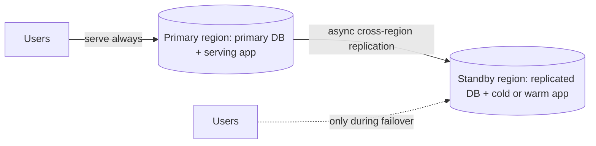
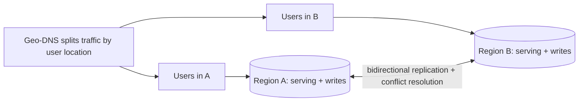

# Active-Active vs Active-Passive Regions

## 1. One-Line Definition
Active-active runs independent live copies of the service in multiple regions that all serve users and write data; active-passive designates one region as live and others as warm or cold standbys that serve nothing (or read-only) until a [[regional-failover|Regional Failover]] promotes them.

## 2. Why Do We Need It?
Running in one region gives you one guaranteed blast radius: that region's failure is your outage, no matter how many instances you run inside it. Multi-region exists to survive an *entire region* dying (or becoming unreachable). The design question is how much the spare regions actually do: wastefully idle (passive), carrying reads only, or fully serving writes themselves (active). The answer drives cost, failover speed, complexity, and what data the users can get when a region drops.

## 3. Simple Intuition
One head chef cooks all meals in the main kitchen; a backup kitchen sits ready and dark. Active-passive: if the main kitchen catches fire, the crew runs next door and starts cooking — the backup kitchen saved your dinner, but there's a scramble (downtime) and you ate what was half-prepared (data loss window). Active-active: two kitchens *both* cook live; if one burns down, the other keeps serving instantly — but now two chefs can both salt the same dish, so you must spend effort keeping their recipes and ingredient stock consistent.

## 4. What Happens Without It?
One region = one failure domain. A data-center fire, an internet path cut, or even a bad regional deployment takes 100% of users down simultaneously. You may have excellent availability *within* the region ([[availability|Availability]]), but the region still has a correlated-failure mode you cannot design away — no number of AZs fixes a region-level disaster if you only live in one region.

## 5. Core Idea
- **Passive (standby) models:** one primary region; a standby region holds the data copy (via [[cross-region-replication|Cross-Region Replication]]) and is *not* serving user traffic. Variants: warm standby (infra running, replicas live, minimal compute), cold standby (nothing running, restore-from-backup — cheapest, slowest), pilot light (core minimal services on to validate the copy). Serving reads from the standby is "read-active, write-passive".
- **Active-active:** two+ regions each serve their local users and accept writes. Traffic is split by [[geo-dns-anycast|Geo-DNS and Anycast]]/geo DNS; each region owns its replica set. The price is that a write can land in any region, so the storage layer must be multi-master: conflict resolution, replication in both directions, and a story for "same key edited in two regions" (see [[global-consistency|Global Consistency]]).
- **Partial active:** the pragmatic middle — most of the stack is active-active (stateless services, caching, read replicas everywhere) while the *database* is active-passive (one primary for writes, replicated read-only) or sharded per region (each region owns a slice).
- **What failover needs:** passive needs the RTO (time-to-recover) and RPO (data loss) budgets to be enforced by replication lag + promotion time; active-active has nothing to "promote" — the surviving regions just carry on.

## 6. Important Terminology

| Term | Simple Meaning |
|------|----------------|
| Active region | A region currently serving user traffic |
| Passive/standby region | A region holding a copy but not serving (or read-only) |
| Warm standby | Infra running + replicas current; promote = traffic flip |
| Cold standby | Nothing running; promote = rebuild from backup |
| Pilot light | Minimal core running to keep the copy warm and validate it |
| Multi-master | Multiple regions accept writes independently |
| Promotion | Making the standby the new live region |
| Replication lag | How far behind the standby is (drives RPO) |
| Blast radius | The set of users/services harmed by one failure |

## 7. Basic Architecture

Active-passive:



Active-active:



The difference is visible in the arrows: passive has unidirectional copy and an idle standby; active has bidirectional replication and everyone writing.

## 8. Request or Data Flow
1. Active-passive: every request lands on the primary region (steered by [[geo-dns-anycast|Geo-DNS and Anycast]]). The standby runs only what's needed to keep the copy current (replication processes, maybe health probes). On a primary failure, DNS/steering flips to the standby's IP; the standby's app is started/promoted, the replicated DB becomes primary, and traffic resumes after the RTO window.
2. Active-active: geo-DNS sends each user to their near region. A write hits Region A's local primary; replication ships it to Region B (which may persist or apply it later); a read in Region B either sees the replicated copy (possibly behind by lag) or must go to A for fresh data. Both regions must handle "what if the same record was written in both?"

## 9. Practical Example
**Payments/ledger service** (needs correctness, tolerates brief failover): primary in us-east, warm standby in eu-west. RPO=0 means synchronous replication is too slow cross-continent, so they accept RPO≤1 s of async lag. On month-end the primary dies: promotion takes ~90 s (RTO), standby serves the last ~0.8 s of writes are gone — accepted by design.
**Chat/messaging** (latency-first): active-active in 3 regions. Each region's members' state lives locally; a message to a foreign region is replicated asynchronously and displayed when it arrives. No promotion is ever needed — a dead region just stops being a target and its users re-route, but "read your messages from the region that died before failover" needs the replication story to catch up (see [[cross-region-replication|Cross-Region Replication]]).

## 10. Scaling
- **Active-passive doesn't add capacity:** the standby usually carries nothing, so 2x the regions ≈ 2x the cost for 1x useful capacity (warm standbys can be cheap: minimal compute, replicas on smaller boxes).
- **Active-active adds capacity about linearly with regions** for the stateless/read paths — until the inter-region replication pipeline or merge work becomes the bottleneck (conflict merge is proportional to cross-region write overlap).
- **The write footprint decides what scales:** if all writes are regional (users only write where they live), active-active scales writes per region; if any global key is hot (one user writes from everywhere), you now replicate a hot key everywhere and create cross-region hotspots.
- **Sharding per region (region-partitioned) is the usual scaling answer:** each region is the primary for *its* tenants/users, reads/writes stay local, and only cross-region ops replicate — this is the config that makes active-active actually scale (see [[sharding|Sharding]], [[sharding-strategies|Sharding Strategies]]).

## 11. Reliability and Failure Scenarios

| Failure | Active-Passive (warm) | Active-Active |
|---------|-----------------------|---------------|
| Primary region dead | Promote standby; RTO = promotion time; RPO = replication lag | Other regions keep serving; users re-route; un-replicated writes in the dead region may be lost |
| Link between regions down | Will happily fall behind; must alert on lag | Split-brain risk: two regions serve and write; reconciliation later or data conflicts |
| Both compute regions up, DB split | Standby can't promote cleanly without fencing the primary | Regions disagree on a key value until merged |
| Slow-lane secondary problems | Lag grows silently | Replication backlog + stale reads in region B |

In both models the hard failure is not "one region died" — that's scripted — it's *the network between the regions*: active-passive must stop promoting while the primary is possibly alive (fencing), and active-active must survive every request being served while the merge queue strains.

## 12. Consistency and Correctness
- **Active-passive can give you near-strong consistency:** one write-primary, replicas read-only; readers just tolerate lag (weakly consistent reads, monotonic if you pin reads). The correctness question is only the failover race: a promote must fence the primary (cut its clients) so two primaries never both accept writes.
- **Active-active gives eventual consistency across writers by default:** two regions can write the same key. You resolve with LWW (last-writer-wins, simple but lossy), version vectors/conflict fields, or application-level ownership (a key is "owned" by one region — writes to a foreign key route or replicate home). You cannot have strict global serialization without a global consensus trip (~RTT) per write, which is what the whole active-active design is avoiding.
- The classic failure: the same user edits the same document from Region A and Region B around a region transition — one edit gets silently overwritten unless your conflict mechanism captures it.

## 13. Performance
- **Active-passive:** users in far regions get a latency penalty (their requests still travel to the primary); the standby adds ~0 to user latency but costs money and network. Reads can be served from the standby region to cut user latency on the read path (read-active).
- **Active-active:** users get near-region latency on everything, the headline win (cross-continent RTT → local hop, often 4-5x better).
- **The tax is replication:** async cross-region replication moves all writes (with WAN RTT on the critical path only if you go synchronous — and sync across regions caps write latency at the cross-region RTT, ~100+ ms, which is why async is the default). Reads in a non-owner region of a hot key pay either staleness or a remote round trip.

## 14. Security
- Replication links are a data-exfiltration surface: every cross-region pipe must be authenticated and encrypted in transit; a leaked replication credential reads the whole dataset from any region.
- Active-active multiplies the key/secret footprint per region — least-privilege per region, short-lived credentials, and per-region audit.
- Data residency interacts: an active-active design shoves every user's data into every region. If a market forbids that (e.g., EU data leaving the EU), active-active with global replication is illegal there — use [[data-residency|Data Residency and Sovereignty]] guards (region-partitioned writes, no cross-border replication of that data).

## 15. Trade-Offs

| Choice | Advantages | Disadvantages | When to Use |
|--------|------------|---------------|-------------|
| Active-passive (warm) | Simple consistency, predictable RTO/RPO, full data copy | Wasted capacity, far-users pay cross-region latency, promotion is a real cutover | Critical correctness, decent failover tolerance |
| Active-passive (cold) | Cheapest | Long RTO (minutes to hours), restore complexity | Non-critical or budget-bound |
| Active-active (shared multi-master) | Instant region survival, near-region latency, writes everywhere | Eventual consistency, conflict merge, replication bandwidth | Read-mostly/regional-write systems (catalog, chat, SaaS tenants) |
| Region-partitioned active | Writes local, low merge, scales | Global-entity operations cross regions; some data still stuck per region | Multi-tenant SaaS where tenants are per-region |

Limitations to state out loud in interviews: active-active cannot promise strong global consistency without paying global-consensus latency, and its complexity (merge, split-brain handling, promo fencing) is strictly higher than active-passive's.

## 16. Common Mistakes
- Treating the standby as "free" — warm standbys cost real money and capacity is wasted.
- Active-active without a defined conflict-resolution rule: merge is not "automatic", LWW is a data-loss choice, and deletion-vs-update races eat records.
- Forgetting fencing on promote: two live primaries after a split is the worst distributed failure, silently splitting writes.
- Ignoring replication lag: designing "write-active" regions but a non-owner read path that then returns stale or wrong data for a hot key, with no mechanism to go read from the owner.
- Believing "geo-DNS active-active" means the database is too: a stateless app shop with a single shared central DB is NOT active-active at the data layer, no matter how many regions serve HTTP.

## 17. HLD vs LLD Boundary
HLD: choose model (passive/warm/cold/pilot/active), set RPO/RTO budgets from business limits, decide write ownership (shared vs region-partitioned), pick steering and promotion triggers, define conflict policy. LLD: the replication pipeline config, fencing implementation, the DNS health-check interval, the promotion runbook and its cutover switch.

## 18. Interview Questions

### Beginner
- What is the difference between active-passive and active-active for the *database* layer?
- Why does "all service instances are spread over two regions" not make the system active-active?

### Intermediate
- A banking ledger wants multi-region DR with RPO≤1s and RTO≤2min. Which model, what replication, and what numbers can you honestly promise for cross-continent?
- How do reads work in an active-active chat system when a user's "home" region is down?

### Advanced
- Your active-active system has two regions write the same user's record in a 300ms overlap around a failover. Walk the conflict resolution — where is the data lost?
- Design region-partitioned active-active for a SaaS where one tenant can have users in two regions, without moving their writes off their home region.

## 19. Interview Memory Summary

> [!abstract]- Interview Memory Summary

### Remember

- Active-passive: one write-primary, standby serves nothing (or read-only); failover = promote; consistency stays strong; capacity is wasted.
- Active-active: every region serves and writes; failover = nothing to promote, surviving regions carry on; consistency becomes eventual with multi-master.
- The RPO/RTO budgets drive the model: passive's RTO = promotion window + replication gap; active's "RTO" ≈ the steering/DNS switch, RPO ≈ unreplicated tail of the dead region.
- Region-partitioned (shard-per-region) is how active-active actually scales and keeps writes local.
- Fencing matters: promote must cut the old primary first — two live primaries is the worst failure.
- Conflict resolution must be designed, not defaulted (LWW is a data-loss choice).
- Cloud services running "in two AZs/regions" are only active-active if the *data* is multi-master.

### 30-Second Explanation

Active-passive runs one primary region and a standby holding a replicated copy that serves nothing until promoted (`RTO = promotion`, `RPO = lag`); it is simple and consistent but wastes capacity. Active-active runs live write-capable regions for everyone, giving near-region latency and instant survival, but multi-master writes force eventual consistency, conflict resolution, and split-brain handling. Sharding per region keeps writes local and makes the model scale.

### Interview Traps

- Conflating "stateless app in two regions" with a multi-region *data* design.
- Quoting RPO=0 for async replication — sync across a WAN caps write latency at ≥ ~RTT.
- Forgetting fencing/promotion cutover in active-passive.
- Assuming LWW conflict resolution is acceptable without flagging it as data loss.

### Key Trade-Off

Strong consistency + simple failover in active-passive, versus near-region latency + instant survival but eventual consistency and merge complexity in active-active — the write footprint and RPO/RTO decide which price you pay.

## 20. Related Concepts

### Prerequisites

- [[standby-models|Standby Types / Active-Active / Active-Passive]]
- [[disaster-recovery|Disaster Recovery / Backup / Restore]]
- [[rpo-rto|RPO and RTO]]

### Commonly Used Together

- [[regional-failover|Regional Failover]] (how promotion/steering actually executes)
- [[cross-region-replication|Cross-Region Replication]] (the data pipeline the model depends on)
- [[geo-dns-anycast|Geo-DNS and Anycast]] (how traffic is directed at the live region(s))

### Alternatives

- [[standby-models|Standby Types / Active-Active / Active-Passive]] — the granular standby taxonomy (warm/cold/pilot light) is a refinement of this concept.
- Single-region with multiple AZs (when a region's failure is acceptable)

### Advanced Concepts

- [[global-consistency|Global Consistency]] — the ceiling on active-active promises.
- [[failover|Failover / Automatic Failover]] — promotion mechanics within a region vs across.

Related planned topics (not authored yet): cloud infrastructure (regions/AZs), cell-based architecture.

## 21. References
The standby taxonomy (warm/cold/pilot light) is standard DR practice (see AWS/cloud DR docs on disaster recovery strategies), and RPO/RTO definitions come from industry continuity standards (e.g., ISO 22301). Presenting concrete RPO/RTO numbers should be verified per workload and cloud.

## 22. Active Recall

Test yourself before revealing each answer.

> [!question]- What does "RPO" and "RTO" actually mean for a passive standby?
> **RPO** (data loss) = how far behind the standby is — for async cross-region replication that's the replication lag (if the primary dies, everything written in the last lag-seconds is lost). **RTO** (time to recover) = promotion time: spinning up/applying, flipping DNS/steering, and serving - the standby's infra state (warm vs cold) is what pushes RTO from minutes to hours.

> [!question]- Why is active-passive's database strongly consistent but active-active's not?
> Passive has exactly one write-primary, and everything else is a lag-tolerant read replica — reads-with-lag is weak but the *write path* is serialized. Active-active lets any region accept writes to possibly the same key, so two writers can legitimately diverge; you need conflict resolution (LWW, version vectors, ownership) and you lose total global ordering.

> [!question]- What does "fencing the primary" mean and why is it non-negotiable?
> Before promoting the standby, you must **prove the old primary is dead (or cut it off)** — its app, its storage clients, its entire write path — so two regions never both accept writes for the same dataset. Skipping fencing is how split-brain starts: two live primaries silently diverge forever.

> [!question]- Your SaaS has tenants; you want active-active. How do you make it scale AND keep writes local?
> **Region-partition it**: assign each tenant a home region and make that region the sole write-primary for that tenant (a shard-per-region pattern, see [[sharding-strategies|Sharding Strategies]]). Writes stay local → no cross-region merge, no global serialization — active-active essentially becomes many independent active-passive shards that share an edge/catalog.

> [!question]- Two regions overwrote the same key around a cutover; you chose LWW. What did you really promise the user?
> That the **last write wins by timestamp** — and if the clocks disagree (NTP skew, region A's "later" wall-clock is actually earlier), you can silently pick the wrong edit. LWW is simple, never blocks, but is a documented data-loss decision; version vectors or business-level owner-of-key fixes it.

> [!question]- When is active-active cheaper than active-passive despite 2x the regions?
> When **capacity is genuinely 2x useful**: active-passive's standby consumes ~0 user traffic, so you pay for two full footprints for one job. Active-active serves half its users from each region, so the second region's hardware is doing real work — the extra cost is the replication pipeline + conflict machinery, not idle iron.

> [!question]- The cross-region link is severed for 10 minutes. Diagnose the divergence in active-active.
> Region A and Region B both served and wrote for 10 minutes with no exchange. Every key they both touched now has two versions; reads may differ; the merge queue is backlogged and must be replayed with your conflict policy (LWW could flip the "winning" value on replay order). Active-passive, by contrast, must have alerted on lag and paused rather than promote into a possibly-alive primary.

## 23. When Should I Use This?

### Use it when

- Business reality demands surviving *an entire region* dying (not just one AZ).
- You can quantify RPO/RTO budgets (see [[rpo-rto|RPO and RTO]]) and the model you pick must meet them.
- Latency to far users matters and you can afford the replication/merge machinery (active-active).
- Compliance allows data to live in (and be replicated into) the regions you plan to run.

### Avoid it when

- A single region with multi-AZ redundancy meets your availability target — multi-region is expensive and complex.
- Your writes need strict global serialization/ordering (very hard to buy back in active-active).
- Data-residency law forbids replicating the payload to the standby/partner region (see [[data-residency|Data Residency and Sovereignty]]).
- The team can't operate fencing, promotion runbooks, lag monitoring, and conflict replay — you'll get a worse failure than a single region.

### What problem does it solve?

It removes the *region* as a single point of failure and gives distant users a closer, often faster region — turning one correlated blast radius into several smaller, survivable ones with a defined price in RPO/RTO and consistency.

### What problem does it NOT solve?

It does not give you global strong consistency at active-active write speed, does not eliminate the replication-lag window, cannot reconcile writes made by a dead region that never replicated, and does not remove the need for correct failover orchestration (fencing, cutover, conflict replay) — and it cannot override data-residency law by being clever.

## 24. Decision Connections

Decisions that go together with choosing a multi-region model:

- [[standby-models|Standby Types / Active-Active / Active-Passive]] — the granular taxonomy this concept generalizes; read it for warm/cold/pilot-light details.
- [[rpo-rto|RPO and RTO]] — the budgets that constrain which model is even legal for your data.
- [[disaster-recovery|Disaster Recovery / Backup / Restore]] — passive is a DR strategy; restore-from-backup is the cold path.
- [[cross-region-replication|Cross-Region Replication]] — the pipeline active-passive and active-active both depend on; its lag is your RPO.
- [[regional-failover|Regional Failover]] — the executable side: steering flip, promotion, and the runbook.
- [[geo-dns-anycast|Geo-DNS and Anycast]] — how users actually get directed to the live region(s).
- [[global-consistency|Global Consistency]] — what active-active gives up and how to claw back a little.
- [[sharding|Sharding]] / [[sharding-strategies|Sharding Strategies]] — region-partitioning is how active-active scales.

Decision tree:

```
Multi-region or DR requirement
    |
    +-- Correctness first, failover tolerated in seconds?
    |      → [[multi-region-models|Active-Active vs Active-Passive Regions]] active-passive warm standby
    |         +-- Budget minimal → [[disaster-recovery|Disaster Recovery]] cold/pilot light, long RTO
    |         +-- Reads must be local too  → read-active, write-primary stays home
    |
    +-- Latency-first for global users?
    |      → active-active
    |         |
    |         +-- Writes are region-ownable (tenants/users per region)?
    |         |      → region-partitioned; the "right way"
    |         +-- Global shared keys are hot?
    |         |      → event only, or accept merge + [[global-consistency|Global Consistency]]
    |         +-- Illegal to replicate the data at all?
    |                → [[data-residency|Data Residency and Sovereignty]] overrides everything
    |
    +-- Failover mechanics
           → [[regional-failover|Regional Failover]] + [[geo-dns-anycast|Geo-DNS and Anycast]] + fencing
```