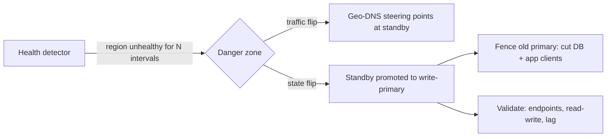

# Regional Failover

## 1. One-Line Definition
Regional failover is the orchestrated process of moving a region's traffic, write authority, and application state to a healthy region (or re-aiming users at a surviving region) after a whole-region failure, within an agreed RPO and RTO.

## 2. Why Do We Need It?
Running in multiple regions only pays off if the moment one region dies you can actually *use* the others. Failover is the glue: detect the region is gone, decide it's really gone (not a transient blip), stop the bleeding (stop traffic to it, fence stale writes), redirect users, promote the standby or rebalance ownership, and validate. Without good failover you have expensive redundant infrastructure that still goes down with the primary — the classic "pilot light is lit but nobody knows how to fly the plane."

## 3. Simple Intuition
A hospital network has two ERs. Active-passive: the second ER is staffed but empty. When the first loses power, the trigger isn't the power failure — it's the *decision* by a control team: verify the first ER is truly dark, hold ambulances there from being sent, page staff, and re-dispatch incoming patients to ER two. The margined part isn't the drill going well when everything is calm; it's doing it in 90 seconds under chaos. Failover is the drill, the dispatch logic, and the decision authority — not the second ER.

## 4. What Happens Without It?
Multi-region infrastructure without failover behaves like a single region: primaries fail, standbys stay idle, users stare at error pages, and on-call spends hours manually updating DNS and restarting stacks — or worse, someone hurriedly promotes while the primary is still alive and you get *two* primaries writing divergent data. The failure mode shifts from "region died" to "team improvised a promotion under panic".

## 5. Core Idea
- **The failover timeline is numbers, not vibes:** healthy-region detection interval → decision (lease-based, quorum) → DNS/steering flip → standby promotion → validation. Each step adds to RTO; replication lag adds to RPO.
- **Detect vs believe:** health checks can lie. A region can be up but unreachable (network partition). The rule: *do not promote into a possible split brain* — use a lease/quorum/fencing so authority passes only when the old primary is provably neutralized.
- **Two flips, two clocks:** failover has a *traffic* flip (steering → new region) and a *state* flip (standby DB becomes primary, app starts on it). Doing traffic before state serves errors; doing state before traffic risks routing users before the region is ready.
- **Rollback is a design input:** failover plans need a "go back to original region" path (or at least a declared destination), or users get stuck on a region you didn't mean to keep.
- **Active-active skips most of this:** no standby to promote; surviving regions keep serving and the steering layer stops pointing at the dead region. Its failover is mostly *undo* logic (conflict replay, ownership reassignment) — see [[multi-region-models|Active-Active vs Active-Passive Regions]].

## 6. Important Terminology

| Term | Simple Meaning |
|------|----------------|
| RTO | Max acceptable time to recovery |
| RPO | Max acceptable data loss |
| Promotion | Making the standby the new write-primary |
| Fencing/lease | Cutting off the old primary so only one owner remains |
| Steering flip | Changing DNS/traffic from old to new region |
| Split brain | Two regions believing they're primary |
| Detection interval | How often health is probed (sets RTO floor) |
| Runbook | The ordered, side-effecting steps a human/automation executes |
| Confusion/chaos drill | Deliberately exercising failover to prove the numbers |
| Pilot light | Minimal infra kept running to enable fast promotion |

## 7. Basic Architecture



The two lanes (traffic and state) must be orchestrated in order: fence → promote → validate → steer. Steering first or fencing last is where outages and split brains come from.

## 8. Request or Data Flow
1. Health probes report Region A unreachable for `K` consecutive intervals (avoid flaps).
2. Orchestrator confirms quorum/lease: Region A is declared failed; fencing cuts its write path so a later "it's actually fine" can't double-write.
3. Standby DB is promoted to write-primary (or Region-partition owners are reassigned); its app/cache warm-up runs.
4. Validation probes hit the new primary's endpoints before opening traffic.
5. [[geo-dns-anycast|Geo-DNS and Anycast]] flips answers to the new region with a low TTL already in place; users drain off Region A's stale IPs over the TTL window.
6. Old region is kept dark (or drained and re-imported) until data reconciliation confirms nothing was split; only then is it a candidate to come back.

## 9. Practical Example
A payments system: primary in us-east, warm standby in eu-west. Numbers budgeted up front:
- Detection: health probes every 10 s, `K=6` → ~60 s to declare.
- Fencing/promotion: ~40 s.
- Validation + steering flip (TTL 30 s): ~90 s of residual traffic on the old region.
- **RTO ≈ 60+40+30 ≈ 130 s; RPO = async replication lag ≈ 0.5-1 s** (those 0.5-1 s of in-flight writes are lost by design).
- The drill test asserts both numbers on a schedule; a failed drill is treated as an incident because the plan promised a number it can't meet.

## 10. Scaling
- **Failover scales in two directions:** more regions = bigger surface to keep consistent (steering, config per region), and more tenants = more parallel state to promote. Large orgs shard the failover domain: region-partitioned tenants so only the affected slice's authorities move (see [[multi-region-models|Active-Active vs Active-Passive Regions]]).
- **The orchestrator is a SPOF:** the control system that flips traffic can itself fail — run it in the surviving region or a third site, with manual override.
- **Steering TTLs must be set for the worst case:** if every name is cached at 300 s, your 130 s RTO is fiction. Keep routing names short-TTL permanently, not just "during a crisis."
- **Automate, but keep the runbook:** automation removes human reaction time, but a runbook with explicit stop conditions, permission gates, and a validation checklist is what survives an unusual failure the automation didn't expect.

## 11. Reliability and Failure Scenarios

| Failure | What Happens | Detection | Recovery | Trade-off |
|---------|--------------|-----------|----------|-----------|
| Primary region dead | Standby idle until promoted | Health + quorum | Fence → promote → validate → steer | RTO = interval+promote+steer |
| Network partition (region alive) | False-negative flags a live region | Quorum/lease distinguishes unreachable vs dead | Declare partition, don't promote; steer) | may serve degraded, never split |
| Fencing missing | Two live primaries → silent divergence | Replication split detection | Rebuild from a natural leader, reconcile | complexity |
| Steering cache stale | Users keep hitting dead region for up to TTL | Steer-health monitoring | Already-short TTL; client-side retry re-resolves | DNS load |
| Promotion succeeds, app not ready | Users served errors | Post-promotion validation | Start app before flipping traffic | longer RTO |

## 12. Consistency and Correctness
- Failover's correctness job is *ownership transfer*: authority (who may write) moves cleanly from A to B. The two instruments are **fencing** (old primary can no longer write) and **replication catch-up** (B has all of A's accepted writes up to the loss window, or an agreed "last applied" watermark).
- Ordering: a failover is a cutover. Writes accepted by A but never replicated are either replayed (from a WAL/outbox) or declared lost (RPO). Services must be idempotent on the replay path — re-applying a replayed write must not double-commit (see [[outbox-pattern|Outbox Pattern]]).
- The classic correctness trap: a client with an open connection to the dead primary writes "success" server-side, and the value vanishes because it never replicated. Design for at-least-once + idempotent de-duplication across the cutover.
- Split-brain prevention is non-negotiable: leases/quorum, or a third-site arbiter, so "the region became unreachable" can never be auto-promoted into "two primaries".

## 13. Performance
- Failover is a latency event in disguise: the RTO budget is the sum of detection interval, promotion operations, validation probes, and the steering residue window. Getting RTO from minutes to ~10s requires: sub-5s probes on a dedicated channel, auto-promotion, and short TTLs — each with its own cost (false positives, DNS load, standby compute on).
- Post-failover latency: users now routed to a far region pay the cross-region RTT until you either return home or accept the new geography.
- Replay/merge storms after promotion can saturate the new primary: throttle the replay, prioritize interactive traffic, backfill in the background.

## 14. Security
- The failover channel must be credentialed separately from the 9-to-5 release pipeline: an attacker who can flip DNS or promote regions has taken your whole fleet. Federated auth, short-lived credentials, and signed orchestration calls.
- Post-failover secrets: the new region needs valid certs, keys, and KMS grants *before* the flip — provisioning them during the crisis is how slow, correct failovers become fast, broken ones.
- Replication endpoints are prime exfiltration targets; encrypt in transit, and never disable TLS "temporarily" to speed promotion.

## 15. Trade-Offs

| Choice | Advantages | Disadvantages | When to Use |
|--------|------------|---------------|-------------|
| Short detection intervals | Faster RTO | False-positive failovers (failover itself hurts) | Correctness-critical systems, honest budgets |
| Auto-promotion | Removes human delay | Automates split-brain if detection lies | Quorum/lease-backed, well-drilled teams |
| Manual promotion with runbook | Human judgment on weird failures | Slow RTO (10+ min), human error | Complex systems, limited trust in automata |
| Pre-warmed standby | Fast promotion (~seconds) | Cost, constant replication load | Meet-required RTO |
| Cold restore from backup | Cheapest possible | RTO in hours, last backup bounds RPO | Budget-bound, low-value data |

Honest limitation: failover does *not* make a region-free-loss — the RPO window, the steering residue, and the human-in-the-loop decisions are real; a zero-downtime region failover for strongly-consistent workloads is usually folklore outside very specific (quorum, sync-replicated) setups.

## 16. Common Mistakes
- Failing to fence: promoting while the old primary can still write — turns a recoverable outage into a permanent data divergence.
- Designing RTO around TTL=300s DNS without ever flipping the values, then discovering the real price during the incident.
- No validation step: steering traffic to a promoted region whose app is still warming → error pages while "successfully failed over".
- Skipping drills until the crisis — the runbook's first real execution is the one that matters most.
- Forgetting the "return home" plan: users marooned on the fallback region for months because nobody owns the reverse failover.

## 17. HLD vs LLD Boundary
HLD: declare RPO/RTO, choose detection thresholds, define the fence/promote/validate/steer sequence and the decision authority, plan the return-home path, and design drills. LLD: the health-probe config, the lease/quorum implementation, the DNS records and TTLs, the promotion SQL/API calls, the validation curl set, and the runbook's exact commands.

## 18. Interview Questions

### Beginner
- Walk the order of operations in a regional failover. Why does order matter?
- What does "fencing the primary" protect you from?

### Intermediate
- Design failover for a system with RTO≤2 min and RPO≤1 s across two regions. What do you budget for each step, and where do you spend your margin?
- The standby is warm and healthy, but you're not sure the primary is dead. How do you decide whether to fail over?

### Advanced
- How do you keep the failover orchestrator itself from being the thing that breaks?
- Post-failover, how do you bring the original region back without duplicating or losing writes? Design the return path.

## 19. Interview Memory Summary

> [!abstract]- Interview Memory Summary

### Remember

- Failover = detection → fence → promote → validate → steer, in that order, each step adding to RTO.
- RTO/RPO are budget numbers; every step must be traced to a measured value, else the plan is fiction.
- Fencing/lease/quorum prevents split brain — never promote into a possibly-alive primary.
- Steering flip is not state: DNS moves traffic, the standby also has to be ready and validated.
- Short TTLs are set permanently for routing names, not "during the crisis".
- Replication run-out: promote at a "last applied" watermark; replay lost writes idempotently or declare RPO.
- Post-failover latency and replay storms are part of the plan; so is return-home.
- Drills are the only way the numbers stay real; a failed drill surfaces a promise the design can't keep.

### 30-Second Explanation

Regional failover is the orchestrated transfer of traffic and write authority from a dead region to a live one. Detect with probes + a decision rule that can't be fooled by a partition, fence the old primary, promote the standby to write-primary, validate, then flip steering (with pre-shortened TTLs). Every failure mode and RPO/RTO budget item is a number you defend; drills keep the numbers honest.

### Interview Traps

- Proposing auto-promotion without addressing split brain (quorum/lease/fencing).
- Promising RTO that TTL or a cold standby immediately violates.
- Flipping traffic before the promoted region is validated.
- Omitting the return-to-primary and the replay path entirely.

### Key Trade-Off

Faster steering/faster detection buys you lower RTO at the cost of more false-positive failovers (self-inflicted outages) and more standby compute — and RPO is paid in replication lag either way.

## 20. Related Concepts

### Prerequisites

- [[disaster-recovery|Disaster Recovery / Backup / Restore]]
- [[rpo-rto|RPO and RTO]]
- [[standby-models|Standby Types / Active-Active / Active-Passive]]
- [[failover|Failover / Automatic Failover]]

### Commonly Used Together

- [[multi-region-models|Active-Active vs Active-Passive Regions]] — the model defines whether failover is "promote" or "re-aim".
- [[geo-dns-anycast|Geo-DNS and Anycast]] — the traffic-flip half of the sequence.
- [[cross-region-replication|Cross-Region Replication]] — the pipeline whose lag is the RPO.

### Alternatives

- Active-active (no promotion step; survive-without-failover) — see [[multi-region-models|Active-Active vs Active-Passive Regions]]
- [[retry-and-timeout|Retry / Timeout / Exponential Backoff]] for absorbing short transient region blips without a failover

### Advanced Concepts

- [[global-consistency|Global Consistency]] — what the data does across a cutover.
- [[outbox-pattern|Outbox Pattern]] — how replay of un-replicated writes stays idempotent.

Related planned topics (not authored yet): chaos engineering, load balancer failover, cloud infrastructure (regions/AZs).

## 21. References
RPO/RTO concepts align with disaster-recovery practice (see DR strategy docs across major clouds, e.g., AWS disaster recovery strategies). Failover ordering/ fencing arguments appear in distributed-systems literature on leader transfer (DDIA cluster consensus chapters). Validate any promised RTO/RPO against your own measured pipeline.

## 22. Active Recall

Test yourself before revealing each answer.

> [!question]- What is the correct order of operations in a regional failover, and why can't you shuffle it?
> **Detect → fence → promote → validate → steer.** You must *detect* the failure (and rule out a partition), *fence* the old primary so it can never write again, *promote* the standby to write-primary, *validate* that the new region actually serves, and only then *steer* traffic. Steering before state serves errors; promoting before fencing risks two primaries.

> [!question]- What's the difference between a dead region and an unreachable region, and why does it matter?
> A dead region is proven gone; an unreachable one may be perfectly alive behind a broken network path. If you auto-promote in the unreachable case without fencing/quorum, both sides can believe they own writes — **split brain**, silently divergent data. That's why a quorum/lease/third-site arbiter decides, not a single health probe from one vantage.

> [!question]- What sets the floor for your RTO, concrete numbers?
> Detection interval (e.g., 10s probes × K consecutive = 60s) + promotion (40s) + validation (10s) + steering residue (TTL 30s). Roughly **RTO ≈ interval × K + promote + validate + TTL**. DNS TTL alone can be the entire budget item if routing names sit at 300s.

> [!question]- Where does RPO come from and what happens to the missing writes?
> RPO = the **replication lag + in-flight gap** at the moment the primary dies. Writes accepted by the dead primary but never shipped to the standby are replayed from a WAL/outbox (requires **idempotent re-apply** so replay doesn't double-commit) or are officially lost — that's the RPO you accepted.

> [!question]- The region "comes back". Why can't you just flip traffic home and turn off the standby?
> The old region was fenced: it was cut off mid-write with a possibly-stale dataset. Flipping home means you'd serve from a **divergent copy** and lose everything the standby accepted. Return-home needs: drain the standby's remaining writes, replay/merge them into the old region, validate equality at a watermark, then reverse the fence and steer slowly (drain, don't slam).

> [!question]- Your drills fail 30% of the time. What does that indicator actually tell you?
> The design's RTO/RPO numbers are **unlivable** — the cheap discovery in a drill is that the budget doesn't hold. Industry practice treats a failed drill as an incident: find the step that blows the budget (cold standby? manual DNS? validation scope) and invest there, because the real outage will be worse, not better.

> [!question]- How do you avoid the failover orchestrator being a single point of failure?
> Run the orchestrator/control plane **outside the region it decides about** (in the surviving region or a third site), let it act on **quorum/lease** rather than one health signal, give it a **manual override** console, and make its state (who holds the lease, who was fenced) durable and auditable — never only in the memory of whichever node is deciding.

## 23. When Should I Use This?

### Use it when

- You run any [[multi-region-models|Active-Active vs Active-Passive Regions]] and the standby is meant to ever serve traffic.
- You can name an RPO/RTO target this procedure must hit.
- A region-level failure would take a meaningful chunk of users offline if unaddressed.
- You can pay the standby cost (its compute, replication load) for the RTO you actually need.

### Avoid it when

- Single-region multi-AZ already meets availability; failover machinery is speculative.
- You can't run drills (failover you've never exercised is a prayer, not a design).
- Data-residency forbids running the standby in the target region (see [[data-residency|Data Residency and Sovereignty]]).
- Your correct cutover requires operations you know you won't maintain (a cold standby is a decision that RTO will be hours and you'll restore from backup instead).

### What problem does it solve?

It turns "regions exist" into "one region can die and users keep working", by systematically transferring traffic and write authority with a measurable RTO and an accepted, replayable RPO.

### What problem does it NOT solve?

It does not eliminate data loss in the lag window, does not reconcile a region that genuinely split with divergent writes (that's reconciliation, not failover), cannot beat a TTL you refuse to shorten, and — for active-active rather than active-passive — it stops being "promotion" and becomes "re-aim plus undo" work.

## 24. Decision Connections

Decisions that go together with regional failover:

- [[multi-region-models|Active-Active vs Active-Passive Regions]] — decides whether this is a promote-the-standby or a re-aim-the-survivors motion.
- [[rpo-rto|RPO and RTO]] — the budgets every step of the sequence is measured against.
- [[disaster-recovery|Disaster Recovery / Backup / Restore]] — the cold/long-RTO backstop if promotion fails.
- [[standby-models|Standby Types / Active-Active / Active-Passive]] — how warm the standby is decides the promotion cost inside your RTO.
- [[failover|Failover / Automatic Failover]] — intra-region leader failover; the same fencing ideas at smaller scale.
- [[geo-dns-anycast|Geo-DNS and Anycast]] — the steering-flip half; its TTL is half your RTO math.
- [[cross-region-replication|Cross-Region Replication]] — the lag that is your RPO and the replay source.
- [[outbox-pattern|Outbox Pattern]] — how to replay un-replicated writes idempotently across the cutover.

Decision tree:

```
Region failure survivable? set RPO and RTO budgets
    |
    +-- RTO must be seconds? → active-active or sync-replicated standby
    |      → surviving regions re-aim (see [[multi-region-models|Active-Active vs Active-Passive Regions]])
    |
    +-- RTO in minutes, correctness intact?
    |      → warm standby + [[cross-region-replication|Cross-Region Replication]]
    |         |
    |         +-- split-brain risk?       → fence with lease/quorum, never auto-promote blind
    |         +-- steering slow?          → short TTL + [[geo-dns-anycast|Geo-DNS and Anycast]]
    |         +-- must not lose the tail? → replay from outbox/WAL idempotently
    |         +-- RTO hour-plus, budget tight? → [[disaster-recovery|Disaster Recovery]] restore path instead
    |
    +-- Can't reach the truth (partition)?
           → fail SAFE toward [[retry-and-timeout|Retry / Timeout]] and hold, not toward auto-promote
```