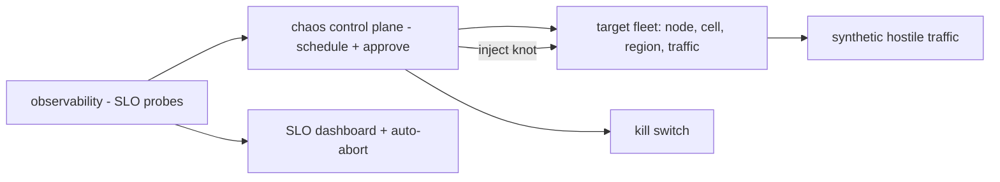

# Adversarial Reliability (Chaos at Scale)

## 1. One-Line Definition
Adversarial reliability is the discipline of deliberately attacking your own production system — injecting failures, latency, and hostile traffic ("chaos at scale") — to prove, over time, that the system stays within its SLOs when things go wrong, and to burn down the inventory of unknown failure modes before real users burn you first.

## 2. Why Do We Need It?
Every system has a long tail of unknown failure modes that no test suite predicts: a network partition nobody encoded in the unit tests, a cache stampede only a fleet-scale request burst triggers, a dependency that degrades just a little and poisons a whole query tree. You can't patch what you've never seen fail. Adversarial reliability converts "it must be reliable" from an assumption into a *measured, repeatable property* by failing the system on purpose, in small controlled doses, so the recovery paths are also the ones that are actually exercised.

## 3. Simple Intuition
Fire drills: you don't discover your building escapes well by waiting for a real fire. You evacuate on purpose — with a plan, a timer, observers, and a kill switch — so the first fire is comfortable by rehearsal. Chaos is the same as fire drills, but applied to servers: deliberately kill a node, slow a region, drop a message, fire a burst of bad traffic, and watch whether the system returns to the SLO runway before you're in the real fire.

## 4. What Happens Without It?
The first time each failure type occurs is in production, with real users attached; "recovery" was never tested, runbooks were written optimistically, and one slow dependency can cascade into a whole-fleet retry storm. Postmortem culture reviews what happened once, too late, instead of rehearsing what could happen many times in advance. Weeks are lost rediscovering that failover isn't automatic, retries aren't bounded, or a backup isn't restorable.

## 5. Core Idea
- **Chaos engineering has a goal, not a method.** The point is not "was anything broken?" but "did the system stay within its [[sli-slo-sla|SLO/error budget]] during and after the injection?" Failures are experiments with a hypothesis (which you then verify by measurements), not vandalism.
- **Inject at all layers on the spectrum of blast radius:** an in-memory fault in a library (fastest), a single host kill (standard), a whole cell/AZ synthetic partition (bigger), via infrastructure (`kill node`, drop packets, throttle CPU/IO) and application (-style fault injection: return errors, delay by profile x ms).
- **The experiment loop:** choose a steady state → hypothesize a stable behavior under a given fault → introduce the fault (bounded, observable) → verify recovery within SLO → clean up → find/learn and feed the fix into the roadmap.
- **Chaos needs guardrails:** auto-rollback triggers (if error budget is hit, stop the experiments), a kill switch, staged rollout of chaos in "playground" environments first, and full authorization via game-day runbooks.
- **Adversarial also means hostile traffic:** synthetic attacks (DDoS-like floods, malformed payloads, abusive tenant behavior, resource-exhaustion query patterns) are in scope, not just hardware faults — the enemies are both the universe and the users.
- "Assume failure" is an *invariant* of the architecture: every component must have a tested degradation mode, and the design must not require centralized lucky breaks.

## 6. Important Terminology

| Term | Simple Meaning |
|------|----------------|
| Chaos engineering | The practice of failing systems on purpose to learn their failure boundaries |
| Game day | A scheduled, planned, documented chaos exercise with observers and rollback |
| Blast radius | The set of traffic/infra an experiment is allowed to touch (must be bounded) |
| Steady state | The measurable "normal" behavior (latency/error/SLO) you perturb around |
| Fault injection | Deliberately making a component fail / slow / return garbage |
| Kill switch | Immediate way to abort all active chaos |
| Error budget | SLO allowance that chaos must spend *under* (chaos burns or protects it) |
| Hypothesis/experiment | "The system stays within p99 SLO when a node dies" → measure it |
| Fault list / failure inventory | The catalog of failure modes you have either tested or want to test |

## 7. Basic Architecture



## 8. Request or Data Flow
1. The chaos control plane picks a target (e.g., kill node-42 in cell-7), a fault (process kill), and bounds (region, tenant slice, time window).
2. Observers continuously sample golden signals (see golden-signals) — SLO baseline must be known before injection.
3. Injection happens; synthetic traffic may also be applied (burst, bad payloads, slow-attack) to stress the degradation path.
4. If the system drops below its error/SLO budget, the auto-abort triggers and the kill switch fires — experiment ends, incident page goes out.
5. Post-experiment: the recovery curve, the degraded behavior profile, and the gap between hypothesis and reality become the change request (fix, capacity, runbook update) just like a normal incident.

## 9. Practical Example
Three game-day experiments on a checkout stack:
- **Experiment 1:** "Kill 1 of 3 API instances in a cell." Expected: p99 stays < 200ms. Amateur result: p99 jumped to 1.4s because a heartbeat-reliant LB didn't drain the instance and the retry loop had no jitter — finding → fixed with faster health checks + jittered retries (retry-and-timeout).
- **Experiment 2:** "Latency injection +50ms on the payments dependency." Expected: checkout retries once and bounds at deadline. Result: bounded, but the *parallel* "recommend" leg queued for 20min of accumulating backlog — finding → shed that leg when upstream misses SLO.
- **Experiment 3:** "Flood 5x normal traffic for 60s." Found: LB melting before the app — scaling fix + admission control. Each experiment was hypothesis-first, bounded, observed, documented; the findings went straight into the roadmap.

## 10. Scaling
- **Scale to the blast radius you can afford to lose** — start with kill-single-instance, then cell, region later. Budget = error-budget allowance; if unbounded, chaos becomes a primary cause of incidents.
- **Experiment-driven fleet-wide** rather than one-off: the failure inventory (a ranked list of untested failure modes) IS the roadmap, and each experiment deletes one item.
- **Automated chaos as CI/CD gate:** run a "smoke chaos" (kill 1 pod of the newest deploy) in staging on every release, gate on recovery-within-SLO, so blast radius of experiments shrinks as confidence grows.

## 11. Reliability and Failure Scenarios

| Failure | What Happens | Detection | Recovery | Trade-off |
|---------|--------------|-----------|----------|-----------|
| Host kill experiment | Surviving replicas absorb load | p99 + capacity metrics | Autoscaling/reclaim via LB | Some added latency during |
| Dependency latency injection | The fan-out's slow leg tests the budget | Per-span latency | Time budget + shed (see tail-latency) | Extra noise in the metrics |
| Synthetic hostile burst | Overload queueing | Error budget breach | Admission control + kill switch | Availability dip during window |
| Region/cell kill | Serves from remaining cells | Region outage alerts | Failover per design (see standby-models) | Blast radius is region-level |

## 12. Consistency and Correctness
- **Chaos for correctness must be the "state-consistency" kind** (kill mid-transaction, see when DBs diverge) — chaos reveals correctness bugs (lateness, split-brain) but you must verify *which* invariants hold during the chaos, with data checks, not just "it didn't 500".
- Replaying chaos is a replayability use-case: rerun the exact faulty scenario in the lab to reproduce a state divergence (see replayability).
- Experiments must not *permanently* corrupt state: use synthetic tenant slices / test data, and verify post-experiment that recovery restores consistency (compare replicas, ledger hashes).

## 13. Performance
- Chaos has an operational cost: it consumes error budget (when it uncovers real failures), burns CPU/traffic, and can steal tail budget during the window. Chose small, short, reversible experiments to keep the cost bounded.
- Instrumentation for game days is the same observability you need anyway (per-span latency, per-cell metrics, error budgets); do not add dedicated chaos overhead to the hot path.
- The *value* is mostly narrative — knowing the recovery ceiling and the failure boundaries — which pays for itself in faster incident response.

## 14. Security
- Chaos as an attack surface: a compromised chaos control plane can kill everything. Restrict to SRE-only strong-auth identities, audit every injection, and isolate the control plane (MFA, least privilege — see authentication-vs-authorization and encryption-and-keys).
- Test the *real* security posture adversarially too: resilience drills must include malicious traffic (auth bypass attempts, DDoS floods, malformed inputs) so the defence is rehearsed, not assumed.
- Never route a chaos experiment through credential-bearing production paths unless the goal is exactly validating that path's confidentiality (then use test data).

## 15. Trade-Offs
- **Surface area vs trust:** you must be allowed to break things to learn; strict-but-bounded experiments keep production trust while expanding knowledge.
- **Test vs production:** staging chaos lacks realism; production chaos costs real budget. The senior move is start staging, graduate to canary-cell, then scale up slowly — never jump straight to full-region kill on day one.
- **Cost of instrumentation:** game days need observability everywhere (see observability); that was already the right investment, but it's still real money.
- Chaos does NOT prove "reliable" for all eternity: it proves the *tested* failure modes recover within SLO; the unbounded unknown remains. Honest engineering separates "tested" from "assumed".

## 16. Common Mistakes
- Chaos without a kill switch — one runaway experiment takes the whole fleet down.
- Chaos without baseline/SLO probes — you can't tell "broken" from "degraded but OK".
- Targeting the whole fleet at once instead of bounded blast radius.
- Treating chaos as "find bugs" theater instead of a hypothesis-verified experiment loop.
- Ignoring the human side: runbooks rewrite themselves *after* an experiment finds the gap.

## 17. HLD vs LLD Boundary
HLD: the chaos roadmap (which failure modes, in what order, at what blast radius), game-day structure, SLO-gate thresholds, kill-switch policy, and how it integrates with CI/CD. LLD: the specific fault-injection library call, one scripted experiment, the metric query that drives the auto-abort.

## 18. Interview Questions

### Beginner
- What is chaos engineering and what is its goal?
- What is the difference between a game day and a normal outage?

### Intermediate
- Design a game-day experiment sequence for a kill-a-node scenario with a kill switch.
- How do you keep chaos from burning your error budget in the middle of a real incident?

### Advanced
- Full-region fault injection on a system with active writes + payment flows: walk the design constraints.
- "Chaos is a wrapper around unknowns" — design an experiment inventory from SLO data.

## 19. Interview Memory Summary

> [!abstract]- Interview Memory Summary

### Remember

- Goal: prove by measurement that the system survives typically-untested failure modes within SLO.
- Method: hypothesis-first, bounded blast radius, observed via SLO probes, auto-abort + kill switch.
- Start with failures you can afford to lose: single node → cell → region.
- Rehearse recovery, not just detection: the runbook gets rewritten after each experiment finds the gap.
- Adversarial includes traffic: floods, malformed payloads, abusive tenants.
- Guardrail: chaos costs error budget; the ROI is a demystified failure inventory.
- Reprogram replay (deterministic rerun of the exact scenario) for the tricky state-consistency bugs.

### 30-Second Explanation

Treat failures as questions, not accidents: inject a bounded, scheduled fault into a test slice, compare the observed recovery against the SLO hypothesis with auto-abort and a kill switch, and turn the findings into fixes and runbook updates. Scale from pod to cell to region only as confidence and guardrails permit. This is how "reliable" becomes a measured, rehearsed property instead of a wish.

### Interview Traps

- "Chaos = kill everything" without blast-radius bounds or kill switch.
- No baseline measurement → the experiment can't tell degraded from broken.
- Ignoring that second-order errors (cascades, poison-pill requests) are exactly what chaos should surface.
- Doing chaos only in staging forever and claiming production confidence.

### Key Trade-Off

You spend real error budget and operational risk on rehearsal to buy a demystified, repeatably-verified recovery response — so the first real outage of a tested failure mode is boring and bounded, not novel.

## 20. Related Concepts

### Prerequisites

- [[reliability|Reliability]]
- [[availability|Availability]]
- [[sli-slo-sla|SLI, SLO, SLA]]

### Commonly Used Together

- [[observability|Observability]]
- [[golden-signals|Golden Signals]]
- [[distributed-tracing|Distributed Tracing]]
- [[failover|Failover]]

### Alternatives

- [[circuit-breaker|Circuit Breaker]]
- [[retry-and-timeout|Retry and Timeout]]
- [[rate-limiter|Rate Limiter]]

### Advanced Concepts

- [[tail-latency|Predictable Tail Latency]]
- [[cell-based-architecture|Cell-Based Architecture]]
- [[replayability|Deterministic Systems and Replayability]]

Related planned topics (not authored yet): chaos engineering as its own file, fault-tolerance, resilience patterns (bulkhead).

## 21. References
Principles of Chaos Engineering (2017 document, principlesofchaos.org). Netflix Chaos Monkey and Divine Comedy blog series (original chaos engineering references). Google SRE Book ch. 22, 23. AWS Fault Injection Simulator docs (current). Verify links for the current chaos-tooling landscape before citing.

## 22. Active Recall

Test yourself before revealing each answer.

> [!question]- What is the actual goal of a chaos experiment, and how do you know it failed or passed?
> The goal is to verify a hypothesis: "under this specific fault, the system recovers and stays within its SLO / error budget." Pass = the recovery curve stayed inside the budget; fail = it crossed (detected by the observer metrics and possibly the auto-abort). Its absence of a 500 is NOT the pass criteria — p99, error-free, and recovery time are.
>
> - The hypothesis is written down before injection; the measurement is compared to it.

> [!question]- Why is a kill switch a non-negotiable component of any chaos pipeline?
> Because an experiment is itself a failure that can go wrong: one bad injection can take down more than planned, a metric breach can snowball, or a real incident can be happening simultaneously. The kill switch (plus auto-abort on SLO breach and per-experiment blast-radius bounds) turns the experiment on and lets operators end it instantly.
>
> - A chaos platform that can't be stopped is a larger hazard than the failures it hunts.

> [!question]- Walk the ordering of a chaos rollout from zero trust to high trust.
> 1. Staging with the full observability + auto-abort in place; 2. Production single-instance/canary kill with post-hoc review; 3. Production cell-level experiments with a rollback plan; 4. Only after many green experiments, region-level storms with written authorization. Each level is gated on the previous level showing recovery-within-SLO.
>
> - You build trust progressively; the guardrails (kill switch, authorization, error-budget box) stay at full strength at every level though.

> [!question]- A chaos drill finds that retries replay without jitter when a dependency is slow. What's the real-world failure you just prevented?
> A retry storm is the amplification trap: when the dependency recovers, thousands of callers flood it simultaneously (thundering herd), each retrying at the same cadence — the cascade converts a 5-minute blip into a multi-hour outage. Jitter randomizes retry intervals (see retry-and-timeout), breaking the synchronized avalanche. Chaos drills exist to catch exactly this class of *secondary* failure, which no single-node test can trigger.
>
> - Order effects and cascades are the phenomena that only fleet-scale experiments reveal.

> [!question]- You run chaos against a payment pipeline; what guardrail decisions differ from a read-only service?
> (1) Only generate synthetic test tenants/transactions — replaying real money movement is forbidden; (2) verify post-experiment consistency (ledger hashes, reconciliation, no double-charge effect); (3) never inject into the actual payment-provider in pre-authorization; test cancellation/idempotency paths instead; (4) prefer cell/slice-level rather than fleet-wide propagation. You test the failure handling, not the money.
>
> - For state-mutating paths, chaos must be "safe to roll back", or it must only touch test scope.

> [!question]- Interview scenario: management asks "is our system resilient?" in one sentence before the demo. What do you say and how do you prove it?
> "We will show you resilience as a measured property: an experiment attacking X recovering inside p99-<budget> and error budget, with the recovery runbook attached." Then you run a bounded real experiment (kill a canary node, watch the SLO curve, show the runbook), not a simulation. If there's no experiment yet, the honest answer is "we don't know, and we need a failure inventory + game-day to find out."
>
> - The proof is live measurement against SLO, not architecture diagrams.

## 23. When Should I Use This?

### Use it when

- Your service must hold SLO/error-budget promises under real outages.
- You must validate failover, retry/circuit-breaker, capacity, and runbooks on the actual fleet.
- You are in a regulated/enterprise market where "we tested a fire drill" carries weight.

### Avoid it when

- You are the only person on-call for the entire platform (chaos without a support team is reckless).
- You lack observability that can tell degraded from broken (baseline is missing).
- You haven't run it in staging at all yet.

### What problem does it solve?

It converts "reliable" from an assumption to a rehearsed, measured property — catching the unknown failure modes that unit/staging tests can never trigger, and keeping runbooks true.

### What problem does it NOT solve?

It doesn't discover every failure (only tested ones), doesn't guarantee correctness under unplanned/novel faults, doesn't replace capacity planning, and can't make a system with a design-level SPOF (global mono-service, shared DB) "reliable" — it only proves what the architecture allows.

## 24. Decision Connections

Decisions that go together with adversarial reliability:

- [[sli-slo-sla|SLI, SLO, SLA]] — the error budget is both the guardrail and the pass/fail yardstick of every experiment.
- [[observability|Observability]] + [[golden-signals|Golden Signals]] — the measurement that turns chaos into data instead of vandalism.
- [[failover|Failover]] — rehearse the recovery path; you'll discover the failovers that were never tested.
- [[circuit-breaker|Circuit Breaker]] + [[retry-and-timeout|Retry and Timeout]] — the components chaos most often exposes as mobile/jitter-less.
- [[tail-latency|Predictable Tail Latency]] — latency-injection experiments directly test the tail budget.
- [[cell-based-architecture|Cell-Based Architecture]] — the blast-radius unit your experiments graduate through.
- [[replayability|Deterministic Systems and Replayability]] — reproduce a state-corruption finding in the lab, exactly.
- [[rate-limiter|Rate Limiter]] — the guardrail for synthetic hostile traffic.

Decision tree:

```
Do you know how your system behaves under breakage?
    |
    +-- If a node dies, do you have tested recovery?
    |      → run game day, bounded blast radius
    |         |
    |         +-- Recovery inside SLO?     → move up: cell, region
    |         +-- Recovery outside SLO?    → fix + runbook rewrite + replay in lab
    |
    +-- If a dependency slows, is latency bounded?
    |      → latency-injection experiment → deadline propagation / shed ([[tail-latency|Predictable Tail Latency]])
    |
    +-- If hostile traffic floods?
           → synthetic burst + [[rate-limiter|Rate Limiter]] + admission control, all gated by kill switch
```