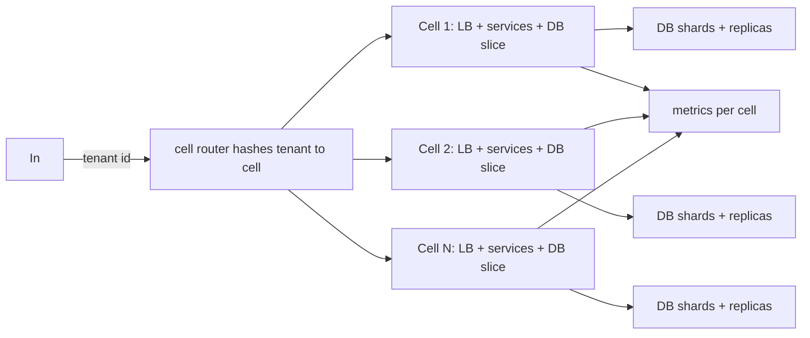

# Cell-Based Architecture

## 1. One-Line Definition
Cell-based architecture builds an application as many independent, self-contained "cells" — each running the full stack (front-end, API, services, data) for a disjoint slice of tenants — so that a failure, a deployment, or a load spike is contained to one cell instead of the whole system.

## 2. Why Do We Need It?
The single biggest scalability-and-reliability problem of a monolith or a flat microservice fleet is **blast radius**: any bad deploy, hot tenant, or database mishap can affect every user at once. Cells trade a shared "everything for everyone" system for many identical small systems, each owning a slice of users, so incidents stay local, capacity is additive per cell, and you can test like production (deploy to a cell, observe, roll). This is how Gmail, Sales Cloud, and Netflix's "pods" run billion-user services and still recover in minutes from a bad cell.

## 3. Simple Intuition
Instead of one giant restaurant kitchen where one burning pan burns every table, split into dozens of identical satellite kitchens, each serving its own room of tables. A fire in kitchen 7 only closes room 7. You can open a new kitchen when a room fills up, and you can test a new recipe on kitchen 7 before rolling it to the chain. Same menu, same chef training, but failure and load are *decomposed* — each kitchen is a complete, independent restaurant.

## 4. What Happens Without It?
Failure becomes global: a slow query, a hot tenant, a flaky deploy, or a connectivity hit anywhere degrades every user. Recovery is a fleet-wide operation (roll back, empty cache, restart). Capacity is all-or-nothing; you cannot serve a new customer segment without touching shared infrastructure. Testing can't approximate production because the test isn't isolated. Scale talks like "horizontally scaled" but reliability still behaves like one node.

## 5. Core Idea
- **A cell is a full, self-contained deployment:** its own copies of LBs, services, databases (its own shard set), queues, caches, observability — no shared state with other cells except "routing" and global control-plane metadata.
- **Routing decides the cell:** a request is assigned to a cell by hashing a stable key (user_id, org_id, device_id) — see shard-key. All of that tenant's data and activity lives in exactly one cell (its "home" cell); nearly all requests route to the home cell.
- **Isolation is the point, not the economy.** You deliberately *duplicate* infrastructure per cell to contain blast radius; the win is reliability + composability, not hardware efficiency (you often pay more for the luxury).
- **Cell membership is data-planned, not ad hoc.** Capacity is "cells × cellsize", you add cells to add capacity; cells are the unit of capacity planning, deploy, and failover.
- **Governance:** shared services (identity, billing, config, global search index) are "global" services that every cell calls; the discipline is deciding exactly what is per-cell vs global — fewer global touchpoints = better isolation.
- Cells compose cleanly with [[multi-region-consensus|multi-region]] layout: a cell can live in a region/AZ (region-cells) for the latency/isolation worst cases.

## 6. Important Terminology

| Term | Simple Meaning |
|------|----------------|
| Cell | One self-contained deploy + data slice; the unit of isolation, capacity, failure |
| Cell router | The routing layer that picks a home cell for a tenant |
| Cell key | The tenant/user key that decides the cell (must be stable) |
| Blast radius | The set (here: cell) impacted by a bad deploy/failure |
| Global service | A shared service every cell calls (identity, billing, config) |
| Cell slice | The data partition owned by a cell (a shard or a few shards plus replicas) |
| Cell capacity | Cells × cell capacity = total capacity; cells are the raw unit |
| Cell failover | Route a cell's tenants to a live (buddy/spare) cell |
| Overlay / routing-table | How traffic gets from the cell router to the serving cell |

## 7. Basic Architecture



## 8. Request or Data Flow
1. Request arrives at the router with a route key (usually a tenant/user id).
2. Router computes `cell = hash(key) mod N` from a small, cached routing table (see consistent-hashing so changes move few tenants).
3. Requests to the home cell hit cell-local LBs and services; cell-local DBs, queues, caches serve the data — no cross-cell leases.
4. A few truly global ops (identity check, billing, search across cells) call the global services explicitly; planned, rate-limited, and counted.
5. Observability is per-cell, so a problem is localized and a p99/availability slice per cell is visible (see golden-signals).

## 9. Practical Example
A SaaS with 10M orgs and a strict "no tenant should affect another". Define a cell as: a full microservice stack + its own DB shard set (2 nodes per shard, 3 shards per standard cell). Deploy 20 standard cells (20 × ~150k orgs). A bad deploy is released first to the "test cell" (one cell with the real data slice) for 1 hour; blast radius = that cell's 150k orgs, not all 10M. Capacity plan: when a cell hits 80% QPS or storage, split it (start a new cell, route half its tenants, dual-write during migration). Hot tenant? It is still one tenant and is *contained* by the cell — the worst case is a slow cell, not a slow fleet.

## 10. Scaling
- **Add capacity by adding cells** — the pure horizontal unit: capacity = cells × cell-size; no resharding of everything, no global rebalance.
- **Route table changes become the rebalancing problem** (see consistent-hashing): moving a tenant across cells requires dual-write + drain window, like shard migration.
- **Each cell scales within itself** (its own shards/instances); cells are the "large grain" scaling plane, so the fleet scales way past a single shard's limits.
- **Hot cells still need a playbook:** a cell with too many big tenants exceeds its ceiling — split the cell into two (split routes; data migration plan) or give a giant tenant its own "dedicated cell" (a common SaaS offering).

## 11. Reliability and Failure Scenarios

| Failure | What Happens | Detection | Recovery | Trade-off |
|---------|--------------|-----------|----------|-----------|
| One cell is down (bad deploy, infra) | Only that cell's tenants affected | Per-cell health metrics | Route tenants to a live or spare cell (see standby-models) | Temporary stop for the affected cell |
| Cell data corruption in one slice | Side-effect isolation: only that slice noticed | Cell-level consistency checks | Restore cell from backup / rebuild from replica | Data loss blast radius is 1 cell |
| Global service (identity/billing) degraded | Partial; cells can't authenticate, hard to shed | Global-service latency | Scale global service, shed non-critical calls | Shared reliability remains |
| Routing table flapping | Tenants ping-pong between cells | Route-health probe | Fast-quorum on router metadata | Some availability trade |
| Slow / hot cell | Contained slow tail for some tenants | per-cell p99 | Split/migrate cell's top tenants | Migration cost |

## 12. Consistency and Correctness
- A tenant's data is **cell-local**: reads/writes within a cell are single-tenant and transaction-scoped, so consistency is easy (see database-replication if you need cross-cell fallback).
- Cross-cell transactions are forbidden by design (your cell key must make them rare); for the rare global-ish op, use outbox/event-driven-architecture (async) or explicit global service.
- During cell migration a tenant lives in two cells briefly — dual-write both, read current, then switch the route (eventual-consistency window is per-tenant, small).
- Routing stability is a correctness property: you need read-your-writes — once a tenant is in a cell, its reads must stay there until migration flips cleanly.

## 13. Performance
- **Cell-local fan-out is not global fan-out** — a request touches one cell's stack; latency = within-cell cost (fast) vs cross-global-service calls (measured and budgeted).
- Per-cell observability shows p99 per cell, so you see "one cell is tired" instead of a global average hiding a bad cell.
- Replication overhead grows with cell count (each cell owns its replicas) — hardware *efficiency* drops; you pay cost for isolation.
- Empty/spare cells keep cold-start capacity: consider keeping 1-2 live cells partly idle to absorb a cell failure fast.

## 14. Security
- Cells give **strong tenant-level compartmentalization**: even if one cell is compromised, the data of other cells isn't reachable — a natural security boundary (defense-in-depth with cell keys + per-cell credentials).
- Route keys can be spoofed: the router must authenticate the tenant and derive the key from authenticated identity, not a client-supplied header.
- Global services see aggregated requests — enforce per-tenant authentication and audit at the global layer; role separation between cell key and global token.
- (This is not replacement for a firewall/WAF — see web-vulnerabilities; cells isolate consequences, not attacks.)

## 15. Trade-Offs

| Aspect | Cell-based | Monolith/shared fleet | 
|--------|-----------|------------------------|
| Blast radius | Small per cell | Global |
| Deploy risk | Low, per cell testable | Fleet-wide |
| Added cost | Duplicated infra | Lower (shared) |
| Capacity add | Add a cell | Vertical/scale the fleet |
| Cross-cell operations | Forbidden/rare; global services | Easy (shared DB) |
| Backups/DB payloads | Per cell | Global |

Additional honest cost: global services become a hidden shared SPOF you must size and watch continuously.

## 16. Common Mistakes
- Putting dozens of services in a cell with no per-cell budgets → cells save everyone but the biggest tenants still melt, and cells die together.
- Routing instability / flapping (bad route table) → churn, read-your-writes violations.
- Forgetting a "global" service is still shared: scale, budget, and monitor it like the colocated top in the old monolith.
- Building cells but reusing shared resource pools (blocked by global caches/queues) — you shipped a shared system with a cell-shaped logo.
- Migrating tenants between cells without dual-write + drain → data loss in the switchover window.

## 17. HLD vs LLD Boundary
HLD: what is a cell (services + data + its slice), cell count and size, routing key choice, migration procedure, global vs per-cell service cut, per-cell SLOs. LLD: the exact router lookup function, config that decides which services are global, the dual-write helper in one migration.

## 18. Interview Questions

### Beginner
- What problem does a cell-based architecture solve that plain horizontal scaling doesn't?
- How is a "cell" different from a "shard"?

### Intermediate
- Design a cell router and justify the key you'd hash.
- A cell is slow due to three big tenants. What are your fixes?

### Advanced
- Design the migration of tenants from one cell to two (no downtime, no lost writes).
- "Single global identity service" — when is that an acceptable bypass in a cell-based design?

## 19. Interview Memory Summary

> [!abstract]- Interview Memory Summary

### Remember

- A cell = full stack + its own data slice; cell = unit of capacity, deploy, and failure.
- Routing hash on a stable key decides the home cell — all of that tenant's data is cell-local.
- Blast radius = one cell: bad deploy, hot tenant, dead DB all stay local.
- Capacity = cells × cell-size; add cells to scale.
- Global services exist but are sparsely shared and sized deliberately.
- Tenant migration = per-tenant dual-write + drain + route flip; happens rarely.
- The cost is duplication; the win is containment.

### 30-Second Explanation

Slice the fleet into self-contained cells, route each tenant to one home cell by a stable key, keep intra-cell ops local, and allow only a tiny list of global services. Failure, deploys, and spikes then hit one cell instead of the world; you scale by adding cells and recover by routing around a dead cell. Pick the cell size so worst-case blast is acceptable, and plan tenant migration as the rare-but-designed operation.

### Interview Traps

- Claiming cells make global services optional — total shared infra still lives.
- Ignoring the routing table as a SPOF/consistency risk.
- Migrating tenants without dual-write and drain.
- Forgetting cross-cell ops: if the design needs many of them, cells are the wrong answer.

### Key Trade-Off

You trade hardware duplication and migration complexity for a dramatically smaller blast radius; the routing table and the few global services are the residual shared risk.

## 20. Related Concepts

### Prerequisites

- [[sharding|Sharding]]
- [[shard-key|Shard Key]]
- [[availability|Availability]]

### Commonly Used Together

- [[consistent-hashing|Consistent Hashing]]
- [[standby-models|Standby Models]]
- [[database-replication|Database Replication]]
- [[failover|Failover]]

### Alternatives

- [[stateless-vs-stateful-services|Stateless vs Stateful Services]] (keep it simpler at smaller scale)
- [[load-balancing|Load Balancing]] (a common "cheaper" path when blast radius is acceptable)

### Advanced Concepts

- [[multi-region-consensus|Multi-Region Consensus]]
- [[adversarial-reliability|Adversarial Reliability]]
- [[disaster-recovery|Disaster Recovery]]

Related planned topics (not authored yet): microservices, database-per-service vs shared DB, tenancy-and-cells.

## 21. References
Highly Scalable Service Design: cell idioms (Salesforce/Gmail-style "sharding on cells"). Netflix blog series on "pods" architecture (2015-2019). Verify current vendor docs (e.g., "cell-based architecture" in modern SaaS engineering blogs) for the latest idioms before citing.

## 22. Active Recall

Test yourself before revealing each answer.

> [!question]- What exactly is "a cell" and what does it contain?
> A cell is a *complete* deployment: its own LBs, services, caches, queues, databases (a slice of shards plus replicas), and observability — an independent mini-system that serves one slice of tenants. "Complete" is the key: no shared runtime state with other cells.
>
> - The shared parts that remain are the routing metadata and a short list of global services.

> [!question]- How does a request choose its cell?
> By a stable route key (user_id/org_id) hashed (or range-mapped) onto the routing table; the home cell then handles all of that tenant's reads and writes. It must be stable so read-your-writes and caches stay valid for a tenant.
>
> - Consistent-hashing the key keeps cell-count changes cheap (only some tenants move).

> [!question]- A big tenant is saturating its cell. What corrective moves are available?
> (a) Give it a *dedicated cell/sub-cell* so its load is its own; (b) split the cell into two cells and migrate half its tenants via dual-write+drain. You can't "fix" it by scaling the fleet since that helps everyone — the point is to *contain* the hot tenant and let the rest stay fast.
>
> - Your options are isolation (dedicated cell) or split migration; never let a hot tenant drag all cells.

> [!question]- What is the standard migration ritual when a cell must be split or replaced?
> Per-tenant: dual-write both cells for a drain window, read from the new, verify counts/hashes, then flip the route and stop dual-writing. Retain write timeline consistency while the route table changes. This is a *rare, designed* operation, not a runtime hotspot fix.
>
> - It's expensive, which is why cell sizing must anticipate growth; migrating is the exceptional case.

> [!question]- What are the biggest mistakes in a cell-based design? Name three.
> 1. Keeping or building shared resource pools (global cache/queue/DB) that cells still hammer or share, so isolation is cosmetic. 2. Treating global services (identity, billing, config) as free — they're the residual SPOF. 3. Routing instability/route-table flapping (vanishing read-your-writes) and unplanned cross-cell transactions.
>
> - The failure is when cells are "reliable apart from a few shared things that aren't."

> [!question]- Interview scenario: a fleet has 3 mono-services and every tenant sees every bad deploy. Walk the refactor to cells.
> 1. Choose the route key (tenant_id is ideal) and define the standard cell (the 3 services + their own DBs).
> 2. Move data per tenant into cells with dual-write migration; keep one global identity/billing service.
> 3. Set the routing layer behind the LBs; deploy per cell; make bad-deploy blast radius 1 cell, then measure.
> 4. Size cells for capacity + headroom; give giant tenants dedicated cells.
>
> - The monoculture of "a monolith of 3" to "a fleet of cells" is the story you can tell with numbers.

## 23. When Should I Use This?

### Use it when

- You need blast radius to be a *fraction* of the fleet (bad deploy, hot tenant, infra failure contained).
- Tenant data is partitionable by a stable key and can co-locate all ops (state is cell-local).
- You want capacity to be added in large, testable units (new cell = new capacity).
- You have the operational maturity for migration, routing-table management, and per-cell SLOs.

### Avoid it when

- Cross-tenant/cross-cell operations are frequent and performance-hungry (you'd fight the architecture).
- You still fit one or a few regions with acceptable blast radius and no hot tenants — this is severe overkill.
- The org can't yet run routing, migration, or per-cell deployment procedures.

### What problem does it solve?

Containing failure, deploys, and hotspots so the fleet keeps serving everyone while one cell misbehaves — plus genuinely additive capacity in large, testable units.

### What problem does it NOT solve?

It doesn't remove shared global services (identity, billing), doesn't fix an unboundedly large single-tenant (you still need dedicated cells), doesn't remove the need for replication/backups inside a cell, and — adding cells doesn't help a hot single cell.

## 24. Decision Connections

Decisions that go together with cell-based architecture:

- [[sharding|Sharding]] + [[shard-key|Shard Key]] — cells lean on sharding for their slice; the route key is a shard key.
- [[consistent-hashing|Consistent Hashing]] — cheap moves when you add/split cells.
- [[standby-models|Standby Models]] — spare/standby cells for fast failover.
- [[failover|Failover]] and [[disaster-recovery|Disaster Recovery]] — recovery becomes "route around the dead cell".
- [[multi-region-consensus|Multi-Region Consensus]] — placing cells across regions/consensus groups.
- [[observability|Observability]] — per-cell metrics are the punching bag; without them cells hide problems.
- [[adversarial-reliability|Adversarial Reliability]] — kill a cell on purpose to confirm containment.
- [[reliability|Reliability]] — the reason the whole architecture exists.

Decision tree:

```
Must contain blast radius and scale capacity
    |
    +-- Single good shard key and cell-local ops?
    |      → [[cell-based-architecture|Cell-Based Architecture]]
    |         |
    |         +-- Cross-cell ops frequent?   → no; keep few mono services / accept shared DB
    |         +-- Tenants too big per cell?  → dedicated cell per giant tenant
    |         +-- Move tenants often?        → [[consistent-hashing|Consistent Hashing]] + dual-write migration
    |
    +-- Blast radius acceptable in a shared fleet?
    |      → [[stateless-vs-stateful-services|Stateless vs Stateful Services]] + [[load-balancing|Load Balancing]] instead
    |
    +-- Cell placement spans regions?
           → [[multi-region-consensus|Multi-Region Consensus]] for the cross-region slice
```