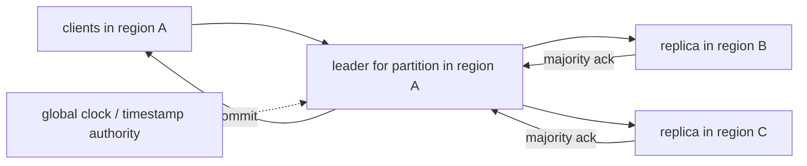

# Multi-Region Consensus

## 1. One-Line Definition
Multi-region consensus runs the replication and ordering algorithms that keep data consistent (often Raft/Paxos-style or globally-strong databases) across data centers separated by hundreds to thousands of kilometers, trading cross-region round-trip latency for the ability to survive an entire region's loss with strong consistency.

## 2. Why Do We Need It?
A single master in one region is a single point of control: if that region fails, reads and writes stop (or rely on a lagging async copy). Merely replicating asynchronously across regions gives DR, but a failover can lose recently acknowledged writes (see rpo-rto) and can conflict. Multi-region consensus makes cross-region replicas *first-class quorum members*: a majority quorum spanning regions can elect a leader and acknowledge a write even while an entire region is partitioned away, with a precise, standard consistency story (usually linearizable). It's how global databases (Spanner-style distributed SQL, CockroachDB, TiDB, Couchbase) deliver "global strong consistency" and region-failure tolerance at the cost of cross-region commit latency.

## 3. Simple Intuition
One government office issues IDs. If the building is lost, the whole state dies with it. Instead, run the office's ledger in a ring of three branches in three cities, all keeping the same book. A new ID is only issued once a *majority* of the branches have written it down (so even if one city vanishes, the record still exists). The tax: every issue has to wait for signed commitments from city 2 and 3 before it's confirmed — fast in one city, slower across the continent.

## 4. What Happens Without It?
You're faced with the "inconsistent mirror": async replication loses writes on failover, many regions can't agree on which data is current, transitions become "split-brain" prone, and you either accept stale reads after a region loss or you accept irreversible fork. Banks and exchanges cannot accept that, so without consensus they either shave availability (single region) or accept a DR system that can't really take over cleanly.

## 5. Core Idea
- **Consensus is a pipeline, not a feature:** quorum reads and writes, leader election, and log replication are one connected design. To have strong consistency across regions you must run the same protocol (Raft/Paxos/so) where *majority* of a quorum that spans regions is required.
- **Latency = quorum distance.** A write must reach the slowest member of the majority quorum and get its ack — its cost is one to two cross-region round-trips (the times the leader must wait), so multi-region consensus's core trade is *consistency for latency*.
- **Leader placement dominates the story.** Reads/writes concentrated in one region are well served by a leader in that region (replicas distant), low latency. Load spread evenly → the "distance to quorum" grows. Locality routing (e.g., leader-routing per partition) is the design lever (see standby-models for the passive twin version).
- **Two families of product:**
  1. **Protocol-native:** a Raft/Paxos group whose replicas span regions (e.g., etcd-tier, CockroachDB ranges, TiKV, Couchbase zones). Strong single-key linearizability; global SQL is built on many such ranges + a global timestamp scheme.
  2. **Global-timestamp distributed SQL (Spanner family):** per-shard Paxos + TrueTime (a global clock with bounded uncertainty) → linearizable reads/writes and externally-consistent snapshots across regions, with the clock-uncertainty tax on writes (commit waits ~ uncertainty).
- **The "3-region is the cost of a loss" math:** to survive the loss of any *one* region without losing a write, you must hold a majority across ≥2 surviving regions — that's the 3-region requirement for strictly-majority consensus (plus a quorum-witness in a third region for tie-breaking if latency matters).

## 6. Important Terminology

| Term | Simple Meaning |
|------|----------------|
| Quorum | Set of replicas (majority of N) whose joint ack decides the committed state |
| Cross-region RTT | Round-trip latency between data centers (often 40-150ms) |
| Leader / follower placement | Which region hosts the Raft/Paxos leader for a given partition |
| Linearizability | The strongest consistency model: an operation appears to take effect atomically at one point in time |
| TrueTime / global monotonic clock | A synchronized clock with bounded uncertainty (used for global ordering) |
| Witness / quorum witness | A replica that stores no data but votes, keeping a 3-area quorum with only 2 data regions |
| External consistency | Write timestamps are globally ordered consistently with real time |
| Region failure | Loss (partition or outage) of an entire data center grid |

## 7. Basic Architecture



The labels show the 3-region quorum-latency flow: writes commit only after the two far replicas ack (a cross-region round trip each), reads served by the quorum locally when the leader is co-located with clients.

## 8. Request or Data Flow
1. Read/write arrives at the region that hosts the leader for that key/partition (controller-assisted or directly via a global routing map).
2. Write: leader appends to its log, sends to ≥N/2+1 replicas including far ones; commit point = when the slowest *majority* member acks. In a 3-region group and all regions up, that means both far replicas must ack.
3. Leader then responds to the client — the write is linearizable and durable against loss of any single region.
4. Read: leader serves locally (fast path) or a global read goes through the quorum + clock, guaranteeing no stale-after-latest-write.
5. On a region failure, remaining replicas hold a majority and elect a new leader *from within the surviving quorum*; clients re-route.

## 9. Practical Example
Multi-region consensus with ~50ms cross-region RTT, 3 regions, majority = any 2. Write path: leader in region A, ack from B and C = one RTT+ to the farther, so p50 write latency ≈ 60-100ms (vs ~5ms for single-center). A client that *only* writes to region A sees ~2x the single-center write latency but gets linearizability + guaranteed survival of one region loss. Reads are local (fast). Result: an e-commerce catalog consistent from any region, with a famous pairing — "pay 2x write latency for the ability to lose a region" — acceptable for an order table, too slow for per-keystroke state (keep that per-region, events-merged).

## 10. Scaling
- **Write throughput scales with partitions:** each range/shard is its own consensus group; N leader-groups across regions multiply total throughput — the groups are the parallelism unit (see sharding).
- **Watch the far quorum:** if replicas span a very slow satellite region, every write pays its distance; move leader+runners into the region that owns the key (locality routing), or use quorum-witness in a third region to save the ack cost.
- **Read scaling:** leader reads in-region are cheap; snappier global reads come from a replicated "edge" readable tier (with bounded staleness) if you can relax linearizability (see strong-vs-eventual-consistency).
- **Spanner-style global ordering** needs the clock uncertainty to stay small — it's the tax on write latency; Sharded global-DB products spend effort keeping it uniform.

## 11. Reliability and Failure Scenarios

| Failure | What Happens | Detection | Recovery | Trade-off |
|---------|--------------|-----------|----------|-----------|
| One region partitioned | Majority still in the other 2; writes continue after cluster settles | Partition detection (gossip/config) | Follower regions elect leader; old region rejoins as follower | Old-region writes roll back |
| All of a quorum across 2 regions lost | Writes stop until the majority is restored (no 2-of-2 commit) | Quorum dead | Restore one far replica from backup | Availability gap |
| Leader region dies mid-write | Un-acked writes are lost; consistent, no fork | Failure detection + leader election | Surviving quorum elects new leader | Some recent un-acked writes are historically abandoned |
| Clock uncertainty spike (Spanner-family) | Writes stall for the uncertainty window | Clock error metric | Wait-for-only-uncertainty path | Latency cost on writes |
| Cross-region link degrades | Every quorum wait stretches | Inter-region RTT | Rebalance leader placement / witness | Latency for nobody in particular |

## 12. Consistency and Correctness
- **Linearizable single-key ops** are the base guarantee of Raft/Paxos across regions: strict one-shot, totally-ordered for the same key, no forks. Multi-key transactions use the global-timestamp + quorum scheme (Spanner-style) or shard-scoped 2PC across consensus groups.
- **External consistency** (a later commit always has a greater timestamp) is what global-timestamp banks require; it costs the clock-uncertainty wait on commit.
- Splits/conflicts: with properly run consensus there are *no* concurrent-write forks — precisely the guarantee async replication can't give. The price is the commit latency; if you can't pay it, the honest alternatives are per-region leaders + eventual merge (see strong-vs-eventual-consistency), not a fake "global consensus."

## 13. Performance
- Write path: ≈ 1-2 cross-region RTTs (leader→far ack + response). 3-region quorum with 2-ack = roughly `2 × RTT_max` from the leader.
- Read path: local-leader serves < 1 RTT; strong-global reads cost a quorum probe or clock wait in Spanner-style systems.
- Scaling: throughput = partitions × (group throughput); a region-wide bottleneck (e.g., GC, IO) on the quorum path hurts everyone in that group.

## 14. Security
- Cross-region consensus traffic is live writes/replication — encrypt in transit east-west (TLS/mTLS — see encryption-and-keys), and do NOT trust inter-region links implicitly.
- Inter-region network partitions are confusing for clients; ensure client-auth at the edge so a routed-to-a-foreign-leader request can't be confused with a spoofed client (authentication-vs-authorization).
- Do not put consensus leader-election metadata on plain HTTP; sign config updates (raffle-equivalent to the node identities).

## 15. Trade-Offs

| Approach | Consistency | Latency | Region-failure story | Cost |
|----------|-------------|---------|----------------------|------|
| Single-region + async replica | Loose (stale after failover) | Low | Loses a window of writes | Simple |
| True multi-region consensus | Linearizable | +1-2 RTT on writes | Durability of majority quorum | High ops/capacity |
| Global timestamp DB (Spanner-family) | External consistency | +clock uncertainty | Region failure invisible | Query/commit cost |
| Per-region leader + eventual merge | Eventual | Low | Merges later | Conflicts must be resolved |

The honest senior choice: the optimizer depends on whether you truly need *linearizable* cross-region failure survival (yes for money/ledger; no for many social caches).

## 16. Common Mistakes
- Believing a 2-region async "active-passive" setup is multi-region consensus — it's a half-copy, not a quorum-in-two-places.
- Underestimating the 3-region math: to lose-one-region with real durability you really need each range replicated to 3 regions (or a witness), and the ack latency grows accordingly.
- Writing like "every write must be global" when only a few tables need it — you pay global latency for everything.
- Ignoring clock skew on lane-to-lane distributed SQL — external consistency without a synced clock is fiction.
- Running consensus with leader placement poorly matched to the client distribution (they're wasting the fast path every remote read).

## 17. HLD vs LLD Boundary
HLD: quorum size per range (3-replica), leader region per shard, read/write routing policy, witness placement, external-consistency semantics, RPO/RTO target, failure drill on region-loss. LLD: the exact Raft implementation choice, the latency-observer that steers leader placement, the translation of clock error to wait time in the driver.

## 18. Interview Questions

### Beginner
- Why can't async-replication failover give you a linearizable system?
- What is a quorum and why does a majority decision require ≥N/2+1 votes?

### Intermediate
- You must pick 3 regions for a consensus-group database: which regions, which witness placement, and what's the write latency math?
- Compare "global leader" vs "leader per shard" for cross-region writes.

### Advanced
- Design a linearizable multi-region key-value store with a region failure tolerance — draw the write path, the failure path, and the clock story.
- When would you choose multi-region consensus over eventual-consistency (CRDTs / LWW) for a global product? Defend the boundary.

## 19. Interview Memory Summary

> [!abstract]- Interview Memory Summary

### Remember

- Consensus = quorum election + log replication; the minority does not write.
- Linearizable cross-region survival requires majority spanning ≥3 regions (or 2 + witness).
- Write latency ≈ 1-2 cross-region RTTs; read latency ≈ local if leader is local.
- Replicas per shard: place the leader with its clients; witness for cheap 3rd-region votes.
- Global-timestamp (Spanner-child) adds a clock-uncertainty wait for external consistency.
- Region failure: remaining quorum elects; un-committed writes from the lost region are rolled back.
- The design trunk: consistency for latency; the real choice is which tables need linearizable-global at all.

### 30-Second Explanation

Pick 3 regions, run a consensus group per shard (majority = 2 of 3), place each shard's leader with its clients. Writes cost one-to-two cross-region round trips (the ack of the far majority member); reads are local. A region loss leaves a majority quorum alive → election, no forks, no lost committed writes; un-committed writes from the dead region roll back. Add a global synchronized clock (TrueTime-family) for cross-shard linearizability at the price of a bounded wait. If write latency hurts, use per-region leaders + eventual merge instead.

### Interview Traps

- Claiming "2-region DR is multi-region consensus" — a quorum needs 3 or a witness.
- Naming a system "global SQL" without a clock story for external consistency.
- Forgetting that old-region un-committed writes are rolled back on partition recovery (not "recovered").
- "Async replicas give you the same data" — no: you have lost a committed-write window on failover.

### Key Trade-Off

Cross-region consensus buys region-loss survival with true linearizability in exchange for 1-2 cross-region round trips on every committed write — so use it narrowly on the tables that need it.

## 20. Related Concepts

### Prerequisites

- [[cap-theorem|CAP Theorem]]
- [[strong-vs-eventual-consistency|Strong vs Eventual Consistency]]
- [[database-replication|Database Replication]]

### Commonly Used Together

- [[failover|Failover]]
- [[standby-models|Standby Models]]
- [[replication-lag|Replication Lag]]
- [[rpo-rto|RPO and RTO]]

### Alternatives

- [[disaster-recovery|Disaster Recovery]] (async/odd-copy when linearizability isn't needed)

### Advanced Concepts

- [[cell-based-architecture|Cell-Based Architecture]]
- [[tail-latency|Predictable Tail Latency]]
- [[consistent-hashing|Consistent Hashing]] (for shard↔region routing)

Related planned topics (not authored yet): consensus / Raft in full, global consistency, cross-region replication internals, locality-based routing.

## 21. References
Kleppmann ch. 9 (consistency and consensus). Spanner paper "Spanner: Google's Globally-Distributed Database" (OSDI 2012) — TrueTime. Raft paper (Ongaro). CockroachDB/Couchbase/docs on multi-region topology. Verify current recommended preserve-configuration patterns from the chosen vendor docs.

## 22. Active Recall

Test yourself before revealing each answer.

> [!question]- Why must a majority quorum span 3 regions (not 2) to survive one region's loss?
> Because a 2-of-2 commit across two regions leaves you with no majority after either one fails: one region is gone, and a 1-of-2 minority can't elect a leader or quorum-commit. With 3 regions and majority=2, any single lost region leaves a 2-of-3 quorum intact in the survivors. A witness (votes, no data) in the third region gives the same property with only 2 data regions.
>
> - The "+1 majority" rule: N=3 tolerates ≥1 failure; N=2 tolerates none for writes.

> [!question]- Sketch the write path of a 3-region consensus group and the dominant cost.
> Client → leader (region A) → log append → replicas B and C → each ack → leader commits when ≥2 of the 3 (majority) have acked. Since B and C are both needed, the commit waits ~1 cross-region RTT (to the farther of B/C) plus response RTT — so ~2 × far-RTT total. That's the "1-2 round trips" rule of thumb.
>
> - Place the leader with the bulk of writers; any distant majority member sets the floor.

> [!question]- What does a global synchronized clock (TrueTime-style) add, and what does it cost?
> It adds *external consistency*: write timestamps are globally ordered and later commits always have higher timestamps, so a read from any region returns data no older than your last write, identically across all replicas — the property banks need. Cost: on commit (and strong reads), the leader waits out the clock's max uncertainty interval, adding a bounded (often ~10-20ms) pause on every such operation.
>
> - Clock uncertainty is unknown, so you wait, not guess.

> [!question]- What happens to un-committed writes when a region is partitioned away and re-joins?
> If the region held the leader and had not yet received the majority ack, those writes were never committed there — on partition detection they're abandoned; the remaining quorum elected its own leader; the ex-leader re-joins as a follower and reconciles from the committed log (no conflict, because only the committed prefix counted). This clean rollback is the point of consensus vs async merges.
>
> - Committed writes are never lost; un-committed writes never pop out of the partition as "refound" state.

> [!question]- When is multi-region consensus the wrong answer?
> When the dominant workload has aggressive, low-latency single-region write patterns and cross-region durability of *every* write isn't worth 2× RTT; when most tables are caches/timelines where eventual consistency suffices; or when you can't afford the 3-region capacity footprint. For those: per-region leaders + event-driven-architecture merge/CRDT-style resolution (see strong-vs-eventual-consistency), DR with RPO≠0 otherwise.
>
> - The classic answer: "strong-global only on the ledger tables."

> [!question]- Interview scenario: a global e-commerce API must serve reads fast in 3 countries and not lose an order if one country's cloud dies. What's your architecture headline?
> 1. Split: hot-path reads from a per-region readable corpus (stale-tolerant) + write path to the consensus quorum in the home region for orders. 2. Orders table: 3-region consensus group, leader in the user's home region (writes ≈ 1-2 RTT, p99 budgeted). 3. Catalog/product: per-region leader + eventual sync (event-driven, as-is). 4. Region-death drill on orders; kill switch + rehearse failover in a game day.
>
> - The design is *selecting* which tables join the quorum; the routing policy (region for reads, home-region quorum for ledger writes) is the HLD.

## 23. When Should I Use This?

### Use it when

- You promise linearizable/strong finality across regions (ledgers, inventory, money movement).
- You must survive a full-region loss without data loss or forks.
- You already have the 3-region footprint or can budget the capacity.

### Avoid it when

- Workloads are mostly cache/social/timeline reads where eventual is fine ([[strong-vs-eventual-consistency|Strong vs Eventual Consistency]]).
- Single-region write latency is the hard business constraint (payment swipe, real-time collaboration).
- You only have 2 regions and no witness, so the durability guarantee can't actually hold.

### What problem does it solve?

A globally-consistent, region-failure-proof state with a standard well-understood protocol — no forks, no lost committed writes, and a clean rollback discipline on region partition.

### What problem does it NOT solve?

It doesn't give you free cross-region *reads* at global speed (that needs a separated/eventually-consistent tier), doesn't make multi-key global transactions free (they need global timestamp/2PC machinery), doesn't handle cross-shard global transactions cheaply, and can't fix a design that never actually had 3-region quorum.

## 24. Decision Connections

Decisions that go together with multi-region consensus:

- [[cap-theorem|CAP Theorem]] — the partition-tolerance-consistency trade you are deliberately choosing.
- [[strong-vs-eventual-consistency|Strong vs Eventual Consistency]] — the boundary of where consensus is warranted.
- [[database-replication|Database Replication]] — the base machinery consensus replaces/extends.
- [[failover|Failover]] and [[standby-models|Standby Models]] — region failover vs active-active; consensus is the active-active spine.
- [[rpo-rto|RPO and RTO]] — set the numbers that justify consensus's latency.
- [[consistent-hashing|Consistent Hashing]] — routing keys to shard groups, now spanning regions.
- [[cell-based-architecture|Cell-Based Architecture]] — cells can own consensus groups by region.
- [[tail-latency|Predictable Tail Latency]] — the latency distribution your quorum-zone reads/writes actually promise.

Decision tree:

```
Do you need global-or-region-granular durability + consistency?
    |
    +-- Every write must survive the loss of one whole region (ledgers)?
    |      → [[multi-region-consensus|Multi-Region Consensus]]
    |         |
    |         +-- Only a few tables need this? → route those to the quorum, rest per-region eventual
    |         +-- Reads need global freshness? → strong read via clock or quorum
    |         +-- Latency matters in one region? → place leader there; witness in third region
    |
    +-- Region loss but no strict consistency required?
    |      → [[disaster-recovery|Disaster Recovery]] + [[standby-models|Standby Models]]
    |
    +-- Freshness eventually OK after a merge?
           → [[strong-vs-eventual-consistency|Strong vs Eventual Consistency]] per-region leaders
```