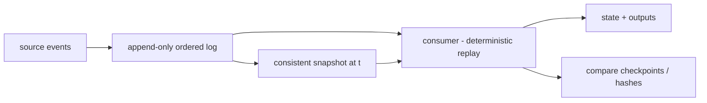

# Deterministic Systems and Replayability

## 1. One-Line Definition
A deterministic system produces the same final state from the same sequence of inputs, and replayability is the technique of re-running a captured input log against a snapshot to reproduce past behavior — exact for debugging, verification, and consistent recomputation.

## 2. Why Do We Need It?
Distributed systems are non-deterministic by nature: timers, clocks, random IDs, threads, remote calls, and unordered delivery mean the same "request" can produce different output on each run. That makes bugs hide — you cannot reproduce an incident by replaying its own requests. Deterministic execution + replay converts production to a laboratory: capture the real event stream, replay it on a snapshot, and observe exactly what a replica computed or would compute. Because you can re-run pipelines deterministically, you also get idempotent or exactly-once processing, time-travel debugging, safe re-processing after code changes, and confidence for downstream redistribution.

## 3. Simple Intuition
A chess game is replayable: record every move, and both you and any future engine recreate the exact same board. Distributed systems that record their "moves" (every event, every input, in order) the same way can be wound back and replayed — the second run should place pieces identically. Determinism is the rule that "a recorded move list always produces the same board"; replayability uses that rule to inspect the past.

## 4. What Happens Without It?
Incident debugging turns into guessing: "the bug happened only in production at 2am with 40 requests racing" and no one can reproduce it. Processing systems that re-run a stream produce different outputs each pass (double-counting, inconsistent aggregates), so exactly-once claims are fiction. You either freeze inputs forever (boring, untestable in labs) or you accept that downstream consumers can't trust a recompute.

## 5. Core Idea
- **Determinism definition:** same input *sequence* (including state + schedule of interleavings) → same output. Practical determinism is achieved by (a) replaying *ordering* — log every input with its position; (b) quantizing sources of nondeterminism — a component that needs `time.Now()` receives a frozen/virtual time, random comes from a seeded RNG, unique IDs come from a supplied sequence; (c) logging OS-level effects on the critical path (thread scheduling, message delivery order, clock reads, syscall returns).
- **Replayability = snapshot + log:** periodically checkpoint a consistent snapshot (the board) plus an append-only event log of everything after it (the move list). To reproduce: load the snapshot, apply the log the same way. This is why durable, ordered logs are the backbone (see kafka-ordering, kafka-retention).
- **Replay targets:** determinism of a *single pipelined consumer* (the common, achievable form) vs full-schedule replay of an *entire OS/multi-thread process* (the hard form, e.g., CNTV "deterministic replay" of a VM / per-thread interleaving hooks / record-replay of the scheduler).
- **Why it composes with stream processing:** a consumer that reads a Kafka partition from offset 0 is *deterministic-in-principle* if all its other inputs come from the same log. That's why streaming systems attach exactly-once to "replay from the offset with the same code" plus idempotent sinks (see kafka-delivery-guarantees).
- **Replayability is also an operational tool** — reprocessing a fixed log against an upgraded consumer gives you backfill, bug-fix repair, and version-diff verification without touching live traffic.

## 6. Important Terminology

| Term | Simple Meaning |
|------|----------------|
| Deterministic | Same inputs → same outputs / state with a fixed schedule |
| Replay | Re-running recordings: snapshot + log |
| Snapshot | Consistent frozen state checkpoint to base the replay from |
| Event log / command log | Append-only ordered record of all inputs to replay |
| Record-replay | Recording every nondet input (scheduler, clock, RNG, syscalls) to repair later |
| Virtual / frozen time | Fixed clock substituted for real time so the run is repeatable |
| Seeded RNG | Random-from-a-seed: repeatable sequence |
| Exactly-once effect | Repeatable processing + idempotent downstream = no double effects |
| Recompute / backfill | Re-run the log against newer code/versions |

## 7. Basic Architecture



## 8. Request or Data Flow
1. Production app logs every input *in order* to an append-only durable log (see outbox-pattern for the transactional-log pattern).
2. Periodically a consistent snapshot + the log watermark are taken together (same point in the event stream).
3. For replay/debug/backfill: load snapshot at watermark, connect the log *from that offset*, and re-run the consumer code.
4. Optionally, the rerun checksums its final state (deterministic hash) and compares to the original run — mismatch = code behavior changed or a nondeterminism slipped in.
5. On incident: reproduce the exact event interleaving that produced the bug, instrument meanwhile.

## 9. Practical Example
Price-correction pipeline reading a Kafka "order streams" topic (3 partitions, hot path). You promise "if we reprocess from midnight, everyone's totals match exactly". Implementation: snapshot the daily ledger at midnight into a key-value store + record the offset; consumer reads each partition in order, uses a frozen clock and seeded RNG (no real time, no true random). A Friday bug is found by: snapshot + offsets → replay the day's 2M events → reproduce the wrong total exactly → apply the fix → replay again → totals reconcile to the (correct) ledger hash. No live double processing; the fix never touches production.

## 10. Scaling
- **Snapshot scale:** snapshots are O(total state) — too large to take often. Mitigate: incremental checkpoints + the log between them (play the delta). The checkpoint is on restart; the log is the fast-growing part.
- **Log scale:** the log grows forever — retention tiers (kafka-retention: compact keyed events, drop by mindate), checkpoint-and-truncate, or keep only "state-increments" instead of raw input if replay isn't needed that far back.
- **Determinism scale:** full OS-record-replay (scheduler interleavings) at large scale is very expensive; at the *streaming* scale the pragmatic rule is: make only the pipeline deterministic (not the whole VM), accept that the *first* run and *re*-run share "code + log" determinism; the interleaving of *that* run is what re-runs in the lab.
- **Replay parallelism:** partitions replay in parallel (per-key ordering kept); a full rerun costs about the same as the original runtime.

## 11. Reliability and Failure Scenarios

| Failure | What Happens | Detection | Recovery | Trade-off |
|---------|--------------|-----------|----------|-----------|
| Snapshot inconsistent | Replay hard to trust | Snapshot+log watermark check | Take consistent snapshots (atomic) or rebuild from log | Costlier snapshot path |
| Log loss / compaction | Replay gap: cannot reproduce past | Duplication checks / interval gaps | Rebuild from a checkpoint; accept data loss | Retention choice |
| Nondeterminism leak in code (real time/random) | Replay diverges mysteriously | Compare checkpoint hashes | Strict discipline: froze-time inputs in audit | Effort to guard |
| Code drift (old vs new runs) | Replay with new code mismatches | Hash-check of states | Version the consumer: run-by-version | Versioning overhead |

## 12. Consistency and Correctness
- **Replayability equals exactly-once-effect:** replay from a snapshot + idempotent sinks re-runs the processing without affecting the true state — this is how at-least-once delivery is upgraded to *effective* exactly-once (see delivery-semantics).
- Ordering must be stable: the consumer must apply events in the *same* order on every run — partition-by-key logs give a reproducible per-key order (kafka-ordering).
- **Idempotent sinks are mandatory** (see outbox-pattern / idempotent producer): replaying may deliver the same output to a sink again; sinks must dedupe by event id or content-hash.
- Read-side replays see a "frozen" version of the world; you must not mix replayed (historical) data with live reads unless the semantic is explicitly "as-of" (see time-series-at-scale for the as-of-timestamp variant).

## 13. Performance
- Overhead: recording adds a log write per input (the cost of outbox/ordering — usually a single append). Full OS record-replay can cost 2-10x on syscall-heavy code; pragmatic pipeline determinism costs roughly the logging append only.
- Replay runtime ≈ original runtime + checkpoint restore; replay *parallelism* means you can usually beat the original time by adding workers.
- Memory: replaying a full log needs the snapshot resident; use compacted per-key state (retention = value for key) so state fits memory.

## 14. Security
- The log and snapshots are sensitive (full request/event data) — encrypt at rest and in transit (encryption-and-keys), apply the same access control as production data.
- Replaying a log re-*executes* requests: never replay live network effects (payment/email/webhook) on a production log into the outside world — that's double-sending. Replay to cold sinks or reproduced-environment targets only.
- Log forgery/poisoning: an attacker who can write the log can steer a replay to produce false recomputed results; protect write access and add checksums (content-addressable verification).

## 15. Trade-Offs
- **Record everything vs snapshot everything:** raw log forever = unlimited replay reach but storage; checkpoint often = fast recover but always-fresh state cost. Hourly checkpoints + a day of log is the sweet spot for most services.
- **Full determinism vs pragmatism:** OS-level record-replay is powerful but slow/memory-hungry; stream-pipeline determinism (frozen clock, seeded RNG, ordered log) is cheap and covers the practical case.
- **Determinism vs concurrency:** full concurrency is nondeterministic; to be deterministic you serialize or you record the interleaving. You trade parallel speed for reproducibility in strict-replay designs.
- Determinism discipline (no `now()`, no `random()` unseeded) collides with everyday coding habits — audits/linters are the real cost.

## 16. Common Mistakes
- Relying on wall-clock in the pipeline: replay around a timestamp produces different behavior each run.
- Replaying to a live sink: re-executing emails/payments/webhooks when re-running production.
- Compacting the log without keeping the watermark → can't replay past the compaction border.
- Snapshot without the matching offset → the "board" doesn't line up with the "move list".
- Ignoring the idempotency of downstream consumers — replay double-writes into a non-idempotent store.

## 17. HLD vs LLD Boundary
HLD: which pipelines are deterministic, snapshot cadence + retention, offset-alignment guarantee, which copies of the log/snapshot are authoritative, replay policy (who/why/when allowed). LLD: the exact state-hash function, the frozen-clock substitute library, linter rules, the idempotent sink code.

## 18. Interview Questions

### Beginner
- What makes a system "deterministic" and why is that useful?
- What is the difference between a snapshot and a log in replay?

### Intermediate
- Design replay so a Kafka consumer can re-run a day's data without affecting live traffic.
- What sources of nondeterminism break replay, and how do you neutralize each?

### Advanced
- Design deterministic OS-level replay for a two-process distributed system with a failing bug — walk the pipeline.
- "Recompute from the same log gives exactly-once." Argue exactly what holds and what still needs idempotency.

## 19. Interview Memory Summary

> [!abstract]- Interview Memory Summary

### Remember

- Deterministic = same inputs (with ordering + frozen clock + seeded RNG) → same state.
- Replay = snapshot at watermark + append-only ordered log from then on.
- Reprocessing the log with new code = backfill, bug-fix verification, version-diff testing.
- Replay with idempotent sinks = effective exactly-once from at-least-once.
- Ordering per key + retained log are the two storage pillars (Kafka-style).
- Compare final-state hashes to detect nondeterminism leaks.
- Never replay live pipes to live sinks (double-send); keep the log confidential.

### 30-Second Explanation

Make processing deterministic (frozen clock, seeded RNG, ordered input log), snapshot state at a watermark, and keep the log. To reproduce, load the snapshot, apply the log, compare the state hash against the original. This gives reproducible debugging, safe backfill, and effectively-exactly-once processing via idempotent sinks; the cost is a log write per event plus the discipline of banning everyday nondeterminism from the hot path.

### Interview Traps

- Claiming "exactly-once" without idempotent sinks and an ordered, durable log.
- Building replayable pipelines that still read wall-clock.
- Re-executing live effects during replay.
- Truncating/compacting history past the watermark while forgetting the offset.

### Key Trade-Off

You trade a per-input log write and strict determinism discipline for reproducible debugging, safe backfill, and effectively-exactly-once processing.

## 20. Related Concepts

### Prerequisites

- [[kafka-ordering|Kafka Ordering]]
- [[event-driven-architecture|Event-Driven Architecture]]
- [[message-queue|Message Queue]]

### Commonly Used Together

- [[kafka-retention|Kafka Retention]]
- [[outbox-pattern|Outbox/Dual Write Pattern]]
- [[delivery-semantics|Delivery Semantics]]
- [[kafka-delivery-guarantees|Kafka Delivery Guarantees]]

### Alternatives

- [[distributed-tracing|Distributed Tracing]] (find the bug differently, without replay)

### Advanced Concepts

- [[time-series-at-scale|Time Series at Scale]] (as-of replay of ordered data)
- [[adversarial-reliability|Adversarial Reliability]] (test determinism by re-running chaos)

Related planned topics (not authored yet): event sourcing and CQRS, data migration (CDC).

## 21. References
Kleppmann ch. 11 (stream processing) on reprocessing logs. "Deterministic Replay" literature (VM record-replay, e.g., papers by Dunlap et al. on ReVirt; CNTV ideology). Kafka KIP-98 transaction semantics. Verify the specific replay/streaming semantics with the current documentation of the stream processing system in use.

## 22. Active Recall

Test yourself before revealing each answer.

> [!question]- What exact storage primitives make a system replayable?
> An append-only, ordered, durable event log plus a consistent snapshot at a known watermark/offset. Re-runs = load snapshot, apply log from the watermark. Without both, you can only "replay" forward from whatever state currently exists.
>
> - Snapshot frequency and log retention set the granularity of how far back you can replay.

> [!question]- Which four common sources of nondeterminism hide in pipelines, and how do you neutralize them?
> 1. `time.Now()` / timestamps → substitute frozen/virtual time from the log position. 2. Random / UUID generation → seeded RNG, sequences from a known seed. 3. Thread scheduling order → determinize by partition/ordering, or record interleavings. 4. External reads (DB queries, live calls) → make all external inputs part of the log or snapshot.
>
> - The rule: every input a consumer reads must be either in the log or reconstructable from it.

> [!question]- How does replayability turn at-least-once delivery into "effectively exactly-once"?
> Because the log plus snapshot lets you re-run the same consumer repeatedly to the *same* state, and idempotent writes make re-application a no-op. Delivery is still at-least-once, but the *effect* is exactly-once: recompute never changes the final state.
>
> - End-to-end it also needs idempotent sinks — replay re-sends the same outputs downstream.

> [!question]- You replay the production log in a lab. What must you NOT do, and why?
> Do not re-execute the log against live external effects — payments, emails, webhooks, third-party calls would fire a second time (double-send, phantom side effects). Replay to cold/standby targets or into a sandbox that stubs external calls.
>
> - The log is a complete description of the past; executing it again is repeating the past.

> [!question]- Why would state-hash comparison catch nondeterminism that unit tests miss?
> Because the hash is computed across the *entire* final state after a full replay — a single unseeded random or wall-clock read anywhere in the run changes the hash, so the re-run diverges from the original. Unit tests exercise one function; the hash checksums the real whole-system determinism.
>
> - It's the "golden master" test at fleet scale, comparing original vs replayed whole systems.

> [!question]- Interview scenario: a ledger re-processing "should produce identical totals" but doesn't. What are the top suspects?
> (1) Consumer read outside the log (live timestamps/RNG/DB reads); (2) log compaction truncated the needed offsets; (3) snapshot and offset not aligned (mixing states from different times); (4) non-idempotent sinks re-applying. Each suspect has one check — the playback should be byte-comparable if the pipeline is actually deterministic.
>
> - Suspects 1-3 break replay correctness itself; suspect 4 breaks the external *effect*.

## 23. When Should I Use This?

### Use it when

- You need to reproducibly debug production incidents (replay the exact event stream).
- You have ordered, durable logs (Kafka-style) available for the hot path.
- You promise exactly-once or safe-recompute semantics to stakeholders.
- You run backfill/version-migration as a planned operational motion.

### Avoid it when

- Full OS/scheduler record-replay is the only ticket and you can't afford the overhead.
- Your pipeline genuinely needs live reads (fresh external state) in the critical path with no log representation.
- You can't pay the per-input append cost.

### What problem does it solve?

Making the past reproducible: consistent debugging, safe recomputation, exactly-once *effect* from at-least-once, and trustworthy version-upgrade verification.

### What problem does it NOT solve?

It doesn't make non-deterministic *problems* (e.g., real-time freshness) go away, doesn't fix code without a log, doesn't keep your downstream sinks idempotent for you, and doesn't make replays free — they cost runtime to re-execute and state to checkpoint.

## 24. Decision Connections

Decisions that go together with deterministic replay:

- [[kafka-ordering|Kafka Ordering]] — the ordered, partitioned log is the raw material of replay.
- [[kafka-retention|Kafka Retention]] — retention/compaction (bounded) controls how far back yours can replay.
- [[outbox-pattern|Outbox/Dual Write Pattern]] — the transactional-log source that feeds a replayable stream.
- [[delivery-semantics|Delivery Semantics]] and [[kafka-delivery-guarantees|Kafka Delivery Guarantees]] — where exactly-once-effect lives.
- [[event-driven-architecture|Event-Driven Architecture]] — the shape of the replayable system.
- [[time-series-at-scale|Time Series at Scale]] — storing and querying ordered, as-of-replayable data.
- [[adversarial-reliability|Adversarial Reliability]] — use chaos runs to attack the determinism property.
- [[observability|Observability]] — hashes/checkpoints in metrics expose nondeterminism leaks.

Decision tree:

```
Do you need to reproduce the past exactly?
    |
    +-- Have an ordered, durable log + can snapshot?
    |      → [[replayability|Deterministic Systems and Replayability]]
    |         |
    |         +-- Operations need reprocess/backfill? → add sinks as idempotent
    |         +-- Full process interleaving must be 1:1?  → record-replay (costlier)
    |         +-- Only the pipeline must be deterministic? → frozen clock + seeded RNG + ordered log
    |
    +-- Data is time-ordered and as-of queries matter?
    |      → [[time-series-at-scale|Time Series at Scale]]
    |
    +-- Reprocessing must never touch live sinks?
           → replay to sandbox/stub environments only
```