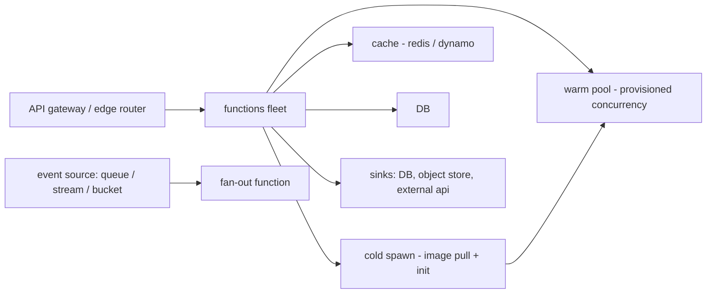

# Serverless at Scale

## 1. One-Line Definition
Serverless at scale is the engineering of a functions-as-a-service platform (and of applications on it) so that zero-to-massive traffic, per-invocation billing, and very high concurrency stay fast — chiefly by managing the cold-start latency of newly-created execution environments and by leaning on the platform's fan-out, autoscaling, and state limits.

## 2. Why Do We Need It?
Serverless wins on ops cost (no servers to run), efficiency (pay per invocation, autoscale to zero), and velocity (deploy one function = the whole unit). But the model's own physics — a function instance has no residual state between invocations; a *new* environment must be provisioned (image pull + runtime init + user init) before the first invocation — turns cold starts into the dominating latency/failure lever. "At scale" is when that lever matters: thousands of QPS, bursty traffic, per-function concurrency limits, and steep SLOs force you to understand and control warm pools, concurrency budgeting, and platform fuses.

## 3. Simple Intuition
Renting a cook for a dinner: you don't keep a chef standing all day (wasted), you call one only when someone orders. But a cook who must warm up the whole kitchen before their first dish (preheat = Oven cold start) is slow on the *first* order and fast on later ones, as warm as the kitchen is. Serverless = call-a-cook; the cold-start is the kitchen you keep warm *deliberately* (provisioned concurrency) and the hot path is everything still on the stove.

## 4. What Happens Without It?
The first request of the day, the first request after a deploy, or the first request of a burst all wait for an environment to materialize (from hundreds of ms to seconds), blowing p99. Some platforms soft-limit concurrent instances, so a spike queues invocations and the retries/queueing cascade (see retry-and-timeout). Without concurrency budgeting, one hot function starves others; without warm-pool management, peak traffic becomes a "cold-start tax" on every new container (see tail-latency).

## 5. Core Idea
- **Cold-start anatomy:** check-in (image/metadata), runtime init (small), and *user init* (imports/initializers, most expensive). The platform hides the first two behind warm pools; the last is yours to optimize (load a lib, open connections lazily, skill `handler` fast).
- **Warm concurrency is the lever:** "provisioned / reserved" concurrency Keeps a guaranteed warm floor (seconds-scale), pre-warms automatically; "on-demand" scales cold but with a warm-up latency cap. Your HLD chooses a floor if p99 matters.
- **Everything shared leaves the function:** no per-invocation socket cache persists (except a warm instance may reuse it). The platform boundary forces you to cache externally (Redis/DB/objects) if state matters — see caching / database-connection-pooling.
- **Fan-out and scale assumptions:** serverless front ends fan out to functions naturally (event-driven architecture) and the platform's queues (SQS-style/streams) are the scaling unit (partition-based; see kafka-producers-consumers). Throughput = functions × concurrency limit, and partition count is the limiter — that's the "fan-out the queue" lever.
- **Operational scale = control plane:** the platform itself must autoscale its control plane (scheduler, image registry, metadata, log/metrics pipe) faster than the data plane scales; that "one fleet" is the actual scaling problem (see observability).

## 6. Important Terminology

| Term | Simple Meaning |
|------|----------------|
| Cold start | Provisioning + init of a fresh environment for a first (after-a-wait) invocation |
| Warm pool / warm concurrency | Pre-created environments waiting to receive the invocation (few ms) |
| Provisioned / reserved concurrency | Guaranteed concurrency floor, pre-warmed, billed regardless of use |
| User init | Your function's module-level (slowest) initialization |
| Concurrency limit / per-function concurrency | Max simultaneous instances of a single function; saturated → throttles |
| Queue fan-out | Scaling by feeding a partition-per-record outside queue |
| Event source | The trigger producing invocations (HTTP, queue, schedule, blob) |
| Idle eviction | Instance systematically recycled after idle time (that's the cold-start tax later) |
| Pay-per-invocation | Per-request billing + GB-seconds — the economic lever you design around |

## 7. Basic Architecture



The picture shows the two lanes: fast lane = warm pool, worker lane = cold spawn being launched by the platform as traffic rises, and the shared-cache/sinks that keep state and DB connections off the cold path.

## 8. Request or Data Flow
1. HTTP request arrives at the edge router; the platform picks a warm environment from the pool (fast), or if the pool is empty starts a cold one (image pull, runtime init, user init).
2. The function's handler executes; every per-invocation resource (DB connections, caches) is opened here, lazily, and ideally shared with whatever a warm instance has cached.
3. If per-function concurrency is exhausted, remaining requests throttle/queue (platform-managed; the function's own SLO starts to degrade).
4. Event-driven paths: an event source (queue partition) invokes a consumer function; a scale-limited consumer consumes partitions, so scaling = adding-and-load-balancing consumers (see kafka-rebalancing).
5. Billing/telemetry: each invocation is a billed unit; metrics/logs are shipped per invocation (the platform's observability pipeline, see observability).

## 9. Practical Example
A claim-processing API on a serverless platform: baseline traffic 50 QPS, Black Friday 10x. Concurrency floor 20 for the hot "parse-claim" function (pre-warm), then autoscale to 100. User self-inits: `handler` holds only the claim grammar; DB connection manager lazily-connected, pooled across warm. Result: p50 ~ 30ms (warm), p99 cold-start tax ~ 300ms only on the first burst, bounded by the pool; throttles on the queue (partitioned) rather than dropping HTTP. The SLO page owns "warm floor vs cold burst" — a deliberate, budgeted design.

## 10. Scaling
- **Throughput ceilings:** functions × concurrency limit per function, plus the event source partition count (see kafka-producers-consumers). When throve on the queue, add partitions/split fan-out, not just instances.
- **Warm pool scaling:** provisioned concurrency is the only hard guarantee; on-demand is good for burst but pays cold starts. HLD: floor = ~steady-state QPS; headroom = on-demand.
- **Cold/fleet control-plane scale:** the platform's scheduler/metadata/logging pipelines are the real scale story at "serverless at scale" — they're what a "serverless service at scale" must look after as its control plane (the thing that lets the data plane scale at all).
- **CPU/GB-seconds economics** set *where* work executes (heavy processing out of functions) and *when* (batch windows vs on-demand) — the platform's pricing is a design input.

## 11. Reliability and Failure Scenarios

| Failure | What Happens | Detection | Recovery | Trade-off |
|---------|--------------|-----------|----------|-----------|
| Cold-start spike from burst | First-burst p99 blows out | Latency + pool-depth metrics | Raise warm floor, pre-warm per region | Idle-billing cost |
| Concurrency limit hit (queue/HTTP) | Invocation throttles, queue backs up | Throttle-metric + lag | Split into more partitions/fan-out, or scale-up-floor | Splitting cost |
| Instance evicted at idle | The still-warm instance vanishes; next invokes cold | Idle-recycle event | Provisioned floor / keep-alive traffic | Disk/CPU idle cost |
| Function crash / OOM | Invocations fail fast | Errors + health of function | Let the platform restart; treat as any bug | Function must be stateless to replace |
| Region instance pool drains (big incident) | All hit cold path simultaneously | Per-region pool metrics | Failover region + floor pre-warm | Cross-region routing cost |

## 12. Consistency and Correctness
- Functions are the idempotency *unit* (at-least-once + idempotent consumer = effectively-exactly-once — see delivery-semantics). The platform may retry invocations; your handler must be idempotent (dedupe by event id).
- **No shared mutable state between invocations:** the only consistent storage is external (DB/cache/object store), and warm-instance caching breaks the "always fresh" assumption — version anything you cache (see outbox-pattern / caching).
- Timers/retries and event sources deliver at-least-once, so ordering per key (if you rely on it) must be on the event source's partition, defensively, not the platform's default.
- Cold-open (re)initialization may race with warm same-instance caches — avoid load-time reads of mutable config.

## 13. Performance
- **Cold-start budget chart** (p99 style): image pull (hundreds of ms to 10s depending on size) + runtime/user init (your code). Budget your function's *own* init under 50-100ms if p99 matters.
- Warm latency: function + routing + platform overhead, roughly local, but no TCP-connect-free state reuse unless you pool across calls (connections reused are the normal win).
- Fan-out efficiency: parallel invocations to the same warm pool are cheap; the queue fan-out era of 10k of functions may hit per-function/account-level concurrency limits — check the platform caps as part of sizing.

## 14. Security
- Serverless surfaces your whole system to the network: every endpoint is a public attack vector — WAF/rate-limit at the edge (see rate-limiter and web-vulnerabilities), threat-model the function's inputs.
- Environment variables carry secrets in several platforms — encrypt-in-use and rotate (encryption-and-keys); never hard-code, fetch via a secret manager.
- A function is a shared sandbox: enforce dependency pinning and least-privilege IAM roles per function (authentication-vs-authorization); one compromised function must not reach arbitrary resources.

## 15. Trade-Offs

| Choice | Advantage | Disadvantage | When to Use |
|--------|-----------|--------------|-------------|
| Provisioned floor | Cold-start p99 controlled | Idle billing | Steady/Near-constant traffic with p99 SLAs |
| On-demand only | Zero idle cost | Burst cold starts | Sparse/scheduled workloads |
| Functions for compute | Free scaling, ops simplicity | State/session limits, cold tax | Stateless hot paths, event-driven |
| Long-running task on serverless | Elongates billed application | Timeouts, concurrency blow | Only when truly stateless slices |
| Queues/streams between services | Decoupling, natural fan-out | Order/latency gotchas | Event-driven pipelines (see event-driven-architecture) |

## 16. Common Mistakes
- Loading heavy libraries at module scope (init-time cost) on a hot function.
- Keeping no warm floor and watching p99 on burst.
- Using the platform's conventional limits (e.g., per-account concurrency) as an afterthought instead of sizing to them.
- Connecting a DB per invocation and finding connection exhaustion (see database-connection-pooling).
- Expecting "serverless is MySQL-safe" — mutable shared state still needs a real DB, and connection pooling is on you.

## 17. HLD vs LLD Boundary
HLD: warm floor, concurrency budget, event-source fan-out structure, initiative/lifecycle plan (deploys, cold-spawn), observability (per-invocation latency + pool depth), billing model. LLD: the handler's lazy-init code, the lambda-layer size trim, a specific redis client reuse pattern, one pool config.

## 18. Interview Questions

### Beginner
- What is a cold start and why does it exist?
- Why can't a serverless function hold state between invocations like a VM?

### Intermediate
- A bursty function shows p99 of 3.4s on Black Friday's first minute. Diagnose and give two fixes.
- What is provisioned concurrency and when is it worth the money?

### Advanced
- Design a 10x-burst, p99<500ms data-pipeline on serverless — walk warm pool, queue fan-out, concurrency sizing, and observability.
- "Serverless is just containers with extra steps". Where is that true and where does serverless change the scaling/architecture math?

## 19. Interview Memory Summary

> [!abstract]- Interview Memory Summary

### Remember

- Cold start = image pull + runtime init + user init; the first two hide behind warm pools, the last is yours.
- Warm floor (provisioned concurrency) = cold-start p99 control; on-demand = burst with a tax.
- Functions hold no state: external caches/DBs are the only consistent store.
- Scale unit = function × concurrency limit, bottlenecked by the event source partition count.
- Idempotency is mandatory: platform retries make at-least-once → effectively-exactly-once.
- The platform's control plane (scheduler, logging, metadata) is its own scaling story.
- Economics are a design input: pay-per-invocation + GB-seconds steer where heavy work runs.

### 30-Second Explanation

Serverless frees you from servers but moves the SLO into cold starts and concurrency. Budget the init time, hold a warm floor for steady-state traffic, let bursts grow on-demand, fan out through partitioned event sources, keep shared state and DB connections outside the function (external cache/DB, pooled), and make every handler idempotent. Watch pool depth and per-invocation latency as the platform's true control-plane scale story.

### Interview Traps

- Forgetting the warm-vs-idle billing tension when you claim "serverless is cheap".
- Conflating "the platform autoscales" with "unlimited concurrency" — concurrency/partition caps still rule.
- Claiming statelessness and then caching mutable state in the instance.
- Ignoring that at-least-once delivery means your function retries sometimes.

### Key Trade-Off

You trade operational simplicity and pay-per-invocation economics for cold starts and statelessness constraints — and an upfront warm-floor spend if p99 tolerances are strict.

## 20. Related Concepts

### Prerequisites

- [[horizontal-vs-vertical-scaling|Horizontal vs Vertical Scaling]]
- [[scalability|Scalability]]
- [[stateless-vs-stateful-services|Stateless vs Stateful Services]]

### Commonly Used Together

- [[capacity-estimation|Capacity Estimation]]
- [[load-balancing|Load Balancing]]
- [[reverse-proxy|Reverse Proxy]]
- [[event-driven-architecture|Event-Driven Architecture]]

### Alternatives

- [[database-connection-pooling|Database Connection Pooling]] (when you actually need real DB connections)
- [[cdn|CDN]] (when it's a static/fast-path serving problem)

### Advanced Concepts

- [[tail-latency|Predictable Tail Latency]]
- [[time-series-at-scale|Time Series at Scale]] (a natural serverless sink)

Related planned topics (not authored yet): serverless/FaaS full file, auto-scaling (HPA), containers and VMs, service mesh.

## 21. References
AWS Lambda documentation (cold starts, provisioned concurrency, limits) — verify current numbers on the console/docs. "Serverless Architectures on AWS" (Sbarski) or the AWS Well-Architected Serverless Lens. See also measured cold-start benchmarks (e.g., "Lambda cold start benchmarks" medium/blog material) — verify recency before citing.

## 22. Active Recall

Test yourself before revealing each answer.

> [!question]- Break a cold start into its three parts and which you control.
> (1) Image/environment provisioning (platform-managed, mostly warmed in pools); (2) runtime & language init (platform-managed); (3) your function's user init — module imports, static state, connection setup — fully yours and usually the dominant, controllable term. Keep the handler's init under ~50-100ms where p99 matters.
>
> - The platform say "warm pool" hides parts 1-2; part 3 is your code reviewing a diff in the blame.

> [!question]- Why does a function's "concurrency limit" put a hard ceiling on throughput, and what actually raises it?
> Because at any moment only `limit` instances of a function can run; requests beyond it are throttled/queued. Raising it = raising the limit (account/function concurrency) and, for queue-driven loads, increasing the event source's *partition count* — queue fan-out is broken (see kafka-producers-consumers) if partitions are the bottleneck, not the function code.
>
> - Throughput = function-concurrency × partition-feeding-rate, dominated by the lower.

> [!question]- You need a steady 500 QPS with p99 < 300ms on an API function. Why keep a warm floor and how do you pick it?
> A pure on-demand pool would invoice the *first* instances of each function cold (hundreds of ms) even at steady state when instances idle-recycle. Provisioned concurrency holds a floor (here maybe ~20 instances) so every burst request lands on already-warm JS-env, and p99 covers only the function's actual code. Pick the floor ≈ sustained rate / per-instance throughput; bursts ride on-demand.
>
> - Warm floor is the p99 budget you buy; on-demand is the burst at the price of a cold-start tax.

> [!question]- Why must serverless handlers be written idempotent, and what does "idempotent" earn you here?
> The platform may retry a failed invocation, so a handler without dedupe double-executes effects (double charting, double email — see delivery-semantics). Idempotency (dedupe by event id in the external sink) turns retries into no-ops and changes your delivery story from at-least-once to *effective* exactly-once. That's the standard "serverless + stream" pattern.
>
> - Idempotent handler + idempotent sink = the retry is invisible to the user and to the data.

> [!question]- "Serverless is stateless"; what actually carries state between invocations?
> The *external* world: the DB, object store, cache, stream offsets, and the function's own (ephemeral) warm-instance heap. A warm instance may reuse a cache a cold one never had, so treat in-memory state as a cache with TTLs, versioned, fallback-strength only (see caching + outbox-pattern). The "stateless" claim is about the *execution model*, not the system.
>
> - If your "state" must survive eviction, it lives in an external store, not the function.

> [!question]- Interview scenario: an event pipeline ingests 100k events/s via queue; p99 blows at even modest scale. What three levers do you pull?
> (1) Increase event-source partition count so fan-out isn't the limiter; (2) raise function concurrency within limits and set a warm floor so spikes aren't cold; (3) batch your function's consumer loop (drain records per invocation) to amortize init + improve GB-seconds efficiency. Verify per-partition throughput where the pipeline's bottleneck actually lives.
>
> - The failure across all three is hidden in the same place: counting partitions, not p99 of one invocation.

## 23. When Should I Use This?

### Use it when

- Your workload is bursty / image-and-event driven, and you value no-ops ops and per-invocation billing.
- You can hold everything important in external stores (DB/cache/object) — i.e., you are effectively stateless.
- You need near-infinite scale on uncommon events without capacity planning your own fleet.

### Avoid it when

- You need long-running, stateful, always-warm services (sockets/warm sessions) as the norm.
- Strict p99 latency on *every* invocation including the burst, with no warm floor budget.
- The economics don't work: heavy, sustained, predictable compute → containers are cheaper per unit.

### What problem does it solve?

It makes scaling and ops nearly free — divide-by-zero-missing infrastructure — for bursty, stateless, event-driven work, with the platform absorbing autoscale and most failure of the compute layer.

### What problem does it NOT solve?

It doesn't remove cold starts (budget them), doesn't give you shared state (external stores), doesn't fix connection-pooling discipline, doesn't beat containers on sustained heavy compute, and can't make a non-idempotent handler exactly-once by itself.

## 24. Decision Connections

Decisions that go together with serverless at scale:

- [[capacity-estimation|Capacity Estimation]] — size the warm floor and burst concurrency before you sign a budget.
- [[event-driven-architecture|Event-Driven Architecture]] — the natural strain of serverless: queues/streams feed functions.
- [[kafka-producers-consumers|Kafka Producers and Consumers]] — partition-limited fan-out is the real scale ceiling.
- [[stateless-vs-stateful-services|Stateless vs Stateful Services]] — state must leave the function on purpose.
- [[database-connection-pooling|Database Connection Pooling]] — pool/reuse connections, lazily initialed in the handler.
- [[caching|Caching]] — shared caches that survive anything (warm/cold) actually persist.
- [[tail-latency|Predictable Tail Latency]] — cold-start budget is a tail-latency problem.
- [[observability|Observability]] — per-invocation latency and pool depth are your true control-plane metrics.

Decision tree:

```
Function workload at scale
    |
    +-- p99 important + bursty?
    |      → warm floor (provisioned concurrency) + on-demand headroom
    |      → lazy handler init, small image, external state + [[caching|caching]]
    |
    +-- Event-driven stream/queue?
    |      → check partition count ≠ per-function concurrency limit
    |      → idempotent consumer ([[delivery-semantics|delivery-semantics]])
    |
    +-- Sustained heavy compute?
    |      → reconsider: [[horizontal-vs-vertical-scaling|horizontal scaling]] of containers may be cheaper
    |
    +-- Sparse / on-demand fine?
           → on-demand only, zero idle; accept cold tax on burst
```