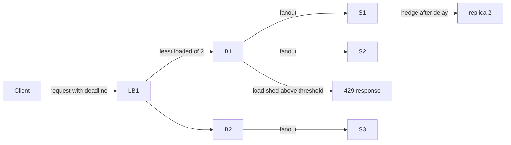

# Predictable Tail Latency

## 1. One-Line Definition
Tail latency is the latency of the slowest requests in a distribution (p99, p999) rather than the average, and "predictable tail latency" is the practice of bounding that tail so fan-out-heavy systems meet strict percentiles under load and failure.

## 2. Why Do We Need It?
Most large services are built from fan-out: one user request fans out to dozens or hundreds of backend calls. Averages lie here. If 99% of a single lookup completes in 10ms, a fan-out of 100 lookups has only a 37% chance that *all* complete in 10ms, because the slowest lookup (and slowest of 100) dominates. Mean latency hides this; p99/p999 and tail-sensitive SLAs (p99 under 100ms) expose it. Predictable tail latency is what lets you promise real percentiles on real queries, not lucky ones.

## 3. Simple Intuition
A stadium has 100 entrances. Average door wait is fine, but the p99 of "time to enter through a random door" is dominated by the *slowest* door you happened to pick. Now require all 100 people in a group to enter through 100 different doors — the group crosses the gates when the last (slowest) person arrives, so group time ≈ worst door, not average door. In systems, the "group" is the 100 sub-requests of one API call, and the slowest instance wins.

## 4. What Happens Without It?
p99 SLAs get violated even though the median looks healthy; you can't reproduce "occasional" slowness because it's a distribution problem, not a single bug. Timeouts and retries become guesswork (too tight → false failures, too loose → long timeouts stack), error budgets burn from rare stragglers, and clients start hedging on their own, adding load and making tails worse in an amplifying loop.

## 5. Core Idea
- **Latency is a distribution, not a number.** You manage p50, p99, p999 and specifically the interaction between spending and fan-out — each extra layer of fan-out multiplies the chance of catching a slow tail member.
- **Fan-out amplifies tails.** For N parallel sub-requests each with a p99 t, the *joint* p99 is worse than t; extra sub-requests each add an independent chance to be slow. All sub-requests must finish, so the maximum rules.
- **Techniques cluster into three families:**
  1. **Reduce raw tail** — fewer GC pauses, no long locking, CPU to rare pipelines, small wait queues (keeping queueing below the knee of the queueing curve), avoiding shared pools where one hot consumer steals capacity.
  2. **Hide the tail with redundancy** — hedged/backup requests (send a second request to another replica after a short delay), "focus": synchronous replica fan-out taking fastest result, replicated in-memory cache filled by several workers.
  3. **Bound the tail by refusing work** — admission control / load shedding *above* the capacity knee keeps p99 flat at the price of availability when over capacity. Once queues fill, latency rockets super-linearly; shedding to a spare is the only way to keep the tail constant.
- **Pre-optimize via heap-based "power of two choices"** — random unif. load balancing to loads generically causes skewed distributions; instead route to the least loaded of two randomly chosen backends, dramatically tightening the latency distribution.
- **Deadlines and time budgets:** pass a per-request deadline into sub-calls (gRPC) and use the *real* time remaining, not a per-call default; a sub-call budgeted at its nominal p99 instead of actual remaining time produces the classic "hurry up and wait" tail blow up.

## 6. Important Terminology

| Term | Simple Meaning |
|------|----------------|
| Tail latency | Latency of the slowest percentile (p99/p999), the bottleneck of fan-out |
| Mean vs p99 | Average hides stragglers; p99 shows the experience of the 99th-percentile request |
| Fan-out factor | How many sub-requests one request makes; raises the joint-tail probability |
| Hedged / backup request | Sending a second request to a different replica after a delay, taking first to return |
| Deadline propagation | Passing the remaining time budget on to every sub-call |
| Load shedding / admission control | Rejecting work at the edge when the queue is full to protect latency → availability |
| Queueing knee | The load point where processing-delay+queueing-delay explodes super-linearly |
| Power of two choices | Pick least-loaded of 2 random backends → far tighter distribution |
| jitter | Randomizing retries/deadlines to de-synchronize straggler storms |

## 7. Basic Architecture



## 8. Request or Data Flow
1. Client sends a request with its time budget (e.g., total 500ms deadline).
2. Load balancer uses power-of-two-choices: probe two random backends, send to the least loaded, avoiding skewed distribution.
3. Backend fans out to N microservices; each sub-call receives the *remaining* deadline, not a fixed budget.
4. On the slowest sub-service, a hedged backup is fired after ~95% of the sub-budget; only the first response is used (the second may be canceled for efficiency).
5. If overall deadline is near-expected, admission control returns a fast failure instead of queuing — traded for availability, protecting the latency distribution of everyone else.

## 9. Practical Example
Imagine a search page that fans out to 12 ranking/reranking services. Each service separately has p99 = 50ms. Joint probability that all 12 complete within 50ms = (0.99)^12 ≈ 0.89 — 11% of pages are already slow in the tail despite healthy averages. Add a 4th idle-service pool and a hedged request to the two slowest sub-calls: raw p99 of the hedged sub-call drops to ~15ms (two tries at p99=50ms → joint p99 ≈ 15ms is an extreme but illustrative bend). Now the page's p99 ≈ 75ms instead of the naive sum of two stragglers (fast path) — good enough to promise p99 < 100ms.

## 10. Scaling
- **What breaks at scale:** queue growth, shared-pool contention (many threads waiting for the one over-borrowing tenant), GC/lock steps under CPU saturation, GC vs latency coupling, NIC/IRQ interference, split-brain cache-fill stampedes.
- **What you do:** cap queue lengths, shed admission at the knee, spread replicas for hedge fan-out, shard by tenant (see cell-based-architecture) to stop one hot tenant from stealing everyone's tail, schedule long-running tasks off the critical path.
- **Vertical:** fewer cores per machine (parallelizable → deterministic scheduling), tuned JVM (G1 GC than CMS), k8s CPU limits protect neighbors at the cost of tail.
- **Process-level:** machine randomization, extreme process isolation (Netflix), and core pinning/tuning.

## 11. Reliability and Failure Scenarios

| Failure | What Happens | Detection | Recovery | Trade-off |
|---------|--------------|-----------|----------|-----------|
| One slow backend among 100 | Overall p99 explodes even though 99 are fast | p99 per span, hedge slots | Hedged request to a replica | +cost per slow sub-call |
| Full queue knee | p99 shoots from ~10ms to seconds | Queue length, latency at p99 | Admission control (fail fast) | Some traffic is refused/rejected |
| GC pause of a replica | All requests routed there get stuck | p99 + contention signal | Route to a pool with fewer GC sessions, hedging | extra replicas |
| Deadlock in a sub-library | The fan-out waits on one user | Deadline exceed count | Deadline propagation shortens the stack | some retries become wasted work |
| Schedule drift between 2 replicas of a fan | Read-your-writes/correctness hazards | Version checks | Replicate read-of-fresh-value and cancel the straggler | extra load on 2nd replica |

## 12. Consistency and Correctness
- Hedging and cancellation can double-execute side effects: make mutations idempotent (see delivery-semantics) and hedge only *reads* or idempotent requests.
- If the two hedged replicas are at different replication lag, always return the *newest/freshest* result for consistency; a heuristic "fastest last write" allows read-your-writes artifacts.
- Deadline propagation must be real, not nominal: sub-call that gets 50ms from a caller who has 10ms left will overshoot; always compute from the remaining budget.
- Retry storms multiply tail (every retry adds a full attempt to the fan-out); backoff with jitter is mandatory, and retries only up to a bounded count (see retry-and-timeout).

## 13. Performance
- Tail management is usually **cheap** when done at the admission boundary (a single decision to shed) but **expensive** when done inside fan-out — hedges double selected sub-call cost.
- Hedge cost: 1 extra request only to the slow tail (rare), so mean cost ≈ p(tail) × cost of one attempt; this is the best latency-per-dollar trade in the book.
- Overhead: measuring p99 faithfully requires sampling at the tail (which decides how much to discard), not the mean; tracing every request at p99 scale is expensive (see distributed-tracing).
- Careful: p99 of a *mean-computed* system is misleading — budget for heavy-tailed sub-service error.

## 14. Security
- Admission control must treat clients as adversarial: shed based on per-tenant budgets too (not global), else one compromised/abusive tenant floods capacity and destroys everyone's tail (see rate-limiter, WAF/DDoS).
- Hedged requests duplicate traffic; a malicious client can now observe or amplify both replicas — validate identity at the edge and rate-limit hedge slots.
- Never let the hedging replica path bypass authentication; it's still a real request.

## 15. Trade-Offs

| Technique | Advantage | Disadvantage | When to Use |
|-----------|-----------|--------------|-------------|
| Redundant requests / hedging | Cuts tail dramatically, cheap for rare tails | Doubles rare sub-call cost, instrumentation needed | Read-mostly, latency-sensitive fan-outs |
| Admission control / shedding | Flat p99 under overload | Rejects traffic, availability hit | Above-capacity spikes, queues |
| Deadline propagation | Kills stacked timeouts, fails fast | Requires protocol support | Microservice mesh, gRPC |
| Power of two choices | Even distribution that shrinks variance | Extra probe cost | LB tiers |
| Reduce raw tail (GC, locks) | Cuts p99*s* at the source | Hard, needs profiling, tuning | Before or after the above cheaper wins |

## 16. Common Mistakes
- Optimizing the median and promising p99 SLAs: they're managed as different engineering problems.
- Ignoring the fan-out law: p99 of each hop and count of hops both matter.
- Hedging non-idempotent writes without dedup → duplicated effects.
- Fixed per-call timeouts in a chain → the economics of dead time grow along the chain, not per hop.
- Managing tail only at the 95th percentile: the real failure moves to p999.
- Saying "our times are low" without measuring samples of the top run.

## 17. HLD vs LLD Boundary
HLD: distribution choice (hedging vs shedding) per layer of the fan-out, % p99 budget per service, metrics (p99/p999, per-span), deadline propagation design, SLA (p99 target), release-process testing of tail. LLD: a specific hedging library, a particular wait/queue size in one worker, exact GC flags, the code that computes remaining deadline.

## 18. Interview Questions

### Beginner
- What is the difference between mean latency and tail latency?
- Why does one slow microservice blow up a whole page for everyone?

### Intermediate
- A fan-out of 100 still shows p99 of 2 seconds even though each hop looks healthy. What data do you check and what do you change?
- Describe a hedged/backup-request page and its failure modes.

### Advanced
- Design for a bank balance checkout requiring p99 < 100ms with 20 dependent services, one of which fails 1% of the time — walk the decisions.
- Compare load shedding vs hedging vs redundant replicas as the *only* tail control and defend your choice.

## 19. Interview Memory Summary

> [!abstract]- Interview Memory Summary

### Remember

- Tail = p99/p999, not the mean; fan-out turns slice into maximum.
- Fan-out law: N sub-requests each at p99 t ⇒ joint p99 worse than t: use (1−p) per attempt.
- Control tail three ways: reduce raw variance, hedge/replicate rare slow work, shed admission at the knee.
- Deadline propagate the true remaining time; never fixed per-hop budgets.
- Power of two choices on LB keeps the distribution tight.
- Shed to a spare when overloaded — p99 flat at the price of availability.
- Hedging only idempotent/read work; jitter all retries.

### 30-Second Explanation

A request fans out; the slowest sub-request rules the total. Manage the *distribution*: keep queues below the knee, hedge rare stragglers to a second replica, propagate real deadlines, route with power of two choices, and shed admission when over capacity. Measure p99/p999 per span and re-slice each time you add a fan-out factor, which silently erodes the tail.

### Interview Traps

- Optimizing mean when the SLA is a percentile.
- Hedging non-idempotent writes.
- "Every retry" without jitter → thundering herd of retries feeds the tail.
- Not noticing fan-out factor as the p99 multiplier.

### Key Trade-Off

You buy a bounded p99 with extra capacity (hedges, spare replicas) and refused traffic (shedding); both are trading monetary/ask capacity or availability for a tight tail distribution.

## 20. Related Concepts

### Prerequisites

- [[latency-vs-throughput|Latency and Throughput]]
- [[system-design-fundamentals|System Design Fundamentals]]

### Commonly Used Together

- [[distributed-tracing|Distributed Tracing]]
- [[observability|Observability]]
- [[golden-signals|Golden Signals]]
- [[retry-and-timeout|Retry and Timeout]]

### Alternatives

- [[sli-slo-sla|SLI, SLO, SLA]]
- [[rate-limiter|Rate Limiter]]
- [[circuit-breaker|Circuit Breaker]]

### Advanced Concepts

- [[adversarial-reliability|Adversarial Reliability]]
- [[load-balancing|Load Balancing]]

Related planned topics (not authored yet): hedged requests, backpressure/load-shedding, tail latency metrics.

## 21. References
Dean, J., Barroso, L. A., *The Tail at Scale*, CACM 2013. `gRPC` deadline propagation docs; `latency distribution` engineering notes from SRE (Google SRE Book ch. 15 and 16). (These are canonical real sources; verify exact page numbers with the library before citing.)

## 22. Active Recall

Test yourself before revealing each answer.

> [!question]- Why does fan-out make tail latency dominate?
> The p99 of a coordinated fan-out has the *slowest* member as its bottleneck: the joint probability that all N members finish within one member's p99 shrinks as (0.99)^N, so one straggler breaks the whole request.
>
> - Each of the N members must finish, and their latencies are independent draws from the same distribution — the max, not the mean, decides.

> [!question]- What does a hedged request do and why is it safe only for reads?
> It sends a second attempt to a different replica after a delay (often based on the p99 of the first attempt), using whichever returns first. Because the second attempt is a re-execution, non-idempotent writes would run twice; reads (or idempotent mutations) are safe to duplicate.
>
> - Common implementation: hedge only on the slow tail, cancel the straggler, return the faster result of the two.

> [!question]- You must keep p99 under 100ms in a fan-out of 20. Why might the sum of each service's p99 be wrong, and what's the fix?
> Because (a) p99 of the sum is not the sum of the p99 (the max dominates), and (b) the *set* of slow requests tends to cluster (shared infra, GC, locks), so summing individual p99s overestimates. Fix: treat the fan-out as a distribution—measure the joint p99 with tracing, allocate budgets for the critical path, cancel/reduce parallelism for the remaining fan-out, and hedge the one or two slowest legs.
>
> - Looking at the p99 exposed by tracing at the request level is the ground truth.

> [!question]- A scale-out fleet shows median 5ms but p99 = 900ms. What are the likely causes and how do you diagnose?
> Possible causes: queue buildup on hot backends (load imbalance → skewed distribution), GC pauses, lock contention on a shared component, or fan-out over many sub-calls in the request path. Diagnose: look at trace latency per span to find which "hop" is the straggler, check queue depths and CPU/GC, inspect the distribution shape (if bimodal, probably shared infra like lock/GC/pool).
>
> - The classic fix order is: reduce the straggler source, hedge the read tail, shed the overloaded above-knee path.

> [!question]- When should admission control / load shedding beat hedging as your tail control?
> When the cause of the tail is *capacity* (queue knee overloaded), not rare random variance. Hedging adds load and helps only the rare tail; shedding stays p99-flat by rejecting requests before they queue — your p99 stays steady and your availability drops a little. For a spike above capacity, shedding is the correct lever.
>
> - Shed only when the request can be safely refunded (read / idempotent / aggregate), never unconditional.

> [!question]- Interview scenario: an SLO is "p99 of checkout < 200ms" but failures spike every time a new release deploys. Where do you look?
> Look at: cold-cache effects after rollout → cache stampedes on cold backends, per-request latency distributions at each step, queue/failure correlation with deploys, GC / JIT just-in-time after new bytecode, and retries/mismatched deadlines after config change. Then: pin the p99 budget per service, add hedge slots between the two slowest, pre-warm caches on deploy, gate deploys on the release-latency gate.
>
> - Deploys often shift the latency distribution (cold caches, JIT) — this is the tail-of-the-deploy problem.

## 23. When Should I Use This?

### Use it when

- You have fan-out and per-call p99 SLAs.
- You care about consistency of user experience under load (deadlines, queue stomach).
- You run a fleet of microservices (a chain multiplies the tail).
- You are capacity-exceeded and must trade p99 against availability.

### Avoid it when

- Mean latency is the actual SLA and scale is small (one service).
- You're overcapacity with no spare — tail vs total-fleet trade fails.
- The team cannot afford per-span tracing (no sign of the distribution, so no signal to improve).
- You can't do hedging (non-idempotent writes) and shedding is unacceptable (must succeed for every request).

### What problem does it solve?

Strict percentile SLAs for fan-out-heavy workloads you couldn't otherwise promise — it turns a system that "averages fine" into one whose worst requests are also OK.

### What problem does it NOT solve?

It doesn't fix a bottleneck that's computing before you ever reach the knee; it doesn't make non-idempotent writes hedge-safe; it doesn't fix real-world capacity constraints (then you need allocation, not latency engineering); and it can't guarantee p99 under *arbitrary* adversarial load without admission control.

## 24. Decision Connections

Decisions that go together with controllable tail latency:

- [[latency-vs-throughput|Latency and Throughput]] — mean vs distribution: the foundation for reasoning about percentiles.
- [[distributed-tracing|Distributed Tracing]] — you can't manage what you don't measure per span; p99 is only as good as the tracing data.
- [[observability|Observability]] — measuring the distribution and its shape (bimodality, GC markers) is the enabler.
- [[retry-and-timeout|Retry and Timeout]] — timeouts without jitter become the source of the retry-storm tail.
- [[load-balancing|Load Balancing]] — power-of-two-choices is the LB realization of tail control.
- [[rate-limiter|Rate Limiter]] + [[circuit-breaker|Circuit Breaker]] — budget-based admission and fails-fast cuts of rare straggler chains.
- [[adversarial-reliability|Adversarial Reliability]] — the natural next step: attack your own tail expectations with fault injection till p99 holds.
- [[sli-slo-sla|SLI, SLO, SLA]] — the business structure your p99 lives in; error budget from the tail.

Decision tree:

```
You must promise p99 latency for a request
    |
    +-- Fan-out is > 5 parallel legs?
    |      → you are max-dominated: budget per span, measure joint p99
    |      → hedge the 1-2 slowest (reads only, idempotent mutations OK)
    |      → cancel stragglers via deadline propagation
    |
    +-- Overload is the cause (queues high)?
    |      → admission control / load shedding at the knee
    |      → power-of-two-choices LB to reduce imbalance
    |      → reduce raw tail (GC, locks, batch-of-1) on the stragglers
    |
    +-- Tail persists despite fixes?
           → add spare replicas for hedge fan-out
           → tighten deadlines + jitter all retries
           → revisit the SLO: is p99 the right target?
```