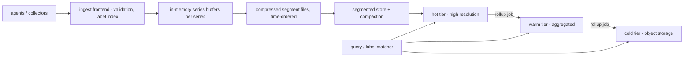

# Time Series at Scale

## 1. One-Line Definition
Time series at scale is the design of storage and query systems for high-volumes-of-orderly, time-ordered data points — metrics, events, traces, sensor/IoT reads — optimized for append-mostly writes, efficient compression, time-windowed queries, downsampling, and retention, which a general-purpose transactional database is structurally bad at.

## 2. Why Do We Need It?
Monitoring, observability, IoT, finance, and recommendation systems generate *its own separate workload*: trillions of tiny, immutable, timestamped measurements per day. A general RDBMS stores each point as a row with indexes and overhead; its write path and B-tree tax it; its transactions and joins are irrelevant cost. Time series at scale is the specialization that makes such volume feasible: over the years, systems have evolved to *write* at millions of points/sec on one node, compress to a few bytes per sample, that downsampling and retention to bound storage, and query time-windows with inversion/label indexes in milliseconds.

## 3. Simple Intuition
A bank vault keeps every transaction neatly indexed — for a hundred thousand customers. Now imagine a weather station emitting one reading a second for every parking lot in a city: the vault's per-row overhead and locking would choke, and nobody reads back row-by-row anyway. The specialized design is like a tide chart: measure once, append in order, compress to handwriting, roll up to hourly/daily summaries as details age, and discard the oldest charts on a schedule.

## 4. What Happens Without It?
A general key-value/row store at this volume hits three walls: write storage amplification (each point becomes a row + WAL + index pages), query time to scan windowed ranges without a time-ordered layout, and cost of retention — keeping 2 years of metric points at row-store cost is unaffordable even before the query layer complains. Teams then either drop resolution (sad for debugging), store in object storage and regret query latency, or cap retention knowing the data they cut were the pulse of a production incident.

## 5. Core Idea
- **Time series = (series key, timestamp, value).** A "series" is one measured entity+metric (e.g., `host=web-3, metric=cpu`). Append-mostly, immutable points; almost no updates/deletes; queries are time-windowed scans across series (last hour of `cpu` on `web-*`).
- **The write path is the design center:** the storage layout optimizes *large sequential appends* (rows per time-range, not rows per point), with LSM-style segmented structure for bulk flushes (see database-indexing for the B-tree/LSM contrast), and the tolerance to out-of-order/backfill being a first-class concern.
- **Compression is where "at scale" actually lives:** time-ordered values compress dramatically — delta-of-delta timestamps + gorilla-style XOR bits for doubles get ~1-3 bytes/sample vs ~16-20 in native storage. Compression per series, ordered by time, is the difference between feasible and bankrupt.
- **Cardinality is the enemy; resolution of the "series" explosion is a real design trade:** every unique label combination is a new series; a label that is free-form (e.g., embedding a DB name) multiplies the series count and wrecks the compression/inversion index. Cardinality limits, label-set validation, and downsampling-by-series are hard requirements.
- **Rollup/retention layering:** hot (seconds/minutes detail) → warm (1-min resolution) → cold (hourly/day aggregates, or object-store tier). Two levers — retention (time) and downsampling (resolution) — bound total storage cost at the price of future query resolution.
- **Query = label index + time scan:** an inverted index maps label combos → series IDs; the engine then scans the time window of each matching series' compressed blocks, not an index per point.

## 6. Important Terminology

| Term | Simple Meaning |
|------|----------------|
| Series | (metric, labels) → an ordered stream of timestamped values |
| Series key | The unique identifier of a series (labels + metric) |
| Cardinality | Total number of distinct series; the scale lever you control |
| Point / sample | One (timestamp, value) in a series |
| Downsampling / rollup | Coarser-resolution aggregates (1m→1h) over time |
| Retention window | How long each resolution tier keeps data |
| Inverted / label index | Labels → matching series IDs, like a search index |
| Out-of-order (backfill) | Late/arranged data arriving after its window |
| Gorilla / delta-of-delta | Compression schemes for time-ordered floats + timestamps |
| HOTS block | Grouping of adjacent timestamps into one compressed unit for scan |

## 7. Basic Architecture



## 8. Request or Data Flow
1. Collector appends point → ingest validates series + timestamps, dedupes if needed, maintains the label inversion index.
2. Points go to per-series in-memory buffers; when a series' buffer fills (or a flush interval passes), it's written as a compressed time-ordered segment (gorilla/delta blocks) — sequential append, no per-point index.
3. Background compaction merges small segments into larger ones (keeping time/label locality); LSM-shaped, so write amplification stays low.
4. Rollup jobs periodically read hot data → compute hourly/day aggregates → append to warm/cold tiers; retention policy deletes aggregates past their window.
5. Query: matcher resolves `metric=cpu,host=web-*, last 3h` via the label index → series IDs → scans only the matching compressed blocks across tiers.

## 9. Practical Example
An observability platform ingests 16-billion points/day from 50k hosts. Design: 3-tier; series = metric × labels; hot: 5s resolution, 7 days, gorilla-compressed → ~1.5 bytes/point → 16B × 1.5 B ≈ 24GB/day hot = ~170GB/s week (plus index), i.e., one oversized server's worth of disk per week of hot; warm: 1-min resolution for 90 days, ~1/12 of hot bytes; cold: object store. Query "cpu of web-* over the last hour" resolves ~4k series and scans a few hundred KB of compressed blocks in tens of ms. Capacity math verified: cardinality capped (watch labels), rollup schedule pinned, retention governed by disk-budget per tier, not by "keep everything".

## 10. Scaling
- **Ingest scales by sharding series keys** (each shard owns a subset of series and their segments) — mesh graphs; see sharding/consistent-hashing for the placement (and the hot-shard problem when one noisy series floods its shard).
- **Compression degrades as cardinality grows:** every extra series is a separate block with its own headers, so the per-series-per-time block size drives both write amplification and query time. High cardinality is the #1 reason a time-series system "hits a wall" — it is a cardinality problem wearing a storage costume.
- **Queries across many series** must fan out (scatter-gather) — matching 100k series per scan needs chunked blocks and time-parallelism; wide panel dashboards trend to their own cache (interval caching, aligned windows).
- **Rollup job scale:** one job per tier/aggregation-window, mostly idempotent (re-run reprocesses a window) — a natural replayability use case (see replayability).

## 11. Reliability and Failure Scenarios

| Failure | What Happens | Detection | Recovery | Trade-off |
|---------|--------------|-----------|----------|-----------|
| Ingest node dies | Points buffered in memory lost | Replica + WAL for backfill | Replay from collectors' buffer (retry) | Some replay lag |
| Segment corruption | Compressed data unreadable | Checksum on block read | Skip block, mark series gaps | Possible data loss in a block |
| Cardinality explosion (bad label) | Index + write path degrade | Cardinality metrics | Drop offending labels, backfill clean series | Queries lose that label dimension |
| Rollup job missed | Warm tier stale window | Rollup watermark/lag | Re-run the window idempotently | Temporary staleness |
| Disk water level in tier | Retention throttling | Use% per tier | Lower retention window or downsample more | Resolution/length trade |

## 12. Consistency and Correctness
- **Time series is append-mostly and window-aggregated**, so single-series writes are naturally sequential — "transactions" rarely matter; per-series atomic append is the unit.
- **Out-of-order (backfill) handling is a correctness requirement:** late points must land at the right timestamp (either segment-miss + rewrite or a per-series buffer window); many systems accept "data may be slightly stale in its window" rather than locking.
- **Aggregations/rollups must be deterministically re-producible** (+ idempotent re-run) — same values + same timespan → same summary; this is replayability applied to metrics (see replayability, delivery-semantics).
- Point-in-time reads ("as of 03:00 tonight") must be interpreted against resolution tiers: a warm-tier aggregate at 1-min is not the same as hot at 5s — document the semantic.

## 13. Performance
- **Write:** sequential segments + buffer flushes keep per-point cost ≈ a few ns·µs per; gorilla compression ~1-2 bytes/double; write amplification beats a row-store index by ~10-100x for the same raw volume.
- **Query:** hot-window scans = read the compressed blocks + the label index (ms); classic terms: "90% of queries touch < 10% of series."
- **Overhead:** index/layout metadata per block is the tax for uncompressed labels; keep label sets small per series, low entropy.

## 14. Security
- Time-series data is sensitive (who/site/system values are operational secrets and compliance PII) — encrypt at rest + in transit (encryption-and-keys), and apply tenant-level isolation (a shared platform: label/tenant boundary must be scoped at query, not just storage).
- Cardinality attacks are a security issue: a client can fill the label space with random values (metric: `user=<random>`) and DoS the writer — rate-limit/validate labels at ingest (see rate-limiter).
- Backfill/ingest endpoints must be authenticated (authentication-vs-authorization) — forged metrics are both false data and a storm vector.

## 15. Trade-Offs

| Choice | Advantage | Disadvantage | When to Use |
|--------|-----------|--------------|-------------|
| High-cardinality labels | Any slice/group query instant | Compression + index degrade | Only for real query axes |
| Aggressive rollups | Cheap long retention | Coarse later analytics | Default: 1m detail, 90 days, then hourly |
| Single-node TSDB vs sharded mesh | Simple ops | One series flood hurts all | Under ~10M points/s |
| Object-store cold tier | Cheapest long-term | Query latency for old data | Rare analytics / audit |
| Compressed blocks vs row-store | Massively cheaper/quicker | More complex write path | The reason TSDBs exist |

## 16. Common Mistakes
- Treating cardinality as free — the ["high series count" wall] is the #1 operational failure; validate label sets, cap series count, downsample dimension.
- Storing time series in a general row/RDBMS without time-bucket indexes/partitions — write amplification crushes it.
- No retention policy → disk fills at the most visible moment.
- Rollup jobs that can't be re-run idempotently (half-rolled windows forever).
- Ignoring out-of-order/backfill semantics and getting a query result that silently misses late points.

## 17. HLD vs LLD Boundary
HLD: series model + label set, cardinality budget, resolution tiers + retention windows, rollup schedule, ingestion topology (sharding the series keys), query fan-out + caching, capacity math. LLD: gorilla varient implementation, one flush loop, the exact label-matcher expression syntax, a particular block checksum.

## 18. Interview Questions

### Beginner
- What makes time-series a special shape of data, and why do general databases struggle with it?
- What is "series cardinality" and why is it a problem?

### Intermediate
- Design the pipeline for 50k hosts × 5s metrics: ingestion, storage, query, retention.
- Why does compression only work if series are contiguous by time? Use gorilla as the example.

### Advanced
- Design a multi-region time-series platform that must query across months with sub-second latency — walk the tiering, sharding, and rollup math with concrete numbers.
- A customer queries "cpu for all hosts of all users in my org" — explain the cardinality + fan-out disaster and the fix.

## 19. Interview Memory Summary

> [!abstract]- Interview Memory Summary

### Remember

- Time series = (series, timestamp, value); append-mostly, immutable, time-windowed queries.
- Write path is big sequential appends + LSM-ish segments, NOT point-indexed rows.
- Compression is where scale lives: delta-of-delta + gorilla ≈ 1-2 bytes/sample.
- Cardinality (distinct series) is the real scaling enemy; watch labels, cap series count.
- Retention = time window; downsampling = resolution; both bound storage cost.
- Hot/warm/cold tiers + idempotent, re-runnable rollups make long retention affordable.
- Query = label/inverted index → series IDs → scan compressed, time-ordered blocks.

### 30-Second Explanation

Treat the time-series store as an append-mostly log per series, not a table of rows: per-series in-memory buffers flushed as compressed, time-ordered segments, an inverted index over labels for lookup, and background compaction. Roll young detailed data up (downsample/hot→warm→cold) and enforce a retention policy per tier. Every design decision — cardinality budget, shard placement, query fan-out, rollup schedule — is driven by the math of compression and the cost of resolving series at query time.

### Interview Traps

- Hand-waving "we compress so it's fine" without quoting bytes/point and cardinality.
- Believing rows+index is fine "because it's just a database".
- Ignoring retention/downsampling — a storage budget that never closes.
- Forgetting out-of-order/backfill as a correctness requirement.

### Key Trade-Off

Reasonable compressed detail for a bounded window + aggregation/retention tiers for the long tail — the cost is losing fine-grained resolution of old data and accepting debug-lookback limits on exactly the "was it happening a month ago" questions.

## 20. Related Concepts

### Prerequisites

- [[database-indexing|Database Indexing]] (B-tree vs LSM, why TSDBs are LSM-ish)
- [[sharding-strategies|Sharding Strategies]] (slicing the series keyspace)
- [[sql-vs-nosql|SQL vs NoSQL]] (why TSDBs are a distinct category)

### Commonly Used Together

- [[capacity-estimation|Capacity Estimation]]
- [[sharding|Sharding]]
- [[consistent-hashing|Consistent Hashing]]
- [[caching|Caching]]

### Alternatives

- [[kafka-retention|Kafka Retention]] (when the "log" semantics matter more than query)
- [[cdn|CDN]] (when edge-cached results are fast enough)

### Advanced Concepts

- [[replayability|Deterministic Systems and Replayability]] (idempotent rollups, re-runs)
- [[cell-based-architecture|Cell-Based Architecture]] (tenant/region cells of the platform)

Related planned topics (not authored yet): LSM-tree internals, data model types (including time-series/wide tables), OLTP vs OLAP, storage tiering.

## 21. References
Gorilla: "Gorilla: A Fast, Scalable, In-Memory Time Series Database" (VLDB 2015) — delta-of-delta + XOR compression. Prometheus/VictoriaMetrics/InfluxDB/Timescale docs on cardinality, downsampling, retention. Kleppmann ch. 3 (LSM-tree storage engines). Verify current best-practice numbers in the docs of the system you use.

## 22. Active Recall

Test yourself before revealing each answer.

> [!question]- Why does a general row-store crush at time-series write volume, while a TSDB survives?
> A row-store writes a row per point: WAL + page split + index maintenance per row → write amplification of ~10-30x and random-ish updates. A TSDB buffers points per series and flushes a big, time-ordered, compressed block as one sequential append with a tiny index hop — so per-point cost is ~1-2 bytes of data + a small block header, not a full indexed row. The same raw volume is 10-100x cheaper in writes and storage.
>
> - Sequential-append + block compression is the whole differentiator, not a tweak.

> [!question]- What is cause-and-effect of high series cardinality in a TSDB?
> Each distinct label-combo = its own series + its own compressed block + an inverted-index entry. When cardinality explodes, the index bloats and *every* block is tiny (headers cost more than the data), write amplification + query fan-out blow up. A free-form label that grows unbounded (e.g., embedding a DB name) is the usual accident. Fix: keep label sets small, cap series count, validate at ingest.
>
> - "only label what you'll actually query" is the cardinality rule.

> [!question]- How does downsampling/rollup make years of retention affordable, and what does it cost?
> Generate coarser-resolution tiers as data ages: 5s detail for 7 days, 1-min average for 90 days, hourly for 5 years — each rollup discards ~90% of the points, so stored bytes shrink ~10x per tier. Cost: old data is only as precise as the coarse tier, so "fine-grained debugging from 3 months ago" is gone — a deliberate resolution-vs-cost promise.
>
> - Retention is a time window; downsampling is a resolution promise; the combo is the budget.

> [!question]- Why must rollup jobs be idempotent and re-runnable?
> Because a rollup is itself a recomputation over a time window: run it once or twice must produce the same aggregates. A failed half-rolled window needs to be re-runnable to a consistent result; determinism + idempotency (see replayability) also let you *re-run the past* a window at a time after a bug is fixed, doing backfill repair cleanly.
>
> - Rollups failing is normal; a half-rolled bucket that can't be repaired is the bug.

> [!question]- A dashboard query "cpu for all hosts all users of an org for 6 months" is guaranteed to be slow. Why?
> It's a time-of-series-multiplication problem: org-of-1M × host-of-50k × metric × window expands the resolved series set to huge fan-out; each series is a separate block to scan and aggregate. Even with the inverted index, the memory/scan is enormous. Fix: the query engine must coarse-grain at the tier (dot the warm tier, not the hot), pre-aggregate org-level series, cache aligned windows, and shard the scan.
>
> - Cardinality budgets prevent the "biggest pivot" queries from existing by design.

> [!question]- Interview scenario: design a per-region metrics platform surviving a full region failure. Your headline architecture?
> Per-region meshes (each region an independent ingest+hot tier, cells or shards by series), rollups pushing to a global cold tier (object store); on region loss, dashboards query the surviving regions' data + the cold tier for aggregates; cross-region reads are tolerated-stale except for the cold tier which is replicated. This is cell-based-architecture + simple multi-region failover applied to the series keyspace, with RPO=1 tier of buffered points.
>
> - The strong-consistency backbone isn't needed for metrics; tiering + replication of the cold tier is the win.

## 23. When Should I Use This?

### Use it when

- You produce or consume high-volume immutable timestamped measurements (metrics, events, IoT, sensors, traces).
- Queries are primarily per-series, per-label + time-window.
- Volume, resolution, and retention demand compression + tiering (TSDB or TSDB-backed setups).

### Avoid it when

- Your data is general-purpose relational with joins/transactions (a TSDB storage is not a general DB).
- You only have a few thousand points/day (a `timescale`-style extension within a SQLite/Postgres is reprise enough).
- You need fine-grained old data forever (then the budget is the boss; you need a warehouse-style design, not a tiered TSDB naive).

### What problem does it solve?

Makes enormous ordered-append workloads actually feasible — write volume, cheap compression, and retention/downsampling that a general DB structurally fails at.

### What problem does it NOT solve?

It doesn't replace a general DB (joins, transactions), doesn't fix unlimited resolution+retention on a budget, doesn't do cross-series OLAP pivots cheaply, and can't stand in for a message log when replay/reprocessing semantics matter (that's Kafka — see kafka-retention).

## 24. Decision Connections

Decisions that go together with time series at scale:

- [[database-indexing|Database Indexing]] — LSM vs B-tree is the storage-engine foundation; TSDBs are LSM-shaped.
- [[sharding|Sharding]] + [[consistent-hashing|Consistent Hashing]] — series-keyspace slicing for ingest/query shards.
- [[capacity-estimation|Capacity Estimation]] — the bytes/point × rate × retention/reduction math that sizes everything.
- [[sharding-strategies|Sharding Strategies]] — hot series → hot shard; placement decides whether warm data stays local.
- [[replayability|Deterministic Systems and Replayability]] — idempotent, re-runnable rollups; windowed backfill.
- [[kafka-retention|Kafka Retention]] — when the log/replay semantics matter more than the query; TSDB vs stream.
- [[caching|Caching]] — aligned-window query caching for dashboards.
- [[cell-based-architecture|Cell-Based Architecture]] — per-region/cell planes for tenants and region failure.

Decision tree:

```
High-volume timestamped immutable data needed for queries
    |
    +-- General relational joins/transactions also needed?
    |      → keep the DB; use a TS extension/partitioned table; not a dedicated TSDB
    |
    +-- Points/sec is meaningful (M/s), per-series time-window queries?
    |      → [[time-series-at-scale|dedicated time-series storage]]
    |         |
    |         +-- High cardinality risk?     → cap labels / validate / pre-aggregate series
    |         +-- Need months of history?    → tiers: hot / warm rollup / cold object store
    |         +-- Queries fan out wide?      → shard series keyspace + aligned-window cache
    |
    +-- Need to REPLAY the raw stream, not just query?
           → [[kafka-retention|Kafka Retention]] + a downstream TSDB for query
```