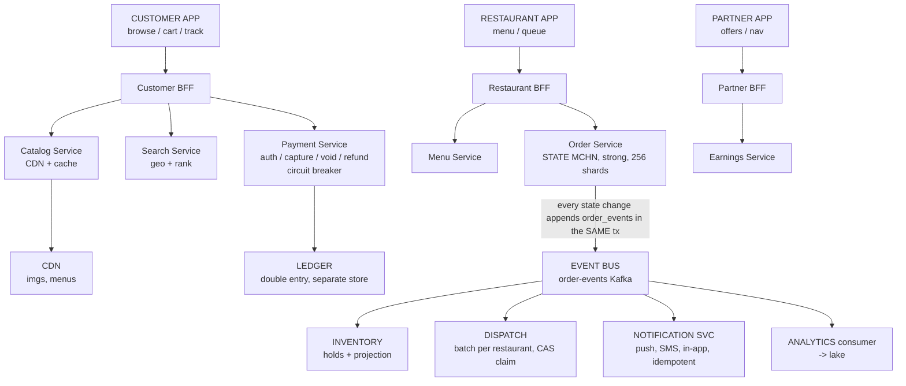
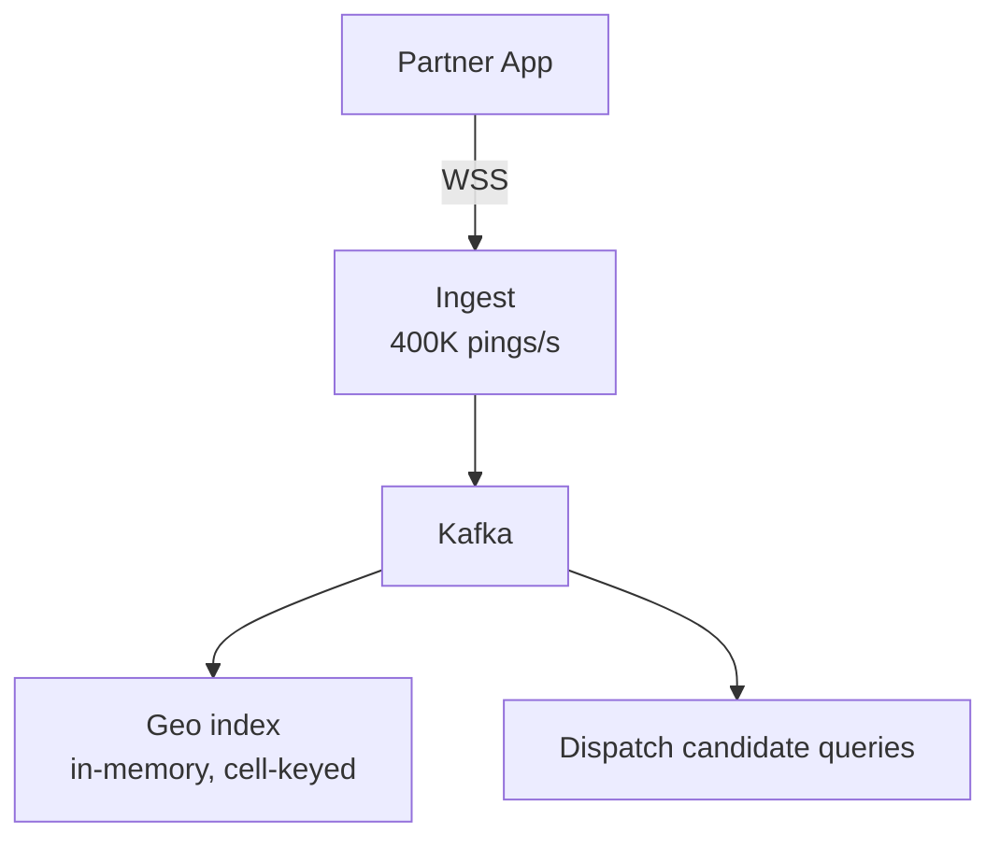
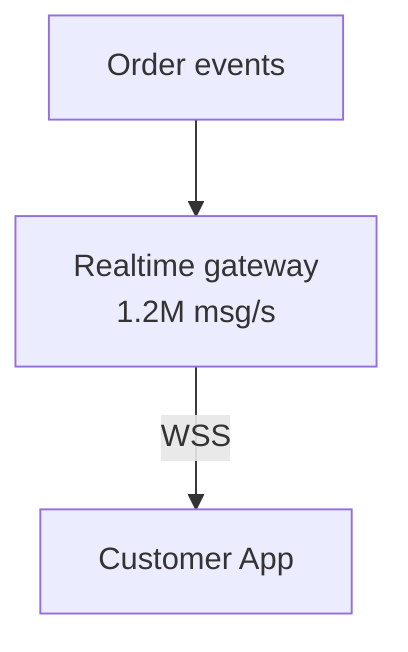
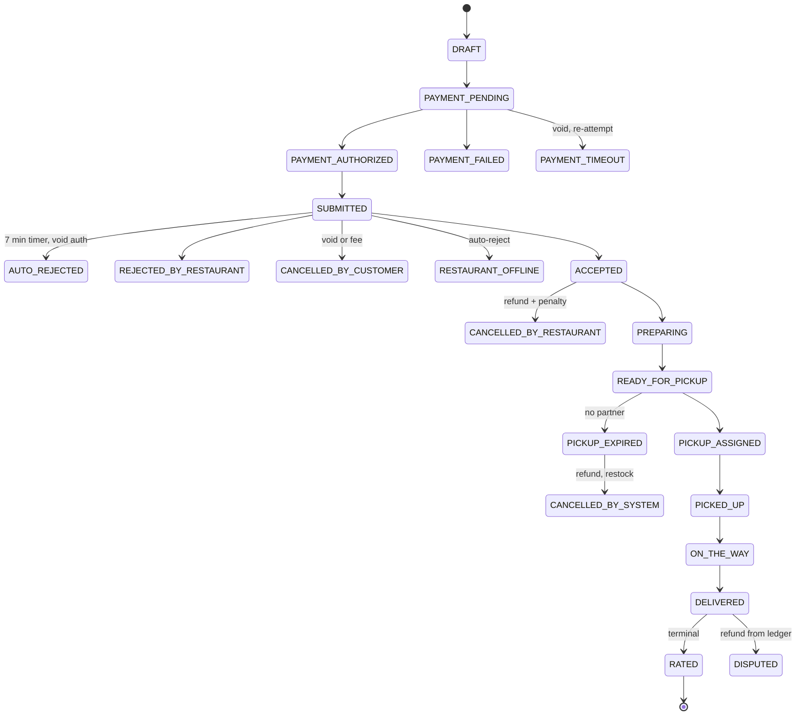
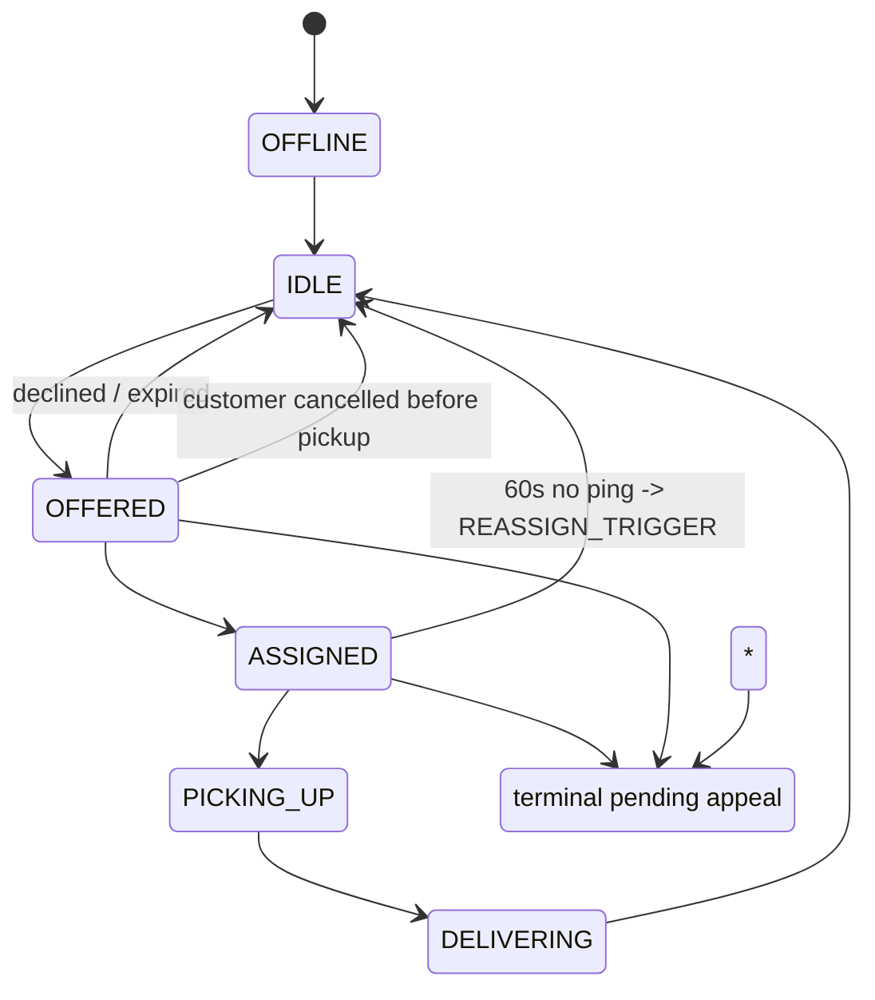

# Design a Food Delivery Platform — Interview Study Transcript

A full 45-minute interview, transcribed. Read it once for flow, then use the section headings to drill individual phases.

## Phase 1 — Requirements Clarification (minutes 0-8)

Interviewer: Thanks for joining. I want you to design a food delivery marketplace. Customers, restaurants, and delivery partners, three apps. Take a few minutes to make sure you understand the problem before you estimate anything. What do you want to ask?

Candidate: Let me start with the thing that determines the whole failure story, which is payments. When is the customer's card charged: at checkout, at restaurant acceptance, or at delivery? And is it authorized and captured, or captured outright?

Interviewer: Authorized at checkout, captured when the restaurant accepts the order. Never captured outright.

Candidate: Excellent, that is the single most important answer I am going to get, and I want to say why it is so valuable. Authorizing at checkout means we hold the funds but do not move them. Capturing at acceptance means the money only moves when a restaurant has actually committed to cooking. So the two failure cases, restaurant ignores the order and restaurant's app is down, both resolve to a void on the authorization rather than to a refund of a real charge. Voids are free and instant, refunds are slow and cost a fee, and that one decision removes an entire class of reconciliation bugs.

Candidate: And it gives me the auto-reject answer for free. If the restaurant does not respond in seven minutes, the order auto-rejects, we void the authorization, and the customer's money never moved. No human in the loop, which is what the requirement asked for.

Interviewer: Right. And funds in between?

Candidate: Do you hold funds between acceptance and delivery, and if so when are they released to the restaurant and to the partner?

Interviewer: Yes. Restaurant gets their share on weekly settlement. Partner gets theirs weekly. Tips are split and settle with the next run.

Candidate: Then the ledger is a double-entry account set with restaurant, partner, platform, card-processor clearing, and customer-wallet accounts, and the weekly payout is a batch over that ledger rather than a separate computation. That is the design that makes statements add up.

Interviewer: Next.

Candidate: The three apps. Do all three clients hit one backend, or separate backends per app?

Interviewer: Up to you. Justify it.

Candidate: Three separate backend-for-frontend layers, and I will justify it on two grounds that are not "microservices." First, read volume. The customer app does catalog browsing, which is the highest-read surface in the system by two orders of magnitude and needs a CDN-friendly cacheable read path. The restaurant app does almost no reading, it is a queue and a menu editor. Putting those behind one service means either the catalog cache is tuned for the wrong hit rate or the restaurant app's three-second order SLA is at the mercy of a cache flush.

Candidate: Second, and this is the more important reason, release cadence and blast radius. The customer app ships weekly, the restaurant app ships monthly because restaurants hate updates, the partner app ships weekly. Three BFFs means three deploy cadences and three failure domains, and the customer app's catalog deploy cannot take down the restaurant's order queue. Study separately: [[backend-for-frontend|Backend for Frontend]] and [[control-plane-vs-data-plane|Control Plane vs Data Plane]].

Interviewer: Good. Now dispatch. When a partner is offered a job, is the offer exclusive? Can a partner hold two pending offers at once and pick one?

Candidate: I will assume exclusive, one offer at a time, with an expiry. Same reasoning as ride-hailing: it makes the assignment a compare-and-set rather than a queue, and that is the correctness property I care about most.

Interviewer: Exclusive. Fifteen seconds to accept, then it moves on.

Candidate: Then the invariant is: one order has at most one assigned partner, and one partner has at most one assigned order, at any instant. And the second half is where the dispatch engine actually lives.

Interviewer: Now inventory. Real stock counts, or sold-out toggles?

Candidate: Per item, and I need to know whether the platform blocks checkout on zero stock or lets the restaurant oversell and compensate.

Interviewer: Real counts per item. If a restaurant is out, the item is unavailable at checkout. But restaurants do occasionally accept and then discover they are out, and the order gets cancelled and refunded in that case.

Candidate: Good, then oversell is a real operational case with a compensation path, which tells me inventory needs to be a first-class service with a reconciliation job, not a field on the menu item.

Interviewer: Menu pricing. If a restaurant changes a price while a customer is mid-checkout, which price wins?

Candidate: Whatever was captured when the item was added to the cart, held as a cart line, and then snapshotted onto the order line at checkout. The order line stores the name, the price, the modifiers, and the tax rate as they were at checkout, so a later menu change is a new row and never rewrites an order or a receipt.

Interviewer: Last question before you estimate. Delivery radius.

Candidate: Is it a fixed radius or a polygon, and does the platform compute fees from it?

Interviewer: Restaurants set a radius, 3 to 8 km. Fee is a function of distance from restaurant to customer, cart size, and current demand.

Candidate: Then I have a geofence membership test at checkout and a distance-based pricing function at checkout, and both must be re-validated at assignment time because a customer's address geocode can be wrong and a restaurant can shrink its radius between checkout and dispatch.

Interviewer: Give me your non-functional targets.

Candidate: Order placed to visible in the restaurant app: p99 under 3 seconds. That is a push notification budget, and it is a number not a hope, because a restaurant that sees an order late will reject it or cook it late.

Candidate: Status change visible to the customer: p99 under 2 seconds. That is our own realtime channel, so it should be easier than the 3-second number and if it is not, something is wrong.

Candidate: Menu page load: under 500 milliseconds p99, and it should be a CDN cache hit the vast majority of the time, because that surface is 90 percent of all our request volume and none of it is urgent.

Candidate: Order placed to partner assigned: under 5 minutes, and under 60 seconds when food is already ready, which is a different and much tighter objective and I will treat it separately.

Candidate: Availability: 99.95 percent on order creation, because that is revenue. 99.9 percent on menu browsing, and I will argue that is deliberately lower, because if the menu is down the customer cannot even start an order, but if the order path is down we have taken a real order we cannot accept. Catalog can degrade, transactional cannot.

Candidate: Consistency, stated as a matrix rather than a slogan. The order lifecycle is strongly consistent, single-writer, in the restaurant's home region. The payment ledger is strongly consistent and in a separate store, because money has a different availability requirement than orders. Inventory holds are strongly consistent per item on write, and eventually consistent by about a second on the availability read, because a one-second-stale sold-out count costs one oversell while a synchronously consistent count puts the menu page on the critical path of the order DB. The menu catalog is eventually consistent with a short TTL plus event invalidation. Partner location is eventually consistent within 2 seconds. ETA is recomputed and is allowed to be a minute stale. Notifications are at-least-once with idempotent sends. Analytics is minutes stale and nobody cares.

Interviewer: Estimate.

## Phase 2 — Scale Estimation (minutes 8-15)

Interviewer: Back-of-the-envelope. Start where you want.

Candidate: Money first again, because it bounds the risk. 20 million orders a day at a 28 dollar average order value is 560 million dollars a day of gross merchandise value. At a 20 percent take rate that is 112 million a day of platform revenue. That tells me two things: an order-creation outage is expensive, and a double-charge is a customer-trust event, not just a 28 dollar event.

Candidate: Order rate. 20 million a day is 231 per second on average, which is the number that is useless. Dinner rush on a weekday is roughly 12 percent of daily volume inside one hour, so 2.4 million orders in the peak hour, which is 667 per second. I will carry 700 per second. And a televised final or a flash sale is 5 times that in about two minutes, so 3,500 per second, and that is the number that sizes for burst, not for average.

Candidate: Now the traffic that actually dwarfs the orders.

Candidate: Catalog reads. 20 million daily active customers, and a customer app session browses restaurants and opens menus. Call it 20 menu opens per DAU per day, which is conservative, so 400 million menu views a day. That is 4,600 per second average and 18,000 per second at peak. Each menu view is roughly 30 items, so the item-level read volume is 500,000 items per second. That number is 700 times the order rate, and it is the surface that decides whether the business has a good infrastructure bill.

Candidate: Restaurant search. Five discovery queries per DAU session, 100 million a day, 1,150 per second average, maybe 5,000 at peak. Lower volume than menu opens but a much heavier query, because it is a geo-plus-filters sort by relevance.

Candidate: Partner location. 1.5 million partners online at peak, and they are in two states. On a delivery: 1.5 million in-flight at peak, reporting every 4 seconds, which is 375,000 pings per second. Idle and waiting: another 500,000, reporting every 20 seconds, which is 25,000 per second. Total about 400,000 pings per second. Same order of magnitude as ride-hailing, and the same shape.

Candidate: Customer tracking fan-out, and this is the one I would not forget. 20 million orders a day at a 32 minute average delivery is 640 million delivery-minutes a day, divided by 1,440 minutes is 444,000 concurrent deliveries on average, and about 3.5 times that at peak, so 1.5 million customers are watching a live order map at peak. At 0.5 hertz for status plus 1 hertz for the courier dot during the actual delivery leg, that is roughly 1.2 million messages per second outbound.

Candidate: So the shape of this system: 700 transactional order writes per second, 1.2 million outbound tracking messages per second, 400,000 location pings per second inbound, and 18,000 menu reads per second that are 95 percent cacheable. The order database is not the interesting part.

Candidate: And one more, which is the small number that carries the real risk: payment calls. Three processor calls per order, authorize, capture, and the settlement or refund in the tail, so 700 times 3 is about 2,100 per second at peak, 10,500 in a flash sale. That is a third-party dependency with a rate limit and an SLA we do not control, and it is the number I would most want a circuit breaker around.

Candidate: Let me put the four classes side by side, because the design follows directly from this table.

```
 Class                        Peak rate     Handler                    Latency budget
 --------------------------  ------------  -------------------------  --------------------
 Menu / catalog reads         18K/s (500K   CDN + catalog cache        500ms, cache hit
                             items/s)       + BFF                     95% of the time
 Restaurant search            5K/s          search svc + geo index     300ms
 Order create / transitions   700/s         order svc -> Postgres     250ms, strong
 Payment processor calls      2.1K/s        payment svc, circuit brkr 2s, third party
 Partner location pings       400K/s        ingest -> Kafka            100ms, lossy
 Dispatch searches            ~2K/s         dispatch svc               5min SLA, 60s goal
 Customer tracking fan-out    ~1.2M/s       realtime gateway           2s status, 400ms dot
 Notifications                ~6K/s         notification svc          3s push to restaurant
```

Candidate: Order lifecycle writes: about 10 transitions per order, so 700 times 10 is 7,000 writes per second. Across 256 shards that is 27 writes per second per shard. Comfortable.

Interviewer: Storage.

Candidate: Storage, and again the answer is that it is not where the difficulty is.

Candidate: Orders, 20 million a day at 2.5 kilobytes including the customer, restaurant, partner, address snapshot, fee breakdown, and tax, is 50 gigabytes a day, about 18 terabytes a year.

Candidate: Order lines, roughly 1.6 items per order, so 32 million a day at 300 bytes with the snapshotted name, price, modifiers, and tax is about 10 gigabytes a day.

Candidate: Menu catalog. 800,000 restaurants at 40 items is 32 million items. At 1 kilobyte each for name, description, price, photo references, and modifier groups, that is 32 gigabytes of structured data. And the images are separate: roughly 30 photos per restaurant at 100 kilobytes is 2.4 terabytes of binary, which belongs in object storage behind a CDN and is not a database question at all.

Candidate: Restaurants 4 gigabytes, partner records for 3 million partners at 4 kilobytes is 12 gigabytes, payment ledger entries at 20 million orders times 4 entries times 400 bytes is 32 gigabytes a day, about 12 terabytes a year.

Candidate: Partner location history, downsampled to one point per minute for 90 days for dispute and complaint review: 1.5 million partners times 1,440 minutes times 90 days times 80 bytes is about 15 terabytes.

Candidate: Total steady state is roughly 100 to 150 terabytes of relational data, plus 2.4 terabytes of menu imagery, plus a much larger analytics footprint. Compare that with 1.2 million tracking messages per second. Again, storage is not the problem, fan-out and dispatch are.

Interviewer: APIs.

## Phase 3 — API and Data Design (minutes 15-21)

Interviewer: Contracts. Go.

Candidate: Three BFFs, so three surface areas. Let me show the shape rather than every endpoint, then show the internals where the interesting design lives.

```
 CUSTOMER BFF
 GET  /v1/restaurants?lat&lon&radius_km&cuisine&min_rating&max_fee&cursor
 GET  /v1/restaurants/{id}/menu?at=<iso>          availability-filtered
 PUT  /v1/cart/items                                { item_id, modifiers[], qty }
 GET  /v1/cart
 POST /v1/orders                                    Idempotency-Key: <uuid>
 GET  /v1/orders/{id}                               status, eta, courier
 POST /v1/orders/{id}/cancel
 POST /v1/orders/{id}/rating
 GET  /v1/orders?cursor=&limit=                     order history
 wss://rt.../v1/stream?token=                       order status + courier dot

 RESTAURANT BFF
 GET  /v1/restaurant/orders?status=NEW              the queue
 POST /v1/restaurant/orders/{id}/accept
 POST /v1/restaurant/orders/{id}/reject             { reason }
 POST /v1/restaurant/orders/{id}/status             PREPARING | READY
 PUT  /v1/restaurant/menu/items/{id}                 edit item, price, availability
 GET  /v1/restaurant/analytics                       today, this week

 PARTNER BFF
 POST /v1/partner/availability                       { online: true|false }
 GET  /v1/partner/offers                             pending offers
 POST /v1/partner/offers/{id}/accept
 POST /v1/partner/offers/{id}/decline
 POST /v1/partner/orders/{id}/pickup
 POST /v1/partner/orders/{id}/deliver
 GET  /v1/partner/earnings
```

Candidate: Three design points visible already. The menu endpoint takes an `at` parameter so the server can filter time-limited items rather than trusting the client. The customer order history is cursor-paginated because offset pagination on a table the customer writes to is a production incident waiting to happen. And the restaurant order queue is filtered by status, because "what needs my attention right now" is the only query that restaurant app actually makes hot.

Candidate: The internal contracts, where the correctness lives.

```
 POST /internal/v1/orders/{id}/transition   { to, expected_from, idempotency_key }
 POST /internal/v1/orders/{id}/reserve      item holds, returns hold tokens
 POST /internal/v1/orders/{id}/confirm       commit holds
 POST /internal/v1/payments/authorize       Idempotency-Key: order_id
 POST /internal/v1/payments/capture         Idempotency-Key: order_id
 POST /internal/v1/webhooks/psp              { event_id, type, data }
 POST /internal/v1/dispatch/batch           { restaurant_id, window_s }
 POST /internal/v1/partners/{id}/state      CAS transition, 409 on conflict
 GET  /internal/v1/geo/candidates?restaurant_id=&radius_km=
 POST /internal/v1/notifications            Idempotency-Key: order:event:channel:user
```

Candidate: Four of those carry the weight. `transition` with `expected_from` is a compare-and-set on the state machine, so a double-tap or a retried webhook cannot skip a state. `reserve` and `confirm` split inventory into a soft hold and a hard commit, so a 20-minute abandoned cart does not permanently consume stock. The payment endpoints take the order id as the idempotency key, so a retry after a timeout is safe by construction. And the notification idempotency key is composed of order, event, channel, and recipient, which is what makes an at-least-once notification pipeline produce exactly one text message per human.

Candidate: The dispatch batch endpoint, and why it is batched. Dispatch does not run per order, it runs per restaurant on a 10 to 20 second tick, because the assignment problem is shared across all of that restaurant's pending orders. A per-order dispatcher makes greedy decisions that are individually reasonable and collectively bad, which is the same batch argument as ride-hailing but with a stronger payoff, because restaurant orders are fungible and all originate from one point. Study separately: [[bulk-and-long-running-apis|Bulk and Long-Running APIs]] and [[distributed-scheduling|Distributed Scheduling]].

Interviewer: Schema.

Candidate: Orders, with the state machine version and the money snapshot.

```
CREATE TABLE orders (
  order_id            BIGINT PRIMARY KEY,
  idempotency_key     UUID NOT NULL,
  customer_id         BIGINT NOT NULL,
  restaurant_id       BIGINT NOT NULL,
  partner_id          BIGINT,
  status              TEXT NOT NULL,
  status_since        TIMESTAMPTZ NOT NULL,
  region              TEXT NOT NULL,
  placed_at           TIMESTAMPTZ NOT NULL,
  accept_deadline_at  TIMESTAMPTZ NOT NULL,
  accepted_at         TIMESTAMPTZ,
  ready_at            TIMESTAMPTZ,
  picked_up_at        TIMESTAMPTZ,
  delivered_at        TIMESTAMPTZ,
  cancelled_at        TIMESTAMPTZ,
  cancel_reason       TEXT,
  cancel_actor        TEXT,
  drop_lat            DOUBLE PRECISION NOT NULL,
  drop_lon            DOUBLE PRECISION NOT NULL,
  drop_address        JSONB NOT NULL,
  subtotal_cents      BIGINT NOT NULL,
  delivery_fee_cents  BIGINT NOT NULL,
  small_order_cents   BIGINT NOT NULL,
  surge_multiplier    NUMERIC(5,2) NOT NULL,
  tax_cents           BIGINT NOT NULL,
  tip_cents           BIGINT NOT NULL DEFAULT 0,
  total_cents         BIGINT NOT NULL,
  currency            CHAR(3) NOT NULL,
  payment_state       TEXT NOT NULL,
  version             BIGINT NOT NULL,
  created_at          TIMESTAMPTZ NOT NULL,
  updated_at          TIMESTAMPTZ NOT NULL,
  UNIQUE (customer_id, idempotency_key)
);
```

Candidate: The unique constraint on customer and idempotency key is the entire answer to "no customer is ever charged twice for one order." A double tap produces the same key, the second insert returns the existing order, and there is no window between validation and commit. `accept_deadline_at` is stored rather than configured, because the auto-reject timer must be a fact about this order, not a value that changes under it when ops edits a config. `drop_address` is a JSONB snapshot so a customer editing their saved address cannot change what was delivered. And `payment_state` is separate from `status` because they legitimately diverge: an order can be `REJECTED_BY_RESTAURANT` while the payment is still `AUTHORIZED` and voiding, and collapsing them into one field loses that distinction.

Candidate: Order lines, deliberately denormalized snapshots.

```
CREATE TABLE order_items (
  order_item_id   BIGINT PRIMARY KEY,
  order_id        BIGINT NOT NULL,
  item_id         BIGINT NOT NULL,
  item_name       TEXT NOT NULL,
  unit_price_cents BIGINT NOT NULL,
  modifier_snapshot JSONB NOT NULL,
  quantity        INT NOT NULL,
  tax_rate_bp     INT NOT NULL,
  line_total_cents BIGINT NOT NULL,
  hold_id         BIGINT,
  is_refunded     BOOLEAN NOT NULL DEFAULT FALSE
);
```

Candidate: `item_name` and `unit_price_cents` are copied, not joined. A receipt must be reproducible forever even after the restaurant deletes the item and changes the price, and a receipt that changes is a support incident and a regulatory one.

Candidate: The event log and the outbox, in one table, because they are the same rows.

```
CREATE TABLE order_events (
  event_id        BIGINT PRIMARY KEY,
  order_id        BIGINT NOT NULL,
  seq             INT NOT NULL,
  type            TEXT NOT NULL,
  from_status     TEXT,
  to_status       TEXT,
  actor_type      TEXT NOT NULL,
  actor_id        BIGINT,
  payload         JSONB NOT NULL,
  idempotency_key TEXT,
  published_at    TIMESTAMPTZ,
  occurred_at     TIMESTAMPTZ NOT NULL,
  UNIQUE (order_id, seq),
  UNIQUE (order_id, idempotency_key)
);
```

Candidate: A separate poller reads rows where `published_at IS NULL`, publishes them to Kafka, and stamps them. Same-transaction insert with the business write, at-least-once delivery out. That is the outbox pattern and it is the answer to the dual-write problem, which I will come back to. Study separately: [[outbox-pattern|Outbox Pattern]] and [[event-driven-architecture|Event Driven Architecture]].

Candidate: Inventory as reservations, which is my one genuine departure from the obvious design.

```
CREATE TABLE inventory_holds (
  hold_id        BIGINT PRIMARY KEY,
  restaurant_id  BIGINT NOT NULL,
  item_id        BIGINT NOT NULL,
  order_id       BIGINT NOT NULL,
  quantity       INT NOT NULL,
  state          TEXT NOT NULL,
  expires_at     TIMESTAMPTZ NOT NULL,
  created_at     TIMESTAMPTZ NOT NULL
);
```

Candidate: And capacity lives beside it.

```
CREATE TABLE item_capacity (
  restaurant_id  BIGINT NOT NULL,
  item_id        BIGINT NOT NULL,
  daily_capacity INT NOT NULL,
  PRIMARY KEY (restaurant_id, item_id)
);
```

Candidate: Available stock is not a stored number that we decrement. It is `daily_capacity` minus the count and sum of active holds, and a periodic job materializes that count into a fast-read projection. The reason is contention, and it is the single best idea I have in this design. A decrementing counter is one row that every concurrent order for that item must update, so the platform's most popular item, the bestseller at a busy restaurant, is a single-row lock contention hotspot at exactly the moment demand peaks. An insert-only holds table has no row that everyone fights over, contention moves to the index page, inserts do not serialize on a row lock, and a leaked hold self-heals when it expires.

Candidate: The cost is honest and I will name it. The availability read is eventually consistent by about a second because the materialized count lags, so we can oversell by roughly one second of orders, which for a 200-item restaurant is a handful of items, which the restaurant cancels and we refund. The alternative, a synchronously consistent count, puts the menu read on the critical path of the inventory write, and that trade is clearly bad. Study separately: [[database-locking|Database Locking]] and [[normalization-vs-denormalization|Normalization vs Denormalization]].

Candidate: The payment ledger, append-only, never updated.

```
CREATE TABLE ledger_entries (
  entry_id     BIGINT PRIMARY KEY,
  txn_id       UUID NOT NULL,
  account      TEXT NOT NULL,
  direction    SMALLINT NOT NULL,
  amount_cents BIGINT NOT NULL,
  currency     CHAR(3) NOT NULL,
  order_id     BIGINT,
  entry_type   TEXT NOT NULL,
  created_at   TIMESTAMPTZ NOT NULL
);
```

Candidate: Accounts are customer-card, processor-clearing, platform, restaurant-settlement, partner-settlement, promo, and wallet. Every order produces a balanced set and the invariant is that the sum over a `txn_id` is exactly zero. The authorize, capture, void, refund, tip, and settlement are separate transactions, which is what makes partial capture and partial refund expressible instead of being a special case. Study separately: [[transactions-and-acid|Transactions and ACID]] and [[idempotency|Idempotency]].

Candidate: Partner state, the row that gets the CAS.

```
CREATE TABLE partner_state (
  partner_id      BIGINT PRIMARY KEY,
  online          SMALLINT NOT NULL,
  current_order_id BIGINT,
  geocell         BIGINT,
  load_count      SMALLINT NOT NULL DEFAULT 0,
  version         BIGINT NOT NULL,
  last_ping_at    TIMESTAMPTZ,
  updated_at      TIMESTAMPTZ NOT NULL
);
```

Candidate: Same shape as the driver state in a ride-hailing system, and for the same reason: mutual exclusion is a single statement.

```
UPDATE partner_state
SET online = 1, current_order_id = :order, load_count = load_count + 1, version = version + 1
WHERE partner_id = :partner AND current_order_id IS NULL AND online = 1;
```

Candidate: Rows affected 0 means somebody won. Backed by a partial unique index on live assignments so a bad assignment is rejected by the database even if the application logic is wrong. Study separately: [[distributed-locks|Distributed Locks]].

Interviewer: Draw the architecture.

## Phase 4 — High-Level Architecture and Data Flows (minutes 21-29)

Candidate: Here is the whole system, and I have deliberately drawn the three client-facing tiers as three separate boxes because that is the first decision I argued for.



LOCATION PLANE (shared)



REALTIME PLANE (shared)



Candidate: The structural observation: there are four planes and they scale differently. The transactional plane is small and correctness-critical, 700 writes per second. The catalog plane is enormous and lossy, 18,000 reads per second that should be cache hits. The location plane is high-volume and lossy by design, 400,000 pings per second that nobody is waiting on. The realtime plane is the biggest number in the system, 1.2 million messages per second, and it is the only one a human is watching. Study separately: [[microservices|Microservices]] and [[cell-based-architecture|Cell-Based Architecture]].

Interviewer: Walk me through an order, end to end, with the numbers.

Candidate: Twelve steps, and I will show where each one is strong and where it is eventually consistent, because that is the real answer.

```
 t=0ms     Customer taps PLACE ORDER, client generates Idempotency-Key UUID
 t=30ms    Customer BFF -> order svc POST /orders { items, drop, restaurant }
 t=45ms    Order svc: INSERT orders with UNIQUE(customer_id, idempotency_key)
             duplicate key -> return existing order, 200, done. No double charge.
 t=60ms    Inventory svc: INSERT holds, state=ACTIVE, expires_at=now+20min
             reject if capacity exceeded -> 409 SOLD_OUT
 t=90ms    Payment svc: AUTHORIZE with Idempotency-Key = order_id
             2s budget, circuit breaker around the processor
 t=110ms   Order svc: UPDATE orders SET status=AUTHORIZED, payment_state=AUTHORIZED
 t=115ms   Same transaction: INSERT order_events (ORDER_PLACED) with published_at NULL
 t=120ms   Outbox poller picks it up -> order.events topic
 t=180ms   4 independent consumers, no synchronous calls, at-least-once:
             - notification svc -> push to restaurant app
             - catalog/inventory -> commit holds -> materialize availability
             - analytics -> lake
             - audit/moderation
 t=2.0s    Restaurant app sees the order in its queue, push + poll fallback
 t=+5min   Restaurant accepts -> CAPTURE payment, status=ACCEPTED, confirm holds
 t=+22min  Restaurant marks READY -> status=READY_FOR_PICKUP
 t=+22.1s  Dispatch batch tick for this restaurant (<= 20s window)
             - candidates: partners online, geocell in restaurant radius, unassigned
             - score: distance + load + on_time_rate + vehicle_fit
             - greedy assign, CAS claim on partner_state
 t=+23min  Partner accepts, customer notified, courier dot starts streaming at 1Hz
 t=+50min  Partner marks delivered, order=DELIVERED, settlement scheduled
```

Candidate: Steps 5 through 9 are the whole design. The payment is authorized but not captured, the order write and the event write are one transaction, and everything downstream is a consumer. I never make the order service call the notification service, because if the notification service is slow, the order write is slow, and if it is down, the customer has placed an order that appears to have failed. Study separately: [[asynchronous-processing|Asynchronous Processing]] and [[outbox-pattern|Outbox Pattern]].

Interviewer: The dual-write question. You have a transaction that writes the order, and then several things need to happen. Why not just call them?

Candidate: Because I cannot make "write to Postgres" and "send a push" and "decrement inventory" atomic, and every naive attempt to fake it is wrong in a way that shows up in production.

Candidate: The two bad options, explicitly. One, synchronous calls inside the transaction: the order write now has three more dependencies, so notification latency becomes order latency, and a notification outage becomes an order outage. Two, commit-then-call: if the process dies between the commit and the call, the order exists and the customer was never notified, the restaurant never got the order, and inventory was never decremented. That is the classic dual-write bug and it is not rare, it is a routine consequence of deploying during peak.

Candidate: The fix is to make the event part of the transaction. Insert the order and the event row in the same local transaction, then let a separate poller publish. The failure mode becomes at-least-once delivery rather than a lost side effect, and at-least-once is a problem you can solve with idempotent consumers. That converts an unsolvable problem into a solvable one, which is the entire point. Study separately: [[outbox-pattern|Outbox Pattern]] and [[idempotent-consumer|Idempotent Consumer]].

Candidate: The ordering guarantee I actually get is per-order, because the outbox rows carry a per-order sequence and consumers key on `order_id`, so all of one order's events land on one partition and are processed in order. I do not get global ordering across orders, and I do not need it.

Interviewer: Dispatch. This is where I think most answers get vague.

Candidate: Dispatch runs per restaurant on a 10 to 20 second tick, and the reason is that all of a restaurant's pending orders originate from the same point, so the assignment is a small bipartite matching with a shared source, not a set of independent nearest-neighbor lookups.

Candidate: The algorithm, in order. One, pull pending orders for restaurant R, oldest first, capped at 200 per tick. Two, fetch the candidate partner set: online, no current order, geocell within the restaurant's delivery polygon, vehicle type compatible, and last ping under 60 seconds. Three, score each partner per order: 0.5 times normalized distance to the restaurant, 0.2 times current load, 0.15 times on-time rate, 0.15 times a prep-ETA-versus-order-urgency fit. Four, greedy assignment in score order, CAS-claim each partner as you go, skip on conflict. Five, leftover orders get their search radius expanded by one ring and the tick is retried sooner.

Candidate: And the honest framing of the trade-off. Greedy nearest-first is roughly 70 to 80 percent of optimal on total wait, and it is O(n times m) with no queueing, which at 200 orders and 50 partners is 10,000 comparisons, microseconds. A full assignment solve, Hungarian or auction, gets the last 20 to 30 percent but costs O(n cubed) and introduces a decision latency equal to the tick window, which for a customer waiting on food is a real product cost. I take greedy plus a periodic rebalance pass over orders assigned more than 90 seconds ago, which recovers most of the gap for a fraction of the latency.

Candidate: One thing I will insist on: batch ordering by age, not by arrival time at the tick. If I take 200 orders and sort by placed time, a burst of 200 orders placed in the same 5 seconds gets one tick's worth of attention for all 200, and the oldest of them has waited a full tick for nothing. Age-sorting with a per-tick cap means the oldest always goes first. Study separately: [[distributed-scheduling|Distributed Scheduling]] and [[backpressure|Backpressure]].

Interviewer: The restaurant with 500 pending orders and 12 partners. Walk me through it.

Candidate: First, notice that this is two distinct hot spots, and conflating them is the usual mistake.

Candidate: Hot spot one, the dispatch topic. If I key the order-events topic by `restaurant_id` to get per-restaurant ordering, then restaurant X's 500 orders all land on one Kafka partition, and that partition is doing 500 times the work of its neighbors and can lag by minutes. The fix is to not put the hot entity on the partition key for the hot path. I key the general event stream by `order_id` for ordering, and dispatch reads its work queue from a sharded per-restaurant state store rather than from Kafka partition position. Ordering within a restaurant comes from a sequence column, not from the log.

Candidate: Hot spot two, the partner pool. 12 partners, 500 orders, and every order in the batch wants the same 12 rows. That is a CAS contention hotspot. Mitigations, in ship order.

```
 1  Pre-positioning. Predict hot restaurants 20 min ahead from order velocity,
    and proactively push idle partners toward them before the spike. This is the
    only fix that increases supply, and it is the one people leave out.
 2  Radius expansion. If a batch leaves >20% unassigned, expand the partner search
    ring one step and re-run. Contention becomes geography.
 3  Partner incentive. A surge multiplier on the delivery fee for that restaurant,
    broadcast to nearby idle partners. Cheapest fix, and it works.
 4  Load-aware scoring. Cap the number of orders assigned to one partner in a tick
    so a partner with a 40-minute order already is not given three more.
 5  Bounded retries + honest ETA. Cap CAS attempts per order per tick, then give the
    customer a real ETA instead of a spinner. A customer told 25 minutes is fine;
    a customer told "searching" for 25 minutes is not.
```

Candidate: And the guard I would page on: a per-restaurant dispatch queue age SLI. If the oldest pending order for restaurant X is more than 5 minutes old, that is a page, and it catches the problem before the twitter complaints do. Study separately: [[hotspot-handling|Hotspot Handling]] and [[load-shedding|Load Shedding]].

## Phase 5 — Deep Dive (minutes 29-41)

### 5.1 Notifications

Interviewer: Multi-channel notification service. Walk me through it, because I think people treat push as a single API call.

Candidate: It is a fan-out service with a template, a preference, a rate limit, a fallback chain, and a delivery ledger, and all five exist because the naive version spams people.

```
 Trigger: order_events topic, consumer per notification type
   1  Template resolution   event + order context -> per-channel payload
                              push / sms / in_app / email, per recipient role
   2  Preference filter     customer opt-outs, quiet hours, role-specific rules
   3  Rate limit            per user, per channel, sliding window
                              e.g. max 20 push/day, 5 SMS/hour, 1 SMS per event type
   4  Dedupe                UNIQUE (order_id, event_type, channel, recipient_id)
   5  Send                  FCM / APNs / SMS gateway / in-app insert
   6  Receipt + retry       delivery callback, bounded retry with backoff,
                              then fallback to the next channel in the chain
```

Candidate: The fallback chain is the part people forget. Push delivery is genuinely unreliable, both FCM and APNs drop silently under load and neither tells you why. So a critical event, order accepted, has a chain: push, wait 8 seconds for a delivery receipt, then SMS. SMS is expensive, roughly half a cent per message, so it is gated behind "did push fail" rather than "in case it fails." Twenty million orders times a fallback rate of 5 percent is a million SMS a day, which is 50 dollars a day, and I can do that arithmetic out loud because it is cheap and it makes the decision obviously right.

Candidate: The dedupe constraint is the mechanism that makes the at-least-once bus safe. The bus delivers every event at least once, the consumer is at-least-once, and without the unique constraint a customer gets three texts. With it, the second and third inserts are no-ops.

Candidate: And the degradation: if notifications are down entirely, the order still works. The restaurant's app falls back to polling, the customer's app polls order status, and the business continues with worse latency. That is the correct degradation for a service this far off the critical path, and it is the reason it is a separate service rather than a module inside the order service. Study separately: [[publish-subscribe|Publish/Subscribe]], [[rate-limiter|Rate Limiter]], and [[delivery-and-retry|Delivery and Retry]].

### 5.2 Payments and idempotency

Interviewer: Idempotency in payments. Be specific, because "use an idempotency key" is not an answer.

Candidate: Four distinct places, and each needs a different mechanism.

Candidate: One, order creation. Client generates a UUID, sent as `Idempotency-Key`. The database enforces it with `UNIQUE (customer_id, idempotency_key)`. The second insert raises a unique violation, the service catches it, reads the existing order, and returns 200 with that order. This is stronger than a check-then-insert because there is no window, and it is the answer to a customer double-tapping the place-order button.

Candidate: Two, processor calls. The order id is the idempotency key sent to the payment processor, so a retry after a network timeout cannot produce two charges. The critical detail is that the order service must also record which key it used and what the processor returned, in a table with its own unique constraint, because the processor's guarantee only helps if I actually pass the key on every attempt including the ones I have never seen the response to.

Candidate: Three, processor webhooks. Webhooks are the least reliable part of the whole system: they arrive late, out of order, more than once, and sometimes never. Three defenses. Dedupe on `event_id` with a `processed_webhook_events` table and a unique constraint. Acknowledge in under 200 milliseconds and process asynchronously, because a slow ack gets the event retried. And a reconciliation job that polls the processor for status on any order stuck in a non-terminal payment state for more than 5 minutes, because "never delivered" is indistinguishable from "very late" without a poll.

Candidate: Four, ledger entries. The ledger is append-only, and idempotency comes from `UNIQUE (txn_id, account, entry_type)`, so replaying a capture produces a no-op rather than a second debit.

Candidate: And the compensating path, which is the one that actually matters operationally. Payment captured, then the restaurant rejects because its app crashed: refund. Payment captured, then the restaurant cancels mid-cook: refund plus a penalty to the restaurant. Partner accepts, then their app dies and no partner is found within 2 minutes: offer a customer self-pickup, then refund. Order delivered, then the customer disputes: refund from the ledger, not by editing a status field. Every one of those is a new balanced transaction, never a mutation. Study separately: [[idempotency|Idempotency]], [[idempotent-retry|Idempotent Retry]], and [[saga-and-strangler|Saga and Strangler]].

### 5.3 The state machines

Interviewer: Show me the order state machine. I want to know which transitions are legal and, more importantly, which ones are legal in exactly one direction.

Candidate: Here it is, and the branches on the right are the ones that have to exist before launch, not after the first incident.



Candidate: Five rules that matter more than the diagram. One, `PAYMENT_AUTHORIZED` to `SUBMITTED` is one transaction, because the customer's money is authorized and the restaurant must be told atomically, otherwise a crash between them either takes an order nobody will cook or notifies a restaurant about an order with no money. Two, the 7-minute auto-reject timer is a server-side deadline evaluated from a stored `accept_deadline_at`, and it must be idempotent, so a duplicate timer fire produces the same void, not two. Three, `CANCELLED_BY_RESTAURANT` and `RESTAURANT_OFFLINE` are different statuses even though both refund, because operations and analytics need to tell a restaurant saying no apart from a restaurant that was down. Four, `RATED` is a separate machine, not a status, because a rating can be revised and a dispute can be opened days after delivery. Five, there is no path from `DELIVERED` back to anything except `DISPUTED`, and `DISPUTED` resolves to a refund transaction.



Candidate: The re-assign trigger is the interesting one. A partner whose app dies mid-delivery is detected by a heartbeat timeout, not by an event, so the system has to be willing to un-assign a partner who is physically holding the customer's food. That is a genuinely hard product case, and the answer is to reassign, tell the customer honestly, and start a 2-minute timer for a self-pickup fallback before refunding. Study separately: [[event-driven-architecture|Event Driven Architecture]] and [[heartbeat-health-checks|Heartbeat Health Checks]].

### 5.4 Caching

Interviewer: What's cached, and where does it go wrong?

Candidate: Four caches, and I will be honest that the first one carries most of the bill.

```
 Cache                      Key                        TTL    Invalidation
 -------------------------  -------------------------  -----  ----------------
 Menu + restaurant profile  restaurant_id (+ at-bucket) 60-300s  menu-edit event
 Search result page         (lat,lon,cell,filters,page)  5-30s   demand event
 Delivery fee quote         (cells, cart_bucket, demand) 20s    surge version
 Dispatch candidate digest  geocell                    2s      location stream
```

Candidate: The menu cache is the reason this business has a good cost structure, and it works because a menu is read 20,000 times per second and written maybe 5 times per minute, which is a read-to-write ratio of 240,000 to 1. That is the number that justifies aggressive caching. I would also version the menu and serve stale menu while revalidating, because a 60-second-stale menu is a completely acceptable user experience and a 400-millisecond uncached menu read is not.

Candidate: The search cache is trickier and I would keep it small, because a search result depends on distance, which depends on the customer, which means the cache key is a geo cell, and a 5-kilometer-radius search spanning many cells has a combinatorial key space. I would cache per-cell candidate restaurant lists rather than per-query result pages, which gives a much better hit rate and a bounded key space, and cache the final ranking for a short 5 seconds.

Candidate: Delivery fee quotes must never be served stale past the demand window that produced them, so the TTL is bounded by the surge version's validity, and the quote carries the surge version it was priced with. A quote is valid while its version is current, so a surge change makes old quotes invalid by construction rather than by a sweep. Study separately: [[caching|Caching]] and [[cache-warming|Cache Warming]].

Interviewer: The cache stampede. A national chain pushes a promotion, the menu key changes, and suddenly every menu read for 4,000 restaurants in that chain misses at once.

Candidate: That is a real and specific stampede, and it is not a TTL problem, it is a version-bump problem. Four defenses, in order of how much they matter here.

Candidate: One, warm before you flip. A menu publish is a two-phase operation: compute the new version, warm the cache for the top-affected restaurants, verify a read-through, then flip the version pointer. Publishing and warming are never the same operation. That alone kills the scenario.

Candidate: Two, stale-while-revalidate. Even if it is missed, serve the previous version immediately and refresh behind. For a menu, the previous version is 99 percent as useful as the current one.

Candidate: Three, TTL jitter and single-flight, so the normal steady-state expiry wave is spread and deduplicated.

Candidate: Four, and this is the structural one: menu reads should be cache-backed, and a miss must never fall through to the order database. The menu service has its own store, and it goes to object storage plus a read replica on miss, not to the transactional path. A cache stampede becomes a read-replica stampede, which is a much better problem.

Interviewer: Now traffic. It is a televised final. 5x in two minutes. Walk me through it.

Candidate: Where does it hit, in order? The customer app sees the biggest read surge, the menu and search surfaces, and those are cache-backed so the first-order answer is that they hold. Order creation goes from 700 to 3,500 per second, which is a 5x write surge. Partner location goes from 400,000 to maybe 600,000 pings per second, because there are more partners online but not 5x more. The realtime tracking fan-out is roughly flat, because it is proportional to in-flight deliveries, not to new orders.

Candidate: My response in order. First, pre-scale on a leading indicator: order velocity per region 10 minutes ahead is a better signal than CPU, so the autoscaler on the order and dispatch tiers scales on projected order rate, not on current CPU. Second, menu and search get a higher hit-rate target and a longer TTL during the event, because stale search results beat a failed search page. Third, the order service takes a queue: if projected arrivals exceed 80 percent of capacity, the BFF starts returning 429 with a retry-after on the cheapest endpoints, checkout, search, and analytics reads, while order creation itself is never shed because that is revenue.

Candidate: Fourth, the payment circuit breaker matters most here, because the processor will not scale with our flash sale. I would pre-warm the processor relationship, and if the call rate exceeds a threshold I would switch authorize to a queued asynchronous authorize with the order held in PAYMENT_PENDING, which is slower for the customer but does not fail. Fifth, dispatch sheds by queue age: if the oldest pending order for a restaurant is over 8 minutes, that restaurant gets a visible delay banner and extra partner incentive rather than silent retries.

Candidate: And what I will not do: I will not drop the inventory check, I will not skip the idempotency constraint, and I will not let a capture happen without a confirmed authorization, because those are the three places where a 5x traffic event turns into a financial incident. Under 5x the system gets slower and slightly less accurate on ETAs. It does not become wrong. Study separately: [[load-shedding|Load Shedding]], [[autoscaling|Autoscaling]], and [[circuit-breaker|Circuit Breaker]].

Interviewer: Primary order database dies.

Candidate: Blast radius first: order creation and all transitions stop, which is 700 writes per second and, more importantly, is every customer trying to place an order at that moment. The realtime tracking continues, because that path reads the last-known order snapshot from a cache and the location plane, not the order database. Menu browsing continues. So we lose revenue, we do not lose the product.

Candidate: Recovery. Detect in under 10 seconds via a write-failure-rate alarm plus health check, because writes fail fast before the health check notices anything. Promote a replica, and the first thing to do is fence the old primary with a lease, not promote-then-hope, because asynchronous replicas mean committed transactions can be missing and that is a split brain with money in it. RPO approximately zero on committed writes thanks to synchronous replication to the second replica in another availability zone. RTO I would commit to 90 seconds end to end.

Candidate: During the window, the behavior is: checkout returns a clean 503 with retry-after, not a hang. The customer app keeps a local "order pending" state and retries with the same idempotency key, which is exactly why the key is client-generated and stored locally. If the retry lands after promotion it inserts normally; if two retries race, the unique constraint resolves it. That is the strongest argument for client-generated idempotency keys, and it is the argument the interviewer was fishing for.

Candidate: The ledger is a separate database with its own failover, deliberately. If order and money shared a database, one outage would block captures and force a reconciliation of which orders had been charged, and that is the coupling I refuse. Study separately: [[failover|Failover]], [[split-brain|Split Brain]], and [[graceful-degradation|Graceful Degradation]].

Interviewer: Replica lag. You verify partner availability before assigning. What if you read a replica that has not caught up and the partner is already taken?

Candidate: Then two partners get the same order, one customer's food goes out twice, and the ledger has a duplicate settlement. Same class of bug as double-assigning a driver in a ride-hailing system, and it is the highest-severity bug in this design.

Candidate: Defense one, and it is structural: the availability check and the claim are the same statement on the same primary. There is no read, so there is no window, and there is nothing for lag to affect. `UPDATE partner_state ... WHERE current_order_id IS NULL AND online = 1` either affects one row or zero, and it is evaluated against the primary.

Candidate: Defense two, a partial unique index on live assignments, `UNIQUE (partner_id) WHERE order_id IS NOT NULL AND status IN ('PICKUP_ASSIGNED','PICKED_UP','ON_THE_WAY')`, evaluated on every write path independently of application logic. A double assignment is rejected by the database even if the dispatch code is wrong.

Candidate: Defense three, a reconciliation job that cross-checks `partner_state.current_order_id` against the orders table every 60 seconds and pages on any mismatch, plus a nightly job that looks for partners holding more than one live order. The job is not a substitute for the constraint, it is how you find out the constraint has a hole you did not think of. Study separately: [[replication-lag|Replication Lag]] and [[consistency|Consistency]].

### 5.5 Geofencing, ETAs, and the delivery radius

Interviewer: Delivery radius and ETA. Short.

Candidate: Radius is stored as a center plus a radius in kilometers, or as a set of geospatial cells, and the membership test is a cell-set lookup, which is constant time, not a point-in-polygon scan, because a scan on every checkout is a spatial computation on the order-creation critical path. Cells also compose: a restaurant's cells and a partner's cell give a fast rejection before any distance math happens.

Candidate: Fee is a function of cells crossed, cart-size bucket, and the current demand multiplier, computed at checkout and re-validated at assignment, because a restaurant can shrink its radius mid-order and a customer's geocoded address can be wrong. The order line stores the computed fee so a later policy change does not rewrite it.

Candidate: ETA is the part I would push back on. Do not compute it as restaurant prep time plus straight-line distance divided by a constant. Prep time is a prediction, not a constant, and it is the dominant term for a cold dish. I would model prep time per restaurant per item category per time-of-day, retrained nightly, with a restaurant-specific historical median as a sanity floor so a single outlier does not produce a 90-minute promise. Travel time comes from the maps provider with live traffic. The final ETA is the max of prep and travel, not the sum, because the courier can only start traveling meaningfully once the food is ready, and that one change typically moves the displayed ETA from 55 minutes to 35 and removes most of the support tickets. Study separately: [[search-ranking|Search Ranking]] and [[time-series-at-scale|Time Series at Scale]].

Interviewer: Last thing. What breaks first?

Candidate: Five things, ordered by how likely they are, and none of them are the order database.

Candidate: One, the dispatch queue for hot restaurants. It is the most likely failure, it is invisible until the queue-age SLI fires, and the pre-positioning and incentive mitigations are the ones that actually work because they add supply instead of redistributing it.

Candidate: Two, the payment processor under a flash event. It is a third party with a rate limit, and the circuit breaker plus queued asynchronous authorize is the whole mitigation.

Candidate: Three, notification delivery being silently dropped by FCM or APNs, which produces a restaurant that never sees an order and a customer who thinks their order vanished, and the fix is the fallback chain plus the restaurant app's own polling loop as the safety net.

Candidate: Four, the inventory projection lagging and overselling a bestseller, which self-heals through cancellation and refund but shows up as cancelled orders, and the reason I chose reservations over a decrementing counter is that the failure mode is recoverable and small instead of a lock convoy that stalls checkout.

Candidate: Five, and this is the one nobody designs for: a partner app that stops sending heartbeats, which silently un-assigns couriers, which cascades into re-dispatch load on restaurants that were already near their partner limit. The fix is a heartbeat monitor with a page on a rising rate of un-assignments, not on the individual timeout.

Candidate: And the one I would design for that is not on the list: I do not know whether the customer app's polling fallback is load-tested, and if 100,000 customers simultaneously fall back to polling because push broke, the order-status read path becomes the outage. That is the compound failure, and the answer is a separate cached read model for order status with a rate limit, not the transactional path. Study separately: [[bulkhead|Bulkhead]], [[bottleneck-identification|Bottleneck Identification]], and [[graceful-degradation|Graceful Degradation]].

## Phase 6 — Closing (minutes 41-45)

Interviewer: If I remember one page of this, what should it be?

Candidate: Four things.

Candidate: One, the payment timing. Authorize at checkout, capture on restaurant accept, void on reject. That single decision turns the most common operational failure, an unresponsive restaurant, into a free instant void instead of a slow fee-bearing refund, and it is the answer I would look for first if I were grading this problem.

Candidate: Two, the outbox. The order write and the event write are one local transaction; everything else is an at-least-once consumer. Never a synchronous fan-out from inside the transaction and never commit-then-call. This is what makes three services, three channels, and an inventory decrement safe from one HTTP request.

Candidate: Three, the reservation model for inventory. Available equals capacity minus active holds, with a materialized projection for reads. It converts the platform's hottest single row, a decrementing bestseller counter, into an append-only insert, and the cost is a one-second-stale availability read, which is a far better trade than a lock convoy at peak.

Candidate: Four, the two consistency splits that carry the design. Strong for the order lifecycle and the ledger, and they are separate stores. Eventually consistent for catalog, location, ETA, and inventory reads, and the availability read is where the eventual side actually costs money, so it is bounded at one second and compensated by cancellation and refund when it is wrong.

Candidate: And the one trade-off I would most defend: greedy batch dispatch over an optimal assignment. Greedy is 70 to 80 percent of optimal, costs microseconds instead of a tick's worth of latency, and the 20 to 30 percent gap is recovered by a periodic rebalance pass. In a business where the customer is waiting on cold food, dispatch decision latency is a product cost, not a free parameter. Study separately: [[outbox-pattern|Outbox Pattern]], [[event-driven-architecture|Event Driven Architecture]], and [[idempotency|Idempotency]].

Interviewer: Good session. The authorize-versus-capture question at the top, and the reservation model for inventory, were the two moments that told me you have built this before. Thank you.

## Concepts This Transcript Drills

- The dual-write problem and the outbox that solves it: [[outbox-pattern|Outbox Pattern]], [[event-driven-architecture|Event Driven Architecture]]
- Idempotency at four layers, order, processor, webhook, ledger: [[idempotency|Idempotency]], [[idempotent-consumer|Idempotent Consumer]]
- Order and partner state machines with idempotent timers: [[event-driven-architecture|Event Driven Architecture]], [[heartbeat-health-checks|Heartbeat Health Checks]]
- Batch dispatch, greedy versus optimal assignment, and hot restaurants: [[distributed-scheduling|Distributed Scheduling]], [[hotspot-handling|Hotspot Handling]]
- Multi-channel notification with a fallback chain: [[publish-subscribe|Publish/Subscribe]], [[rate-limiter|Rate Limiter]]
- Catalog caching and menu stampedes: [[caching|Caching]], [[cache-warming|Cache Warming]]
- Delivery-radius geofencing and fee quoting: [[shard-routing|Shard Routing]], [[database-indexing|Database Indexing]]
- Primary death, replica lag, and the reconciliation safety net: [[failover|Failover]], [[replication-lag|Replication Lag]], [[split-brain|Split Brain]]

---

## What I Must Know

### Must Know
- [[outbox-pattern|Outbox Pattern]]
- [[idempotency|Idempotency]]
- [[event-driven-architecture|Event-Driven Architecture]]
- [[saga-and-strangler|Saga and Strangler Fig]]

### Good to Understand
- [[graceful-degradation|Graceful Degradation]]
- [[distributed-scheduling|Distributed Scheduling]]
- [[replication-lag|Replication Lag]]
- [[raft-and-paxos|Raft and Paxos]]
