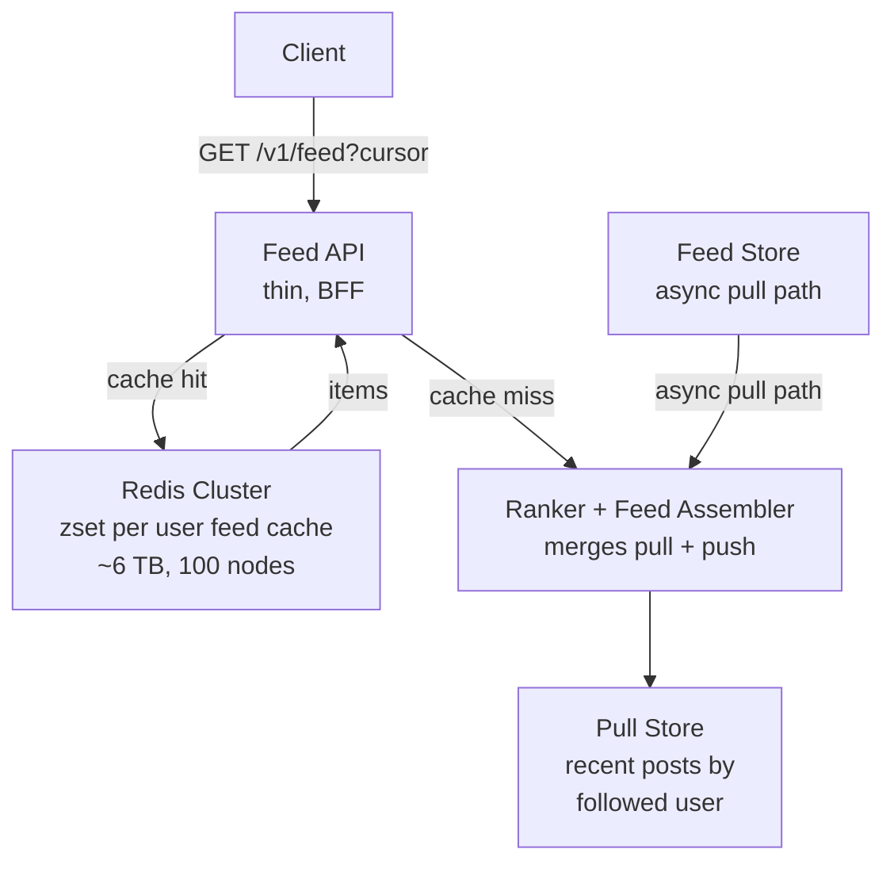

# News Feed System Design - Interview Transcript

Format: full 45-minute mock interview. Every line is spoken dialogue.

---

## 0:00 - 0:05 - Opening and the Problem

Interviewer: Thanks for joining. This is a 45-minute system design round. I'm going to hand you a product and I want to hear how you reason about it out loud. There is no single right architecture, and I will interrupt. Ready?

Interviewer: Design the news feed for a social network. Users post short text updates with an optional image. When a user opens the app they see a personalized, ordered list of posts from people they follow. The feed has to feel fast and relevant. It's at 100 million daily active users. Roughly 300 feed posts are read per user per day. Go.

Interviewer: Before you draw anything, what questions do you need answered?

Candidate: Let me go broad, then narrow. Broadly I need to know: is the feed ranked or purely chronological, how many follow relationships exist per user on average and at the tail, and what's the latency target. Narrowly: can a post be deleted, does an unread badge have to be exact, and are logged-out users in scope.

Interviewer: It's a ranked feed. Recency plus a quality score plus social signals. The average user follows about 300 accounts. The tail is brutal: about 2,000 accounts have more than a million followers, and the single biggest has 90 million. A post can be deleted by its author, and yes, it should disappear from feeds. Unread badge should be accurate but a couple minutes of drift is fine. Logged-out users see nothing. Target is 200 milliseconds p99 for the first screen, 500 milliseconds p99 for a full page.

Candidate: Good, that's a lot to work with. Let me state my assumptions back so we're aligned.

Candidate: Assumption set. One: text posts plus an opaque media reference; the media itself lives in object storage behind a [[cdn|CDN]] and I will not design the upload or transcode path. Two: eventual consistency is acceptable for the feed, but the post the user just made must be visible to them immediately, which I will solve with an optimistic local append. Three: I have access to a Redis-class in-memory store, a relational primary for the social graph and the post metadata, and a wide-column or document store for the outbox-style feed items. Four: multi-region reads are out of scope for the first cut, I'll say where they would go.

Interviewer: Reasonable. Start with scale.

---

## 0:05 - 0:13 - Phase 2: Estimation

Candidate: Let me do the math out loud so we both know what we are building.

Candidate: Read traffic. 100 million DAU, 300 feed posts read per user per day. That's 100e6 times 300, so 3e10 post-views per day. Divide by 86,400 seconds, that's roughly 347,000 post-views per second as an average. But nobody reads uniformly. The peak-to-average for social traffic is on the order of 3x, so design peak is about 1 million post-views per second, call it 1.1 million.

Candidate: Request rate is lower than view rate, because one request returns many posts. If a page is 20 posts, that's about 50,000 feed page requests per second at average, roughly 150,000 at peak. Let me size for 150,000 feed reads per second peak and note that the cache should absorb the large majority.

Candidate: Write traffic. If an average user posts a few times a day, say 1.5 posts per day, that's 1.5e8 posts per day, about 1,700 posts per second average, 5,000 at peak. That is a small number. But here is the thing I want to flag immediately: writes are cheap and reads are only moderately expensive, the real cost multiplier is fanout. If I fan out on write to every follower's feed, the write cost is proportional to the author's follower count, not to 1.

Candidate: Follow graph size. 100 million users averaging 300 follows each, so 3e10 follow edges. Even at 20 bytes per edge in a compact structure, that is 600 gigabytes. In a normalized row store with index overhead, call it 2 terabytes. That is shardable but it is real, and it tells me the social graph is its own store, not a table inside the post database.

Candidate: Post storage. 1.5e8 posts per day times 365 is about 5.5e10 posts per year. Say 500 bytes for text plus metadata and a media reference, and images are not counted because they are in object storage. 5.5e10 times 500 bytes is about 27 terabytes per year. With replication factor three that is 82 terabytes. Cheap, it fits on a handful of nodes. Posts are not the storage problem. Feed items are.

Candidate: Feed items, the output of fanout. 3e10 post-views per day implies a similar order of magnitude of feed item rows, but rows are materialized per follower. With an average fanout of 300, the theoretical write amplification is 1.5e8 posts per day times 300 equals 4.5e10 feed-item writes per day. That is 520,000 writes per second average, 1.5 million at peak. Doable, but the tail is where it gets interesting.

Candidate: Tail calculation for the celebrity problem. Take just the 2,000 accounts with more than a million followers. Suppose the average of that set is 5 million. 2,000 times 5 million is 1e10 fanout writes per day, which is 115,000 writes per second from 2,000 accounts alone, and those 2,000 accounts are a tiny fraction of total posts. If one of the top accounts posts once, that single post touches 90 million feeds, which at even 500 nanoseconds per write is 45 seconds of pure work on a single thread. That is the number that dictates the architecture, so let me write it on the board: a single post can require 9e7 writes, and a naive push-on-write design cannot do that inside the latency budget.

Interviewer: Good. You just told me push fanout has a ceiling. Keep that in your pocket and come back to it.

Candidate: One more estimate before I move on. Cache sizing. The most recent 300 feed items per active user. A compact serialized feed item, just the id plus a precomputed score plus timestamp, maybe 40 bytes. 300 times 40 bytes is 12 kilobytes per user, times 100 million DAU is 1.2 terabytes of hot feed data. But not everyone is hot, and we have a long tail. Let me instead size by what we actually serve: keep the most recent 100 items for the top 20 percent most active users and 30 items for everyone else, call it 500 million user entries times roughly 6 kilobytes, that is 3 terabytes. With replication factor two, 6 terabytes of RAM, which at 64 gigabyte nodes is on the order of 100 nodes. That is a normal Redis Cluster sized problem.

Interviewer: Reasonable numbers. Some people will just assert "it's a lot, we shard it." I like that you showed the work. What's the read-write ratio here?

Candidate: Roughly 200 to 1 at the request level, 3e10 views to 1.5e8 posts. Which means this is overwhelmingly a read system, and reads should be served from a tier that is cheap to scale and cheap to lose, while writes are the thing we protect.

Interviewer: What are your non-functional requirements?

Candidate: Latency: 200 ms p99 to first screen, so the cache hit path has to be a single round trip, no serial fan-in of five services. Availability: the feed is the product, so I'd target 99.95 percent on reads, and I'd rather serve a slightly stale feed than a 500. Consistency: eventual for the feed, strong for the follow relationship itself, because if I follow someone and their posts never appear, that is a bug users report immediately. Durability: posts are permanent, feed items are disposable and regenerable. Freshness: a post from someone you follow should appear within tens of seconds. Cost: this is the constraint people forget, fanout is a cost multiplier and I want it bounded per user.

Study separately: [[read-write-ratio|Read/Write Ratio]], [[cache-size-estimation]], [[dau-mau|DAU to MAU]], [[latency-budget]]

---

## 0:13 - 0:22 - Phase 3: High-Level Design

Interviewer: Draw it. Whiteboard, keep it simple.

Candidate: Four planes. A write plane, a fanout plane, a read plane, and a ranking plane.

```mermaid
flowchart TD
    CL[Client app]
    PS[Post Service<br/>stateless]
    PDB[Post DB MySQL<br/>PRIMARY + 2 replicas<br/>shard by post_id]
    EB[Event Bus Kafka<br/>topic: post.created]
    FO[Fanout Service<br/>partitioned by user]
    FS[Feed Store<br/>wide-column / document<br/>ordered by score]
    SG[Social Graph DB<br/>follows(from,to) PRIMARY<br/>shard by "from" the follower<br/>read: who does X follow]
    MD[Media: object store + CDN<br/>referenced by opaque media_id]

    CL -->|POST /v1/posts| PS
    PS -->|201 + post_id| CL
    PS -->|sync write durable| PDB
    PS -->|async publish event| EB
    EB --> FO
    FO -->|writes| FS
    SG --> FO
    MD --> PS
```



Candidate: Let me walk the four paths.

Candidate: Write path. Client posts to the Post Service. The service writes the post row durably to the post database, primary first, with the text, media reference, author id, and a server timestamp. It returns 201 with the post id inside the latency budget, and it does the fanout asynchronously by publishing a post.created event to Kafka. The post database shard key is post_id, which is a nice property because writes are random but the shard count is uniform and the per-author locality does not matter for this particular table.

Candidate: Fanout path. A Fanout Service consumes post.created keyed by author id. It looks up the author's followers and writes one feed item per follower into the Feed Store, and it also pushes the same item into the reader's Redis zset. The critical design point is that this consumer is partitioned by author id, so all events for one author land on the same partition and process in order. That gives me per-author ordering for free, which matters because otherwise a user's feed shows post 2 above post 1.

Candidate: Read path. The client calls GET /v1/feed. A thin Feed API, I would call it a backend-for-frontend, checks Redis for the user's zset, returns the top N items by score. On a miss it calls the Ranker and Assembler, which merges the precomputed push items with the on-demand pull items, scores them, writes the merged result back into Redis, and returns it. The API then hydrates each item with author metadata.

Candidate: Hydration, which is a real bottleneck. If a page is 20 items and I make 20 calls to the post service, I have a fan-out problem at request time. So I batch-hydrate: 20 items collapse to one call to a hydration service with a batch of ids, which itself does a multi-get across the sharded post store. That's [[fanout-and-aggregation|Fanout and Aggregation]] applied to the read path.

Candidate: Social graph read. When the pull path needs "recent posts from everyone I follow", the Social Graph DB is the entry point. Note I sharded follows by the follower, the from side, because the dominant query is "give me the people I follow", which is a point lookup. The query "who follows me" is served by a separate reverse index, because that's a scan and it's exactly the hot path for celebrities, so I want that scan to be cheap and separately scalable.

Study separately: [[backend-for-frontend]], [[fanout-and-aggregation]], [[shard-key|Shard Key]], [[kafka-ordering|Kafka Ordering]]

Interviewer: Walk me through the read API contract in detail.

Candidate: Sure. Three endpoints.

Candidate: Create a post.

```http
POST /v1/posts
Content-Type: application/json
Idempotency-Key: 7f3a-9c11-4b2e

{
  "text": "shipped the fanout worker",
  "media_ids": ["m_9f2a1c"],
  "client_ts": 1738400000123
}

201 Created
Location: /v1/posts/p_01HQ8...
{
  "post_id": "p_01HQ8X2K9",
  "author_id": "u_88213",
  "created_at": "2026-01-09T18:13:20.117Z",
  "state": "published"
}
```

Candidate: The idempotency key matters because a mobile client on a flaky network will retry, and I do not want duplicate posts. I store the key against the user id in the post service with a TTL, and a repeat returns the original 201 rather than creating a second row.

Candidate: Follow graph.

```http
PUT  /v1/users/{target_id}/followers/me    204 No Content
DELETE /v1/users/{target_id}/followers/me 204 No Content
GET  /v1/users/{id}/followers?count=25&cursor=... 200 OK
```

Candidate: The PUT is strongly consistent, it writes to the Social Graph primary, and it publishes a relationship.changed event. That event is what triggers backfill, which I will come back to. If you follow someone and pull from their history, the backfill is asynchronous so there is a window where a new follower's feed is empty. That is a real, accepted trade-off, and I mitigate it by having the follow endpoint optimistically write a bootstrap item into the follower's Redis zset for the most recent 20 posts of the newly followed user, so the feed is never empty.

Candidate: Feed read.

```http
GET /v1/feed?limit=20&cursor=b64:u_88213:498377120011:4412
Accept: application/json

200 OK
X-Feed-Cache: HIT
X-Feed-Freshness-Age-Ms: 8300

{
  "items": [
    {
      "post_id": "p_01HQ8X2K9",
      "author": { "id": "u_88213", "name": "Manav", "avatar_url": "https://cdn..." },
      "text": "shipped the fanout worker",
      "media": [ { "type": "image", "url": "https://cdn...", "w": 1080, "h": 720 } ],
      "score": 0.9132,
      "score_breakdown": { "recency": 0.71, "affinity": 0.22, "engagement": 0.83 },
      "created_at": "2026-01-09T18:13:20.117Z",
      "social": { "likes": 412, "comments": 37, "you_liked": false },
      "cursor": "b64:u_88213:498377120011:4408"
    }
  ],
  "next_cursor": "b64:u_88213:498377110220:4404",
  "has_more": true
}
```

Candidate: Cursor pagination, not offset. Offset pagination is wrong here for two reasons. First, an offset of 10000 means the database has to walk 10,000 rows, and with a ranked, continuously mutating feed those rows shift under you so you get duplicates and gaps. Second, the feed is fed by two sources arriving at different times, so offsets are pure nondeterminism. My cursor encodes user id, a score-and-timestamp pair, and the position, so the next page is a range scan from that exact point. That is [[pagination|Cursor Pagination]] and it is the single most important API decision in this whole design.

Candidate: One more, the social actions, because I want to talk about why they do not go to Kafka for the read path.

```http
POST /v1/posts/{post_id}/likes   201 Created
DELETE /v1/posts/{post_id}/likes 204 No Content
GET /v1/posts/{post_id}/comments?cursor=... 200 OK
```

Candidate: Likes are idempotent by definition, a like row is keyed on (post_id, user_id), so a duplicate is a no-op at the database level. And likes are not fanned out to a million feeds, they update a counter in the Ranker's feature store. The ranker recomputes and the item's score moves. This is the right way to keep engagement signals fresh without turning every like into 90 million writes.

Study separately: [[pagination]], [[idempotency]], [[filtering-sorting-searching]], [[api-design-principles|API Design Principles]]

---

## 0:22 - 0:33 - Phase 4: Deep Dive

Interviewer: Now the part I actually want to hear about. Talk me through pull versus push versus hybrid, and the celebrity problem. Draw the fanout models if it helps.

Candidate: Sure. Three models.

Candidate: Pull on read. Nothing is materialized. When the user requests a feed, the server asks the social graph for the follow list, then fetches the recent posts of each of those accounts, merges, ranks, and returns. Storage is minimal because there's no per-follower copy. The costs: the read path does hundreds of backend calls per request, latency is the max or the p99 of 300 lookups, and the social graph becomes a per-request hot dependency. This works for a low-follow-count product and it dies at 300 follows. You can batch it with a multi-get and parallelize, but you're still paying 300 lookups per page of 20, which is a 15x amplification for zero ranking benefit. So pure pull is out, except as a fallback.

Candidate: Push on write. Fan out at write time, every post is written into every follower's feed store. Reads become a single key lookup, which is why Twitter and Facebook both chose this direction. The costs: write amplification, storage that grows with the product of followers and posts, a cold-start problem for new followers, a delete problem because the post is in 90 million places, and it is fundamentally incompatible with celebrities.

Candidate: Hybrid, this is my answer. Push for ordinary accounts, pull for celebrities, and a small amount of pull for the cold-start and backfill cases.

```text
                 PUSH FANOUT ON WRITE                    PULL ON READ
  post.created                                             GET /v1/feed
       |                                                        |
       v                                                        v
  Is author "hot"?                                     Follower ids -> graph
       |                                                        |
   +---+---+                                             recent N posts each
   |       |                                                     |
  NO      YES                                                  merge + score
   |       |                                                     |
   v       v                                                     v
 fanout  skip push                                     hydrate + return
 worker   to followers
   |
   +--> Feed Store row  (persistent push items)
   +--> Redis zset     (real-time push items)
                                       PULL STORE: (author_id, post_id) sorted by ts
                                       QUERY: "latest 20 per followed author, merge"
```

Candidate: The hybrid decision rule. I compute a "hotness" flag on the author, and the flag is cached on the author record so the fanout worker reads it in O(1) rather than doing a followers count every time. Threshold is on the order of 10,000 followers. Below that, push. Above that, do not push, and instead mark the author as hot.

Candidate: Why not just raise the threshold? Two reasons. One, cost and stability: at a threshold of 100,000, 20,000 users push, and the total push volume becomes a meaningful fraction of everything. Two, and more important, the worst case is unchanged in shape. A celebrity with 90 million followers still kills you at any threshold, because the problem is not the average hot user, it is the single largest. The threshold only decides how many users are in the pull bucket, not whether the pull bucket is safe. Pull is safe because the reader merges only the celebrity's most recent N posts, and that work is proportional to the number of feeds being served, not to the celebrity's follower count.

Candidate: Now the celebrity read path in detail. When a user has hot authors in their follow set, the assembler does a multi-get against the Pull Store, which is a table keyed by author_id and indexed by (author_id, created_at descending). It asks for the latest 20 posts per hot author, merges those with the push items from Redis, and scores everything. If a user follows 5 celebrities, that's 5 range scans, which is fine. If a user follows 50 celebrities, it's 50, and at that point I would cap the number of hot authors merged per request and prioritize by the user's affinity to each celebrity.

Candidate: The Pull Store itself is simple. Key-value or wide-column, partitioned by author_id, one row per post, hot partition per author. Size is small because it is only the recent window, 1.5e8 posts per day times 7 days retained is about 1e9 rows, 500 bytes each, 500 gigabytes. Trivial.

Candidate: Ranking timeline. Score is computed, not stored as truth. Final score is a weighted linear blend plus a small interaction term.

```text
  score(item, reader) = w_r * recency_decay
                      + w_a * affinity(reader, author)
                      + w_e * normalized_engagement
                      + w_q * quality
                      + w_d * diversity_penalty

  recency_decay = exp(-(now - created_at) / HALF_LIFE)
  affinity       = f(how often reader interacts with this author,
                     how many of reader's friends also liked it)
  engagement     = log(1 + likes + 3*comments + 5*shares) normalized
  diversity      = 1 - (recent_posts_from_this_author / cap)
```

Candidate: Three properties I want to defend. First, recency is an exponential decay rather than a cliff, so I never have a "top posts" bucket that goes stale. Second, engagement is log-compressed, otherwise one viral post pins itself to the top of a hundred million feeds forever. Third, there is a diversity penalty, because pure scoring produces a feed where the same person appears five times, and users read that as broken.

Candidate: Precomputation strategy. I score a post once per author, not once per reader, for the parts that are reader-independent. So I keep a global base score per post, computed asynchronously a few seconds after creation by a scoring worker reading the engagement counters, and the base score is what goes into the feed store and the Redis zset. At read time the feed service applies only the cheap reader-specific correction, mostly the affinity term and the diversity penalty, which is a small in-memory operation over 20 items. So the expensive ranking runs once, the cheap personalization runs per request, and the push path stays cheap enough to fan out.

Candidate: Feed cache data model. Redis sorted set per user.

```text
  Key:    feed:{user_id}
  Type:   ZSET   (score = precomputed rank score, member = compact item)
  TTL:    refreshed on read, 24h floor, evicted lazily beyond 500 items

  Member encoding (compact, ~40-60 bytes):
    p_01HQ8X2K9 | 1738400000117 | 0.9132 | {tiny author+text preview or a pointer}

  SMEMBERS -> hydrate -> POST DB (batched multi-get)
```

Candidate: Why a sorted set and not a list. Because ranking means the order is by score, not by insertion, and a sorted set gives me a ranked range query for free, ZREVRANGE for the top 20, and it handles the case where an old post's score is boosted by late engagement. A plain list would require a read-modify-write to reorder.

Candidate: Why shard by user. Because the entire read path is a single-user lookup, and sharding by user_id means that request never crosses a shard. Every single read is a point get, which is the ideal access pattern for [[sharding|Sharding]] and for [[consistent-hashing|Consistent Hashing]] with virtual nodes so the cluster can grow. The social graph and the feed store use different shard keys on purpose, the graph by follower, the feed by feed owner, and I accept that following someone is a cross-shard operation while reading your own feed is not.

Candidate: Shard count. 100 nodes at 64 gigabytes. Start at 64 shards with 16 nodes, so about 4 nodes per shard, then use virtual nodes to allow a shard to split across more machines as it grows. I would not start with 1000 shards because a large number of shards means a large number of cross-shard operations for the cold-start and backfill paths, and that operational pain is real.

Candidate: Cache miss handling. On a miss, the assembler does the full merge, scores, writes the merged top 300 into Redis, and returns the top 20. The write is a pipelined ZADD plus a trim to the top 300 plus an EXPIRE. I do the write after the read returns to the client, or at least off the critical path, so the user does not pay for the cache fill.

Candidate: Cache stampede. This is a real failure mode here because of the celebrity problem and because of the pull-to-refresh pattern. Three defenses. One, a per-user mutex, a SETNX with a short TTL so only one request per user does the assembly and the rest either wait briefly or serve stale. Two, jittered precomputed expiry, so a batch of feeds created at the same time does not all expire at the same time. Three, stale-while-revalidate: on a miss, if a stale copy exists, serve the stale copy immediately and refresh in the background. Feeds are a perfect use case for stale-while-revalidate because a feed that is 60 seconds stale is still a good feed.

Candidate: Converse depth, which is pagination into the conversation tree. A thread is an adjacency list.

```sql
  CREATE TABLE posts (
    post_id        CHAR(24)      PRIMARY KEY,
    author_id      BIGINT        NOT NULL,
    text           TEXT,
    media_ids      JSON,
    root_id        CHAR(24)      NOT NULL,
    parent_id      CHAR(24)      NULL,
    depth          TINYINT       NOT NULL DEFAULT 0,
    reply_count     INT          NOT NULL DEFAULT 0,
    like_count      INT          NOT NULL DEFAULT 0,
    state          ENUM('published','deleted','hidden') NOT NULL,
    created_at     TIMESTAMP(3)  NOT NULL,
    INDEX idx_author_created (author_id, created_at DESC),
    INDEX idx_root_created   (root_id, created_at ASC)
  ) ENGINE=InnoDB;
```

Candidate: The root_id plus created_at index gives me a flat, chronologically ordered read of a thread in one range scan, which is the right user experience for a reply list. The parent_id is kept for the tree view and for "show nested replies". Depth is capped, past about 8 levels a thread is flattened, because deep trees are unreadable and deep fan-in is a denial-of-service vector. That is [[btree-lsm-hash-index|Index Selection]] thinking rather than a blind table.

Candidate: Delete propagation. This is why I want to say the push feed items are pointers, not copies. A deleted post sets state to deleted, we publish post.deleted, the fanout consumer marks the item as deleted in the feed store with a soft delete, and the Redis zset members get a tombstone. But that is 90 million operations for a celebrity. My actual answer: we do not eagerly delete. We mark the post deleted in the post database, and at read time the hydration step sees the tombstone and substitutes a "this post was deleted" placeholder. Only for normal users do we eagerly clean the feed store, because it is cheap. That is a nice example of a design where the cost of the consistent thing scales with the follower count, so you choose the eventual thing for the tail.

Study separately: [[cache-warming]], [[hotspot-handling|Hotspot Handling]], [[probabilistic-data-structures]], [[tail-latency|Tail Latency]], [[event-sourcing-cqrs|CQRS]]

Interviewer: Good. Let me push you on a few things.

Interviewer: Question one. Traffic doubles overnight. A viral event. What breaks first, and what do you do?

Candidate: Let me rank my own weak points. First thing to break is the fanout workers, because push volume scales with the write burst and then with the engagement burst, and the engagement burst is the killer, a viral post gets a hundred thousand likes and every like I said only touches a counter, so that's fine, but the read volume goes up 5 to 10x and the cache is what absorbs that. The actual first thing to break in my design is Redis, because it holds the read path. Second is the celebrity pull path, because if a mass event makes 50 million people open the app and those users all have celebrities in their feed, the Pull Store gets hammered with the same range scans.

Candidate: What I do about it, in order. One, the CDN and client layer absorb image traffic, which is the biggest byte volume, and that's not on my servers. Two, autoscale the read path on cache hit rate and p99 latency, not just CPU, because a serving node under a miss storm looks busy in exactly the wrong way. Three, aggressive pre-warming: I run a job before the event that predicts the audience, for example, a sports match means the two teams' fanbases, and pre-populates the top 20 feed items for those users into Redis in the hours before, so the event is a cache hit storm rather than a cache miss storm. That is [[cache-warming]]. Four, the rate limiter and load shedding: degrade gracefully by serving a shorter page, 10 items instead of 20, and by widening the score window rather than by returning an error. Five, for the pull path, I pre-warm the celebrity pull cache too, the top 20 posts of the top 1000 authors cached in Redis, so a viral event hits a precomputed value.

Interviewer: Question two. The primary node for the feed store dies, right now, mid-traffic. Walk me through.

Candidate: Okay. Feed Store is a wide-column store sharded by user_id. Shard-level replica promotion, one replica per shard, promoted by the store's own consensus layer. That gives me a loss of writes for the duration of the failover, which for a feed is acceptable because feed items are regenerable from the event log. So the correct order is: promote the replica, and replay the missed events from Kafka, because the event log is my source of truth for feed items. Kafka has a replication factor of three across availability zones, so the events survive. I replay by feeding the fanout consumer's output position back to the last applied offset, which is the durable, replayable design rather than a lossy one.

Candidate: Meanwhile the read path: reads go to the promoted replica and there will be a window where recently pushed items are missing. The user would see a slightly older feed. That is acceptable, and I make it explicit in the design that the feed store is an eventually consistent, replayable, disposable store. The post database is different, that is strongly consistent and I promote with a quorum check to avoid split-brain.

Candidate: What I would not do is a global failover for the feed store, because sharded stores fail per shard and a global promotion would be slower and would take healthy shards offline. And I would never treat the feed store as the source of truth for a post, because then a lost shard means lost posts. Posts live in the post database, the feed store is derived. That is the [[event-sourcing-cqrs|CQRS]] read-model principle and it is what makes the failover boring.

Interviewer: Question three. One user is a single hot key. Not a celebrity, just one account where 50,000 people are hammering the same feed, or one post whose like counter is being hammered. What do you do?

Candidate: Two very different problems, so two answers. The first is a hot feed key, the same user's zset being read at very high QPS. Defenses in order of preference: a local in-process cache of the top page in front of Redis, which absorbs a large fraction of reads for popular content; a replica-read policy, route a percentage of reads to Redis replicas since a stale-by-a-few-seconds feed is fine, this alone is often a 2 to 3x multiplier; and request coalescing so 50 concurrent identical requests become one Redis round trip. If it is still hot, I shard the zset itself by a hash of the post_id, so the key becomes 8 keys of 20 items each and the top-K merge happens in the service, that is sharding a single hot key. That's the general technique, [[hotspot-handling|Hotspot Handling]].

Candidate: The second is a hot counter, the like count on a viral post. The fix there is to not have a shared mutable counter on the critical path. I take likes into a Kafka topic, and a consumer aggregates them in windows and writes the counter every few seconds, so the read path reads a value that is at most a few seconds stale, which is completely fine for a like count. If the read must be exact, which it does not here, then I would use a striped counter, 64 sharded counters summed on read, which trades exactness-on-write for fan-in-on-read. Same for comment counts.

Interviewer: Question four. Replica lag. Your fanout consumer writes to the feed store, but there's a replica, and the read hits a replica that's 30 seconds behind. What breaks?

Candidate: Nothing user-visible, and that is by design, but let me be precise about which reads tolerate it. Reads that tolerate replica lag: the feed page itself, like and comment counts, and the hydration of post content, because a post that is 30 seconds old is still correct content. Reads that do not tolerate it: the follow graph, because if I follow someone and the graph read hits a stale replica, my follow silently does not exist, so those reads go to the primary. And post creation, which is a write, obviously.

Candidate: The consequence I care about is on the write side, not the read side. If a user posts and immediately pulls their own feed, and that feed is assembled from a lagging replica, their new post is missing. My fix for that is the optimistic local append: the client's own post is rendered immediately from local state and inserted at the top of the feed with a pending style, and the server echoes it back in the first response, so the user always sees their own post. This is the same trick used for message send. I would also make the fanout write path read-your-writes by pinning the assembly for the author to the primary for the first few seconds after a post.

Candidate: The general rule I would state: the system's consistency requirement is per read, not per system. Not everything is strongly consistent and pretending otherwise is a design error. That is [[replication-lag|Replication Lag]] and [[strong-vs-eventual-consistency]].

Interviewer: Question five, and this is the one most people get wrong. Why not just put the whole feed in a wide-column store like Cassandra or DynamoDB and skip Redis?

Candidate: I would, partly. The argument for Redis is latency and simplicity: a single-key ZREVRANGE returning 20 pre-ranked items is one network hop, versus a multi-partition scatter-gather with a coordinator doing the merge. Redis wins on p99 for the pure read path.

Candidate: But I would be honest that this is not a huge win, and I would name the costs. First, Redis is memory-priced, so 6 terabytes of RAM is roughly 10x the cost of the same data on disk, and my working set is 6 terabytes. Second, a zset gives me a limited data model, no secondary access, no ad-hoc query, and if I later want to filter by "only posts with media" or run an analytics query, Redis cannot help me. Third, durability: Redis persistence plus replication means I could lose recently written feed items on a failover, which is fine only because the feed is derived.

Candidate: So the defensible answer is: use the wide-column store as the durable, sharded, ranked feed store with (user_id, score_bucket, post_id) as the clustering key, and put Redis in front as a cache, not as the primary. If I were building this for a smaller product with a tighter memory budget, I'd probably go all wide-column and skip Redis. The point is I know what I'm trading and I would not defend Redis as universally right. The thing I will not do is put the feed in a relational database, because ranking plus pagination plus write amplification on a 90-million-row-per-partition table is a bad time.

Study separately: [[sql-vs-nosql]], [[caching]], [[redis]], [[consistency-models|Consistency Models]], [[quorum]]

Interviewer: Question six. A user who hasn't logged in in 90 days logs in today. What do you show them?

Candidate: The cold start problem, and I think this is under-discussed. If I did pure push fanout and the user was inactive, nobody was writing to their feed during those 90 days, so their feed store is empty, and if they are following 300 accounts the correct answer is "the latest 20 posts from 300 people, ranked". So for inactive users the pull path is the answer, not a special case.

Candidate: Concretely, the Feed API checks the last-accessed timestamp. If it is older than a threshold, say 30 minutes, it goes to the pull-and-assemble path: fetch the follow list, fetch the top K recent posts per followed author with a bounded fan-in, rank with the same scoring function, and populate the push feed store and Redis as a side effect. After that the user is active again and reads come from cache.

Candidate: Two things make that affordable. First, the bounded fan-in: I cap the number of followed authors I pull from at around 200, chosen by affinity, and I cap at 20 posts per author, so it's 4,000 candidate items, which is a fine in-memory rank of a few milliseconds. Second, the stagger: I do not backfill for a user until they actually return, so inactivity costs nothing while it happens. The cost of this design is that I only maintain feed materialization for users who read, which is exactly the right cost model.

Candidate: There is a second flavor of cold start, the brand new follow relationship, and that's the backfill path. On relationship.changed, a Backfill consumer reads the new followee's most recent 20 posts and writes them into the follower's feed store. I bound it: max 20 items, and I do it asynchronously with a delay, sometimes randomized up to a few minutes, so a mass follow event does not create a synchronously huge backfill. Combined with the optimistic bootstrap item I mentioned earlier, the feed is never empty.

Interviewer: Question seven. Ranking. Why is your score model right, and how do you know?

Candidate: I should be honest that the model is a starting point, and the real answer is an evaluation harness. Offline, I take a sample of users, build candidate sets with my scorer, and compute metrics like NDCG at 10 and recall of the items each user actually engaged with. Online, the only metrics that matter are topline engagement, session length, and critically, the negative signals: hide, unfollow, and report rate, and the "scroll depth past 5" rate, because a feed that ranks garbage gets fast scrolled and that shows up in the data.

Candidate: The reason a linear blend with log-compressed engagement is a good default is that it is explainable, tunable, and I can attribute a score change to a feature. A learned ranker is strictly better in quality, and I would absolutely ship one eventually, but a learned ranker needs features computed at candidate-generation time per reader, which is the expensive part. My staged plan: ship the hand-tuned blend, log every score and its breakdown, which I am already returning in score_breakdown, then train a small GBDT offline and shadow it against the blend before serving. Two-stage retrieval and ranking, [[search-ranking|Ranking]], applied to a feed.

Candidate: The feedback-loop risk I want to name: engagement-optimized ranking is a rich-get-richer loop where popular content gets more exposure which gets more engagement. I cap it with the diversity penalty and with exploration, a small percentage of slots filled by a deliberately non-greedy policy. And the freshness guarantee: the top 5 slots are always constrained to posts from the last 24 hours, which is a hard product rule that bounds how stale a feed can feel.

Study separately: [[search-ranking]], [[mapreduce-lambda-kappa]], [[oltp-vs-olap|OLTP vs OLAP]]

---

## 0:33 - 0:43 - Phase 5: Trade-offs and Follow-ups

Interviewer: Let me get your trade-offs on the record, then push on failure scenarios.

Candidate: The trade-offs I am explicitly accepting, in order of how much they cost me.

Candidate: One, I accept eventual consistency on the feed to get a single-key read. If I made the feed strongly consistent with the post database, every read would join across the social graph, the feed store, and the post store, and my p99 would be three network hops and a merge, and I would lose the 200 millisecond budget. What I buy with eventual consistency is a feed that can be up to tens of seconds stale. Mitigation: read-your-writes for one's own posts, which is the only freshness users notice.

Candidate: Two, I accept a stale like count. I take likes through a queue and aggregate on a window. What I buy is a like endpoint that survives a 100,000-per-second viral post. Mitigation: nobody cares that a like count is 3 seconds behind.

Candidate: Three, I accept eventual deletion propagation, a deleted post shows as a tombstone for up to tens of seconds for followers, and for celebrities it may survive until the next assembly. What I buy is not doing 90 million deletes. Mitigation: the post itself is gone from the author's profile and from the post database immediately, and the tombstone is honest rather than showing deleted content.

Candidate: Four, I accept a cost that is not uniform per user. A user with 5000 followers costs 5000 times what a user with 1 follower costs to publish. That is the fundamental property of push fanout, and I pay it knowingly because the alternative, pull, costs every read instead. Push is right because reads outnumber writes 200 to 1.

Candidate: Five, I accept Redis's memory cost in exchange for p99 latency, and I've already said I'd reconsider it under budget pressure.

Candidate: Six, I accept that ranking is eventually consistent too. A post that becomes interesting 6 hours later will not be retroactively injected into feeds. That's the price of precomputed scores, and it's a good trade because retro-injection would break the cursor pagination model.

Candidate: Seven, I accept a single-region design for the first cut. Every user reads from one region, which keeps the social graph reads local and avoids a cross-region round trip on the critical path. When I go multi-region, I use [[geo-dns-anycast|Geo DNS]] with locality-based routing and per-region feed caches, and I accept that a follow made in one region propagates to the other within the replication window.

Interviewer: Failure scenarios. Rapid fire, I want your reflexes.

Interviewer: Kafka consumer group rebalances during a deploy and stops consuming for 90 seconds.

Candidate: Feed push stops for 90 seconds. New posts are not materialized into followers' feeds. Impact: users pull-to-refresh and don't see brand new posts. What saves me: the post itself is already durable in the post database, because the publish happens after the durable write, so nothing is lost. The recovery is that on rebalance the consumer resumes from its last committed offset, and the messages are still in Kafka with a retention of 7 days. And I alert on consumer lag, which is a golden signal here, and I have a threshold at 60 seconds. Also I would not do a rolling deploy that rebalances all partitions at once; I use a static membership or a two-phase rebalance so partitions move one at a time.

Interviewer: Redis Cluster loses a master and the replica is promoting.

Candidate: Feed reads for that shard's users fail or serve errors for a few seconds. Feed items are reconstructible, so the fix is failover plus replay from the event log, same as the feed store. I treat the Redis layer as disposable, which means I never write something to Redis that I cannot rebuild, and the fanout path is idempotent so a replay does not duplicate items, that is [[idempotent-consumer|Idempotent Consumer]]. I use ZADD with the member being a deterministic encoding of post_id, so a duplicate is a no-op update, not a duplicate row.

Interviewer: A bug in the ranking service ships and every feed shows the same 3 posts.

Candidate: That's a bad-tasting incident, not a data-loss one. Because the feed store and Redis hold materialized items and the ranker only reorders at read time, the blast radius is presentation. I mitigate with a feature flag on the scoring weights, so I can revert to the previous weights in under a minute without a deploy, and with a canary at one percent. Then I add a ranking diversity assertion in a synthetic monitor that fails if the top 5 of any sampled feed is more than 80 percent from a single author, which catches exactly this class of bug automatically.

Interviewer: A post gets deleted by its author and it is a 90-million-follower post. Walk me through the actual mechanics, not the theory.

Candidate: Post database sets state to deleted, tombstone row written, that is one write and it is strongly consistent so the author sees it immediately. We publish post.deleted. The eager cleanup path is gated by an author hotness flag, so for a normal author we run the fanout consumer's delete and mark 300 feed items deleted, trivial. For a hot author we skip eager deletion entirely. The read path substitutes the tombstone, which the hydration service already handles since it reads the post row. And the follower's Redis zset: for normal authors we ZREM the members, for hot authors we leave them and let the tombstone render. Purge of the physical rows is a batch job that removes feed items pointing at deleted posts, run off-peak, rate-limited so it does not compete with reads.

Interviewer: Someone tries to scrape the entire feed. 10,000 requests a second from one account.

Candidate: Rate limiting at the edge, token bucket per user and per IP, and the buckets are distributed so a single limiter is not a bottleneck, [[rate-limiter]]. But I would also notice that scraping reads is exactly what a CDN and short-lived pre-signed URLs help with only for media, not for the feed itself. The feed API returns signed, short-lived cursor tokens, and cursors are bound to the user id, so a cursor leaked from one account cannot page another account's feed. That is a real protection, since an unscoped cursor is a data-leak vector. And anomaly detection: a fetch rate well above that user's 99.9th percentile triggers a challenge, not a 403, because it might be a shared family account.

Interviewer: Last one. Where does this break at 10x, 100 million to 1 billion users?

Candidate: At 10x, nothing structural breaks, it is a re-sizing job: 10x the Redis nodes to 1,000, the feed store shards go from 64 to maybe 512, the fanout workers scale out, and the post database goes multi-shard. The two things that get annoying are the number of shards, which makes the backfill and cross-shard operations operationally painful, and the social graph, which at 3e12 edges becomes 60 terabytes and needs its own tiering, maybe an in-memory adjacency store for active users and disk for the rest.

Candidate: At 100x, the design changes shape in two places. First, the follower graph no longer fits the working set and the celebrity pull path becomes the dominant read, so I would precompute per-user "top hot-author posts" as a materialized view refreshed continuously, which turns a per-request merge into a per-user lookup. That is the real answer at extreme scale: move the merge out of the request path. Second, feed item storage becomes the largest cost in the system, 4.5e10 rows a day, so I would move to an approximate representation: store a bounded, ranked subset, say 200 items per user, and accept that the tail of the feed is not perfectly ranked. Many real systems already do this. And I would probably cut the fanout window, push only the last 24 hours and pull the rest.

Candidate: The thing that does not change is the shape of the solution: a durable write path, an event log, a materialized read model, a cache in front, and a per-user shard key. That shape is what I would recognize in someone else's system.

Study separately: [[shard-rebalancing]], [[cell-based-architecture|Cell-Based Architecture]], [[regional-failover]], [[feature-flags]], [[sli-slo-sla|SLIs, SLOs, and SLAs]]

---

## 0:43 - 0:45 - Final Architecture Summary

Interviewer: You've got two minutes. Close it out for me. What did you build, and what is the one-sentence version of why it works?

Candidate: I built a news feed with four planes. The write plane takes a post, writes it durably to a post database sharded by post_id, returns 201 in under 200 milliseconds, and publishes a post.created event to Kafka, so the post is never at the mercy of the fanout pipeline. The fanout plane consumes that event keyed by author id for ordering, and for ordinary authors under roughly ten thousand followers it writes one feed item per follower into a wide-column feed store sharded by user_id and into a Redis sorted set, pre-scored by an asynchronous ranking worker; for hot authors it does nothing and leaves them to be pulled. The read plane is a thin backend-for-frontend that does a single ranked range read from Redis, falls back on a miss to an assembler that merges the push items with the latest posts of the user's hot followees, ranks them with a precomputed base score plus a cheap per-reader affinity and diversity correction, and caches the merged result; it returns cursor-paginated pages and hydrates them with one batched multi-get rather than twenty point reads.

Candidate: The three decisions that carry the whole design are: push for the many and pull for the few, so that write cost is bounded by a threshold instead of by celebrity follower count; the feed as a disposable, replayable read model derived from an event log, so every cache and read-model failure is a rebuild rather than a data-loss incident; and a shard key of user_id on the read path, so ninety-nine percent of traffic is a single-key lookup.

Candidate: What I accept in exchange: an eventually consistent feed that can be tens of seconds stale, stale like and comment counts, eventual deletion propagation, a non-uniform per-user publish cost, and a memory bill for the Redis tier. Every one of those is a freshness or cost trade in exchange for read latency and read scalability, and I chose that deliberately because the read-to-write ratio here is two hundred to one. If you told me the product required exact like counts or instant deletes across ninety million feeds, I would re-open the design, and I would probably move the feed off Redis onto a durable ranked store with a much tighter freshness budget.

Interviewer: That's a good answer. We're out of time. Thanks.

---

## Coverage Checklist

- Requirements clarification: functional, non-functional, product semantics, assumptions stated
- Scale, traffic, and storage estimation: DAU, read QPS, write QPS, fanout amplification, tail calculation, cache sizing
- API design: create post, follow/unfollow, feed read with cursor, social actions, idempotency
- High-level architecture: ASCII diagram, four planes, walkthrough of each path
- Request and data flow: write, fanout, read, hydration, backfill
- Database design: posts table with thread indexing, social graph, feed store clustering
- Caching: zset model, miss handling, stampede defenses, stale-while-revalidate, pre-warming
- Messaging: Kafka topics, keying for ordering, replayability, idempotent consumers
- Partitioning and sharding: user_id, virtual nodes, 100-million-row partitions, hotspot splitting
- Replication: post DB strong, feed store replayable, Redis disposable, per-read consistency
- Availability and fault tolerance: failover, rebalance, deletion storms, single points of failure
- Bottlenecks: hydration fan-out, social graph hot path, celebrity pull, counter contention
- Scaling: 2x viral event, 10x, 100x
- Trade-offs: seven explicitly accepted
- Failure scenarios: consumer rebalance, Redis master loss, ranking bug, viral delete, scraping
- Follow-ups: traffic doubling, primary death, hot key, why not Cassandra, replica lag, cache stampede, cold start, inactive user, ranking justification
- Final summary: three-part close

---

## What I Must Know

### Must Know
- [[fanout-and-aggregation|Fan-Out and Aggregation]]
- [[caching|Caching]]
- [[hotspot-handling|Hotspot Handling]]
- [[pagination|Pagination]]

### Good to Understand
- [[shard-key|Shard Key]]
- [[replication-lag|Replication Lag]]
- [[search-ranking|Search Ranking]]
- [[event-sourcing-cqrs|Event Sourcing and CQRS]]
