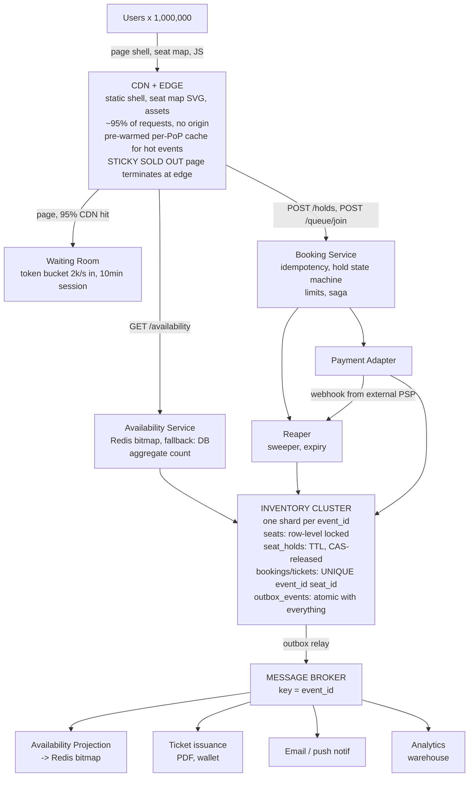

# Ticket Booking System Design — Full Mock Interview Transcript

Target: Staff / Senior Engineer system design. Interviewer: Principal Engineer, Marketplace (live events).
Candidate duration: 45 minutes of design conversation (the full session including questions, whiteboard, and follow-ups runs about 85 minutes).

Every line below is spoken dialogue. Diagrams, schemas, and API contracts are whiteboard artifacts the candidate produces while speaking, and are reproduced in fenced blocks between the lines that introduce them.

---

## Session Setup

Interviewer: Thanks for joining. Ticketing platform, prompt is on the shared doc. The thing I care about is not the average day, it is the on-sale. Take a minute, then let's talk. Think out loud.

Candidate: Understood. I will start with the shape of the spike, because I expect that is what decides the architecture.

---

## Phase 1 — Requirements Clarification

Interviewer: Go ahead.

Candidate: First question. Do all events have a seat map, or are some general admission with just a capacity number?

Interviewer: Both, and it is about sixty-forty. Concerts and sports are reserved seating with real seat numbers. Theatre is reserved. Stand-up comedy, some festivals, and most conferences are general admission with sections and a price per section but no seat numbers.

Candidate: Then I have two different inventory models. Reserved seating is a set of individually addressable units, and the hard part is excluding overlap between concurrent requests. General admission is a counter, and the hard part is not letting it go negative. I will design for reserved seating because it is the strictly harder problem, and note where general admission simplifies.

Interviewer: Where does price live?

Candidate: On the section, mostly, with two exceptions. Some events have seat-level overrides, typically accessible seats and a few VIP boxes priced individually. And some events have "best available", where the customer picks a price band and we allocate the best seat in it.

Candidate: "Best available" is interesting because it moves seat allocation from the client to the server, and that changes the concurrency design completely. Let me flag that and come back to it.

Interviewer: There are also production blocks, VIP allocations, accessibility holds, and staff comps. When do those apply?

Candidate: Before the sale opens, as a block on the seat map, so they look identical to sold seats to the public. If they were applied during the sale you would have a race between a block job and a customer transaction.

Interviewer: Per-purchase limits?

Candidate: Yes, and they are a scalping control, not just a business rule. Four tickets per event for the general public, unlimited for the venue's own allocation, and a lower cap during the first fifteen minutes for resellers. This matters for the design because it is a counter I can enforce in the same transaction as the hold, and enforcing it is far better than detecting bots after the fact.

Interviewer: Hold duration?

Candidate: Ten minutes is the default. Some events need twenty for group sales, and the duration is a per-event, per-price-tier configuration that is snapshotted onto the hold at creation so that changing the config later never changes the terms of a hold that already exists.

Interviewer: Can one order span two events?

Candidate: Technically yes for a festival pass, and no for a single concert. I will assume no, because multi-event orders mean multi-shard transactions if I shard by event, and I would rather spend that complexity budget on the oversell problem.

Interviewer: Now the on-sale. Go.

Candidate: What is the demand-to-supply ratio? How many people arrive and how many tickets exist?

Interviewer: A strong on-sale: one million concurrent users when the sale opens, one hundred thousand tickets, and most of the demand arriving in the first two minutes.

Candidate: That is the only number that matters. Six times more people than seats. Let me push on it: what is the *page view* rate versus the *booking attempt* rate?

Interviewer: Of the million, maybe 60 percent actively attempt a booking, so 600,000 booking attempts, and about 30 percent of all page loads are refreshes triggered by someone watching availability change.

Candidate: So I have roughly 600,000 booking attempts in the first 120 seconds, which is 5,000 booking attempts per second, against 100,000 units. Six attempts per unit, most of which will fail. That is not a throughput problem for a database, that is a **contention and queueing problem**, and I want to be clear about the difference, because they have completely different solutions.

Interviewer: Bot traffic?

Candidate: Resale scrapers and botnets. Meaningful — 15 to 25 percent of attempts during a sale. So I need per-account identity, not just per-IP rate limiting, and I need to be willing to lose legitimate users to protect the inventory. Being wrong in the aggressive direction during a sale is the correct error.

Interviewer: Sold-out behaviour?

Candidate: Once an event is sold out I want it to be *sticky and cheap*. The page should be served from CDN as a cached "sold out" page with no origin call at all. Otherwise a sold-out event is still generating thousands of reads per second for nothing.

Interviewer: Payment. Capture or authorize?

Candidate: Both, and in a specific order: authorize at hold creation is wrong, because authorizing 500,000 cards for 100,000 tickets means 400,000 authorizations we then have to void, and that is a PSP cost and a fraud-loss problem. I authorize when the customer confirms, and I capture at ticketing. Between "hold active" and "ticket issued" the hold row is the authoritative state and the money is authorized but not captured.

Interviewer: Partial refunds on reschedule?

Candidate: That is a real product for us. So a ticket must carry a frozen snapshot of its refund policy and its deadline at the moment of sale. If the policy changes in 2027, a ticket sold in 2026 is still governed by the 2026 policy, and the only way to do that is to copy the terms onto the ticket row. I will come back to that in the schema.

Interviewer: What is the oversell tolerance in a crisis?

Candidate: Zero. Not 0.1 percent. Zero. Overselling a reserved seat produces a duplicate ticket, and a duplicate ticket for a VIP box at a stadium show is a lawsuit, not a support ticket. So we fail closed: if the inventory service is unhealthy, we refuse bookings rather than accepting them.

Interviewer: Multi-region?

Candidate: Single region, multi-AZ, for the inventory database. Cross-region seat locking would be a distributed consensus problem on the hot path for a benefit I cannot name. I will say that explicitly rather than pretending I designed around it.

---

## Phase 2 — Functional Requirements

Interviewer: Functional requirements. Go.

Candidate: Catalogue and discovery — list events by date, city, artist, genre; get event detail with a seat map; get a price list. Availability — per-seat status, per-section aggregate counts, and a watermark indicating freshness. Search — free text and faceted. Hold — create, extend, release, query. Booking — convert a hold into a ticket with a payment reference. Payment integration — authorize, capture, void, refund, and inbound webhook handling. Ticketing — issue the ticket, deliver it. Cancellation and refund — with a per-tier policy deadline. Administrative — block seats, release blocks, set per-event limits, kill switch for a sale.

Candidate: Two of those are not "features", they are correctness mechanisms. The hold reaper and the reconciliation job are what stop a leak from permanently shrinking capacity.

---

## Phase 3 — Non-Functional Requirements

Interviewer: Non-functional. And I want you to be opinionated about the difference between the browse path and the buy path.

Candidate: The browse path — event page, seat map, search — is 99.9 percent of traffic, tolerates 500 milliseconds, and is fine being served from a CDN or a cache with seconds of staleness. Availability availability, pun intended, tolerates one second of staleness but must be labelled with its age.

Candidate: The buy path — hold and book — is a small fraction of traffic but it is where correctness lives. Latency budget 200 milliseconds p99, and it must be strongly consistent on inventory. Availability of this path is deliberately lower than the browse path, because I would rather return a 503 than risk a double-sell.

Candidate: Ordering of the non-functionals: first no oversell, absolute, non-negotiable. Second, the on-sale must not take down the site. Third, the reaper must release holds within 30 seconds of expiry. Fourth, latency. Fifth, cost. And I will note the tension: the strongest lever I have for the second requirement, load shedding, directly harms the fourth and the revenue, so it has to be a deliberate, metered decision with a named owner.

Interviewer: Observability?

Candidate: The metrics that matter for this business are not latency percentiles. They are: units sold versus units available, hold expiry rate, booking failure rate by reason, sold-out time, wait-room admission rate, oversell counter — which must be permanently zero — and holds orphaned after a payment. I would page on oversell and on hold-leak, and everything else is a dashboard or a ticket.

---

## Phase 4 — Scale Estimation

Interviewer: Estimate. Both the average day and the sale, because I want to see the contrast.

Candidate: Catalogue first. Twenty thousand live events a year, roughly five thousand on sale at any moment. The average day: 1.2 million page views, which is 1,200,000 divided by 86,400, so about 14 page views per second. Rounding up for seasonality, the baseline is 500 reads per second across the whole catalogue.

Candidate: Now the on-sale, which is the real design driver. One million concurrent users, and I will assume each generates roughly 3 page loads in the first 120 seconds, counting refreshes, so 3 million page loads over 120 seconds is 25,000 page loads per second.

Candidate: Of those, if 95 percent is cacheable at the CDN — the HTML shell, the seat map SVG, JavaScript, images, fonts — then origin sees 5 percent, which is 1,250 requests per second. The remaining origin traffic is the availability JSON, which is the one thing that must be fresh, and the booking attempts.

Candidate: Booking attempts: 600,000 over 120 seconds is 5,000 per second. And that is the number that scares me, not because of throughput but because of contention.

Candidate: Let me separate the two. Five thousand booking attempts per second, each a small transaction. If my transaction takes 8 milliseconds of database time, then at 5,000 per second I need 5,000 times 0.008 equals 40 concurrent database connections. That is genuinely small — a modern OLTP primary handles thousands of concurrent connections and tens of thousands of transactions per second. So the database is not my throughput bottleneck.

Candidate: The bottleneck is **contention on individual seat rows**. With six attempts per unit and a hot show with the best seats in the front two rows going first, the most-desired seats see thousands of attempts per second against one row. Row-level locks on those rows serialize, and every loser waits and then fails. That is where the latency and the pain are, and the fix is not more database — it is admission control in front of the database.

Candidate: Let me also count the losers properly, because that is the load-shedding budget. 600,000 attempts, 100,000 succeed, so 500,000 failures. Every one of those failures, if not shaped properly, becomes a retry, and a retry storm is how a flash sale takes down the platform. If 30 percent retry once within 2 seconds, that is 150,000 extra attempts inside a 2-second window, which is 75,000 requests per second of pure load-shedding work. That number is why the failure response must be cheap: a cached 429 with a `Retry-After`, not a database round trip.

Interviewer: Good. Storage.

Candidate: Seat maps. The 100,000-seat venue has 100,000 rows at about 120 bytes of real payload — event id, seat id, section id, price, status, hold id, expiry, version. That is 12 MB per event. Twenty thousand events averaging 15,000 seats is 1.8 MB per event, so about 36 GB of seat map data in total. That is trivially small and it stays on a fast tier forever.

Candidate: Bookings. Twenty million tickets sold a year, each ticket row plus its policy snapshot and payment references at about 600 bytes, so 12 GB a year. Holds: bounded by the hold window, so 10 minutes of traffic. At an admission rate of 2,000 users per second with a 10-minute hold, that is 2,000 times 600 equals 1.2 million concurrent holds, at 200 bytes is 240 MB. Small, and the reaper's working set is bounded by design.

Candidate: Availability bitmap. A 100,000-seat event as a packed bitmap is 100,000 bits, which is 12.5 KB. Five thousand events on sale is 62.5 MB of bitmap in Redis. This is the point where the storage math tells me the design: I can cache **per-seat availability for the entire on-sale catalogue in under 100 MB**, so there is no excuse for hitting the database for availability.

Candidate: That single calculation decides the caching layer, so I would rather do it out loud in the interview than hand-wave "we'll cache availability".

---

## Phase 5 — API Design

Interviewer: API. What does the client call?

Candidate: Five surfaces. Browse, availability, holds, bookings, and the waiting room. Every money-moving and inventory-moving call carries an `Idempotency-Key`.

Candidate: Availability is a single call that returns a bitmap plus a watermark, deliberately not one call per seat:

```http
GET /v1/events/evt_88213/availability?version=optional

200 OK
ETag: "av-7f31c9"
X-Availability-As-Of: 2026-09-29T18:00:04.112Z
X-Availability-Age-Ms: 412

{
  "event_id": "evt_88213",
  "total": 100000,
  "available": 18733,
  "version": "7f31c9",
  "sections": [
    { "section_id": "sec_1", "total": 2400, "available": 1180, "price_minor": 18900 },
    { "section_id": "sec_2", "total": 2400, "available": 420,  "price_minor": 12900 }
  ],
  "seat_bitmap": "base64....",
  "seat_bitmap_encoding": "1 = available, 0 = held|sold|blocked"
}
```

Candidate: Three deliberate choices. The bitmap is base64 in one response so 100,000 seats is a few kilobytes of transfer rather than 100,000 objects. The per-section counts are there so a client that does not want per-seat granularity can render coarse availability, which is also what I show to users on the event listing page. And the `X-Availability-Age-Ms` header is the honest part — the client knows the data is 412 milliseconds old and can decide whether to show a "availability may have changed" affordance.

Candidate: Creating a hold:

```http
POST /v1/events/evt_88213/holds
Idempotency-Key: 4c1e8a90-6b3d-4f2a-9c55-1d0e7a3b9f22
Authorization: Bearer <user jwt>
Content-Type: application/json

{
  "seats": [{ "section_id": "sec_1", "seat_id": "A-12-04" },
            { "section_id": "sec_1", "seat_id": "A-12-05" }],
  "quantity": 2
}

201 Created
{
  "hold_id": "hld_01HQ9M2K",
  "event_id": "evt_88213",
  "seats": ["A-12-04", "A-12-05"],
  "price_minor": 37800,
  "currency": "USD",
  "hold_expires_at": "2026-09-29T18:12:30Z",
  "seconds_remaining": 600,
  "status_url": "/v1/holds/hld_01HQ9M2K"
}
```

Candidate: On failure, the error must distinguish "these seats are gone" from "you are not allowed to do that" from "we are too busy", because the client's correct reaction is different for each:

```http
409 { "error": "seats_unavailable", "unavailable": ["A-12-05"],
      "alternatives": { "section_id": "sec_1", "next_available_seats": ["A-12-09","A-12-10"] } }
429 { "error": "sale_load", "retry_after_s": 3 }
403 { "error": "purchase_limit_exceeded", "limit": 4, "purchased": 4 }
```

Candidate: Confirming the booking. Note the hold is already an atomic inventory commitment, so the booking call does not re-allocate — it converts:

```http
POST /v1/holds/hld_01HQ9M2K/bookings
Idempotency-Key: 91b7e2a4-....
{
  "payment_method_token": "pm_tok_1P9xQ2",
  "quantity": 2
}

201 Created
{
  "booking_id": "bkg_01HQ9M3P",
  "tickets": [
    { "ticket_id": "tkt_01HQ9M3P-1", "event_id": "evt_88213",
      "seat": "A-12-04", "section_id": "sec_1", "price_minor": 18900,
      "refundable_until": "2026-09-28T00:00:00Z",
      "refund_policy_version": "v3" }
  ],
  "status": "confirmed"
}
```

Candidate: Extending and releasing holds:

```http
POST /v1/holds/hld_01HQ9M2K/extend
{ "extra_seconds": 300 }
→ 200 { "hold_expires_at": "...", "seconds_remaining": 900, "extensions_used": 1 }

DELETE /v1/holds/hld_01HQ9M2K
→ 204 No Content      (and the same 204 if already expired or already booked — release is idempotent)
```

Candidate: The waiting room:

```http
POST /v1/events/evt_88213/queue/join
→ 200 { "token": "<signed jwt>", "admitted": false, "position_band": "20000-40000",
        "estimated_wait_s": 240, "poll_after_s": 5 }
→ 200 { "token": "<signed jwt>", "admitted": true, "session_expires_at": "...", "poll_after_s": 2 }
→ once admitted, the token is required as a header on /holds:
X-Queue-Token: <signed jwt>
```

Candidate: I return a *band*, not an exact position. Telling a million people they are position 4,382 generates a million requests asking for their position, all of which I would have to serve, and a million people refreshing at the moment I tell them they are nearly there, which is precisely the stampede I am trying to avoid. A coarse band and a server-chosen `poll_after_s` with jitter produces a self-smoothing arrival pattern.

---

## Phase 6 — High-Level Architecture

Interviewer: Draw it.

Candidate: Here is the whole system, and I have drawn the timeline across the top because that is the story of this design.

T-5min ------------------------------- T=0 ---------------------------> T+60s



CONTROL PLANE (off the data path, pre-authorised, audited)

```text
kill switch (feature flag) | per-event rate limit | per-IP/account limiter
bot detection | reaper schedule | capacity reconciliation | wait-room admission rate
```

FAILURE POSTURES

```text
Inventory DB unreachable  -> FAIL CLOSED, refuse holds. Never fail open.
Redis unavailable         -> availability degrades to DB aggregate; booking unaffected
Broker unavailable        -> outbox accumulates; ticketing/email delayed, holds expire on time
```

Candidate: Nine components. Availability Service, Waiting Room, Booking Service, Payment Adapter, Reaper, Inventory cluster, Message Broker, Availability Projection, and Ticketing.

Candidate: Two things in that diagram carry most of the weight. The **waiting room** is the shock absorber, and the **reaper** is what stops the whole system from slowly losing inventory. Everything else is comparatively conventional.

---

## Phase 7 — Request and Data Flow

Interviewer: Walk me through a successful booking of two seats.

Candidate: Nine steps, and I will be explicit about which step is the one that prevents oversell.

Candidate: Step one, the client loads the event page. That is a CDN hit. Seat map is an SVG from the CDN. No origin call, no database.

Candidate: Step two, the client asks for availability. The Availability Service reads a bitmap from Redis, returns it with a watermark. Read-only, one Redis call, no database.

Candidate: Step three, the user taps two seats. If the sale is gated, the client first calls the waiting room and gets admitted, then sends the queue token as a header on the hold request.

Candidate: Step four, the Booking Service claims the idempotency key — same unique-constraint trick as any money system — and then **checks the purchase limit** in the same database transaction, so a bot cannot bypass it with concurrency.

Candidate: Step five, and this is the critical step, the hold transaction. Here it is in full:

```sql
BEGIN;

-- 1) Lock the candidate rows, in a deterministic order, so we cannot deadlock.
SELECT seat_id, section_id, price_minor, status, hold_id, hold_expires_at
FROM   seats
WHERE  event_id = :event
  AND  seat_id IN (:s1, :s2)
ORDER  BY seat_id            -- ascending, always
FOR UPDATE;                  -- pessimistic, exclusive, blocks other txns

-- 2) Validate ALL of them before mutating ANY. Application-side check:
--    every row must be status = 'AVAILABLE'
--    if any row is not, ROLLBACK and return 409 with the unavailable list.
--    (Never do this check outside the lock — that is the classic bug.)

-- 3) Per-purchase limit, still inside the transaction.
SELECT count(*) FROM bookings b
JOIN   seat_holds h ON h.hold_id = b.hold_id
WHERE  b.event_id = :event AND b.user_id = :user
  AND  b.status IN ('AUTHORIZED','CAPTURED');
-- if count + requested > :limit, ROLLBACK, return 403

-- 4) Mark held. The WHERE clause is the second line of defence.
UPDATE seats
SET    status          = 'HELD',
       hold_id         = :hold_id,
       hold_expires_at = now() + (:hold_ttl_minor * interval '1 second'),
       version         = version + 1
WHERE  event_id = :event
  AND  seat_id IN (:s1, :s2)
  AND  status = 'AVAILABLE';       -- 0 rows updated => someone beat us, fail

-- 5) Record the hold, and the audit rows, and the outbox, all in this tx.
INSERT INTO seat_holds (hold_id, event_id, user_id, seat_ids, amount_minor,
                        hold_expires_at, state, policy_snapshot) VALUES (...);
INSERT INTO hold_audits (...) VALUES (...);
INSERT INTO outbox_events (event_id, aggregate_type, aggregate_id, event_type, payload)
VALUES (:evt, 'HOLD', :hold_id, 'hold.created', :json);

COMMIT;
```

Candidate: Six properties in that transaction, and each one is load-bearing.

Candidate: **One**, the `FOR UPDATE` is on the *exact seat rows*, not a predicate. I do not lock a range and I do not lock a section. Locking exact rows is cheaper and has less contention than range or predicate locking.

Candidate: **Two**, the `ORDER BY seat_id` before `FOR UPDATE` is not decoration. Two concurrent four-seat carts with overlapping seats will deadlock otherwise, and deadlock detection plus retry would show up as a latency tail and a confusing error rate. Deterministic lock ordering removes the deadlock class entirely.

Candidate: **Three**, I validate all seats before mutating any. If I seat 1 is free and seat 2 is taken, and I have already flipped seat 1 to held, I have created a partial hold and I have to unwind it. Validate-then-mutate makes the operation all-or-nothing at the application level, on top of the atomicity the database already provides.

Candidate: **Four**, the `AND status = 'AVAILABLE'` in the `UPDATE` is a compare-and-set that makes the pessimistic lock defensible. The lock gives me serialization, the predicate gives me correctness if the lock were ever mis-scoped or if I ever add a second writer.

Candidate: **Five**, the hold, the audit row, and the outbox event are in the same transaction. So "seat held but no event emitted" is impossible, and the projection that drives the availability bitmap cannot miss a hold.

Candidate: **Six**, the limit check is in the same transaction, so two simultaneous four-ticket requests for an eight-ticket limit cannot both pass. Reading the limit first and then booking is a check-then-act race, and it is the same class of bug as check-then-insert idempotency.

Candidate: Step six, the response returns the hold with a countdown. The client renders a timer and, if the user reaches the payment step with under 60 seconds left, the client calls `extend`. I allow a bounded number of extensions, and the extension itself is a compare-and-set on `hold_id` so it cannot resurrect an already-released hold.

Candidate: Step seven, the user pays. Authorize synchronously, capture on ticketing. The authorize happens in the confirm call.

Candidate: Step eight, confirm. Again, a compare-and-set:

```sql
BEGIN;
UPDATE seats
SET    status = 'SOLD', hold_id = NULL, hold_expires_at = NULL,
       version = version + 1
WHERE  event_id = :event
  AND  seat_id IN (:s1, :s2)
  AND  status = 'HELD'
  AND  hold_id = :hold_id
  AND  hold_expires_at > now();      -- the reaper may have beaten us

-- If ROW_COUNT() != :requested_count, the hold is gone.
--   -> ROLLBACK, refund the authorization immediately, return 409.
INSERT INTO tickets (ticket_id, event_id, seat_id, user_id, booking_id,
                     price_minor, policy_version, refundable_until, state)
VALUES (...);
INSERT INTO outbox_events (...) VALUES (:ticket_issued, ...);
COMMIT;
```

Candidate: Step nine, the outbox consumer issues the ticket and sends the email, with a link to the ticket. That is asynchronous, so the booking returns 201 confirmed before the PDF exists, and the ticket record is the durable fact.

---

## Phase 8 — Database Design

Interviewer: Schema.

Candidate: I will start with the constraint that saves me, because it is the one that is correct even if every other piece of my logic is wrong.

```sql
CREATE TABLE tickets (
    ticket_id        ULID        PRIMARY KEY,
    event_id         BIGINT      NOT NULL,
    seat_id          VARCHAR(16) NOT NULL,
    user_id          BIGINT      NOT NULL,
    booking_id       ULID        NOT NULL,
    hold_id          ULID        NOT NULL,
    price_minor      BIGINT      NOT NULL CHECK (price_minor >= 0),
    currency_code    CHAR(3)     NOT NULL,
    state            SMALLINT    NOT NULL,   -- 1 authorized, 2 captured, 3 refunded, 4 voided
    policy_version   VARCHAR(16) NOT NULL,   -- frozen at sale time
    refundable_until TIMESTAMPTZ NOT NULL,
    psp_ref          VARCHAR(64),
    psp_idem_key     VARCHAR(64) NOT NULL,
    created_at       TIMESTAMPTZ NOT NULL DEFAULT now(),
    -- THE oversell guard. One row per seat per event, forever, enforced by the engine.
    CONSTRAINT uq_ticket_seat UNIQUE (event_id, seat_id)
);

CREATE UNIQUE INDEX uq_active_hold_per_seat
    ON seat_holds (event_id, seat_id) WHERE state = 'ACTIVE';
```

Candidate: That `UNIQUE (event_id, seat_id)` on tickets is the design's floor. Not a check in application code, not a lock, not a distributed lock — a constraint in the database engine. If every mechanism above it failed simultaneously, the last ticket for that seat would be rejected by the database. That is the difference between "we do not oversell" and "we very much do not oversell".

Candidate: The seats table:

```sql
CREATE TABLE seats (
    event_id         BIGINT      NOT NULL,
    seat_id          VARCHAR(16) NOT NULL,
    section_id       VARCHAR(24) NOT NULL,
    price_minor      BIGINT      NOT NULL,
    currency_code    CHAR(3)     NOT NULL,
    status           SMALLINT    NOT NULL DEFAULT 0,  -- 0 available, 1 held, 2 sold, 3 blocked
    hold_id          ULID,
    hold_expires_at  TIMESTAMPTZ,
    version          BIGINT      NOT NULL DEFAULT 0,
    updated_at       TIMESTAMPTZ NOT NULL DEFAULT now(),
    PRIMARY KEY (event_id, seat_id)
);

CREATE INDEX idx_seats_available_scan
    ON seats (event_id, section_id)
    WHERE status = 0;                  -- partial index: hot during a sale
```

Candidate: A composite primary key of `(event_id, seat_id)` rather than a surrogate, because every hot query is scoped to one event, and this makes `WHERE event_id = ? AND seat_id IN (...)` a pure primary-key range lookup with no index indirection. The partial index on available seats is what makes "give me the next 10 available seats in section 3" cheap during a sale, because it only touches rows that are actually available.

Candidate: Holds:

```sql
CREATE TABLE seat_holds (
    hold_id          ULID        PRIMARY KEY,
    event_id         BIGINT      NOT NULL,
    user_id          BIGINT      NOT NULL,
    seat_ids         VARCHAR(16)[] NOT NULL,
    seat_count       SMALLINT    NOT NULL,
    amount_minor     BIGINT      NOT NULL,
    currency_code    CHAR(3)     NOT NULL,
    state            SMALLINT    NOT NULL,  -- 0 active, 1 booked, 2 expired, 3 released
    hold_expires_at  TIMESTAMPTZ NOT NULL,
    extensions_used  SMALLINT    NOT NULL DEFAULT 0,
    policy_snapshot  JSONB       NOT NULL,  -- price + refund policy frozen at hold time
    created_at       TIMESTAMPTZ NOT NULL DEFAULT now(),
    CONSTRAINT ck_expiry CHECK (hold_expires_at > created_at)
);
CREATE INDEX idx_holds_expiry ON seat_holds (hold_expires_at)
    WHERE state = 0;                    -- exactly the reaper's work queue
```

Candidate: That partial index is the reaper's entire query. It scans only active holds whose expiry has passed, in pages of a few hundred, and it is naturally ordered by expiry, so there is no sort. And the work is bounded by design: the maximum number of rows it can ever return is the number of holds in one hold window, so the reaper can never fall into an unbounded scan.

Candidate: Outbox, identical to the payment system's:

```sql
CREATE TABLE outbox_events (
    outbox_id       BIGSERIAL   PRIMARY KEY,
    event_id        ULID        NOT NULL UNIQUE,
    aggregate_type  VARCHAR(16) NOT NULL,   -- HOLD | BOOKING | TICKET
    aggregate_id    ULID        NOT NULL,
    event_id_key    BIGINT      NOT NULL,   -- broker partition key = event_id
    event_type      VARCHAR(48) NOT NULL,
    payload         JSONB       NOT NULL,
    created_at      TIMESTAMPTZ NOT NULL DEFAULT now(),
    published_at    TIMESTAMPTZ,
    attempts        SMALLINT    NOT NULL DEFAULT 0
);
CREATE INDEX idx_outbox_unpublished ON outbox_events (outbox_id)
    WHERE published_at IS NULL;
```

Interviewer: Sharding.

Candidate: By `event_id`, with consistent hashing and virtual nodes. The reasoning in three parts.

Candidate: One, an event is the natural unit of contention. A sale for one event must be serialized within that event anyway, because that is where the seat rows are. So the shard key and the contention boundary coincide, which is the outcome you want.

Candidate: Two, all the hot queries are event-scoped: the seat map, availability, holds, tickets for the event. Booking, holding, and availability all become single-shard operations. No cross-shard transaction anywhere in the system. That is the real prize here, and it is why I do not shard by user.

Candidate: Three, the obvious objection is the hot event, since a one-hundred-thousand-seat show is one shard and a five-hundred-seat club is another, and the hot one is a hundred times the load. So let me answer it directly.

Candidate: The hot event is one shard, and the question is whether one shard survives 5,000 attempts per second. I computed earlier that at 8 milliseconds of transaction time, that is 40 concurrent connections. A single modern OLTP primary comfortably handles hundreds of write transactions per second on short row-locked transactions, and this workload is not 5,000 distinct logical transactions — it is 5,000 attempts where the overwhelming majority collide on the same few hundred front-row seats and fail fast. The failed ones are the cheapest possible query, a lock acquisition that returns a non-available row.

Candidate: So the hot event does **not** need to be sharded across many shards to be fast. It needs admission control so the failed attempts are cheap and rare. If I ever have an event big enough to need horizontal scaling — think a stadium sale at 50,000 attempts per second — then I sub-shard by section, and I constrain a single cart to seats within one sub-shard, which is a reasonable product constraint since users pick adjacent seats in a section anyway.

Candidate: What I would *not* do is shard by seat hash across the whole event and then discover that a four-seat cart spans four shards and I have invented a distributed transaction on the hot path.

Interviewer: What about the catalogue and search? Same shard key?

Candidate: No, and this is the second place where the read/write split matters. The catalogue is read 100 times more than it is written, and it is queried by every conceivable filter, so it lives in a search index and a read store, keyed by a document id. The seat map and inventory — the small, hot, correct part — live in the event-sharded cluster. Two stores, deliberately, because their access patterns and consistency requirements are opposites.

---

## Phase 9 — Caching

Interviewer: Caching. And I want to hear what you refuse to cache.

Candidate: I cache three things and refuse to cache two.

Candidate: Cache one, **the availability bitmap in Redis**. Sized earlier at 62.5 MB for the entire on-sale catalogue, which means it is cheap enough to hold everything and I never have a cold-start problem. It is written by a projection consuming the outbox, not by the booking service, so a booking does not pay a Redis write on the critical path.

Candidate: Cache two, **the event page shell and seat map** at the CDN, pre-warmed to every point of presence at T-5 minutes. That is 95 percent of request volume for free.

Candidate: Cache three, **the sold-out state**, as a sticky negative cache with a short TTL at the edge. The moment the projection reports zero availability, the event page is served from edge as a cached "sold out" page with no origin call. This is the single highest-leverage cache in the system, because it converts an infinite read stream into zero reads.

Candidate: What I refuse to cache: **seat assignment during a hold**, and **whether a specific seat is available for a specific request right now**. If a Redis seat says available and the user is about to buy it, that answer is 400 milliseconds stale and it is a lie. The Redis bitmap is for *rendering*. The database row lock is for *deciding*. Conflating those two is the mistake I see most often in ticketing designs, and it is how a "cached" ticket system oversells.

Candidate: And I refuse to cache anything that is the only copy of a booking. A cached booking response that is then lost is a customer with a confirmation email and no ticket. The ticket row is the source of truth and it is durable.

Interviewer: Cache stampede at the on-sale.

Candidate: It is guaranteed, and it happens at T+0 when a million clients simultaneously find the cache cold for the availability key. Mitigations, in order: pre-warm, which is the real fix and costs nothing but a T-5min cron; a soft TTL with background refresh so the key is never actually absent; single-flight so concurrent misses collapse into one loader; and a circuit breaker on the availability service that falls back to a **coarse per-section count from the database** rather than a per-seat bitmap. That fallback is deliberately less precise, and it is a better user experience than an error, because "section 3: 40 left" is honest and useful while a 503 is not.

Interviewer: Replica lag on the availability read?

Candidate: The availability projection is fed by the broker, not by database replication, so replica lag is not on that path — I have moved the staleness question to consumer lag, which I can measure directly in seconds.

Candidate: Where replica lag *does* bite is if the reaper or an operator reads a replica to count availability. A lagging replica over-reports availability because expired holds have not been reaped yet. Two defenses: availability counts are computed from the projection, not from a database read, and the reaper is the thing that makes database truth converge, so I only ever query the primary for anything that matters.

---

## Phase 10 — Messaging

Interviewer: Messaging.

Candidate: Topics keyed by `event_id`, so all events for one event are ordered on one partition:

```text
  hold.events        key = event_id    ~2M msg per hot sale
  booking.events     key = event_id    ~100k msg per hot sale
  ticket.events      key = ticket_id   ~100k msg
  availability.proj  key = event_id    -> Redis bitmap
  notification.queue key = user_id
  ops.commands       key = event_id    (kill switch, block seats, reaper config)
```

Candidate: Ordering matters for exactly one thing: `hold.created` must be processed before the corresponding `availability.changed` is meaningless, and `hold.released` must not be reordered before `hold.created` for the same hold. Keying by `event_id` gives me that per-event ordering, which is the ordering I need, without coupling unrelated events.

Candidate: Delivery is at-least-once. Every consumer is idempotent: the availability projection applies `bitmap[seat] = available` keyed by event id and seat id, so re-applying the same event is a no-op; the ticketing consumer checks whether the ticket already exists before creating the PDF. The outbox means a state change can never exist without a corresponding event, which is the guarantee I actually need.

Candidate: Consumer lag is the metric that matters, and it is also the mechanism that bounds how stale availability can be. During a hot sale, if the projection lags 5 seconds, the bitmap shows seats that were held 5 seconds ago as available — which is fine, because rendering is not deciding. But I would alert on it and I would want the lag to be under about 2 seconds during a sale, because at some point a user taps a seat, waits through a queue, and by the time they check out the seat is visibly still "available" on their screen while the database has held it for somebody else. That is a real support-ticket generator even though it is not a correctness bug.

---

## Phase 11 — Hold Expiry, the Reaper, and the Race

Interviewer: The hold lifecycle. And I want you to go hard on the race between a user paying and the reaper releasing their seat.

Candidate: The reaper is a paginated sweeper over the partial index, running every 5 seconds:

```sql
-- step 1: claim a page of expired holds
SELECT hold_id, event_id, seat_ids, hold_expires_at
FROM   seat_holds
WHERE  state = 0 AND hold_expires_at <= now()
ORDER  BY hold_expires_at
LIMIT  500;

-- step 2: for each, attempt the release. THIS is the whole race resolution:
UPDATE seats
SET    status = 0, hold_id = NULL, hold_expires_at = NULL, version = version + 1
WHERE  event_id = :event
  AND  seat_id IN (:seats)
  AND  status = 1                 -- still HELD
  AND  hold_id = :hold_id         -- and it is THIS hold, not a newer one
  AND  hold_expires_at <= now();  -- and it really has expired

-- step 3: only if the update affected the expected number of rows:
UPDATE seat_holds SET state = 2 WHERE hold_id = :hold_id AND state = 0;
INSERT INTO outbox_events (...) VALUES (:hold_expired, ...);
-- if it affected 0 rows, the hold was already booked or already released.
-- Do nothing. That is not an error, that is the race resolving correctly.
```

Candidate: Now the race, explicitly. At 18:12:30 a hold expires. At 18:12:29.8 the user submits payment. At 18:12:30.1 the reaper wakes up. Both operations want to change the same seat row, and both are compare-and-set operations keyed on `hold_id`.

Candidate: The user's confirm is `WHERE status = 'HELD' AND hold_id = :h AND hold_expires_at > now()`. The reaper is `WHERE status = 'HELD' AND hold_id = :h AND hold_expires_at <= now()`. These two predicates are **mutually exclusive** — one requires expiry in the future, the other requires expiry in the past. At most one can match, and the other updates zero rows. The row lock guarantees they are serialized, and the predicates guarantee exactly one wins.

Candidate: Two outcomes. If the confirm wins, the reaper updates zero rows, sees `state` is no longer `0`, and does nothing. The user has their ticket. If the reaper wins, the confirm updates zero rows, my code detects `ROW_COUNT() = 0`, and it must **immediately void the authorization it just took**. That is the compensating action, and it is the reason the saga exists.

Interviewer: And lazy expiry on the read path?

Candidate: Belts and braces. Availability filtering always ignores holds whose `hold_expires_at` is in the past, regardless of whether the reaper has run. So a delayed reaper makes the *display* correct immediately and only leaves a small amount of inventory temporarily unsellable, which is the safe direction. The reaper's job is not to make availability correct, it is to make the inventory *reclaimable*, and reclaiming late is annoying while reclaiming never is impossible.

Interviewer: How do you stop a leak?

Candidate: A reconciliation job, hourly, per event, that compares three sums: seats blocked plus sold plus actively held must equal total seats. Any difference is a leak, and it produces a ticket with the specific seat ids. I also alert on the *rate of change* of `count(status='AVAILABLE')`, because a slow leak shows up as a slow drift long before it shows up as a total mismatch. And I keep a per-event "reclaim rate" metric so I can see if the reaper is keeping up: if holds are expiring at 2,000 per second and I am reclaiming 1,900 per second, inventory is draining at 100 per second and I want a page in 20 minutes, not in four days.

---

## Phase 12 — Flash Crowd Control

Interviewer: Now the part I actually care about. The on-sale.

Candidate: Six mechanisms, and they are layered from the edge inward.

Candidate: **One, CDN and pre-warming.** At T-5 minutes, a job pushes the event page, seat map, and assets to every point of presence and warms the availability key. Target: 98 percent of page loads served from edge with no origin call at all.

Candidate: **Two, the waiting room.** Before the sale opens, `/holds` requires a valid queue token. The waiting room admits at a configured rate — I will say 2,000 sessions per second — and each admitted session is valid for 10 minutes and renewable. Implementation: a Redis token bucket per event, a signed token with the admission time and expiry, and a per-user limit of one active session. The admission rate is a dial I can turn during the sale.

Candidate: **Three, load shedding.** If the booking service's own latency or error budget is breached, it stops doing work and returns a cheap `429` with `Retry-After` from a pre-rendered path. The critical design point: **the shed response must not touch the database or Redis.** It is generated in-process. If shedding requires a Redis call to find a `Retry-After`, you have added load exactly when you are trying to remove it.

Candidate: **Four, per-account and per-IP rate limits.** 6 requests per second per account on `/holds`, something like 20 per minute per IP for unauthenticated traffic. Bots that lack accounts still burn a token, so the IP limit is the one that matters against scrapers.

Candidate: **Five, pre-scaling and pre-warmed connections.** The booking service and the database connection pool are scaled to the expected peak at T-10 minutes, not reactively. Autoscaling on a 30-second sale is useless because the scale-up arrives after the damage. Pool sizing is computed: at 5,000 attempts per second and 8 milliseconds of transaction time, I sized 40 concurrent connections earlier, so I pre-create maybe 200 per shard to absorb latency variance, and I alert on pool wait time.

Candidate: **Six, the kill switch.** A feature flag per event, checked in-process, that instantly moves the event to "not on sale" and serves a maintenance page from the CDN. This is the control I want to be able to pull in under 10 seconds during an incident, and it is the reason I check the flag in the hot path rather than caching it for 30 seconds.

Interviewer: What if the sale is 10x bigger than you planned?

Candidate: In order. The waiting room rate is the first dial and it is instant — drop from 2,000 to 500 per second and the system sees a quarter of the load, and users see a longer wait rather than an error. Second, tighten the per-account limit from 6 requests per second to 1, which kills bot volume specifically. Third, if the database is genuinely the limit and not the contention, add shards by splitting a hot event across sections. Fourth, if none of that is enough, extend the hold window from 10 to 20 minutes so fewer holds churn and fewer users lose seats while queueing, which reduces the *revenue* impact of shedding even though throughput is unchanged.

Candidate: What I would not do is let the queue grow unboundedly. A waiting room with a 40 minute wait and no progress indication is a refund generator, so I set a maximum admission window — say 20 minutes — after which the system stops admitting and shows "we will notify you", and captures nothing. At that point the right answer is a business decision, not an architecture decision.

---

## Phase 13 — Consistency, Availability, and the Trade-off

Interviewer: Now say the central trade-off out loud.

Candidate: The central trade-off is **availability versus consistency, and it is not symmetric across the two paths**.

Candidate: On the **browse** path, availability — the display of what is free — I choose availability. I serve stale, cached, CDN-level data with an explicit age header, because a user seeing "3 seats left" when 8 remain is a mildly annoying experience, and the worst case costs us a failed tap.

Candidate: On the **booking** path, I choose consistency, absolutely. If I cannot reach the shard that owns the event, I refuse. No fallback to a cache, no "optimistic accept", no last-write-wins. Because on this path the cost function is not user annoyance, it is a duplicate ticket for a real person at a real event.

Candidate: So the framework I would give an interviewer is: **staleness is cheap, oversell is not.** I buy consistency on the deciding path and pay for it with freshness and availability everywhere else. That is one consistent decision, not a compromise, and it is what lets me say both "we serve availability from 100 MB of Redis" and "we will never sell the same seat twice".

Interviewer: Why not a distributed lock per seat?

Candidate: Four reasons, and the first is decisive.

Candidate: One, a lock is a lease with a timeout. If the holder dies mid-transaction the lock expires, and the next caller acquires it and proceeds — while the first caller's transaction is still in flight on the database. So the lock does not actually provide mutual exclusion across failure; it provides it in the happy case and a false sense of security otherwise.

Candidate: Two, scale. A four-seat cart is four lock acquisitions. A 5,000 attempts-per-second sale is 20,000 lock operations per second, and Redis lock round trips are network calls with a lease, and a lease-acquisition storm under contention is a known latency cliff.

Candidate: Three, deadlock. Multi-seat acquisition in arbitrary order deadlocks. The standard mitigations are "sort the keys", which I am already doing for the row locks, or "retry with backoff", which adds a latency tail exactly when the system is already struggling.

Candidate: Four, and this is the philosophical answer: **row locks in the database are a distributed lock that is already correct.** They are mutual exclusion, they are deadlock-detected, they are released automatically when the transaction ends or the connection dies, and they participate in the atomicity of the update. Redis locks are strictly worse on every one of those axes. I will use a distributed lock for one thing only: serializing a per-event administrative operation such as "rebuild the seat map", where the work is long, non-transactional, and idempotent.

Study separately: [[distributed-locks|Distributed Locks]] and [[database-locking|Database Locking]]

Interviewer: Why not optimistic concurrency instead of locking?

Candidate: I use both, deliberately, for different jobs. Let me make the comparison honest.

Candidate: Optimistic is: read the seats, compute a version or a hash, then `UPDATE ... WHERE version = :v`, and on zero rows updated, re-read and retry. It has no lock hold time, so it scales better when contention is low, and it never blocks anyone — a loser gets an immediate failure instead of a wait.

Candidate: But under hot-seat contention it collapses. Six attempts per unit, and the front-row seats of a hot show take thousands of attempts per second. With optimistic, every loser re-reads and retries, and the retry storm is the load. With pessimistic, losers *block* on the row lock and then see a non-available row, which is one cheap query.

Candidate: So: **pessimistic row locks for seat acquisition**, where the seat is contended and the transaction is short, and **optimistic version checks or a unique constraint for the confirmation step**, where I want to detect rather than prevent. The `UNIQUE (event_id, seat_id)` on tickets is optimistic enforcement at its strongest — it is a compare-and-set against the entire history of the seat.

Interviewer: And if the hold window is long, the whole row is pinned.

Candidate: The lock is held for the *transaction*, which is 8 milliseconds, not for the hold window, which is 10 minutes. That distinction is the whole reason the design works: the hold is a **state**, not a **lock**. I convert a long-lived lock into a short transaction plus a durable row state, and the reaper plus compare-and-set manages the long-lived part. This is the single most transferable idea in the whole design: never hold a database lock for the duration of a user-facing timer.

Interviewer: Why not let the payment step choose the seat?

Candidate: Three reasons. The user must be able to see and choose their seat before paying, and "best available" allocation at payment time means the seat they looked at is not the seat they get. If the seat is only allocated at capture, the 10-minute hold window is meaningless because the hold would not hold anything. And allocating at capture puts a 3-D Secure challenge, potentially 45 seconds of human time, inside the window where the seat must be guaranteed — so a slow authentication becomes a lost seat, which is an enormous support burden.

---

## Phase 14 — Failure Scenarios

Interviewer: Rapid-fire. What happens, and what does the user see?

Candidate: The inventory primary dies during a hot sale. Booking returns 503 and the waiting room keeps admitting at a reduced rate. I fail closed — no holds, no bookings — for about 30 seconds while the replica is promoted. Active holds are durable rows, so they survive and their countdowns keep running, which means some users lose seats during the outage, and that is a business cost, not a correctness breach. After failover I run a sweep: any hold that expired during the outage is released immediately in one batch, and any hold with a pending payment is resolved against the PSP.

Candidate: Redis dies. Availability falls back to a database aggregate count per section, which is slower and coarser but correct. Booking is completely unaffected, because booking never touched Redis. This is the payoff for the rule that Redis decides nothing.

Candidate: The broker is down. The outbox accumulates, so the availability projection goes stale, so the seat map shows seats as available that are held. Tickets are not issued and emails are not sent. Holds keep expiring correctly, because expiry is database-driven, not message-driven. So the user experience is "the map looks wrong, my ticket email is late", and nothing is lost or oversold. Recovery is a drain of the outbox, and I alert on oldest-unpublished-outbox-age.

Candidate: Payment succeeds and we crash before confirming. The PSP webhook arrives, I CAS-confirm the hold, and the ticket appears. If the hold already expired, the confirm affects zero rows and I refund automatically. This is the case that makes the saga necessary rather than optional.

Candidate: A duplicate PSP webhook arrives a year later for a refunded ticket. The `UNIQUE (event_id, seat_id)` and the state machine both reject it; the transition from `refunded` to `captured` does not exist.

Candidate: A reaper bug releases a hold that is still active. I would catch it because the reconciliation job finds seats in state `available` with no matching hold, and because the confirm's compare-and-set would then fail and trigger a refund. The refund is visible in the refund-rate metric, so the bug is self-reporting even before the reconciliation job runs. The safety net is that the failure mode is an annoyed customer with money back, not a double-booked seat.

Candidate: Two users buy the same seat, and we find out in production. The `UNIQUE` constraint says it cannot happen through the booking path. If it happened, it would be through a restore-from-backup replaying a ticket insert, or an operator inserting a row manually. Both are outside the transactional path, and both are caught by the ticket-count reconciliation per event. So the guard is: transactional path is safe by construction, and non-transactional path is safe by reconciliation.

Candidate: A bot grabs a hundred thousand tickets in under a minute. Per-account limit of 4 inside the transaction, per-IP rate limit at the gateway, bot detection on the credential, and the waiting room's per-user session limit. Four independent layers, because any one of them can be evaded.

---

## Phase 15 — Bottlenecks and Scaling

Interviewer: Where are the bottlenecks, ranked?

Candidate: One, **contention on hot seat rows**, not throughput. This is the number one bottleneck and the one that looks like a database problem but is a queueing problem.

Candidate: Two, **the arrival spike at T+0**, which is a networking and thread-pool problem before it is a database problem.

Candidate: Three, **the booking service's failure path**, because 500,000 failures per sale is more work than 100,000 successes, and if failure handling is not cheap it becomes the bottleneck.

Candidate: Four, **the reaper's ability to keep up**, which is bounded and therefore easy to reason about, but a hot sale expiring 2,000 holds per second needs the reaper to reclaim 2,000 per second in under 5-second batches, which is 400 per batch at 1 second of work — comfortable, but I would shard the reaper by event so one hot event does not have a single reaper thread.

Candidate: Five, **the availability projection's fan-in**, 600,000 events from one sale landing on a few partitions keyed by event_id — which is fine, because one hot event means one partition and one consumer, and that consumer only does bitmap writes, which are cheap and local.

Candidate: Six, **database connection pool exhaustion**, the classic silent outage. A hold touches one shard's pool, but at 5,000 requests per second across many nodes, if each node opens 20 connections to the same shard, the shard's 8,000-connection limit is 400 nodes away. I budget connections globally per instance and alert on pool wait time, not utilization.

---

## Phase 16 — Trade-offs

Interviewer: Give me the trade-offs you consciously accepted.

Candidate: Six, and I want to be able to defend each one.

Candidate: One, **I chose strong consistency on the booking path over availability**, so a database problem during a sale means a pause, not a risk of oversell. I traded a few percent of conversion for zero legal exposure.

Candidate: Two, **I chose a pessimistic row lock over optimistic concurrency**, trading lock hold time and some throughput for a bounded, predictable failure mode under exactly the hot-seat contention this business has.

Candidate: Three, **I chose an asynchronous ticketing pipeline** — the booking confirms before the PDF exists — trading immediate completeness for the ability to survive a broker outage without losing bookings. The cost is a user who checks their email in the 2 seconds after paying and sees nothing.

Candidate: Four, **I chose a hard 10-minute hold and reaper over a generous hold**, trading conversion (people who need 15 minutes lose their seats) against guaranteed inventory reclamation. The alternative, a generous hold with soft release, is a leak that nobody notices until an event is 3 percent undersold.

Candidate: Five, **I chose one shard per event over uniform sharding**, accepting a skew in load distribution in exchange for never having a cross-shard transaction. Hot events are handled by admission control, not by sharding, because the math says I do not need to.

Candidate: Six, **I chose the database as the source of truth for inventory over Redis**, which costs me 8 milliseconds instead of 1 and a scaling ceiling. The alternative — Redis with AOF, noeviction, and replication as the authority — is a legitimate design that real companies run, and I would accept it if the numbers demanded it. I rejected it because the failure mode of a Redis failover with lost writes is *oversell*, not *delay*, and in this domain that is the one failure mode I am not willing to have.

Study separately: [[database-locking|Database Locking]] and [[isolation-levels|Isolation Levels]]

Interviewer: Isolation level. Which one, and does it matter here?

Candidate: `READ COMMITTED` with explicit `SELECT ... FOR UPDATE`, and yes it matters. Under `READ COMMITTED` a `SELECT` without `FOR UPDATE` can return a row that another transaction commits mid-scan, so the read is not a snapshot — which is exactly why I do all validation *inside* the locked read, and never in a preceding unlocked `SELECT`.

Candidate: I do not need `SERIALIZABLE`. Serializable would add predicate and range locks on the `seat_id IN (...)` scan, which increases deadlock probability and lock footprint for no additional guarantee, because I am already holding exclusive locks on the exact rows I care about and I re-verifying with a compare-and-set. The `IN` list is a bounded set of primary-key lookups, so there is no range to protect.

Candidate: And I do not need `REPEATABLE READ` for the same reason. The one place it would matter is the purchase-limit check, and I solve that with `SELECT ... FOR UPDATE` on the user's existing booking rows for that event, or more simply by accepting the limit as a soft control backed by rate limiting and bot detection, and being honest that it is a soft control.

---

## Phase 17 — Final Architecture Summary

Interviewer: Ninety seconds.

Candidate: One sentence per layer.

Candidate: A million users hit a CDN that serves 95 percent of the page from cache, pre-warmed, with a sticky sold-out page that terminates at the edge.

Candidate: A waiting room token bucket admits sessions at 2,000 per second, each valid for 10 minutes, so the spike is shaped before it reaches my infrastructure.

Candidate: Availability is a Redis bitmap — 62.5 MB for the entire on-sale catalogue, written by a projection off the outbox, served with an explicit age header, and it decides nothing.

Candidate: A hold is a short pessimistic transaction: lock the exact seat rows in sorted order, validate all before mutating any, check the purchase limit in the same transaction, flip status, write the hold, write the outbox. About 8 milliseconds, then the lock is gone and only a durable row state remains.

Candidate: Confirmation is a compare-and-set on `hold_id` plus a unique constraint on `(event_id, seat_id)`, and the reaper is the mirror-image compare-and-set. The two predicates are mutually exclusive, so exactly one wins, always.

Candidate: Expiry is database-driven and lazy-first: availability always ignores expired holds immediately, and the reaper reclaims them for reuse within 30 seconds. Leaks are caught by hourly reconciliation per event.

Candidate: A booking is a saga — hold, authorize, confirm, issue, notify — with void-the-authorization as the compensating action when the confirm loses the race.

Candidate: Failure posture is fail closed on inventory, degrade on availability, accumulate in the outbox on the broker. I never accept a booking I cannot prove is unique.

Candidate: The scale is 14 reads per second on an average day and 25,000 page loads plus 5,000 booking attempts per second for two minutes on the day that matters, 100,000 units, 600,000 attempts, 500,000 rejections.

Candidate: The three decisions I would defend hardest are: the hold is a state rather than a lock, so no database lock is held for the length of a user-facing timer; the deciding path is always strongly consistent and the displaying path is always allowed to be stale; and the ultimate guarantee is a database unique constraint, not application logic.

---

## Concepts To Study Separately

Candidate: I want to be explicit about where my own understanding is thin, rather than improvising confidently in the interview.
Study separately: [[database-locking|Database Locking]]
Study separately: [[isolation-levels|Isolation Levels]]
Study separately: [[isolation-levels|Isolation Levels]] and [[transactions-and-acid|Transactions and ACID]]
Study separately: [[distributed-locks|Distributed Locks]]
Study separately: [[idempotency|Idempotency and Idempotency Keys]]
Study separately: [[request-deduplication|Request Deduplication]]
Study separately: [[outbox-pattern|Outbox Pattern]]
Study separately: [[idempotent-consumer|Idempotent Consumers]]
Study separately: [[saga-and-strangler|Saga Pattern and Compensating Actions]]
Study separately: [[load-shedding|Load Shedding]]
Study separately: [[backpressure|Backpressure]]
Study separately: [[hotspot-handling|Hotspot Handling]]
Study separately: [[shard-key|Shard Key]]
Study separately: [[probabilistic-data-structures|Bitmaps and Probabilistic Structures]]
Study separately: [[feature-flags|Feature Flags]]
Study separately: [[consumer-lag|Consumer Lag]]

---

## What I Must Know

### Must Know
- [[database-locking|Database Locking]]
- [[isolation-levels|Isolation Levels]]
- [[distributed-locks|Distributed Locks]]
- [[idempotency|Idempotency]]

### Good to Understand
- [[load-shedding|Load Shedding]]
- [[backpressure|Backpressure]]
- [[request-deduplication|Request Deduplication]]
- [[exactly-once-effect|Exactly-Once Effect]]
