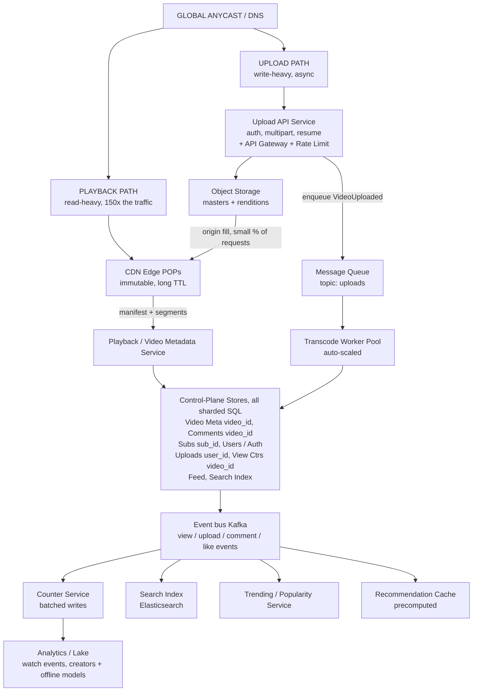
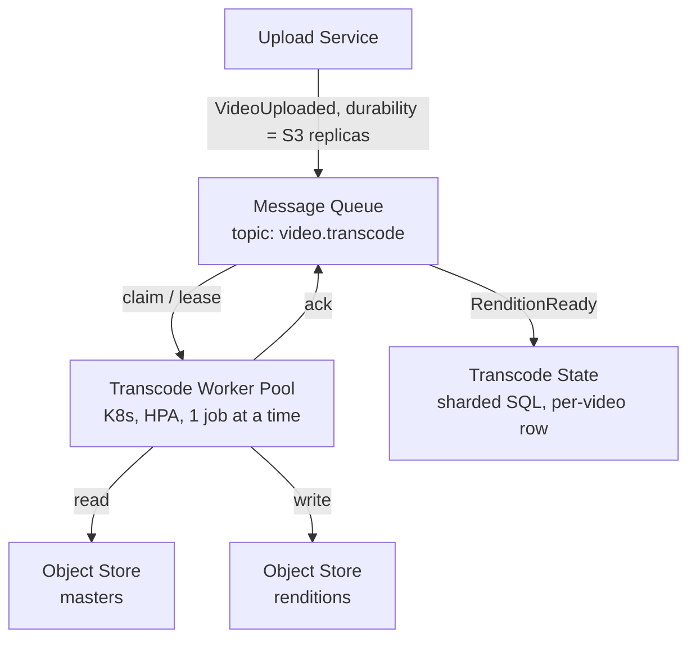
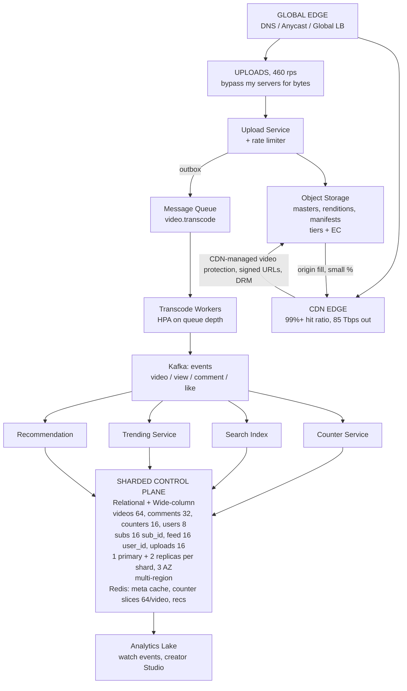

# Design YouTube — Interview Study Transcript

A full 45-minute interview, transcribed. Read it once for flow, then use the section headings to drill individual phases.

## Phase 1 — Requirements Clarification (minutes 0-8)

Interviewer: Thanks for joining. I want you to design a video-sharing platform in the style of YouTube. Before you draw anything, spend a few minutes making sure you understand what I'm asking for. What do you want to clarify?

Candidate: Thank you. Let me start with scope, because the scope drives everything else. Is live streaming in scope, or only on-demand video?

Interviewer: Only on-demand for this exercise. Live streaming would change the ingest path and the latency budget completely, and I don't want you spending your time there.

Candidate: Understood. Second question: is the system read-heavy in a way I should assume, and can I pick my own scale numbers?

Interviewer: I'll give you the top-level numbers: roughly 2 billion monthly active users, about half of them active on any given day, and peak traffic about 20 percent above the daily average. Otherwise use your judgment and say your assumptions out loud.

Candidate: Then I'll state mine explicitly. I'll use: every user uploads one video every 30 days, watches 5 videos a day, average video length 8 minutes, average delivered bitrate 2.5 megabits per second, peak concurrency 20 percent above average. I'll flag that these are assumptions and check them against the totals as I go.

Interviewer: Good. Keep doing that. Now, requirements. Talk me through the functional requirements in your own words.

Candidate: Let me group them into six capabilities.

Candidate: First, identity and channels. Users register, authenticate, and own a channel. A channel has metadata and a set of videos.

Candidate: Second, ingest. A user uploads a video file with a title, description, tags, and a visibility setting. The upload has to be resumable, because a 4 GB file over a phone connection will fail otherwise.

Candidate: Third, media processing. The uploaded master file gets transcoded into a ladder of renditions at different resolutions, packaged into both HLS and DASH, and gets thumbnails and captions. That work is asynchronous and can take minutes.

Candidate: Fourth, playback. A viewer requests a video, the client gets a manifest, and the client pulls segments over a CDN at an adaptive bitrate. Playback is the dominant load on this system by two orders of magnitude.

Candidate: Fifth, discovery. Browse, search, and recommendations. Browse is a curated or trending list. Search is keyword. Recommendations are personalized.

Candidate: Sixth, engagement. Views, likes, dislikes, comments, subscriptions, watch history, and creator-facing analytics.

Interviewer: Good decomposition. Now the non-functional side, and I want you to be opinionated.

Candidate: I'll propose explicit targets.

Candidate: Availability: playback at 99.95 percent or better. Upload can degrade to 99.9 percent, because losing an upload is annoying but losing playback is someone leaving. Metadata reads also 99.95 percent.

Candidate: Latency: playback startup under 1.5 seconds at p50 and under 3 seconds at p99, measured as time to first frame. Rebuffering ratio under 0.5 percent of watch time. Those are the numbers users actually feel.

Candidate: Time to playable: under 5 minutes at p50, under 30 minutes at p99 for the full ladder. Fast-path renditions could be live in under 60 seconds if we want a "processing" state that plays immediately.

Candidate: Consistency: the video record itself should be strongly consistent on read-after-write, because the creator is going to refresh the page. Everything else, view counts, like counts, subscriber counts, trending rank, search index freshness, can be eventual. I want to defend that split rather than pick one global model.

Candidate: Durability and RPO: metadata should survive a regional failure. I'll say RPO of one minute and RTO of fifteen minutes for full regional failover, with a read-only degraded mode in five minutes.

Candidate: Cost: this is the constraint people forget. Video egress is the dominant line item, so the design has to make the CDN do the work and keep long-tail content cheap.

Interviewer: Nice. Two more things before you estimate. Is search in scope?

Candidate: Yes.

Interviewer: And recommendations?

Candidate: Yes, personalized, but I'll keep the model deliberately simple and precomputed. I'm not designing the learning algorithm, I'm designing the serving system around it.

Interviewer: Then start estimating. DAU first, then traffic.

## Phase 2 — Scale Estimation (minutes 8-14)

Interviewer: Back-of-envelope. Go.

Candidate: Daily active users: 2 billion monthly times 50 percent, so 1 billion DAU.

Candidate: Video views per day: 1 billion users times 5 videos a day, so 5 billion video-starts per day.

Candidate: Video-starts per second on average: 5 billion divided by 86,400 seconds, which is about 57,900 per second.

Candidate: Peak, with the 20 percent factor: 57,900 times 1.2, which is roughly 69,400. So I'll design for about 70,000 view-starts per second at peak.

Candidate: Now, uploads per day: 1 billion users, one video every 30 days, so about 33.3 million uploads per day. Per second that's 33.3 million over 86,400, about 385 per second average, roughly 460 at peak.

Candidate: Note the asymmetry before I go further. Upload is 460 requests per second. Playback is 70,000. That is a ratio of roughly 150 to 1. Almost every scaling decision in this design follows from that one fact.

Interviewer: Good. Now the more interesting number. Bandwidth.

Candidate: Let me build it from watch time rather than from request counts, because bitrate varies.

Candidate: Average watch time per user per day: 5 videos times 8 minutes, so 40 minutes, which is 2,400 seconds.

Candidate: Bytes per user per day: 2,400 seconds times 2.5 megabits per second, which is 6,000 megabits, which is 750 megabytes.

Candidate: Total per day: 1 billion users times 750 megabytes, which is 750 terabytes per day. Let me call that roughly three quarters of an exabyte per day.

Candidate: That converts to about 700 million hours of video watched per day, which lines up with what public figures for a platform this size suggest, so I'm reasonably confident in the assumption set.

Candidate: Average bandwidth: 750 terabytes per day over 86,400 seconds is about 8.7 terabytes per second, which is about 69 terabits per second. At peak, 1.2 times that, so about 83 terabits per second, call it 85.

Candidate: Now the same thing expressed as concurrency, because that drives the CDN design. Total watch seconds per day: 2.4 trillion seconds. Divided by 86,400 seconds, that's about 27.8 million concurrent streams on average, and roughly 33 million at peak. Each at 2.5 megabits per second, 33 million times 2.5 megabits, which is again about 83 terabits per second. The two derivations agree, so I'll trust it.

Candidate: Let me also do it with the round-number rule. 1 billion users, each on an 8-megabit connection for 40 minutes a day: 1 billion times 8 megabits times 2,400 seconds, about 2.4 petabits per day, about 28 terabits per second. Within 3x of the careful number, which is fine for capacity planning at this scale.

Interviewer: Now storage. This is where candidates usually hand-wave.

Candidate: Video first, since it dominates. Originals: I'll assume the ingest master is roughly 5 megabits per second of 1080p-ish source, so 5 times 480 seconds is 2,400 megabits, which is 300 megabytes per original.

Candidate: Originals per day: 33.3 million times 300 megabytes is about 10 terabytes per day. So about 3.6 petabytes per year of masters.

Candidate: Derivatives. A full ladder, say 144p, 240p, 360p, 480p, 720p, 1080p, 1440p, and 2160p, sums to roughly 45 megabits per second in total. Times 480 seconds is about 2.7 gigabytes per video with the complete ladder, which is about 9x the original. That is the number that surprises people.

Candidate: Now retention policy, because storing the full ladder for all 5 years is not a serious answer. I'll tier by popularity and age. The hot 20 percent keep the full ladder, 2.7 gigabytes. The long-tail 80 percent keep three renditions, roughly 360p, 720p, and 1080p, which sums to about 8 megabits per second, so about 490 megabytes.

Candidate: Derivatives per day: 6.7 million hot times 2.7 gigabytes is about 18 terabytes, and 26.7 million tail times 0.49 gigabytes is about 13 terabytes. Total about 31 terabytes per day of derivatives, plus 10 terabytes of masters, so about 41 terabytes per day.

Candidate: Over a 5-year retention horizon: 41 terabytes times 1,825 days is about 75 petabytes logical.

Candidate: At 3x replication that is 225 petabytes physical. If I use [[erasure-coding|Erasure Coding]] on the cold tier at about 1.5x overhead instead of 3x, I roughly halve that, to maybe 120 petabytes, at the cost of a slow rebuild on failure, which is acceptable for content that gets read once a year. This is a concrete example of [[storage-tiering|Storage Tiering]].

Candidate: Rough cost check: 120,000 terabytes times 20 dollars per terabyte per month is about 2.4 million dollars a month. That is the storage bill, and it is dwarfed by egress, which I will now estimate.

Interviewer: Egress. This is the one that matters.

Candidate: Video egress per day is 750 terabytes, if all of it were served from origin. At roughly 0.05 dollars per gigabyte egress, 750,000 gigabytes times 0.05 is about 37,000 dollars a day, which is over a million a month.

Candidate: That is the number that justifies the entire CDN. If a CDN cache hit ratio is 95 percent, origin egress drops 20x, to about 37 terabytes per day and about 1,900 dollars a day. If it is 99 percent, which is realistic for video because content is immutable and access is bursty and re-fetches of the same segment cluster in time, we get down to 7.5 terabytes a day.

Candidate: So the design decision that moves the most money in this whole system is: video segments are immutable, and the CDN should hold them near the viewer. That is [[cdn|CDN]] earning its place, not as a latency trick but as a cost and origin-resilience strategy.

Interviewer: Metadata storage.

Candidate: Video metadata: about 2 kilobytes per video for title, description, tags, references to the rendition set, and the denormalized counters. Over 5 years, 33.3 million times 1,825 is about 60.8 billion videos, times 2 kilobytes is about 122 terabytes. That is a sharded relational store, not one machine.

Candidate: Users: 2 billion times about 1 kilobyte is 2 terabytes. Trivial next to video.

Candidate: Comments: if 1 percent of views produce a comment, that's 50 million comments a day. At 300 bytes each, 15 gigabytes a day, about 5.5 terabytes over 5 years. Sharded by video_id so that "top comments for this video" is a single-shard query.

Candidate: Subscriptions: this is the sneaky one. 2 billion users averaging 500 subscriptions each is 1 trillion edges. At 50 bytes each, 50 terabytes. Sharded by subscriber_id, because every subscription lookup must be fast for a single user, and a user is a single natural key.

Candidate: Watch events: 5 billion a day at about 100 bytes is 500 gigabytes a day, about 1.8 petabytes a year. This is not OLTP data and I am not putting it in the metadata database. It goes to a stream and lands in a [[data-warehouse-lake|Data Warehouse / Lake]] for analytics.

Candidate: And view counts, deliberately. I am not storing 5 billion rows. I am storing aggregates, which I will design in the database section.

Interviewer: Your numbers are internally consistent. Let's design.

## Phase 3 — High-Level Architecture (minutes 14-22)

Interviewer: Draw the system. And I want you to make the upload path and the playback path visibly different, because they are.

Candidate: Here is the whole system.



Candidate: Let me name the split, because it is the single most important structural idea here. The data plane is the bytes: upload to object storage, playback from CDN. The control plane is the metadata: what exists, who owns it, what it counts, how it ranks. The data plane is a handful of extremely well-understood, mostly-horizontal components. The control plane is where all the sharding, caching, and consistency reasoning lives.

Candidate: And the single most important consequence: the 85 terabits per second of video never touches my application servers. It goes object storage to CDN to client. My application servers handle roughly 70,000 requests per second of small JSON, not 85 terabits per second of video. If I design this correctly, the hard part of the problem is the metadata, not the video.

Interviewer: That's a good framing. Walk me through the two flows.

Candidate: The upload flow.

Candidate: Step 1, the client calls the upload service and asks for a session. The service authenticates, checks the channel's quota and the account's rate limit, and returns a session with an upload id.

Candidate: Step 2, the upload service creates a resumable, multipart upload in object storage and returns pre-signed part URLs. The client uploads directly to object storage, bypassing my servers entirely. This is the single most important scaling decision on the write path, because it means my servers handle 460 requests per second while the actual bytes bypass them. See [[chunking-and-uploads|Chunking and Uploads]].

Candidate: Step 3, the client reports each part completion to the upload service, which tracks progress. The client can also resume by asking which parts exist.

Candidate: Step 4, the client calls complete. The service verifies that all parts are present and the total size and duration are plausible, then flips the video row to PROCESSING. Note the idempotency requirement: if the client retries complete, we must not create two videos. The upload id is the idempotency key.

Candidate: Step 5, the service publishes a VideoUploaded event to the message queue, using the outbox pattern so that the database write and the event publish cannot diverge. See [[outbox-pattern|Outbox Pattern]] and [[idempotency|Idempotency]].

Candidate: Step 6, transcode workers consume the event. Each worker claims a rendition job, downloads the master from object storage, transcodes, and writes the result back to a renditions prefix, then emits a RenditionReady event.

Candidate: Step 7, a small set of fast renditions, 360p and 720p, are prioritized so we can publish the video in under 60 seconds. The rest follow. The video moves to READY when the minimum set is done, and the rest fill in asynchronously.

Candidate: Step 8, on READY, the video row's rendition set is written, and a VideoReady event fans out to the search indexer, the trending service, the recommendation precomputation job, and the notification service. The CDN cache is warmed for the manifest and the first segment of the top rendition.

Candidate: The playback flow.

Candidate: Step 1, the client asks the playback service for video info by id, or by slug. The service reads from cache.

Candidate: Step 2, on a miss, the service reads the video row from a read replica of the metadata store. The row contains the CDN manifest URL, the thumbnail URL, view count, and engagement counts.

Candidate: Step 3, the service returns a playback descriptor, including the manifest URL for both HLS and DASH so the client picks.

Candidate: Step 4, the client fetches the manifest. The manifest is small, a few kilobytes, and we serve it from the CDN edge with a short TTL. It lists the variant streams and their segment URLs.

Candidate: Step 5, the client requests segments. Each segment is 2 to 6 seconds of video. With a 2-second segment, an 8-minute video is 240 segments. Segment requests are the highest request count in the system, but almost all of them terminate at the CDN edge.

Candidate: Step 6, the client measures throughput and steps up or down the bitrate ladder. This is the adaptive bitrate logic, and it is client-side, which is why my servers are not in the segment path.

Candidate: Step 7, once per 10 seconds or so the client sends a heartbeat to the view-counting service so that the session is not lost, which lets me count a view only after meaningful watch time. That is a real product requirement: YouTube counts a view around 30 seconds, not on play.

Interviewer: API design. Write the contracts.

Candidate: Happy path REST for most things, and I would use gRPC internally for the hot metadata path because the payloads are small and the caller is a known client. See [[rpc-grpc-graphql|gRPC]].

Candidate: Upload.

```
POST /v1/uploads
Authorization: Bearer <token>
Idempotency-Key: <client-generated uuid>

{
  "filename": "beach-dive-4k.mov",
  "contentType": "video/quicktime",
  "contentLength": 4294967296,
  "title": "Beach dive in 4K",
  "description": "Shot on ...",
  "tags": ["scuba", "4k", "underwater"],
  "visibility": "public",
  "channelId": "ch_8812"
}

201 Created
Location: /v1/uploads/up_7f3a91
{
  "uploadId": "up_7f3a91",
  "partSizeBytes": 67108864,
  "partCount": 64,
  "partUrls": [
    { "partNumber": 1, "url": "https://storage...?...&partNumber=1&signature=..." },
    { "partNumber": 2, "url": "https://storage...?...&partNumber=2&signature=..." }
  ]
}
```

Candidate: Part size is 64 megabytes, which gives 64 parts for a 4 GB file. Large enough that per-part overhead is negligible, small enough that a failed part re-uploads quickly on a bad connection.

Candidate: Resuming an interrupted upload.

```
GET /v1/uploads/up_7f3a91
200 OK
{
  "uploadId": "up_7f3a91",
  "status": "IN_PROGRESS",
  "completedParts": [1,2,3,4,5,6,7,8,9,10,11,12,13,14,15,16,17,18,19,20,21,22,23,24,25,26,27,28,29,30],
  "nextExpectedPart": 31
}
```

Candidate: Note that the client never has to ask for new URLs on resume. Expiry is hours, and the URLs are scoped to a single object key, so they are not a broad security exposure.

Candidate: Completing.

```
POST /v1/uploads/up_7f3a91/complete
{ "parts": [ {"partNumber":1,"etag":"..."}, ... ], "durationMs": 481000 }

200 OK
{ "videoId": "vid_9c1e44", "status": "PROCESSING", "etaSeconds": 240 }
```

Candidate: Playback metadata.

```
GET /v1/videos/vid_9c1e44/playback
200 OK
Cache-Control: public, max-age=30, stale-while-revalidate=300
{
  "videoId": "vid_9c1e44",
  "title": "Beach dive in 4K",
  "channel": { "id": "ch_8812", "name": "Dee", "verified": true },
  "durationMs": 481000,
  "status": "READY",
  "streams": {
    "hls": "https://cdn.../vid_9c1e44/hls/master.m3u8",
    "dash": "https://cdn.../vid_9c1e44/dash/manifest.mpd"
  },
  "variants": [
    { "name": "1080p", "bitrateKbps": 5000, "width": 1920, "height": 1080, "codec": "avc1.640028" },
    { "name": "480p",  "bitrateKbps": 1200, "width": 854,  "height": 480,  "codec": "avc1.4d401e" }
  ],
  "engagement": { "viewCount": 1283941, "likeCount": 84310, "publishedAt": "2026-03-04T11:20:00Z" },
  "tracking": { "viewSessionId": "vs_5512", "heartbeatUrl": "/v1/views/vs_5512/heartbeat" }
}
```

Candidate: The `stale-while-revalidate` is the important header here. If the edge has a stale copy and a fresh one is being fetched, the edge serves the stale copy immediately instead of blocking. For an immutable asset like a manifest, staleness of 5 minutes is harmless.

Candidate: Heartbeat and view counting.

```
POST /v1/views/vs_5512/heartbeat
{ "positionMs": 60000, "paused": false, "buffering": false }
204 No Content
```

Candidate: And view submission, which is the deduplication-sensitive one.

```
POST /v1/videos/vid_9c1e44/views
Idempotency-Key: vs_5512
{ "watchTimeMs": 460000 }
202 Accepted
```

Candidate: Returning 202, not 200, because the count is applied asynchronously. The user does not need the new count.

Candidate: Search, engagement, and feed.

```
GET /v1/search?q=scuba+dive+4k&cursor=eyJrIjo0fQ&limit=20
GET /v1/videos/vid_9c1e44/comments?sort=top&cursor=...
POST /v1/videos/vid_9c1e44/likes        Idempotency-Key: <ts>
POST /v1/subscriptions                { "channelId": "ch_8812" }
GET  /v1/feed?cursor=...&limit=50
GET  /v1/analytics/videos/vid_9c1e44?range=28d     (creator only)
```

Candidate: Error model is a consistent envelope: a machine-readable code, a human message, a request id, and a retryable flag. The retryable flag is what lets the client decide between backing off and showing an error. See [[error-handling|Error Handling]] and [[api-design-principles|API Design Principles]].

## Phase 4 — Deep Dive (minutes 22-40)

Interviewer: Let's go deep. Start with transcoding, since you flagged it as the core of the upload path.

Candidate: The design principle is that transcoding is slow, bursty, CPU-heavy, and embarrassingly parallel, so it must never run inside a request path.

Candidate: Architecture in detail.



Candidate: Why a queue and not an HTTP callback: the queue is durable, so if every worker dies the jobs are still there. A callback to a dead worker loses work. Why a queue and not synchronous: a 1080p-to-8-rendition transcode takes 20 to 60 CPU-minutes. You cannot do that in an HTTP request.

Candidate: Job shape. One job per rendition, or one job per video that does all renditions? I would do one job per video with an internal loop over the ladder, for two reasons: fewer queue round-trips, and the worker can reuse the decoded frames across renditions instead of decoding the source eight times, which is a large CPU saving. Fine-grained rendition jobs are better when you want independent retry and priority, so I would actually do a hybrid: one parent job that fans into per-rendition jobs, with the two fast renditions at high priority.

Candidate: Priority and queues. Separate high and low priority queues, with workers autoscaling independently on each. A user who just uploaded their video should not sit behind a backfill of the entire catalog. Study separately: [[consumer-lag|Consumer Lag]] as the autoscaling signal, and [[backpressure|Backpressure]] for when the queue grows unboundedly.

Candidate: Autoscaling on queue depth, not CPU. That is the key operational insight. A worker pool that scales on CPU will not scale when workers are blocked on network I/O to object storage, which is exactly when you need them.

Candidate: Failure handling. Workers are stateless and disposable, hold a lease on the job, and heartbeat it. If the lease expires, the job returns to the queue. All writes are idempotent, since a worker might finish and die before acking. Output keys are deterministic, `renditions/<videoId>/<profile>.ts`, so a retry overwrites rather than duplicating. See [[idempotent-consumer|Idempotent Consumer]] and [[delivery-and-retry|Delivery and Retry]].

Candidate: Deduplication of work. If a worker dies at 90 percent, the retry redoes the whole thing. For expensive renders I would checkpoint intermediate renditions, so the retry only redoes the last one or two.

Candidate: Layering. Codecs, and why renditions differ by source: a 4K source produces a 4K rendition; a 480p phone video should not be stretched to 4K. Decide the ladder from the source's resolution and detected content characteristics, not from a fixed template. AV1 for modern, H.264 for compatibility, H.265 where supported. Study separately: [[compression|Compression]] for codec choice, and [[immutable-storage|Immutable Storage]] for why the output objects are safe to cache forever.

Candidate: Packaging. HLS and DASH manifests reference segments. We store segments as immutable objects behind the CDN, and manifests as small text objects. Since the manifest references many segment URLs, the manifest has to be regenerated whenever a rendition is added, so I generate one manifest per profile, plus an umbrella manifest, and the umbrella is what the client fetches.

Candidate: What the interview is really testing here: recognizing that transcoding is a [[asynchronous-processing|Asynchronous Processing]] problem, that it needs a durable queue, that it needs autoscaling on the right signal, and that its output is immutable bytes that a CDN can cache forever.

Interviewer: Metadata store. Give me the schema.

Candidate: Here is the core metadata, sharded by video_id.

```
CREATE TABLE videos (
  video_id          BIGINT       NOT NULL,   -- distributed ID, snowflake-style
  channel_id        BIGINT       NOT NULL,
  title             VARCHAR(200) NOT NULL,
  description       TEXT,
  tags              VARCHAR(2000),
  visibility        ENUM('public','private','unlisted') NOT NULL DEFAULT 'public',
  status            ENUM('UPLOADED','PROCESSING','READY','FAILED','PRIVATE') NOT NULL,
  duration_ms       INT          NOT NULL DEFAULT 0,
  master_key        VARCHAR(512) NOT NULL,   -- object storage key of the source
  rendition_set_ver INT          NOT NULL DEFAULT 0,  -- bumps when a rendition lands
  thumb_key         VARCHAR(512),
  captions_key      VARCHAR(512),
  published_at      TIMESTAMP    NULL,
  created_at        TIMESTAMP    NOT NULL,
  view_count        BIGINT       NOT NULL DEFAULT 0,   -- denormalized, approximate
  like_count        BIGINT       NOT NULL DEFAULT 0,   -- denormalized, approximate
  comment_count     BIGINT       NOT NULL DEFAULT 0,   -- denormalized, approximate
  PRIMARY KEY (video_id),
  KEY idx_channel (channel_id, published_at DESC),
  KEY idx_status_published (status, published_at DESC)
) PARTITION BY HASH(video_id) INTO 64 PARTITIONS;
```

Candidate: Two decisions to defend. First, the denormalized counts on the video row. They are write-hot, which is why they are updated asynchronously and never read from this table on the hot path. Second, the two indexes. The channel index serves "my channel's videos, newest first" and the status-plus-published index serves browse and trending. Neither is on the hot playback path, so neither is a problem.

Candidate: The counters. This is the design point I want to spend time on, because people either store 5 billion view rows or they lose data.

```
CREATE TABLE view_counters (
  video_id      BIGINT   NOT NULL,
  bucket_minute DATETIME NOT NULL,   -- 1-minute bucket
  views         BIGINT   NOT NULL DEFAULT 0,
  watch_time_ms BIGINT   NOT NULL DEFAULT 0,
  uniq_viewers  BIGINT   NOT NULL DEFAULT 0,  -- HLL sketch, approx
  PRIMARY KEY (video_id, bucket_minute)
) PARTITION BY RANGE (bucket_minute);
```

Candidate: And the materialized total, refreshed periodically, so reads never sum a long range.

```
CREATE TABLE video_counters_current (
  video_id        BIGINT PRIMARY KEY,
  views           BIGINT NOT NULL,
  watch_time_ms   BIGINT NOT NULL,
  uniq_viewers    BIGINT NOT NULL,
  last_flushed_at TIMESTAMP NOT NULL
);
```

Candidate: Now the write path for views. This is where a candidate usually goes wrong.

Candidate: Naive design: 70,000 view requests per second all hit the database. That is 6 billion writes per day against a sharded database. That is not viable and it is also stupid, because the information content of a single view is one bit.

Candidate: My design, in three tiers.

```mermaid
flowchart TD
    V70[70K views/s]
    RED[Redis in-memory<br/>INCR by 1<br/>shard key vc:{videoId}<br/>~100K keys in hot window, a few GB]
    CTR[Counter Service<br/>6,000 writes/s, merges shards]
    SQL[Sharded SQL<br/>durable, exact per minute]
    CUR[view_counters_current<br/>denormalized, serves the read path]

    V70 --> RED
    RED -->|every 10s, batched| CTR
    CTR -->|upsert 1-min buckets| SQL
    SQL -->|every 60s, or on threshold| CUR
```

Side channel: every view event also -> Kafka -> Analytics Lake

Candidate: The 10-second batch is the key number. It divides 70,000 writes per second by 10, giving 7,000 batched upserts, and it caps the data loss window at 10 seconds on a hard crash. I consider 10 seconds of lost view counts completely acceptable for a number that is displayed as "1.2 billion views" anyway. If a crash loses 700,000 views, nobody notices and no user is harmed.

Candidate: For unique viewers I do not want a distinct count over 70,000 per second. I use a HyperLogLog per minute bucket and merge them, because merging sketches is cheap and exact distinct is not. Study separately: [[probabilistic-data-structures|Probabilistic Data Structures]], specifically Count-Min Sketch for engagement and HyperLogLog for uniques.

Candidate: Hot key handling is worth pre-empting here, because a viral video breaks the design. A video going viral might get 5 million concurrent viewers, which is 5 million increments per second on one key, and a single Redis key is a single-threaded hot spot. I would not shard the counter by video_id alone. I shard it by `video_id` plus a hash of the viewer id, say 64 slices, so 5 million per second becomes about 78,000 per second per slice, and a script-driven kid cannot make one slice hot because the slices are chosen by viewer, not by time. Then the counter service merges the 64 slices on read of the flush. See [[hotspot-handling|Hotspot Handling]] and [[sharding|Sharding]].

Interviewer: Playback read path. Now the caching.

Candidate: Three cache layers, and they have different jobs.

Candidate: Layer 1, the CDN edge. This is the only layer that carries video bytes. Video is immutable, so cache TTL is effectively infinite, one year, with a short negative TTL on the manifest so a deleted video dies reasonably fast. This is where 85 terabits per second goes.

Candidate: Layer 2, an in-process LRU in the playback service, sized to maybe 5 percent of a 32 GB box, so 1.6 GB, holding hot video rows. This absorbs the tail of the viral spike with zero network hops.

Candidate: Layer 3, Redis in front of the metadata store, keyed `video:meta:{videoId}`, TTL around 60 seconds with jitter, for the long tail and for absorbing the read-replica traffic.

Candidate: What I do not cache, and this matters: I do not cache the personalized recommendation feed in a shared cache with a user-specific key, because that would be a cache entry per user and the hit rate on a fresh feed is near zero anyway. Feed is a read-through with a short TTL.

Candidate: Invalidation. Video metadata changes when a rendition lands and when a counter flush happens. I will not invalidate on counter flush. The counters are already eventual, and invalidating 70,000 keys per second is self-inflicted denial of service. The rendition-ready event does invalidate, and only for the videos that actually changed, which is 33 million a day, or 385 per second. The cache TTL catches everything else within 60 seconds.

Candidate: The property I want is: metadata reads are available and fast even if the metadata database is entirely down, for up to 60 seconds plus however long the cached data lives. That means a total database outage degrades the product to a slightly staler version of itself rather than an outage. See [[caching|Caching]], [[redis|Redis]], and [[cache-warming|Cache Warming]].

Interviewer: Let's talk about the database layer properly. Sharding, replication, and how the hot reads actually get served.

Candidate: Sharding strategy, and I will justify it per data type rather than applying one rule everywhere.

```
  Data              Shard key        Why
  ----------------  ---------------  ---------------------------------------------
  videos            video_id (H/M64)  Playback is by id; no cross-shard joins on hot path
  comments          video_id (H/M32)  "top comments for video" is one shard
  view_counters     video_id (H/M16)  Per-minute buckets for a video stay together
  users/auth        user_id (H/M8)    Auth is always by user
  uploads           user_id (H/M16)   "my uploads" is one shard
  subscriptions      subscriber_id    Fan-out reads one user's edges only
  feed              user_id (H/M16)   Feed is always read by owner
  search index      n/a (separate)    Own store, own sharding
```

Candidate: For videos, the shard key is video_id because the hot read path is "give me this video". If I sharded by channel_id, every playback would need to know the channel first, and worse, a channel with millions of videos becomes a hot shard. video_id also gives uniform distribution, so a viral video is a hot key within one shard, which I handle with the 64 counter slices and the edge cache rather than by choosing a worse key.

Candidate: Comments are the interesting case. The two access patterns conflict. Top comments for a video is read-heavy and is the main one, so shard by video_id. But "all comments by user X" is needed for a user's comment history, and that becomes a scatter-gather across all 32 shards. I accept the scatter-gather, because it is a rare, low-QPS, personal-history query, and I would give it its own secondary index built asynchronously from the comment event stream, so it never touches the primary shards. That is the honest answer: one key, one fast path, one deliberately-slow path with a cheaper backup index. See [[shard-key|Shard Key]] and [[cross-shard-queries|Cross-Shard Queries]].

Candidate: Shard count. Metadata at 70,000 reads per second peak. I size a shard cluster for 3,000 queries per second, so 70,000 over 3,000 is 24, so 32 shards is the minimum and 64 gives 2x headroom for growth and for a rebalancing slot. Comments at 14,000 writes per second, 32 shards is about 440 writes per second each, comfortable. Study separately: [[shard-rebalancing|Shard Rebalancing]] and [[data-migration|Data Migration]] for how you actually move a shard without downtime.

Candidate: Replication. Each shard cluster is one primary plus two synchronous or semi-synchronous replicas, across three availability zones. Reads go to replicas with a 1 to 2 second typical lag.

Candidate: A read-your-writes problem and its honest fix. After a creator finishes an upload and hits refresh, they will see a stale row if the read went to a replica that had not yet caught up, and that row would say PROCESSING or, worse, not exist. I do not solve this with global strong consistency, which would be far too expensive. I solve it three ways: the upload-complete response includes the video record inline so the client renders from the response and not from a follow-up read; the client carries a short-lived read-your-writes token that routes reads to the primary for 30 seconds after a write; and the creator dashboard can tolerate and display a processing state. This is the pragmatic 95 percent solution, and I would name the remaining 5 percent explicitly. See [[replication-lag|Replication Lag]] and [[strong-vs-eventual-consistency|Strong vs Eventual Consistency]].

Candidate: Availability model per data path, explicitly. Playback metadata: strongly consistent read-after-write not required for viewers, eventual is fine, 99.95 percent. Creator's own dashboard: read-your-writes token, 99.95 percent. Comments: strong, because a user who posts a comment and does not see it will post again. Likes: idempotent and eventual. View counts: eventual and approximate. Upload create: strongly consistent, because duplicating a video is a data loss bug, not a cosmetic issue. Naming consistency per operation instead of per system is the point.

Interviewer: Search. Don't just say Elasticsearch.

Candidate: Search has three parts and I will treat them differently.

Candidate: Ingestion is event-driven. The VideoReady event goes to a Kafka topic, a consumer reads it, extracts title, description, tags, channel name, and a few engagement signals, and writes a document to [[elasticsearch|Elasticsearch]] using an external versioning scheme where the document version is derived from the video's rendition_set_ver plus a monotonically increasing edit counter. External versioning means an out-of-order or retried index operation cannot resurrect a stale document, which is the bug I have seen most often in these systems. See [[kafka-architecture|Kafka]] and [[search-engine|Search Engine]].

Candidate: Querying. The search service takes the query, runs a multi_match across title, tags, and description with field boosts so a title match outranks a description match, applies filters such as duration bucket and upload date, and returns video ids. Then comes the problem: I have ids, not rows. I need title, thumbnail, channel, and view count for the results page.

Candidate: Option A is to denormalize everything into the search document and accept stale data. Option B is to do a multi-get against the metadata store for the top 20 ids. Option C is to have a separate index that is the sole source for the results page and is refreshed by the indexer. I pick a version of A: the search document carries title, thumbnail URL, channel name, and an approximate view count, and the indexer updates the approximate view count on a coarse schedule, say every 15 minutes for videos appearing in trending. Result pages tolerate a view count that is 15 minutes old; nobody can tell, and it removes 20 point lookups from the search critical path, which is where tail latency is won. See [[tail-latency|Tail Latency]].

Candidate: Latency budget for search: under 200 milliseconds at p95. I get that from an in-memory result cache for the top few thousand queries, since search traffic is extremely skewed toward a small set of head queries, plus a query cache for filter-only pages. Miss goes to Elasticsearch with a 150 millisecond timeout, and on timeout I degrade to trending rather than error.

Candidate: If asked for suggestions and autocomplete, that is a separate service, and study separately: [[autocomplete|Autocomplete]].

Interviewer: Recommendations.

Candidate: Explicitly precomputed, and I will explain why rather than hand-wave.

Candidate: Recommendation serving at 70,000 view-starts per second with a 100 millisecond budget cannot be a real-time model inference over the user's full history. The offline/online split is the standard answer.

Candidate: Offline, on a schedule, a job produces two things. Inverted indexes that map content attributes such as topics, language, and embedding vectors to candidate video ids, and a per-user profile of topics and vectors. The job reads the watch event stream and the metadata lake. It runs on something like a scheduled Spark or Kafka Streams job writing to a key-value store.

Candidate: Online, a lightweight candidate generator takes the user's profile vector, retrieves the top 500 candidates from the inverted index, and a small ranker scores those 500 with a cheap model. The 500-candidate limit is what keeps online latency at 10 to 20 milliseconds.

Candidate: Storage and fan-out. Each user gets a precomputed top-200 list. 2 billion users times 200 times 8 bytes for a video id is 3.2 terabytes. That is small, so it goes in Redis with a TTL of a few hours, giving a hit rate near 100 percent on active users. This is a great outcome: because the list is precomputed, the whole recommendation service is a cache read plus a ranker, so it is fast, cheap, and degrades gracefully to trending when the cache misses.

Candidate: Freshness, honestly: the list is up to 6 hours stale. The fix is a realtime delta, small, a slice of the last few hours of activity per user computed on a stream, merged with the precomputed base. And for brand-new uploads specifically, they go straight into a small "fresh content" pool that is filtered by an abuse and copyright check first, because a recommendation system is a spam amplifier if you do not. Study separately: [[search-ranking|Search Ranking]] and [[data-warehouse-lake|Data Warehouse / Lake]].

Interviewer: The feed. Subscriptions and the home feed.

Candidate: This is the classic fan-out choice, and the answer is hybrid.

Candidate: Fan-out-on-write: when a channel publishes, write the video id into every subscriber's feed. Great read latency, terrible write cost. With 2 billion users and creators having millions of subscribers, one upload is millions of writes. Not viable at the head.

Candidate: Fan-out-on-read: store subscriptions, and materialize the feed at read time by merging the most recent videos from the 500 most-recently-active subscriptions. Cheap writes, expensive reads, and 500 point lookups is a tail-latency problem. See [[fanout-and-aggregation|Fan-Out and Aggregation]].

Candidate: Hybrid, which is what actually ships. For channels below a threshold, say 10,000 subscribers, fan out on read. At or above, fan out on write into a precomputed feed shard. Reads check the precomputed list and, if it is stale or missing, fall back to the on-read path. The threshold is tuned so that the number of write-fanned channels times their subscriber count stays within a write budget.

Candidate: The cap that makes it correct: a channel above 100,000 subscribers stops appearing in the subscription feed entirely and goes to a "Popular on this channel" surface. This is a real product decision, not just an engineering one, and it bounds the worst case. Mentioning it is the difference between a designer and a reader.

Interviewer: Let me push you. What happens when traffic doubles overnight?

Candidate: Doubling means 140,000 view-starts per second and 170 terabits per second of egress. Let me work outward from the things that break first, because they are not the same as the things I drew.

Candidate: First, the CDN. This is mostly fine. Doubling playback is exactly what a CDN is for, and 85 to 170 terabits per second is within global CDN capacity. The constraint becomes per-region egress contracts and cost, which I would manage by tightening the negative and manifest TTLs, and by checking whether the origin fill ratio crept up, because if it did, cache hit fell and cost scales badly.

Candidate: Second, the playback metadata service. 140,000 requests per second. My stateless service scales horizontally behind [[load-balancing|Load Balancing]], so that is an autoscaling problem, not an architecture problem. The thing that does not scale linearly is the metadata database read path. At 140,000 reads per second, 64 shards is about 2,200 reads per second per shard, over my 3,000 target. So the answer is: I was over-provisioned at 64 for 70,000, and at 140,000 I go to 128 shards by splitting each shard in half. That is a [[sharding|Sharding]] scale-out and it needs rebalancing, which is why the read-path data model is keyed by video_id and nothing else.

Candidate: Third, and this is the one that surprises people: the video database write path. Counters were 7,000 batched upserts per second, they are now 14,000. Comments were 14,000 writes per second, now 28,000, and 32 comment shards becomes 64. Uploads go from 460 to 920 requests per second, which is trivial.

Candidate: Fourth, Redis for view counters. That is 140,000 increments per second across the keyspace, and with 64 slices per video for hot videos it holds. But I would be watching p99 latency on Redis, because it is the shared component with the least headroom.

Candidate: Fifth, the transcoding pool. Traffic doubling does not double uploads, since uploads are 385 a second and are driven by creators, not by viewers. But it might indirectly, if creators post more. And the real risk is that at 170 terabits per second the transcoders, which are the most expensive compute in the system, must still keep up. I scale on queue depth, so this self-corrects, but scaling a transcoding pool takes 3 to 5 minutes to be useful, so I need that headroom pre-built.

Candidate: What I do not do: I do not shard by time or add more machines to the same primary hoping it works. And I would not add a second CDN, because the CDN was never the bottleneck.

Interviewer: Good. Now the hard one. The primary database for videos dies. Walk me through it.

Candidate: First, blast radius. The playback read path serves most reads from cache, so a metadata primary failure does not immediately break playback. With a 60 second cache TTL and in-process LRU in front, existing cached videos keep playing. New videos and cold videos start failing. So this is a partial outage, and the user impact is "videos I have never watched do not load", which is bad but not total.

Candidate: Detection. My database replicas and the load balancer's health checks detect a failed primary. Failing over on a health check alone is unsafe, because a network partition can leave the old primary accepting writes while a new one is promoted, which is [[split-brain|Split Brain]]. I use a consensus-based promotion through the shard coordinator, or an external orchestrator with a fencing token, so exactly one primary is writable.

Candidate: Failover action. Promote the most up-to-date replica to primary, fence the old one, and route writes. With semi-synchronous replication, the replica is guaranteed to have the last acknowledged commit, so we may lose nothing or lose only the last few hundred milliseconds of writes.

Candidate: Read path after failover. Reads go to the new primary, then the new replica. Cache is still valid because the underlying data did not change. This is a nice property: cache correctness does not depend on which node is primary.

Candidate: The actual design fix, which is the one that gets credit. The reason a metadata primary failure hurts is that metadata is the only path to cold videos. I mitigate structurally: I keep a second-region read replica of the metadata store, replicated asynchronously, serving reads for the top videos and the browse surface. In a full primary failure, the system does not go dark; it goes to a slightly stale, read-mostly mode for as long as the failover takes. And a cache-warming process on standby means a cold region failure is measured in tens of seconds, not minutes.

Candidate: RTO and RPO stated out loud: RPO of a few hundred milliseconds within a region with semi-sync, RTO under 60 seconds for a shard-level failover, and for a full regional failure, RPO of about a minute and RTO of about 15 minutes, with a read-only degraded mode in the first 5. Study separately: [[failover|Failover]] and [[rpo-rto|RPO and RTO]].

Candidate: And the honest admission: writes during a region-level failover stop. Uploads queue client-side and retry, comments retry with the idempotency key, view counts are already buffered in Redis, so nothing is lost except a small number of view increments, which is the cheapest thing in the system to lose. I chose the design so that the lossy thing is the least valuable thing. That is the point of the design, not a consolation.

Interviewer: Single hot key. One video gets 5 million concurrent viewers. Walk me through it.

Candidate: Let me be precise about which things break, because the answer is "not the ones you expect".

Candidate: The CDN does not break. That is the point of the CDN. 5 million concurrent streams to one object is a normal CDN day, and video segments are immutable so the hit ratio stays high. I might see an origin spike on the initial fill, which I mitigate with a cache-warm call on the manifest and first segment at publish time, and with pre-warming for events I know about.

Candidate: The Redis view counter breaks. One key, 5 million increments per second, and a single-threaded shard means a hot key is a single-threaded problem. Fix is the 64 slices by viewer hash I described earlier, which turns 5 million per second into 78,000 per second spread across 64 keys, and I shard the counter service itself by video_id so different videos land on different counter instances.

Candidate: The metadata row is a read hot spot but not a write hot spot, because reads are served from cache and writes are async. The problem is a cache stampede on expiry. 5 million concurrent viewers all arrive at the same moment because the video went viral, all miss a key that expires, and all 5 million hit the database at once, and the 64 shards each see a 78,000 queries per second spike. The DB falls over. See [[caching|Caching]].

Candidate: The stampede fix, and I do all four of these.

```
 1. TTL JITTER
    60s + random(0..30s)   so 5M readers don't expire simultaneously

 2. STALE-WHILE-REVALIDATE (CDN + Redis client side)
    serve the stale value instantly, refresh in the background

 3. PROBABILISTIC EARLY EXPIRATION (XFetch)
    recompute TTL as: delta * log(random) * 2
    only the first unlucky reader refreshes; the rest get fresh-enough data

 4. REQUEST COALESCING / SINGLE-FLIGHT
    5M requests, 1 database query, 4,999,999 wait on the same future
```

Candidate: Layer 4 is the one that actually guarantees it. Single-flight on the cache-miss path: one goroutine takes the lock and loads, all other waiters block on a channel or future and get the same result. Combined with a 500 millisecond timeout on the wait so a failed load degrades to a stale value rather than a hung request.

Candidate: The other hot-spot risk is the transcoding queue, and it is not a hot key, it is a priority problem. A viral video's renditions are the most-requested thing in the catalog while they are being produced. I handle that with the fast-path ladder, 360p and 720p in under 60 seconds, so the video is playable before the full ladder exists.

Candidate: And one more: the search and trending services will try to recompute rank for the same video repeatedly. Trending is a periodic job, not a per-request computation, so it is a background recompute, not a hot path.

Interviewer: Why not [alternative]? Walk me through why you rejected some obvious choices.

Candidate: Why not skip the CDN and serve from object storage directly, scaling out the origin?

Candidate: Two reasons, and the second one is the real one. First, cost: 750 terabytes a day at 0.05 dollars per gigabyte egress is over a million dollars a month, versus about two thousand dollars a month with a 99 percent hit ratio. That is a 500x difference. Second, and this is the one people miss: a viral video is a 5-million-concurrent-request event on a single object. Object storage is not designed for that even if the bandwidth exists. The CDN turns a viral video from an outage into a non-event. Study separately: [[global-load-balancing|Global Load Balancing]] and [[edge-computing|Edge Computing]].

Candidate: Why not use gRPC everywhere, including from the client?

Candidate: Because the client is a browser, a TV, and a phone, and gRPC-web still has maturity and debugging problems, plus the byte volume is small. gRPC internally, where the caller is a controlled client and latency matters per hop, is a clear win. And it is not an either-or: REST at the public edge, gRPC between services. See [[rpc-grpc-graphql|gRPC]].

Candidate: Why not a NoSQL store, like Cassandra or DynamoDB, for video metadata, since the access pattern is key-value anyway?

Candidate: This one I thought about seriously, and I would actually defend NoSQL for some of these tables. For the video table, the argument for relational is that the channel listing query with `ORDER BY published_at DESC` is a real access pattern, and joins to comments-count and subscription-count are convenient, and I want secondary indexes with consistent behavior. The argument for NoSQL is unbounded horizontal write scaling and no schema migrations. My honest answer: the video metadata table is a good fit for a relational store at 64 to 128 shards, and the counters, subscriptions, and watch events are better fits for wide-column or key-value, and I would not fight the interview by pretending one database fits all eight tables. I would present a polyglot persistence story and defend each choice per table. See [[sql-vs-nosql|SQL vs NoSQL]] and [[normalization-vs-denormalization|Normalization vs Denormalization]].

Candidate: Why not serverless functions for transcoding?

Candidate: Because a 40 CPU-minute transcode is the opposite of what functions are good at. Cold starts, and more importantly, per-invocation billing on a workload that runs continuously in bursts is expensive. Containers on Kubernetes or an equivalent with autoscaling on queue depth is cheaper and gives me control over the codec libraries and the GPU pool. I would use serverless for the event-driven glue, the webhook fan-out, and the thumbnail generation, not for the heavy render. See [[serverless-at-scale|Serverless at Scale]] and [[autoscaling|Autoscaling]].

Candidate: Why not pre-warm the CDN for every rendition, like some providers do, instead of filling on demand?

Candidate: Because with 33 million uploads a day, pre-warming every rendition is 33 million times 8 warm calls, which is 265 million edge-fill operations a day, and it pays the origin egress cost for content that may never be watched. Long-tail content would be paying twice. I pre-warm only the manifest and the first segment, and only for content that is trending. Immutability plus a high hit ratio handles the rest for free.

Candidate: Why not store the video bytes in the relational database?

Candidate: Because the ratio is roughly 300 megabytes of binary to 2 kilobytes of metadata per video, so the database would be 99 percent blob. Storage tiering, replication, and backup for video bytes are a completely different cost and availability profile from metadata. This is exactly why [[file-block-object-storage|File/Block/Object Storage]] and the transactional store are separate systems.

Interviewer: Replication lag. You said reads go to replicas. When replica lag spikes, what breaks?

Candidate: Let me enumerate what actually depends on replica freshness.

Candidate: Video metadata, view count, like count, comment count on the video row. A 30-second lag means view counts on a video lag by 30 seconds. Acceptable, and actually invisible because we also batch and round. Not a problem.

Candidate: Search index. If the indexer reads from a lagging replica, the freshly uploaded video is missing from search for lag plus indexer time. With 1 to 2 second lag and a few seconds of indexing, a new video is searchable in under 5 seconds. Acceptable. But I make the indexer read from the primary for the VideoReady event specifically, because a brand-new video is exactly the case where staleness is most visible and the write volume is tiny. 385 per second against the primary is free.

Candidate: Trending and recommendation profiles. These are eventually correct by design, since they run on a 15-minute and 6-hour cycle respectively. A 30-second replica lag is invisible.

Candidate: The creator's own dashboard. This is the one that actually matters, because a creator refreshing their Studio page and seeing "Processing" when they know it finished is a visible bug. Fixed by the read-your-writes token routing to the primary for 30 seconds after a write, which is a tiny, targeted fraction of traffic.

Candidate: Now, the failure I actually worry about, which is unbounded replication lag. If lag goes from 2 seconds to 5 minutes, that is not lag, that is a broken replica, probably because it fell behind on WAL shipping due to a storage stall, a long-running query pinning a snapshot, or a network partition. The correct response is automated ejection: the coordinator marks the replica as not eligible for reads and, if it is the laggiest of the eligible set, promotes from the remaining healthy replicas. I would also alert on lag percentiles, not on averages, because an average of 2 seconds hides one replica at 40 seconds. See [[replication-lag|Replication Lag]] and [[alerting|Alerting]].

Candidate: And a related trap: I must never use a replica read for anything that gates a write, such as "does this user already have a pending upload" in a way that causes duplicates. Reads that decide writes go to the primary, always.

Interviewer: Cache stampede. You covered the fix, but let me push on the failure mode where the cache is cold after a deploy or a region failover.

Candidate: Right, a cold cache is worse than a periodic stampede, because instead of one thundering herd you have a sustained cold period during which every request is a miss.

Candidate: Three cases. First, a normal deploy. I use a rolling deploy and a shared, warm Redis behind the in-process LRU, so a rolling restart does not empty the cache. The per-pod LRU is per-pod and warms in seconds at 70,000 queries per second because the hit distribution is so skewed. That is not a real problem at this read rate.

Candidate: Second, and this is the real one, a full region failover to a cold region. Now the new region's Redis is empty, the database is read-only or coming up, and there is 85 terabits per second of playback trying to warm metadata. This is where I do explicit work. I seed the new region's cache from the other region before it takes traffic, using a cache-warm job that loads the top 100,000 videos by view count in bulk, which at 2 kilobytes each is 200 megabytes and takes under a minute. And the failover procedure has a gate: DNS or the global load balancer does not shift traffic until the warm job reports done. That is a real operational design decision, and it is the difference between a 20-second degradation and a 5-minute database overload.

Candidate: Third, the pathological case, a single key that is a top-1,000,000 video. Single-flight plus jitter plus XFetch handles it. And if a single key is hot enough that even single-flight cannot save the database, the answer is a request collapsing proxy that does the coalescing at the edge, in front of the database, so the collapse happens once per edge region rather than once per process. That is a real pattern and it is worth naming. Study separately: [[cache-warming|Cache Warming]] and [[overload-protection|Overload Protection]].

Interviewer: What about the transcoding queue backing up. Give me a real failure there.

Candidate: Sure. A Sunday evening, a new codec profile ships, and the worker fleet starts failing to write outputs because of an incompatible library. Jobs get retried, fail, and requeue. The queue depth goes from a steady-state 5 minutes of work to 6 hours. Video time-to-playable goes from 5 minutes to 4 hours, and new uploads are effectively broken, while playback of everything already published is fine.

Candidate: The first question is whether I would notice. I alert on queue depth in seconds of work, on oldest-message age, and on worker success rate. The oldest-message-age alert is the one that matters, because queue depth can look fine while age explodes if a single poison message is stuck at the head. Study separately: [[consumer-lag|Consumer Lag]] and [[alerting|Alerting]].

Candidate: The containment. Four things, in order.

Candidate: One, a dead-letter queue for jobs that exceed a retry budget, so a poison message cannot block the head forever. That single mechanism prevents most queue-backlog incidents.

Candidate: Two, I would not auto-scale infinitely. Transcoding is the most expensive compute in the system, so the autoscaler has a hard cap and I would rather shed load than spend without limit. Above the cap, low-priority backfill jobs stop being dequeued, because high-priority user uploads continue. This is [[load-shedding|Load Shedding]] and [[backpressure|Backpressure]] applied to a queue: the queue is the buffer, and the buffer has a policy for what to drop first.

Candidate: Three, degrade the output. I would drop the 2160p and 1440p renditions entirely and keep 144p through 1080p. That cuts transcode cost by roughly 70 percent and most viewers are on mobile at 360p to 720p anyway. A flag flip, no deploy. Study separately: [[feature-flags|Feature Flags]].

Candidate: Four, communicate. The upload API returns an accurate ETA that reflects the real queue, and the creator UI shows "processing is slower than usual". Silent degradation is worse than visible degradation.

Candidate: And the fix, which is the boring one: canary the codec rollout on 1 percent of jobs, alert on the failure rate of that canary, and have a one-command revert. Also, a per-codec-format smoke test in CI that transcodes a 30-second sample and validates the output is playable. See [[chaos-engineering|Chaos Engineering]] and [[observability|Observability]].

Interviewer: Where are the bottlenecks, and how do you find them?

Candidate: Ranked, with the metric that tells me.

```
 Rank  Component                     Signal                        Symptom                    Fix
 ----  ----------------------------  ----------------------------  -------------------------  ---------------------
 1     View counter Redis            p99 INCR latency, hot keys     counters lag, errors      64-way slicing,
                                                                                             bigger cluster
 2     Metadata primary (writes)     write latency, replica lag     comments slow to appear   shard count, batching
 3     Transcode workers             queue depth, oldest msg age    uploads stuck PROCESSING  scale on depth,
                                                                                             fast-path ladder
 4     Search indexer                consumer lag, index freshness  new videos unsearchable  more partitions,
                                                                                             read from primary
 5     CDN origin fill ratio         origin egress, cache hit       egress cost explodes      TTL policy, warming
 6     Object storage egress         egress bytes                   cost, 5xx                 CDN, lifecycle to
                                                                                             cold tier
 7     Playback service (stateless)  p99, CPU, autoscaler lag       playback start > 2s        scale, LRU sizing
```

Candidate: The method matters more than the list. Every one of these has an SLI, and I use the [[golden-signals|Golden Signals]]: latency, traffic, errors, saturation. The one I would instrument most carefully is saturation on the async stages, because queue depth and consumer lag are leading indicators while user-visible latency is a lagging one. By the time users feel slow transcoding, I have already been paged. Study separately: [[bottleneck-identification|Bottleneck Identification]] and [[distributed-tracing|Distributed Tracing]] for the cross-service spans on the playback path.

Interviewer: Multi-region. Where do you put things?

Candidate: Three regions, and I will separate the three data types because they have different answers.

Candidate: Video bytes. Global, and stored once in a home region, with the CDN serving globally. Video is immutable and geographically insensitive, so I do not replicate storage across regions. That is a deliberate cost decision, and it is what makes the CDN essential rather than merely helpful. Study separately: [[multi-region-models|Multi-Region Models]].

Candidate: Metadata. Multi-region active-active for reads, with a single writer home region per data type. I do not do multi-master for the video table, because last-writer-wins on video metadata with concurrent edits to titles and descriptions would silently lose edits, and the cost of active-active here is paid for a benefit of maybe 100 milliseconds of latency. What I do get from multi-region is: reads served locally everywhere, which is most of the traffic and most of the latency win, and a second-region replica for failover. See [[global-consistency|Global Consistency]] and [[cross-region-replication|Cross-Region Replication]].

Candidate: The one exception where I would use multi-master is comments, because comments are high-volume, low-value-per-write, and geographically distributed, and a conflict on a comment is a duplicate comment rather than lost money. Last-writer-wins per comment row is acceptable. Study separately: [[conflict-resolution|Conflict Resolution]].

Candidate: The counter service. Regional and independent. Each region counts its own views, and the global total is the sum of regional totals plus a small cross-region correction. This means a region failure undercounts rather than corrupts, which is the right failure direction for a vanity metric. And it means counters do not depend on cross-region consensus at all, which is where they would be if I tried to make them global.

Candidate: Traffic routing. Geo-DNS with a global load balancer, plus latency-based routing rather than geography-only, because a user in Frankfurt is better served by Amsterdam than by Frankfurt if Frankfurt is degraded. See [[geo-dns-anycast|Geo-DNS and Anycast]] and [[locality-based-routing|Locality-Based Routing]].

Candidate: What is global and what is regional in one sentence, because this is the question that distinguishes a candidate: user identity, subscriptions, and playback metadata are global reads with a single writer region; video bytes, transcoding, and view counting are regional and follow the user; the CDN is the thing that makes that split invisible to the user.

## Phase 5 — Trade-offs and Summary (minutes 40-45)

Interviewer: Wrap up. Name the trade-offs you accepted, and then give me the architecture in one picture.

Candidate: Trade-offs I accepted, explicitly.

Candidate: I traded write throughput for simplicity in view counting, accepting up to 10 seconds of loss on a hard crash, because the metric is approximate and displayed rounded anyway.

Candidate: I traded fresh counts for read cost, denormalizing counters onto the video row and tolerating replica lag, because the alternative is a join or a scan on the hottest read path in the system.

Candidate: I traded single-key elegance for write cost in subscriptions, accepting 1 trillion rows and a hybrid fan-out, because a global fan-out-on-write at 2 billion users is not a design, it is a wish.

Candidate: I traded multi-region write availability for correctness, choosing single-writer-per-data-type over active-active, because a lost title edit is a real user complaint while 80 milliseconds of extra write latency is not.

Candidate: I traded global video storage for cost, storing masters once and leaning on the CDN, because 3x-replicated multi-region video storage is unaffordable and unnecessary given immutability.

Candidate: I traded global consistency for cost, accepting that search is 5 seconds stale, trending is 15 minutes stale, recommendations are 6 hours stale, and view counts are 10 seconds to 2 minutes stale, because each of those numbers is meaningless at finer granularity to a user.

Candidate: And what I would not trade: playback availability, and the immutability that makes the CDN and the cost model work.

Candidate: The final architecture.



Candidate: If you want the two sentences: video bytes bypass my application servers entirely, going client to object storage on upload and CDN to client on playback, which is what lets a system handle 85 terabits per second with 70,000 requests per second of application load; and the application layer is a sharded control plane of per-data-type stores, whose read path is cache-first, whose write path is asynchronous, and whose consistency is chosen per operation rather than declared once for the whole system.

Candidate: Study separately: [[media-processing|Video Transcoding Pipeline]] for the ladder and packaging details, [[probabilistic-data-structures|Probabilistic Data Structures]] for unique and engagement counts, [[cell-based-architecture|Cell-Based Architecture]] for the sharding isolation story, and [[consensus|Consensus]] for the promotion path in a shard primary failover.

Interviewer: That's a good hour. Thank you.

## Where This Transcript Is Thin

- Transcoder internals: codec ladder construction, per-codec tuning, hardware acceleration, and packaging details. Study separately: [[media-processing|Video Transcoding Pipeline]] and [[compression|Compression]] for codec selection.
- Count-Min Sketch and HyperLogLog for approximate unique and engagement counters. Study separately: [[probabilistic-data-structures|Probabilistic Data Structures]].
- Promotion safety in a shard primary failover, and how coordinators reach consensus. Study separately: [[consensus|Consensus]] and [[raft-and-paxos|Raft and Paxos]].
- Cell isolation for the sharded control plane and how you blast a single cell. Study separately: [[cell-based-architecture|Cell-Based Architecture]].
- The cold-start and pre-warm mechanics of a regional CDN cutover. Study separately: [[cache-warming|Cache Warming]] and [[regional-failover|Regional Failover]].

## Related

- [[problem|Problem Statement]] for this system
- [[evaluation|Evaluation and Scoring]] for this session
- [[06-hld-interview-checklist|HLD Interview Checklist]]
- [[01-rapid-revision|Rapid Revision]]

---

## What I Must Know

### Must Know
- [[cdn|CDN]]
- [[media-processing|Media Processing Pipeline]]
- [[blob-storage|Blob Storage]]
- [[caching|Caching]]
- [[sharding|Sharding]]

### Good to Understand
- [[compression|Compression and Serialization]]
- [[storage-tiering|Storage Tiering]]
- [[probabilistic-data-structures|Probabilistic Data Structures]]
- [[strong-vs-eventual-consistency|Strong vs Eventual Consistency]]
